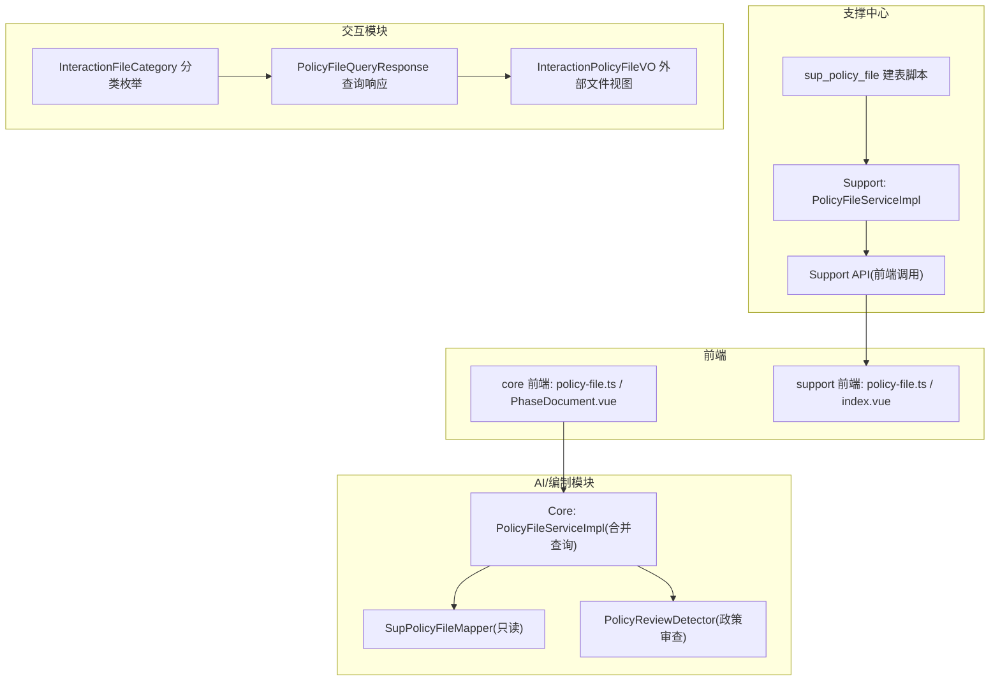
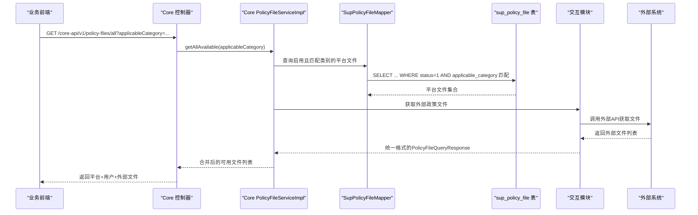
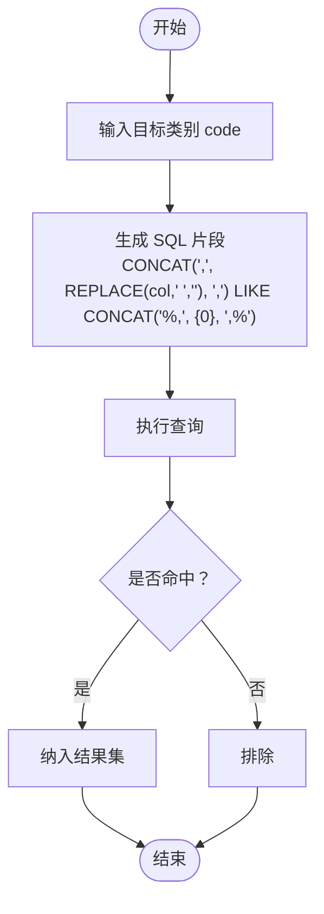
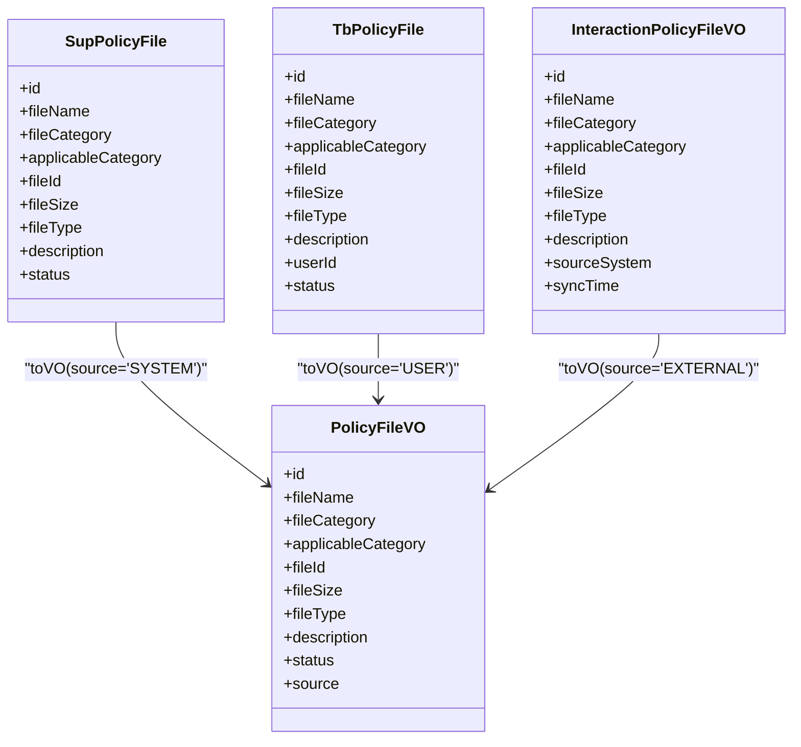
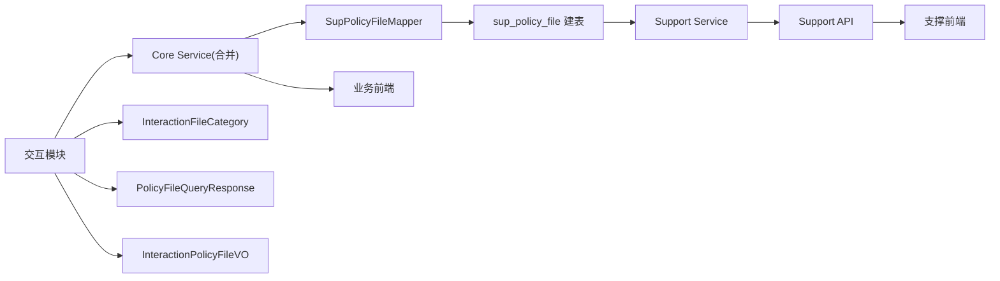

# 政策文件管理数据模型

<cite>
**本文引用的文件**
- [ele-ai-tender-system/ele-ai-tender-support/sql/init.sql](file://ele-ai-tender-system/ele-ai-tender-support/sql/init.sql)
- [ele-ai-tender-system/ele-ai-tender-common/src/main/java/com/jy/eleaitender/common/entity/support/SupPolicyFile.java](file://ele-ai-tender-system/ele-ai-tender-common/src/main/java/com/jy/eleaitender/common/entity/support/SupPolicyFile.java)
- [ele-ai-tender-system/ele-ai-tender-core/sql/init.sql](file://ele-ai-tender-system/ele-ai-tender-core/sql/init.sql)
- [ele-ai-tender-system/ele-ai-tender-common/src/main/java/com/jy/eleaitender/common/util/CommaSeparatedFieldSql.java](file://ele-ai-tender-system/ele-ai-tender-common/src/main/java/com/jy/eleaitender/common/util/CommaSeparatedFieldSql.java)
- [ele-ai-tender-system/ele-ai-tender-common/src/test/java/com/jy/eleaitender/common/util/CommaSeparatedFieldSqlTest.java](file://ele-ai-tender-system/ele-ai-tender-common/src/test/java/com/jy/eleaitender/common/util/CommaSeparatedFieldSqlTest.java)
- [ele-ai-tender-system/ele-ai-tender-common/src/main/java/com/jy/eleaitender/common/enums/ProjectCategory.java](file://ele-ai-tender-system/ele-ai-tender-common/src/main/java/com/jy/eleaitender/common/enums/ProjectCategory.java)
- [ele-ai-tender-system/ele-ai-tender-core/src/main/java/com/jy/eleaitender/core/service/impl/PolicyFileServiceImpl.java](file://ele-ai-tender-system/ele-ai-tender-core/src/main/java/com/jy/eleaitender/core/service/impl/PolicyFileServiceImpl.java)
- [ele-ai-tender-system/ele-ai-tender-core/src/main/java/com/jy/eleaitender/core/mapper/SupPolicyFileMapper.java](file://ele-ai-tender-system/ele-ai-tender-core/src/main/java/com/jy/eleaitender/core/mapper/SupPolicyFileMapper.java)
- [ele-ai-tender-system/ele-ai-tender-support/src/main/java/com/jy/eleaitender/support/service/impl/PolicyFileServiceImpl.java](file://ele-ai-tender-system/ele-ai-tender-support/src/main/java/com/jy/eleaitender/support/service/impl/PolicyFileServiceImpl.java)
- [ele-ai-tender-frontend/src/api/policy-file.ts](file://ele-ai-tender-frontend/src/api/policy-file.ts)
- [ele-ai-tender-frontend/src/components/detection/PolicyFileSelect.vue](file://ele-ai-tender-frontend/src/components/detection/PolicyFileSelect.vue)
- [ele-ai-tender-frontend/src/views/project/phases/PhaseDocument.vue](file://ele-ai-tender-frontend/src/views/project/phases/PhaseDocument.vue)
- [ele-ai-tender-support-frontend/src/api/policy-file.ts](file://ele-ai-tender-support-frontend/src/api/policy-file.ts)
- [ele-ai-tender-support-frontend/src/views/policy-file/index.vue](file://ele-ai-tender-support-frontend/src/views/policy-file/index.vue)
- [ele-ai-tender-system/ele-ai-tender-ai/src/main/java/com/jy/eleaitender/ai/processor/checker/PolicyReviewDetector.java](file://ele-ai-tender-system/ele-ai-tender-ai/src/main/java/com/jy/eleaitender/ai/processor/checker/PolicyReviewDetector.java)
- [docs/rules/CORE_MODULE_SPEC.md](file://docs/rules/CORE_MODULE_SPEC.md)
- [docs/rules/SUPPORT_SYSTEM_SPEC.md](file://docs/rules/SUPPORT_SYSTEM_SPEC.md)
- [ele-ai-tender-system/ele-ai-tender-interaction/ele-ai-tender-common-interaction/src/main/java/com/jy/eleaitender/common/interaction/enums/InteractionFileCategory.java](file://ele-ai-tender-system/ele-ai-tender-interaction/ele-ai-tender-common-interaction/src/main/java/com/jy/eleaitender/common/interaction/enums/InteractionFileCategory.java)
- [ele-ai-tender-system/ele-ai-tender-interaction/ele-ai-tender-common-interaction/src/main/java/com/jy/eleaitender/common/interaction/dto/PolicyFileQueryResponse.java](file://ele-ai-tender-system/ele-ai-tender-interaction/ele-ai-tender-common-interaction/src/main/java/com/jy/eleaitender/common/interaction/dto/PolicyFileQueryResponse.java)
- [ele-ai-tender-system/ele-ai-tender-interaction/ele-ai-tender-common-interaction/src/main/java/com/jy/eleaitender/common/interaction/dto/InteractionPolicyFileVO.java](file://ele-ai-tender-system/ele-ai-tender-interaction/ele-ai-tender-common-interaction/src/main/java/com/jy/eleaitender/common/interaction/dto/InteractionPolicyFileVO.java)
</cite>

## 更新摘要
**变更内容**
- 新增外部政策文件获取功能，支持从交互系统同步政策文件
- 引入分类枚举 InteractionFileCategory，规范政策文件分类体系
- 完善查询响应封装，提供统一的 PolicyFileQueryResponse 和 InteractionPolicyFileVO
- 扩展政策文件管理的完整功能链路，包括前端展示与后端处理

## 目录
1. [引言](#引言)
2. [项目结构](#项目结构)
3. [核心组件](#核心组件)
4. [架构总览](#架构总览)
5. [详细组件分析](#详细组件分析)
6. [依赖关系分析](#依赖关系分析)
7. [性能与扩展设计](#性能与扩展设计)
8. [故障排查指南](#故障排查指南)
9. [结论](#结论)
10. [附录](#附录)

## 引言
本文件围绕"系统政策文件表 sup_policy_file"的数据模型与使用方式，给出从数据库设计、实体映射、查询匹配到前端展示与检测联动的完整说明。重点覆盖：
- 字段设计与业务含义（文件基本信息、分类、适用项目类别、元数据）
- 多项目类别适配机制（逗号分隔多选）
- 平台级与用户级政策文件的统一检索与选择
- **新增** 外部政策文件获取与分类枚举管理
- 文件与服务存储的关联关系及预览方案
- 智能检索、匹配算法与合规性检查的技术实现指导
- 版本管理、批量上传、格式验证等扩展设计建议

## 项目结构
支撑中心负责平台级政策文件的管理（增删改查、状态控制），AI/编制模块在运行时读取并合并平台与用户级政策文件，供检测阶段选择与引用。**新增** 交互模块提供外部政策文件获取能力，通过统一的分类枚举和响应封装实现跨系统数据同步。

**图表来源**
- [ele-ai-tender-system/ele-ai-tender-support/sql/init.sql:300-326](file://ele-ai-tender-system/ele-ai-tender-support/sql/init.sql#L300-L326)
- [ele-ai-tender-system/ele-ai-tender-support/src/main/java/com/jy/eleaitender/support/service/impl/PolicyFileServiceImpl.java:19-86](file://ele-ai-tender-system/ele-ai-tender-support/src/main/java/com/jy/eleaitender/support/service/impl/PolicyFileServiceImpl.java#L19-L86)
- [ele-ai-tender-system/ele-ai-tender-core/src/main/java/com/jy/eleaitender/core/service/impl/PolicyFileServiceImpl.java:28-170](file://ele-ai-tender-system/ele-ai-tender-core/src/main/java/com/jy/eleaitender/core/service/impl/PolicyFileServiceImpl.java#L28-L170)
- [ele-ai-tender-system/ele-ai-tender-core/src/main/java/com/jy/eleaitender/core/mapper/SupPolicyFileMapper.java:10-12](file://ele-ai-tender-system/ele-ai-tender-core/src/main/java/com/jy/eleaitender/core/mapper/SupPolicyFileMapper.java#L10-L12)
- [ele-ai-tender-system/ele-ai-tender-ai/src/main/java/com/jy/eleaitender/ai/processor/checker/PolicyReviewDetector.java:1-37](file://ele-ai-tender-system/ele-ai-tender-ai/src/main/java/com/jy/eleaitender/ai/processor/checker/PolicyReviewDetector.java#L1-L37)
- [ele-ai-tender-system/ele-ai-tender-interaction/ele-ai-tender-common-interaction/src/main/java/com/jy/eleaitender/common/interaction/enums/InteractionFileCategory.java](file://ele-ai-tender-system/ele-ai-tender-interaction/ele-ai-tender-common-interaction/src/main/java/com/jy/eleaitender/common/interaction/enums/InteractionFileCategory.java)
- [ele-ai-tender-system/ele-ai-tender-interaction/ele-ai-tender-common-interaction/src/main/java/com/jy/eleaitender/common/interaction/dto/PolicyFileQueryResponse.java](file://ele-ai-tender-system/ele-ai-tender-interaction/ele-ai-tender-common-interaction/src/main/java/com/jy/eleaitender/common/interaction/dto/PolicyFileQueryResponse.java)
- [ele-ai-tender-system/ele-ai-tender-interaction/ele-ai-tender-common-interaction/src/main/java/com/jy/eleaitender/common/interaction/dto/InteractionPolicyFileVO.java](file://ele-ai-tender-system/ele-ai-tender-interaction/ele-ai-tender-common-interaction/src/main/java/com/jy/eleaitender/common/interaction/dto/InteractionPolicyFileVO.java)

章节来源
- [docs/rules/SUPPORT_SYSTEM_SPEC.md:193-215](file://docs/rules/SUPPORT_SYSTEM_SPEC.md#L193-L215)
- [docs/rules/CORE_MODULE_SPEC.md:127-137](file://docs/rules/CORE_MODULE_SPEC.md#L127-L137)

## 核心组件
- 数据库表 sup_policy_file：定义平台级政策文件的持久化结构，包含文件名称、分类、适用项目类别、文件服务ID、大小、类型、描述、状态及审计字段。
- 实体 SupPolicyFile：对应 sup_policy_file 表的 Java 实体，用于支撑中心与 AI/编制模块的读写与转换。
- 工具类 CommaSeparatedFieldSql：提供对逗号分隔字段的 SQL 片段生成与内存匹配能力，用于 applicable_category 的多值匹配。
- 枚举 ProjectCategory：定义项目类别代码与标签，作为 applicable_category 的取值规范。
- **新增** 分类枚举 InteractionFileCategory：规范外部政策文件分类体系，与内部分类保持一致。
- **新增** 查询响应封装 PolicyFileQueryResponse：统一外部政策文件查询结果的响应格式。
- **新增** 外部文件视图 InteractionPolicyFileVO：封装外部系统返回的政策文件信息。
- 服务层：
  - Support 侧 PolicyFileServiceImpl：面向管理端，提供分页、创建、更新、删除、状态切换等能力。
  - Core 侧 PolicyFileServiceImpl：面向运行期，合并平台与用户级政策文件，按适用类别过滤，返回统一视图。
- Mapper：SupPolicyFileMapper 为只读访问 sup_policy_file 的 MyBatis-Plus 接口。
- 前端：
  - 支撑前端：policy-file.ts 与 index.vue 提供列表、搜索、新增、编辑、状态切换、上传与提交。
  - 业务前端：policy-file.ts 与 PolicyFileSelect.vue、PhaseDocument.vue 提供"获取所有可用政策文件"和检测阶段的勾选联动。

章节来源
- [ele-ai-tender-system/ele-ai-tender-support/sql/init.sql:300-326](file://ele-ai-tender-system/ele-ai-tender-support/sql/init.sql#L300-L326)
- [ele-ai-tender-system/ele-ai-tender-common/src/main/java/com/jy/eleaitender/common/entity/support/SupPolicyFile.java:12-41](file://ele-ai-tender-system/ele-ai-tender-common/src/main/java/com/jy/eleaitender/common/entity/support/SupPolicyFile.java#L12-L41)
- [ele-ai-tender-system/ele-ai-tender-common/src/main/java/com/jy/eleaitender/common/util/CommaSeparatedFieldSql.java:1-32](file://ele-ai-tender-system/ele-ai-tender-common/src/main/java/com/jy/eleaitender/common/util/CommaSeparatedFieldSql.java#L1-L32)
- [ele-ai-tender-system/ele-ai-tender-common/src/main/java/com/jy/eleaitender/common/enums/ProjectCategory.java:1-28](file://ele-ai-tender-system/ele-ai-tender-common/src/main/java/com/jy/eleaitender/common/enums/ProjectCategory.java#L1-L28)
- [ele-ai-tender-system/ele-ai-tender-support/src/main/java/com/jy/eleaitender/support/service/impl/PolicyFileServiceImpl.java:19-86](file://ele-ai-tender-system/ele-ai-tender-support/src/main/java/com/jy/eleaitender/support/service/impl/PolicyFileServiceImpl.java#L19-L86)
- [ele-ai-tender-system/ele-ai-tender-core/src/main/java/com/jy/eleaitender/core/service/impl/PolicyFileServiceImpl.java:28-170](file://ele-ai-tender-system/ele-ai-tender-core/src/main/java/com/jy/eleaitender/core/service/impl/PolicyFileServiceImpl.java#L28-L170)
- [ele-ai-tender-system/ele-ai-tender-core/src/main/java/com/jy/eleaitender/core/mapper/SupPolicyFileMapper.java:10-12](file://ele-ai-tender-system/ele-ai-tender-core/src/main/java/com/jy/eleaitender/core/mapper/SupPolicyFileMapper.java#L10-L12)
- [ele-ai-tender-system/ele-ai-tender-interaction/ele-ai-tender-common-interaction/src/main/java/com/jy/eleaitender/common/interaction/enums/InteractionFileCategory.java](file://ele-ai-tender-system/ele-ai-tender-interaction/ele-ai-tender-common-interaction/src/main/java/com/jy/eleaitender/common/interaction/enums/InteractionFileCategory.java)
- [ele-ai-tender-system/ele-ai-tender-interaction/ele-ai-tender-common-interaction/src/main/java/com/jy/eleaitender/common/interaction/dto/PolicyFileQueryResponse.java](file://ele-ai-tender-system/ele-ai-tender-interaction/ele-ai-tender-common-interaction/src/main/java/com/jy/eleaitender/common/interaction/dto/PolicyFileQueryResponse.java)
- [ele-ai-tender-system/ele-ai-tender-interaction/ele-ai-tender-common-interaction/src/main/java/com/jy/eleaitender/common/interaction/dto/InteractionPolicyFileVO.java](file://ele-ai-tender-system/ele-ai-tender-interaction/ele-ai-tender-common-interaction/src/main/java/com/jy/eleaitender/common/interaction/dto/InteractionPolicyFileVO.java)
- [ele-ai-tender-support-frontend/src/api/policy-file.ts:1-29](file://ele-ai-tender-support-frontend/src/api/policy-file.ts#L1-L29)
- [ele-ai-tender-support-frontend/src/views/policy-file/index.vue:221-315](file://ele-ai-tender-support-frontend/src/views/policy-file/index.vue#L221-L315)
- [ele-ai-tender-frontend/src/api/policy-file.ts:1-42](file://ele-ai-tender-frontend/src/api/policy-file.ts#L1-L42)
- [ele-ai-tender-frontend/src/components/detection/PolicyFileSelect.vue:1-40](file://ele-ai-tender-frontend/src/components/detection/PolicyFileSelect.vue#L1-L40)
- [ele-ai-tender-frontend/src/views/project/phases/PhaseDocument.vue:324-357](file://ele-ai-tender-frontend/src/views/project/phases/PhaseDocument.vue#L324-L357)

## 架构总览
平台级政策文件由支撑中心维护，AI/编制模块通过只读 Mapper 读取 sup_policy_file，并与用户级政策文件合并，形成"可用政策文件集"，供检测阶段选择与后续合规性审查。**新增** 交互模块提供外部政策文件获取能力，通过统一的分类枚举和响应封装实现跨系统数据同步。

**图表来源**
- [ele-ai-tender-frontend/src/api/policy-file.ts:31-36](file://ele-ai-tender-frontend/src/api/policy-file.ts#L31-L36)
- [ele-ai-tender-system/ele-ai-tender-core/src/main/java/com/jy/eleaitender/core/service/impl/PolicyFileServiceImpl.java:104-135](file://ele-ai-tender-system/ele-ai-tender-core/src/main/java/com/jy/eleaitender/core/service/impl/PolicyFileServiceImpl.java#L104-L135)
- [ele-ai-tender-system/ele-ai-tender-core/src/main/java/com/jy/eleaitender/core/mapper/SupPolicyFileMapper.java:10-12](file://ele-ai-tender-system/ele-ai-tender-core/src/main/java/com/jy/eleaitender/core/mapper/SupPolicyFileMapper.java#L10-L12)
- [ele-ai-tender-system/ele-ai-tender-support/sql/init.sql:300-326](file://ele-ai-tender-system/ele-ai-tender-support/sql/init.sql#L300-L326)
- [ele-ai-tender-system/ele-ai-tender-interaction/ele-ai-tender-common-interaction/src/main/java/com/jy/eleaitender/common/interaction/dto/PolicyFileQueryResponse.java](file://ele-ai-tender-system/ele-ai-tender-interaction/ele-ai-tender-common-interaction/src/main/java/com/jy/eleaitender/common/interaction/dto/PolicyFileQueryResponse.java)

## 详细组件分析

### sup_policy_file 表结构设计
- 主键 id：自增主键。
- 文件基本信息
  - file_name：文件名称，必填。
  - description：文件描述，可选。
- 分类管理
  - file_category：文件分类，固定取值 LAW/REGULATION/POLICY。
- 适用项目类别
  - applicable_category：支持多个类别，逗号分隔；取值为 SMALL_TRADE/GOVERNMENT_PROCUREMENT/COMPREHENSIVE_TRADE。
- 文件元数据
  - file_id：关联文件服务的 file_id。
  - file_size：文件大小（字节）。
  - file_type：文件格式，如 PDF/DOCX/DOC/XLSX。
- 状态与审计
  - status：启用/禁用。
  - create_time/create_id/create_name、modify_time/modify_id/modify_name、ver、is_delete：标准审计与乐观锁字段。
- 索引
  - idx_file_category、idx_applicable_category、idx_status：提升按分类、适用类别与状态的查询效率。

章节来源
- [ele-ai-tender-system/ele-ai-tender-support/sql/init.sql:300-326](file://ele-ai-tender-system/ele-ai-tender-support/sql/init.sql#L300-L326)

### 实体映射 SupPolicyFile
- 注解 @TableName("sup_policy_file") 将实体与表绑定。
- 字段与表字段一一对应，便于 MyBatis-Plus 自动映射。
- 继承 BaseEntity，复用通用审计字段。

章节来源
- [ele-ai-tender-system/ele-ai-tender-common/src/main/java/com/jy/eleaitender/common/entity/support/SupPolicyFile.java:12-41](file://ele-ai-tender-system/ele-ai-tender-common/src/main/java/com/jy/eleaitender/common/entity/support/SupPolicyFile.java#L12-L41)

### 多项目类别适配机制（逗号分隔多选）
- 存储约定：applicable_category 以逗号分隔存储多个类别代码，允许前后空格。
- 匹配策略：
  - SQL 层：使用 CommaSeparatedFieldSql.contains 生成的片段进行 LIKE 匹配，避免部分匹配误判。
  - 内存层：CommaSeparatedFieldSql.containsValue 对字符串进行规范化后逐项比较。
- 空值处理：当 applicable_category 为空或 null 时，视为"不限制"，在合并查询中默认纳入结果。

**图表来源**
- [ele-ai-tender-system/ele-ai-tender-common/src/main/java/com/jy/eleaitender/common/util/CommaSeparatedFieldSql.java:11-13](file://ele-ai-tender-system/ele-ai-tender-common/src/main/java/com/jy/eleaitender/common/util/CommaSeparatedFieldSql.java#L11-L13)
- [ele-ai-tender-system/ele-ai-tender-common/src/test/java/com/jy/eleaitender/common/util/CommaSeparatedFieldSqlTest.java:10-33](file://ele-ai-tender-system/ele-ai-tender-common/src/test/java/com/jy/eleaitender/common/util/CommaSeparatedFieldSqlTest.java#L10-L33)

章节来源
- [ele-ai-tender-system/ele-ai-tender-common/src/main/java/com/jy/eleaitender/common/util/CommaSeparatedFieldSql.java:1-32](file://ele-ai-tender-system/ele-ai-tender-common/src/main/java/com/jy/eleaitender/common/util/CommaSeparatedFieldSql.java#L1-L32)
- [ele-ai-tender-system/ele-ai-tender-common/src/test/java/com/jy/eleaitender/common/util/CommaSeparatedFieldSqlTest.java:1-34](file://ele-ai-tender-system/ele-ai-tender-common/src/test/java/com/jy/eleaitender/common/util/CommaSeparatedFieldSqlTest.java#L1-L34)

### 分类体系与业务含义
- LAW（法律法规）：国家或地方颁布的法律、法规类文件，具有强制约束力。
- REGULATION（规章制度）：行业或企业内部制度、规范类文件，用于指导具体操作。
- POLICY（政策文件）：指导性政策、通知、意见等，通常作为参考依据。
- **新增** 外部分类枚举 InteractionFileCategory：与内部分类保持一致，确保跨系统数据交换的规范性。
- 使用场景：在招标文件编制与检测阶段，根据项目类别（小额交易/政府采购/综合交易）筛选适用的政策文件，辅助合规性审查。

章节来源
- [ele-ai-tender-system/ele-ai-tender-support/sql/init.sql:306-308](file://ele-ai-tender-system/ele-ai-tender-support/sql/init.sql#L306-L308)
- [docs/rules/SUPPORT_SYSTEM_SPEC.md:209-215](file://docs/rules/SUPPORT_SYSTEM_SPEC.md#L209-L215)
- [ele-ai-tender-system/ele-ai-tender-interaction/ele-ai-tender-common-interaction/src/main/java/com/jy/eleaitender/common/interaction/enums/InteractionFileCategory.java](file://ele-ai-tender-system/ele-ai-tender-interaction/ele-ai-tender-common-interaction/src/main/java/com/jy/eleaitender/common/interaction/enums/InteractionFileCategory.java)

### 文件与服务存储的关联关系
- file_id 指向文件服务中的文件记录，用于下载与预览。
- 前端在创建平台政策文件时，先调用文件服务上传，获得 fileId 后再写入 sup_policy_file。
- 预览方案：
  - 直接预览：若文件服务提供在线预览地址，可直接跳转。
  - 下载预览：通过文件服务下载接口获取流，前端使用文档预览组件渲染。

章节来源
- [ele-ai-tender-support-frontend/src/views/policy-file/index.vue:265-285](file://ele-ai-tender-support-frontend/src/views/policy-file/index.vue#L265-285)
- [ele-ai-tender-frontend/src/views/project/phases/PhaseDocument.vue:343-357](file://ele-ai-tender-frontend/src/views/project/phases/PhaseDocument.vue#L343-L357)

### 平台级与用户级政策文件的统一检索
- 平台级：仅查询 sup_policy_file，按 status=1 与 applicable_category 匹配过滤。
- 用户级：查询 tb_policy_file，按当前用户隔离与 status=1 过滤。
- **新增** 外部级：通过交互模块获取外部政策文件，使用 PolicyFileQueryResponse 统一响应格式。
- 合并输出：统一转换为 PolicyFileVO，标注 source 为 SYSTEM、USER 或 EXTERNAL，供前端展示与选择。

**图表来源**
- [ele-ai-tender-system/ele-ai-tender-common/src/main/java/com/jy/eleaitender/common/entity/support/SupPolicyFile.java:12-41](file://ele-ai-tender-system/ele-ai-tender-common/src/main/java/com/jy/eleaitender/common/entity/support/SupPolicyFile.java#L12-L41)
- [ele-ai-tender-system/ele-ai-tender-core/sql/init.sql:186-203](file://ele-ai-tender-system/ele-ai-tender-core/sql/init.sql#L186-L203)
- [ele-ai-tender-system/ele-ai-tender-core/src/main/java/com/jy/eleaitender/core/service/impl/PolicyFileServiceImpl.java:137-169](file://ele-ai-tender-system/ele-ai-tender-core/src/main/java/com/jy/eleaitender/core/service/impl/PolicyFileServiceImpl.java#L137-L169)
- [ele-ai-tender-system/ele-ai-tender-interaction/ele-ai-tender-common-interaction/src/main/java/com/jy/eleaitender/common/interaction/dto/InteractionPolicyFileVO.java](file://ele-ai-tender-system/ele-ai-tender-interaction/ele-ai-tender-common-interaction/src/main/java/com/jy/eleaitender/common/interaction/dto/InteractionPolicyFileVO.java)

章节来源
- [ele-ai-tender-system/ele-ai-tender-core/src/main/java/com/jy/eleaitender/core/service/impl/PolicyFileServiceImpl.java:104-135](file://ele-ai-tender-system/ele-ai-tender-core/src/main/java/com/jy/eleaitender/core/service/impl/PolicyFileServiceImpl.java#L104-L135)

### 前端交互与选择流程
- 支撑前端：
  - 列表页支持按文件名、分类、适用类别搜索。
  - 新建时先上传文件至文件服务，再回填 fileName/fileSize/fileType/fileId 并提交。
- 业务前端：
  - 调用 /all 接口获取"平台+用户+外部"可用政策文件，默认勾选平台文件。
  - 确认后将选中的 fileId 列表传递给检测阶段，驱动后续合规性审查。

章节来源
- [ele-ai-tender-support-frontend/src/api/policy-file.ts:1-29](file://ele-ai-tender-support-frontend/src/api/policy-file.ts#L1-L29)
- [ele-ai-tender-support-frontend/src/views/policy-file/index.vue:221-315](file://ele-ai-tender-support-frontend/src/views/policy-file/index.vue#L221-L315)
- [ele-ai-tender-frontend/src/api/policy-file.ts:31-36](file://ele-ai-tender-frontend/src/api/policy-file.ts#L31-L36)
- [ele-ai-tender-frontend/src/components/detection/PolicyFileSelect.vue:1-40](file://ele-ai-tender-frontend/src/components/detection/PolicyFileSelect.vue#L1-L40)
- [ele-ai-tender-frontend/src/views/project/phases/PhaseDocument.vue:324-357](file://ele-ai-tender-frontend/src/views/project/phases/PhaseDocument.vue#L324-L357)

### 智能功能与技术实现指导
- 检索与匹配
  - 基于 CommaSeparatedFieldSql 的 SQL 片段进行精确匹配，避免子串误匹配。
  - 支持空值"不限制"语义，便于平台级文件的全量推荐。
- 合规性检查
  - 检测阶段通过 PolicyReviewDetector 触发政策审查，结合所选政策文件内容生成提示词，交由大模型进行比对与出具问题清单。
- 知识库联动
  - 前端可拉取知识库中的政策类文档，将其 fileId 一并传入检测流程，丰富审查依据。
- **新增** 外部文件同步
  - 通过交互模块定期同步外部政策文件，使用统一的分类枚举确保数据一致性。
  - 支持增量同步与全量同步两种模式，提高同步效率。

章节来源
- [ele-ai-tender-system/ele-ai-tender-common/src/main/java/com/jy/eleaitender/common/util/CommaSeparatedFieldSql.java:11-13](file://ele-ai-tender-system/ele-ai-tender-common/src/main/java/com/jy/eleaitender/common/util/CommaSeparatedFieldSql.java#L11-L13)
- [ele-ai-tender-system/ele-ai-tender-ai/src/main/java/com/jy/eleaitender/ai/processor/checker/PolicyReviewDetector.java:1-37](file://ele-ai-tender-system/ele-ai-tender-ai/src/main/java/com/jy/eleaitender/ai/processor/checker/PolicyReviewDetector.java#L1-L37)
- [ele-ai-tender-frontend/src/api/policy-file.ts:38-41](file://ele-ai-tender-frontend/src/api/policy-file.ts#L38-L41)
- [ele-ai-tender-system/ele-ai-tender-interaction/ele-ai-tender-common-interaction/src/main/java/com/jy/eleaitender/common/interaction/dto/PolicyFileQueryResponse.java](file://ele-ai-tender-system/ele-ai-tender-interaction/ele-ai-tender-common-interaction/src/main/java/com/jy/eleaitender/common/interaction/dto/PolicyFileQueryResponse.java)

## 依赖关系分析
- 支撑中心依赖 sup_policy_file 表，提供管理端 CRUD 与状态控制。
- AI/编制模块通过 SupPolicyFileMapper 只读访问 sup_policy_file，并在服务层与用户级文件合并。
- **新增** 交互模块提供外部政策文件获取能力，通过统一的分类枚举和响应封装实现跨系统数据同步。
- 前端分别对接支撑与业务两套 API，完成管理与使用场景的闭环。

**图表来源**
- [ele-ai-tender-system/ele-ai-tender-support/sql/init.sql:300-326](file://ele-ai-tender-system/ele-ai-tender-support/sql/init.sql#L300-L326)
- [ele-ai-tender-system/ele-ai-tender-support/src/main/java/com/jy/eleaitender/support/service/impl/PolicyFileServiceImpl.java:19-86](file://ele-ai-tender-system/ele-ai-tender-support/src/main/java/com/jy/eleaitender/support/service/impl/PolicyFileServiceImpl.java#L19-L86)
- [ele-ai-tender-system/ele-ai-tender-core/src/main/java/com/jy/eleaitender/core/service/impl/PolicyFileServiceImpl.java:28-170](file://ele-ai-tender-system/ele-ai-tender-core/src/main/java/com/jy/eleaitender/core/service/impl/PolicyFileServiceImpl.java#L28-L170)
- [ele-ai-tender-system/ele-ai-tender-core/src/main/java/com/jy/eleaitender/core/mapper/SupPolicyFileMapper.java:10-12](file://ele-ai-tender-system/ele-ai-tender-core/src/main/java/com/jy/eleaitender/core/mapper/SupPolicyFileMapper.java#L10-L12)
- [ele-ai-tender-system/ele-ai-tender-interaction/ele-ai-tender-common-interaction/src/main/java/com/jy/eleaitender/common/interaction/enums/InteractionFileCategory.java](file://ele-ai-tender-system/ele-ai-tender-interaction/ele-ai-tender-common-interaction/src/main/java/com/jy/eleaitender/common/interaction/enums/InteractionFileCategory.java)
- [ele-ai-tender-system/ele-ai-tender-interaction/ele-ai-tender-common-interaction/src/main/java/com/jy/eleaitender/common/interaction/dto/PolicyFileQueryResponse.java](file://ele-ai-tender-system/ele-ai-tender-interaction/ele-ai-tender-common-interaction/src/main/java/com/jy/eleaitender/common/interaction/dto/PolicyFileQueryResponse.java)
- [ele-ai-tender-system/ele-ai-tender-interaction/ele-ai-tender-common-interaction/src/main/java/com/jy/eleaitender/common/interaction/dto/InteractionPolicyFileVO.java](file://ele-ai-tender-system/ele-ai-tender-interaction/ele-ai-tender-common-interaction/src/main/java/com/jy/eleaitender/common/interaction/dto/InteractionPolicyFileVO.java)

章节来源
- [docs/rules/SUPPORT_SYSTEM_SPEC.md:193-215](file://docs/rules/SUPPORT_SYSTEM_SPEC.md#L193-L215)
- [docs/rules/CORE_MODULE_SPEC.md:127-137](file://docs/rules/CORE_MODULE_SPEC.md#L127-L137)

## 性能与扩展设计
- 查询优化
  - 利用 idx_file_category、idx_applicable_category、idx_status 索引加速常用过滤条件。
  - 对于高频匹配，可在应用层缓存"平台级可用文件集"，减少重复 IO。
- 可扩展点
  - 版本管理：在 sup_policy_file 增加 version_no 与 is_default 字段，配合变更日志与回滚策略。
  - 批量上传：支撑前端已具备单文件上传与校验逻辑，可封装批量上传接口，异步处理并返回进度。
  - 格式验证：在前端与后端双重校验 fileType 白名单（PDF/DOCX/DOC/XLSX），并结合文件头签名校验。
  - 预览增强：根据 fileType 动态选择预览组件，对不支持的类型提供下载入口。
  - **新增** 外部同步优化：支持增量同步策略，仅同步变更的外部文件，提高同步效率。
  - **新增** 分类缓存：缓存分类枚举映射，减少跨系统分类转换的性能开销。

[本节为通用建议，无需源码引用]

## 故障排查指南
- 匹配不到政策文件
  - 检查 applicable_category 是否为空或包含多余空格；确认 CommaSeparatedFieldSql 生成的 SQL 片段是否正确拼接。
  - 核对 status 是否为启用状态。
- 权限与归属
  - 用户级文件需满足 user_id 隔离；平台级文件不受用户隔离影响。
- 文件预览失败
  - 确认 file_id 有效且文件服务可达；检查前端预览组件支持的格式是否与 file_type 一致。
- **新增** 外部文件同步问题
  - 检查交互模块配置是否正确，外部系统连接是否正常。
  - 确认分类枚举映射是否一致，避免因分类不一致导致同步失败。
  - 查看同步日志，定位具体的错误原因。

章节来源
- [ele-ai-tender-system/ele-ai-tender-common/src/main/java/com/jy/eleaitender/common/util/CommaSeparatedFieldSql.java:11-13](file://ele-ai-tender-system/ele-ai-tender-common/src/main/java/com/jy/eleaitender/common/util/CommaSeparatedFieldSql.java#L11-L13)
- [ele-ai-tender-system/ele-ai-tender-core/src/main/java/com/jy/eleaitender/core/service/impl/PolicyFileServiceImpl.java:104-135](file://ele-ai-tender-system/ele-ai-tender-core/src/main/java/com/jy/eleaitender/core/service/impl/PolicyFileServiceImpl.java#L104-L135)

## 结论
sup_policy_file 作为平台级政策文件的核心载体，通过清晰的字段设计与灵活的适用类别机制，支撑了跨项目类别的政策文件管理与智能检测联动。配合 CommaSeparatedFieldSql 的精确匹配与前后端的统一视图，实现了高效、可扩展的政策文件生态。**新增** 的外部政策文件获取功能进一步丰富了政策文件来源，通过统一的分类枚举和响应封装确保了跨系统数据的一致性与可靠性。

[本节为总结性内容，无需源码引用]

## 附录
- 项目类别枚举
  - SMALL_TRADE：小额交易
  - GOVERNMENT_PROCUREMENT：政府采购
  - COMPREHENSIVE_TRADE：综合交易
- **新增** 外部分类枚举
  - LAW：法律法规
  - REGULATION：规章制度  
  - POLICY：政策文件
- **新增** 响应封装
  - PolicyFileQueryResponse：统一外部政策文件查询响应格式
  - InteractionPolicyFileVO：外部系统政策文件视图对象

章节来源
- [ele-ai-tender-system/ele-ai-tender-common/src/main/java/com/jy/eleaitender/common/enums/ProjectCategory.java:11-18](file://ele-ai-tender-system/ele-ai-tender-common/src/main/java/com/jy/eleaitender/common/enums/ProjectCategory.java#L11-L18)
- [ele-ai-tender-system/ele-ai-tender-interaction/ele-ai-tender-common-interaction/src/main/java/com/jy/eleaitender/common/interaction/enums/InteractionFileCategory.java](file://ele-ai-tender-system/ele-ai-tender-interaction/ele-ai-tender-common-interaction/src/main/java/com/jy/eleaitender/common/interaction/enums/InteractionFileCategory.java)
- [ele-ai-tender-system/ele-ai-tender-interaction/ele-ai-tender-common-interaction/src/main/java/com/jy/eleaitender/common/interaction/dto/PolicyFileQueryResponse.java](file://ele-ai-tender-system/ele-ai-tender-interaction/ele-ai-tender-common-interaction/src/main/java/com/jy/eleaitender/common/interaction/dto/PolicyFileQueryResponse.java)
- [ele-ai-tender-system/ele-ai-tender-interaction/ele-ai-tender-common-interaction/src/main/java/com/jy/eleaitender/common/interaction/dto/InteractionPolicyFileVO.java](file://ele-ai-tender-system/ele-ai-tender-interaction/ele-ai-tender-common-interaction/src/main/java/com/jy/eleaitender/common/interaction/dto/InteractionPolicyFileVO.java)