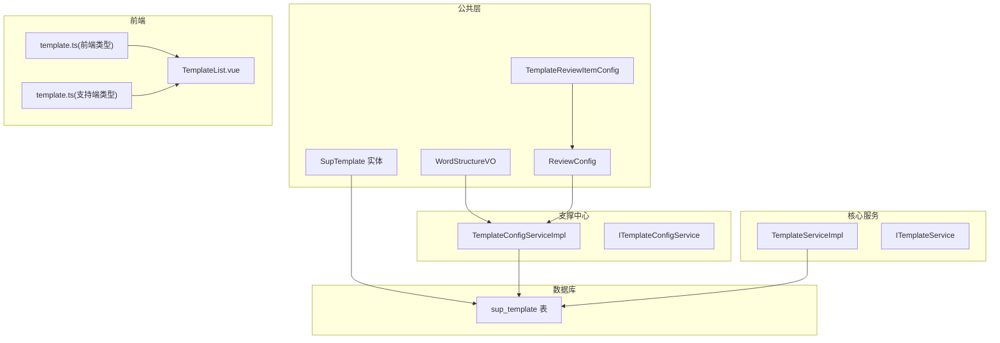
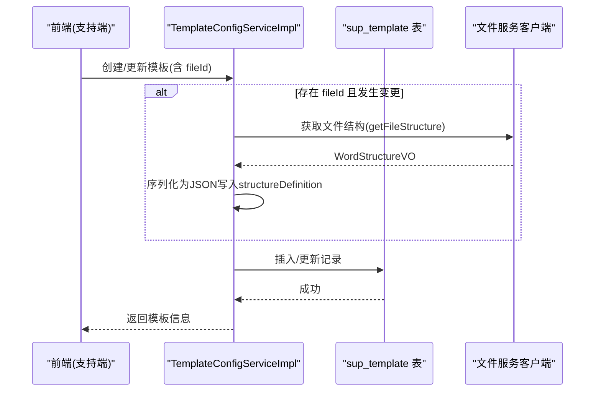
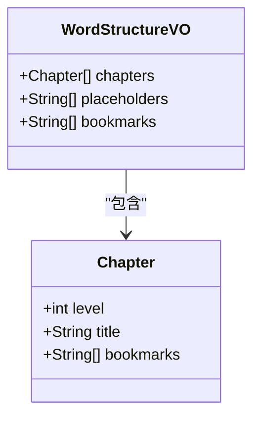
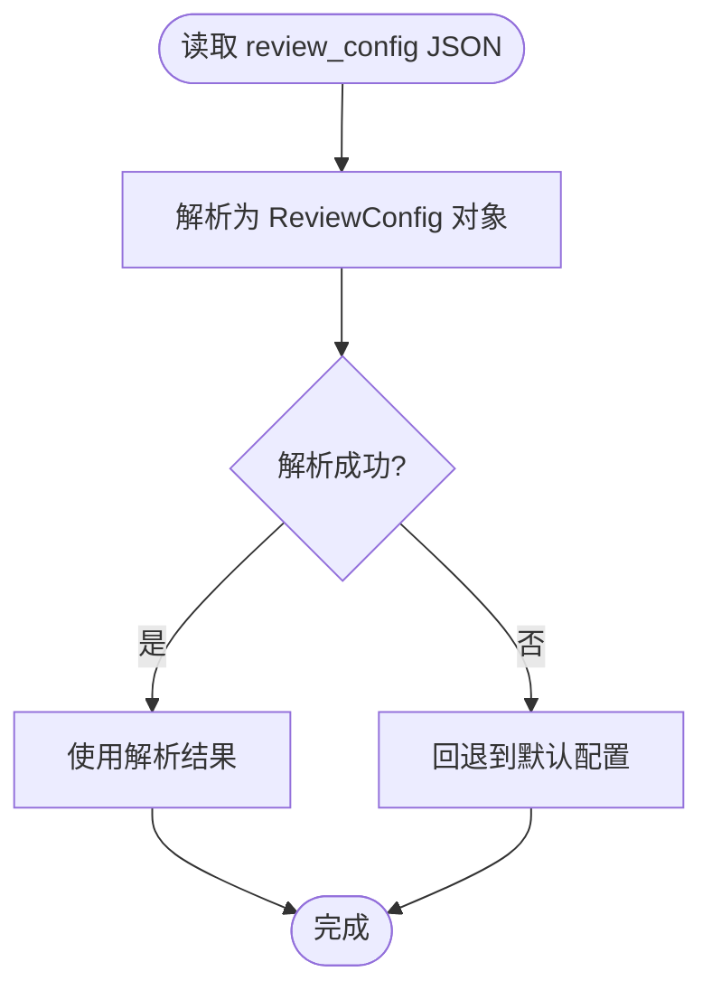
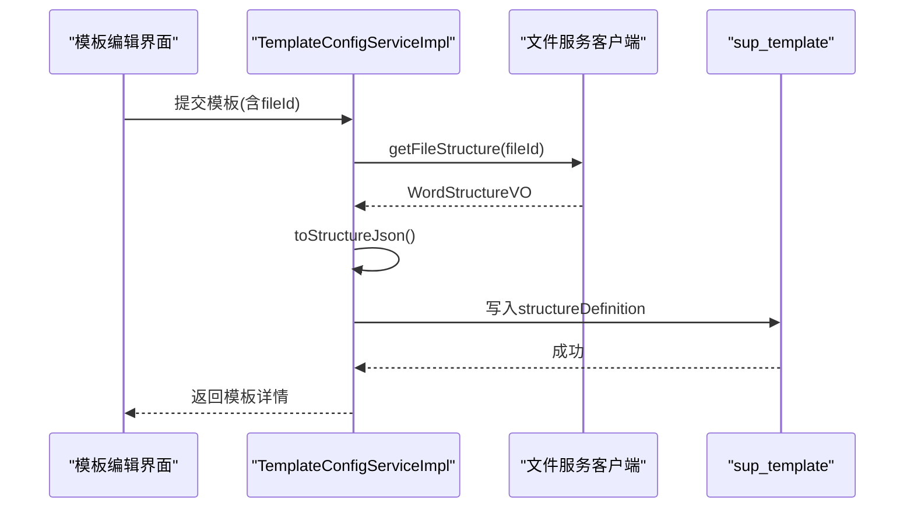
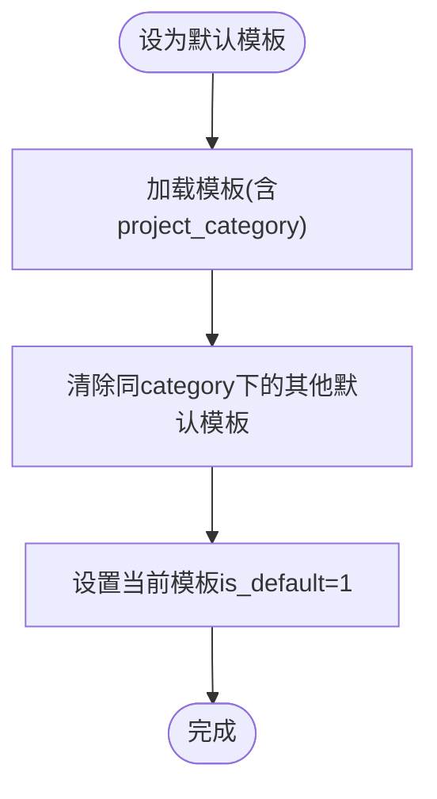
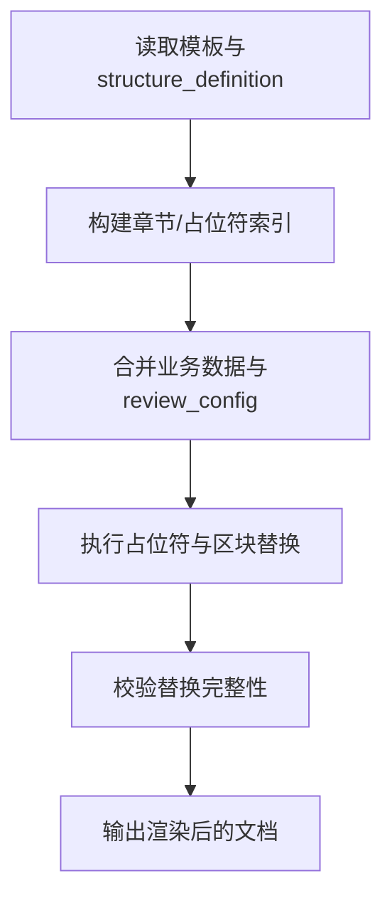
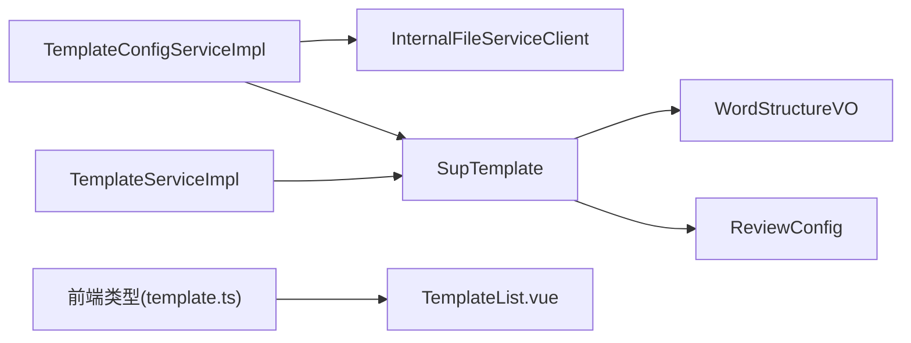

# 模板管理数据模型

<cite>
**本文引用的文件**   
- [SupTemplate.java](file://ele-ai-tender-system/ele-ai-tender-common/src/main/java/com/jy/eleaitender/common/entity/support/SupTemplate.java)
- [init.sql（支撑中心）](file://ele-ai-tender-system/ele-ai-tender-support/sql/init.sql)
- [SUPPORT_SYSTEM_SPEC.md](file://docs/rules/SUPPORT_SYSTEM_SPEC.md)
- [TemplateServiceImpl.java](file://ele-ai-tender-system/ele-ai-tender-core/src/main/java/com/jy/eleaitender/core/service/impl/TemplateServiceImpl.java)
- [ITemplateService.java](file://ele-ai-tender-system/ele-ai-tender-core/src/main/java/com/jy/eleaitender/core/service/ITemplateService.java)
- [TemplateConfigServiceImpl.java](file://ele-ai-tender-system/ele-ai-tender-support/src/main/java/com/jy/eleaitender/support/service/impl/TemplateConfigServiceImpl.java)
- [ITemplateConfigService.java](file://ele-ai-tender-system/ele-ai-tender-support/src/main/java/com/jy/eleaitender/support/service/ITemplateConfigService.java)
- [WordStructureVO.java](file://ele-ai-tender-system/ele-ai-tender-common/src/main/java/com/jy/eleaitender/common/dto/response/WordStructureVO.java)
- [ReviewConfig.java](file://ele-ai-tender-system/ele-ai-tender-common/src/main/java/com/jy/eleaitender/common/dto/ReviewConfig.java)
- [TemplateReviewItemConfig.java](file://ele-ai-tender-system/ele-ai-tender-common/src/main/java/com/jy/eleaitender/common/dto/TemplateReviewItemConfig.java)
- [template.ts（前端类型）](file://ele-ai-tender-frontend/src/types/template.ts)
- [template.ts（支持端类型）](file://ele-ai-tender-support-frontend/src/types/template.ts)
- [TemplateList.vue（支持端）](file://ele-ai-tender-support-frontend/src/views/template/TemplateList.vue)
</cite>

## 目录
1. [引言](#引言)
2. [项目结构](#项目结构)
3. [核心组件](#核心组件)
4. [架构总览](#架构总览)
5. [详细组件分析](#详细组件分析)
6. [依赖关系分析](#依赖关系分析)
7. [性能与扩展性考虑](#性能与扩展性考虑)
8. [故障排查指南](#故障排查指南)
9. [结论](#结论)
10. [附录](#附录)

## 引言
本文件围绕招标文件模板管理的数据模型进行系统化说明，重点阐述 sup_template 表的结构设计、JSON 字段定义（structure_definition 与 review_config）、模板与文件服务的关联机制、状态管理与版本策略，并给出模板引擎集成方案与导入导出、批量操作、权限控制等扩展设计建议。文档面向业务与技术读者，力求在保持严谨性的同时易于理解。

## 项目结构
与模板管理相关的关键代码分布在以下模块：
- 公共实体与DTO：SupTemplate 实体、WordStructureVO、ReviewConfig、TemplateReviewItemConfig
- 支撑中心服务：TemplateConfigServiceImpl 提供模板的增删改查、默认设置、状态切换及 Word 结构解析
- 核心服务：TemplateServiceImpl 提供核心模板能力（分页、默认模板、默认值填充、设为默认等）
- 数据库脚本：支撑中心 init.sql 中 sup_template 建表语句
- 前端类型与页面：前后端 TypeScript 类型定义与模板列表页交互

图表来源
- [SupTemplate.java:1-52](file://ele-ai-tender-system/ele-ai-tender-common/src/main/java/com/jy/eleaitender/common/entity/support/SupTemplate.java#L1-L52)
- [WordStructureVO.java:1-40](file://ele-ai-tender-system/ele-ai-tender-common/src/main/java/com/jy/eleaitender/common/dto/response/WordStructureVO.java#L1-L40)
- [ReviewConfig.java:38-103](file://ele-ai-tender-system/ele-ai-tender-common/src/main/java/com/jy/eleaitender/common/dto/ReviewConfig.java#L38-L103)
- [TemplateReviewItemConfig.java:1-32](file://ele-ai-tender-system/ele-ai-tender-common/src/main/java/com/jy/eleaitender/common/dto/TemplateReviewItemConfig.java#L1-L32)
- [TemplateConfigServiceImpl.java:1-154](file://ele-ai-tender-system/ele-ai-tender-support/src/main/java/com/jy/eleaitender/support/service/impl/TemplateConfigServiceImpl.java#L1-L154)
- [TemplateServiceImpl.java:1-125](file://ele-ai-tender-system/ele-ai-tender-core/src/main/java/com/jy/eleaitender/core/service/impl/TemplateServiceImpl.java#L1-L125)
- [init.sql（支撑中心）:440-467](file://ele-ai-tender-system/ele-ai-tender-support/sql/init.sql#L440-L467)
- [template.ts（前端类型）:1-29](file://ele-ai-tender-frontend/src/types/template.ts#L1-L29)
- [template.ts（支持端类型）:1-53](file://ele-ai-tender-support-frontend/src/types/template.ts#L1-L53)
- [TemplateList.vue（支持端）:376-828](file://ele-ai-tender-support-frontend/src/views/template/TemplateList.vue#L376-L828)

章节来源
- [SUPPORT_SYSTEM_SPEC.md:193-215](file://docs/rules/SUPPORT_SYSTEM_SPEC.md#L193-L215)

## 核心组件
- SupTemplate 实体：映射 sup_template 表，包含模板名称、适用类别/类型、文件ID、内容说明、结构定义 JSON、评审配置 JSON、版本号、是否默认、状态等字段。
- WordStructureVO：描述 Word 文档的章节、占位符与书签结构，用于 structure_definition 的序列化存储。
- ReviewConfig：评审项配置根对象，包含评分模式与各评审类型的开关、标准生成、主客观区分等；并提供从 JSON 解析与默认配置回退逻辑。
- TemplateReviewItemConfig：评审项树节点，支持层级、权重、分值、主观/客观、是否必填等属性。

章节来源
- [SupTemplate.java:1-52](file://ele-ai-tender-system/ele-ai-tender-common/src/main/java/com/jy/eleaitender/common/entity/support/SupTemplate.java#L1-L52)
- [WordStructureVO.java:1-40](file://ele-ai-tender-system/ele-ai-tender-common/src/main/java/com/jy/eleaitender/common/dto/response/WordStructureVO.java#L1-L40)
- [ReviewConfig.java:38-103](file://ele-ai-tender-system/ele-ai-tender-common/src/main/java/com/jy/eleaitender/common/dto/ReviewConfig.java#L38-L103)
- [TemplateReviewItemConfig.java:1-32](file://ele-ai-tender-system/ele-ai-tender-common/src/main/java/com/jy/eleaitender/common/dto/TemplateReviewItemConfig.java#L1-L32)

## 架构总览
模板管理涉及“支撑中心”和“核心服务”两个服务层，分别承担模板配置管理与核心模板能力。支撑中心负责模板的创建、更新、默认设置、状态切换以及 Word 文件结构解析；核心服务提供通用查询、默认模板获取、默认值填充与设为默认等能力。

图表来源
- [TemplateConfigServiceImpl.java:58-98](file://ele-ai-tender-system/ele-ai-tender-support/src/main/java/com/jy/eleaitender/support/service/impl/TemplateConfigServiceImpl.java#L58-L98)
- [init.sql（支撑中心）:440-467](file://ele-ai-tender-system/ele-ai-tender-support/sql/init.sql#L440-L467)

## 详细组件分析

### sup_template 表结构设计
- 基本信息
  - template_name：模板名称，VARCHAR(100)，非空
  - project_category：适用项目类别，VARCHAR(30)，非空
  - project_type：适用项目类型，VARCHAR(30)，非空
  - description：模板描述（实体字段），数据库未显式列，通常由 content 或额外字段承载
- 版本与默认
  - version_no：版本号，INT，默认 1
  - is_default：是否默认模板，TINYINT(1)，默认 0
- 状态
  - status：状态，VARCHAR(30)，默认 ENABLED，允许 DISABLED
- 内容与结构
  - file_id：模板文件ID，BIGINT，可空，关联文件服务
  - content：模板用途说明，LONGTEXT，可空
  - structure_definition：模板结构定义 JSON，存储 Word 章节、占位符、书签等信息
  - review_config：评审项配置 JSON，存储评分模式、评审类型开关、权重/分值、主客观区分、评审项树等
- 审计与软删除
  - create_time / modify_time / create_id / create_name / modify_id / modify_name：审计字段
  - ver：乐观锁版本号
  - is_delete：逻辑删除标记

索引设计
- idx_category_type(project_category, project_type)：加速按类别/类型筛选
- idx_status(status)：加速按状态筛选
- idx_file_id(file_id)：加速按文件ID检索

章节来源
- [init.sql（支撑中心）:440-467](file://ele-ai-tender-system/ele-ai-tender-support/sql/init.sql#L440-L467)
- [SupTemplate.java:1-52](file://ele-ai-tender-system/ele-ai-tender-common/src/main/java/com/jy/eleaitender/common/entity/support/SupTemplate.java#L1-L52)
- [SUPPORT_SYSTEM_SPEC.md:193-215](file://docs/rules/SUPPORT_SYSTEM_SPEC.md#L193-L215)

### JSON 结构定义：structure_definition
- 目标：以结构化方式描述 Word 模板的章节层次、占位符与书签，便于后续模板渲染与定位替换。
- 结构要点
  - chapters：章节数组，每个章节包含 level（标题级别）、title（标题文本）、bookmarks（章节内书签）
  - placeholders：占位符数组，使用 {{变量名}} 格式
  - bookmarks：全局书签数组
- 数据来源
  - 通过文件服务客户端解析上传的 Word 文件，得到 WordStructureVO，再序列化为 JSON 存入 structure_definition
- 前端类型映射
  - 前端使用 WordChapter 与 WordStructure 类型描述同一结构，便于编辑与预览

图表来源
- [WordStructureVO.java:1-40](file://ele-ai-tender-system/ele-ai-tender-common/src/main/java/com/jy/eleaitender/common/dto/response/WordStructureVO.java#L1-L40)
- [template.ts（前端类型）:1-29](file://ele-ai-tender-frontend/src/types/template.ts#L1-L29)

章节来源
- [TemplateConfigServiceImpl.java:69-77](file://ele-ai-tender-system/ele-ai-tender-support/src/main/java/com/jy/eleaitender/support/service/impl/TemplateConfigServiceImpl.java#L69-L77)
- [template.ts（前端类型）:1-29](file://ele-ai-tender-frontend/src/types/template.ts#L1-L29)

### JSON 结构定义：review_config
- 目标：集中管理评审项的评分标准、权重、检查规则与主客观区分等。
- 顶层字段
  - scoreMode：评分模式，SCORE（分值模式）或 WEIGHT（权重模式）
  - reviewTypes：评审类型配置数组，每项包含 reviewType、enabled、generateStandard、distinguishSubjectivity、manualItems 等
- 评审类型
  - COMPLIANCE：符合性审查
  - TECHNICAL：技术标评审
  - CREDIT：资信标评审
  - COMMERCIAL：商务评审
- 评审项树
  - 每个评审类型下可配置 manualItems 树形结构，节点包含 itemName、itemContent、sortOrder、score、weight、subjectivity、isRequired、children 等
- 解析与回退
  - 提供 fromJson 方法，解析失败时回退到默认配置
  - distinguishSubjectivity 为 null 时，对 TECHNICAL/CREDIT 回退为 true，其他为 false

图表来源
- [ReviewConfig.java:38-103](file://ele-ai-tender-system/ele-ai-tender-common/src/main/java/com/jy/eleaitender/common/dto/ReviewConfig.java#L38-L103)
- [TemplateReviewItemConfig.java:1-32](file://ele-ai-tender-system/ele-ai-tender-common/src/main/java/com/jy/eleaitender/common/dto/TemplateReviewItemConfig.java#L1-L32)

章节来源
- [ReviewConfig.java:38-103](file://ele-ai-tender-system/ele-ai-tender-common/src/main/java/com/jy/eleaitender/common/dto/ReviewConfig.java#L38-L103)
- [TemplateReviewItemConfig.java:1-32](file://ele-ai-tender-system/ele-ai-tender-common/src/main/java/com/jy/eleaitender/common/dto/TemplateReviewItemConfig.java#L1-L32)
- [template.ts（支持端类型）:1-53](file://ele-ai-tender-support-frontend/src/types/template.ts#L1-L53)

### 模板与文件服务的关联机制（file_id）
- 关联方式
  - sup_template.file_id 指向文件服务中的文件记录，用于引用模板源文件（如 Word 模板）
- 自动解析
  - 创建或更新模板时，若传入 fileId 且发生变化，将调用文件服务客户端解析 Word 结构，并将结果序列化为 JSON 写入 structure_definition
- 错误处理
  - 解析失败会记录警告日志，但不阻断模板保存流程，保证可用性

图表来源
- [TemplateConfigServiceImpl.java:58-98](file://ele-ai-tender-system/ele-ai-tender-support/src/main/java/com/jy/eleaitender/support/service/impl/TemplateConfigServiceImpl.java#L58-L98)
- [init.sql（支撑中心）:440-467](file://ele-ai-tender-system/ele-ai-tender-support/sql/init.sql#L440-L467)

章节来源
- [TemplateConfigServiceImpl.java:69-96](file://ele-ai-tender-system/ele-ai-tender-support/src/main/java/com/jy/eleaitender/support/service/impl/TemplateConfigServiceImpl.java#L69-L96)

### 模板状态管理（ENABLED/DISABLED）
- 状态字段
  - status：VARCHAR(30)，默认 ENABLED，允许 DISABLED
- 状态切换
  - 提供 setStatus 接口，校验状态值仅允许 ENABLED 或 DISABLED，防止非法状态写入
- 查询过滤
  - 分页查询支持按 status 过滤，便于启用/禁用状态的展示与管理

章节来源
- [init.sql（支撑中心）:440-467](file://ele-ai-tender-system/ele-ai-tender-support/sql/init.sql#L440-L467)
- [TemplateConfigServiceImpl.java:129-142](file://ele-ai-tender-system/ele-ai-tender-support/src/main/java/com/jy/eleaitender/support/service/impl/TemplateConfigServiceImpl.java#L129-L142)
- [ITemplateConfigService.java:1-15](file://ele-ai-tender-system/ele-ai-tender-support/src/main/java/com/jy/eleaitender/support/service/ITemplateConfigService.java#L1-L15)

### 版本迭代策略（version_no）
- 默认值
  - 创建模板时，若未指定 version_no，则默认设置为 1
- 更新策略
  - 当前实现未自动递增版本号，建议在业务层根据变更策略（如发布新版本）手动递增，或在更新时根据 diff 自动递增
- 快照与历史
  - 核心模块中存在带 version_no 的快照表（用于项目维度模板快照），可用于对比与回溯

章节来源
- [TemplateServiceImpl.java:64-79](file://ele-ai-tender-system/ele-ai-tender-core/src/main/java/com/jy/eleaitender/core/service/impl/TemplateServiceImpl.java#L64-L79)
- [TemplateConfigServiceImpl.java:58-68](file://ele-ai-tender-system/ele-ai-tender-support/src/main/java/com/jy/eleaitender/support/service/impl/TemplateConfigServiceImpl.java#L58-L68)
- [core init.sql（片段）:132-148](file://ele-ai-tender-system/ele-ai-tender-core/sql/init.sql#L132-L148)

### 默认模板标识（is_default）
- 语义
  - is_default：TINYINT(1)，0 表示非默认，1 表示默认
- 约束
  - 同一 project_category 下仅允许一个默认模板
- 设置流程
  - setDefault 接口会先清除同类别下的其他默认模板，再将当前模板设为默认

图表来源
- [TemplateServiceImpl.java:100-123](file://ele-ai-tender-system/ele-ai-tender-core/src/main/java/com/jy/eleaitender/core/service/impl/TemplateServiceImpl.java#L100-L123)
- [TemplateConfigServiceImpl.java:107-126](file://ele-ai-tender-system/ele-ai-tender-support/src/main/java/com/jy/eleaitender/support/service/impl/TemplateConfigServiceImpl.java#L107-L126)

章节来源
- [TemplateServiceImpl.java:100-123](file://ele-ai-tender-system/ele-ai-tender-core/src/main/java/com/jy/eleaitender/core/service/impl/TemplateServiceImpl.java#L100-L123)
- [TemplateConfigServiceImpl.java:107-126](file://ele-ai-tender-system/ele-ai-tender-support/src/main/java/com/jy/eleaitender/support/service/impl/TemplateConfigServiceImpl.java#L107-L126)

### 模板引擎集成方案
- 模板解析
  - 基于 structure_definition 中的 chapters、placeholders、bookmarks 构建解析器，识别章节结构与占位符位置
- 变量替换
  - 遍历 placeholders，结合业务上下文数据进行字符串替换；对于复杂结构（表格、图片、段落样式），可结合 bookmark 定位区域进行块级替换
- 动态内容生成
  - 根据 review_config 的评审类型与评分模式，动态生成评审项内容；支持 SCORE 与 WEIGHT 两种模式
- 渲染输出
  - 将替换后的内容写回 Word 文档，保持原有格式与书签结构，确保最终文档质量

[本节为概念性指导，不直接分析具体文件]

### 模板导入导出与批量操作
- 导入
  - 支持上传 Word 模板文件，后端解析结构并生成 structure_definition；同时可导入 review_config JSON 进行评审项配置
- 导出
  - 支持导出模板元数据（名称、类别、类型、版本、状态、结构定义、评审配置）为 JSON，便于备份与迁移
- 批量操作
  - 批量删除、批量启用/禁用、批量设为默认（需按类别分组处理）

章节来源
- [TemplateList.vue（支持端）:777-801](file://ele-ai-tender-support-frontend/src/views/template/TemplateList.vue#L777-L801)
- [ITemplateConfigService.java:1-15](file://ele-ai-tender-system/ele-ai-tender-support/src/main/java/com/jy/eleaitender/support/service/ITemplateConfigService.java#L1-L15)

### 权限控制
- 菜单与按钮权限
  - 系统已定义模板相关菜单与按钮权限（如 ai-template:view、ai-template:create、ai-template:update、ai-template:delete、ai-template:use、ai-template:preview）
- 角色与用户
  - 通过 sup_user、sup_role、sup_menu、sup_role_menu 等表实现细粒度权限控制
- 建议
  - 在模板服务层增加鉴权拦截，确保只有具备相应权限的用户才能执行创建、更新、删除、启用/禁用等操作

章节来源
- [init.sql（支撑中心）:529-639](file://ele-ai-tender-system/ele-ai-tender-support/sql/init.sql#L529-L639)

## 依赖关系分析
- 实体与 DTO
  - SupTemplate 依赖 WordStructureVO 与 ReviewConfig 的 JSON 结构
- 服务层
  - TemplateConfigServiceImpl 依赖 InternalFileServiceClient 解析 Word 结构
  - TemplateServiceImpl 提供核心模板能力，与 TemplateConfigServiceImpl 形成互补
- 前端
  - 前端类型定义与后端实体/DTO保持一致，便于数据绑定与校验

图表来源
- [SupTemplate.java:1-52](file://ele-ai-tender-system/ele-ai-tender-common/src/main/java/com/jy/eleaitender/common/entity/support/SupTemplate.java#L1-L52)
- [WordStructureVO.java:1-40](file://ele-ai-tender-system/ele-ai-tender-common/src/main/java/com/jy/eleaitender/common/dto/response/WordStructureVO.java#L1-L40)
- [ReviewConfig.java:38-103](file://ele-ai-tender-system/ele-ai-tender-common/src/main/java/com/jy/eleaitender/common/dto/ReviewConfig.java#L38-L103)
- [TemplateConfigServiceImpl.java:1-154](file://ele-ai-tender-system/ele-ai-tender-support/src/main/java/com/jy/eleaitender/support/service/impl/TemplateConfigServiceImpl.java#L1-L154)
- [TemplateServiceImpl.java:1-125](file://ele-ai-tender-system/ele-ai-tender-core/src/main/java/com/jy/eleaitender/core/service/impl/TemplateServiceImpl.java#L1-L125)
- [template.ts（前端类型）:1-29](file://ele-ai-tender-frontend/src/types/template.ts#L1-L29)
- [TemplateList.vue（支持端）:376-828](file://ele-ai-tender-support-frontend/src/views/template/TemplateList.vue#L376-L828)

章节来源
- [TemplateConfigServiceImpl.java:1-154](file://ele-ai-tender-system/ele-ai-tender-support/src/main/java/com/jy/eleaitender/support/service/impl/TemplateConfigServiceImpl.java#L1-L154)
- [TemplateServiceImpl.java:1-125](file://ele-ai-tender-system/ele-ai-tender-core/src/main/java/com/jy/eleaitender/core/service/impl/TemplateServiceImpl.java#L1-L125)

## 性能与扩展性考虑
- 索引优化
  - 利用 idx_category_type、idx_status、idx_file_id 提升查询与关联效率
- JSON 读写
  - structure_definition 与 review_config 采用 JSON 存储，注意大对象写入的性能影响，必要时分片或异步处理
- 并发与一致性
  - 使用乐观锁 ver 字段避免覆盖更新；默认模板设置需事务保护，确保原子性
- 可扩展性
  - 评审类型与评分模式可通过配置扩展；结构定义支持新增章节与占位符类型

[本节为一般性指导，不直接分析具体文件]

## 故障排查指南
- 模板不存在
  - 当根据 ID 查询模板为空时，抛出 TEMPLATE_NOT_FOUND 异常，需检查 ID 是否正确或模板是否被删除
- 参数错误
  - 批量删除未选择模板或状态值非法时，抛出 PARAM_ERROR 异常，需校验前端传参与状态枚举
- Word 结构解析失败
  - 解析失败会记录警告日志，不影响模板保存；建议检查文件服务连通性与文件格式

章节来源
- [TemplateServiceImpl.java:42-49](file://ele-ai-tender-system/ele-ai-tender-core/src/main/java/com/jy/eleaitender/core/service/impl/TemplateServiceImpl.java#L42-L49)
- [TemplateServiceImpl.java:90-98](file://ele-ai-tender-system/ele-ai-tender-core/src/main/java/com/jy/eleaitender/core/service/impl/TemplateServiceImpl.java#L90-L98)
- [TemplateConfigServiceImpl.java:129-142](file://ele-ai-tender-system/ele-ai-tender-support/src/main/java/com/jy/eleaitender/support/service/impl/TemplateConfigServiceImpl.java#L129-L142)
- [TemplateConfigServiceImpl.java:74-76](file://ele-ai-tender-system/ele-ai-tender-support/src/main/java/com/jy/eleaitender/support/service/impl/TemplateConfigServiceImpl.java#L74-L76)

## 结论
sup_template 表以简洁而强大的结构支撑了招标文件模板的管理需求：通过 project_category/project_type 实现分类适配，通过 version_no 与 is_default 实现版本与默认策略，通过 structure_definition 与 review_config 实现灵活的模板结构与评审配置。配合文件服务与前后端类型定义，形成了完整的模板生命周期管理能力。建议在后续迭代中完善版本自动递增、导入导出与权限控制的细化落地，以提升系统的可用性与安全性。

## 附录
- 术语
  - 模板：招标文件模板，包含结构定义与评审配置
  - 评审项：评审类型下的具体检查点，支持层级、权重与分值
  - 占位符：{{变量名}} 格式的文本标记，用于动态替换
  - 书签：Word 文档中标记特定位置的锚点，用于区块替换

[本节为概念性说明，不直接分析具体文件]