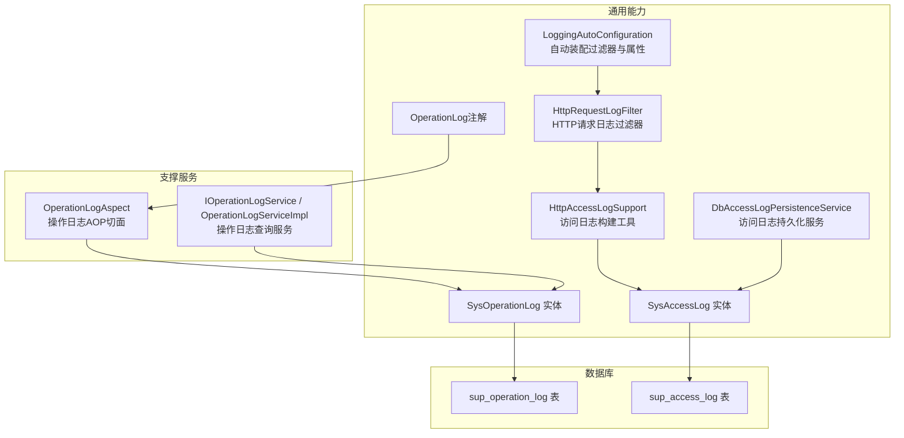
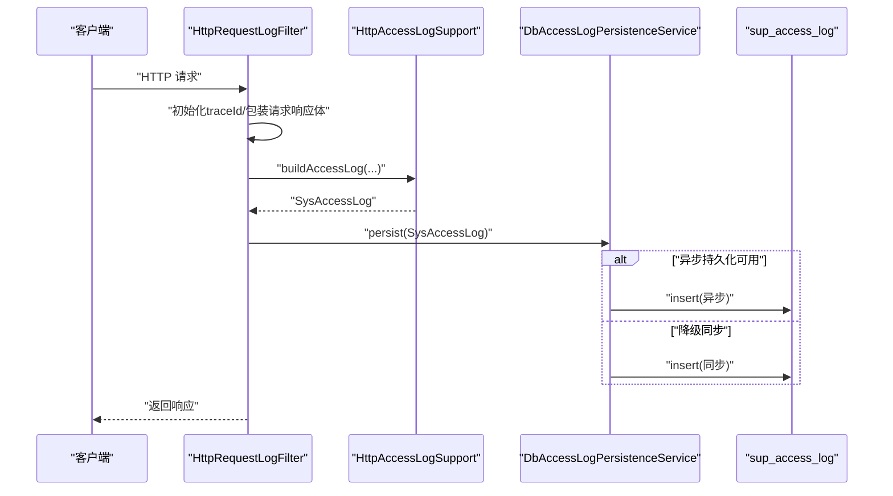
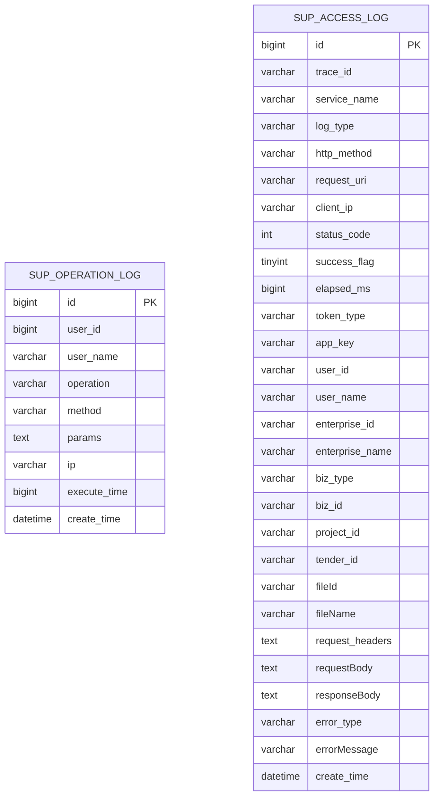
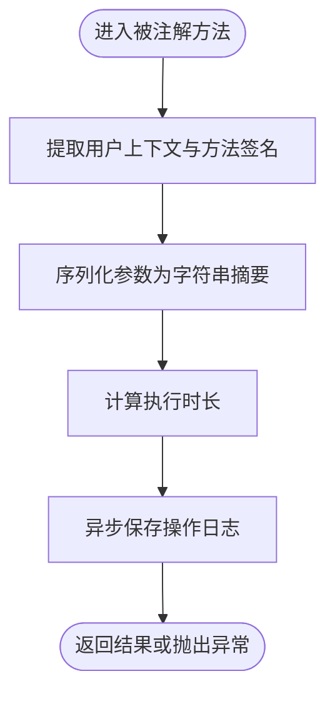
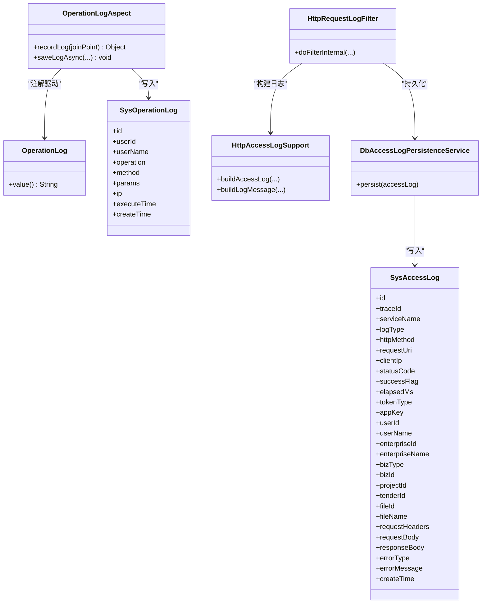

# 审计日志数据模型

<cite>
**本文引用的文件**   
- [ele-ai-tender-support/sql/init.sql](file://ele-ai-tender-system/ele-ai-tender-support/sql/init.sql)
- [SysOperationLog.java](file://ele-ai-tender-system/ele-ai-tender-common/src/main/java/com/jy/eleaitender/common/entity/support/SysOperationLog.java)
- [SysAccessLog.java](file://ele-ai-tender-system/ele-ai-tender-common/src/main/java/com/jy/eleaitender/common/entity/support/SysAccessLog.java)
- [OperationLogAspect.java](file://ele-ai-tender-system/ele-ai-tender-support/src/main/java/com/jy/eleaitender/support/aspect/OperationLogAspect.java)
- [OperationLog.java](file://ele-ai-tender-system/ele-ai-tender-common/src/main/java/com/jy/eleaitender/common/logging/OperationLog.java)
- [HttpRequestLogFilter.java](file://ele-ai-tender-system/ele-ai-tender-common/src/main/java/com/jy/eleaitender/common/logging/HttpRequestLogFilter.java)
- [HttpAccessLogSupport.java](file://ele-ai-tender-system/ele-ai-tender-common/src/main/java/com/jy/eleaitender/common/logging/HttpAccessLogSupport.java)
- [DbAccessLogPersistenceService.java](file://ele-ai-tender-system/ele-ai-tender-common/src/main/java/com/jy/eleaitender/common/logging/DbAccessLogPersistenceService.java)
- [LoggingAutoConfiguration.java](file://ele-ai-tender-system/ele-ai-tender-common/src/main/java/com/jy/eleaitender/common/logging/LoggingAutoConfiguration.java)
- [IOperationLogService.java](file://ele-ai-tender-system/ele-ai-tender-support/src/main/java/com/jy/eleaitender/support/service/IOperationLogService.java)
- [OperationLogServiceImpl.java](file://ele-ai-tender-system/ele-ai-tender-support/src/main/java/com/jy/eleaitender/support/service/impl/OperationLogServiceImpl.java)
</cite>

## 目录
1. [引言](#引言)
2. [项目结构](#项目结构)
3. [核心组件](#核心组件)
4. [架构总览](#架构总览)
5. [详细组件分析](#详细组件分析)
6. [依赖关系分析](#依赖关系分析)
7. [性能与优化](#性能与优化)
8. [运维与治理](#运维与治理)
9. [结论](#结论)
10. [附录](#附录)

## 引言
本文件面向审计日志的数据模型与实现，聚焦两张核心表：操作日志表 sup_operation_log 与访问日志表 sup_access_log。文档从设计理念、数据结构、采集链路、异步写入、批量处理、索引设计、分区策略、清理规则、查询分析与敏感信息脱敏等方面展开，帮助读者快速理解并高效运维审计日志系统。

## 项目结构
审计日志相关代码分布在通用模块 ele-ai-tender-common（公共能力）与支持服务模块 ele-ai-tender-support（业务侧使用）。数据库建表脚本位于 support 模块的 SQL 初始化文件中；实体映射在 common 模块中定义；采集与持久化逻辑分别在过滤器、切面与持久化服务中实现。

图表来源
- [OperationLogAspect.java:1-99](file://ele-ai-tender-system/ele-ai-tender-support/src/main/java/com/jy/eleaitender/support/aspect/OperationLogAspect.java#L1-L99)
- [IOperationLogService.java:1-21](file://ele-ai-tender-system/ele-ai-tender-support/src/main/java/com/jy/eleaitender/support/service/IOperationLogService.java#L1-L21)
- [OperationLogServiceImpl.java:1-37](file://ele-ai-tender-system/ele-ai-tender-support/src/main/java/com/jy/eleaitender/support/service/impl/OperationLogServiceImpl.java#L1-L37)
- [HttpRequestLogFilter.java:1-137](file://ele-ai-tender-system/ele-ai-tender-common/src/main/java/com/jy/eleaitender/common/logging/HttpRequestLogFilter.java#L1-L137)
- [HttpAccessLogSupport.java:1-376](file://ele-ai-tender-system/ele-ai-tender-common/src/main/java/com/jy/eleaitender/common/logging/HttpAccessLogSupport.java#L1-L376)
- [DbAccessLogPersistenceService.java:1-64](file://ele-ai-tender-system/ele-ai-tender-common/src/main/java/com/jy/eleaitender/common/logging/DbAccessLogPersistenceService.java#L1-L64)
- [LoggingAutoConfiguration.java:1-31](file://ele-ai-tender-system/ele-ai-tender-common/src/main/java/com/jy/eleaitender/common/logging/LoggingAutoConfiguration.java#L1-L31)
- [OperationLog.java:1-21](file://ele-ai-tender-system/ele-ai-tender-common/src/main/java/com/jy/eleaitender/common/logging/OperationLog.java#L1-L21)
- [SysOperationLog.java:1-50](file://ele-ai-tender-system/ele-ai-tender-common/src/main/java/com/jy/eleaitender/common/entity/support/SysOperationLog.java#L1-L50)
- [SysAccessLog.java:1-107](file://ele-ai-tender-system/ele-ai-tender-common/src/main/java/com/jy/eleaitender/common/entity/support/SysAccessLog.java#L1-L107)
- [ele-ai-tender-support/sql/init.sql:215-272](file://ele-ai-tender-system/ele-ai-tender-support/sql/init.sql#L215-L272)

章节来源
- [ele-ai-tender-support/sql/init.sql:215-272](file://ele-ai-tender-system/ele-ai-tender-support/sql/init.sql#L215-L272)
- [SysOperationLog.java:1-50](file://ele-ai-tender-system/ele-ai-tender-common/src/main/java/com/jy/eleaitender/common/entity/support/SysOperationLog.java#L1-L50)
- [SysAccessLog.java:1-107](file://ele-ai-tender-system/ele-ai-tender-common/src/main/java/com/jy/eleaitender/common/entity/support/SysAccessLog.java#L1-L107)

## 核心组件
- 操作日志记录
  - 通过 @OperationLog 注解标注方法，由 OperationLogAspect 拦截，提取用户上下文、方法签名、参数摘要、IP、执行时长，并以异步方式写入 sup_operation_log。
- 访问日志记录
  - HttpRequestLogFilter 统一拦截 HTTP 请求，生成 traceId，包装请求/响应体以便读取，调用 HttpAccessLogSupport 构建 SysAccessLog，并通过 DbAccessLogPersistenceService 持久化到 sup_access_log。
- 查询与展示
  - IOperationLogService 提供分页查询能力，支持按用户名和操作类型模糊检索，并按创建时间倒序排列。

章节来源
- [OperationLogAspect.java:1-99](file://ele-ai-tender-system/ele-ai-tender-support/src/main/java/com/jy/eleaitender/support/aspect/OperationLogAspect.java#L1-L99)
- [OperationLog.java:1-21](file://ele-ai-tender-system/ele-ai-tender-common/src/main/java/com/jy/eleaitender/common/logging/OperationLog.java#L1-L21)
- [HttpRequestLogFilter.java:1-137](file://ele-ai-tender-system/ele-ai-tender-common/src/main/java/com/jy/eleaitender/common/logging/HttpRequestLogFilter.java#L1-L137)
- [HttpAccessLogSupport.java:1-376](file://ele-ai-tender-system/ele-ai-tender-common/src/main/java/com/jy/eleaitender/common/logging/HttpAccessLogSupport.java#L1-L376)
- [DbAccessLogPersistenceService.java:1-64](file://ele-ai-tender-system/ele-ai-tender-common/src/main/java/com/jy/eleaitender/common/logging/DbAccessLogPersistenceService.java#L1-L64)
- [IOperationLogService.java:1-21](file://ele-ai-tender-system/ele-ai-tender-support/src/main/java/com/jy/eleaitender/support/service/IOperationLogService.java#L1-L21)
- [OperationLogServiceImpl.java:1-37](file://ele-ai-tender-system/ele-ai-tender-support/src/main/java/com/jy/eleaitender/support/service/impl/OperationLogServiceImpl.java#L1-L37)

## 架构总览
下图展示了访问日志从请求进入、上下文构建、持久化落库的完整流程，以及操作日志基于注解的异步记录路径。

图表来源
- [HttpRequestLogFilter.java:41-106](file://ele-ai-tender-system/ele-ai-tender-common/src/main/java/com/jy/eleaitender/common/logging/HttpRequestLogFilter.java#L41-L106)
- [HttpAccessLogSupport.java:37-69](file://ele-ai-tender-system/ele-ai-tender-common/src/main/java/com/jy/eleaitender/common/logging/HttpAccessLogSupport.java#L37-L69)
- [DbAccessLogPersistenceService.java:28-64](file://ele-ai-tender-system/ele-ai-tender-common/src/main/java/com/jy/eleaitender/common/logging/DbAccessLogPersistenceService.java#L28-L64)

## 详细组件分析

### 数据模型与字段说明
- 操作日志表 sup_operation_log
  - 主键 id
  - 用户维度：user_id, user_name
  - 行为维度：operation（操作类型）、method（请求方法）
  - 参数与来源：params（请求参数）、ip（客户端IP）
  - 性能指标：execute_time（执行时长毫秒）
  - 时间戳：create_time
  - 索引：idx_user_id, idx_create_time
- 访问日志表 sup_access_log
  - 追踪与服务：trace_id, service_name, log_type
  - 请求摘要：http_method, request_uri, client_ip
  - 结果度量：status_code, success_flag, elapsed_ms
  - 认证与应用：token_type, app_key, user_id, user_name, enterprise_id, enterprise_name
  - 业务上下文：biz_type, biz_id, project_id, tender_id, file_id, file_name
  - 内容摘要：request_headers, requestBody, responseBody
  - 异常信息：error_type, errorMessage
  - 时间戳：create_time
  - 索引：idx_trace_id, idx_service_name, idx_create_time, idx_biz_context(biz_type,biz_id,project_id,tender_id)

图表来源
- [ele-ai-tender-support/sql/init.sql:215-272](file://ele-ai-tender-system/ele-ai-tender-support/sql/init.sql#L215-L272)

章节来源
- [ele-ai-tender-support/sql/init.sql:215-272](file://ele-ai-tender-system/ele-ai-tender-support/sql/init.sql#L215-L272)
- [SysOperationLog.java:1-50](file://ele-ai-tender-system/ele-ai-tender-common/src/main/java/com/jy/eleaitender/common/entity/support/SysOperationLog.java#L1-L50)
- [SysAccessLog.java:1-107](file://ele-ai-tender-system/ele-ai-tender-common/src/main/java/com/jy/eleaitender/common/entity/support/SysAccessLog.java#L1-L107)

### 操作日志采集与写入
- 触发方式：在目标方法上添加 @OperationLog("操作描述")
- 采集内容：用户ID/名称、方法全限定名+方法名、参数序列化摘要、客户端IP、执行时长
- 写入策略：@Async 异步落库，异常不影响主流程
- 查询能力：支持按用户名、操作类型模糊查询，按创建时间倒序分页

图表来源
- [OperationLogAspect.java:39-86](file://ele-ai-tender-system/ele-ai-tender-support/src/main/java/com/jy/eleaitender/support/aspect/OperationLogAspect.java#L39-L86)
- [OperationLog.java:1-21](file://ele-ai-tender-system/ele-ai-tender-common/src/main/java/com/jy/eleaitender/common/logging/OperationLog.java#L1-L21)
- [IOperationLogService.java:1-21](file://ele-ai-tender-system/ele-ai-tender-support/src/main/java/com/jy/eleaitender/support/service/IOperationLogService.java#L1-L21)
- [OperationLogServiceImpl.java:21-35](file://ele-ai-tender-system/ele-ai-tender-support/src/main/java/com/jy/eleaitender/support/service/impl/OperationLogServiceImpl.java#L21-L35)

章节来源
- [OperationLogAspect.java:1-99](file://ele-ai-tender-system/ele-ai-tender-support/src/main/java/com/jy/eleaitender/support/aspect/OperationLogAspect.java#L1-L99)
- [OperationLog.java:1-21](file://ele-ai-tender-system/ele-ai-tender-common/src/main/java/com/jy/eleaitender/common/logging/OperationLog.java#L1-L21)
- [OperationLogServiceImpl.java:1-37](file://ele-ai-tender-system/ele-ai-tender-support/src/main/java/com/jy/eleaitender/support/service/impl/OperationLogServiceImpl.java#L1-L37)

### 访问日志采集与链路追踪
- 入口拦截：HttpRequestLogFilter 对每个 HTTP 请求进行拦截
- 链路追踪：若请求未携带 traceId，则生成并回写响应头，便于跨服务追踪
- 请求/响应体采集：使用 ContentCachingRequestWrapper/ResponseWrapper 缓存流，避免重复消费
- 上下文填充：解析 Token 获取用户与企业信息；从 Query/JSON Body/URI 片段提取业务上下文
- 敏感信息脱敏：对 Authorization、X-Signature 等头部进行掩码处理
- 持久化策略：优先异步写入，线程池不可用时自动降级为同步，确保不丢日志

图表来源
- [HttpRequestLogFilter.java:41-106](file://ele-ai-tender-system/ele-ai-tender-common/src/main/java/com/jy/eleaitender/common/logging/HttpRequestLogFilter.java#L41-L106)
- [HttpAccessLogSupport.java:37-69](file://ele-ai-tender-system/ele-ai-tender-common/src/main/java/com/jy/eleaitender/common/logging/HttpAccessLogSupport.java#L37-L69)
- [DbAccessLogPersistenceService.java:28-64](file://ele-ai-tender-system/ele-ai-tender-common/src/main/java/com/jy/eleaitender/common/logging/DbAccessLogPersistenceService.java#L28-L64)

章节来源
- [HttpRequestLogFilter.java:1-137](file://ele-ai-tender-system/ele-ai-tender-common/src/main/java/com/jy/eleaitender/common/logging/HttpRequestLogFilter.java#L1-L137)
- [HttpAccessLogSupport.java:1-376](file://ele-ai-tender-system/ele-ai-tender-common/src/main/java/com/jy/eleaitender/common/logging/HttpAccessLogSupport.java#L1-L376)
- [DbAccessLogPersistenceService.java:1-64](file://ele-ai-tender-system/ele-ai-tender-common/src/main/java/com/jy/eleaitender/common/logging/DbAccessLogPersistenceService.java#L1-L64)

### 自动装配与配置
- LoggingAutoConfiguration 负责注册 HttpRequestLogFilter 及加载 AccessLogProperties
- 可通过配置开关控制是否启用日志、是否开启持久化、是否异步持久化、正文长度限制、异常消息长度限制等

章节来源
- [LoggingAutoConfiguration.java:1-31](file://ele-ai-tender-system/ele-ai-tender-common/src/main/java/com/jy/eleaitender/common/logging/LoggingAutoConfiguration.java#L1-L31)

## 依赖关系分析
- 操作日志
  - OperationLogAspect 依赖 SysOperationLogMapper 写入 sup_operation_log
  - OperationLog 注解作为触发点
- 访问日志
  - HttpRequestLogFilter 依赖 HttpAccessLogSupport 构建日志对象
  - DbAccessLogPersistenceService 依赖 SysAccessLogMapper 写入 sup_access_log
  - LoggingAutoConfiguration 装配过滤器与属性

图表来源
- [OperationLogAspect.java:1-99](file://ele-ai-tender-system/ele-ai-tender-support/src/main/java/com/jy/eleaitender/support/aspect/OperationLogAspect.java#L1-L99)
- [OperationLog.java:1-21](file://ele-ai-tender-system/ele-ai-tender-common/src/main/java/com/jy/eleaitender/common/logging/OperationLog.java#L1-L21)
- [SysOperationLog.java:1-50](file://ele-ai-tender-system/ele-ai-tender-common/src/main/java/com/jy/eleaitender/common/entity/support/SysOperationLog.java#L1-L50)
- [HttpRequestLogFilter.java:1-137](file://ele-ai-tender-system/ele-ai-tender-common/src/main/java/com/jy/eleaitender/common/logging/HttpRequestLogFilter.java#L1-L137)
- [HttpAccessLogSupport.java:1-376](file://ele-ai-tender-system/ele-ai-tender-common/src/main/java/com/jy/eleaitender/common/logging/HttpAccessLogSupport.java#L1-L376)
- [DbAccessLogPersistenceService.java:1-64](file://ele-ai-tender-system/ele-ai-tender-common/src/main/java/com/jy/eleaitender/common/logging/DbAccessLogPersistenceService.java#L1-L64)
- [SysAccessLog.java:1-107](file://ele-ai-tender-system/ele-ai-tender-common/src/main/java/com/jy/eleaitender/common/entity/support/SysAccessLog.java#L1-L107)

## 性能与优化
- 异步写入
  - 访问日志默认优先异步落库，当 TaskExecutor 不可用或提交失败时自动降级为同步，保证可靠性。
  - 操作日志采用 @Async 异步保存，降低对主流程延迟影响。
- 正文采集与限长
  - 仅对文本型请求/响应体进行采集，二进制与 multipart 直接跳过，避免大体积日志。
  - 通过配置限制请求/响应体最大长度与异常消息长度，防止日志膨胀。
- 索引与查询
  - 访问日志针对 trace_id、service_name、create_time 建立单列索引，并提供复合索引 idx_biz_context 用于业务维度聚合查询。
  - 操作日志针对 user_id、create_time 建立索引，满足按用户与时间范围的高效检索。
- SSE 特殊处理
  - 对于 SSE 流式请求，过滤器不进行响应体包装，避免事件丢失，同时仍记录关键耗时与 traceId。

章节来源
- [DbAccessLogPersistenceService.java:28-64](file://ele-ai-tender-system/ele-ai-tender-common/src/main/java/com/jy/eleaitender/common/logging/DbAccessLogPersistenceService.java#L28-L64)
- [OperationLogAspect.java:69-86](file://ele-ai-tender-system/ele-ai-tender-support/src/main/java/com/jy/eleaitender/support/aspect/OperationLogAspect.java#L69-L86)
- [HttpAccessLogSupport.java:215-241](file://ele-ai-tender-system/ele-ai-tender-common/src/main/java/com/jy/eleaitender/common/logging/HttpAccessLogSupport.java#L215-L241)
- [HttpRequestLogFilter.java:54-72](file://ele-ai-tender-system/ele-ai-tender-common/src/main/java/com/jy/eleaitender/common/logging/HttpRequestLogFilter.java#L54-L72)
- [ele-ai-tender-support/sql/init.sql:229-272](file://ele-ai-tender-system/ele-ai-tender-support/sql/init.sql#L229-L272)

## 运维与治理
- 日志查询与分析
  - 操作日志：支持按用户名、操作类型模糊查询，按创建时间倒序分页，适合审计回溯与问题定位。
  - 访问日志：可按 trace_id 进行全链路追踪；按 service_name 区分服务；按 biz_type/biz_id/project_id/tender_id 组合条件进行业务维度统计。
- 数据归档策略
  - 建议按 create_time 进行分区（如按月），结合索引提升历史数据查询效率。
  - 对超期数据可迁移至冷存储或归档库，保留必要字段（trace_id、service_name、http_method、request_uri、status_code、elapsed_ms、create_time 等）。
- 清理规则
  - 定期清理过期日志，遵循合规要求保留最短周期；清理前建议先导出备份。
  - 可使用批处理任务分片删除，避免长时间锁表。
- 敏感信息脱敏
  - 访问日志在构建阶段对 Authorization、X-Signature 等敏感头部进行掩码处理；请求/响应体仅记录文本且限制长度。
  - 建议在外部日志平台进一步做二次脱敏与过滤。
- 监控告警
  - 关注 persist 失败与异步提交失败的告警日志，及时排查线程池与数据库连接问题。
  - 对高错误率接口与慢接口进行专项监控，结合 elapsed_ms 与 statusCode 设置阈值告警。

章节来源
- [OperationLogServiceImpl.java:21-35](file://ele-ai-tender-system/ele-ai-tender-support/src/main/java/com/jy/eleaitender/support/service/impl/OperationLogServiceImpl.java#L21-L35)
- [HttpAccessLogSupport.java:74-92](file://ele-ai-tender-system/ele-ai-tender-common/src/main/java/com/jy/eleaitender/common/logging/HttpAccessLogSupport.java#L74-L92)
- [DbAccessLogPersistenceService.java:42-60](file://ele-ai-tender-system/ele-ai-tender-common/src/main/java/com/jy/eleaitender/common/logging/DbAccessLogPersistenceService.java#L42-L60)
- [ele-ai-tender-support/sql/init.sql:267-272](file://ele-ai-tender-system/ele-ai-tender-support/sql/init.sql#L267-L272)

## 结论
该审计日志体系以“轻量采集、可靠持久、可观测可追溯”为目标，通过注解与过滤器双通道覆盖操作与访问两类日志，配合完善的索引设计与异步持久化策略，在保证性能的同时提供了强大的审计与排障能力。建议在生产环境持续完善归档与清理机制，并结合外部日志平台实现更高效的检索与可视化分析。

## 附录
- 关键实现路径参考
  - 操作日志注解与切面：[OperationLog.java](file://ele-ai-tender-system/ele-ai-tender-common/src/main/java/com/jy/eleaitender/common/logging/OperationLog.java), [OperationLogAspect.java](file://ele-ai-tender-system/ele-ai-tender-support/src/main/java/com/jy/eleaitender/support/aspect/OperationLogAspect.java)
  - 访问日志过滤器与构建器：[HttpRequestLogFilter.java](file://ele-ai-tender-system/ele-ai-tender-common/src/main/java/com/jy/eleaitender/common/logging/HttpRequestLogFilter.java), [HttpAccessLogSupport.java](file://ele-ai-tender-system/ele-ai-tender-common/src/main/java/com/jy/eleaitender/common/logging/HttpAccessLogSupport.java)
  - 访问日志持久化：[DbAccessLogPersistenceService.java](file://ele-ai-tender-system/ele-ai-tender-common/src/main/java/com/jy/eleaitender/common/logging/DbAccessLogPersistenceService.java)
  - 自动装配：[LoggingAutoConfiguration.java](file://ele-ai-tender-system/ele-ai-tender-common/src/main/java/com/jy/eleaitender/common/logging/LoggingAutoConfiguration.java)
  - 数据模型与建表：[SysOperationLog.java](file://ele-ai-tender-system/ele-ai-tender-common/src/main/java/com/jy/eleaitender/common/entity/support/SysOperationLog.java), [SysAccessLog.java](file://ele-ai-tender-system/ele-ai-tender-common/src/main/java/com/jy/eleaitender/common/entity/support/SysAccessLog.java), [init.sql](file://ele-ai-tender-system/ele-ai-tender-support/sql/init.sql)