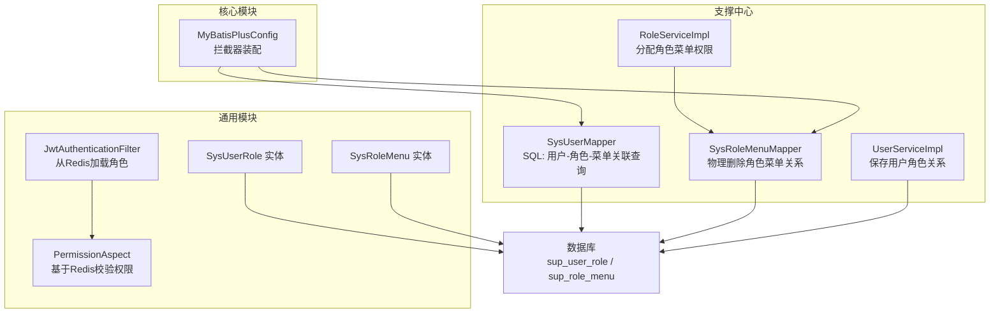
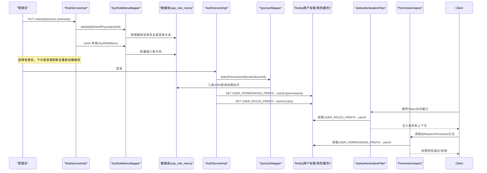
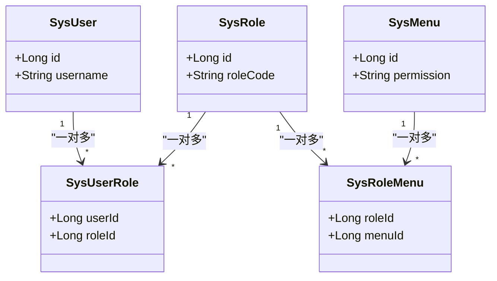
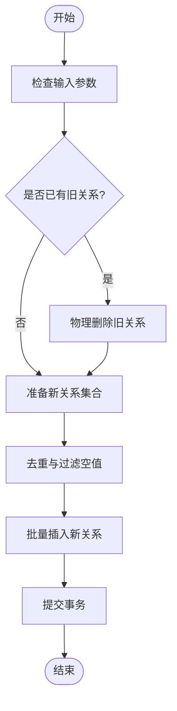
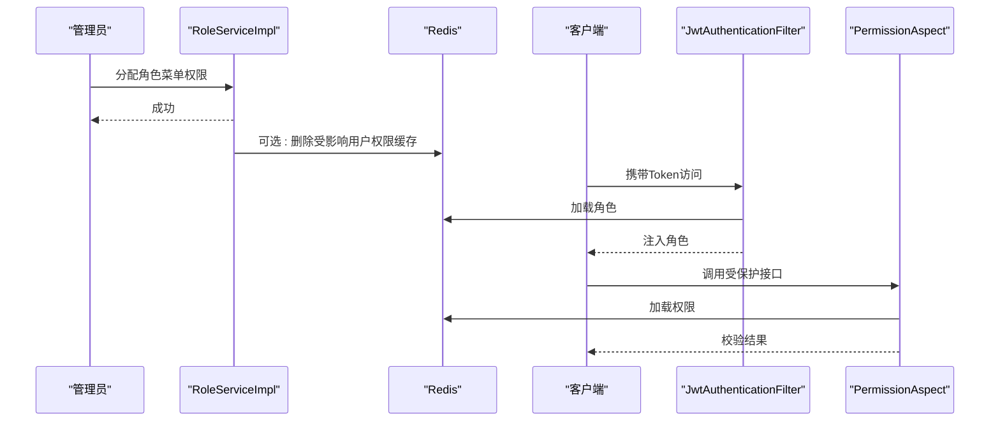
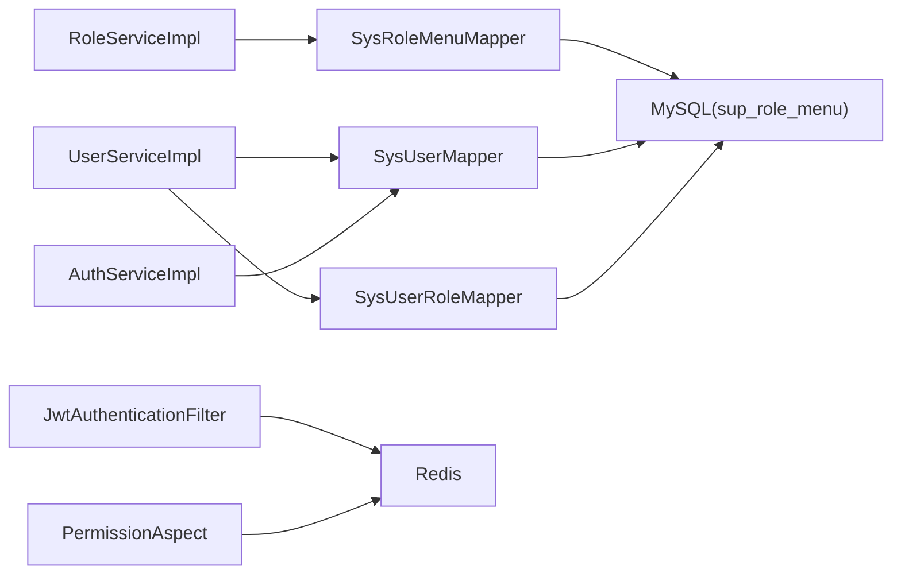

# 关联关系映射

<cite>
**本文引用的文件列表**
- [init.sql](file://ele-ai-tender-system/ele-ai-tender-support/sql/init.sql)
- [SysUserRole.java](file://ele-ai-tender-system/ele-ai-tender-common/src/main/java/com/jy/eleaitender/common/entity/support/SysUserRole.java)
- [SysRoleMenu.java](file://ele-ai-tender-system/ele-ai-tender-common/src/main/java/com/jy/eleaitender/common/entity/support/SysRoleMenu.java)
- [SysUserMapper.java](file://ele-ai-tender-system/ele-ai-tender-support/src/main/java/com/jy/eleaitender/support/mapper/SysUserMapper.java)
- [SysRoleMenuMapper.java](file://ele-ai-tender-system/ele-ai-tender-support/src/main/java/com/jy/eleaitender/support/mapper/SysRoleMenuMapper.java)
- [RoleServiceImpl.java](file://ele-ai-tender-system/ele-ai-tender-support/src/main/java/com/jy/eleaitender/support/service/impl/RoleServiceImpl.java)
- [UserServiceImpl.java](file://ele-ai-tender-system/ele-ai-tender-support/src/main/java/com/jy/eleaitender/support/service/impl/UserServiceImpl.java)
- [AuthServiceImpl.java](file://ele-ai-tender-system/ele-ai-tender-support/src/main/java/com/jy/eleaitender/support/service/impl/AuthServiceImpl.java)
- [JwtAuthenticationFilter.java](file://ele-ai-tender-system/ele-ai-tender-common/src/main/java/com/jy/eleaitender/common/security/JwtAuthenticationFilter.java)
- [PermissionAspect.java](file://ele-ai-tender-system/ele-ai-tender-support/src/main/java/com/jy/eleaitender/support/aspect/PermissionAspect.java)
- [MyBatisPlusConfig.java](file://ele-ai-tender-system/ele-ai-tender-core/src/main/java/com/jy/eleaitender/core/config/MyBatisPlusConfig.java)
</cite>

## 目录
1. [引言](#引言)
2. [项目结构](#项目结构)
3. [核心组件](#核心组件)
4. [架构总览](#架构总览)
5. [详细组件分析](#详细组件分析)
6. [依赖分析](#依赖分析)
7. [性能考虑](#性能考虑)
8. [故障排查指南](#故障排查指南)
9. [结论](#结论)
10. [附录](#附录)

## 引言
本文件聚焦于 RBAC 权限模型中的关联关系映射，围绕用户-角色关联表 sup_user_role 与角色-菜单关联表 sup_role_menu 的数据结构设计、外键约束、索引优化、查询性能进行深度解析；并给出多对多关系的实现方案（用户到角色的授权、角色到菜单的权限分配）、增删改查操作模式（批量授权、权限回收、级联删除等）、权限查询优化的 SQL 示例与 MyBatis Plus 配置建议，以及权限缓存策略与实时权限更新的数据同步机制说明。

## 项目结构
本项目采用模块化分层架构：支撑中心模块负责系统管理（用户、角色、菜单、权限）能力，通用模块提供实体、安全上下文、常量等公共能力，核心模块提供 MyBatis Plus 拦截器配置等基础能力。RBAC 相关的关键代码分布在以下位置：
- 数据库初始化脚本：定义 sup_user、sup_role、sup_menu 及两张关联表结构与索引
- 实体类：SysUserRole、SysRoleMenu 对应两张关联表
- Mapper：SysUserMapper、SysRoleMenuMapper 提供关联查询与批量删除
- Service：RoleServiceImpl、UserServiceImpl 封装授权与权限分配的业务逻辑
- 认证与鉴权：AuthServiceImpl、JwtAuthenticationFilter、PermissionAspect 负责登录时加载权限至缓存、请求时校验权限
- 框架配置：MyBatisPlusConfig 注册数据隔离、分页、乐观锁等拦截器

图表来源
- [SysUserMapper.java:30-57](file://ele-ai-tender-system/ele-ai-tender-support/src/main/java/com/jy/eleaitender/support/mapper/SysUserMapper.java#L30-L57)
- [SysRoleMenuMapper.java:1-20](file://ele-ai-tender-system/ele-ai-tender-support/src/main/java/com/jy/eleaitender/support/mapper/SysRoleMenuMapper.java#L1-L20)
- [RoleServiceImpl.java:98-121](file://ele-ai-tender-system/ele-ai-tender-support/src/main/java/com/jy/eleaitender/support/service/impl/RoleServiceImpl.java#L98-L121)
- [UserServiceImpl.java:137-151](file://ele-ai-tender-system/ele-ai-tender-support/src/main/java/com/jy/eleaitender/support/service/impl/UserServiceImpl.java#L137-L151)
- [SysUserRole.java:12-25](file://ele-ai-tender-system/ele-ai-tender-common/src/main/java/com/jy/eleaitender/common/entity/support/SysUserRole.java#L12-L25)
- [SysRoleMenu.java:12-25](file://ele-ai-tender-system/ele-ai-tender-common/src/main/java/com/jy/eleaitender/common/entity/support/SysRoleMenu.java#L12-L25)
- [JwtAuthenticationFilter.java:149-167](file://ele-ai-tender-system/ele-ai-tender-common/src/main/java/com/jy/eleaitender/common/security/JwtAuthenticationFilter.java#L149-L167)
- [PermissionAspect.java:24-38](file://ele-ai-tender-system/ele-ai-tender-support/src/main/java/com/jy/eleaitender/support/aspect/PermissionAspect.java#L24-L38)
- [MyBatisPlusConfig.java:14-22](file://ele-ai-tender-system/ele-ai-tender-core/src/main/java/com/jy/eleaitender/core/config/MyBatisPlusConfig.java#L14-L22)

章节来源
- [init.sql:70-137](file://ele-ai-tender-system/ele-ai-tender-support/sql/init.sql#L70-L137)
- [SysUserMapper.java:30-57](file://ele-ai-tender-system/ele-ai-tender-support/src/main/java/com/jy/eleaitender/support/mapper/SysUserMapper.java#L30-L57)
- [SysRoleMenuMapper.java:1-20](file://ele-ai-tender-system/ele-ai-tender-support/src/main/java/com/jy/eleaitender/support/mapper/SysRoleMenuMapper.java#L1-L20)
- [RoleServiceImpl.java:98-121](file://ele-ai-tender-system/ele-ai-tender-support/src/main/java/com/jy/eleaitender/support/service/impl/RoleServiceImpl.java#L98-L121)
- [UserServiceImpl.java:137-151](file://ele-ai-tender-system/ele-ai-tender-support/src/main/java/com/jy/eleaitender/support/service/impl/UserServiceImpl.java#L137-L151)
- [AuthServiceImpl.java:232-257](file://ele-ai-tender-system/ele-ai-tender-support/src/main/java/com/jy/eleaitender/support/service/impl/AuthServiceImpl.java#L232-L257)
- [JwtAuthenticationFilter.java:149-167](file://ele-ai-tender-system/ele-ai-tender-common/src/main/java/com/jy/eleaitender/common/security/JwtAuthenticationFilter.java#L149-L167)
- [PermissionAspect.java:24-38](file://ele-ai-tender-system/ele-ai-tender-support/src/main/java/com/jy/eleaitender/support/aspect/PermissionAspect.java#L24-L38)
- [MyBatisPlusConfig.java:14-22](file://ele-ai-tender-system/ele-ai-tender-core/src/main/java/com/jy/eleaitender/core/config/MyBatisPlusConfig.java#L14-L22)

## 核心组件
- 用户-角色关联表 sup_user_role
  - 字段：主键 id、user_id、role_id、审计字段（create_time/create_id/create_name/modify_time/modify_id/modify_name）、乐观锁 ver、逻辑删除 is_delete
  - 索引：唯一联合索引 (user_id, role_id)，普通索引 role_id
  - 作用：记录用户与角色的多对多关系，支持用户拥有多个角色、角色被多个用户复用
- 角色-菜单关联表 sup_role_menu
  - 字段：主键 id、role_id、menu_id、审计字段、乐观锁 ver、逻辑删除 is_delete
  - 索引：唯一联合索引 (role_id, menu_id)，普通索引 menu_id
  - 作用：记录角色与菜单的多对多关系，支持角色拥有多个菜单、菜单被多个角色复用
- 实体映射
  - SysUserRole 对应 sup_user_role
  - SysRoleMenu 对应 sup_role_menu
- 关键查询与写入
  - 根据用户ID查询角色编码集合、权限标识集合、角色ID集合、角色对象集合
  - 根据角色ID查询已分配的菜单ID集合
  - 按角色物理删除所有菜单关系后批量插入新关系，避免唯一索引冲突

章节来源
- [init.sql:70-137](file://ele-ai-tender-system/ele-ai-tender-support/sql/init.sql#L70-L137)
- [SysUserRole.java:12-25](file://ele-ai-tender-system/ele-ai-tender-common/src/main/java/com/jy/eleaitender/common/entity/support/SysUserRole.java#L12-L25)
- [SysRoleMenu.java:12-25](file://ele-ai-tender-system/ele-ai-tender-common/src/main/java/com/jy/eleaitender/common/entity/support/SysRoleMenu.java#L12-L25)
- [SysUserMapper.java:30-57](file://ele-ai-tender-system/ele-ai-tender-support/src/main/java/com/jy/eleaitender/support/mapper/SysUserMapper.java#L30-L57)
- [SysRoleMenuMapper.java:1-20](file://ele-ai-tender-system/ele-ai-tender-support/src/main/java/com/jy/eleaitender/support/mapper/SysRoleMenuMapper.java#L1-L20)

## 架构总览
RBAC 权限模型通过两张关联表将用户、角色、菜单三者解耦，形成“用户-角色-菜单”的多对多关系。服务层在授权与权限分配时维护关联表；认证流程在登录时将用户角色与权限标识加载到 Redis；鉴权切面在请求时从 Redis 读取权限集合进行校验。

图表来源
- [RoleServiceImpl.java:98-121](file://ele-ai-tender-system/ele-ai-tender-support/src/main/java/com/jy/eleaitender/support/service/impl/RoleServiceImpl.java#L98-L121)
- [SysRoleMenuMapper.java:1-20](file://ele-ai-tender-system/ele-ai-tender-support/src/main/java/com/jy/eleaitender/support/mapper/SysRoleMenuMapper.java#L1-L20)
- [AuthServiceImpl.java:232-257](file://ele-ai-tender-system/ele-ai-tender-support/src/main/java/com/jy/eleaitender/support/service/impl/AuthServiceImpl.java#L232-L257)
- [SysUserMapper.java:30-57](file://ele-ai-tender-system/ele-ai-tender-support/src/main/java/com/jy/eleaitender/support/mapper/SysUserMapper.java#L30-L57)
- [JwtAuthenticationFilter.java:149-167](file://ele-ai-tender-system/ele-ai-tender-common/src/main/java/com/jy/eleaitender/common/security/JwtAuthenticationFilter.java#L149-L167)
- [PermissionAspect.java:24-38](file://ele-ai-tender-system/ele-ai-tender-support/src/main/java/com/jy/eleaitender/support/aspect/PermissionAspect.java#L24-L38)

## 详细组件分析

### 数据模型与索引设计
- sup_user_role
  - 主键：自增 id
  - 业务键：user_id、role_id
  - 唯一索引：idx_user_role(user_id, role_id) 防止重复授权
  - 普通索引：idx_role_id(role_id) 加速按角色反查用户
- sup_role_menu
  - 主键：自增 id
  - 业务键：role_id、menu_id
  - 唯一索引：idx_role_menu(role_id, menu_id) 防止重复分配
  - 普通索引：idx_menu_id(menu_id) 加速按菜单反查角色
- 设计要点
  - 使用联合唯一索引保证幂等性，避免重复插入导致冲突
  - 为高频查询方向建立合适索引：按用户查角色、按角色查菜单、按菜单查角色
  - 保留审计字段与逻辑删除标记，便于追溯与软删除场景

章节来源
- [init.sql:70-137](file://ele-ai-tender-system/ele-ai-tender-support/sql/init.sql#L70-L137)

### 实体映射与关系
- SysUserRole 与 SysRoleMenu 分别映射 sup_user_role 与 sup_role_menu，仅包含必要的外键字段，保持轻量
- BaseEntity 继承统一审计与版本控制字段，简化开发

图表来源
- [SysUserRole.java:12-25](file://ele-ai-tender-system/ele-ai-tender-common/src/main/java/com/jy/eleaitender/common/entity/support/SysUserRole.java#L12-L25)
- [SysRoleMenu.java:12-25](file://ele-ai-tender-system/ele-ai-tender-common/src/main/java/com/jy/eleaitender/common/entity/support/SysRoleMenu.java#L12-L25)

### 多对多关系实现方案
- 用户到角色的授权
  - 新增/更新用户时，先清空该用户的角色关联，再批量插入新的角色关联
  - 删除用户时，级联清理其角色关联
- 角色到菜单的权限分配
  - 分配权限时，先物理删除该角色的全部菜单关系，再批量插入新关系
  - 去重与过滤空值，避免唯一索引冲突
- 典型业务流程
  - 管理员在角色管理中勾选菜单树，提交后端执行 assignMenus
  - 用户登录后，系统加载其角色与权限标识并写入 Redis，后续鉴权直接读缓存

章节来源
- [UserServiceImpl.java:137-151](file://ele-ai-tender-system/ele-ai-tender-support/src/main/java/com/jy/eleaitender/support/service/impl/UserServiceImpl.java#L137-L151)
- [RoleServiceImpl.java:98-121](file://ele-ai-tender-system/ele-ai-tender-support/src/main/java/com/jy/eleaitender/support/service/impl/RoleServiceImpl.java#L98-L121)

### 增删改查操作模式与事务处理
- 批量授权（角色-菜单）
  - 先物理删除旧关系，再循环插入新关系，确保唯一索引不冲突
  - 使用 @Transactional 保证一致性
- 权限回收（角色-菜单）
  - 传入空菜单ID集合即可实现回收
- 级联删除（用户-角色）
  - 删除用户时，删除其所有角色关联
- 注意事项
  - 角色-菜单采用物理删除而非逻辑删除，以避免与唯一索引冲突
  - 用户-角色采用逻辑删除字段存在，但当前实现为物理删除，保持一致性与简洁性

图表来源
- [RoleServiceImpl.java:98-121](file://ele-ai-tender-system/ele-ai-tender-support/src/main/java/com/jy/eleaitender/support/service/impl/RoleServiceImpl.java#L98-L121)

### 权限查询优化与 MyBatis Plus 配置
- 用户权限查询 SQL 思路
  - 通过三表 JOIN 一次性获取用户的所有权限标识，减少多次往返
  - 使用 DISTINCT 去重，过滤空权限标识
  - 条件中包含 is_delete = 0，确保只返回有效数据
- 推荐索引
  - sup_user_role: idx_user_role(user_id, role_id)、idx_role_id(role_id)
  - sup_role_menu: idx_role_menu(role_id, menu_id)、idx_menu_id(menu_id)
  - sup_menu: idx_parent_id(parent_id)、idx_menu_code(menu_code)
- MyBatis Plus 配置建议
  - 启用分页拦截器、乐观锁拦截器
  - 数据隔离拦截器需在分页之前注册，避免影响 SQL 改写顺序
  - 对于复杂关联查询，优先使用自定义 SQL 以提升可读性与性能

章节来源
- [SysUserMapper.java:30-57](file://ele-ai-tender-system/ele-ai-tender-support/src/main/java/com/jy/eleaitender/support/mapper/SysUserMapper.java#L30-L57)
- [init.sql:70-137](file://ele-ai-tender-system/ele-ai-tender-support/sql/init.sql#L70-L137)
- [MyBatisPlusConfig.java:14-22](file://ele-ai-tender-system/ele-ai-tender-core/src/main/java/com/jy/eleaitender/core/config/MyBatisPlusConfig.java#L14-L22)

### 权限缓存策略与实时权限更新
- 缓存策略
  - 登录成功后，将用户角色与权限标识写入 Redis，Key 前缀分别为 USER_ROLES_PREFIX 与 USER_PERMISSIONS_PREFIX
  - 设置过期时间与 Token 一致，保证会话生命周期内缓存可用
  - 鉴权切面在每次请求时从 Redis 读取权限集合进行校验
- 实时权限更新
  - 修改角色菜单权限后，建议在管理端主动删除该角色下所有在线用户的权限缓存，使下一次请求能触发重新加载
  - 若无法精准定位受影响用户，可考虑在权限变更事件发布后，按用户维度失效其权限缓存
- 登出清理
  - 用户登出时，删除其角色与权限缓存，避免残留

图表来源
- [AuthServiceImpl.java:232-257](file://ele-ai-tender-system/ele-ai-tender-support/src/main/java/com/jy/eleaitender/support/service/impl/AuthServiceImpl.java#L232-L257)
- [JwtAuthenticationFilter.java:149-167](file://ele-ai-tender-system/ele-ai-tender-common/src/main/java/com/jy/eleaitender/common/security/JwtAuthenticationFilter.java#L149-L167)
- [PermissionAspect.java:24-38](file://ele-ai-tender-system/ele-ai-tender-support/src/main/java/com/jy/eleaitender/support/aspect/PermissionAspect.java#L24-L38)

## 依赖分析
- 组件耦合
  - RoleServiceImpl 依赖 SysRoleMenuMapper 完成角色菜单关系的读写
  - UserServiceImpl 依赖 SysUserMapper 与 SysUserRoleMapper 完成用户角色关系的读写
  - AuthServiceImpl 依赖 SysUserMapper 查询权限与角色，并写入 Redis
  - JwtAuthenticationFilter 与 PermissionAspect 依赖 Redis 进行角色与权限的读取与校验
- 外部依赖
  - Redis：存储用户角色与权限集合
  - MySQL：持久化 RBAC 关联关系
- 潜在风险
  - 角色-菜单关系采用物理删除，需确保无其他逻辑删除分支混用
  - 权限缓存失效策略需覆盖所有变更路径，避免不一致

图表来源
- [RoleServiceImpl.java:98-121](file://ele-ai-tender-system/ele-ai-tender-support/src/main/java/com/jy/eleaitender/support/service/impl/RoleServiceImpl.java#L98-L121)
- [UserServiceImpl.java:137-151](file://ele-ai-tender-system/ele-ai-tender-support/src/main/java/com/jy/eleaitender/support/service/impl/UserServiceImpl.java#L137-L151)
- [AuthServiceImpl.java:232-257](file://ele-ai-tender-system/ele-ai-tender-support/src/main/java/com/jy/eleaitender/support/service/impl/AuthServiceImpl.java#L232-L257)
- [JwtAuthenticationFilter.java:149-167](file://ele-ai-tender-system/ele-ai-tender-common/src/main/java/com/jy/eleaitender/common/security/JwtAuthenticationFilter.java#L149-L167)
- [PermissionAspect.java:24-38](file://ele-ai-tender-system/ele-ai-tender-support/src/main/java/com/jy/eleaitender/support/aspect/PermissionAspect.java#L24-L38)

## 性能考虑
- 索引优化
  - 充分利用联合唯一索引与单列索引，确保常见查询走索引
  - 避免在高频查询中使用函数包裹索引列
- 查询优化
  - 使用三表 JOIN 一次性获取权限标识，减少 N+1 查询
  - 使用 DISTINCT 去重，避免冗余传输
- 缓存优化
  - 登录时加载权限与角色，降低鉴权阶段数据库压力
  - 合理设置缓存过期时间，与 Token 生命周期对齐
- 事务与批处理
  - 批量授权使用事务保证一致性
  - 循环插入前进行去重与过滤，减少无效写入

[本节为通用指导，无需具体文件引用]

## 故障排查指南
- 权限未生效
  - 检查角色菜单分配是否正确写入 sup_role_menu
  - 确认用户权限缓存是否被正确删除或过期
  - 查看鉴权切面是否从 Redis 读取到最新权限
- 唯一索引冲突
  - 分配权限前务必先物理删除旧关系，避免重复插入
  - 前端传参去重，后端再次去重
- 用户删除后仍有权限
  - 确认删除用户时是否清理了 sup_user_role 中对应记录
  - 检查是否有后台任务或定时任务误写关联表

章节来源
- [RoleServiceImpl.java:98-121](file://ele-ai-tender-system/ele-ai-tender-support/src/main/java/com/jy/eleaitender/support/service/impl/RoleServiceImpl.java#L98-L121)
- [UserServiceImpl.java:137-151](file://ele-ai-tender-system/ele-ai-tender-support/src/main/java/com/jy/eleaitender/support/service/impl/UserServiceImpl.java#L137-L151)
- [AuthServiceImpl.java:232-257](file://ele-ai-tender-system/ele-ai-tender-support/src/main/java/com/jy/eleaitender/support/service/impl/AuthServiceImpl.java#L232-L257)

## 结论
通过 sup_user_role 与 sup_role_menu 两张关联表，项目实现了清晰、可扩展的 RBAC 权限模型。结合合理的索引设计与高效的三表 JOIN 查询，配合 Redis 缓存与鉴权切面，系统在权限分配、授权回收与实时鉴权方面具备良好的性能与一致性保障。建议在权限变更路径完善缓存失效策略，并在大规模数据场景下持续监控慢查询与索引命中率。

[本节为总结性内容，无需具体文件引用]

## 附录

### 权限查询 SQL 示例（参考）
- 根据用户ID查询权限标识集合
  - 思路：sup_menu JOIN sup_role_menu JOIN sup_user_role，DISTINCT 去重，过滤空权限，is_delete=0
  - 参考实现路径：[SysUserMapper.java:30-57](file://ele-ai-tender-system/ele-ai-tender-support/src/main/java/com/jy/eleaitender/support/mapper/SysUserMapper.java#L30-L57)
- 根据用户ID查询角色编码集合
  - 思路：sup_role JOIN sup_user_role，is_delete=0
  - 参考实现路径：[SysUserMapper.java:30-57](file://ele-ai-tender-system/ele-ai-tender-support/src/main/java/com/jy/eleaitender/support/mapper/SysUserMapper.java#L30-L57)
- 根据角色ID查询菜单ID集合
  - 思路：sup_role_menu WHERE role_id=? AND is_delete=0
  - 参考实现路径：[RoleServiceImpl.java:90-96](file://ele-ai-tender-system/ele-ai-tender-support/src/main/java/com/jy/eleaitender/support/service/impl/RoleServiceImpl.java#L90-L96)

### MyBatis Plus 关联查询配置建议
- 启用拦截器顺序：数据隔离 -> 分页 -> 乐观锁
- 复杂关联查询优先使用自定义 SQL，提升可读性与性能
- 参考配置路径：[MyBatisPlusConfig.java:14-22](file://ele-ai-tender-system/ele-ai-tender-core/src/main/java/com/jy/eleaitender/core/config/MyBatisPlusConfig.java#L14-L22)

章节来源
- [SysUserMapper.java:30-57](file://ele-ai-tender-system/ele-ai-tender-support/src/main/java/com/jy/eleaitender/support/mapper/SysUserMapper.java#L30-L57)
- [RoleServiceImpl.java:90-96](file://ele-ai-tender-system/ele-ai-tender-support/src/main/java/com/jy/eleaitender/support/service/impl/RoleServiceImpl.java#L90-L96)
- [MyBatisPlusConfig.java:14-22](file://ele-ai-tender-system/ele-ai-tender-core/src/main/java/com/jy/eleaitender/core/config/MyBatisPlusConfig.java#L14-L22)