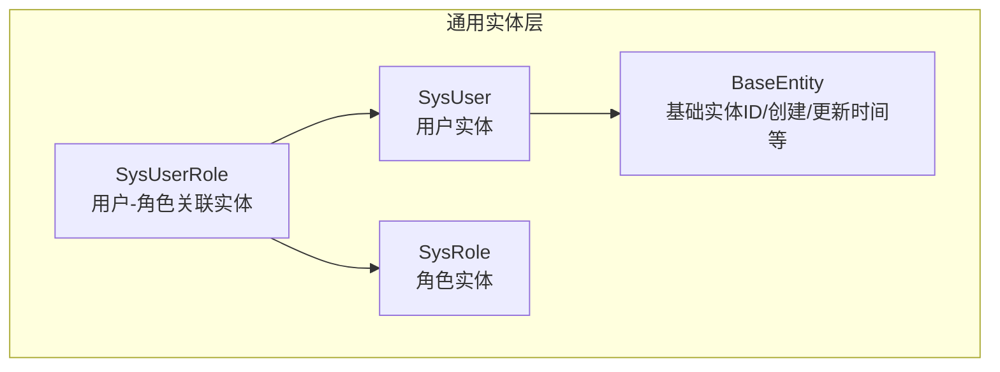
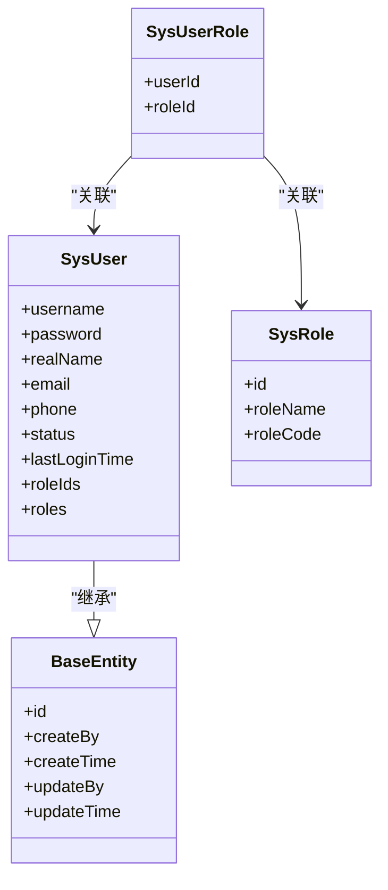
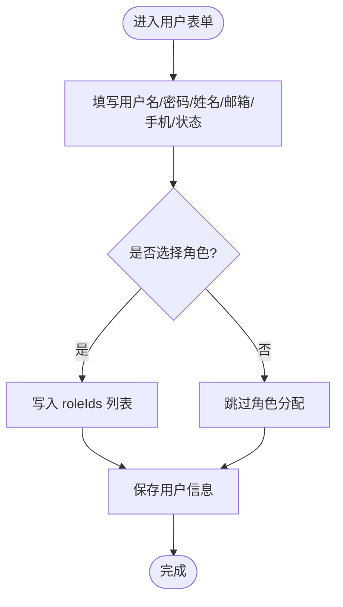
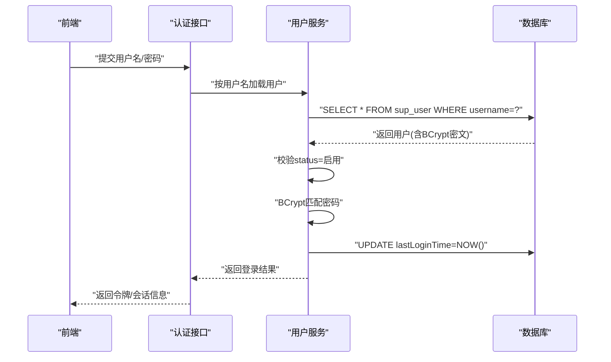
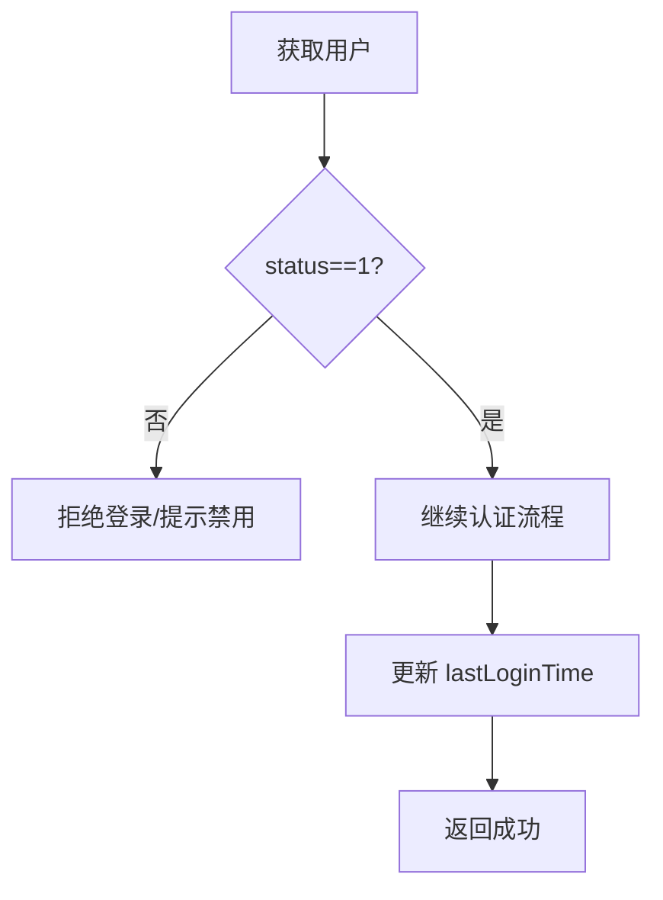
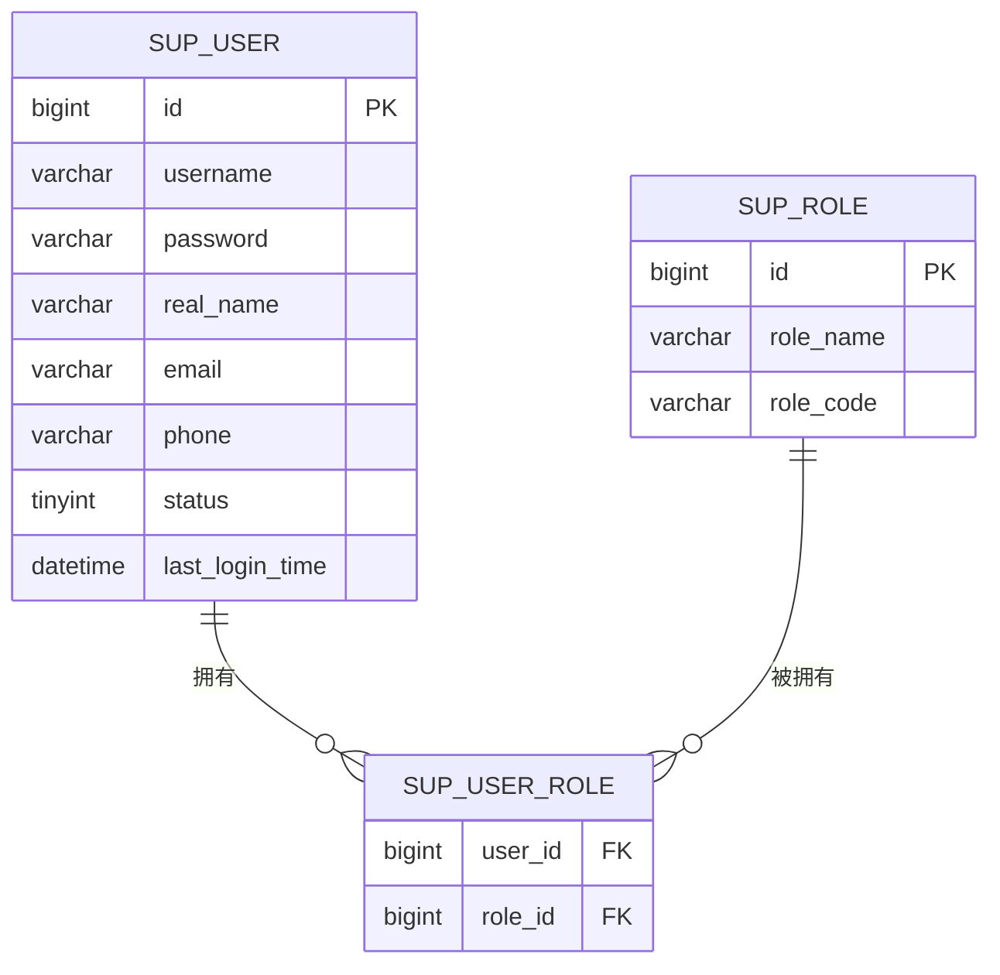
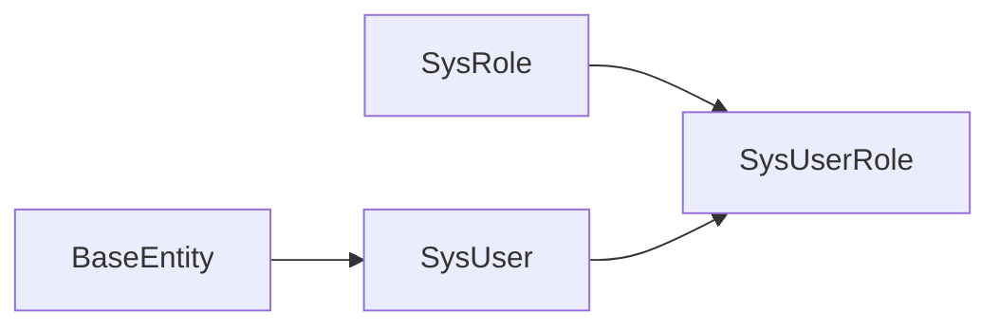

# 用户管理数据模型

<cite>
**本文引用的文件**   
- [SysUser.java](file://ele-ai-tender-system/ele-ai-tender-common/src/main/java/com/jy/eleaitender/common/entity/support/SysUser.java)
- [SysRole.java](file://ele-ai-tender-system/ele-ai-tender-common/src/main/java/com/jy/eleaitender/common/entity/support/SysRole.java)
- [SysUserRole.java](file://ele-ai-tender-system/ele-ai-tender-common/src/main/java/com/jy/eleaitender/common/entity/support/SysUserRole.java)
- [BaseEntity.java](file://ele-ai-tender-system/ele-ai-tender-common/src/main/java/com/jy/eleaitender/common/entity/base/BaseEntity.java)
- [UserStatus.java](file://ele-ai-tender-system/ele-ai-tender-common/src/main/java/com/jy/eleaitender/common/enums/UserStatus.java)
- [support 前端用户管理页面（已编译产物）](file://ele-ai-tender-support-frontend/dist/assets/index-B5rz8ij4.js)
</cite>

## 目录
1. [简介](#简介)
2. [项目结构](#项目结构)
3. [核心组件](#核心组件)
4. [架构总览](#架构总览)
5. [详细组件分析](#详细组件分析)
6. [依赖关系分析](#依赖关系分析)
7. [性能与安全考虑](#性能与安全考虑)
8. [故障排查指南](#故障排查指南)
9. [结论](#结论)
10. [附录：常见操作与数据访问模式](#附录常见操作与数据访问模式)

## 简介
本文件围绕“用户管理”的数据模型进行系统化说明，重点解析 SysUser 实体类的设计结构与字段定义，涵盖用户名、密码加密存储、真实姓名、联系方式、状态管理等核心字段；阐述认证相关的数据处理策略（如 BCrypt 密码加密、用户状态控制、最后登录时间记录等安全机制）；解释用户实体的扩展字段设计（角色 ID 列表与角色对象关联）；并提供用户 CRUD 操作的数据访问模式与业务逻辑示例，以及用户初始化、密码重置、状态变更等常见操作的数据库操作说明。

## 项目结构
用户管理数据模型位于支撑系统通用模块中，采用 MyBatis-Plus 注解映射到数据库表 sup_user，并通过 BaseEntity 继承公共审计字段。角色与用户的多对多关系通过中间表 sup_user_role 维护，角色实体为 SysRole。

图表来源
- [SysUser.java:16-52](file://ele-ai-tender-system/ele-ai-tender-common/src/main/java/com/jy/eleaitender/common/entity/support/SysUser.java#L16-L52)
- [SysRole.java](file://ele-ai-tender-system/ele-ai-tender-common/src/main/java/com/jy/eleaitender/common/entity/support/SysRole.java)
- [SysUserRole.java:15-20](file://ele-ai-tender-system/ele-ai-tender-common/src/main/java/com/jy/eleaitender/common/entity/support/SysUserRole.java#L15-L20)
- [BaseEntity.java](file://ele-ai-tender-system/ele-ai-tender-common/src/main/java/com/jy/eleaitender/common/entity/base/BaseEntity.java)

章节来源
- [SysUser.java:16-52](file://ele-ai-tender-system/ele-ai-tender-common/src/main/java/com/jy/eleaitender/common/entity/support/SysUser.java#L16-L52)
- [SysUserRole.java:15-20](file://ele-ai-tender-system/ele-ai-tender-common/src/main/java/com/jy/eleaitender/common/entity/support/SysUserRole.java#L15-L20)

## 核心组件
- SysUser：系统用户主实体，映射至 sup_user 表，包含登录名、密码、真实姓名、邮箱、手机号、状态、最后登录时间等字段，并包含非持久化扩展字段 roleIds 与 roles。
- SysRole：角色实体，用于 RBAC 权限体系中的角色维度。
- SysUserRole：用户与角色的关联实体，映射至 sup_user_role 表，承载多对多关系。
- BaseEntity：提供 id、创建人、创建时间、更新人、更新时间等公共审计字段。
- UserStatus：用户状态枚举（若存在），用于规范启用/禁用语义。

章节来源
- [SysUser.java:16-52](file://ele-ai-tender-system/ele-ai-tender-common/src/main/java/com/jy/eleaitender/common/entity/support/SysUser.java#L16-L52)
- [SysRole.java](file://ele-ai-tender-system/ele-ai-tender-common/src/main/java/com/jy/eleaitender/common/entity/support/SysRole.java)
- [SysUserRole.java:15-20](file://ele-ai-tender-system/ele-ai-tender-common/src/main/java/com/jy/eleaitender/common/entity/support/SysUserRole.java#L15-L20)
- [BaseEntity.java](file://ele-ai-tender-system/ele-ai-tender-common/src/main/java/com/jy/eleaitender/common/entity/base/BaseEntity.java)
- [UserStatus.java](file://ele-ai-tender-system/ele-ai-tender-common/src/main/java/com/jy/eleaitender/common/enums/UserStatus.java)

## 架构总览
从数据模型视角，用户管理的核心是“用户-角色”多对多关系，配合状态与审计字段形成完整的身份与权限基座。前端在用户管理页面展示用户基本信息、角色标签、状态，并提供新增、编辑、删除、重置密码等操作入口。

图表来源
- [SysUser.java:16-52](file://ele-ai-tender-system/ele-ai-tender-common/src/main/java/com/jy/eleaitender/common/entity/support/SysUser.java#L16-L52)
- [SysRole.java](file://ele-ai-tender-system/ele-ai-tender-common/src/main/java/com/jy/eleaitender/common/entity/support/SysRole.java)
- [SysUserRole.java:15-20](file://ele-ai-tender-system/ele-ai-tender-common/src/main/java/com/jy/eleaitender/common/entity/support/SysUserRole.java#L15-L20)
- [BaseEntity.java](file://ele-ai-tender-system/ele-ai-tender-common/src/main/java/com/jy/eleaitender/common/entity/base/BaseEntity.java)

## 详细组件分析

### SysUser 实体设计与字段说明
- 表映射：@TableName("sup_user")，表示该实体对应数据库表 sup_user。
- 核心字段
  - username：用户名，作为登录标识。
  - password：密码，建议以 BCrypt 密文存储，禁止明文落库。
  - realName：真实姓名，用于显示与审计。
  - email：邮箱，可用于找回密码或通知。
  - phone：手机号，可用于二次验证或通知。
  - status：状态，约定 0=禁用，1=启用。
  - lastLoginTime：最后登录时间，用于安全审计与活跃度统计。
- 扩展字段（非持久化）
  - roleIds：角色 ID 列表，便于批量分配/修改角色。
  - roles：角色对象集合，便于前端展示与权限计算。

图表来源
- [SysUser.java:24-51](file://ele-ai-tender-system/ele-ai-tender-common/src/main/java/com/jy/eleaitender/common/entity/support/SysUser.java#L24-L51)

章节来源
- [SysUser.java:16-52](file://ele-ai-tender-system/ele-ai-tender-common/src/main/java/com/jy/eleaitender/common/entity/support/SysUser.java#L16-L52)

### 用户认证与密码安全策略
- 密码加密：建议使用 BCrypt 算法对用户密码进行加盐哈希后存储，避免明文落库。
- 登录校验：服务端根据 username 查询用户，比对 BCrypt 密文；校验通过后更新 lastLoginTime。
- 状态控制：登录前检查 status 是否为启用；禁用用户应拒绝登录。
- 审计追踪：记录登录成功时间与失败尝试次数（可结合日志或额外字段）。

图表来源
- [SysUser.java:27-43](file://ele-ai-tender-system/ele-ai-tender-common/src/main/java/com/jy/eleaitender/common/entity/support/SysUser.java#L27-L43)

章节来源
- [SysUser.java:27-43](file://ele-ai-tender-system/ele-ai-tender-common/src/main/java/com/jy/eleaitender/common/entity/support/SysUser.java#L27-L43)

### 用户状态管理与最后登录时间
- 状态字段 status：0=禁用，1=启用。建议在用户列表与详情中直观展示，并在关键操作中做前置校验。
- 最后登录时间 lastLoginTime：登录成功后更新，便于审计与风控。

图表来源
- [SysUser.java:39-43](file://ele-ai-tender-system/ele-ai-tender-common/src/main/java/com/jy/eleaitender/common/entity/support/SysUser.java#L39-L43)

章节来源
- [SysUser.java:39-43](file://ele-ai-tender-system/ele-ai-tender-common/src/main/java/com/jy/eleaitender/common/entity/support/SysUser.java#L39-L43)

### 角色关联与扩展字段设计
- 多对多关系：用户与角色通过 sup_user_role 中间表关联，支持一个用户拥有多个角色，一个角色被多个用户拥有。
- 扩展字段
  - roleIds：用于批量分配/更新角色。
  - roles：用于前端展示与权限聚合。

图表来源
- [SysUser.java:16-52](file://ele-ai-tender-system/ele-ai-tender-common/src/main/java/com/jy/eleaitender/common/entity/support/SysUser.java#L16-L52)
- [SysRole.java](file://ele-ai-tender-system/ele-ai-tender-common/src/main/java/com/jy/eleaitender/common/entity/support/SysRole.java)
- [SysUserRole.java:15-20](file://ele-ai-tender-system/ele-ai-tender-common/src/main/java/com/jy/eleaitender/common/entity/support/SysUserRole.java#L15-L20)

章节来源
- [SysUser.java:45-51](file://ele-ai-tender-system/ele-ai-tender-common/src/main/java/com/jy/eleaitender/common/entity/support/SysUser.java#L45-L51)
- [SysUserRole.java:15-20](file://ele-ai-tender-system/ele-ai-tender-common/src/main/java/com/jy/eleaitender/common/entity/support/SysUserRole.java#L15-L20)

### 前端交互与数据展示（参考）
- 用户管理页面展示了用户名、姓名、邮箱、手机号、角色标签、状态、创建时间等信息，并提供新增、编辑、删除、重置密码等操作。
- 角色多选下拉用于分配角色，状态开关用于启用/禁用。

章节来源
- [support 前端用户管理页面（已编译产物）](file://ele-ai-tender-support-frontend/dist/assets/index-B5rz8ij4.js)

## 依赖关系分析
- 直接依赖
  - SysUser 依赖 BaseEntity 提供公共审计字段。
  - SysUser 通过 roleIds/roles 与 SysRole 建立逻辑关联，实际持久化由 SysUserRole 承担。
- 间接依赖
  - 认证流程依赖密码加密工具（BCrypt）、状态枚举（UserStatus，若使用）。
  - 前端依赖后端提供的用户与角色接口（此处仅描述数据模型层面）。

图表来源
- [SysUser.java:16-52](file://ele-ai-tender-system/ele-ai-tender-common/src/main/java/com/jy/eleaitender/common/entity/support/SysUser.java#L16-L52)
- [SysRole.java](file://ele-ai-tender-system/ele-ai-tender-common/src/main/java/com/jy/eleaitender/common/entity/support/SysRole.java)
- [SysUserRole.java:15-20](file://ele-ai-tender-system/ele-ai-tender-common/src/main/java/com/jy/eleaitender/common/entity/support/SysUserRole.java#L15-L20)
- [BaseEntity.java](file://ele-ai-tender-system/ele-ai-tender-common/src/main/java/com/jy/eleaitender/common/entity/base/BaseEntity.java)

章节来源
- [SysUser.java:16-52](file://ele-ai-tender-system/ele-ai-tender-common/src/main/java/com/jy/eleaitender/common/entity/support/SysUser.java#L16-L52)
- [SysUserRole.java:15-20](file://ele-ai-tender-system/ele-ai-tender-common/src/main/java/com/jy/eleaitender/common/entity/support/SysUserRole.java#L15-L20)

## 性能与安全考虑
- 性能
  - 用户查询建议基于 username 建立唯一索引，提升登录与鉴权查询效率。
  - 角色列表按需加载，避免一次性拉取过多关联数据。
- 安全
  - 密码必须使用 BCrypt 存储，禁止明文。
  - 登录失败需限制频率，防止暴力破解。
  - 敏感字段（如手机号、邮箱）在传输与展示时注意脱敏。
  - 状态变更与密码重置需具备管理员权限与审计日志。

[本节为通用指导，不直接分析具体文件]

## 故障排查指南
- 登录失败
  - 检查用户 status 是否为启用。
  - 核对密码是否为 BCrypt 密文且匹配。
  - 查看 lastLoginTime 是否更新，确认登录流程是否执行完毕。
- 角色未生效
  - 检查 sup_user_role 是否存在对应记录。
  - 确认前端是否正确传递 roleIds 列表。
- 状态切换异常
  - 检查状态值是否符合约定（0/1）。
  - 确认是否有并发更新导致覆盖。

章节来源
- [SysUser.java:39-43](file://ele-ai-tender-system/ele-ai-tender-common/src/main/java/com/jy/eleaitender/common/entity/support/SysUser.java#L39-L43)
- [SysUserRole.java:15-20](file://ele-ai-tender-system/ele-ai-tender-common/src/main/java/com/jy/eleaitender/common/entity/support/SysUserRole.java#L15-L20)

## 结论
SysUser 实体以简洁清晰的字段设计覆盖了用户身份、认证、联系信息与状态管理的关键需求；通过 roleIds/roles 扩展字段与 SysUserRole 中间表实现灵活的角色分配；结合 BCrypt 密码加密、状态控制与最后登录时间记录，构建了稳健的用户安全基座。在前端侧，用户管理页面提供了直观的增删改查与角色分配能力，满足日常运维与管理需要。

[本节为总结性内容，不直接分析具体文件]

## 附录：常见操作与数据访问模式

- 用户初始化（首次创建）
  - 输入：username、password（明文，服务端用 BCrypt 加密）、realName、email、phone、status、roleIds。
  - 处理：插入 sup_user，插入 sup_user_role 多条记录。
  - 输出：用户 ID 与初始角色集合。

- 密码重置（管理员操作）
  - 输入：userId、newPassword（明文，服务端用 BCrypt 加密）。
  - 处理：更新 sup_user.password 为新密文。
  - 输出：重置成功。

- 状态变更（启用/禁用）
  - 输入：userId、status（0/1）。
  - 处理：更新 sup_user.status。
  - 输出：状态变更结果。

- 用户信息查询（含角色）
  - 输入：userId 或 username。
  - 处理：查询 sup_user，联查 sup_user_role 与 sup_role 得到 roles。
  - 输出：用户详情与角色列表。

- 用户更新（非敏感字段）
  - 输入：realName、email、phone、status、roleIds。
  - 处理：更新 sup_user 对应字段，同步更新 sup_user_role。
  - 输出：更新成功。

章节来源
- [SysUser.java:24-51](file://ele-ai-tender-system/ele-ai-tender-common/src/main/java/com/jy/eleaitender/common/entity/support/SysUser.java#L24-L51)
- [SysUserRole.java:15-20](file://ele-ai-tender-system/ele-ai-tender-common/src/main/java/com/jy/eleaitender/common/entity/support/SysUserRole.java#L15-L20)