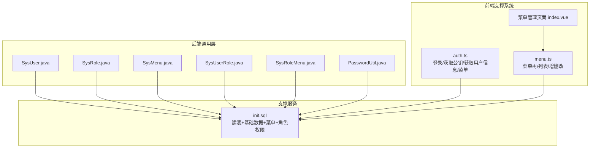
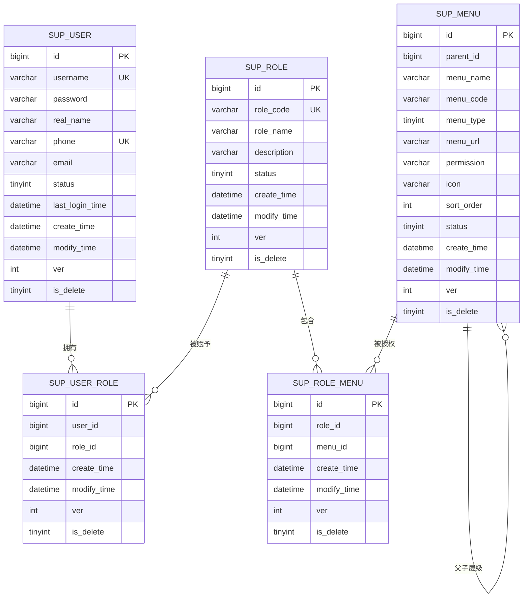
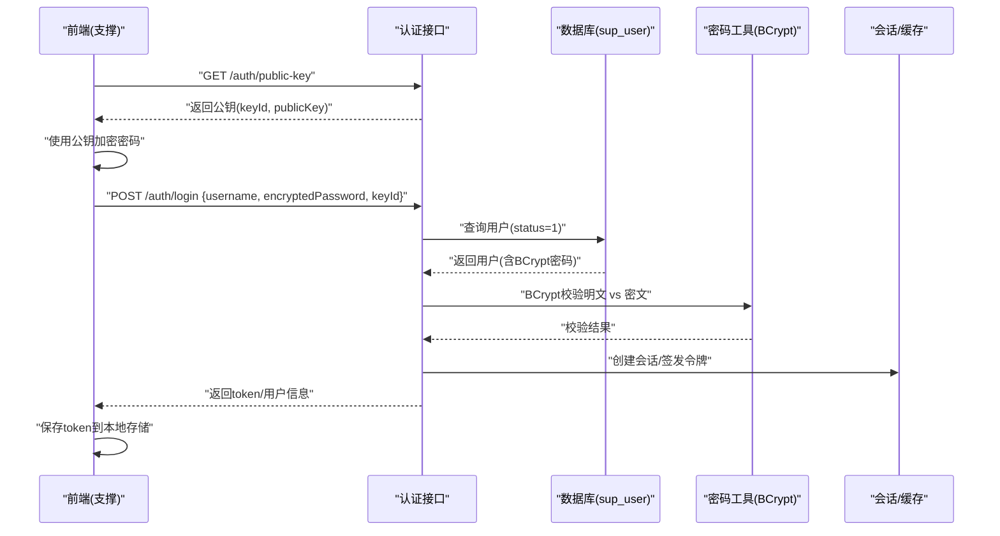
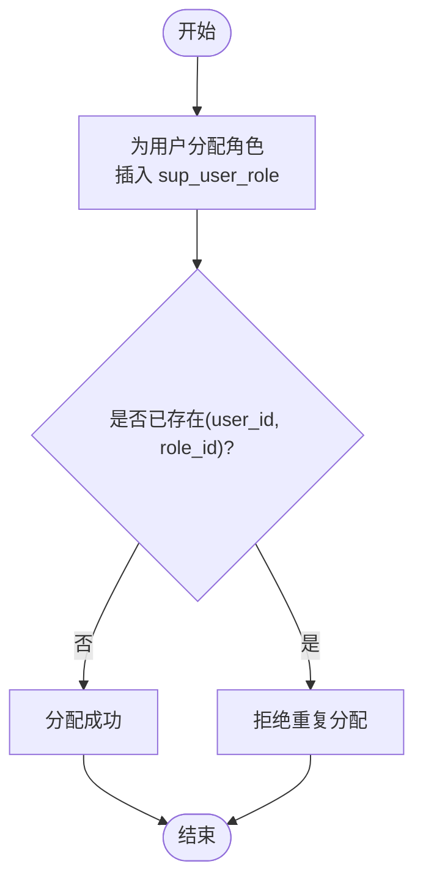
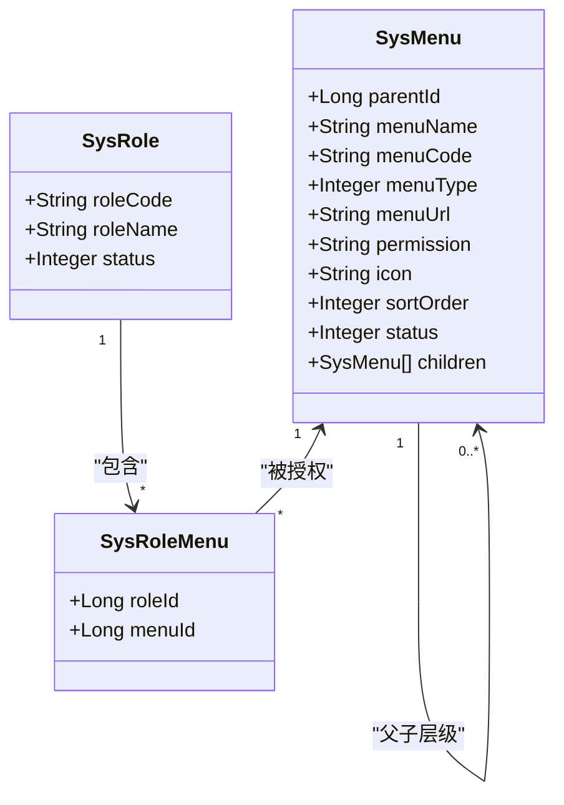
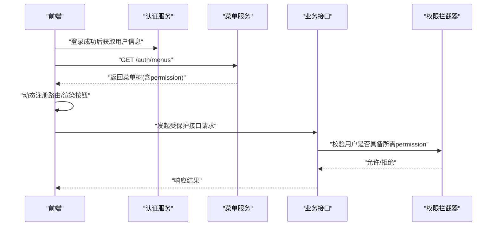
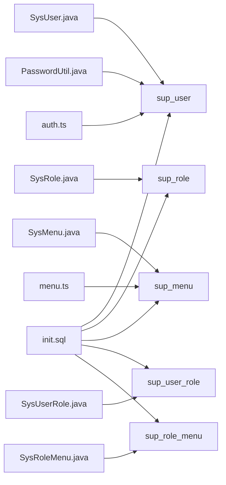

# 用户角色权限模型

<cite>
**本文引用的文件**   
- [ele-ai-tender-support/sql/init.sql](file://ele-ai-tender-system/ele-ai-tender-support/sql/init.sql)
- [SysUser.java](file://ele-ai-tender-system/ele-ai-tender-common/src/main/java/com/jy/eleaitender/common/entity/support/SysUser.java)
- [SysRole.java](file://ele-ai-tender-system/ele-ai-tender-common/src/main/java/com/jy/eleaitender/common/entity/support/SysRole.java)
- [SysMenu.java](file://ele-ai-tender-system/ele-ai-tender-common/src/main/java/com/jy/eleaitender/common/entity/support/SysMenu.java)
- [SysUserRole.java](file://ele-ai-tender-system/ele-ai-tender-common/src/main/java/com/jy/eleaitender/common/entity/support/SysUserRole.java)
- [SysRoleMenu.java](file://ele-ai-tender-system/ele-ai-tender-common/src/main/java/com/jy/eleaitender/common/entity/support/SysRoleMenu.java)
- [PasswordUtil.java](file://ele-ai-tender-system/ele-ai-tender-common/src/main/java/com/jy/eleaitender/common/util/PasswordUtil.java)
- [auth.ts（支撑前端）](file://ele-ai-tender-support-frontend/src/api/auth.ts)
- [menu.ts（支撑前端）](file://ele-ai-tender-support-frontend/src/api/menu.ts)
- [菜单管理页面 index.vue](file://ele-ai-tender-support-frontend/src/views/system/menu/index.vue)
- [SUPPORT_SYSTEM_SPEC.md](file://docs/rules/SUPPORT_SYSTEM_SPEC.md)
</cite>

## 目录
1. [引言](#引言)
2. [项目结构](#项目结构)
3. [核心组件](#核心组件)
4. [架构总览](#架构总览)
5. [详细组件分析](#详细组件分析)
6. [依赖关系分析](#依赖关系分析)
7. [性能与安全考量](#性能与安全考量)
8. [故障排查指南](#故障排查指南)
9. [结论](#结论)
10. [附录：初始化SQL与示例](#附录初始化sql与示例)

## 引言
本文件围绕基于角色的访问控制（RBAC）权限模型，系统性阐述用户、角色、菜单及关联表的数据结构设计、字段含义与业务语义；并说明用户认证流程、角色分配机制、菜单权限控制与按钮级权限验证的实现方案。同时覆盖密码加密存储（BCrypt）、用户状态管理、会话管理等安全相关数据处理策略，并提供权限继承、动态菜单加载、接口权限拦截等核心功能的数据支撑说明。最后给出初始化管理员账户、测试用户与基础权限配置的SQL脚本路径与要点。

## 项目结构
本项目采用多模块组织方式，权限模型的核心实体定义位于通用模块 ele-ai-tender-common 的 support 包下，数据库初始化脚本位于支撑服务模块 ele-ai-tender-support 的 sql 目录中。前端支撑系统提供用户、角色、菜单管理的界面与API调用封装。

图表来源
- [SysUser.java:1-53](file://ele-ai-tender-system/ele-ai-tender-common/src/main/java/com/jy/eleaitender/common/entity/support/SysUser.java#L1-L53)
- [SysRole.java:1-32](file://ele-ai-tender-system/ele-ai-tender-common/src/main/java/com/jy/eleaitender/common/entity/support/SysRole.java#L1-L32)
- [SysMenu.java:1-54](file://ele-ai-tender-system/ele-ai-tender-common/src/main/java/com/jy/eleaitender/common/entity/support/SysMenu.java#L1-L54)
- [SysUserRole.java:1-26](file://ele-ai-tender-system/ele-ai-tender-common/src/main/java/com/jy/eleaitender/common/entity/support/SysUserRole.java#L1-L26)
- [SysRoleMenu.java:1-26](file://ele-ai-tender-system/ele-ai-tender-common/src/main/java/com/jy/eleaitender/common/entity/support/SysRoleMenu.java#L1-L26)
- [PasswordUtil.java:1-62](file://ele-ai-tender-system/ele-ai-tender-common/src/main/java/com/jy/eleaitender/common/util/PasswordUtil.java#L1-L62)
- [ele-ai-tender-support/sql/init.sql:1-682](file://ele-ai-tender-system/ele-ai-tender-support/sql/init.sql#L1-L682)
- [auth.ts（支撑前端）:1-57](file://ele-ai-tender-support-frontend/src\api\auth.ts#L1-L57)
- [menu.ts（支撑前端）:1-97](file://ele-ai-tender-support-frontend/src\api\menu.ts#L1-L97)
- [菜单管理页面 index.vue:1-221](file://ele-ai-tender-support-frontend/src/views/system/menu/index.vue#L1-L221)

章节来源
- [ele-ai-tender-support/sql/init.sql:1-682](file://ele-ai-tender-system/ele-ai-tender-support/sql/init.sql#L1-L682)
- [SUPPORT_SYSTEM_SPEC.md:36-70](file://docs/rules/SUPPORT_SYSTEM_SPEC.md#L36-L70)

## 核心组件
- 用户实体 SysUser：映射 sup_user 表，包含用户名、密码、真实姓名、邮箱、手机号、状态、最后登录时间等字段，以及扩展的角色ID列表与角色集合用于业务组装。
- 角色实体 SysRole：映射 sup_role 表，包含角色编码、角色名称、描述、状态等字段。
- 菜单实体 SysMenu：映射 sup_menu 表，支持父子层级（parentId=0为根），区分菜单与按钮类型，维护URL、权限标识、图标、排序号、状态等，并扩展子菜单集合以构建菜单树。
- 用户角色关联 SysUserRole：映射 sup_user_role 表，记录用户与角色的多对多关系。
- 角色菜单关联 SysRoleMenu：映射 sup_role_menu 表，记录角色与菜单的多对多关系。
- 密码工具 PasswordUtil：提供 BCrypt 加密与校验方法，确保密码安全存储与比对。

章节来源
- [SysUser.java:1-53](file://ele-ai-tender-system/ele-ai-tender-common/src/main/java/com/jy/eleaitender/common/entity/support/SysUser.java#L1-L53)
- [SysRole.java:1-32](file://ele-ai-tender-system/ele-ai-tender-common/src/main/java/com/jy/eleaitender/common/entity/support/SysRole.java#L1-L32)
- [SysMenu.java:1-54](file://ele-ai-tender-system/ele-ai-tender-common/src/main/java/com/jy/eleaitender/common/entity/support/SysMenu.java#L1-L54)
- [SysUserRole.java:1-26](file://ele-ai-tender-system/ele-ai-tender-common/src/main/java/com/jy/eleaitender/common/entity/support/SysUserRole.java#L1-L26)
- [SysRoleMenu.java:1-26](file://ele-ai-tender-system/ele-ai-tender-common/src/main/java/com/jy/eleaitender/common/entity/support/SysRoleMenu.java#L1-L26)
- [PasswordUtil.java:1-62](file://ele-ai-tender-system/ele-ai-tender-common/src/main/java/com/jy/eleaitender/common/util/PasswordUtil.java#L1-L62)

## 架构总览
RBAC 数据模型通过“用户-角色-菜单”三层解耦实现权限控制：
- 用户可拥有多个角色（sup_user_role）。
- 角色可拥有多个菜单（sup_role_menu）。
- 菜单支持层级结构与按钮级权限标识（sup_menu）。

图表来源
- [ele-ai-tender-support/sql/init.sql:23-137](file://ele-ai-tender-system/ele-ai-tender-support/sql/init.sql#L23-L137)

## 详细组件分析

### 数据表与实体映射
- sup_user：用户主数据，含唯一索引 username、phone，状态字段 status 控制启用/禁用，last_login_time 记录最近登录时间。
- sup_role：角色主数据，含唯一索引 role_code，status 控制启用/禁用。
- sup_user_role：用户-角色关联，复合唯一索引 (user_id, role_id)，避免重复分配。
- sup_menu：菜单/权限主数据，支持父子层级（parent_id），区分菜单与按钮（menu_type），维护 URL、权限标识（permission）、图标、排序号、状态等。
- sup_role_menu：角色-菜单关联，复合唯一索引 (role_id, menu_id)。

章节来源
- [ele-ai-tender-support/sql/init.sql:23-137](file://ele-ai-tender-system/ele-ai-tender-support/sql/init.sql#L23-L137)
- [SysUser.java:1-53](file://ele-ai-tender-system/ele-ai-tender-common/src/main/java/com/jy/eleaitender/common/entity/support/SysUser.java#L1-L53)
- [SysRole.java:1-32](file://ele-ai-tender-system/ele-ai-tender-common/src/main/java/com/jy/eleaitender/common/entity/support/SysRole.java#L1-L32)
- [SysMenu.java:1-54](file://ele-ai-tender-system/ele-ai-tender-common/src/main/java/com/jy/eleaitender/common/entity/support/SysMenu.java#L1-L54)
- [SysUserRole.java:1-26](file://ele-ai-tender-system/ele-ai-tender-common/src/main/java/com/jy/eleaitender/common/entity/support/SysUserRole.java#L1-L26)
- [SysRoleMenu.java:1-26](file://ele-ai-tender-system/ele-ai-tender-common/src/main/java/com/jy/eleaitender/common/entity/support/SysRoleMenu.java#L1-L26)

### 用户认证流程（RSA传输 + BCrypt存储 + 会话管理）
- 前端在登录前获取服务端RSA公钥，使用公钥对密码进行加密后提交。
- 服务端校验用户状态（status=1），使用 BCrypt 校验密码。
- 认证成功后生成令牌（如JWT），返回给前端；前端将 token 持久化到本地存储并在后续请求携带。
- 登出时清除服务端会话或使令牌失效，前端移除本地 token。

图表来源
- [auth.ts（支撑前端）:1-57](file://ele-ai-tender-support-frontend/src\api\auth.ts#L1-L57)
- [PasswordUtil.java:1-62](file://ele-ai-tender-system/ele-ai-tender-common/src/main/java/com/jy/eleaitender/common/util/PasswordUtil.java#L1-L62)
- [ele-ai-tender-support/sql/init.sql:23-45](file://ele-ai-tender-system/ele-ai-tender-support/sql/init.sql#L23-L45)

章节来源
- [auth.ts（支撑前端）:1-57](file://ele-ai-tender-support-frontend/src\api\auth.ts#L1-L57)
- [PasswordUtil.java:1-62](file://ele-ai-tender-system/ele-ai-tender-common/src/main/java/com/jy/eleaitender/common/util/PasswordUtil.java#L1-L62)
- [SUPPORT_SYSTEM_SPEC.md:244-244](file://docs/rules/SUPPORT_SYSTEM_SPEC.md#L244-L244)

### 角色分配机制
- 管理员可将一个或多个角色分配给用户，写入 sup_user_role，并通过唯一索引保证不重复。
- 角色本身通过 sup_role 维护，支持启用/禁用状态。
- 角色与菜单的权限通过 sup_role_menu 建立多对多关系。

图表来源
- [ele-ai-tender-support/sql/init.sql:72-88](file://ele-ai-tender-system/ele-ai-tender-support/sql/init.sql#L72-L88)

章节来源
- [ele-ai-tender-support/sql/init.sql:72-88](file://ele-ai-tender-system/ele-ai-tender-support/sql/init.sql#L72-L88)

### 菜单权限控制与按钮级权限
- sup_menu 支持两种类型：菜单（menu_type=1）与按钮（menu_type=2）。
- 菜单树通过 parentId 构建，前端根据 menuUrl 渲染路由，根据 permission 控制按钮可见性与操作权限。
- 角色菜单关联 sup_role_menu 决定某角色可访问的菜单集合。

图表来源
- [SysMenu.java:1-54](file://ele-ai-tender-system/ele-ai-tender-common/src/main/java/com/jy/eleaitender/common/entity/support/SysMenu.java#L1-L54)
- [SysRoleMenu.java:1-26](file://ele-ai-tender-system/ele-ai-tender-common/src/main/java/com/jy/eleaitender/common/entity/support/SysRoleMenu.java#L1-L26)
- [SysRole.java:1-32](file://ele-ai-tender-system/ele-ai-tender-common/src/main/java/com/jy/eleaitender/common/entity/support/SysRole.java#L1-L32)

章节来源
- [ele-ai-tender-support/sql/init.sql:93-137](file://ele-ai-tender-system/ele-ai-tender-support/sql/init.sql#L93-L137)
- [menu.ts（支撑前端）:1-97](file://ele-ai-tender-support-frontend/src\api\menu.ts#L1-L97)
- [菜单管理页面 index.vue:1-221](file://ele-ai-tender-support-frontend/src/views/system/menu/index.vue#L1-L221)

### 接口权限拦截与权限继承
- 权限继承：用户通过角色间接获得菜单与按钮权限，无需直接绑定菜单。
- 接口权限拦截：后端可在控制器或切面中检查当前用户的权限集合（由角色-菜单推导），若缺少对应 permission 则拒绝访问。
- 前端动态菜单加载：登录后调用 /auth/menus 获取当前用户可访问菜单树，按 menuUrl 注入路由，按 permission 控制按钮显示。

图表来源
- [auth.ts（支撑前端）:22-29](file://ele-ai-tender-support-frontend/src\api\auth.ts#L22-L29)
- [SUPPORT_SYSTEM_SPEC.md:36-70](file://docs/rules/SUPPORT_SYSTEM_SPEC.md#L36-L70)

章节来源
- [SUPPORT_SYSTEM_SPEC.md:36-70](file://docs/rules/SUPPORT_SYSTEM_SPEC.md#L36-L70)

## 依赖关系分析
- 实体与表：所有实体均通过注解映射到 sup_* 表，形成清晰的数据层契约。
- 前端API：auth.ts 负责认证与用户信息/菜单获取；menu.ts 负责菜单树的CRUD与树形转换。
- 初始化脚本：init.sql 提供完整的建表、基础数据、菜单与角色权限分配，确保系统启动即可运行。

图表来源
- [SysUser.java:1-53](file://ele-ai-tender-system/ele-ai-tender-common/src/main/java/com/jy/eleaitender/common/entity/support/SysUser.java#L1-L53)
- [SysRole.java:1-32](file://ele-ai-tender-system/ele-ai-tender-common/src/main/java/com/jy/eleaitender/common/entity/support/SysRole.java#L1-L32)
- [SysMenu.java:1-54](file://ele-ai-tender-system/ele-ai-tender-common/src/main/java/com/jy/eleaitender/common/entity/support/SysMenu.java#L1-L54)
- [SysUserRole.java:1-26](file://ele-ai-tender-system/ele-ai-tender-common/src/main/java/com/jy/eleaitender/common/entity/support/SysUserRole.java#L1-L26)
- [SysRoleMenu.java:1-26](file://ele-ai-tender-system/ele-ai-tender-common/src/main/java/com/jy/eleaitender/common/entity/support/SysRoleMenu.java#L1-L26)
- [PasswordUtil.java:1-62](file://ele-ai-tender-system/ele-ai-tender-common/src/main/java/com/jy/eleaitender/common/util/PasswordUtil.java#L1-L62)
- [auth.ts（支撑前端）:1-57](file://ele-ai-tender-support-frontend/src\api\auth.ts#L1-L57)
- [menu.ts（支撑前端）:1-97](file://ele-ai-tender-support-frontend/src\api\menu.ts#L1-L97)
- [ele-ai-tender-support/sql/init.sql:1-682](file://ele-ai-tender-system/ele-ai-tender-support/sql/init.sql#L1-L682)

章节来源
- [ele-ai-tender-support/sql/init.sql:1-682](file://ele-ai-tender-system/ele-ai-tender-support/sql/init.sql#L1-L682)

## 性能与安全考量
- 性能
  - 复合唯一索引：sup_user_role(user_id, role_id)、sup_role_menu(role_id, menu_id) 有效防止重复分配并提升查询效率。
  - 菜单树查询：建议在后端一次性返回树形结构，减少前端多次往返。
  - 登录校验：仅查询必要字段，结合状态位快速过滤禁用用户。
- 安全
  - 密码传输：前端使用 RSA 公钥加密密码，避免明文在网络中传输。
  - 密码存储：后端使用 BCrypt 哈希存储，不可逆且抗碰撞。
  - 用户状态：status 控制启用/禁用，登录失败需检查该字段并结合会话策略。
  - 会话管理：建议使用无状态令牌（如JWT）配合黑名单或短期有效期，必要时结合 Redis 做强制下线。

[本节为通用指导，不直接分析具体文件]

## 故障排查指南
- 登录失败
  - 检查用户状态是否为启用（status=1）。
  - 确认密码是否正确（注意前端RSA加密与服务端BCrypt校验）。
  - 检查会话/令牌是否过期或被吊销。
- 菜单不显示
  - 确认当前用户是否被分配相应角色。
  - 检查角色是否拥有对应菜单（sup_role_menu）。
  - 检查菜单状态（status=1）与父级菜单是否启用。
- 按钮权限无效
  - 检查菜单的 permission 标识是否与前端按钮权限一致。
  - 确认后端接口权限拦截逻辑是否生效。

章节来源
- [SUPPORT_SYSTEM_SPEC.md:244-244](file://docs/rules/SUPPORT_SYSTEM_SPEC.md#L244-L244)

## 结论
本 RBAC 模型通过清晰的用户-角色-菜单三层结构与完善的关联表设计，实现了灵活的权限控制与可扩展的菜单体系。结合 RSA 传输加密与 BCrypt 存储，保障了认证过程的安全性。前端动态菜单加载与按钮级权限控制提升了用户体验与安全性。建议在部署时严格遵循初始化脚本，完善会话管理与接口权限拦截，以确保系统的稳定与安全。

[本节为总结性内容，不直接分析具体文件]

## 附录：初始化SQL与示例
- 数据库与表结构
  - 建库与表结构、索引定义见初始化脚本。
- 基础数据
  - 管理员用户与测试用户（密码均为 123456，BCrypt 加密存储）。
  - 管理员角色与业务用户角色。
  - 用户-角色关联。
- 菜单与权限
  - 一级与二级菜单、按钮级权限标识。
  - 管理员角色分配所有菜单权限。
  - 业务用户角色仅分配 AI 编制相关菜单权限。

章节来源
- [ele-ai-tender-support/sql/init.sql:473-503](file://ele-ai-tender-system/ele-ai-tender-support/sql/init.sql#L473-L503)
- [ele-ai-tender-support/sql/init.sql:529-676](file://ele-ai-tender-system/ele-ai-tender-support/sql/init.sql#L529-L676)