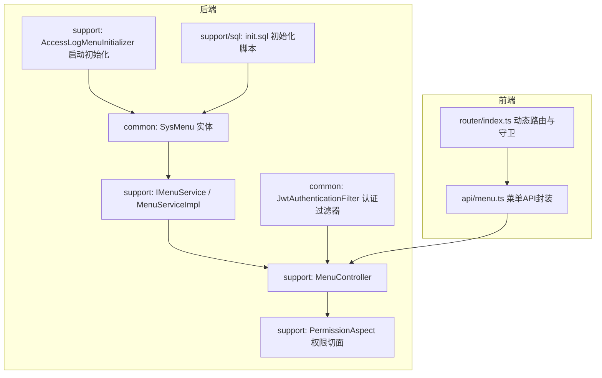
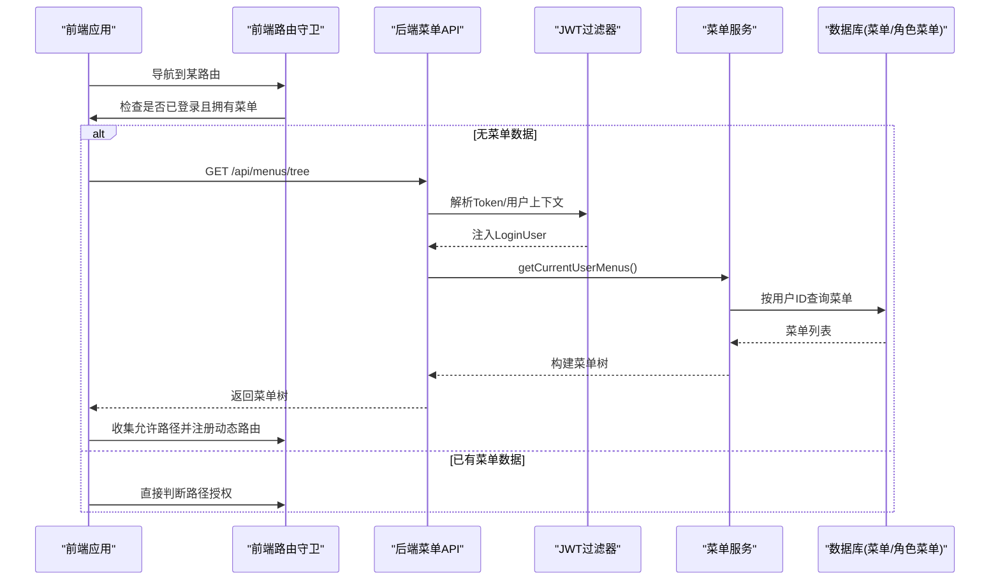
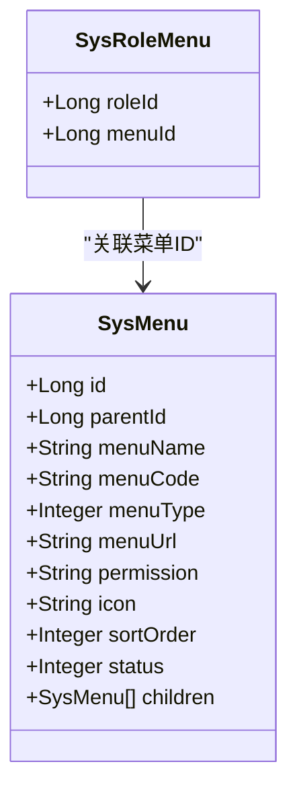
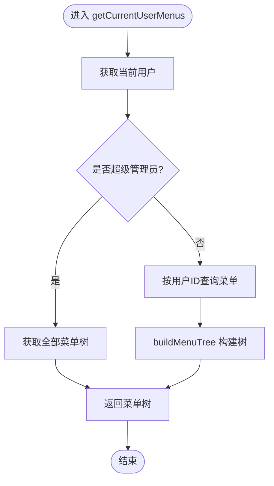
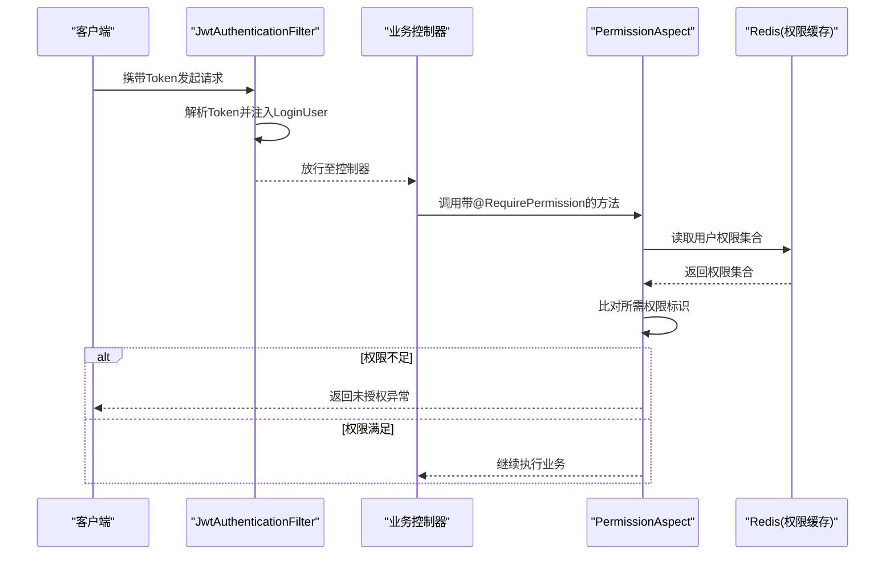
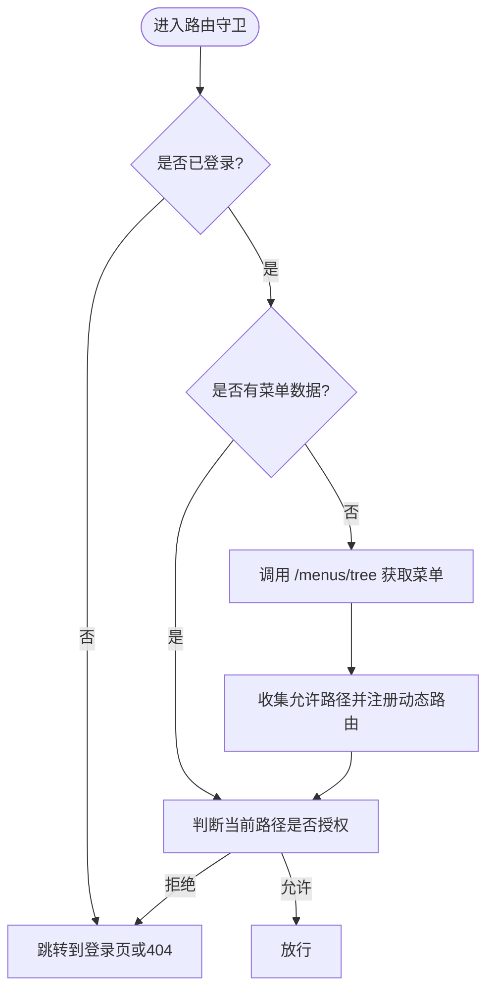
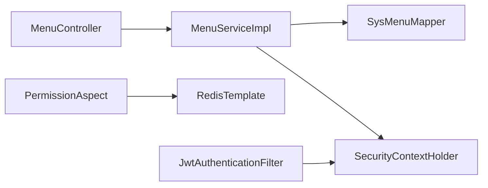

# 菜单权限数据模型

<cite>
**本文引用的文件列表**
- [SysMenu.java](file://ele-ai-tender-system/ele-ai-tender-common/src/main/java/com/jy/eleaitender/common/entity/support/SysMenu.java)
- [init.sql](file://ele-ai-tender-system/ele-ai-tender-support/sql/init.sql)
- [IMenuService.java](file://ele-ai-tender-system/ele-ai-tender-support/src/main/java/com/jy/eleaitender/support/service/IMenuService.java)
- [MenuServiceImpl.java](file://ele-ai-tender-system/ele-ai-tender-support/src/main/java/com/jy/eleaitender/support/service/impl/MenuServiceImpl.java)
- [MenuController.java](file://ele-ai-tender-system/ele-ai-tender-support/src/main/java/com/jy/eleaitender/support/controller/MenuController.java)
- [PermissionAspect.java](file://ele-ai-tender-system/ele-ai-tender-support/src/main/java/com/jy/eleaitender/support/aspect/PermissionAspect.java)
- [JwtAuthenticationFilter.java](file://ele-ai-tender-system/ele-ai-tender-common/src/main/java/com/jy/eleaitender/common/security/JwtAuthenticationFilter.java)
- [AccessLogMenuInitializer.java](file://ele-ai-tender-system/ele-ai-tender-support/src/main/java/com/jy/eleaitender/support/config/AccessLogMenuInitializer.java)
- [menu.ts](file://ele-ai-tender-support-frontend/src/api/menu.ts)
- [index.ts（前端路由）](file://ele-ai-tender-support-frontend/src/router/index.ts)
</cite>

## 目录
1. [简介](#简介)
2. [项目结构](#项目结构)
3. [核心组件](#核心组件)
4. [架构总览](#架构总览)
5. [详细组件分析](#详细组件分析)
6. [依赖关系分析](#依赖关系分析)
7. [性能与优化](#性能与优化)
8. [故障排查指南](#故障排查指南)
9. [结论](#结论)
10. [附录：示例与最佳实践](#附录示例与最佳实践)

## 简介
本文件围绕“菜单权限数据模型”进行系统化说明，重点覆盖以下方面：
- SysMenu 实体类的设计结构与层级关系，包括菜单编码、父级菜单ID、菜单类型（目录/菜单/按钮）、路由地址、组件路径等核心字段。
- 菜单树形结构的数据库设计与查询优化策略。
- 菜单权限的动态加载机制：基于用户角色的菜单过滤、按钮级权限控制。
- 菜单CRUD操作与权限验证拦截器的数据支撑说明。
- 菜单初始化脚本、权限规则配置与前端动态路由生成的完整示例指引。

## 项目结构
本项目采用前后端分离的模块化架构，菜单权限相关代码主要分布在支撑中心后端模块 ele-ai-tender-support 与公共模块 ele-ai-tender-common，以及支撑中心前端 ele-ai-tender-support-frontend。

图表来源
- [SysMenu.java:1-54](file://ele-ai-tender-system/ele-ai-tender-common/src/main/java/com/jy/eleaitender/common/entity/support/SysMenu.java#L1-L54)
- [IMenuService.java:1-48](file://ele-ai-tender-system/ele-ai-tender-support/src/main/java/com/jy/eleaitender/support/service/IMenuService.java#L1-L48)
- [MenuServiceImpl.java:1-127](file://ele-ai-tender-system/ele-ai-tender-support/src/main/java/com/jy/eleaitender/support/service/impl/MenuServiceImpl.java#L1-L127)
- [MenuController.java:1-79](file://ele-ai-tender-system/ele-ai-tender-support/src/main/java/com/jy/eleaitender/support/controller/MenuController.java#L1-L79)
- [PermissionAspect.java:1-38](file://ele-ai-tender-system/ele-ai-tender-support/src/main/java/com/jy/eleaitender/support/aspect/PermissionAspect.java#L1-L38)
- [JwtAuthenticationFilter.java:32-64](file://ele-ai-tender-system/ele-ai-tender-common/src/main/java/com/jy/eleaitender/common/security/JwtAuthenticationFilter.java#L32-L64)
- [AccessLogMenuInitializer.java:1-62](file://ele-ai-tender-system/ele-ai-tender-support/src/main/java/com/jy/eleaitender/support/config/AccessLogMenuInitializer.java#L1-L62)
- [init.sql:90-137](file://ele-ai-tender-system/ele-ai-tender-support/sql/init.sql#L90-L137)
- [menu.ts:1-97](file://ele-ai-tender-support-frontend/src/api/menu.ts#L1-L97)
- [index.ts（前端路由）:111-198](file://ele-ai-tender-support-frontend/src/router/index.ts#L111-L198)

章节来源
- [SysMenu.java:1-54](file://ele-ai-tender-system/ele-ai-tender-common/src/main/java/com/jy/eleaitender/common/entity/support/SysMenu.java#L1-L54)
- [init.sql:90-137](file://ele-ai-tender-system/ele-ai-tender-support/sql/init.sql#L90-L137)
- [IMenuService.java:1-48](file://ele-ai-tender-system/ele-ai-tender-support/src/main/java/com/jy/eleaitender/support/service/IMenuService.java#L1-L48)
- [MenuServiceImpl.java:1-127](file://ele-ai-tender-system/ele-ai-tender-support/src/main/java/com/jy/eleaitender/support/service/impl/MenuServiceImpl.java#L1-L127)
- [MenuController.java:1-79](file://ele-ai-tender-system/ele-ai-tender-support/src/main/java/com/jy/eleaitender/support/controller/MenuController.java#L1-L79)
- [PermissionAspect.java:1-38](file://ele-ai-tender-system/ele-ai-tender-support/src/main/java/com/jy/eleaitender/support/aspect/PermissionAspect.java#L1-L38)
- [JwtAuthenticationFilter.java:32-64](file://ele-ai-tender-system/ele-ai-tender-common/src/main/java/com/jy/eleaitender/common/security/JwtAuthenticationFilter.java#L32-L64)
- [AccessLogMenuInitializer.java:1-62](file://ele-ai-tender-system/ele-ai-tender-support/src/main/java/com/jy/eleaitender/support/config/AccessLogMenuInitializer.java#L1-L62)
- [menu.ts:1-97](file://ele-ai-tender-support-frontend/src/api/menu.ts#L1-L97)
- [index.ts（前端路由）:111-198](file://ele-ai-tender-support-frontend/src/router/index.ts#L111-L198)

## 核心组件
- 数据模型：SysMenu 实体定义菜单节点的核心属性与层级关系；数据库表 sup_menu 提供持久化存储；sup_role_menu 实现角色与菜单的关联。
- 服务层：IMenuService 接口与 MenuServiceImpl 实现负责菜单树的构建、按用户/角色过滤、CRUD 操作。
- 控制器层：MenuController 暴露 REST API，用于获取菜单树、平铺列表及 CRUD。
- 安全与权限：JwtAuthenticationFilter 完成登录态解析；PermissionAspect 对方法级权限标识进行校验。
- 前端集成：menu.ts 封装菜单API；router/index.ts 在路由守卫中根据用户菜单生成动态路由并做访问控制。

章节来源
- [SysMenu.java:1-54](file://ele-ai-tender-system/ele-ai-tender-common/src/main/java/com/jy/eleaitender/common/entity/support/SysMenu.java#L1-L54)
- [init.sql:90-137](file://ele-ai-tender-system/ele-ai-tender-support/sql/init.sql#L90-L137)
- [IMenuService.java:1-48](file://ele-ai-tender-system/ele-ai-tender-support/src/main/java/com/jy/eleaitender/support/service/IMenuService.java#L1-L48)
- [MenuServiceImpl.java:1-127](file://ele-ai-tender-system/ele-ai-tender-support/src/main/java/com/jy/eleaitender/support/service/impl/MenuServiceImpl.java#L1-L127)
- [MenuController.java:1-79](file://ele-ai-tender-system/ele-ai-tender-support/src/main/java/com/jy/eleaitender/support/controller/MenuController.java#L1-L79)
- [PermissionAspect.java:1-38](file://ele-ai-tender-system/ele-ai-tender-support/src/main/java/com/jy/eleaitender/support/aspect/PermissionAspect.java#L1-L38)
- [JwtAuthenticationFilter.java:32-64](file://ele-ai-tender-system/ele-ai-tender-common/src/main/java/com/jy/eleaitender/common/security/JwtAuthenticationFilter.java#L32-L64)
- [menu.ts:1-97](file://ele-ai-tender-support-frontend/src/api/menu.ts#L1-L97)
- [index.ts（前端路由）:111-198](file://ele-ai-tender-support-frontend/src/router/index.ts#L111-L198)

## 架构总览
下图展示了从前端到后端的菜单权限关键流程：前端通过 API 获取当前用户的菜单树，并在路由守卫中进行动态路由注册与访问控制；后端通过 JWT 过滤器解析用户上下文，结合角色-菜单关联返回受控菜单树；方法级权限由切面基于权限标识进行校验。

图表来源
- [MenuController.java:26-44](file://ele-ai-tender-system/ele-ai-tender-support/src/main/java/com/jy/eleaitender/support/controller/MenuController.java#L26-L44)
- [MenuServiceImpl.java:26-39](file://ele-ai-tender-system/ele-ai-tender-support/src/main/java/com/jy/eleaitender/support/service/impl/MenuServiceImpl.java#L26-L39)
- [JwtAuthenticationFilter.java:32-64](file://ele-ai-tender-system/ele-ai-tender-common/src/main/java/com/jy/eleaitender/common/security/JwtAuthenticationFilter.java#L32-L64)
- [index.ts（前端路由）:175-198](file://ele-ai-tender-support-frontend/src/router/index.ts#L175-L198)

## 详细组件分析

### 数据模型与数据库设计
- 实体字段与含义
  - parentId：父菜单ID，0表示根菜单，用于构建树形结构。
  - menuName：菜单名称。
  - menuCode：菜单编码，常用于前端组件映射或唯一标识。
  - menuType：菜单类型，枚举值 1-菜单，2-按钮。
  - menuUrl：菜单URL，对应前端路由路径。
  - permission：权限标识，用于按钮级权限控制与方法级鉴权。
  - icon：图标。
  - sortOrder：排序号。
  - status：状态，0-禁用，1-启用。
  - children：非持久化字段，用于树形展示。
- 数据库表
  - sup_menu：菜单主表，包含上述字段，并提供 parent_id 与 menu_code 索引以优化树查询与编码检索。
  - sup_role_menu：角色-菜单关联表，支持多对多权限分配。
- 复杂度与索引
  - 树构建时间复杂度 O(n)，空间复杂度 O(n)。
  - 索引 idx_parent_id 加速父子关系查询；idx_menu_code 加速编码检索。

图表来源
- [SysMenu.java:1-54](file://ele-ai-tender-system/ele-ai-tender-common/src/main/java/com/jy/eleaitender/common/entity/support/SysMenu.java#L1-L54)
- [init.sql:90-137](file://ele-ai-tender-system/ele-ai-tender-support/sql/init.sql#L90-L137)

章节来源
- [SysMenu.java:1-54](file://ele-ai-tender-system/ele-ai-tender-common/src/main/java/com/jy/eleaitender/common/entity/support/SysMenu.java#L1-L54)
- [init.sql:90-137](file://ele-ai-tender-system/ele-ai-tender-support/sql/init.sql#L90-L137)

### 菜单树构建与服务逻辑
- 服务接口 IMenuService 定义了获取当前用户菜单树、全量菜单树、平铺列表、CRUD 与按角色获取菜单ID列表等方法。
- 实现类 MenuServiceImpl 的关键逻辑：
  - getCurrentUserMenus：从 SecurityContextHolder 获取 LoginUser，超级管理员直接返回全量菜单树，否则按用户ID查询菜单并构建树。
  - buildMenuTree：将平铺菜单按 parentId 分组，递归设置 children，并按 sortOrder 排序。
  - getMenuIdsByRoleId：供权限系统使用，按角色获取菜单ID集合。

图表来源
- [MenuServiceImpl.java:26-39](file://ele-ai-tender-system/ele-ai-tender-support/src/main/java/com/jy/eleaitender/support/service/impl/MenuServiceImpl.java#L26-L39)
- [MenuServiceImpl.java:84-125](file://ele-ai-tender-system/ele-ai-tender-support/src/main/java/com/jy/eleaitender/support/service/impl/MenuServiceImpl.java#L84-L125)

章节来源
- [IMenuService.java:1-48](file://ele-ai-tender-system/ele-ai-tender-support/src/main/java/com/jy/eleaitender/support/service/IMenuService.java#L1-L48)
- [MenuServiceImpl.java:1-127](file://ele-ai-tender-system/ele-ai-tender-support/src/main/java/com/jy/eleaitender/support/service/impl/MenuServiceImpl.java#L1-L127)

### 控制器与API
- MenuController 提供以下REST接口：
  - GET /api/menus/tree：获取当前用户菜单树。
  - GET /api/menus：获取平铺菜单列表。
  - GET /api/menus/{id}：获取菜单详情。
  - POST /api/menus：创建菜单。
  - PUT /api/menus/{id}：更新菜单。
  - DELETE /api/menus/{id}：删除菜单。
- 所有接口均要求登录（@RequireLogin），部分写操作记录操作日志（@OperationLog）。

章节来源
- [MenuController.java:1-79](file://ele-ai-tender-system/ele-ai-tender-support/src/main/java/com/jy/eleaitender/support/controller/MenuController.java#L1-L79)

### 权限验证与拦截器
- 认证过滤器 JwtAuthenticationFilter：
  - 从请求中提取 Token，校验有效性后将 LoginUser 注入到 SecurityContextHolder，供后续业务使用。
- 权限切面 PermissionAspect：
  - 针对标注了 @RequirePermission 的方法进行权限校验，依据当前用户的权限集合与目标方法的权限标识进行匹配，未通过则抛出认证异常。

图表来源
- [JwtAuthenticationFilter.java:32-64](file://ele-ai-tender-system/ele-ai-tender-common/src/main/java/com/jy/eleaitender/common/security/JwtAuthenticationFilter.java#L32-L64)
- [PermissionAspect.java:1-38](file://ele-ai-tender-system/ele-ai-tender-support/src/main/java/com/jy/eleaitender/support/aspect/PermissionAspect.java#L1-L38)

章节来源
- [JwtAuthenticationFilter.java:32-64](file://ele-ai-tender-system/ele-ai-tender-common/src/main/java/com/jy/eleaitender/common/security/JwtAuthenticationFilter.java#L32-L64)
- [PermissionAspect.java:1-38](file://ele-ai-tender-system/ele-ai-tender-support/src/main/java/com/jy/eleaitender/support/aspect/PermissionAspect.java#L1-L38)

### 前端动态路由与菜单管理
- 前端 API 封装 menu.ts：
  - 提供 getTree、getList、getById、create、update 等方法，并将后端菜单字段映射为前端 MenuInfo 结构（如 menuUrl -> path，menuCode -> component）。
- 路由守卫 index.ts：
  - 在 beforeEach 中若用户未登录则跳转登录页；若已登录但无菜单数据则调用 getUserMenus 获取菜单树。
  - collectAllowedPaths 遍历菜单树，收集允许的路径集合；isPathAuthorized 判断当前路由是否在允许集合内。
  - 根据菜单树动态注册路由，并对无权访问的路由进行拦截。

图表来源
- [menu.ts:1-97](file://ele-ai-tender-support-frontend/src/api/menu.ts#L1-L97)
- [index.ts（前端路由）:175-198](file://ele-ai-tender-support-frontend/src/router/index.ts#L175-L198)

章节来源
- [menu.ts:1-97](file://ele-ai-tender-support-frontend/src/api/menu.ts#L1-L97)
- [index.ts（前端路由）:111-198](file://ele-ai-tender-support-frontend/src/router/index.ts#L111-L198)

## 依赖关系分析
- 耦合与内聚
  - MenuServiceImpl 依赖 SysMenuMapper 与 SecurityContextHolder，职责清晰，内聚度高。
  - MenuController 仅作为入口转发，低耦合。
  - PermissionAspect 与 Redis 交互，解耦权限存储与校验逻辑。
- 外部依赖
  - MyBatis-Plus 提供基础CRUD与条件查询。
  - Spring Security 风格注解与自定义注解组合实现认证与授权。
  - Redis 用于缓存用户权限集合，提升鉴权性能。
- 潜在循环依赖
  - 当前未发现循环依赖；如需扩展，建议通过接口抽象与事件机制进一步解耦。

图表来源
- [MenuController.java:1-79](file://ele-ai-tender-system/ele-ai-tender-support/src/main/java/com/jy/eleaitender/support/controller/MenuController.java#L1-L79)
- [MenuServiceImpl.java:1-127](file://ele-ai-tender-system/ele-ai-tender-support/src/main/java/com/jy/eleaitender/support/service/impl/MenuServiceImpl.java#L1-L127)
- [PermissionAspect.java:1-38](file://ele-ai-tender-system/ele-ai-tender-support/src/main/java/com/jy/eleaitender/support/aspect/PermissionAspect.java#L1-L38)
- [JwtAuthenticationFilter.java:32-64](file://ele-ai-tender-system/ele-ai-tender-common/src/main/java/com/jy/eleaitender/common/security/JwtAuthenticationFilter.java#L32-L64)

章节来源
- [MenuController.java:1-79](file://ele-ai-tender-system/ele-ai-tender-support/src/main/java/com/jy/eleaitender/support/controller/MenuController.java#L1-L79)
- [MenuServiceImpl.java:1-127](file://ele-ai-tender-system/ele-ai-tender-support/src/main/java/com/jy/eleaitender/support/service/impl/MenuServiceImpl.java#L1-L127)
- [PermissionAspect.java:1-38](file://ele-ai-tender-system/ele-ai-tender-support/src/main/java/com/jy/eleaitender/support/aspect/PermissionAspect.java#L1-L38)
- [JwtAuthenticationFilter.java:32-64](file://ele-ai-tender-system/ele-ai-tender-common/src/main/java/com/jy/eleaitender/common/security/JwtAuthenticationFilter.java#L32-L64)

## 性能与优化
- 数据库层面
  - 利用 idx_parent_id 与 idx_menu_code 索引优化父子查询与编码检索。
  - 对于大规模菜单树，可考虑在应用层缓存菜单树（例如按用户维度缓存），减少重复查询。
- 服务层
  - 树构建采用一次查询+内存分组与递归，时间复杂度 O(n)，适合中等规模菜单数量。
  - 对高频读场景，可在服务层增加本地缓存或分布式缓存，避免每次请求都查库。
- 权限校验
  - 将用户权限集合缓存至 Redis，降低鉴权时的数据库压力。
  - 对热点接口可增加方法级缓存或幂等处理。

[本节为通用性能建议，不直接分析具体文件]

## 故障排查指南
- 菜单树为空
  - 检查当前用户是否具备角色-菜单关联；确认 super_admin 特殊分支逻辑是否正确。
  - 查看菜单状态是否为启用，sortOrder 是否合理。
- 按钮权限无效
  - 确认方法上是否标注 @RequirePermission 且权限标识与菜单 permission 一致。
  - 检查 Redis 中用户权限集合是否包含该标识。
- 前端路由无法访问
  - 确认菜单树中的 menuUrl 与前端路由 path 一致。
  - 检查 collectAllowedPaths 与 isPathAuthorized 的逻辑是否覆盖了子路径。

章节来源
- [MenuServiceImpl.java:26-39](file://ele-ai-tender-system/ele-ai-tender-support/src/main/java/com/jy/eleaitender/support/service/impl/MenuServiceImpl.java#L26-L39)
- [PermissionAspect.java:1-38](file://ele-ai-tender-system/ele-ai-tender-support/src/main/java/com/jy/eleaitender/support/aspect/PermissionAspect.java#L1-L38)
- [index.ts（前端路由）:175-198](file://ele-ai-tender-support-frontend/src/router/index.ts#L175-L198)

## 结论
本方案通过清晰的实体设计、合理的数据库索引、高效的服务层树构建与严格的前后端权限控制，实现了可扩展、易维护的菜单权限体系。结合启动初始化与前端动态路由，能够快速落地RBAC权限模型，并支持细粒度的按钮级权限控制。

[本节为总结性内容，不直接分析具体文件]

## 附录：示例与最佳实践

### 菜单初始化脚本要点
- 建表与索引：确保 sup_menu 与 sup_role_menu 的索引完备。
- 初始菜单数据：一级菜单、二级菜单与按钮权限需完整录入，menu_type 区分菜单与按钮。
- 角色权限分配：管理员角色分配所有菜单；业务用户角色仅分配其可用菜单。

章节来源
- [init.sql:90-137](file://ele-ai-tender-system/ele-ai-tender-support/sql/init.sql#L90-L137)
- [init.sql:525-682](file://ele-ai-tender-system/ele-ai-tender-support/sql/init.sql#L525-L682)

### 权限规则配置建议
- 权限标识命名规范：模块:动作（如 user:view、user:create）。
- 菜单与权限一一对应：菜单的 permission 字段应与按钮级权限保持一致。
- 角色-菜单关联最小化原则：仅授予必要权限。

章节来源
- [init.sql:525-682](file://ele-ai-tender-system/ele-ai-tender-support/sql/init.sql#L525-L682)

### 前端动态路由生成示例步骤
- 登录后调用 /menus/tree 获取菜单树。
- 遍历菜单树，收集允许路径集合。
- 根据菜单项的 menuUrl 与 menuCode 映射为前端路由 path 与 component。
- 在路由守卫中执行路径授权判断，未授权则跳转登录或404。

章节来源
- [menu.ts:1-97](file://ele-ai-tender-support-frontend/src/api/menu.ts#L1-L97)
- [index.ts（前端路由）:175-198](file://ele-ai-tender-support-frontend/src/router/index.ts#L175-L198)

### 菜单CRUD操作与权限验证的数据支撑
- 控制器提供标准CRUD接口，服务层调用MyBatis-Plus进行数据操作。
- 权限验证通过 @RequirePermission 注解与 PermissionAspect 切面实现，结合 Redis 缓存的用户权限集合进行快速校验。

章节来源
- [MenuController.java:1-79](file://ele-ai-tender-system/ele-ai-tender-support/src/main/java/com/jy/eleaitender/support/controller/MenuController.java#L1-L79)
- [MenuServiceImpl.java:52-76](file://ele-ai-tender-system/ele-ai-tender-support/src/main/java/com/jy/eleaitender/support/service/impl/MenuServiceImpl.java#L52-L76)
- [PermissionAspect.java:1-38](file://ele-ai-tender-system/ele-ai-tender-support/src/main/java/com/jy/eleaitender/support/aspect/PermissionAspect.java#L1-L38)

### 启动时菜单初始化示例
- AccessLogMenuInitializer 在应用启动时检查并插入缺失的系统管理子菜单，确保功能完整性。

章节来源
- [AccessLogMenuInitializer.java:1-62](file://ele-ai-tender-system/ele-ai-tender-support/src/main/java/com/jy/eleaitender/support/config/AccessLogMenuInitializer.java#L1-L62)