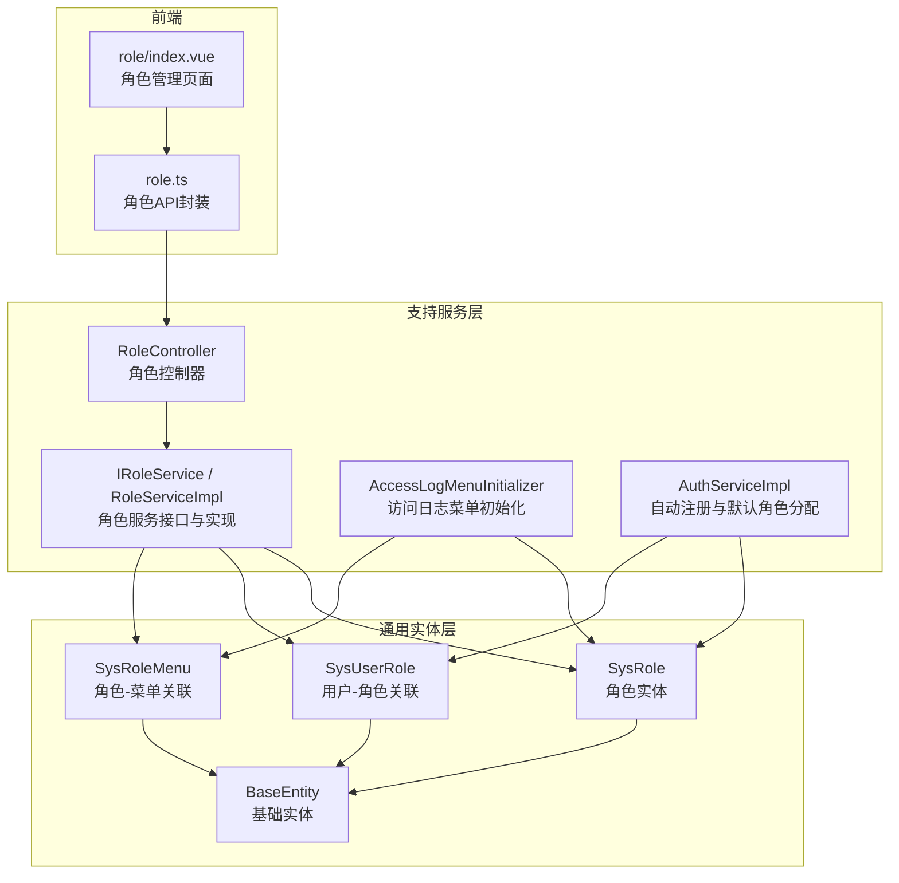
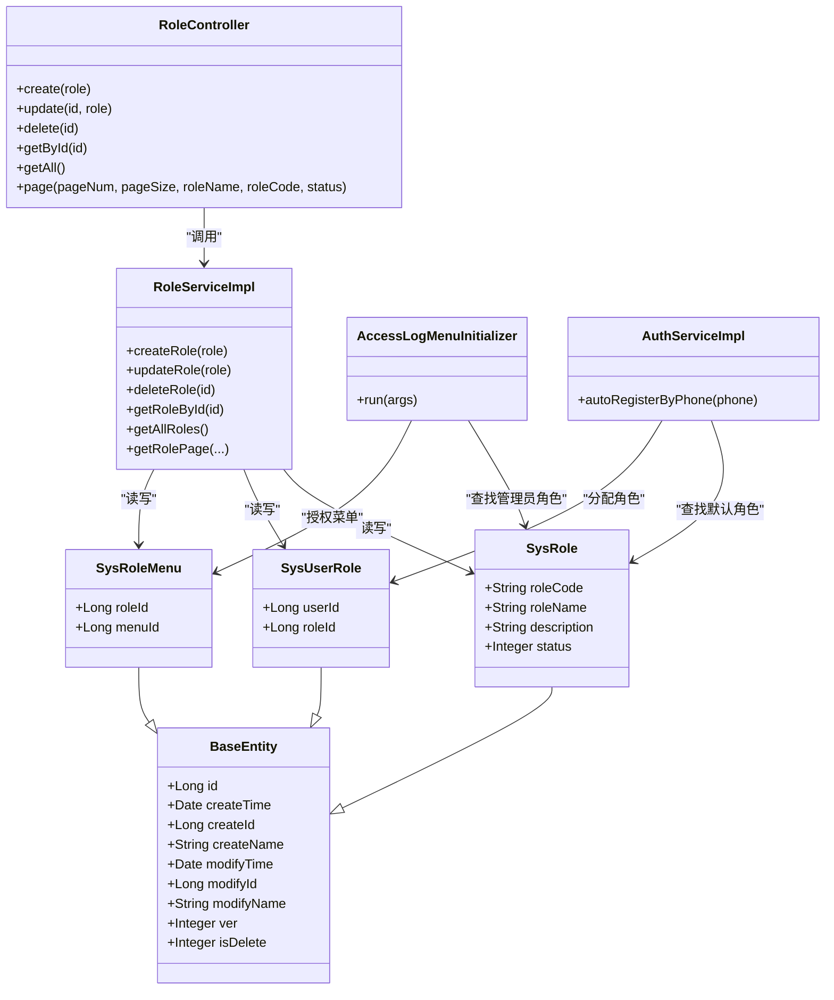
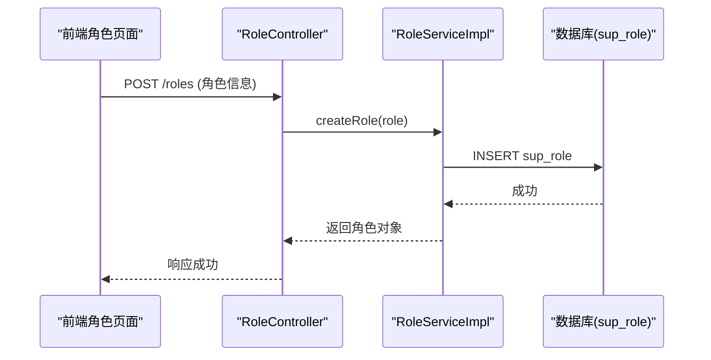
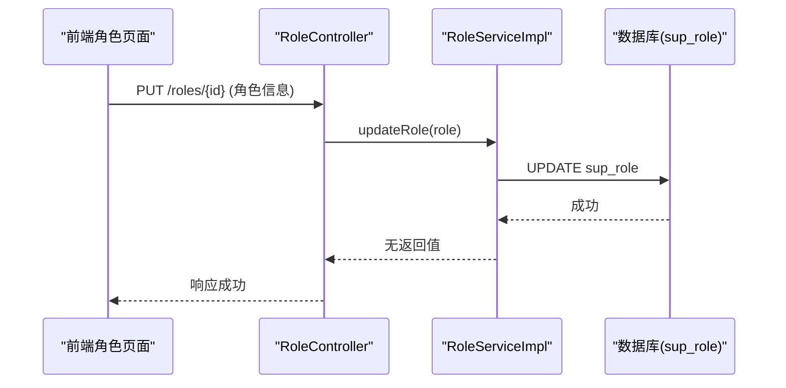
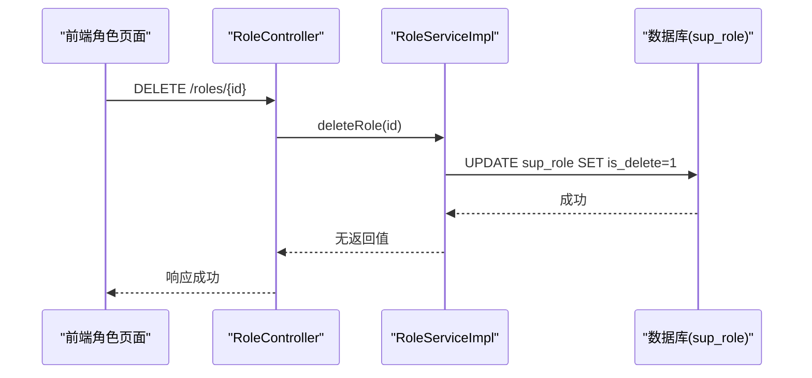
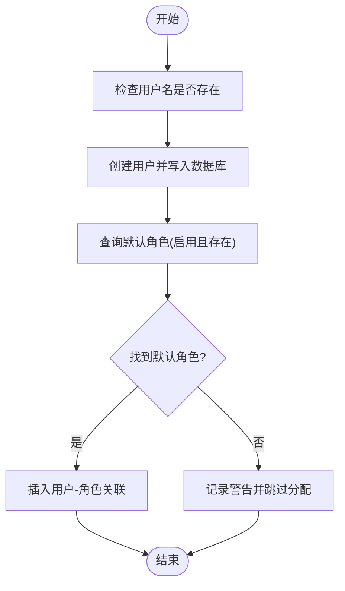
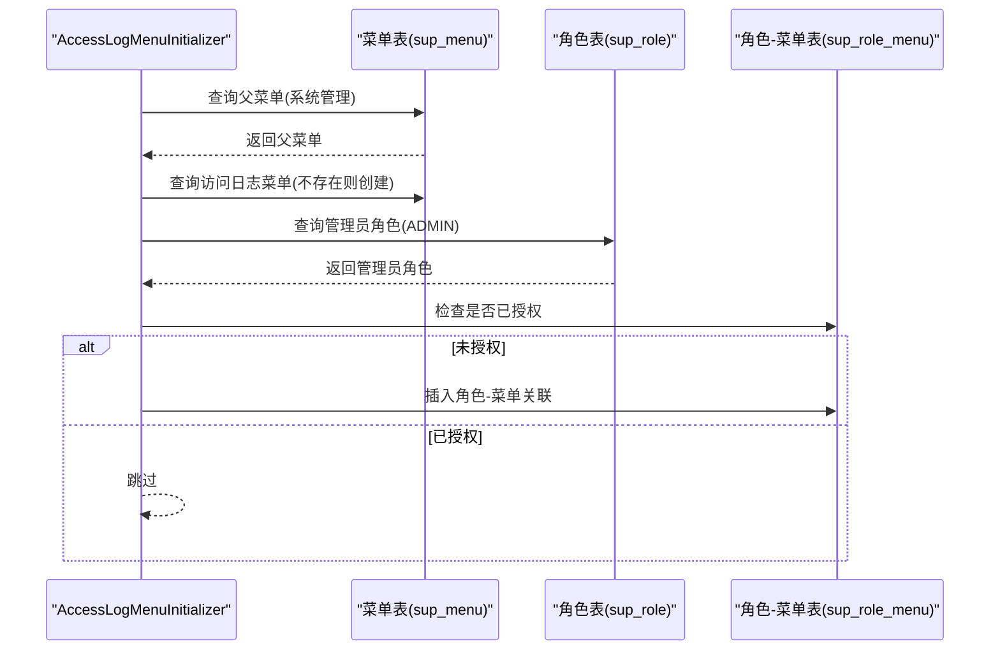
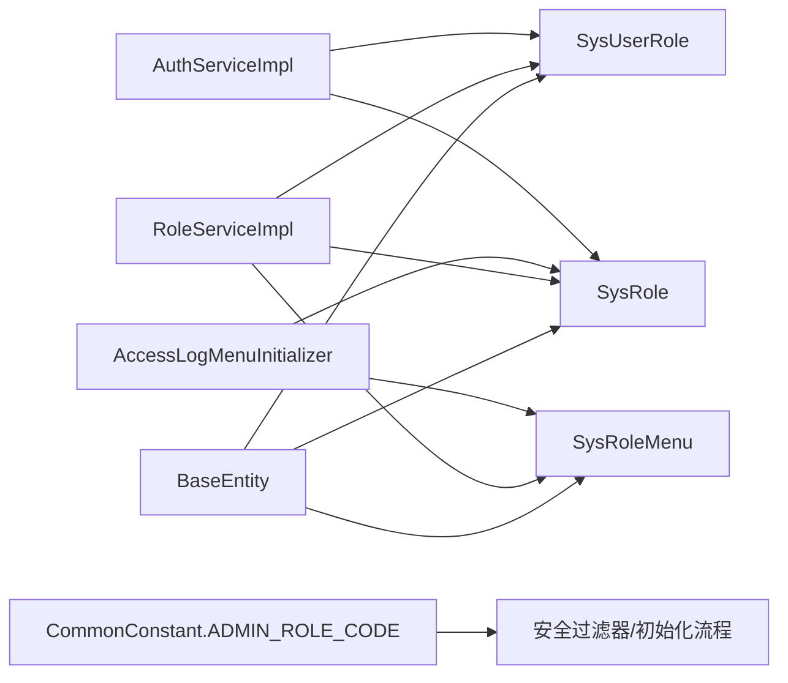

# 角色管理数据模型

<cite>
**本文引用的文件**
- [SysRole.java](file://ele-ai-tender-system/ele-ai-tender-common/src/main/java/com/jy/eleaitender/common/entity/support/SysRole.java)
- [BaseEntity.java](file://ele-ai-tender-system/ele-ai-tender-common/src/main/java/com/jy/eleaitender/common/entity/base/BaseEntity.java)
- [SysUserRole.java](file://ele-ai-tender-system/ele-ai-tender-common/src/main/java/com/jy/eleaitender/common/entity/support/SysUserRole.java)
- [SysRoleMenu.java](file://ele-ai-tender-system/ele-ai-tender-common/src/main/java/com/jy/eleaitender/common/entity/support/SysRoleMenu.java)
- [IRoleService.java](file://ele-ai-tender-system/ele-ai-tender-support/src/main/java/com/jy/eleaitender/support/service/IRoleService.java)
- [RoleServiceImpl.java](file://ele-ai-tender-system/ele-ai-tender-support/src/main/java/com/jy/eleaitender/support/service/impl/RoleServiceImpl.java)
- [RoleController.java](file://ele-ai-tender-system/ele-ai-tender-support/src/main/java/com/jy/eleaitender/support/controller/RoleController.java)
- [AccessLogMenuInitializer.java](file://ele-ai-tender-system/ele-ai-tender-support/src/main/java/com/jy/eleaitender/support/config/AccessLogMenuInitializer.java)
- [AuthServiceImpl.java](file://ele-ai-tender-system/ele-ai-tender-support/src/main/java/com/jy/eleaitender/support/service/impl/AuthServiceImpl.java)
- [CommonConstant.java](file://ele-ai-tender-system/ele-ai-tender-common/src/main/java/com/jy/eleaitender/common/constant/CommonConstant.java)
- [role.ts](file://ele-ai-tender-support-frontend/src/api/role.ts)
- [role/index.vue](file://ele-ai-tender-support-frontend/src/views/system/role/index.vue)
</cite>

## 目录
1. [简介](#简介)
2. [项目结构](#项目结构)
3. [核心组件](#核心组件)
4. [架构总览](#架构总览)
5. [详细组件分析](#详细组件分析)
6. [依赖关系分析](#依赖关系分析)
7. [性能考虑](#性能考虑)
8. [故障排查指南](#故障排查指南)
9. [结论](#结论)
10. [附录](#附录)

## 简介
本文件围绕系统角色管理的数据模型与RBAC权限体系进行系统化说明，重点覆盖：
- SysRole实体类的设计结构与字段定义（角色编码、名称、描述、状态等）
- RBAC中角色的层次结构、继承关系与权限范围设计思路
- 角色与用户的多对多关联、角色与菜单的权限绑定机制
- 角色创建、分配、修改、删除的完整数据流程
- 系统内置角色（管理员、普通用户）的初始化与配置示例

## 项目结构
角色相关代码分布在通用实体层与支持服务层，前端提供角色管理界面与API调用。

图表来源
- [SysRole.java:1-32](file://ele-ai-tender-system/ele-ai-tender-common/src/main/java/com/jy/eleaitender/common/entity/support/SysRole.java#L1-L32)
- [BaseEntity.java:13-73](file://ele-ai-tender-system/ele-ai-tender-common/src/main/java/com/jy/eleaitender/common/entity/base/BaseEntity.java#L13-L73)
- [SysUserRole.java:1-26](file://ele-ai-tender-system/ele-ai-tender-common/src/main/java/com/jy/eleaitender/common/entity/support/SysUserRole.java#L1-L26)
- [SysRoleMenu.java:1-26](file://ele-ai-tender-system/ele-ai-tender-common/src/main/java/com/jy/eleaitender/common/entity/support/SysRoleMenu.java#L1-L26)
- [IRoleService.java](file://ele-ai-tender-system/ele-ai-tender-support/src/main/java/com/jy/eleaitender/support/service/IRoleService.java)
- [RoleServiceImpl.java:32-79](file://ele-ai-tender-system/ele-ai-tender-support/src/main/java/com/jy/eleaitender/support/service/impl/RoleServiceImpl.java#L32-L79)
- [RoleController.java:54-70](file://ele-ai-tender-system/ele-ai-tender-support/src/main/java/com/jy/eleaitender/support/controller/RoleController.java#L54-L70)
- [AccessLogMenuInitializer.java:39-86](file://ele-ai-tender-system/ele-ai-tender-support/src/main/java/com/jy/eleaitender/support/config/AccessLogMenuInitializer.java#L39-L86)
- [AuthServiceImpl.java:194-226](file://ele-ai-tender-system/ele-ai-tender-support/src/main/java/com/jy/eleaitender/support/service/impl/AuthServiceImpl.java#L194-L226)
- [role.ts:1-51](file://ele-ai-tender-support-frontend/src/api/role.ts#L1-L51)
- [role/index.vue:1-218](file://ele-ai-tender-support-frontend/src/views/system/role/index.vue#L1-L218)

章节来源
- [SysRole.java:1-32](file://ele-ai-tender-system/ele-ai-tender-common/src/main/java/com/jy/eleaitender/common/entity/support/SysRole.java#L1-L32)
- [BaseEntity.java:13-73](file://ele-ai-tender-system/ele-ai-tender-common/src/main/java/com/jy/eleaitender/common/entity/base/BaseEntity.java#L13-L73)
- [SysUserRole.java:1-26](file://ele-ai-tender-system/ele-ai-tender-common/src/main/java/com/jy/eleaitender/common/entity/support/SysUserRole.java#L1-L26)
- [SysRoleMenu.java:1-26](file://ele-ai-tender-system/ele-ai-tender-common/src/main/java/com/jy/eleaitender/common/entity/support/SysRoleMenu.java#L1-L26)
- [IRoleService.java](file://ele-ai-tender-system/ele-ai-tender-support/src/main/java/com/jy/eleaitender/support/service/IRoleService.java)
- [RoleServiceImpl.java:32-79](file://ele-ai-tender-system/ele-ai-tender-support/src/main/java/com/jy/eleaitender/support/service/impl/RoleServiceImpl.java#L32-L79)
- [RoleController.java:54-70](file://ele-ai-tender-system/ele-ai-tender-support/src/main/java/com/jy/eleaitender/support/controller/RoleController.java#L54-L70)
- [AccessLogMenuInitializer.java:39-86](file://ele-ai-tender-system/ele-ai-tender-support/src/main/java/com/jy/eleaitender/support/config/AccessLogMenuInitializer.java#L39-L86)
- [AuthServiceImpl.java:194-226](file://ele-ai-tender-system/ele-ai-tender-support/src/main/java/com/jy/eleaitender/support/service/impl/AuthServiceImpl.java#L194-L226)
- [role.ts:1-51](file://ele-ai-tender-support-frontend/src/api/role.ts#L1-L51)
- [role/index.vue:1-218](file://ele-ai-tender-support-frontend/src/views/system/role/index.vue#L1-L218)

## 核心组件
- 角色实体 SysRole
  - 继承自 BaseEntity，具备统一审计字段（创建/修改时间、创建/修改人、乐观锁版本、逻辑删除标识）
  - 业务字段包括：角色编码、角色名称、描述信息、状态（启用/禁用）
- 用户-角色关联 SysUserRole
  - 维护用户ID与角色ID的映射，支撑用户与角色的多对多关系
- 角色-菜单关联 SysRoleMenu
  - 维护角色ID与菜单ID的映射，用于将菜单权限授予角色
- 角色服务与控制器
  - 提供分页查询、获取全部角色、按ID查询、创建、更新、删除等能力
  - 控制器暴露REST接口并记录操作日志

章节来源
- [SysRole.java:1-32](file://ele-ai-tender-system/ele-ai-tender-common/src/main/java/com/jy/eleaitender/common/entity/support/SysRole.java#L1-L32)
- [BaseEntity.java:13-73](file://ele-ai-tender-system/ele-ai-tender-common/src/main/java/com/jy/eleaitender/common/entity/base/BaseEntity.java#L13-L73)
- [SysUserRole.java:1-26](file://ele-ai-tender-system/ele-ai-tender-common/src/main/java/com/jy/eleaitender/common/entity/support/SysUserRole.java#L1-L26)
- [SysRoleMenu.java:1-26](file://ele-ai-tender-system/ele-ai-tender-common/src/main/java/com/jy/eleaitender/common/entity/support/SysRoleMenu.java#L1-L26)
- [IRoleService.java](file://ele-ai-tender-system/ele-ai-tender-support/src/main/java/com/jy/eleaitender/support/service/IRoleService.java)
- [RoleServiceImpl.java:32-79](file://ele-ai-tender-system/ele-ai-tender-support/src/main/java/com/jy/eleaitender/support/service/impl/RoleServiceImpl.java#L32-L79)
- [RoleController.java:54-70](file://ele-ai-tender-system/ele-ai-tender-support/src/main/java/com/jy/eleaitender/support/controller/RoleController.java#L54-L70)

## 架构总览
下图展示角色在RBAC中的位置及与用户、菜单的关联关系，以及前后端交互路径。

图表来源
- [SysRole.java:1-32](file://ele-ai-tender-system/ele-ai-tender-common/src/main/java/com/jy/eleaitender/common/entity/support/SysRole.java#L1-L32)
- [BaseEntity.java:13-73](file://ele-ai-tender-system/ele-ai-tender-common/src/main/java/com/jy/eleaitender/common/entity/base/BaseEntity.java#L13-L73)
- [SysUserRole.java:1-26](file://ele-ai-tender-system/ele-ai-tender-common/src/main/java/com/jy/eleaitender/common/entity/support/SysUserRole.java#L1-L26)
- [SysRoleMenu.java:1-26](file://ele-ai-tender-system/ele-ai-tender-common/src/main/java/com/jy/eleaitender/common/entity/support/SysRoleMenu.java#L1-L26)
- [RoleController.java:54-70](file://ele-ai-tender-system/ele-ai-tender-support/src/main/java/com/jy/eleaitender/support/controller/RoleController.java#L54-L70)
- [RoleServiceImpl.java:32-79](file://ele-ai-tender-system/ele-ai-tender-support/src/main/java/com/jy/eleaitender/support/service/impl/RoleServiceImpl.java#L32-L79)
- [AccessLogMenuInitializer.java:39-86](file://ele-ai-tender-system/ele-ai-tender-support/src/main/java/com/jy/eleaitender/support/config/AccessLogMenuInitializer.java#L39-L86)
- [AuthServiceImpl.java:194-226](file://ele-ai-tender-system/ele-ai-tender-support/src/main/java/com/jy/eleaitender/support/service/impl/AuthServiceImpl.java#L194-L226)

## 详细组件分析

### SysRole 实体设计与字段语义
- 继承 BaseEntity，获得统一的审计与软删除能力
- 关键字段
  - 角色编码：作为系统内唯一标识，便于常量化与鉴权匹配
  - 角色名称：面向用户的可读名称
  - 描述信息：角色用途或职责说明
  - 状态：控制角色是否可用（启用/禁用），影响列表过滤与授权行为
- 数据表映射为 sup_role，主键自增，包含公共审计字段

章节来源
- [SysRole.java:1-32](file://ele-ai-tender-system/ele-ai-tender-common/src/main/java/com/jy/eleaitender/common/entity/support/SysRole.java#L1-L32)
- [BaseEntity.java:13-73](file://ele-ai-tender-system/ele-ai-tender-common/src/main/java/com/jy/eleaitender/common/entity/base/BaseEntity.java#L13-L73)

### RBAC 权限体系中的角色定位
- 角色是权限集合的载体，通过角色-菜单关联将菜单级权限授予角色
- 用户通过用户-角色关联获得一个或多个角色，从而间接获得相应菜单权限
- 角色状态参与权限生效判断：仅启用的角色参与授权与显示

章节来源
- [SysRoleMenu.java:1-26](file://ele-ai-tender-system/ele-ai-tender-common/src/main/java/com/jy/eleaitender/common/entity/support/SysRoleMenu.java#L1-L26)
- [SysUserRole.java:1-26](file://ele-ai-tender-system/ele-ai-tender-common/src/main/java/com/jy/eleaitender/common/entity/support/SysUserRole.java#L1-L26)
- [RoleServiceImpl.java:53-59](file://ele-ai-tender-system/ele-ai-tender-support/src/main/java/com/jy/eleaitender/support/service/impl/RoleServiceImpl.java#L53-L59)

### 角色与用户的多对多关联
- 通过 SysUserRole 维护用户ID与角色ID的映射
- 典型场景：自动注册时为用户分配默认角色；批量授权时插入多条关联记录

章节来源
- [SysUserRole.java:1-26](file://ele-ai-tender-system/ele-ai-tender-common/src/main/java/com/jy/eleaitender/common/entity/support/SysUserRole.java#L1-L26)
- [AuthServiceImpl.java:194-226](file://ele-ai-tender-system/ele-ai-tender-support/src/main/java/com/jy/eleaitender/support/service/impl/AuthServiceImpl.java#L194-L226)

### 角色与菜单的权限绑定机制
- 通过 SysRoleMenu 维护角色ID与菜单ID的映射
- 初始化阶段可为特定角色（如管理员）预置菜单授权
- 前端角色管理页面支持选择菜单树并提交角色-菜单绑定

章节来源
- [SysRoleMenu.java:1-26](file://ele-ai-tender-system/ele-ai-tender-common/src/main/java/com/jy/eleaitender/common/entity/support/SysRoleMenu.java#L1-L26)
- [AccessLogMenuInitializer.java:39-86](file://ele-ai-tender-system/ele-ai-tender-support/src/main/java/com/jy/eleaitender/support/config/AccessLogMenuInitializer.java#L39-L86)
- [role/index.vue:160-218](file://ele-ai-tender-support-frontend/src/views/system/role/index.vue#L160-L218)

### 角色CRUD数据流程

#### 创建角色
- 前端提交角色基本信息（名称、编码、描述、状态）
- 控制器接收请求并调用服务层
- 服务层设置默认状态并持久化角色
- 返回创建结果

图表来源
- [RoleController.java:54-60](file://ele-ai-tender-system/ele-ai-tender-support/src/main/java/com/jy/eleaitender/support/controller/RoleController.java#L54-L60)
- [RoleServiceImpl.java:66-71](file://ele-ai-tender-system/ele-ai-tender-support/src/main/java/com/jy/eleaitender/support/service/impl/RoleServiceImpl.java#L66-L71)

章节来源
- [RoleController.java:54-60](file://ele-ai-tender-system/ele-ai-tender-support/src/main/java/com/jy/eleaitender/support/controller/RoleController.java#L54-L60)
- [RoleServiceImpl.java:66-71](file://ele-ai-tender-system/ele-ai-tender-support/src/main/java/com/jy/eleaitender/support/service/impl/RoleServiceImpl.java#L66-L71)

#### 更新角色
- 前端提交角色更新信息（可含状态变更）
- 控制器校验并调用服务层
- 服务层执行更新（对超级管理员角色有保护逻辑）
- 返回更新结果

图表来源
- [RoleController.java:62-70](file://ele-ai-tender-system/ele-ai-tender-support/src/main/java/com/jy/eleaitender/support/controller/RoleController.java#L62-L70)
- [RoleServiceImpl.java:73-79](file://ele-ai-tender-system/ele-ai-tender-support/src/main/java/com/jy/eleaitender/support/service/impl/RoleServiceImpl.java#L73-L79)

章节来源
- [RoleController.java:62-70](file://ele-ai-tender-system/ele-ai-tender-support/src/main/java/com/jy/eleaitender/support/controller/RoleController.java#L62-L70)
- [RoleServiceImpl.java:73-79](file://ele-ai-tender-system/ele-ai-tender-support/src/main/java/com/jy/eleaitender/support/service/impl/RoleServiceImpl.java#L73-L79)

#### 删除角色
- 前端触发删除操作
- 控制器调用服务层执行删除（逻辑删除）
- 返回删除结果

图表来源
- [RoleController.java:76](file://ele-ai-tender-system/ele-ai-tender-support/src/main/java/com/jy/eleaitender/support/controller/RoleController.java#L76)
- [RoleServiceImpl.java:81](file://ele-ai-tender-system/ele-ai-tender-support/src/main/java/com/jy/eleaitender/support/service/impl/RoleServiceImpl.java#L81)

章节来源
- [RoleController.java:76](file://ele-ai-tender-system/ele-ai-tender-support/src/main/java/com/jy/eleaitender/support/controller/RoleController.java#L76)
- [RoleServiceImpl.java:81](file://ele-ai-tender-system/ele-ai-tender-support/src/main/java/com/jy/eleaitender/support/service/impl/RoleServiceImpl.java#L81)

#### 分配/回收角色给用户
- 自动注册流程：根据手机号创建用户后，查找默认角色并插入用户-角色关联
- 手动分配：前端选择用户并勾选多个角色，后端批量插入用户-角色关联

图表来源
- [AuthServiceImpl.java:194-226](file://ele-ai-tender-system/ele-ai-tender-support/src/main/java/com/jy/eleaitender/support/service/impl/AuthServiceImpl.java#L194-L226)

章节来源
- [AuthServiceImpl.java:194-226](file://ele-ai-tender-system/ele-ai-tender-support/src/main/java/com/jy/eleaitender/support/service/impl/AuthServiceImpl.java#L194-L226)

#### 为角色授权菜单
- 初始化流程：启动时若未存在“访问日志”菜单则创建，并为管理员角色授权该菜单
- 运行时授权：前端角色编辑页选择菜单树并提交，后端插入角色-菜单关联

图表来源
- [AccessLogMenuInitializer.java:39-86](file://ele-ai-tender-system/ele-ai-tender-support/src/main/java/com/jy/eleaitender/support/config/AccessLogMenuInitializer.java#L39-L86)

章节来源
- [AccessLogMenuInitializer.java:39-86](file://ele-ai-tender-system/ele-ai-tender-support/src/main/java/com/jy/eleaitender/support/config/AccessLogMenuInitializer.java#L39-L86)

### 角色分页与查询
- 支持按角色名称、角色编码、状态进行条件筛选
- 默认过滤逻辑删除与禁用角色，按创建时间倒序排列

章节来源
- [RoleServiceImpl.java:32-51](file://ele-ai-tender-system/ele-ai-tender-support/src/main/java/com/jy/eleaitender/support/service/impl/RoleServiceImpl.java#L32-L51)

### 前端角色管理交互
- 提供搜索表单（角色名称、编码、状态）
- 提供新增/编辑对话框，支持保存角色信息与菜单授权
- 调用角色API完成数据交互

章节来源
- [role/index.vue:1-218](file://ele-ai-tender-support-frontend/src/views/system/role/index.vue#L1-L218)
- [role.ts:1-51](file://ele-ai-tender-support-frontend/src/api/role.ts#L1-L51)

## 依赖关系分析
- 实体层依赖
  - SysRole、SysUserRole、SysRoleMenu 均继承 BaseEntity，复用审计与软删除能力
- 服务层依赖
  - RoleServiceImpl 依赖角色、用户-角色、角色-菜单实体对应的Mapper
  - AccessLogMenuInitializer 依赖菜单、角色、角色-菜单Mapper以完成初始化授权
  - AuthServiceImpl 依赖角色与用户-角色Mapper以完成默认角色分配
- 常量依赖
  - CommonConstant 提供管理员角色编码常量，供安全过滤器与初始化流程使用

图表来源
- [BaseEntity.java:13-73](file://ele-ai-tender-system/ele-ai-tender-common/src/main/java/com/jy/eleaitender/common/entity/base/BaseEntity.java#L13-L73)
- [SysRole.java:1-32](file://ele-ai-tender-system/ele-ai-tender-common/src/main/java/com/jy/eleaitender/common/entity/support/SysRole.java#L1-L32)
- [SysUserRole.java:1-26](file://ele-ai-tender-system/ele-ai-tender-common/src/main/java/com/jy/eleaitender/common/entity/support/SysUserRole.java#L1-L26)
- [SysRoleMenu.java:1-26](file://ele-ai-tender-system/ele-ai-tender-common/src/main/java/com/jy/eleaitender/common/entity/support/SysRoleMenu.java#L1-L26)
- [RoleServiceImpl.java:32-79](file://ele-ai-tender-system/ele-ai-tender-support/src/main/java/com/jy/eleaitender/support/service/impl/RoleServiceImpl.java#L32-L79)
- [AccessLogMenuInitializer.java:39-86](file://ele-ai-tender-system/ele-ai-tender-support/src/main/java/com/jy/eleaitender/support/config/AccessLogMenuInitializer.java#L39-L86)
- [AuthServiceImpl.java:194-226](file://ele-ai-tender-system/ele-ai-tender-support/src/main/java/com/jy/eleaitender/support/service/impl/AuthServiceImpl.java#L194-L226)
- [CommonConstant.java:40-44](file://ele-ai-tender-system/ele-ai-tender-common/src/main/java/com/jy/eleaitender/common/constant/CommonConstant.java#L40-L44)

章节来源
- [CommonConstant.java:40-44](file://ele-ai-tender-system/ele-ai-tender-common/src/main/java/com/jy/eleaitender/common/constant/CommonConstant.java#L40-L44)

## 性能考虑
- 分页查询使用条件构造器，建议对常用筛选字段建立索引（如角色名称、角色编码、状态）
- 列表过滤逻辑删除与禁用角色，避免无效数据参与计算
- 批量授权与分配时应合并SQL以减少往返次数
- 角色-菜单与用户-角色关联表应建立复合索引以提升查询效率

[本节为通用指导，不直接分析具体文件]

## 故障排查指南
- 无法更新超级管理员角色
  - 现象：尝试更新ID为1的角色时报错
  - 原因：服务层对超级管理员角色做了保护性校验
  - 处理：避免直接修改该角色，必要时通过专用流程调整
- 自动注册用户未分配角色
  - 现象：自动注册成功后未获得默认角色
  - 原因：默认角色不存在或未启用
  - 处理：确保默认角色存在且状态启用
- 管理员角色缺少菜单授权
  - 现象：管理员登录后看不到某菜单
  - 原因：初始化流程未执行或已存在授权记录导致跳过
  - 处理：检查初始化日志，确认菜单与授权记录是否存在

章节来源
- [RoleServiceImpl.java:73-79](file://ele-ai-tender-system/ele-ai-tender-support/src/main/java/com/jy/eleaitender/support/service/impl/RoleServiceImpl.java#L73-L79)
- [AuthServiceImpl.java:194-226](file://ele-ai-tender-system/ele-ai-tender-support/src/main/java/com/jy/eleaitender/support/service/impl/AuthServiceImpl.java#L194-L226)
- [AccessLogMenuInitializer.java:39-86](file://ele-ai-tender-system/ele-ai-tender-support/src/main/java/com/jy/eleaitender/support/config/AccessLogMenuInitializer.java#L39-L86)

## 结论
- SysRole 作为RBAC的核心实体，承载角色标识与状态，配合用户-角色与角色-菜单关联实现灵活的权限控制
- 服务层提供完整的CRUD能力，并在关键操作上实施保护策略
- 初始化与自动注册流程确保了系统内置角色与默认授权的可用性
- 前端提供了直观的角色管理与菜单授权界面，形成闭环的用户体验

[本节为总结性内容，不直接分析具体文件]

## 附录

### 内置角色与初始配置示例
- 管理员角色编码常量
  - 常量定义位于通用常量类，值为 ADMIN
- 访问日志菜单初始化
  - 启动时若缺失“访问日志”菜单则创建，并为管理员角色授权该菜单
- 默认用户角色
  - 自动注册时为用户分配默认角色 BID_USER（需确保该角色存在且启用）

章节来源
- [CommonConstant.java:40-44](file://ele-ai-tender-system/ele-ai-tender-common/src/main/java/com/jy/eleaitender/common/constant/CommonConstant.java#L40-L44)
- [AccessLogMenuInitializer.java:39-86](file://ele-ai-tender-system/ele-ai-tender-support/src/main/java/com/jy/eleaitender/support/config/AccessLogMenuInitializer.java#L39-L86)
- [AuthServiceImpl.java:194-226](file://ele-ai-tender-system/ele-ai-tender-support/src/main/java/com/jy/eleaitender/support/service/impl/AuthServiceImpl.java#L194-L226)