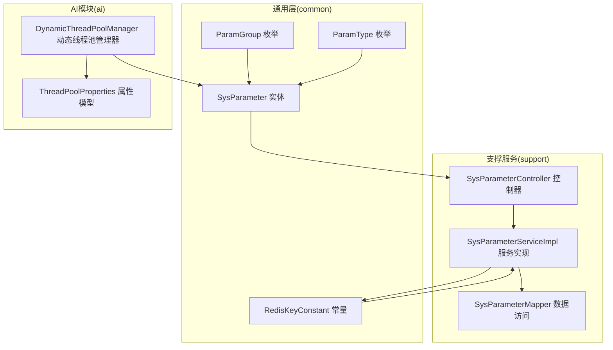
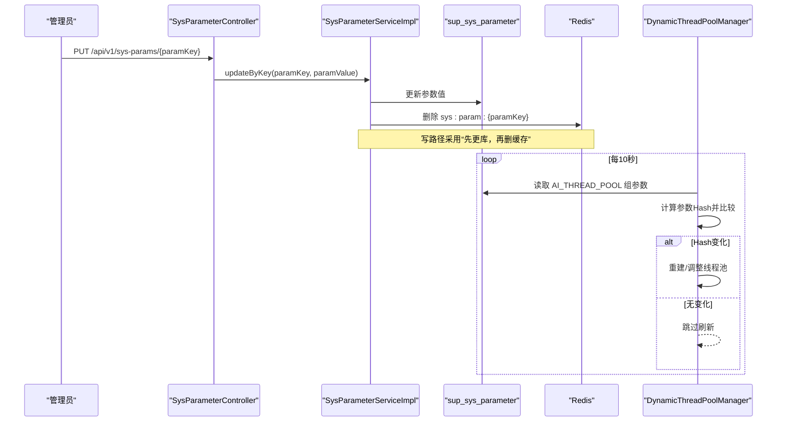
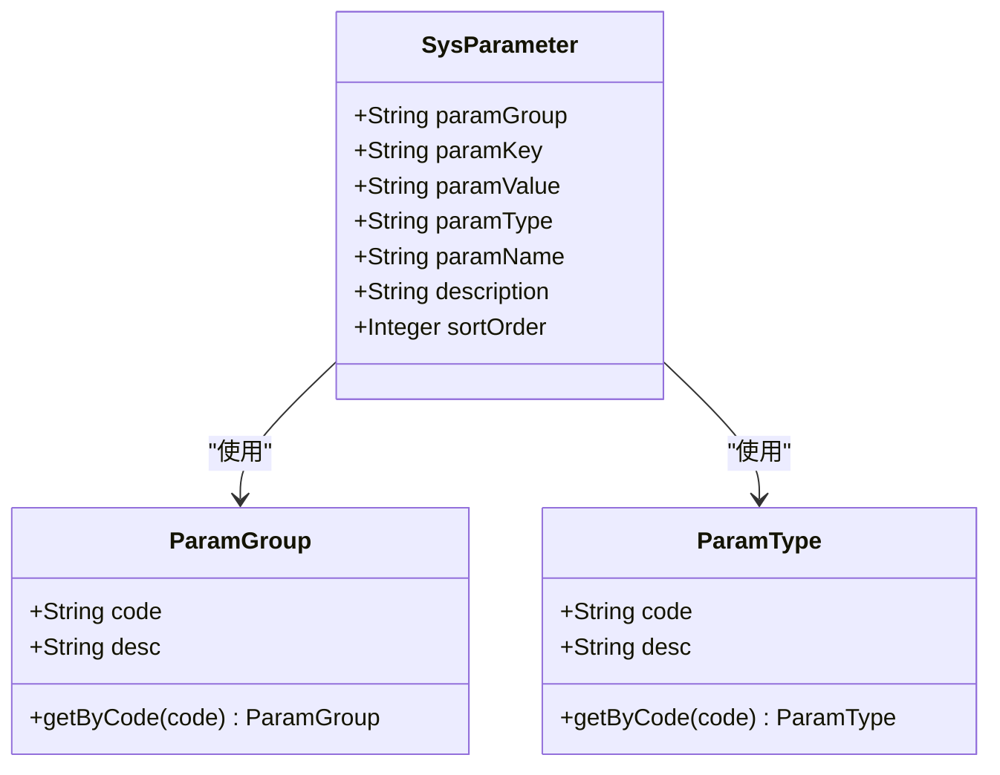
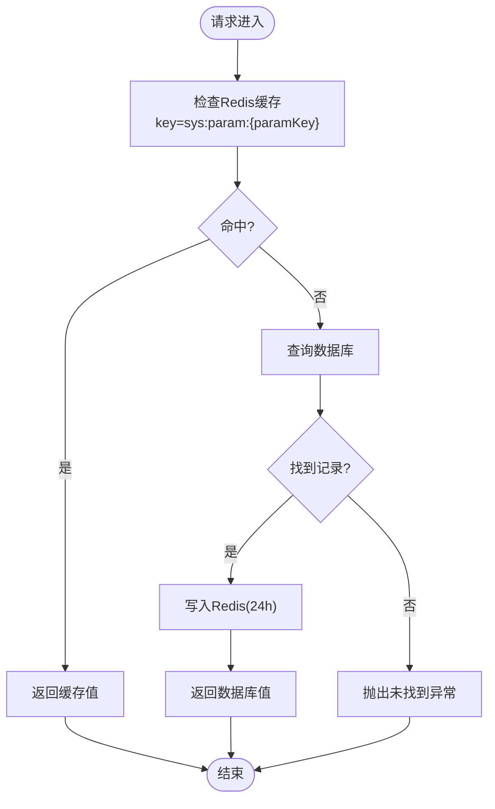
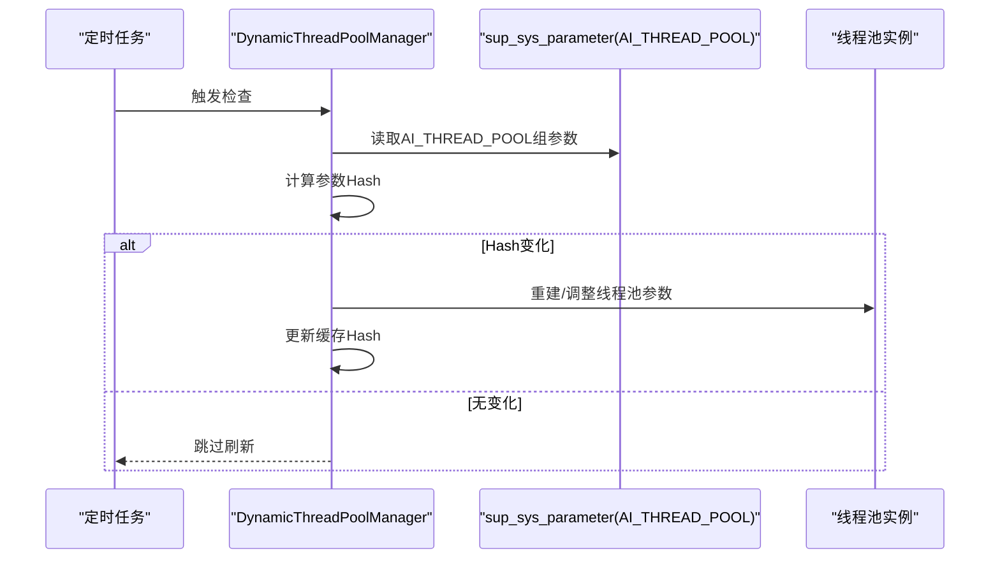
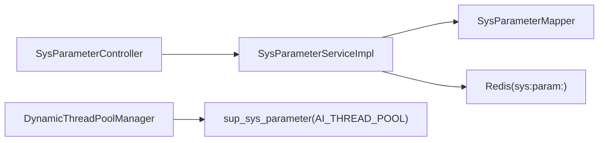

# 系统参数配置数据

<cite>
**本文引用的文件**   
- [SysParameter.java](file://ele-ai-tender-system/ele-ai-tender-common/src/main/java/com/jy/eleaitender/common/entity/support/SysParameter.java)
- [ParamGroup.java](file://ele-ai-tender-system/ele-ai-tender-common/src/main/java/com/jy/eleaitender/common/enums/ParamGroup.java)
- [ParamType.java](file://ele-ai-tender-system/ele-ai-tender-common/src/main/java/com/jy/eleaitender/common/enums/ParamType.java)
- [RedisKeyConstant.java](file://ele-ai-tender-system/ele-ai-tender-common/src/main/java/com/jy/eleaitender/common/constant/RedisKeyConstant.java)
- [SysParameterController.java](file://ele-ai-tender-system/ele-ai-tender-support/src/main/java/com/jy/eleaitender/support/controller/SysParameterController.java)
- [SysParameterServiceImpl.java](file://ele-ai-tender-system/ele-ai-tender-support/src/main/java/com/jy/eleaitender/support/service/impl/SysParameterServiceImpl.java)
- [SysParameterMapper.java](file://ele-ai-tender-system/ele-ai-tender-support/src/main/java/com/jy/eleaitender/support/mapper/SysParameterMapper.java)
- [ThreadPoolProperties.java](file://ele-ai-tender-system/ele-ai-tender-ai/src/main/java/com/jy/eleaitender/ai/config/ThreadPoolProperties.java)
- [DynamicThreadPoolManager.java](file://ele-ai-tender-system/ele-ai-tender-ai/src/main/java/com/jy/eleaitender/ai/threadpool/DynamicThreadPoolManager.java)
</cite>

## 目录
1. [简介](#简介)
2. [项目结构](#项目结构)
3. [核心组件](#核心组件)
4. [架构总览](#架构总览)
5. [详细组件分析](#详细组件分析)
6. [依赖关系分析](#依赖关系分析)
7. [性能考量](#性能考量)
8. [故障排查指南](#故障排查指南)
9. [结论](#结论)
10. [附录](#附录)

## 简介
本文件围绕“系统参数配置数据”进行系统化说明，聚焦 sup_sys_parameter 表的设计与使用、参数分组与类型管理、热更新机制、缓存策略、变更通知方案，以及关键业务场景（系统开关、AI规则、线程池调优）的配置实践。文档同时给出参数校验、默认值管理、版本兼容、初始化与迁移建议，帮助读者快速理解并正确落地系统参数体系。

## 项目结构
系统参数相关代码分布在 common、support、ai 三个模块：
- common：定义实体 SysParameter、枚举 ParamGroup/ParamType、Redis Key 常量
- support：提供参数查询、更新的 REST API 与实现，含 Redis 缓存读写
- ai：消费 AI_THREAD_POOL 组参数，动态构建和刷新线程池

图表来源
- [SysParameter.java:1-39](file://ele-ai-tender-system/ele-ai-tender-common/src/main/java/com/jy/eleaitender/common/entity/support/SysParameter.java#L1-L39)
- [ParamGroup.java:1-38](file://ele-ai-tender-system/ele-ai-tender-common/src/main/java/com/jy/eleaitender/common/enums/ParamGroup.java#L1-L38)
- [ParamType.java:1-38](file://ele-ai-tender-system/ele-ai-tender-common/src/main/java/com/jy/eleaitender/common/enums/ParamType.java#L1-L38)
- [RedisKeyConstant.java:1-70](file://ele-ai-tender-system/ele-ai-tender-common/src/main/java/com/jy/eleaitender/common/constant/RedisKeyConstant.java#L1-L70)
- [SysParameterController.java:1-59](file://ele-ai-tender-system/ele-ai-tender-support/src/main/java/com/jy/eleaitender/support/controller/SysParameterController.java#L1-L59)
- [SysParameterServiceImpl.java:1-93](file://ele-ai-tender-system/ele-ai-tender-support/src/main/java/com/jy/eleaitender/support/service/impl/SysParameterServiceImpl.java#L1-L93)
- [SysParameterMapper.java:1-13](file://ele-ai-tender-system/ele-ai-tender-support/src/main/java/com/jy/eleaitender/support/mapper/SysParameterMapper.java#L1-L13)
- [ThreadPoolProperties.java:1-39](file://ele-ai-tender-system/ele-ai-tender-ai/src/main/java/com/jy/eleaitender/ai/config/ThreadPoolProperties.java#L1-L39)
- [DynamicThreadPoolManager.java:1-175](file://ele-ai-tender-system/ele-ai-tender-ai/src/main/java/com/jy/eleaitender/ai/threadpool/DynamicThreadPoolManager.java#L1-L175)

章节来源
- [SysParameter.java:1-39](file://ele-ai-tender-system/ele-ai-tender-common/src/main/java/com/jy/eleaitender/common/entity/support/SysParameter.java#L1-L39)
- [ParamGroup.java:1-38](file://ele-ai-tender-system/ele-ai-tender-common/src/main/java/com/jy/eleaitender/common/enums/ParamGroup.java#L1-L38)
- [ParamType.java:1-38](file://ele-ai-tender-system/ele-ai-tender-common/src/main/java/com/jy/eleaitender/common/enums/ParamType.java#L1-L38)
- [RedisKeyConstant.java:1-70](file://ele-ai-tender-system/ele-ai-tender-common/src/main/java/com/jy/eleaitender/common/constant/RedisKeyConstant.java#L1-L70)
- [SysParameterController.java:1-59](file://ele-ai-tender-system/ele-ai-tender-support/src/main/java/com/jy/eleaitender/support/controller/SysParameterController.java#L1-L59)
- [SysParameterServiceImpl.java:1-93](file://ele-ai-tender-system/ele-ai-tender-support/src/main/java/com/jy/eleaitender/support/service/impl/SysParameterServiceImpl.java#L1-L93)
- [SysParameterMapper.java:1-13](file://ele-ai-tender-system/ele-ai-tender-support/src/main/java/com/jy/eleaitender/support/mapper/SysParameterMapper.java#L1-L13)
- [ThreadPoolProperties.java:1-39](file://ele-ai-tender-system/ele-ai-tender-ai/src/main/java/com/jy/eleaitender/ai/config/ThreadPoolProperties.java#L1-L39)
- [DynamicThreadPoolManager.java:1-175](file://ele-ai-tender-system/ele-ai-tender-ai/src/main/java/com/jy/eleaitender/ai/threadpool/DynamicThreadPoolManager.java#L1-L175)

## 核心组件
- 实体与枚举
  - 实体 SysParameter：映射 sup_sys_parameter 表，包含分组、键、值、类型、名称、说明、排序等字段
  - 分组枚举 ParamGroup：SYSTEM、SWITCH、AI_RULE、AI_THREAD_POOL
  - 类型枚举 ParamType：STRING、NUMBER、BOOLEAN、JSON
- 数据访问与服务
  - Mapper：基于 MyBatis-Plus 的 BaseMapper
  - Service：按分组查询、按 key 取值、批量更新、单键更新；读取走 Redis 缓存，更新后删除对应缓存
- 消费者
  - AI 模块通过 DynamicThreadPoolManager 定时轮询 DB，解析 AI_THREAD_POOL 组参数，动态重建或调整线程池

章节来源
- [SysParameter.java:1-39](file://ele-ai-tender-system/ele-ai-tender-common/src/main/java/com/jy/eleaitender/common/entity/support/SysParameter.java#L1-L39)
- [ParamGroup.java:1-38](file://ele-ai-tender-system/ele-ai-tender-common/src/main/java/com/jy/eleaitender/common/enums/ParamGroup.java#L1-L38)
- [ParamType.java:1-38](file://ele-ai-tender-system/ele-ai-tender-common/src/main/java/com/jy/eleaitender/common/enums/ParamType.java#L1-L38)
- [SysParameterMapper.java:1-13](file://ele-ai-tender-system/ele-ai-tender-support/src/main/java/com/jy/eleaitender/support/mapper/SysParameterMapper.java#L1-L13)
- [SysParameterServiceImpl.java:1-93](file://ele-ai-tender-system/ele-ai-tender-support/src/main/java/com/jy/eleaitender/support/service/impl/SysParameterServiceImpl.java#L1-L93)
- [DynamicThreadPoolManager.java:1-175](file://ele-ai-tender-system/ele-ai-tender-ai/src/main/java/com/jy/eleaitender/ai/threadpool/DynamicThreadPoolManager.java#L1-L175)

## 架构总览
系统参数在支撑服务中统一维护，AI 模块作为消费者之一，通过定时任务从数据库拉取 AI_THREAD_POOL 组参数并应用至运行时线程池。

图表来源
- [SysParameterController.java:1-59](file://ele-ai-tender-system/ele-ai-tender-support/src/main/java/com/jy/eleaitender/support/controller/SysParameterController.java#L1-L59)
- [SysParameterServiceImpl.java:1-93](file://ele-ai-tender-system/ele-ai-tender-support/src/main/java/com/jy/eleaitender/support/service/impl/SysParameterServiceImpl.java#L1-L93)
- [DynamicThreadPoolManager.java:1-175](file://ele-ai-tender-system/ele-ai-tender-ai/src/main/java/com/jy/eleaitender/ai/threadpool/DynamicThreadPoolManager.java#L1-L175)

## 详细组件分析

### 数据模型与分类管理
- 表 sup_sys_parameter 字段语义
  - param_group：参数分组，用于组织不同用途的参数集合
  - param_key：唯一键，作为参数标识
  - param_value：字符串形式的值，具体含义由 param_type 决定
  - param_type：值类型，支持 STRING/NUMBER/BOOLEAN/JSON
  - param_name：中文名称，便于前端展示
  - description：说明信息
  - sort_order：组内排序
- 分组与类型
  - 分组：SYSTEM（系统级）、SWITCH（功能开关）、AI_RULE（AI检测规则）、AI_THREAD_POOL（AI线程池）
  - 类型：STRING、NUMBER、BOOLEAN、JSON，配合校验与反序列化逻辑使用

图表来源
- [SysParameter.java:1-39](file://ele-ai-tender-system/ele-ai-tender-common/src/main/java/com/jy/eleaitender/common/entity/support/SysParameter.java#L1-L39)
- [ParamGroup.java:1-38](file://ele-ai-tender-system/ele-ai-tender-common/src/main/java/com/jy/eleaitender/common/enums/ParamGroup.java#L1-L38)
- [ParamType.java:1-38](file://ele-ai-tender-system/ele-ai-tender-common/src/main/java/com/jy/eleaitender/common/enums/ParamType.java#L1-L38)

章节来源
- [SysParameter.java:1-39](file://ele-ai-tender-system/ele-ai-tender-common/src/main/java/com/jy/eleaitender/common/entity/support/SysParameter.java#L1-L39)
- [ParamGroup.java:1-38](file://ele-ai-tender-system/ele-ai-tender-common/src/main/java/com/jy/eleaitender/common/enums/ParamGroup.java#L1-L38)
- [ParamType.java:1-38](file://ele-ai-tender-system/ele-ai-tender-common/src/main/java/com/jy/eleaitender/common/enums/ParamType.java#L1-L38)

### 接口与缓存策略
- 接口能力
  - 按分组查询：GET /api/v1/sys-params?paramGroup=...
  - 按 key 取值：GET /api/v1/sys-params/value?paramKey=...
  - 批量更新：PUT /api/v1/sys-params
  - 单键更新：PUT /api/v1/sys-params/{paramKey}
- 缓存策略
  - 读路径：优先从 Redis 获取，未命中则查库并回填缓存，过期时间固定为 24 小时
  - 写路径：更新数据库后删除对应缓存键，保证下次读取时回源到最新值
  - 缓存键前缀：sys:param:，拼接 param_key 形成完整键

图表来源
- [SysParameterServiceImpl.java:1-93](file://ele-ai-tender-system/ele-ai-tender-support/src/main/java/com/jy/eleaitender/support/service/impl/SysParameterServiceImpl.java#L1-L93)
- [RedisKeyConstant.java:1-70](file://ele-ai-tender-system/ele-ai-tender-common/src/main/java/com/jy/eleaitender/common/constant/RedisKeyConstant.java#L1-L70)

章节来源
- [SysParameterController.java:1-59](file://ele-ai-tender-system/ele-ai-tender-support/src/main/java/com/jy/eleaitender/support/controller/SysParameterController.java#L1-L59)
- [SysParameterServiceImpl.java:1-93](file://ele-ai-tender-system/ele-ai-tender-support/src/main/java/com/jy/eleaitender/support/service/impl/SysParameterServiceImpl.java#L1-L93)
- [RedisKeyConstant.java:1-70](file://ele-ai-tender-system/ele-ai-tender-common/src/main/java/com/jy/eleaitender/common/constant/RedisKeyConstant.java#L1-L70)

### 热更新与变更通知（AI线程池）
- 热更新机制
  - AI 模块内置定时任务，每 10 秒轮询 sup_sys_parameter 表中 AI_THREAD_POOL 组参数
  - 将当前参数集计算哈希并与上次缓存的哈希对比，若发生变化则重新加载并应用新配置
- 线程池动态调整
  - 根据参数重建或调整线程池大小、队列容量、保活时间、任务超时等
  - 对并发控制相关的用户维度与全局维度阈值同步更新
- 适用场景
  - 在不重启服务的情况下，动态提升/降低并发度、队列容量与超时策略，以应对流量波动或资源变化

图表来源
- [DynamicThreadPoolManager.java:1-175](file://ele-ai-tender-system/ele-ai-tender-ai/src/main/java/com/jy/eleaitender/ai/threadpool/DynamicThreadPoolManager.java#L1-L175)
- [ThreadPoolProperties.java:1-39](file://ele-ai-tender-system/ele-ai-tender-ai/src/main/java/com/jy/eleaitender/ai/config/ThreadPoolProperties.java#L1-L39)

章节来源
- [DynamicThreadPoolManager.java:1-175](file://ele-ai-tender-system/ele-ai-tender-ai/src/main/java/com/jy/eleaitender/ai/threadpool/DynamicThreadPoolManager.java#L1-L175)
- [ThreadPoolProperties.java:1-39](file://ele-ai-tender-system/ele-ai-tender-ai/src/main/java/com/jy/eleaitender/ai/config/ThreadPoolProperties.java#L1-L39)

### 关键配置项与业务用途
- 系统开关（SWITCH）
  - 典型用途：功能灰度、降级开关、黑白名单开关等
  - 建议类型：BOOLEAN；结合业务逻辑在热点路径快速判断
- AI规则（AI_RULE）
  - 典型用途：检测规则、提示词模板、评分权重等结构化配置
  - 建议类型：JSON；便于复杂规则表达与演进
- 线程池（AI_THREAD_POOL）
  - 典型用途：AI任务执行线程池的核心/最大线程数、队列容量、保活时间、任务超时、用户与全局并发限制等
  - 建议类型：NUMBER；通过 DynamicThreadPoolManager 热生效

章节来源
- [ParamGroup.java:1-38](file://ele-ai-tender-system/ele-ai-tender-common/src/main/java/com/jy/eleaitender/common/enums/ParamGroup.java#L1-L38)
- [ThreadPoolProperties.java:1-39](file://ele-ai-tender-system/ele-ai-tender-ai/src/main/java/com/jy/eleaitender/ai/config/ThreadPoolProperties.java#L1-L39)
- [DynamicThreadPoolManager.java:1-175](file://ele-ai-tender-system/ele-ai-tender-ai/src/main/java/com/jy/eleaitender/ai/threadpool/DynamicThreadPoolManager.java#L1-L175)

### 参数校验、默认值与版本兼容
- 校验规则
  - 依据 param_type 进行类型校验：NUMBER/BOOLEAN/JSON 需符合相应格式
  - 建议在 Service 层或统一校验器中集中处理，失败时返回明确错误码
- 默认值管理
  - 对于缺失或不存在的参数，应在调用方提供合理默认值，避免空指针或业务中断
- 版本兼容
  - 新增参数时保留旧行为，逐步过渡；必要时通过版本号或特性开关控制新旧逻辑分支
  - 对 JSON 类型参数，注意向后兼容字段增删，避免破坏既有解析逻辑

[本节为通用最佳实践指导，不直接分析具体文件]

### 初始化与常用示例
- 初始化建议
  - 在 init.sql 中预置 SYSTEM/SWITCH/AI_RULE/AI_THREAD_POOL 的基础参数，确保服务启动即可用
  - 为每个参数设置合理的默认值与说明，便于运维与排障
- 常用示例（概念性）
  - 系统开关：如 enable_feature_x=true
  - AI规则：如 compliance_rules={"rules":[...]}
  - 线程池：core_pool_size=4、max_pool_size=8、queue_capacity=20、keep_alive_seconds=60、task_timeout_minutes=10、user_max_pending_tasks=5、user_max_concurrent_tasks=2、global_max_pending_tasks=100、global_max_concurrent_tasks=10

[本节为概念性示例，不直接分析具体文件]

### 参数迁移方案
- 增量迁移
  - 通过 SQL 脚本新增参数行，保持幂等（存在则跳过）
- 平滑升级
  - 先发布只读逻辑，再发布写逻辑；或先引入新字段/新键名，双写一段时间后下线旧键
- 回滚策略
  - 保留旧参数键名与默认值，确保回滚后行为一致

[本节为通用迁移策略，不直接分析具体文件]

## 依赖关系分析
- 组件耦合
  - Controller 依赖 Service；Service 依赖 Mapper 与 Redis；AI 模块依赖 DB 与自身线程池管理器
- 外部依赖
  - Redis：用于参数缓存与失效
  - 数据库：sup_sys_parameter 持久化
- 潜在风险
  - 缓存穿透：不存在 key 的频繁查询可能穿透到 DB，可考虑布隆过滤器或短 TTL 空值缓存
  - 一致性：写路径采用“先更库再删缓存”，在高并发下仍可能存在短暂不一致窗口

图表来源
- [SysParameterController.java:1-59](file://ele-ai-tender-system/ele-ai-tender-support/src/main/java/com/jy/eleaitender/support/controller/SysParameterController.java#L1-L59)
- [SysParameterServiceImpl.java:1-93](file://ele-ai-tender-system/ele-ai-tender-support/src/main/java/com/jy/eleaitender/support/service/impl/SysParameterServiceImpl.java#L1-L93)
- [SysParameterMapper.java:1-13](file://ele-ai-tender-system/ele-ai-tender-support/src/main/java/com/jy/eleaitender/support/mapper/SysParameterMapper.java#L1-L13)
- [DynamicThreadPoolManager.java:1-175](file://ele-ai-tender-system/ele-ai-tender-ai/src/main/java/com/jy/eleaitender/ai/threadpool/DynamicThreadPoolManager.java#L1-L175)

章节来源
- [SysParameterController.java:1-59](file://ele-ai-tender-system/ele-ai-tender-support/src/main/java/com/jy/eleaitender/support/controller/SysParameterController.java#L1-L59)
- [SysParameterServiceImpl.java:1-93](file://ele-ai-tender-system/ele-ai-tender-support/src/main/java/com/jy/eleaitender/support/service/impl/SysParameterServiceImpl.java#L1-L93)
- [SysParameterMapper.java:1-13](file://ele-ai-tender-system/ele-ai-tender-support/src/main/java/com/jy/eleaitender/support/mapper/SysParameterMapper.java#L1-L13)
- [DynamicThreadPoolManager.java:1-175](file://ele-ai-tender-system/ele-ai-tender-ai/src/main/java/com/jy/eleaitender/ai/threadpool/DynamicThreadPoolManager.java#L1-L175)

## 性能考量
- 读多写少场景
  - 利用 Redis 缓存显著降低 DB 压力；建议对热点 key 单独监控命中率与延迟
- 写路径优化
  - 批量更新已封装为循环单键更新，可在高吞吐场景考虑批量 SQL 与批量缓存清理
- 线程池参数
  - 合理设置 core/max/queue/keepAlive/taskTimeout，避免 OOM 或任务堆积
  - 用户维度和全局维度并发上限应结合压测结果设定

[本节为通用性能建议，不直接分析具体文件]

## 故障排查指南
- 常见错误
  - 参数不存在：读取或更新时若找不到记录，会抛出业务异常，需检查 key 是否正确、是否已初始化
  - 缓存不一致：更新后立即读取仍为旧值，可能是分布式环境下其他节点尚未感知删除，等待下一轮读取回源即可
- 定位步骤
  - 确认 Redis 中是否存在 sys:param:{paramKey}
  - 核对数据库中对应记录的 param_value 与 param_type
  - 查看 AI 模块日志中“检测到AI线程池参数变更”的打印，确认是否触发热更新

章节来源
- [SysParameterServiceImpl.java:1-93](file://ele-ai-tender-system/ele-ai-tender-support/src/main/java/com/jy/eleaitender/support/service/impl/SysParameterServiceImpl.java#L1-L93)
- [DynamicThreadPoolManager.java:1-175](file://ele-ai-tender-system/ele-ai-tender-ai/src/main/java/com/jy/eleaitender/ai/threadpool/DynamicThreadPoolManager.java#L1-L175)

## 结论
sup_sys_parameter 表提供了统一的系统参数承载能力，配合分组与类型枚举可实现灵活而可控的配置管理。通过 Redis 缓存与写后删策略，系统在可用性与一致性之间取得平衡；AI 模块的动态线程池展示了参数热更新的典型用法。建议在生产环境完善参数校验、默认值与兼容性策略，并结合压测持续优化线程池与缓存策略。

## 附录
- 术语
  - 热更新：无需重启服务即可使配置变更生效
  - 缓存穿透：查询不存在的数据导致每次都落到后端存储
- 参考实现位置
  - 实体与枚举：common 模块
  - 接口与缓存：support 模块
  - 热更新消费：ai 模块

[本节为补充说明，不直接分析具体文件]