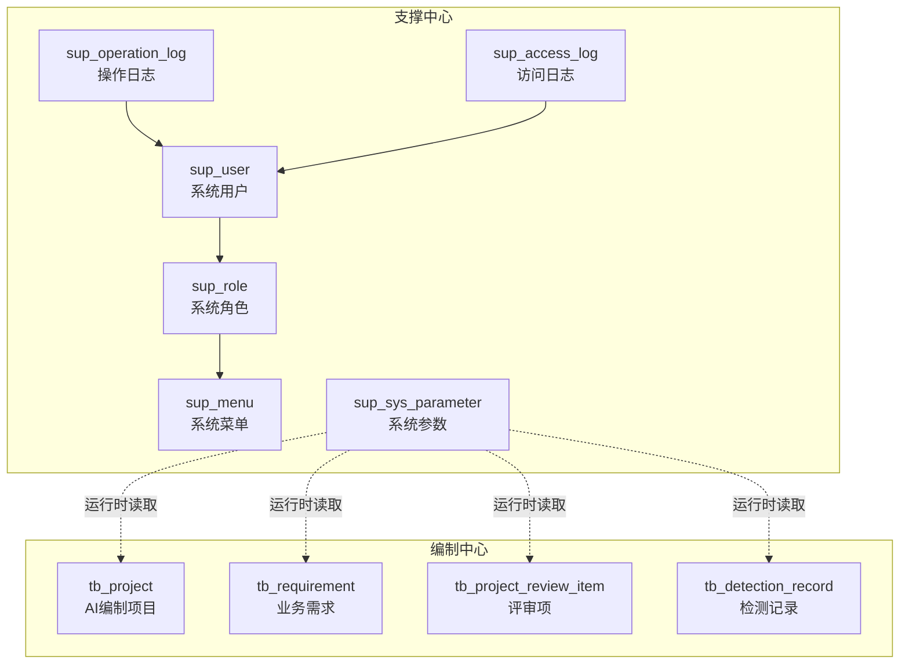
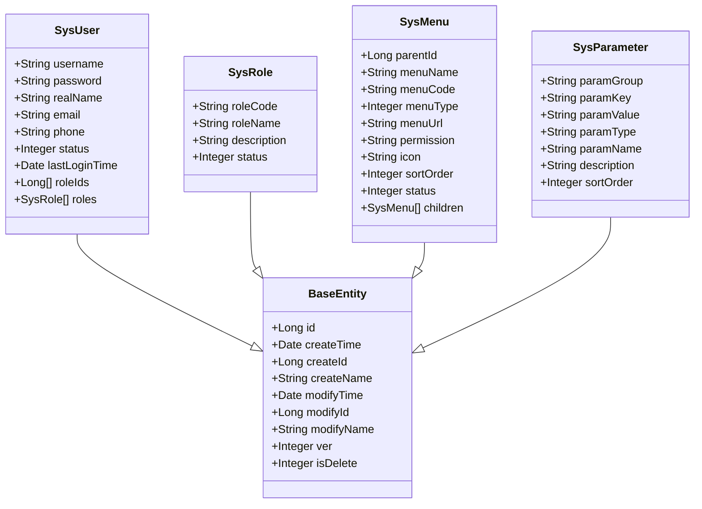
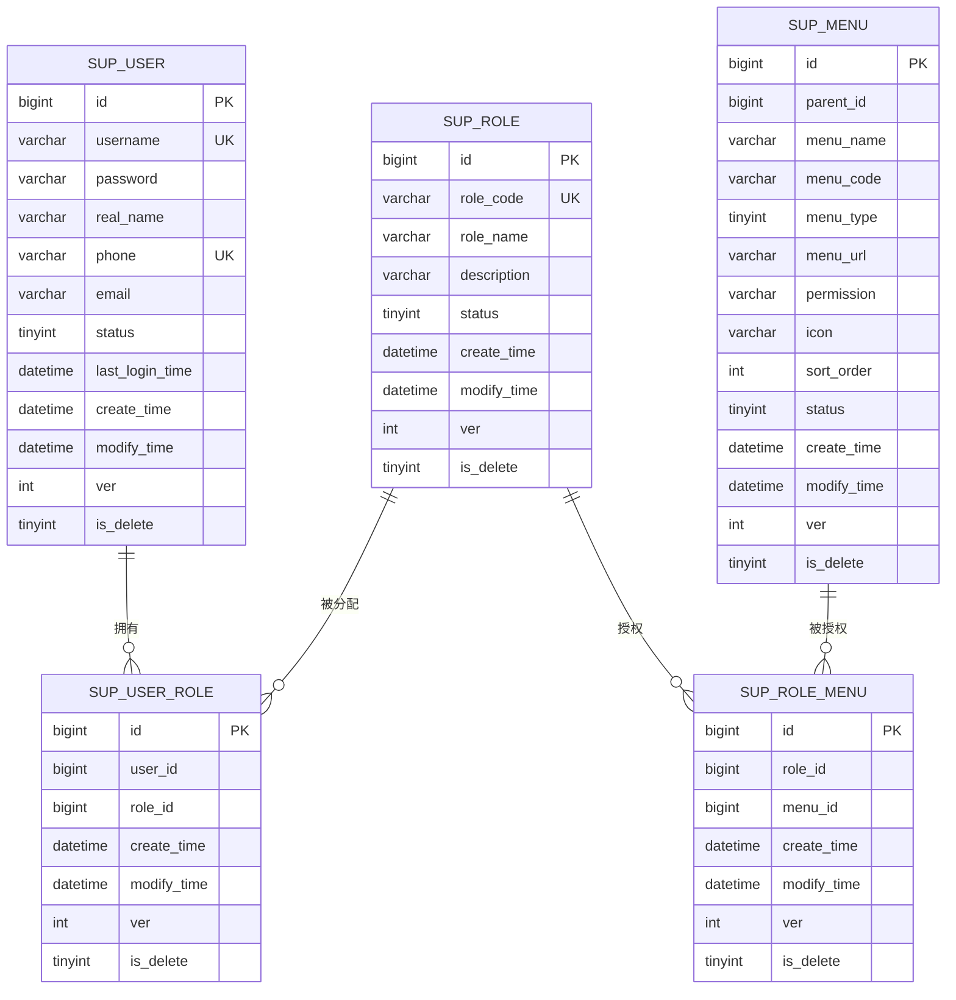
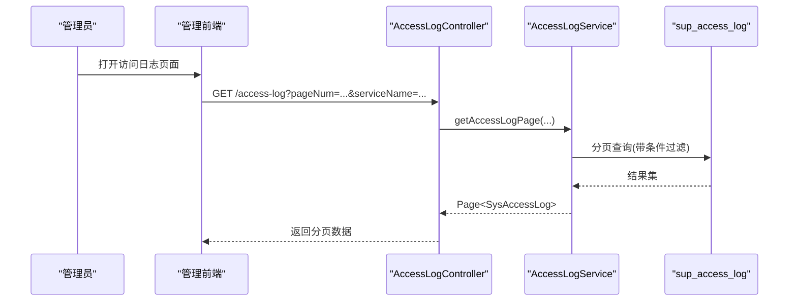
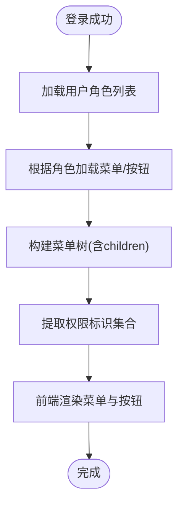
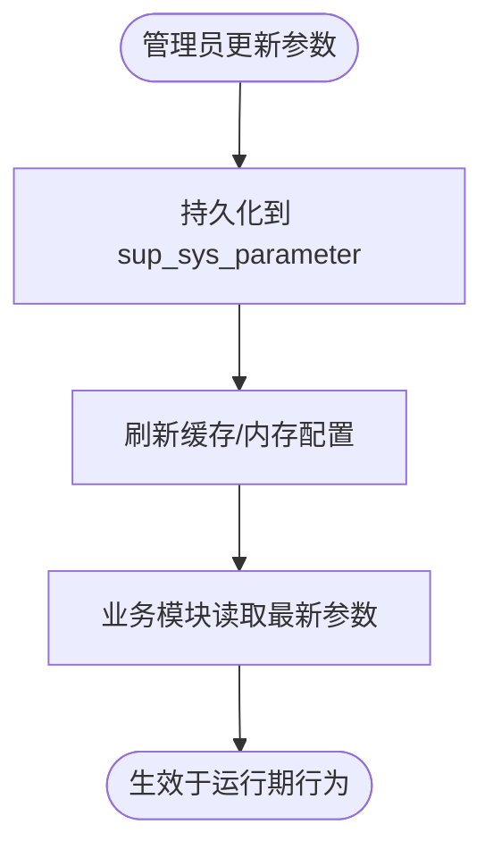
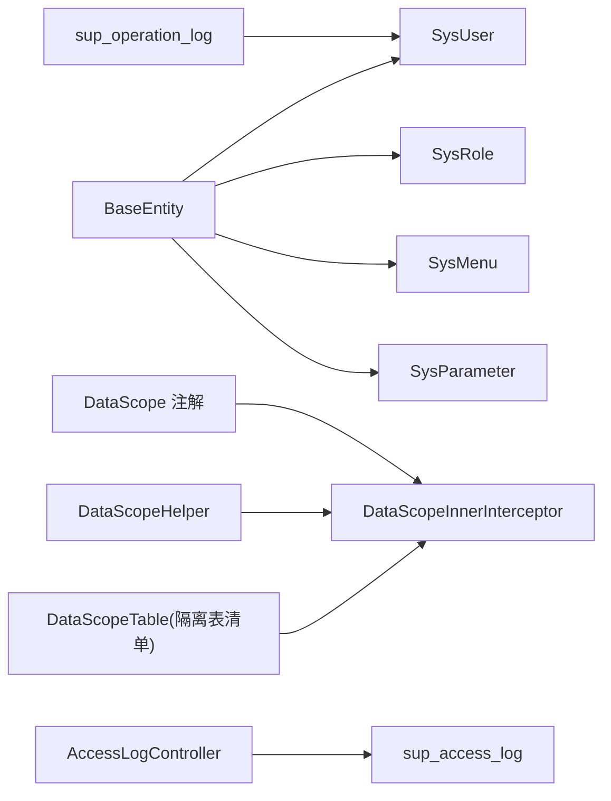

# 系统配置数据模型

<cite>
**本文引用的文件**   
- [ele-ai-tender-support/sql/init.sql](file://ele-ai-tender-system/ele-ai-tender-support/sql/init.sql)
- [ele-ai-tender-core/sql/init.sql](file://ele-ai-tender-system/ele-ai-tender-core/sql/init.sql)
- [SysUser.java](file://ele-ai-tender-system/ele-ai-tender-common/src/main/java/com/jy/eleaitender/common/entity/support/SysUser.java)
- [SysRole.java](file://ele-ai-tender-system/ele-ai-tender-common/src/main/java/com/jy/eleaitender/common/entity/support/SysRole.java)
- [SysMenu.java](file://ele-ai-tender-system/ele-ai-tender-common/src/main/java/com/jy/eleaitender/common/entity/support/SysMenu.java)
- [SysParameter.java](file://ele-ai-tender-system/ele-ai-tender-common/src/main/java/com/jy/eleaitender/common/entity/support/SysParameter.java)
- [BaseEntity.java](file://ele-ai-tender-system/ele-ai-tender-common/src/main/java/com/jy/eleaitender/common/entity/base/BaseEntity.java)
- [DataScopeHelper.java](file://ele-ai-tender-system/ele-ai-tender-common/src/main/java/com/jy/eleaitender/common/datascope/DataScopeHelper.java)
- [DataScopeInnerInterceptor.java](file://ele-ai-tender-system/ele-ai-tender-common/src/main/java/com/jy/eleaitender/common/datascope/DataScopeInnerInterceptor.java)
- [DataScope.java](file://ele-ai-tender-system/ele-ai-tender-common/src/main/java/com/jy/eleaitender/common/datascope/DataScope.java)
- [DataScopeTable.java](file://ele-ai-tender-system/ele-ai-tender-common/src/main/java/com/jy/eleaitender/common/datascope/DataScopeTable.java)
- [AccessLogController.java](file://ele-ai-tender-system/ele-ai-tender-support/src/main/java/com/jy/eleaitender/support/controller/AccessLogController.java)
</cite>

## 目录
1. [引言](#引言)
2. [项目结构](#项目结构)
3. [核心组件](#核心组件)
4. [架构总览](#架构总览)
5. [详细组件分析](#详细组件分析)
6. [依赖关系分析](#依赖关系分析)
7. [性能与扩展性](#性能与扩展性)
8. [故障排查指南](#故障排查指南)
9. [结论](#结论)
10. [附录](#附录)

## 引言
本文件围绕系统配置数据模型进行系统化说明，覆盖用户、角色、菜单、参数等基础管理表的设计与使用；阐述 RBAC 权限模型的数据支撑、动态菜单装配、系统参数热更新机制；并给出会话管理、操作日志、访问审计追踪的数据设计方案。同时提供多租户隔离（基于 create_id 的“数据域”）、数据权限控制、敏感信息加密存储的实现指导，以及初始化脚本、迁移策略与备份恢复方案建议。

## 项目结构
本项目在支撑中心与编制中心分别维护数据库初始化脚本：
- 支撑中心：包含用户、角色、菜单、参数、访问日志、操作日志等系统管理相关表及初始数据
- 编制中心：包含业务主流程相关的实体表（如项目、需求、评审项、检测记录等）

图表来源
- [ele-ai-tender-support/sql/init.sql](file://ele-ai-tender-system/ele-ai-tender-support/sql/init.sql)
- [ele-ai-tender-core/sql/init.sql](file://ele-ai-tender-system/ele-ai-tender-core/sql/init.sql)

章节来源
- [ele-ai-tender-support/sql/init.sql](file://ele-ai-tender-system/ele-ai-tender-support/sql/init.sql)
- [ele-ai-tender-core/sql/init.sql](file://ele-ai-tender-system/ele-ai-tender-core/sql/init.sql)

## 核心组件
本节聚焦系统管理四大核心实体及其数据表设计要点：
- 用户 SysUser → sup_user
- 角色 SysRole → sup_role
- 菜单 SysMenu → sup_menu
- 参数 SysParameter → sup_sys_parameter

这些实体均继承 BaseEntity，统一具备 id、创建/修改时间、创建/修改人、乐观锁 ver、逻辑删除 is_delete 等通用字段。

图表来源
- [BaseEntity.java](file://ele-ai-tender-system/ele-ai-tender-common/src/main/java/com/jy/eleaitender/common/entity/base/BaseEntity.java)
- [SysUser.java](file://ele-ai-tender-system/ele-ai-tender-common/src/main/java/com/jy/eleaitender/common/entity/support/SysUser.java)
- [SysRole.java](file://ele-ai-tender-system/ele-ai-tender-common/src/main/java/com/jy/eleaitender/common/entity/support/SysRole.java)
- [SysMenu.java](file://ele-ai-tender-system/ele-ai-tender-common/src/main/java/com/jy/eleaitender/common/entity/support/SysMenu.java)
- [SysParameter.java](file://ele-ai-tender-system/ele-ai-tender-common/src/main/java/com/jy/eleaitender/common/entity/support/SysParameter.java)

章节来源
- [BaseEntity.java](file://ele-ai-tender-system/ele-ai-tender-common/src/main/java/com/jy/eleaitender/common/entity/base/BaseEntity.java)
- [SysUser.java](file://ele-ai-tender-system/ele-ai-tender-common/src/main/java/com/jy/eleaitender/common/entity/support/SysUser.java)
- [SysRole.java](file://ele-ai-tender-system/ele-ai-tender-common/src/main/java/com/jy/eleaitender/common/entity/support/SysRole.java)
- [SysMenu.java](file://ele-ai-tender-system/ele-ai-tender-common/src/main/java/com/jy/eleaitender/common/entity/support/SysMenu.java)
- [SysParameter.java](file://ele-ai-tender-system/ele-ai-tender-common/src/main/java/com/jy/eleaitender/common/entity/support/SysParameter.java)

## 架构总览
RBAC 权限模型通过“用户-角色-菜单/按钮-权限标识”四元组实现：
- 用户拥有多个角色
- 角色关联多个菜单/按钮
- 菜单/按钮携带权限标识（permission）
- 前端根据用户权限渲染菜单与按钮

图表来源
- [ele-ai-tender-support/sql/init.sql](file://ele-ai-tender-system/ele-ai-tender-support/sql/init.sql)

章节来源
- [ele-ai-tender-support/sql/init.sql](file://ele-ai-tender-system/ele-ai-tender-support/sql/init.sql)

## 详细组件分析

### 用户表（SysUser / sup_user）
- 关键字段：用户名、密码、真实姓名、手机号、邮箱、状态、最后登录时间
- 索引：用户名唯一、手机号唯一、状态索引
- 安全：密码采用 BCrypt 存储（初始化脚本中示例值）
- 审计：继承 BaseEntity，自动填充创建/修改信息与乐观锁

章节来源
- [ele-ai-tender-support/sql/init.sql](file://ele-ai-tender-system/ele-ai-tender-support/sql/init.sql)
- [SysUser.java](file://ele-ai-tender-system/ele-ai-tender-common/src/main/java/com/jy/eleaitender/common/entity/support/SysUser.java)
- [BaseEntity.java](file://ele-ai-tender-system/ele-ai-tender-common/src/main/java/com/jy/eleaitender/common/entity/base/BaseEntity.java)

### 角色表（SysRole / sup_role）
- 关键字段：角色编码（唯一）、角色名称、描述、状态
- 用途：承载权限集合的载体，供用户-角色、角色-菜单关联

章节来源
- [ele-ai-tender-support/sql/init.sql](file://ele-ai-tender-system/ele-ai-tender-support/sql/init.sql)
- [SysRole.java](file://ele-ai-tender-system/ele-ai-tender-common/src/main/java/com/jy/eleaitender/common/entity/support/SysRole.java)

### 菜单表（SysMenu / sup_menu）
- 关键字段：父菜单ID、菜单名称、菜单编码、类型（菜单/按钮）、URL、权限标识、图标、排序号、状态
- 用途：支持多级菜单树与按钮级权限控制；前端依据 permission 控制可见性与可操作能力

章节来源
- [ele-ai-tender-support/sql/init.sql](file://ele-ai-tender-system/ele-ai-tender-support/sql/init.sql)
- [SysMenu.java](file://ele-ai-tender-system/ele-ai-tender-common/src/main/java/com/jy/eleaitender/common/entity/support/SysMenu.java)

### 系统参数表（SysParameter / sup_sys_parameter）
- 关键字段：分组（SYSTEM/SWITCH/AI_RULE 等）、键、值、类型（STRING/NUMBER/BOOLEAN/JSON）、中文名、说明、排序
- 用途：支撑系统参数热更新，如开关类、阈值类、规则文本等
- 索引：按 key 唯一、按 group 查询优化

章节来源
- [ele-ai-tender-support/sql/init.sql](file://ele-ai-tender-system/ele-ai-tender-support/sql/init.sql)
- [SysParameter.java](file://ele-ai-tender-system/ele-ai-tender-common/src/main/java/com/jy/eleaitender/common/entity/support/SysParameter.java)

### 操作日志与访问日志
- 操作日志（sup_operation_log）：记录关键业务操作的用户、方法、参数、耗时、IP 等
- 访问日志（sup_access_log）：记录跨服务请求链路、HTTP 方法、URI、状态码、耗时、上下文（企业/项目/标段/文件等）、异常摘要等
- 管理端提供分页查询接口，便于审计与排障

图表来源
- [AccessLogController.java](file://ele-ai-tender-system/ele-ai-tender-support/src/main/java/com/jy/eleaitender/support/controller/AccessLogController.java)
- [ele-ai-tender-support/sql/init.sql](file://ele-ai-tender-system/ele-ai-tender-support/sql/init.sql)

章节来源
- [ele-ai-tender-support/sql/init.sql](file://ele-ai-tender-system/ele-ai-tender-support/sql/init.sql)
- [AccessLogController.java](file://ele-ai-tender-system/ele-ai-tender-support/src/main/java/com/jy/eleaitender/support/controller/AccessLogController.java)

### 动态菜单与权限装配流程

图表来源
- [SysMenu.java](file://ele-ai-tender-system/ele-ai-tender-common/src/main/java/com/jy/eleaitender/common/entity/support/SysMenu.java)
- [ele-ai-tender-support/sql/init.sql](file://ele-ai-tender-system/ele-ai-tender-support/sql/init.sql)

章节来源
- [SysMenu.java](file://ele-ai-tender-system/ele-ai-tender-common/src/main/java/com/jy/eleaitender/common/entity/support/SysMenu.java)
- [ele-ai-tender-support/sql/init.sql](file://ele-ai-tender-system/ele-ai-tender-support/sql/init.sql)

### 系统参数热更新流程

图表来源
- [SysParameter.java](file://ele-ai-tender-system/ele-ai-tender-common/src/main/java/com/jy/eleaitender/common/entity/support/SysParameter.java)
- [ele-ai-tender-support/sql/init.sql](file://ele-ai-tender-system/ele-ai-tender-support/sql/init.sql)

章节来源
- [SysParameter.java](file://ele-ai-tender-system/ele-ai-tender-common/src/main/java/com/jy/eleaitender/common/entity/support/SysParameter.java)
- [ele-ai-tender-support/sql/init.sql](file://ele-ai-tender-system/ele-ai-tender-support/sql/init.sql)

## 依赖关系分析
- 实体层：SysUser/SysRole/SysMenu/SysParameter 均继承 BaseEntity，复用审计与版本控制能力
- 数据域隔离：通过 DataScope 注解与 MyBatis-Plus 拦截器，对指定表按 create_id 做数据隔离
- 日志采集：访问日志由控制器暴露查询接口，底层写入 sup_access_log；操作日志写入 sup_operation_log

图表来源
- [BaseEntity.java](file://ele-ai-tender-system/ele-ai-tender-common/src/main/java/com/jy/eleaitender/common/entity/base/BaseEntity.java)
- [SysUser.java](file://ele-ai-tender-system/ele-ai-tender-common/src/main/java/com/jy/eleaitender/common/entity/support/SysUser.java)
- [SysRole.java](file://ele-ai-tender-system/ele-ai-tender-common/src/main/java/com/jy/eleaitender/common/entity/support/SysRole.java)
- [SysMenu.java](file://ele-ai-tender-system/ele-ai-tender-common/src/main/java/com/jy/eleaitender/common/entity/support/SysMenu.java)
- [SysParameter.java](file://ele-ai-tender-system/ele-ai-tender-common/src/main/java/com/jy/eleaitender/common/entity/support/SysParameter.java)
- [DataScope.java](file://ele-ai-tender-system/ele-ai-tender-common/src/main/java/com/jy/eleaitender/common/datascope/DataScope.java)
- [DataScopeHelper.java](file://ele-ai-tender-system/ele-ai-tender-common/src/main/java/com/jy/eleaitender/common/datascope/DataScopeHelper.java)
- [DataScopeInnerInterceptor.java](file://ele-ai-tender-system/ele-ai-tender-common/src/main/java/com/jy/eleaitender/common/datascope/DataScopeInnerInterceptor.java)
- [DataScopeTable.java](file://ele-ai-tender-system/ele-ai-tender-common/src/main/java/com/jy/eleaitender/common/datascope/DataScopeTable.java)
- [AccessLogController.java](file://ele-ai-tender-system/ele-ai-tender-support/src/main/java/com/jy/eleaitender/support/controller/AccessLogController.java)
- [ele-ai-tender-support/sql/init.sql](file://ele-ai-tender-system/ele-ai-tender-support/sql/init.sql)

章节来源
- [DataScope.java](file://ele-ai-tender-system/ele-ai-tender-common/src/main/java/com/jy/eleaitender/common/datascope/DataScope.java)
- [DataScopeHelper.java](file://ele-ai-tender-system/ele-ai-tender-common/src/main/java/com/jy/eleaitender/common/datascope/DataScopeHelper.java)
- [DataScopeInnerInterceptor.java](file://ele-ai-tender-system/ele-ai-tender-common/src/main/java/com/jy/eleaitender/common/datascope/DataScopeInnerInterceptor.java)
- [DataScopeTable.java](file://ele-ai-tender-system/ele-ai-tender-common/src/main/java/com/jy/eleaitender/common/datascope/DataScopeTable.java)
- [AccessLogController.java](file://ele-ai-tender-system/ele-ai-tender-support/src/main/java/com/jy/eleaitender/support/controller/AccessLogController.java)
- [ele-ai-tender-support/sql/init.sql](file://ele-ai-tender-system/ele-ai-tender-support/sql/init.sql)

## 性能与扩展性
- 索引设计：用户/角色/菜单/参数/日志表均建立常用查询索引，避免全表扫描
- 大字段处理：日志表使用 TEXT/LONGTEXT 存储请求/响应摘要，需配合归档与清理策略
- 读写分离建议：日志表以写为主，可考虑独立库或分库分表策略
- 参数热更：建议结合本地缓存与分布式缓存，降低频繁读库开销

[本节为通用建议，不直接分析具体文件]

## 故障排查指南
- 访问日志查询慢：检查 sup_access_log 的复合索引是否命中，必要时增加按时间范围与业务上下文的联合索引
- 权限不生效：核对角色-菜单关联是否正确，菜单 permission 是否与后端校验一致
- 参数未生效：确认参数已持久化且缓存已刷新，注意参数类型与解析逻辑匹配
- 数据越权：核查 DataScope 注解与隔离表清单，确保非管理员仅能访问自身数据

章节来源
- [ele-ai-tender-support/sql/init.sql](file://ele-ai-tender-system/ele-ai-tender-support/sql/init.sql)
- [DataScopeHelper.java](file://ele-ai-tender-system/ele-ai-tender-common/src/main/java/com/jy/eleaitender/common/datascope/DataScopeHelper.java)
- [DataScopeTable.java](file://ele-ai-tender-system/ele-ai-tender-common/src/main/java/com/jy/eleaitender/common/datascope/DataScopeTable.java)

## 结论
本数据模型以 RBAC 为核心，结合动态菜单与系统参数热更新，形成灵活可控的系统管理能力；通过操作日志与访问日志完善审计追踪；借助数据域隔离保障数据安全。建议在后续演进中持续完善缓存策略、日志归档与数据脱敏机制。

[本节为总结性内容，不直接分析具体文件]

## 附录

### 多租户与数据域隔离
- 当前实现基于 create_id 的“数据域”隔离，适用于单租户内按用户隔离的场景
- 若需真正的多租户（企业级隔离），可在现有基础上引入 tenant_id 维度，并在 SQL 改写时同时追加 tenant_id 条件
- 隔离表清单集中在 DataScopeTable 中维护，新增表需在清单中注册

章节来源
- [DataScopeTable.java](file://ele-ai-tender-system/ele-ai-tender-common/src/main/java/com/jy/eleaitender/common/datascope/DataScopeTable.java)
- [DataScopeInnerInterceptor.java](file://ele-ai-tender-system/ele-ai-tender-common/src/main/java/com/jy/eleaitender/common/datascope/DataScopeInnerInterceptor.java)

### 数据权限控制
- 管理员跳过隔离：DataScopeHelper.isAdmin() 判断
- 无用户上下文跳过：后台任务等场景无需附加 create_id 条件
- 方法级跳过：@DataScope(skip=true) 用于统计、跨用户匹配等场景

章节来源
- [DataScopeHelper.java](file://ele-ai-tender-system/ele-ai-tender-common/src/main/java/com/jy/eleaitender/common/datascope/DataScopeHelper.java)
- [DataScope.java](file://ele-ai-tender-system/ele-ai-tender-common/src/main/java/com/jy/eleaitender/common/datascope/DataScope.java)

### 敏感信息加密存储
- 密码：BCrypt 哈希存储（见初始化脚本中的示例）
- 其他敏感字段（如密钥、令牌等）：建议采用 AES 对称加密存储，并提供统一的加解密工具与密钥轮换策略

章节来源
- [ele-ai-tender-support/sql/init.sql](file://ele-ai-tender-system/ele-ai-tender-support/sql/init.sql)

### 系统初始化脚本与数据迁移
- 初始化脚本：
  - 支撑中心：ele-ai-tender-support/sql/init.sql（建库、建表、基础数据、菜单与权限）
  - 编制中心：ele-ai-tender-core/sql/init.sql（业务主流程表）
- 迁移策略建议：
  - 使用版本化脚本（V1/V2/...），每次变更增量执行
  - 变更前评估影响面，准备回滚脚本
  - 生产环境灰度发布，先小流量验证再全量

章节来源
- [ele-ai-tender-support/sql/init.sql](file://ele-ai-tender-system/ele-ai-tender-support/sql/init.sql)
- [ele-ai-tender-core/sql/init.sql](file://ele-ai-tender-system/ele-ai-tender-core/sql/init.sql)

### 备份与恢复方案
- 定期全量备份 + 增量日志备份（binlog/WAL）
- 备份数据异地容灾，保留周期符合合规要求
- 定期演练恢复流程，确保 RTO/RPO 达标
- 对大表（日志类）实施分区与归档策略，降低备份体积与恢复时长

[本节为通用建议，不直接分析具体文件]