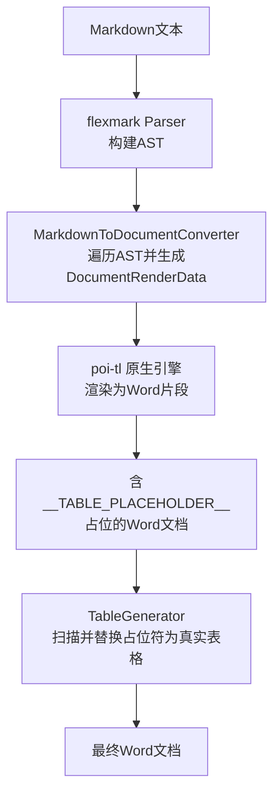
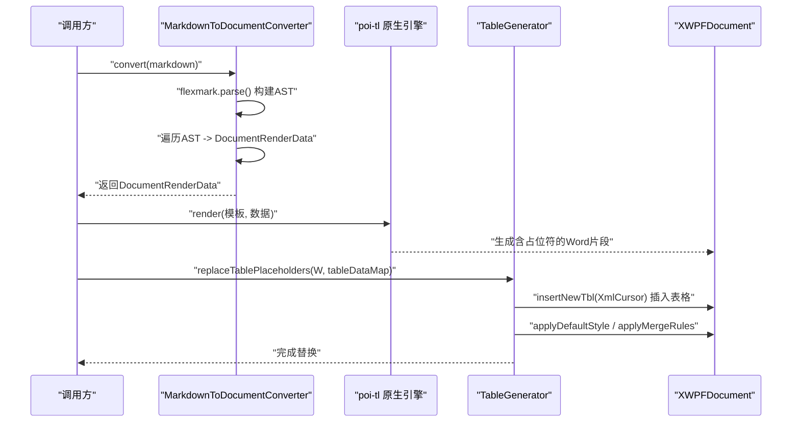
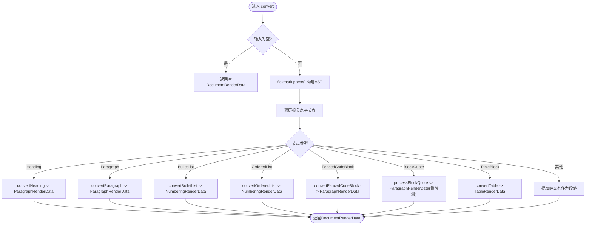
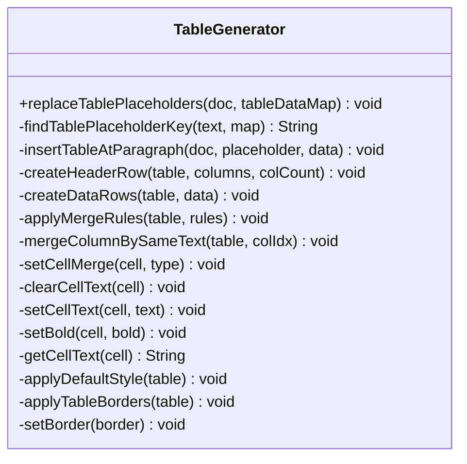

# Markdown转换引擎

<cite>
**本文引用的文件**
- [MarkdownToDocumentConverter.java](file://ele-ai-tender-system/ele-ai-tender-file/src/main/java/com/jy/eleaitender/file/engine/MarkdownToDocumentConverter.java)
- [TableGenerator.java](file://ele-ai-tender-system/ele-ai-tender-file/src/main/java/com/jy/eleaitender/file/engine/TableGenerator.java)
- [FILE_SERVICE_SPEC.md](file://docs/rules/FILE_SERVICE_SPEC.md)
- [MarkdownToDocumentConverterTest.java](file://ele-ai-tender-system/ele-ai-tender-file/src/test/java/com/jy/eleaitender/file/engine/MarkdownToDocumentConverterTest.java)
- [TableGeneratorTest.java](file://ele-ai-tender-system/ele-ai-tender-file/src/test/java/com/jy/eleaitender/file/engine/TableGeneratorTest.java)
</cite>

## 目录
1. [简介](#简介)
2. [项目结构](#项目结构)
3. [核心组件](#核心组件)
4. [架构总览](#架构总览)
5. [详细组件分析](#详细组件分析)
6. [依赖关系分析](#依赖关系分析)
7. [性能与优化](#性能与优化)
8. [故障排查指南](#故障排查指南)
9. [结论](#结论)
10. [附录](#附录)

## 简介
本文件面向“Markdown到文档格式转换”能力，系统性说明从Markdown文本到Word文档的完整转换链路：解析、AST构建、中间表示（poi-tl渲染数据）、最终文档生成。重点覆盖以下方面：
- Markdown语法解析与AST遍历策略
- 行内与块级元素映射规则（标题、段落、列表、引用、代码块、表格等）
- 表格生成逻辑（占位符替换、行列对齐、合并单元格、边框样式）
- 格式保持策略（字体、字号、加粗/斜体、颜色主题、页面布局继承）
- 扩展点（语法插件、样式模板、输出格式定制）
- 性能优化、错误恢复与兼容性处理

## 项目结构
与Markdown转换相关的核心实现位于文件服务模块中，包含两个关键类：
- MarkdownToDocumentConverter：基于flexmark解析Markdown AST，并转换为poi-tl的DocumentRenderData
- TableGenerator：在第二阶段扫描并替换表格占位符，使用Apache POI直接生成表格

图表来源
- [MarkdownToDocumentConverter.java:75-88](file://ele-ai-tender-system/ele-ai-tender-file/src/main/java/com/jy/eleaitender/file/engine/MarkdownToDocumentConverter.java#L75-L88)
- [FILE_SERVICE_SPEC.md:62-64](file://docs/rules/FILE_SERVICE_SPEC.md#L62-L64)
- [TableGenerator.java:31-53](file://ele-ai-tender-system/ele-ai-tender-file/src/main/java/com/jy/eleaitender/file/engine/TableGenerator.java#L31-L53)

章节来源
- [MarkdownToDocumentConverter.java:1-88](file://ele-ai-tender-system/ele-ai-tender-file/src/main/java/com/jy/eleaitender/file/engine/MarkdownToDocumentConverter.java#L1-L88)
- [FILE_SERVICE_SPEC.md:33-71](file://docs/rules/FILE_SERVICE_SPEC.md#L33-L71)
- [TableGenerator.java:1-53](file://ele-ai-tender-system/ele-ai-tender-file/src/main/java/com/jy/eleaitender/file/engine/TableGenerator.java#L1-L53)

## 核心组件
- MarkdownToDocumentConverter
  - 职责：将Markdown文本解析为AST，按节点类型映射为poi-tl渲染数据结构（段落、编号列表、表格等），统一应用默认字体、字号与加粗等样式。
  - 关键点：启用TablesExtension以识别表格；软换行与硬换行均转为段落内换行；表头行加粗；单元格内行内格式保留；列数补齐避免异常。
- TableGenerator
  - 职责：在第二阶段扫描Word中的表格占位符段落，用Apache POI API插入真实表格，设置边框、对齐、字体，并按规则进行垂直合并。
  - 关键点：支持BY_SAME_TEXT合并策略；通过CTTblBorders设置六边边框；占位符前缀匹配兼容前置空白。

章节来源
- [MarkdownToDocumentConverter.java:60-88](file://ele-ai-tender-system/ele-ai-tender-file/src/main/java/com/jy/eleaitender/file/engine/MarkdownToDocumentConverter.java#L60-L88)
- [TableGenerator.java:24-53](file://ele-ai-tender-system/ele-ai-tender-file/src/main/java/com/jy/eleaitender/file/engine/TableGenerator.java#L24-L53)

## 架构总览
整体采用“两阶段渲染”模式：
- 阶段一：poi-tl原生引擎渲染文本/图片/Markdown，其中TABLE类型被渲染为占位文本（如__TABLE_PLACEHOLDER__key）。
- 阶段二：POI扫描文档，定位占位段落，调用TableGenerator插入真实表格并完成样式与合并。

图表来源
- [MarkdownToDocumentConverter.java:75-88](file://ele-ai-tender-system/ele-ai-tender-file/src/main/java/com/jy/eleaitender/file/engine/MarkdownToDocumentConverter.java#L75-L88)
- [FILE_SERVICE_SPEC.md:62-64](file://docs/rules/FILE_SERVICE_SPEC.md#L62-L64)
- [TableGenerator.java:31-53](file://ele-ai-tender-system/ele-ai-tender-file/src/main/java/com/jy/eleaitender/file/engine/TableGenerator.java#L31-L53)

## 详细组件分析

### MarkdownToDocumentConverter 分析与流程
- 解析与入口
  - 构造Parser时启用TablesExtension，使flexmark识别表格语法。
  - convert方法对空输入做快速返回，非空则parse为AST并遍历子节点。
- 块级节点分发
  - Heading → ParagraphRenderData（大号加粗字体）
  - Paragraph → ParagraphRenderData（含行内格式）
  - BulletList/OrderedList → NumberingRenderData
  - BlockQuote → 带前缀的ParagraphRenderData
  - FencedCodeBlock → 等宽字体的ParagraphRenderData
  - TableBlock → TableRenderData（表头加粗，单元格保留行内格式）
- 行内格式收集
  - collectInlineText递归处理Text、StrongEmphasis、Emphasis、Code、SoftLineBreak、HardLineBreak等，按上下文合并Style。
  - 软换行与硬换行均转为段落内换行，保证连续编号条款逐行显示。
- 表格转换细节
  - 跳过TableSeparator分隔行，仅取TableHead/TableBody下的TableRow。
  - 计算最大列数并对不足行补齐空单元格，避免poi-tl抛异常。
  - 表头行标记为加粗；单元格内容通过collectInlineText保留加粗/斜体/代码等行内样式。

图表来源
- [MarkdownToDocumentConverter.java:75-116](file://ele-ai-tender-system/ele-ai-tender-file/src/main/java/com/jy/eleaitender/file/engine/MarkdownToDocumentConverter.java#L75-L116)
- [MarkdownToDocumentConverter.java:120-174](file://ele-ai-tender-system/ele-ai-tender-file/src/main/java/com/jy/eleaitender/file/engine/MarkdownToDocumentConverter.java#L120-L174)
- [MarkdownToDocumentConverter.java:186-234](file://ele-ai-tender-system/ele-ai-tender-file/src/main/java/com/jy/eleaitender/file/engine/MarkdownToDocumentConverter.java#L186-L234)
- [MarkdownToDocumentConverter.java:358-386](file://ele-ai-tender-system/ele-ai-tender-file/src/main/java/com/jy/eleaitender/file/engine/MarkdownToDocumentConverter.java#L358-L386)
- [MarkdownToDocumentConverter.java:401-446](file://ele-ai-tender-system/ele-ai-tender-file/src/main/java/com/jy/eleaitender/file/engine/MarkdownToDocumentConverter.java#L401-L446)

章节来源
- [MarkdownToDocumentConverter.java:60-116](file://ele-ai-tender-system/ele-ai-tender-file/src/main/java/com/jy/eleaitender/file/engine/MarkdownToDocumentConverter.java#L60-L116)
- [MarkdownToDocumentConverter.java:120-174](file://ele-ai-tender-system/ele-ai-tender-file/src/main/java/com/jy/eleaitender/file/engine/MarkdownToDocumentConverter.java#L120-L174)
- [MarkdownToDocumentConverter.java:186-234](file://ele-ai-tender-system/ele-ai-tender-file/src/main/java/com/jy/eleaitender/file/engine/MarkdownToDocumentConverter.java#L186-L234)
- [MarkdownToDocumentConverter.java:358-386](file://ele-ai-tender-system/ele-ai-tender-file/src/main/java/com/jy/eleaitender/file/engine/MarkdownToDocumentConverter.java#L358-L386)
- [MarkdownToDocumentConverter.java:401-446](file://ele-ai-tender-system/ele-ai-tender-file/src/main/java/com/jy/eleaitender/file/engine/MarkdownToDocumentConverter.java#L401-L446)

### TableGenerator 表格生成逻辑
- 占位符扫描与替换
  - replaceTablePlaceholders从后向前遍历body元素，定位包含占位符前缀的段落，根据键值获取TableData并插入表格。
  - findTablePlaceholderKey支持占位符前后存在空白字符的情况。
- 表格创建与填充
  - insertTableAtParagraph使用XmlCursor在占位段落前插入新表格，确保列数一致，生成表头和数据行。
  - createHeaderRow设置表头文本并加粗；createDataRows按列定义填充数据。
- 样式与边框
  - applyDefaultStyle设置表格宽度、单元格垂直居中、段落左对齐、零间距、字体宋体10pt；表头行居中对齐。
  - applyTableBorders通过CTTblBorders设置top/bottom/left/right/insideH/insideV六种边框。
- 单元格合并
  - applyMergeRules支持BY_SAME_TEXT策略，mergeColumnBySameText对相邻相同文本进行垂直合并，清除重复文本。

图表来源
- [TableGenerator.java:24-287](file://ele-ai-tender-system/ele-ai-tender-file/src/main/java/com/jy/eleaitender/file/engine/TableGenerator.java#L24-L287)

章节来源
- [TableGenerator.java:31-53](file://ele-ai-tender-system/ele-ai-tender-file/src/main/java/com/jy/eleaitender/file/engine/TableGenerator.java#L31-L53)
- [TableGenerator.java:75-117](file://ele-ai-tender-system/ele-ai-tender-file/src/main/java/com/jy/eleaitender/file/engine/TableGenerator.java#L75-L117)
- [TableGenerator.java:119-143](file://ele-ai-tender-system/ele-ai-tender-file/src/main/java/com/jy/eleaitender/file/engine/TableGenerator.java#L119-L143)
- [TableGenerator.java:147-198](file://ele-ai-tender-system/ele-ai-tender-file/src/main/java/com/jy/eleaitender/file/engine/TableGenerator.java#L147-L198)
- [TableGenerator.java:234-285](file://ele-ai-tender-system/ele-ai-tender-file/src/main/java/com/jy/eleaitender/file/engine/TableGenerator.java#L234-L285)

### 支持的Markdown特性与转换规则
- 标题层级：h1-h6映射为不同字号的加粗段落，统一使用默认字体。
- 段落与行内格式：加粗、斜体、行内代码、软/硬换行（段落内换行）。
- 列表：无序列表（圆点）、有序列表（数字）映射为NumberingRenderData。
- 引用：段落或标题前添加固定前缀。
- 代码块：围栏代码块去除首尾围栏行，使用等宽字体。
- 表格：识别标准表格语法，表头加粗，单元格内行内格式保留，列数补齐避免异常。
- 链接/图片/数学公式：当前实现未显式处理，行内未知节点会降级为纯文本提取。

章节来源
- [MarkdownToDocumentConverter.java:120-174](file://ele-ai-tender-system/ele-ai-tender-file/src/main/java/com/jy/eleaitender/file/engine/MarkdownToDocumentConverter.java#L120-L174)
- [MarkdownToDocumentConverter.java:186-234](file://ele-ai-tender-system/ele-ai-tender-file/src/main/java/com/jy/eleaitender/file/engine/MarkdownToDocumentConverter.java#L186-L234)
- [MarkdownToDocumentConverter.java:358-386](file://ele-ai-tender-system/ele-ai-tender-file/src/main/java/com/jy/eleaitender/file/engine/MarkdownToDocumentConverter.java#L358-L386)
- [MarkdownToDocumentConverter.java:401-446](file://ele-ai-tender-system/ele-ai-tender-file/src/main/java/com/jy/eleaitender/file/engine/MarkdownToDocumentConverter.java#L401-L446)

### 格式保持策略
- 字体与字号
  - 正文默认字体与字号常量；代码块使用等宽字体；标题按层级设定字号并加粗。
- 颜色主题
  - 当前实现未设置颜色主题；可在Style对象上设置颜色字段以适配主题。
- 页面布局
  - 表格宽度设置为100%，单元格垂直居中，段落左对齐，零段前/段后间距；表头行居中对齐。
- 继承与适配
  - 行内样式通过mergeStyle/copyStyle继承父级样式，并在必要时覆盖（如加粗/斜体/代码环境）。

章节来源
- [MarkdownToDocumentConverter.java:39-67](file://ele-ai-tender-system/ele-ai-tender-file/src/main/java/com/jy/eleaitender/file/engine/MarkdownToDocumentConverter.java#L39-L67)
- [MarkdownToDocumentConverter.java:141-152](file://ele-ai-tender-system/ele-ai-tender-file/src/main/java/com/jy/eleaitender/file/engine/MarkdownToDocumentConverter.java#L141-L152)
- [MarkdownToDocumentConverter.java:249-278](file://ele-ai-tender-system/ele-ai-tender-file/src/main/java/com/jy/eleaitender/file/engine/MarkdownToDocumentConverter.java#L249-L278)
- [TableGenerator.java:234-264](file://ele-ai-tender-system/ele-ai-tender-file/src/main/java/com/jy/eleaitender/file/engine/TableGenerator.java#L234-L264)

### 自定义转换规则扩展点
- 语法插件
  - flexmark扩展机制：可通过MutableDataSet配置更多扩展（如任务列表、脚注、数学公式等），在构造Parser时注入。
- 样式模板
  - 在MarkdownToDocumentConverter中集中管理Style常量与映射，可抽离为配置项或外部模板，动态调整字体、字号、颜色、对齐等。
- 输出格式定制
  - 通过TableGenerator的样式与边框设置方法，扩展表格外观（边框粗细、颜色、合并策略等）。
  - 在poi-tl阶段，遵循原生引擎约束与占位符语法，避免SpringEL导致的属性访问异常。

章节来源
- [MarkdownToDocumentConverter.java:60-67](file://ele-ai-tender-system/ele-ai-tender-file/src/main/java/com/jy/eleaitender/file/engine/MarkdownToDocumentConverter.java#L60-L67)
- [TableGenerator.java:234-285](file://ele-ai-tender-system/ele-ai-tender-file/src/main/java/com/jy/eleaitender/file/engine/TableGenerator.java#L234-L285)
- [FILE_SERVICE_SPEC.md:33-71](file://docs/rules/FILE_SERVICE_SPEC.md#L33-L71)

## 依赖关系分析
- 内部依赖
  - MarkdownToDocumentConverter依赖flexmark AST与poi-tl渲染数据模型。
  - TableGenerator依赖Apache POI XWPF与OpenXML Schema进行表格生成与样式设置。
- 外部约束
  - poi-tl原生引擎与占位符语法规范；表格占位符由第一阶段生成，第二阶段替换。
  - 修订标记预处理要求：在传入poi-tl之前需接受所有修订，避免编译阶段索引错乱。

图表来源
- [MarkdownToDocumentConverter.java:60-67](file://ele-ai-tender-system/ele-ai-tender-file/src/main/java/com/jy/eleaitender/file/engine/MarkdownToDocumentConverter.java#L60-L67)
- [FILE_SERVICE_SPEC.md:62-71](file://docs/rules/FILE_SERVICE_SPEC.md#L62-L71)
- [TableGenerator.java:266-285](file://ele-ai-tender-system/ele-ai-tender-file/src/main/java/com/jy/eleaitender/file/engine/TableGenerator.java#L266-L285)

章节来源
- [FILE_SERVICE_SPEC.md:33-71](file://docs/rules/FILE_SERVICE_SPEC.md#L33-L71)
- [MarkdownToDocumentConverter.java:60-67](file://ele-ai-tender-system/ele-ai-tender-file/src/main/java/com/jy/eleaitender/file/engine/MarkdownToDocumentConverter.java#L60-L67)
- [TableGenerator.java:266-285](file://ele-ai-tender-system/ele-ai-tender-file/src/main/java/com/jy/eleaitender/file/engine/TableGenerator.java#L266-L285)

## 性能与优化
- 解析与遍历
  - flexmark AST构建一次，随后线性遍历，时间复杂度近似O(N)，N为节点数量。
  - 表格转换分两阶段：先收集行与最大列数，再补齐并构建，避免多次重建。
- 内存与对象复用
  - 行内样式通过copyStyle/mergeStyle复用与最小化新建，减少对象分配。
- 表格生成
  - 使用XmlCursor插入表格，避免频繁DOM重排；一次性设置边框与样式，降低后续开销。
- 建议
  - 对超大Markdown文档，考虑分批转换与流式写入。
  - 对复杂表格，预计算列宽与合并区间，减少运行时判断。

[本节为通用指导，不直接分析具体文件]

## 故障排查指南
- 表格退化为纯文本段落
  - 现象：表格以带竖线的纯文本出现。
  - 原因：未正确识别TableBlock或TableSeparator未被跳过。
  - 验证：检查convertTable是否跳过分隔行并正确构建TableRenderData。
- 合并单元格导致列数不一致
  - 现象：poi-tl抛异常导致整篇文档生成失败。
  - 原因：某行cell数少于表头列数。
  - 修复：按最大列数补齐空单元格。
- 软换行挤在同一行
  - 现象：连续编号条款行被空格拼接。
  - 修复：将SoftLineBreak与HardLineBreak统一转为段落内换行。
- 占位符替换失败
  - 现象：表格未插入。
  - 原因：占位符前存在空白或键名不匹配。
  - 修复：findTablePlaceholderKey支持trim与前置空白匹配。
- 修订标记导致索引异常
  - 现象：IndexOutOfBoundsException。
  - 原因：模板含修订标记，poi-tl编译阶段refactorRun索引错乱。
  - 修复：在渲染前执行acceptAllRevisions清理修订标记。

章节来源
- [MarkdownToDocumentConverter.java:401-446](file://ele-ai-tender-system/ele-ai-tender-file/src/main/java/com/jy/eleaitender/file/engine/MarkdownToDocumentConverter.java#L401-L446)
- [MarkdownToDocumentConverter.java:211-217](file://ele-ai-tender-system/ele-ai-tender-file/src/main/java/com/jy/eleaitender/file/engine/MarkdownToDocumentConverter.java#L211-L217)
- [TableGenerator.java:55-70](file://ele-ai-tender-system/ele-ai-tender-file/src/main/java/com/jy/eleaitender/file/engine/TableGenerator.java#L55-L70)
- [FILE_SERVICE_SPEC.md:67-71](file://docs/rules/FILE_SERVICE_SPEC.md#L67-L71)

## 结论
本转换引擎通过flexmark AST与poi-tl原生引擎的组合，实现了从Markdown到Word的稳定转换。MarkdownToDocumentConverter负责结构化与样式映射，TableGenerator负责表格占位符替换与精细样式控制。两阶段渲染有效规避了循环标签与边界问题，并通过严格的边框与合并策略保障输出质量。未来可在语法扩展、样式模板与输出格式定制方面进一步开放扩展点，以满足更复杂的业务需求。

[本节为总结性内容，不直接分析具体文件]

## 附录
- 测试用例参考
  - 标题、段落、列表、代码块、表格、混合内容的行为验证。
  - 表格占位符替换与列数对齐、单元格内行内格式保留等断言。

章节来源
- [MarkdownToDocumentConverterTest.java:192-218](file://ele-ai-tender-system/ele-ai-tender-file/src/test/java/com/jy/eleaitender/file/engine/MarkdownToDocumentConverterTest.java#L192-L218)
- [MarkdownToDocumentConverterTest.java:363-440](file://ele-ai-tender-system/ele-ai-tender-file/src/test/java/com/jy/eleaitender/file/engine/MarkdownToDocumentConverterTest.java#L363-L440)
- [MarkdownToDocumentConverterTest.java:440-473](file://ele-ai-tender-system/ele-ai-tender-file/src/test/java/com/jy/eleaitender/file/engine/MarkdownToDocumentConverterTest.java#L440-L473)
- [TableGeneratorTest.java:1-35](file://ele-ai-tender-system/ele-ai-tender-file/src/test/java/com/jy/eleaitender/file/engine/TableGeneratorTest.java#L1-L35)