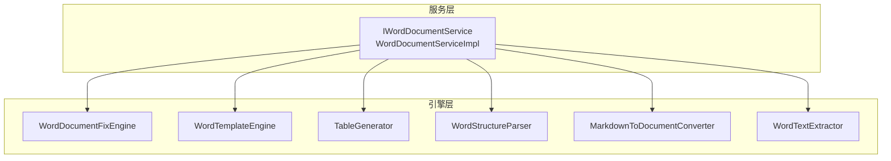
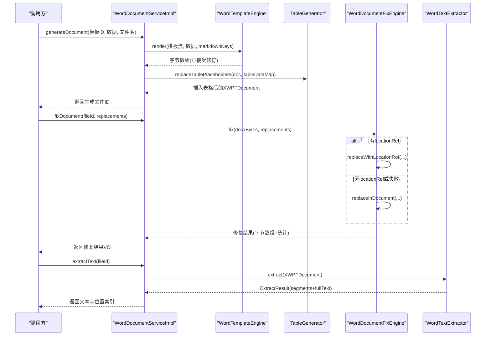
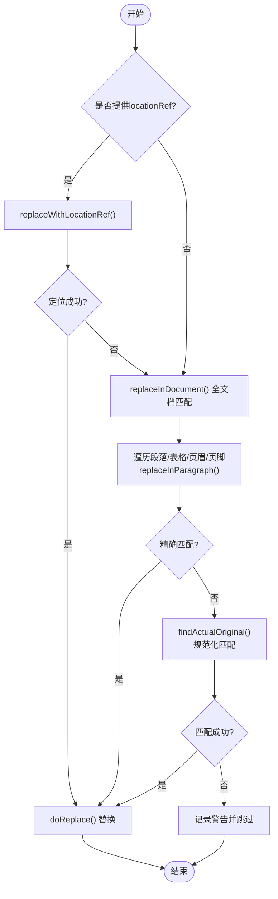
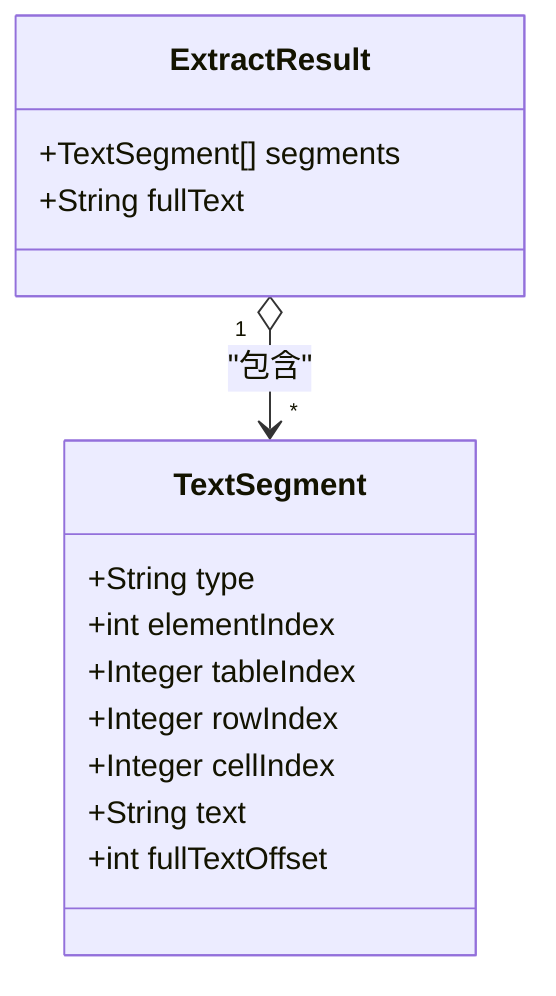
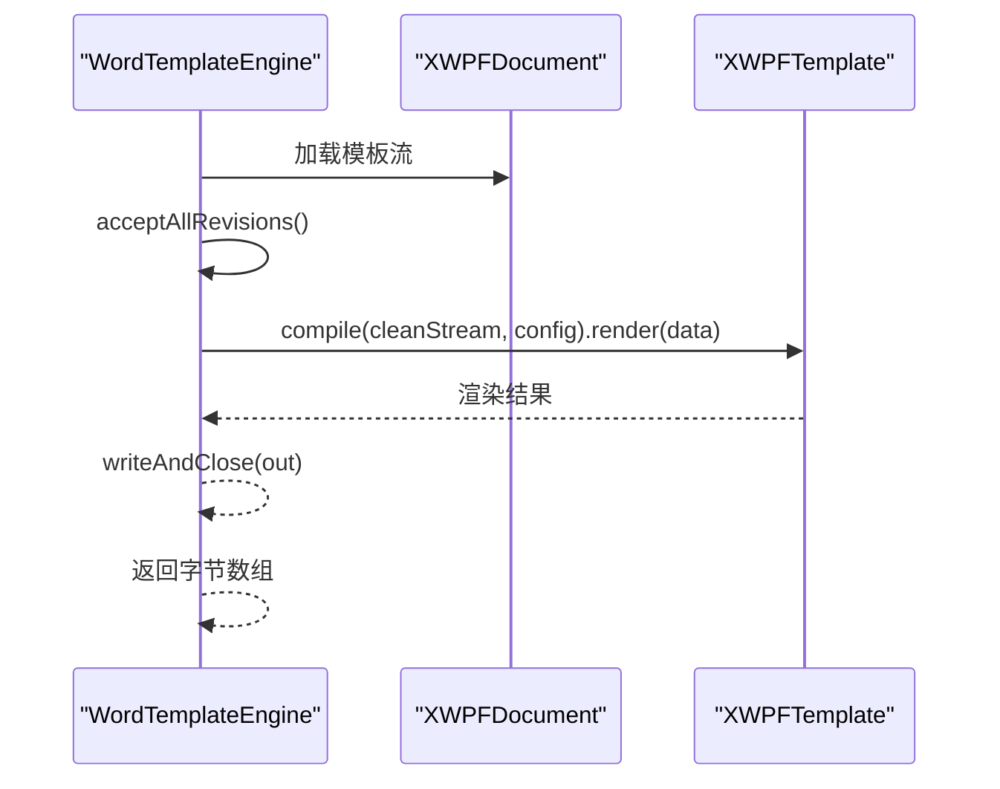
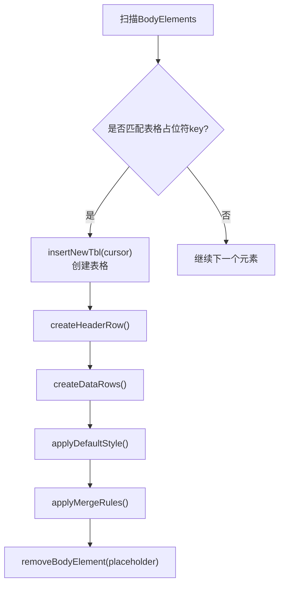
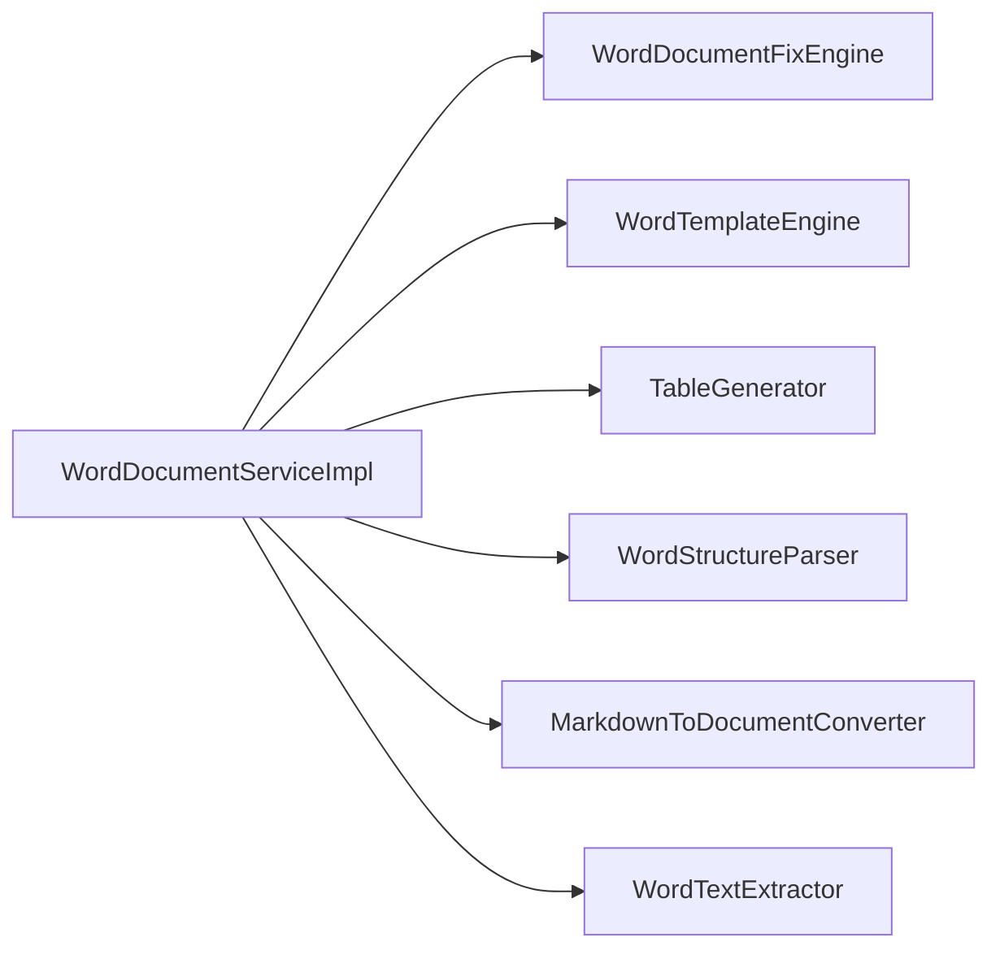

# Word文档处理

<cite>
**本文引用的文件**   
- [WordDocumentFixEngine.java](file://ele-ai-tender-system/ele-ai-tender-file/src/main/java/com/jy/eleaitender/file/engine/WordDocumentFixEngine.java)
- [WordTextExtractor.java](file://ele-ai-tender-system/ele-ai-tender-file/src/main/java/com/jy/eleaitender/file/engine/WordTextExtractor.java)
- [WordTemplateEngine.java](file://ele-ai-tender-system/ele-ai-tender-file/src/main/java/com/jy/eleaitender/file/engine/WordTemplateEngine.java)
- [TableGenerator.java](file://ele-ai-tender-system/ele-ai-tender-file/src/main/java/com/jy/eleaitender/file/engine/TableGenerator.java)
- [WordStructureParser.java](file://ele-ai-tender-system/ele-ai-tender-file/src/main/java/com/jy/eleaitender/file/engine/WordStructureParser.java)
- [MarkdownToDocumentConverter.java](file://ele-ai-tender-system/ele-ai-tender-file/src/main/java/com/jy/eleaitender/file/engine/MarkdownToDocumentConverter.java)
- [IWordDocumentService.java](file://ele-ai-tender-system/ele-ai-tender-file/src/main/java/com/jy/eleaitender/file/service/IWordDocumentService.java)
- [WordDocumentServiceImpl.java](file://ele-ai-tender-system/ele-ai-tender-file/src/main/java/com/jy/eleaitender/file/service/impl/WordDocumentServiceImpl.java)
</cite>

## 目录
1. [简介](#简介)
2. [项目结构](#项目结构)
3. [核心组件](#核心组件)
4. [架构总览](#架构总览)
5. [详细组件分析](#详细组件分析)
6. [依赖关系分析](#依赖关系分析)
7. [性能与内存优化](#性能与内存优化)
8. [故障排查指南](#故障排查指南)
9. [结论](#结论)
10. [附录](#附录)

## 简介
本文件围绕基于 Apache POI 的 Word 文档处理能力，系统梳理解析、修改与生成的关键实现。重点覆盖：
- 文本查找替换（含 locationRef 精确定位、规范化匹配、空白字符处理、Run 级别操作）
- 表格生成与合并策略
- 段落与页眉页脚遍历
- 模板渲染（占位符替换、Markdown 渲染、修订标记清理）
- 文本提取与定位（段落结构、表格内容、位置索引）
- 版本对比与差异高亮（前端 diff2html 集成思路）
- 大文档处理的内存优化、流式读取与并发控制建议

## 项目结构
Word 文档处理相关代码集中在 file 模块的 engine 与 service 层，采用“引擎+服务”的分层组织方式：
- engine：封装具体处理逻辑（修复、模板渲染、表格生成、结构解析、Markdown 转换、文本提取）
- service：对外暴露统一接口，编排各引擎完成端到端流程

图表来源
- [IWordDocumentService.java](file://ele-ai-tender-system/ele-ai-tender-file/src/main/java/com/jy/eleaitender/file/service/IWordDocumentService.java)
- [WordDocumentServiceImpl.java](file://ele-ai-tender-system/ele-ai-tender-file/src/main/java/com/jy/eleaitender/file/service/impl/WordDocumentServiceImpl.java)
- [WordDocumentFixEngine.java](file://ele-ai-tender-system/ele-ai-tender-file/src/main/java/com/jy/eleaitender/file/engine/WordDocumentFixEngine.java)
- [WordTemplateEngine.java](file://ele-ai-tender-system/ele-ai-tender-file/src/main/java/com/jy/eleaitender/file/engine/WordTemplateEngine.java)
- [TableGenerator.java](file://ele-ai-tender-system/ele-ai-tender-file/src/main/java/com/jy/eleaitender/file/engine/TableGenerator.java)
- [WordStructureParser.java](file://ele-ai-tender-system/ele-ai-tender-file/src/main/java/com/jy/eleaitender/file/engine/WordStructureParser.java)
- [MarkdownToDocumentConverter.java](file://ele-ai-tender-system/ele-ai-tender-file/src/main/java/com/jy/eleaitender/file/engine/MarkdownToDocumentConverter.java)
- [WordTextExtractor.java](file://ele-ai-tender-system/ele-ai-tender-file/src/main/java/com/jy/eleaitender/file/engine/WordTextExtractor.java)

章节来源
- [IWordDocumentService.java:1-49](file://ele-ai-tender-system/ele-ai-tender-file/src/main/java/com/jy/eleaitender/file/service/IWordDocumentService.java#L1-L49)
- [WordDocumentServiceImpl.java:1-180](file://ele-ai-tender-system/ele-ai-tender-file/src/main/java/com/jy/eleaitender/file/service/impl/WordDocumentServiceImpl.java#L1-L180)

## 核心组件
- WordDocumentFixEngine：基于 Apache POI 的文本修复引擎，支持 locationRef 精准定位与全文档兜底匹配，提供两级匹配（精确/规范化）与 Run 级替换。
- WordTextExtractor：从 XWPFDocument 提取段落与表格单元格的文本片段，构建 segments 与 fullText，并支持按偏移量二分定位到具体元素。
- WordTemplateEngine：使用 poi-tl 进行模板渲染，自动清理修订标记，支持 Markdown 占位符绑定 DocumentRenderPolicy。
- TableGenerator：绕过 poi-tl 循环标签，直接通过 POI API 插入表格、设置样式、应用单元格合并规则。
- WordStructureParser：解析文档结构（章节 Heading、占位符、书签），用于预览与导航。
- MarkdownToDocumentConverter：将 Markdown AST 转换为 poi-tl 的 DocumentRenderData，支持标题、段落、列表、引用、代码块、表格等。
- IWordDocumentService / WordDocumentServiceImpl：对外服务接口与编排实现，串联上述引擎完成生成、修复、结构解析与文本提取。

章节来源
- [WordDocumentFixEngine.java:1-252](file://ele-ai-tender-system/ele-ai-tender-file/src/main/java/com/jy/eleaitender/file/engine/WordDocumentFixEngine.java#L1-L252)
- [WordTextExtractor.java:1-202](file://ele-ai-tender-system/ele-ai-tender-file/src/main/java/com/jy/eleaitender/file/engine/WordTextExtractor.java#L1-L202)
- [WordTemplateEngine.java:1-121](file://ele-ai-tender-system/ele-ai-tender-file/src/main/java/com/jy/eleaitender/file/engine/WordTemplateEngine.java#L1-L121)
- [TableGenerator.java:1-287](file://ele-ai-tender-system/ele-ai-tender-file/src/main/java/com/jy/eleaitender/file/engine/TableGenerator.java#L1-L287)
- [WordStructureParser.java:1-132](file://ele-ai-tender-system/ele-ai-tender-file/src/main/java/com/jy/eleaitender/file/engine/WordStructureParser.java#L1-L132)
- [MarkdownToDocumentConverter.java:1-481](file://ele-ai-tender-system/ele-ai-tender-file/src/main/java/com/jy/eleaitender/file/engine/MarkdownToDocumentConverter.java#L1-L481)
- [IWordDocumentService.java:1-49](file://ele-ai-tender-system/ele-ai-tender-file/src/main/java/com/jy/eleaitender/file/service/IWordDocumentService.java#L1-L49)
- [WordDocumentServiceImpl.java:1-180](file://ele-ai-tender-system/ele-ai-tender-file/src/main/java/com/jy/eleaitender/file/service/impl/WordDocumentServiceImpl.java#L1-L180)

## 架构总览
整体采用“两阶段渲染 + 多引擎协作”的架构：
- 第一阶段：poi-tl 渲染文本/图片/Markdown 占位符
- 第二阶段：POI 编程生成表格（含合并、样式）
- 修复流程：优先 locationRef 定位，失败则全文档匹配；支持段落、表格、页眉页脚
- 文本提取：段落与表格单元格分段，维护 fullText 与 segments，支持二分定位

图表来源
- [WordDocumentServiceImpl.java:64-180](file://ele-ai-tender-system/ele-ai-tender-file/src/main/java/com/jy/eleaitender/file/service/impl/WordDocumentServiceImpl.java#L64-L180)
- [WordTemplateEngine.java:42-63](file://ele-ai-tender-system/ele-ai-tender-file/src/main/java/com/jy/eleaitender/file/engine/WordTemplateEngine.java#L42-L63)
- [TableGenerator.java:31-53](file://ele-ai-tender-system/ele-ai-tender-file/src/main/java/com/jy/eleaitender/file/engine/TableGenerator.java#L31-L53)
- [WordDocumentFixEngine.java:32-66](file://ele-ai-tender-system/ele-ai-tender-file/src/main/java/com/jy/eleaitender/file/engine/WordDocumentFixEngine.java#L32-L66)
- [WordTextExtractor.java:37-95](file://ele-ai-tender-system/ele-ai-tender-file/src/main/java/com/jy/eleaitender/file/engine/WordTextExtractor.java#L37-L95)

## 详细组件分析

### WordDocumentFixEngine（修复引擎）
- 功能要点
  - 优先使用 locationRef 定位到段落或表格单元格，再执行替换
  - 若无 locationRef 或定位失败，回退为全文档匹配（段落、表格、页眉、页脚）
  - 两级匹配：Level1 精确包含；Level2 规范化匹配（忽略空白后匹配，还原实际子串范围）
  - 替换策略：清空段落所有 Run，将替换后文本写入第一个 Run，保持后续结构稳定
- 算法细节
  - 规范化匹配：对原始文本与目标原文分别去除空白字符，找到等价子串后，通过 normToRaw 映射还原真实起止位置
  - 空白判定：兼容全角空格、不间断空格等
- 复杂度
  - 段落扫描 O(N)，每段内字符串查找 O(M)，总体近似 O(N·M)
  - 规范化映射构建 O(L)，L 为段落长度
- 错误处理
  - 未找到原文时记录警告日志并跳过该条替换
  - 异常包装为运行时异常，便于上层统一捕获

图表来源
- [WordDocumentFixEngine.java:32-66](file://ele-ai-tender-system/ele-ai-tender-file/src/main/java/com/jy/eleaitender/file/engine/WordDocumentFixEngine.java#L32-L66)
- [WordDocumentFixEngine.java:156-192](file://ele-ai-tender-system/ele-ai-tender-file/src/main/java/com/jy/eleaitender/file/engine/WordDocumentFixEngine.java#L156-L192)
- [WordDocumentFixEngine.java:209-234](file://ele-ai-tender-system/ele-ai-tender-file/src/main/java/com/jy/eleaitender/file/engine/WordDocumentFixEngine.java#L209-L234)

章节来源
- [WordDocumentFixEngine.java:1-252](file://ele-ai-tender-system/ele-ai-tender-file/src/main/java/com/jy/eleaitender/file/engine/WordDocumentFixEngine.java#L1-L252)

### WordTextExtractor（文本提取与定位）
- 功能要点
  - 遍历 BodyElements，提取段落与表格单元格文本，构建 segments 列表与 fullText
  - 每个 segment 记录 type、elementIndex、tableIndex、rowIndex、cellIndex、text、fullTextOffset
  - locate(result, original) 支持精确匹配与规范化匹配，并通过二分查找定位到对应 segment
- 算法细节
  - 规范化匹配：在 fullText 上先做空白归一化，再通过 normToRaw 映射得到原始偏移
  - 二分查找：根据 fullTextOffset 快速定位到目标 segment
- 适用场景
  - 检测结果的原文定位、前端高亮展示、跳转至具体段落/单元格

图表来源
- [WordTextExtractor.java:17-32](file://ele-ai-tender-system/ele-ai-tender-file/src/main/java/com/jy/eleaitender/file/engine/WordTextExtractor.java#L17-L32)

章节来源
- [WordTextExtractor.java:1-202](file://ele-ai-tender-system/ele-ai-tender-file/src/main/java/com/jy/eleaitender/file/engine/WordTextExtractor.java#L1-L202)

### WordTemplateEngine（模板渲染）
- 功能要点
  - 使用 poi-tl 编译并渲染模板，支持 Markdown 占位符绑定 DocumentRenderPolicy
  - 渲染前自动“接受所有修订”，避免 <w:ins>/<w:del> 导致 poi-tl 合并 Run 时索引不同步
- 修订清理机制
  - 解包 ins/moveTo（保留子节点）、删除 del/moveFrom/rPrChange/pPrChange/sectPrChange/tblPrChange/tcPrChange/trPrChange
  - 反序处理以避免 DOM 节点移动导致的索引偏移
- 输出
  - 返回渲染后的文档字节数组

图表来源
- [WordTemplateEngine.java:42-89](file://ele-ai-tender-system/ele-ai-tender-file/src/main/java/com/jy/eleaitender/file/engine/WordTemplateEngine.java#L42-L89)

章节来源
- [WordTemplateEngine.java:1-121](file://ele-ai-tender-system/ele-ai-tender-file/src/main/java/com/jy/eleaitender/file/engine/WordTemplateEngine.java#L1-L121)

### TableGenerator（表格生成与合并）
- 功能要点
  - 扫描文档中的表格占位符段落（以特定前缀标识 key），替换为生成的表格
  - 插入新表格、创建表头行与数据行、应用默认样式（边框、字体、对齐）
  - 支持按列相同文本合并（BY_SAME_TEXT），通过 VMerge 属性实现
- 关键点
  - 使用 XmlCursor 在占位段落前插入新表格，随后移除原占位段落
  - 合并策略：逐列扫描，连续相同文本区间设置 VMerge.RESTART/CONTINUE，并清除中间行文本

图表来源
- [TableGenerator.java:31-117](file://ele-ai-tender-system/ele-ai-tender-file/src/main/java/com/jy/eleaitender/file/engine/TableGenerator.java#L31-L117)
- [TableGenerator.java:147-198](file://ele-ai-tender-system/ele-ai-tender-file/src/main/java/com/jy/eleaitender/file/engine/TableGenerator.java#L147-L198)

章节来源
- [TableGenerator.java:1-287](file://ele-ai-tender-system/ele-ai-tender-file/src/main/java/com/jy/eleaitender/file/engine/TableGenerator.java#L1-L287)

### MarkdownToDocumentConverter（Markdown → DocumentRenderData）
- 功能要点
  - 使用 flexmark 解析 Markdown AST，将标题、段落、列表、引用、代码块、表格等转换为 poi-tl 的渲染数据结构
  - 行内格式（加粗、斜体、代码）通过 Style 继承与合并传递
  - 软换行与硬换行均转为段落内换行，适配中文招标文档编号条款显示需求
  - 表格处理：跳过分隔行，补齐空单元格，表头加粗
- 适用场景
  - 作为 WordTemplateEngine 的 Markdown 渲染策略，实现富文本占位符填充

章节来源
- [MarkdownToDocumentConverter.java:1-481](file://ele-ai-tender-system/ele-ai-tender-file/src/main/java/com/jy/eleaitender/file/engine/MarkdownToDocumentConverter.java#L1-L481)

### WordStructureParser（文档结构解析）
- 功能要点
  - 解析章节（Heading 样式）、占位符（{{key}}）、书签（CTBookmark）
  - 遍历段落与表格，收集信息并去重
- 用途
  - 文档预览导航、占位符校验、书签跳转

章节来源
- [WordStructureParser.java:1-132](file://ele-ai-tender-system/ele-ai-tender-file/src/main/java/com/jy/eleaitender/file/engine/WordStructureParser.java#L1-L132)

### IWordDocumentService 与 WordDocumentServiceImpl（服务编排）
- 能力
  - 获取文档结构：调用 WordStructureParser
  - 基于模板生成文档：两阶段渲染（poi-tl + POI 表格）
  - 修复文档：调用 WordDocumentFixEngine，命名策略保留原始文件名并追加时间戳前缀
  - 提取文本与位置索引：调用 WordTextExtractor
- 编排流程
  - 反序列化 FillData 列表，依次执行模板渲染与表格替换，最终上传生成文件

章节来源
- [IWordDocumentService.java:1-49](file://ele-ai-tender-system/ele-ai-tender-file/src/main/java/com/jy/eleaitender/file/service/IWordDocumentService.java#L1-L49)
- [WordDocumentServiceImpl.java:1-180](file://ele-ai-tender-system/ele-ai-tender-file/src/main/java/com/jy/eleaitender/file/service/impl/WordDocumentServiceImpl.java#L1-L180)

## 依赖关系分析
- 组件耦合
  - WordDocumentServiceImpl 聚合多个引擎，职责清晰，耦合度低
  - WordTemplateEngine 与 poi-tl 强耦合，但通过内部方法隔离修订清理逻辑
  - TableGenerator 直接操作 POI 底层 XML（XmlCursor、VMerge），具备较强可控性
- 外部依赖
  - Apache POI（XWPFDocument、XWPFParagraph、XWPFTable 等）
  - poi-tl（XWPFTemplate、Configure、DocumentRenderPolicy）
  - flexmark（Markdown AST 解析）
- 潜在循环依赖
  - 当前未见循环导入，引擎之间相互独立，由服务层编排

图表来源
- [WordDocumentServiceImpl.java:1-180](file://ele-ai-tender-system/ele-ai-tender-file/src/main/java/com/jy/eleaitender/file/service/impl/WordDocumentServiceImpl.java#L1-L180)

章节来源
- [WordDocumentServiceImpl.java:1-180](file://ele-ai-tender-system/ele-ai-tender-file/src/main/java/com/jy/eleaitender/file/service/impl/WordDocumentServiceImpl.java#L1-L180)

## 性能与内存优化
- 大文档处理建议
  - 流式读取：在服务层尽量使用 InputStream 而非一次性读入字节数组，减少堆内存占用
  - 分块处理：对超大文档可考虑分页/分节处理（如仅处理指定章节或表格）
  - 对象复用：避免频繁创建临时对象，复用 StringBuilder、ByteArrayOutputStream 等
- 并发控制
  - 使用线程池限制并行渲染任务数量，避免同时加载过多 XWPFDocument 导致 OOM
  - 针对固定资源（如字体、样式）进行缓存，减少重复初始化开销
- 匹配与替换优化
  - 优先使用 locationRef 定位，降低全文扫描成本
  - 规范化匹配仅在精确匹配失败时触发，减少正则/映射构建开销
- 表格生成优化
  - 批量创建行与单元格，减少多次 IO 与 DOM 操作
  - 合并策略一次扫描完成，避免二次遍历

[本节为通用指导，不直接分析具体文件]

## 故障排查指南
- 模板渲染失败
  - 现象：抛出 IndexOutOfBoundsException 或模板填充失败
  - 原因：模板中存在修订标记导致 poi-tl 合并 Run 时索引不同步
  - 解决：确保 WordTemplateEngine 在渲染前执行 acceptAllRevisions，清理 ins/del 等标记
- 修复未命中
  - 现象：日志提示“未找到原文，跳过修复”
  - 排查：检查 original 与 targeted 是否正确；确认 locationRef 的 elementIndex/type/rowIndex/cellIndex 是否有效
  - 兜底：无 locationRef 时会走全文档匹配，但仍需保证规范化匹配可用
- 表格生成异常
  - 现象：表格列数不一致导致渲染异常
  - 排查：确保 TableGenerator 在构建表格时对每行补齐空单元格，并正确应用合并规则
- 文本定位失败
  - 现象：locate 返回 null
  - 排查：确认 fullText 与 segments 的 fullTextOffset 计算一致；检查规范化匹配映射是否正确

章节来源
- [WordTemplateEngine.java:51-89](file://ele-ai-tender-system/ele-ai-tender-file/src/main/java/com/jy/eleaitender/file/engine/WordTemplateEngine.java#L51-L89)
- [WordDocumentFixEngine.java:52-66](file://ele-ai-tender-system/ele-ai-tender-file/src/main/java/com/jy/eleaitender/file/engine/WordDocumentFixEngine.java#L52-L66)
- [TableGenerator.java:401-446](file://ele-ai-tender-system/ele-ai-tender-file/src/main/java/com/jy/eleaitender/file/engine/TableGenerator.java#L401-L446)
- [WordTextExtractor.java:105-140](file://ele-ai-tender-system/ele-ai-tender-file/src/main/java/com/jy/eleaitender/file/engine/WordTextExtractor.java#L105-L140)

## 结论
本项目围绕 Apache POI 与 poi-tl 构建了完整的 Word 文档处理能力，涵盖模板渲染、表格生成、文本修复与结构解析。通过 locationRef 精确定位与规范化匹配，显著提升了修复准确率与鲁棒性；通过两阶段渲染与表格专用生成器，兼顾了灵活性与性能。建议在后续迭代中持续优化大文档的流式处理与并发控制，进一步提升稳定性与吞吐。

[本节为总结，不直接分析具体文件]

## 附录
- 版本对比与差异高亮
  - 前端使用 diff2html 展示两个版本的差异，后端可通过提取两段文本（或结构化片段）生成差异数据，前端渲染为 HTML 高亮
  - 建议在后端提供统一的差异接口，返回 A/B 两侧的差异片段及类型（新增/修改/删除），前端据此渲染
- 最佳实践
  - 模板设计：避免在模板中使用修订标记；合理使用占位符与书签
  - 数据准备：FillData 与 TableData 结构清晰，确保 key 与占位符一致
  - 错误处理：统一捕获并记录上下文信息，便于问题追踪

[本节为补充说明，不直接分析具体文件]