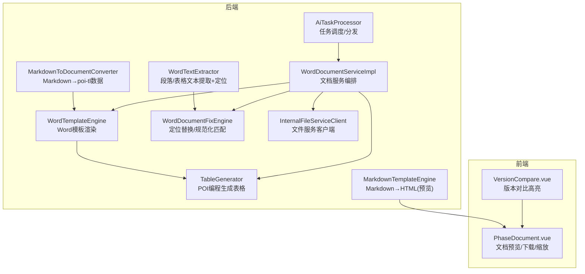
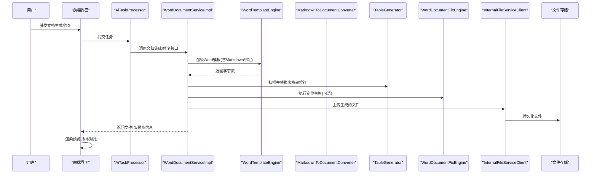
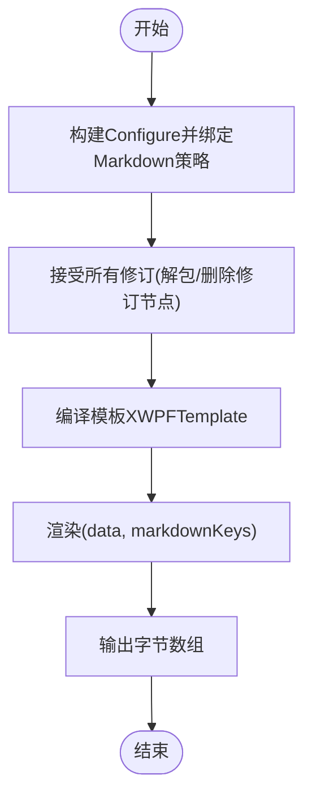
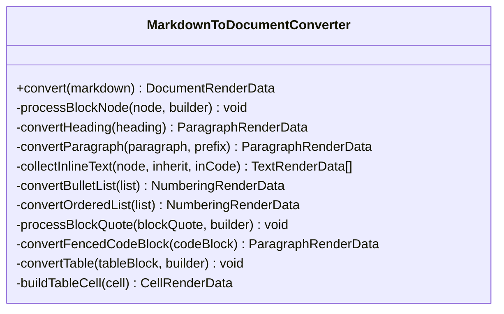
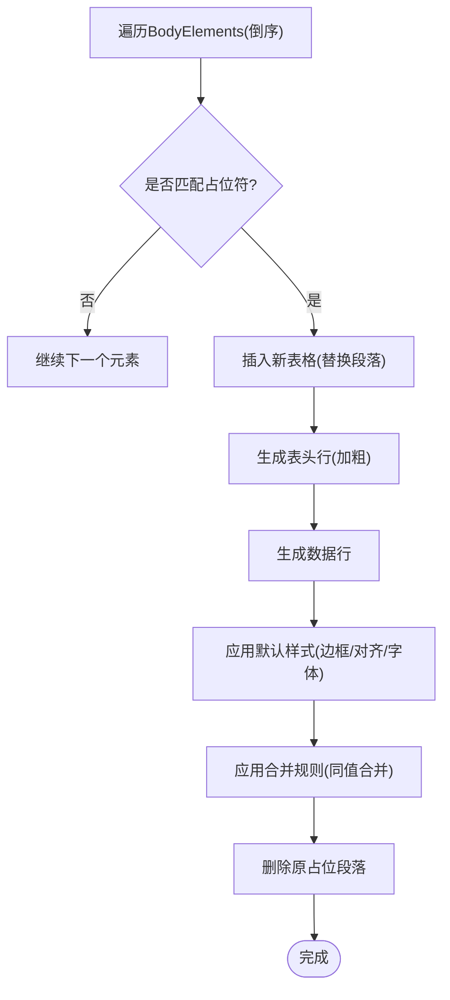
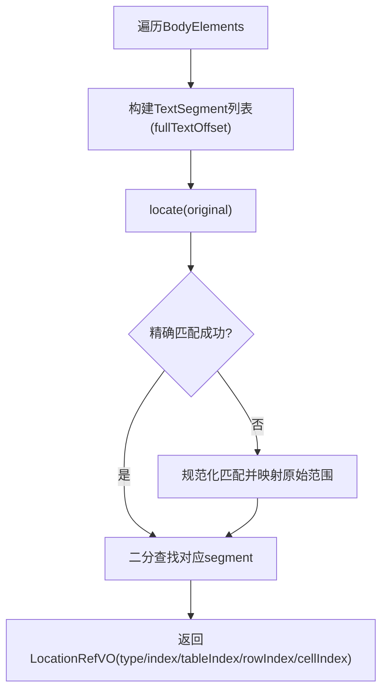
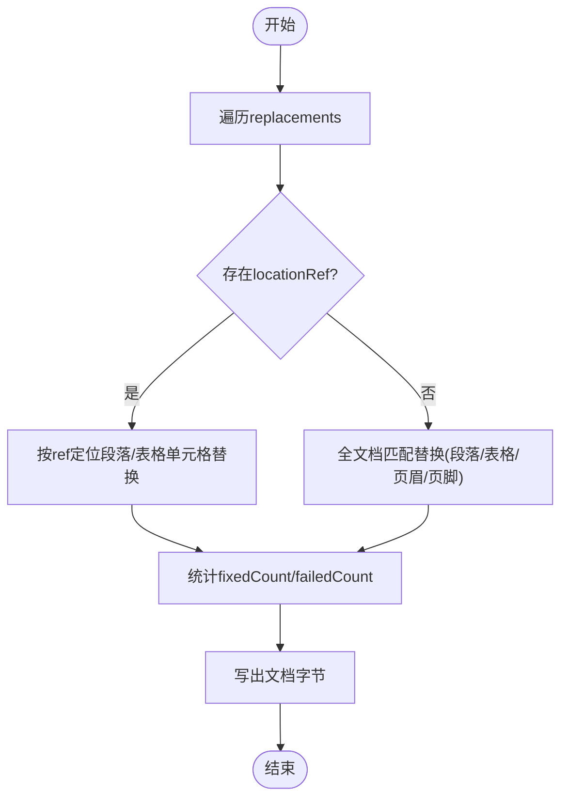
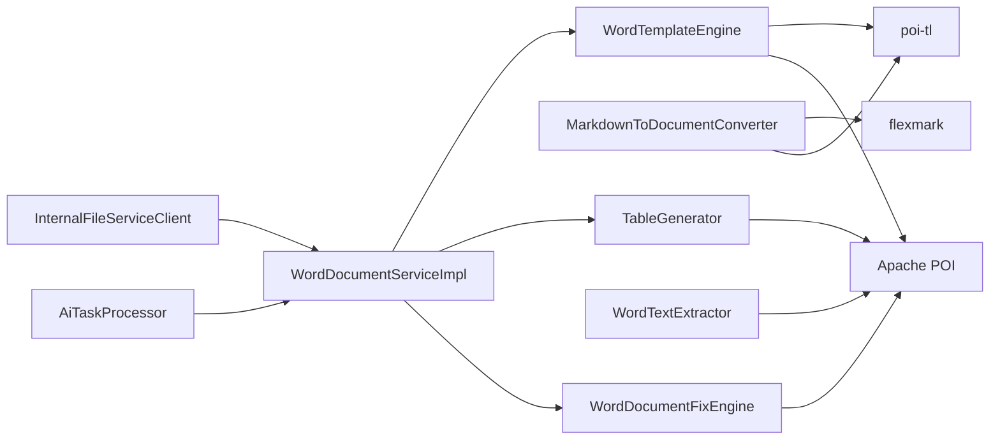

# 文档处理引擎

<cite>
**本文引用的文件**
- [WordTemplateEngine.java](file://ele-ai-tender-system/ele-ai-tender-file/src/main/java/com/jy/eleaitender/file/engine/WordTemplateEngine.java)
- [MarkdownToDocumentConverter.java](file://ele-ai-tender-system/ele-ai-tender-file/src/main/java/com/jy/eleaitender/file/engine/MarkdownToDocumentConverter.java)
- [TableGenerator.java](file://ele-ai-tender-system/ele-ai-tender-file/src/main/java/com/jy/eleaitender/file/engine/TableGenerator.java)
- [WordTextExtractor.java](file://ele-ai-tender-system/ele-ai-tender-file/src/main/java/com/jy/eleaitender/file/engine/WordTextExtractor.java)
- [WordDocumentFixEngine.java](file://ele-ai-tender-system/ele-ai-tender-file/src/main/java/com/jy/eleaitender/file/engine/WordDocumentFixEngine.java)
- [MarkdownTemplateEngine.java](file://ele-ai-tender-system/ele-ai-tender-core/src/main/java/com/jy/eleaitender/core/engine/MarkdownTemplateEngine.java)
- [WordDocumentServiceImpl.java](file://ele-ai-tender-system/ele-ai-tender-file/src/main/java/com/jy/eleaitender/file/service/impl/WordDocumentServiceImpl.java)
- [InternalFileServiceClient.java](file://ele-ai-tender-system/ele-ai-tender-common/src/main/java/com/jy/eleaitender/common/client/InternalFileServiceClient.java)
- [AiTaskProcessor.java](file://ele-ai-tender-system/ele-ai-tender-ai/src/main/java/com/jy/eleaitender/ai/processor/AiTaskProcessor.java)
- [VersionCompare.vue](file://ele-ai-tender-frontend/src/components/project/VersionCompare.vue)
- [PhaseDocument.vue](file://ele-ai-tender-frontend/src/views/project/phases/PhaseDocument.vue)
- [DocumentPreviewVO.java](file://ele-ai-tender-system/ele-ai-tender-core/src/main/java/com/jy/eleaitender/core/dto/response/DocumentPreviewVO.java)
- [FILE_SERVICE_SPEC.md](file://docs/rules/FILE_SERVICE_SPEC.md)
</cite>

## 目录
1. [引言](#引言)
2. [项目结构](#项目结构)
3. [核心组件](#核心组件)
4. [架构总览](#架构总览)
5. [详细组件分析](#详细组件分析)
6. [依赖关系分析](#依赖关系分析)
7. [性能与内存优化](#性能与内存优化)
8. [故障排查指南](#故障排查指南)
9. [结论](#结论)
10. [附录](#附录)

## 引言
本文件为“招标文件AI编制系统”的文档处理引擎提供全面技术文档。该引擎基于 Apache POI 与 poi-tl（POI-TL）实现多格式文档处理能力，覆盖 Word 模板渲染、Markdown 转换、表格生成与文本提取等核心功能；同时提供文档修复（定位替换）、版本对比高亮、在线预览与协作编辑支撑能力。文档还涵盖大文档处理的内存优化、流式处理与并发控制方案，以及错误恢复与监控告警配置建议。

## 项目结构
文档处理相关代码主要分布在以下模块：
- ele-ai-tender-file：文档处理引擎与服务（Word 模板、Markdown 转 Word、表格生成、文本提取、文档修复）
- ele-ai-tender-core：通用 Markdown 模板引擎（Markdown → HTML），用于前端预览与内容生成
- ele-ai-tender-ai：任务调度与编排（包含文档集成任务分发）
- ele-ai-tender-common：跨服务客户端与通用 DTO（如文件上传、解析响应）
- 前端：文档预览、版本对比、在线编辑交互

图表来源
- [WordTemplateEngine.java:1-121](file://ele-ai-tender-system/ele-ai-tender-file/src/main/java/com/jy/eleaitender/file/engine/WordTemplateEngine.java#L1-L121)
- [MarkdownToDocumentConverter.java:1-481](file://ele-ai-tender-system/ele-ai-tender-file/src/main/java/com/jy/eleaitender/file/engine/MarkdownToDocumentConverter.java#L1-L481)
- [TableGenerator.java:1-287](file://ele-ai-tender-system/ele-ai-tender-file/src/main/java/com/jy/eleaitender/file/engine/TableGenerator.java#L1-L287)
- [WordTextExtractor.java:1-202](file://ele-ai-tender-system/ele-ai-tender-file/src/main/java/com/jy/eleaitender/file/engine/WordTextExtractor.java#L1-L202)
- [WordDocumentFixEngine.java:1-252](file://ele-ai-tender-system/ele-ai-tender-file/src/main/java/com/jy/eleaitender/file/engine/WordDocumentFixEngine.java#L1-L252)
- [MarkdownTemplateEngine.java:1-82](file://ele-ai-tender-system/ele-ai-tender-core/src/main/java/com/jy/eleaitender/core/engine/MarkdownTemplateEngine.java#L1-L82)
- [WordDocumentServiceImpl.java:149-180](file://ele-ai-tender-system/ele-ai-tender-file/src/main/java/com/jy/eleaitender/file/service/impl/WordDocumentServiceImpl.java#L149-L180)
- [InternalFileServiceClient.java:326-361](file://ele-ai-tender-system/ele-ai-tender-common/src/main/java/com/jy/eleaitender/common/client/InternalFileServiceClient.java#L326-L361)
- [AiTaskProcessor.java:28-195](file://ele-ai-tender-system/ele-ai-tender-ai/src/main/java/com/jy/eleaitender/ai/processor/AiTaskProcessor.java#L28-L195)
- [PhaseDocument.vue:91-155](file://ele-ai-tender-frontend/src/views/project/phases/PhaseDocument.vue#L91-L155)
- [VersionCompare.vue:1-80](file://ele-ai-tender-frontend/src/components/project/VersionCompare.vue#L1-L80)

章节来源
- [WordTemplateEngine.java:1-121](file://ele-ai-tender-system/ele-ai-tender-file/src/main/java/com/jy/eleaitender/file/engine/WordTemplateEngine.java#L1-L121)
- [MarkdownToDocumentConverter.java:1-481](file://ele-ai-tender-system/ele-ai-tender-file/src/main/java/com/jy/eleaitender/file/engine/MarkdownToDocumentConverter.java#L1-L481)
- [TableGenerator.java:1-287](file://ele-ai-tender-system/ele-ai-tender-file/src/main/java/com/jy/eleaitender/file/engine/TableGenerator.java#L1-L287)
- [WordTextExtractor.java:1-202](file://ele-ai-tender-system/ele-ai-tender-file/src/main/java/com/jy/eleaitender/file/engine/WordTextExtractor.java#L1-L202)
- [WordDocumentFixEngine.java:1-252](file://ele-ai-tender-system/ele-ai-tender-file/src/main/java/com/jy/eleaitender/file/engine/WordDocumentFixEngine.java#L1-L252)
- [MarkdownTemplateEngine.java:1-82](file://ele-ai-tender-system/ele-ai-tender-core/src/main/java/com/jy/eleaitender/core/engine/MarkdownTemplateEngine.java#L1-L82)
- [WordDocumentServiceImpl.java:149-180](file://ele-ai-tender-system/ele-ai-tender-file/src/main/java/com/jy/eleaitender/file/service/impl/WordDocumentServiceImpl.java#L149-L180)
- [InternalFileServiceClient.java:326-361](file://ele-ai-tender-system/ele-ai-tender-common/src/main/java/com/jy/eleaitender/common/client/InternalFileServiceClient.java#L326-L361)
- [AiTaskProcessor.java:28-195](file://ele-ai-tender-system/ele-ai-tender-ai/src/main/java/com/jy/eleaitender/ai/processor/AiTaskProcessor.java#L28-L195)
- [PhaseDocument.vue:91-155](file://ele-ai-tender-frontend/src/views/project/phases/PhaseDocument.vue#L91-L155)
- [VersionCompare.vue:1-80](file://ele-ai-tender-frontend/src/components/project/VersionCompare.vue#L1-L80)

## 核心组件
- Word 模板引擎（WordTemplateEngine）
  - 使用 poi-tl 填充 Word 模板占位符，支持绑定 Markdown 渲染策略，自动接受修订标记以避免运行时异常。
- Markdown 转 Word 转换器（MarkdownToDocumentConverter）
  - 将 Markdown AST 转换为 poi-tl 的 DocumentRenderData，支持标题、段落、列表、引用、代码块、表格等元素映射与样式保持。
- 表格生成器（TableGenerator）
  - 通过 Apache POI API 直接创建表格，支持表头加粗、默认边框、单元格合并（按相同文本纵向合并）等。
- 文本提取器（WordTextExtractor）
  - 提取段落与表格单元格的文本并构建位置索引，供检测与定位替换使用。
- 文档修复引擎（WordDocumentFixEngine）
  - 基于 locationRef 优先定位替换，否则全文档匹配；采用两级匹配（精确与规范化空白忽略）确保鲁棒性。
- Markdown 模板引擎（MarkdownTemplateEngine）
  - 将 Markdown 转为 HTML，支持 {{key}} 变量替换，用于前端预览与内容生成。

章节来源
- [WordTemplateEngine.java:1-121](file://ele-ai-tender-system/ele-ai-tender-file/src/main/java/com/jy/eleaitender/file/engine/WordTemplateEngine.java#L1-L121)
- [MarkdownToDocumentConverter.java:1-481](file://ele-ai-tender-system/ele-ai-tender-file/src/main/java/com/jy/eleaitender/file/engine/MarkdownToDocumentConverter.java#L1-L481)
- [TableGenerator.java:1-287](file://ele-ai-tender-system/ele-ai-tender-file/src/main/java/com/jy/eleaitender/file/engine/TableGenerator.java#L1-L287)
- [WordTextExtractor.java:1-202](file://ele-ai-tender-system/ele-ai-tender-file/src/main/java/com/jy/eleaitender/file/engine/WordTextExtractor.java#L1-L202)
- [WordDocumentFixEngine.java:1-252](file://ele-ai-tender-system/ele-ai-tender-file/src/main/java/com/jy/eleaitender/file/engine/WordDocumentFixEngine.java#L1-L252)
- [MarkdownTemplateEngine.java:1-82](file://ele-ai-tender-system/ele-ai-tender-core/src/main/java/com/jy/eleaitender/core/engine/MarkdownTemplateEngine.java#L1-L82)

## 架构总览
文档处理链路从任务调度到最终输出，涉及模板渲染、Markdown 转换、表格生成、文本提取与修复、文件存储与前端预览。

图表来源
- [AiTaskProcessor.java:28-195](file://ele-ai-tender-system/ele-ai-tender-ai/src/main/java/com/jy/eleaitender/ai/processor/AiTaskProcessor.java#L28-L195)
- [WordDocumentServiceImpl.java:149-180](file://ele-ai-tender-system/ele-ai-tender-file/src/main/java/com/jy/eleaitender/file/service/impl/WordDocumentServiceImpl.java#L149-L180)
- [WordTemplateEngine.java:1-121](file://ele-ai-tender-system/ele-ai-tender-file/src/main/java/com/jy/eleaitender/file/engine/WordTemplateEngine.java#L1-L121)
- [MarkdownToDocumentConverter.java:1-481](file://ele-ai-tender-system/ele-ai-tender-file/src/main/java/com/jy/eleaitender/file/engine/MarkdownToDocumentConverter.java#L1-L481)
- [TableGenerator.java:1-287](file://ele-ai-tender-system/ele-ai-tender-file/src/main/java/com/jy/eleaitender/file/engine/TableGenerator.java#L1-L287)
- [WordDocumentFixEngine.java:1-252](file://ele-ai-tender-system/ele-ai-tender-file/src/main/java/com/jy/eleaitender/file/engine/WordDocumentFixEngine.java#L1-L252)
- [InternalFileServiceClient.java:326-361](file://ele-ai-tender-system/ele-ai-tender-common/src/main/java/com/jy/eleaitender/common/client/InternalFileServiceClient.java#L326-L361)

## 详细组件分析

### Word 模板引擎（WordTemplateEngine）
- 职责
  - 使用 poi-tl 编译并渲染 Word 模板，支持将指定 key 绑定为 Markdown 渲染策略。
  - 在渲染前“接受所有修订”，避免 <w:ins>/<w:del> 等修订标记导致 poi-tl 运行期异常。
- 关键流程
  - 构建 Configure 并绑定 Markdown 策略
  - 清理修订标记（解包 ins/moveTo，删除 del/moveFrom/rPrChange/pPrChange/tblPrChange 等）
  - 编译模板并渲染，输出字节数组
- 兼容性
  - 兼容 WPS/Word 编辑产生的修订标记，提升稳定性。

图表来源
- [WordTemplateEngine.java:1-121](file://ele-ai-tender-system/ele-ai-tender-file/src/main/java/com/jy/eleaitender/file/engine/WordTemplateEngine.java#L1-L121)

章节来源
- [WordTemplateEngine.java:1-121](file://ele-ai-tender-system/ele-ai-tender-file/src/main/java/com/jy/eleaitender/file/engine/WordTemplateEngine.java#L1-L121)

### Markdown 转 Word 转换器（MarkdownToDocumentConverter）
- 职责
  - 将 Markdown AST 转换为 poi-tl 的 DocumentRenderData，以在 Word 中正确渲染。
- 支持元素
  - 标题（各级字号映射、加粗）、段落（行内格式继承）、无序/有序列表、引用（带前缀）、代码块（等宽字体）、表格（表头加粗、列对齐补齐）。
- 样式策略
  - 默认字体“宋体”，正文字号 10.5pt，代码字体 Courier New。
  - 标题字号随级别递减，统一加粗。
  - 表格列数不一致时按最大列数补齐空单元格，避免 poi-tl 抛异常。

图表来源
- [MarkdownToDocumentConverter.java:1-481](file://ele-ai-tender-system/ele-ai-tender-file/src/main/java/com/jy/eleaitender/file/engine/MarkdownToDocumentConverter.java#L1-L481)

章节来源
- [MarkdownToDocumentConverter.java:1-481](file://ele-ai-tender-system/ele-ai-tender-file/src/main/java/com/jy/eleaitender/file/engine/MarkdownToDocumentConverter.java#L1-L481)

### 表格生成器（TableGenerator）
- 职责
  - 扫描文档中的表格占位符段落，替换为用 POI 创建的表格。
- 特性
  - 表头行加粗、默认边框、垂直居中、左对齐正文、表头居中。
  - 支持按相同文本纵向合并单元格（BY_SAME_TEXT）。
  - 使用 XmlCursor 精准插入表格，避免索引偏移问题。
- 占位符规则
  - 段落文本包含 "__TABLE_PLACEHOLDER__{key}" 或仅前缀后跟 key。

图表来源
- [TableGenerator.java:1-287](file://ele-ai-tender-system/ele-ai-tender-file/src/main/java/com/jy/eleaitender/file/engine/TableGenerator.java#L1-L287)

章节来源
- [TableGenerator.java:1-287](file://ele-ai-tender-system/ele-ai-tender-file/src/main/java/com/jy/eleaitender/file/engine/TableGenerator.java#L1-L287)

### 文本提取器（WordTextExtractor）
- 职责
  - 提取段落与表格单元格的文本，构建全局 fullText 与各段落的起始偏移量，便于后续定位。
- 定位算法
  - 先精确匹配，再规范化匹配（忽略空白字符），通过 normToRaw 映射还原实际子串范围。
  - 二分查找 segments 根据偏移量确定目标段落/表格单元格。

图表来源
- [WordTextExtractor.java:1-202](file://ele-ai-tender-system/ele-ai-tender-file/src/main/java/com/jy/eleaitender/file/engine/WordTextExtractor.java#L1-L202)

章节来源
- [WordTextExtractor.java:1-202](file://ele-ai-tender-system/ele-ai-tender-file/src/main/java/com/jy/eleaitender/file/engine/WordTextExtractor.java#L1-L202)

### 文档修复引擎（WordDocumentFixEngine）
- 职责
  - 对 Word 文档执行文本替换，优先使用 locationRef 定位，否则全文档匹配。
- 匹配策略
  - Level 1：精确匹配
  - Level 2：规范化匹配（移除空白后匹配，还原实际子串范围）
- 替换实现
  - 清空段落所有 Run，将替换后的文本写入第一个 Run，保证样式最小侵入。

图表来源
- [WordDocumentFixEngine.java:1-252](file://ele-ai-tender-system/ele-ai-tender-file/src/main/java/com/jy/eleaitender/file/engine/WordDocumentFixEngine.java#L1-L252)

章节来源
- [WordDocumentFixEngine.java:1-252](file://ele-ai-tender-system/ele-ai-tender-file/src/main/java/com/jy/eleaitender/file/engine/WordDocumentFixEngine.java#L1-L252)

### Markdown 模板引擎（MarkdownTemplateEngine）
- 职责
  - 将 Markdown 转为 HTML，支持 {{key}} 变量替换，用于前端预览与内容生成。
- 适用场景
  - 快速预览、在线编辑时的实时渲染。

章节来源
- [MarkdownTemplateEngine.java:1-82](file://ele-ai-tender-system/ele-ai-tender-core/src/main/java/com/jy/eleaitender/core/engine/MarkdownTemplateEngine.java#L1-L82)

### 文档服务编排（WordDocumentServiceImpl）
- 职责
  - 组装 FillData、调用修复引擎、生成文件名、上传文件等。
- 关键点
  - 读取本地文件路径，调用修复引擎得到字节数组，命名策略保留原名并去除历史前缀后拼接时间戳。

章节来源
- [WordDocumentServiceImpl.java:149-180](file://ele-ai-tender-system/ele-ai-tender-file/src/main/java/com/jy/eleaitender/file/service/impl/WordDocumentServiceImpl.java#L149-L180)

### 文件服务客户端（InternalFileServiceClient）
- 职责
  - 解析生成文件 ID 响应、解析修复结果响应、封装 NamedByteArrayResource 以便设置文件名。
- 关键点
  - 统一的 Result<T> 反序列化封装，失败抛出运行时异常。

章节来源
- [InternalFileServiceClient.java:326-361](file://ele-ai-tender-system/ele-ai-tender-common/src/main/java/com/jy/eleaitender/common/client/InternalFileServiceClient.java#L326-L361)

### 任务调度与分发（AiTaskProcessor）
- 职责
  - 定时轮询待处理任务，按类型分发至具体处理器（包括文档集成、检测等）。
- 并发控制
  - 结合线程池管理与用户并发限制，保障系统稳定。

章节来源
- [AiTaskProcessor.java:28-195](file://ele-ai-tender-system/ele-ai-tender-ai/src/main/java/com/jy/eleaitender/ai/processor/AiTaskProcessor.java#L28-L195)

### 前端预览与版本对比
- 文档预览（PhaseDocument.vue）
  - 提供缩放、下载、预览区域渲染 DocxPreview 组件。
- 版本对比（VersionCompare.vue）
  - 选择两个版本进行对比，展示新增/修改/删除的高亮差异。

章节来源
- [PhaseDocument.vue:91-155](file://ele-ai-tender-frontend/src/views/project/phases/PhaseDocument.vue#L91-L155)
- [VersionCompare.vue:1-80](file://ele-ai-tender-frontend/src/components/project/VersionCompare.vue#L1-L80)

## 依赖关系分析
- 组件耦合
  - WordTemplateEngine 依赖 poi-tl 与 Apache POI，负责模板渲染与修订清理。
  - MarkdownToDocumentConverter 依赖 flexmark 与 poi-tl 数据模型，负责 Markdown 到 Word 渲染数据的映射。
  - TableGenerator 直接操作 Apache POI 底层对象，绕过 poi-tl 循环标签限制，增强表格生成灵活性。
  - WordTextExtractor 与 WordDocumentFixEngine 共享 TextNormalizeUtil 的规范化逻辑，确保定位与替换一致性。
  - WordDocumentServiceImpl 作为编排层，串联模板渲染、表格生成、修复与文件上传。
  - InternalFileServiceClient 提供跨服务文件访问能力。
  - AiTaskProcessor 驱动文档集成任务，协调各组件工作。

图表来源
- [WordTemplateEngine.java:1-121](file://ele-ai-tender-system/ele-ai-tender-file/src/main/java/com/jy/eleaitender/file/engine/WordTemplateEngine.java#L1-L121)
- [MarkdownToDocumentConverter.java:1-481](file://ele-ai-tender-system/ele-ai-tender-file/src/main/java/com/jy/eleaitender/file/engine/MarkdownToDocumentConverter.java#L1-L481)
- [TableGenerator.java:1-287](file://ele-ai-tender-system/ele-ai-tender-file/src/main/java/com/jy/eleaitender/file/engine/TableGenerator.java#L1-L287)
- [WordTextExtractor.java:1-202](file://ele-ai-tender-system/ele-ai-tender-file/src/main/java/com/jy/eleaitender/file/engine/WordTextExtractor.java#L1-L202)
- [WordDocumentFixEngine.java:1-252](file://ele-ai-tender-system/ele-ai-tender-file/src/main/java/com/jy/eleaitender/file/engine/WordDocumentFixEngine.java#L1-L252)
- [WordDocumentServiceImpl.java:149-180](file://ele-ai-tender-system/ele-ai-tender-file/src/main/java/com/jy/eleaitender/file/service/impl/WordDocumentServiceImpl.java#L149-L180)
- [InternalFileServiceClient.java:326-361](file://ele-ai-tender-system/ele-ai-tender-common/src/main/java/com/jy/eleaitender/common/client/InternalFileServiceClient.java#L326-L361)
- [AiTaskProcessor.java:28-195](file://ele-ai-tender-system/ele-ai-tender-ai/src/main/java/com/jy/eleaitender/ai/processor/AiTaskProcessor.java#L28-L195)

## 性能与内存优化
- 大文档处理
  - 使用 try-with-resources 管理 XWPFDocument 与 ByteArrayOutputStream，减少内存泄漏风险。
  - 表格生成采用 XmlCursor 精准插入，避免全量重建文档带来的开销。
- 流式处理
  - 模板渲染与文件写入采用流式 IO，避免一次性加载大文档到内存。
- 并发控制
  - 任务调度结合线程池管理与用户并发上限，防止资源争用与 OOM。
- 预览与渲染
  - 前端按需缩放与懒加载，降低浏览器渲染压力。
- 建议
  - 针对超大文档可考虑分块处理（段落级/表格级），结合异步任务与断点续传。
  - 启用连接池与缓存（如模板编译缓存）以提升重复渲染性能。

[本节为通用指导，不直接分析具体文件]

## 故障排查指南
- 文件上传失败
  - 检查扩展名白名单、文件大小限制、存储目录权限。
- 下载 404
  - 确认 file_info.file_path 与实际磁盘一致，检查 base-path 配置。
- fileSha256 校验失败
  - 确认调用方与服务端计算方式一致（UTF-8 字节序列，十六进制字符串）。
- locationRef 定位失败
  - 检查 elementIndex 越界、WordTextExtractor 是否已执行、DetectionResultParser.fillLocationRefs() 日志是否报匹配失败。
- 检测修复替换了错误位置
  - 检查 FixReplacement.locationRef 是否为空（为空走全文档替换会替换所有匹配项）、elementIndex 对应的 IBodyElement 类型是否与 type 字段一致。

章节来源
- [FILE_SERVICE_SPEC.md:139-153](file://docs/rules/FILE_SERVICE_SPEC.md#L139-L153)

## 结论
本引擎围绕 Apache POI 与 poi-tl 构建了稳健的文档处理能力，覆盖模板渲染、Markdown 转换、表格生成、文本提取与修复等关键环节。通过规范化匹配与修订清理机制提升了兼容性，借助任务调度与并发控制保障了系统稳定性。前端提供了预览与版本对比能力，形成端到端的文档处理闭环。未来可在分块处理、缓存与监控告警方面进一步演进，以满足更大规模与更高可用性的需求。

## 附录
- 文档预览 VO（DocumentPreviewVO）
  - 包含项目信息、HTML 预览内容、Markdown 原始内容、是否已集成、生成的 Word 文件 ID 等字段，用于前后端对接预览。

章节来源
- [DocumentPreviewVO.java:1-30](file://ele-ai-tender-system/ele-ai-tender-core/src/main/java/com/jy/eleaitender/core/dto/response/DocumentPreviewVO.java#L1-L30)