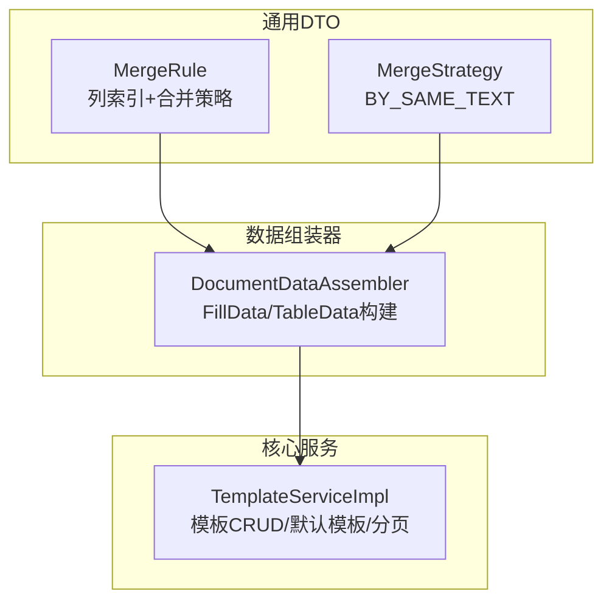
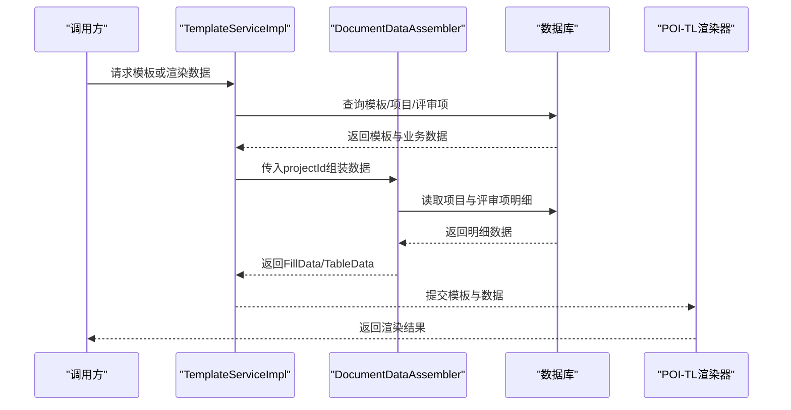
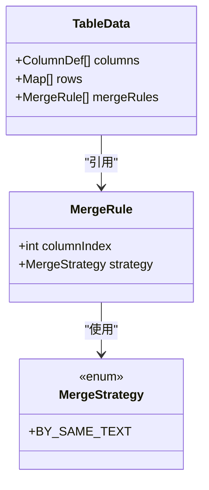
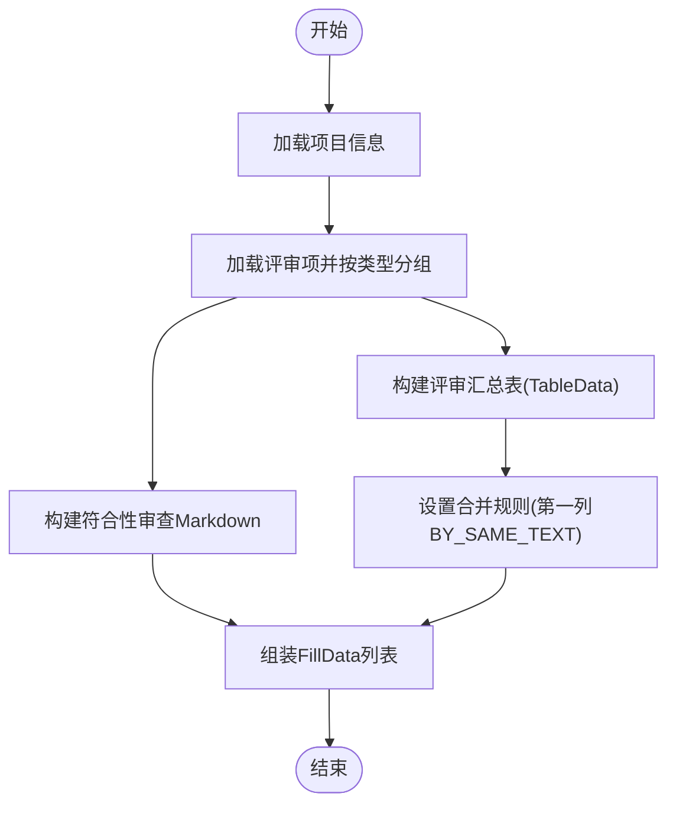
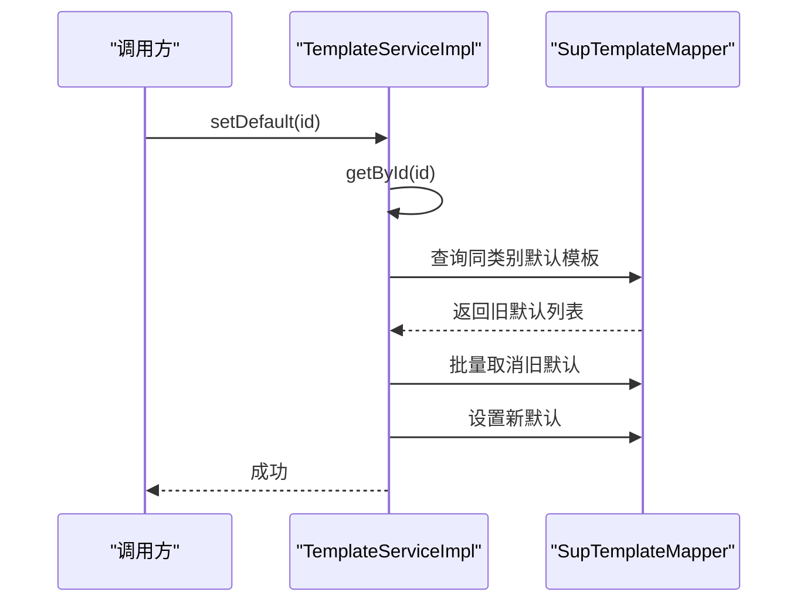
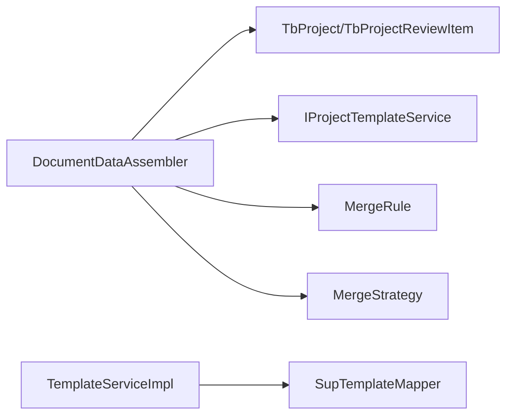

# 文档模板引擎

<cite>
**本文引用的文件**   
- [MergeRule.java](file://ele-ai-tender-system/ele-ai-tender-common/src/main/java/com/jy/eleaitender/common/dto/MergeRule.java)
- [MergeStrategy.java](file://ele-ai-tender-system/ele-ai-tender-common/src/main/java/com/jy/eleaitender/common/dto/MergeStrategy.java)
- [DocumentDataAssembler.java](file://ele-ai-tender-system/ele-ai-tender-core/src/main/java/com/jy/eleaitender/core/engine/DocumentDataAssembler.java)
- [TemplateServiceImpl.java](file://ele-ai-tender-system/ele-ai-tender-core/src/main/java/com/jy/eleaitender/core/service/impl/TemplateServiceImpl.java)
</cite>

## 目录
1. [简介](#简介)
2. [项目结构](#项目结构)
3. [核心组件](#核心组件)
4. [架构总览](#架构总览)
5. [详细组件分析](#详细组件分析)
6. [依赖分析](#依赖分析)
7. [性能考虑](#性能考虑)
8. [故障排查指南](#故障排查指南)
9. [结论](#结论)
10. [附录](#附录)

## 简介
本技术文档围绕“文档模板引擎”展开，聚焦于基于 POI-TL 的模板渲染机制与数据合并逻辑。文档重点说明：
- 模板语法定义、变量替换、条件渲染、循环遍历等高级功能的使用方式与最佳实践
- MergeRule 与 MergeStrategy 的数据合并策略（字段映射、类型转换、默认值处理、冲突解决）
- 模板文件的组织结构（主模板、子模板、片段复用、模块化设计）
- 动态内容生成机制（AI 生成内容插入、实时数据绑定、异步加载与缓存策略）
- 模板调试工具、预览功能与版本管理方案
- 模板性能优化、内存管理与错误处理的最佳实践

## 项目结构
本项目采用多模块分层组织，模板相关能力主要分布在以下位置：
- 通用 DTO 层：定义表格合并规则与策略（MergeRule、MergeStrategy）
- 核心服务层：提供模板 CRUD、默认模板选择、分页查询等能力（TemplateServiceImpl）
- 数据组装器：将业务实体转换为模板渲染所需的 FillData、TableData 等结构化数据（DocumentDataAssembler）

图表来源
- [MergeRule.java:1-24](file://ele-ai-tender-system/ele-ai-tender-common/src/main/java/com/jy/eleaitender/common/dto/MergeRule.java#L1-L24)
- [MergeStrategy.java:1-11](file://ele-ai-tender-system/ele-ai-tender-common/src/main/java/com/jy/eleaitender/common/dto/MergeStrategy.java#L1-L11)
- [DocumentDataAssembler.java:1-267](file://ele-ai-tender-system/ele-ai-tender-core/src/main/java/com/jy/eleaitender/core/engine/DocumentDataAssembler.java#L1-L267)
- [TemplateServiceImpl.java:1-125](file://ele-ai-tender-system/ele-ai-tender-core/src/main/java/com/jy/eleaitender/core/service/impl/TemplateServiceImpl.java#L1-L125)

章节来源
- [MergeRule.java:1-24](file://ele-ai-tender-system/ele-ai-tender-common/src/main/java/com/jy/eleaitender/common/dto/MergeRule.java#L1-L24)
- [MergeStrategy.java:1-11](file://ele-ai-tender-system/ele-ai-tender-common/src/main/java/com/jy/eleaitender/common/dto/MergeStrategy.java#L1-L11)
- [DocumentDataAssembler.java:1-267](file://ele-ai-tender-system/ele-ai-tender-core/src/main/java/com/jy/eleaitender/core/engine/DocumentDataAssembler.java#L1-L267)
- [TemplateServiceImpl.java:1-125](file://ele-ai-tender-system/ele-ai-tender-core/src/main/java/com/jy/eleaitender/core/service/impl/TemplateServiceImpl.java#L1-L125)

## 核心组件
- MergeRule：描述表格某列的合并规则，包含列索引与合并策略
- MergeStrategy：当前实现为按相同文本相邻合并（BY_SAME_TEXT）
- DocumentDataAssembler：负责从项目与评审项数据中组装 FillData 列表与 TableData，并配置 MergeRule
- TemplateServiceImpl：提供模板实体的分页、默认模板选择、创建/更新/删除与设置默认模板等能力

章节来源
- [MergeRule.java:1-24](file://ele-ai-tender-system/ele-ai-tender-common/src/main/java/com/jy/eleaitender/common/dto/MergeRule.java#L1-L24)
- [MergeStrategy.java:1-11](file://ele-ai-tender-system/ele-ai-tender-common/src/main/java/com/jy/eleaitender/common/dto/MergeStrategy.java#L1-L11)
- [DocumentDataAssembler.java:1-267](file://ele-ai-tender-system/ele-ai-tender-core/src/main/java/com/jy/eleaitender/core/engine/DocumentDataAssembler.java#L1-267)
- [TemplateServiceImpl.java:1-125](file://ele-ai-tender-system/ele-ai-tender-core/src/main/java/com/jy/eleaitender/core/service/impl/TemplateServiceImpl.java#L1-125)

## 架构总览
下图展示了模板渲染的关键流程：从模板服务获取模板信息，到数据组装器产出 FillData/TableData，再到 POI-TL 进行渲染输出。

图表来源
- [TemplateServiceImpl.java:1-125](file://ele-ai-tender-system/ele-ai-tender-core/src/main/java/com/jy/eleaitender/core/service/impl/TemplateServiceImpl.java#L1-125)
- [DocumentDataAssembler.java:1-267](file://ele-ai-tender-system/ele-ai-tender-core/src/main/java/com/jy/eleaitender/core/engine/DocumentDataAssembler.java#L1-267)

## 详细组件分析

### 组件A：MergeRule 与 MergeStrategy（表格单元格合并）
- MergeRule 指定要合并的列索引（0-based）以及对应的 MergeStrategy
- MergeStrategy 当前仅支持 BY_SAME_TEXT，即对相邻且文本相同的单元格进行合并
- 在 DocumentDataAssembler 中，通过 TableData.setMergeRules 配置第一列（类别名）的合并规则，使同类别下的行自动合并

图表来源
- [MergeRule.java:1-24](file://ele-ai-tender-system/ele-ai-tender-common/src/main/java/com/jy/eleaitender/common/dto/MergeRule.java#L1-L24)
- [MergeStrategy.java:1-11](file://ele-ai-tender-system/ele-ai-tender-common/src/main/java/com/jy/eleaitender/common/dto/MergeStrategy.java#L1-L11)
- [DocumentDataAssembler.java:106-121](file://ele-ai-tender-system/ele-ai-tender-core/src/main/java/com/jy/eleaitender/core/engine/DocumentDataAssembler.java#L106-L121)

章节来源
- [MergeRule.java:1-24](file://ele-ai-tender-system/ele-ai-tender-common/src/main/java/com/jy/eleaitender/common/dto/MergeRule.java#L1-L24)
- [MergeStrategy.java:1-11](file://ele-ai-tender-system/ele-ai-tender-common/src/main/java/com/jy/eleaitender/common/dto/MergeStrategy.java#L1-L11)
- [DocumentDataAssembler.java:106-121](file://ele-ai-tender-system/ele-ai-tender-core/src/main/java/com/jy/eleaitender/core/engine/DocumentDataAssembler.java#L106-L121)

### 组件B：DocumentDataAssembler（数据组装与合并规则应用）
- 职责
  - 根据 projectId 聚合项目基础信息与评审项数据
  - 构造 FillData 列表（文本、Markdown、表格等）
  - 构建 TableData 并配置 MergeRule，实现类别列的相邻相同文本合并
- 关键流程
  - 读取项目与评审项
  - 按评审类型分组（资信标、技术标、商务标）
  - 生成符合性审查 Markdown 与评审汇总表
  - 为汇总表设置合并规则（第一列按相同文本合并）

图表来源
- [DocumentDataAssembler.java:47-99](file://ele-ai-tender-system/ele-ai-tender-core/src/main/java/com/jy/eleaitender/core/engine/DocumentDataAssembler.java#L47-L99)
- [DocumentDataAssembler.java:106-121](file://ele-ai-tender-system/ele-ai-tender-core/src/main/java/com/jy/eleaitender/core/engine/DocumentDataAssembler.java#L106-L121)
- [DocumentDataAssembler.java:132-166](file://ele-ai-tender-system/ele-ai-tender-core/src/main/java/com/jy/eleaitender/core/engine/DocumentDataAssembler.java#L132-L166)

章节来源
- [DocumentDataAssembler.java:47-99](file://ele-ai-tender-system/ele-ai-tender-core/src/main/java/com/jy/eleaitender/core/engine/DocumentDataAssembler.java#L47-L99)
- [DocumentDataAssembler.java:106-121](file://ele-ai-tender-system/ele-ai-tender-core/src/main/java/com/jy/eleaitender/core/engine/DocumentDataAssembler.java#L106-L121)
- [DocumentDataAssembler.java:132-166](file://ele-ai-tender-system/ele-ai-tender-core/src/main/java/com/jy/eleaitender/core/engine/DocumentDataAssembler.java#L132-L166)

### 组件C：TemplateServiceImpl（模板生命周期管理）
- 职责
  - 模板分页查询（支持名称、项目类别筛选）
  - 根据ID获取模板（不存在时抛出业务异常）
  - 获取默认模板（可按项目类别过滤）
  - 创建/更新/删除模板
  - 设置默认模板（同项目类别下仅保留一个默认）
- 关键点
  - 默认版本号与状态初始化
  - 事务保护确保一致性
  - 参数校验与异常处理

图表来源
- [TemplateServiceImpl.java:102-123](file://ele-ai-tender-system/ele-ai-tender-core/src/main/java/com/jy/eleaitender/core/service/impl/TemplateServiceImpl.java#L102-L123)
- [TemplateServiceImpl.java:43-49](file://ele-ai-tender-system/ele-ai-tender-core/src/main/java/com/jy/eleaitender/core/service/impl/TemplateServiceImpl.java#L43-L49)

章节来源
- [TemplateServiceImpl.java:27-40](file://ele-ai-tender-system/ele-ai-tender-core/src/main/java/com/jy/eleaitender/core/service/impl/TemplateServiceImpl.java#L27-L40)
- [TemplateServiceImpl.java:43-49](file://ele-ai-tender-system/ele-ai-tender-core/src/main/java/com/jy/eleaitender/core/service/impl/TemplateServiceImpl.java#L43-L49)
- [TemplateServiceImpl.java:52-61](file://ele-ai-tender-system/ele-ai-tender-core/src/main/java/com/jy/eleaitender/core/service/impl/TemplateServiceImpl.java#L52-L61)
- [TemplateServiceImpl.java:64-79](file://ele-ai-tender-system/ele-ai-tender-core/src/main/java/com/jy/eleaitender/core/service/impl/TemplateServiceImpl.java#L64-L79)
- [TemplateServiceImpl.java:82-87](file://ele-ai-tender-system/ele-ai-tender-core/src/main/java/com/jy/eleaitender/core/service/impl/TemplateServiceImpl.java#L82-L87)
- [TemplateServiceImpl.java:90-98](file://ele-ai-tender-system/ele-ai-tender-core/src/main/java/com/jy/eleaitender/core/service/impl/TemplateServiceImpl.java#L90-L98)
- [TemplateServiceImpl.java:102-123](file://ele-ai-tender-system/ele-ai-tender-core/src/main/java/com/jy/eleaitender/core/service/impl/TemplateServiceImpl.java#L102-L123)

## 依赖分析
- 组件耦合
  - DocumentDataAssembler 依赖项目与评审项数据源，并通过 ReviewConfig 控制表格列展示与权重模式
  - TemplateServiceImpl 依赖 SupTemplateMapper 完成模板数据的持久化操作
- 外部依赖
  - 数据访问层（MyBatis Plus）
  - 日志（Slf4j）
  - 业务异常（BusinessException）

图表来源
- [DocumentDataAssembler.java:1-267](file://ele-ai-tender-system/ele-ai-tender-core/src/main/java/com/jy/eleaitender/core/engine/DocumentDataAssembler.java#L1-L267)
- [TemplateServiceImpl.java:1-125](file://ele-ai-tender-system/ele-ai-tender-core/src/main/java/com/jy/eleaitender/core/service/impl/TemplateServiceImpl.java#L1-L125)

章节来源
- [DocumentDataAssembler.java:1-267](file://ele-ai-tender-system/ele-ai-tender-core/src/main/java/com/jy/eleaitender/core/engine/DocumentDataAssembler.java#L1-L267)
- [TemplateServiceImpl.java:1-125](file://ele-ai-tender-system/ele-ai-tender-core/src/main/java/com/jy/eleaitender/core/service/impl/TemplateServiceImpl.java#L1-L125)

## 性能考虑
- 数据组装阶段
  - 避免重复查询：尽量在一次会话内复用已加载的项目与评审项数据
  - 合理分组与排序：使用有序 Map 保持顺序，减少后续排序开销
  - 大表合并：当行数较多时，优先在数据层预聚合，再交由渲染层合并
- 渲染阶段（POI-TL）
  - 控制表格规模：避免一次性渲染超大表格，必要时分页或分块
  - 图片与富文本：按需加载，避免阻塞渲染线程
- 缓存策略
  - 模板元数据与默认模板可缓存（如 Redis），降低频繁查询
  - 评审项汇总数据可按项目维度短期缓存，提升重复渲染性能

[本节为通用指导，不直接分析具体文件]

## 故障排查指南
- 模板未找到
  - 现象：根据ID获取模板时报错
  - 定位：检查 TemplateServiceImpl.getById 的异常抛出路径
- 默认模板冲突
  - 现象：设置默认模板后仍有多个默认
  - 定位：检查 TemplateServiceImpl.setDefault 的事务与批量更新逻辑
- 表格合并异常
  - 现象：类别列未按预期合并
  - 定位：确认 TableData.mergeRules 是否配置了第一列的 BY_SAME_TEXT 策略，并确保数据顺序正确

章节来源
- [TemplateServiceImpl.java:43-49](file://ele-ai-tender-system/ele-ai-tender-core/src/main/java/com/jy/eleaitender/core/service/impl/TemplateServiceImpl.java#L43-L49)
- [TemplateServiceImpl.java:102-123](file://ele-ai-tender-system/ele-ai-tender-core/src/main/java/com/jy/eleaitender/core/service/impl/TemplateServiceImpl.java#L102-L123)
- [DocumentDataAssembler.java:106-121](file://ele-ai-tender-system/ele-ai-tender-core/src/main/java/com/jy/eleaitender/core/engine/DocumentDataAssembler.java#L106-L121)

## 结论
本模板引擎以清晰的分层与职责划分为基础，通过 MergeRule/MergeStrategy 实现灵活的表格合并，借助 DocumentDataAssembler 将复杂业务数据转化为模板友好的 FillData/TableData，并由 TemplateServiceImpl 提供完善的模板生命周期管理能力。结合合理的缓存与渲染优化策略，可在保证可读性与可维护性的同时，满足高性能与高可用的生产需求。

[本节为总结性内容，不直接分析具体文件]

## 附录

### 模板语法与高级功能（概念性说明）
- 变量替换
  - 使用占位符在模板中标记变量位置，由 FillData 中的键值对进行替换
- 条件渲染
  - 基于布尔字段或空值判断，控制段落或表格区域的显示/隐藏
- 循环遍历
  - 针对 List<Map<String,String>> 类型的表格数据进行逐行渲染
- 子模板与片段复用
  - 将常用区块抽离为子模板，在主模板中引入，提高复用率与维护性
- 模块化设计
  - 按业务域拆分模板（如资信标、技术标、商务标），通过组合形成完整文档

[本节为概念性说明，不直接分析具体文件]

### 动态内容生成机制（概念性说明）
- AI 生成内容插入
  - 在数据组装阶段预留占位字段，待 AI 任务完成后回填
- 实时数据绑定
  - 前端轮询或 WebSocket 推送，驱动后端增量刷新 FillData
- 异步加载与缓存
  - 对耗时计算与远程调用采用异步执行与短期缓存，降低首屏渲染延迟

[本节为概念性说明，不直接分析具体文件]

### 模板调试与预览（概念性说明）
- 调试工具
  - 提供模板解析日志、变量注入快照、渲染中间产物导出
- 预览功能
  - 在线预览生成的 Word/PDF，支持差异对比与回滚
- 版本管理
  - 模板版本化存储，支持按项目类别切换默认模板，保留历史版本

[本节为概念性说明，不直接分析具体文件]