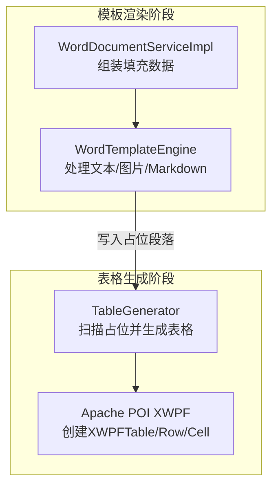
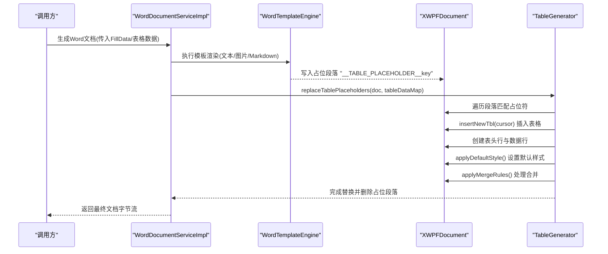
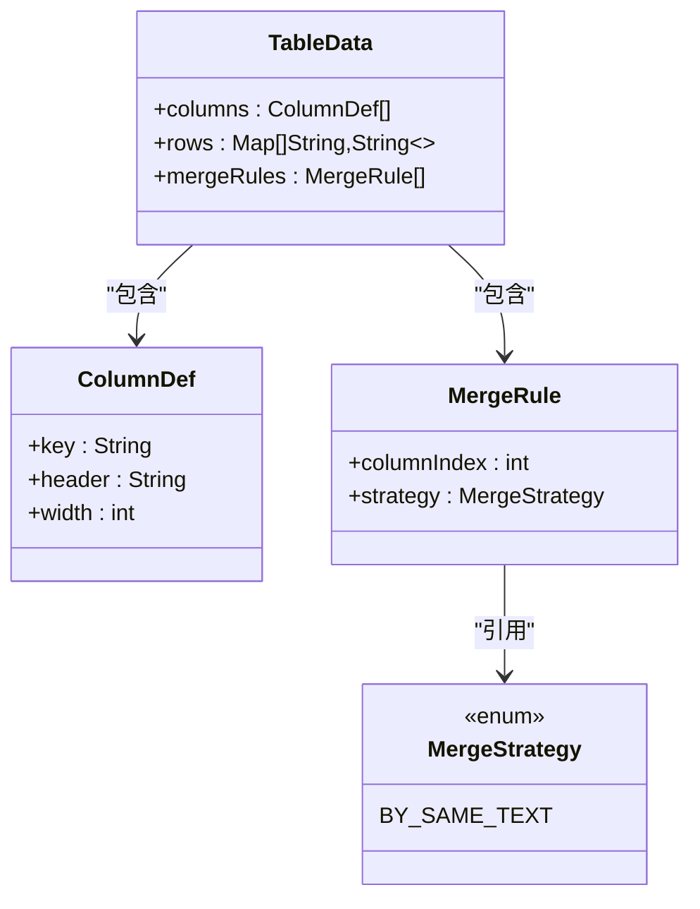
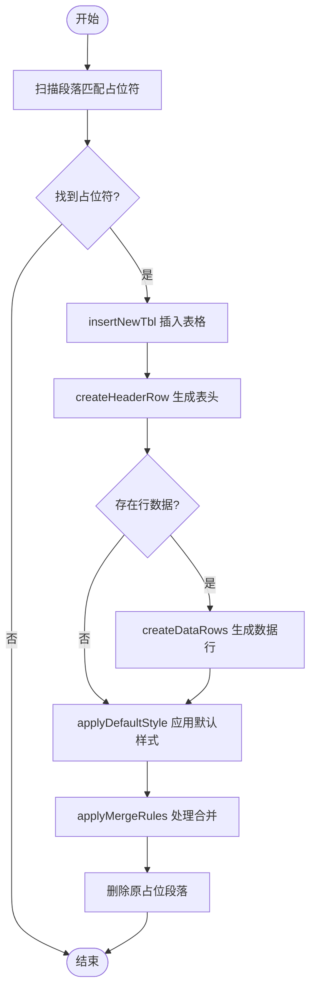
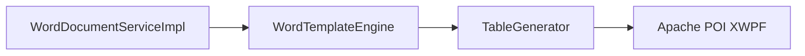

# 表格生成器

<cite>
**本文引用的文件**   
- [TableGenerator.java](file://ele-ai-tender-system/ele-ai-tender-file/src/main/java/com/jy/eleaitender/file/engine/TableGenerator.java)
- [TableData.java](file://ele-ai-tender-system/ele-ai-tender-common/src/main/java/com/jy/eleaitender/common/dto/TableData.java)
- [ColumnDef.java](file://ele-ai-tender-system/ele-ai-tender-common/src/main/java/com/jy/eleaitender/common/dto/ColumnDef.java)
- [MergeRule.java](file://ele-ai-tender-system/ele-ai-tender-common/src/main/java/com/jy/eleaitender/common/dto/MergeRule.java)
- [MergeStrategy.java](file://ele-ai-tender-system/ele-ai-tender-common/src/main/java/com/jy/eleaitender/common/dto/MergeStrategy.java)
- [WordDocumentServiceImpl.java](file://ele-ai-tender-system/ele-ai-tender-file/src/main/java/com/jy/eleaitender/file/service/impl/WordDocumentServiceImpl.java)
- [WordTemplateEngine.java](file://ele-ai-tender-system/ele-ai-tender-file/src/main/java/com/jy/eleaitender/file/engine/WordTemplateEngine.java)
- [TableGeneratorTest.java](file://ele-ai-tender-system/ele-ai-tender-file/src/test/java/com/jy/eleaitender/file/engine/TableGeneratorTest.java)
</cite>

## 目录
1. [简介](#简介)
2. [项目结构](#项目结构)
3. [核心组件](#核心组件)
4. [架构总览](#架构总览)
5. [详细组件分析](#详细组件分析)
6. [依赖关系分析](#依赖关系分析)
7. [性能考虑](#性能考虑)
8. [故障排查指南](#故障排查指南)
9. [结论](#结论)
10. [附录](#附录)

## 简介
本文件聚焦于“表格生成器”能力，围绕 TableGenerator 的实现与使用进行系统化说明。内容涵盖：
- 表格数据模型 TableData 的设计与字段含义
- 列定义 ColumnDef、合并规则 MergeRule 与策略 MergeStrategy
- 渲染流程：占位符扫描、表格插入、表头与数据行生成、默认样式应用、单元格合并
- 复杂场景支持现状与扩展建议（合并单元格、嵌套表格、条件格式、图表嵌入、超链接）
- 样式定制选项（边框、背景色、字体、对齐等）
- 大数据量优化策略（虚拟滚动、懒加载、内存管理）

## 项目结构
表格生成器位于文件服务模块中，采用“两阶段渲染”的协作模式：
- 阶段一：模板引擎负责文本、图片与 Markdown 渲染，遇到表格时写入占位段落（以特定前缀 + key 的形式）
- 阶段二：POI 打开文档，扫描占位段落，调用 TableGenerator 替换为真实表格

图示来源
- [WordTemplateEngine.java](file://ele-ai-tender-system/ele-ai-tender-file/src/main/java/com/jy/eleaitender/file/engine/WordTemplateEngine.java)
- [WordDocumentServiceImpl.java](file://ele-ai-tender-system/ele-ai-tender-file/src/main/java/com/jy/eleaitender/file/service/impl/WordDocumentServiceImpl.java)
- [TableGenerator.java](file://ele-ai-tender-system/ele-ai-tender-file/src/main/java/com/jy/eleaitender/file/engine/TableGenerator.java)

章节来源
- [WordTemplateEngine.java](file://ele-ai-tender-system/ele-ai-tender-file/src/main/java/com/jy/eleaitender/file/engine/WordTemplateEngine.java)
- [WordDocumentServiceImpl.java](file://ele-ai-tender-system/ele-ai-tender-file/src/main/java/com/jy/eleaitender/file/service/impl/WordDocumentServiceImpl.java)

## 核心组件
- TableGenerator：基于 Apache POI 直接创建表格，绕过模板循环标签；提供占位符扫描、表格插入、表头/数据行生成、默认样式、单元格合并等功能
- TableData：表格填充数据载体，包含列定义、行数据与合并规则
- ColumnDef：列定义，含键名、表头文本、列宽（EMU）
- MergeRule / MergeStrategy：单元格合并规则与策略（当前实现支持按相邻相同文本合并）

章节来源
- [TableGenerator.java](file://ele-ai-tender-system/ele-ai-tender-file/src/main/java/com/jy/eleaitender/file/engine/TableGenerator.java)
- [TableData.java](file://ele-ai-tender-system/ele-ai-tender-common/src/main/java/com/jy/eleaitender/common/dto/TableData.java)
- [ColumnDef.java](file://ele-ai-tender-system/ele-ai-tender-common/src/main/java/com/jy/eleaitender/common/dto/ColumnDef.java)
- [MergeRule.java](file://ele-ai-tender-system/ele-ai-tender-common/src/main/java/com/jy/eleaitender/common/dto/MergeRule.java)
- [MergeStrategy.java](file://ele-ai-tender-system/ele-ai-tender-common/src/main/java/com/jy/eleaitender/common/dto/MergeStrategy.java)

## 架构总览
从调用到落盘的整体时序如下：

图示来源
- [WordDocumentServiceImpl.java](file://ele-ai-tender-system/ele-ai-tender-file/src/main/java/com/jy/eleaitender/file/service/impl/WordDocumentServiceImpl.java)
- [WordTemplateEngine.java](file://ele-ai-tender-system/ele-ai-tender-file/src/main/java/com/jy/eleaitender/file/engine/WordTemplateEngine.java)
- [TableGenerator.java](file://ele-ai-tender-system/ele-ai-tender-file/src/main/java/com/jy/eleaitender/file/engine/TableGenerator.java)

## 详细组件分析

### 数据模型设计
- TableData
  - columns：列定义列表，决定表头与列映射
  - rows：行数据列表，元素为 Map<String,String>，key 对应 ColumnDef.key
  - mergeRules：合并规则列表，指定列索引与合并策略
- ColumnDef
  - key：用于行数据映射的键
  - header：表头显示文本
  - width：列宽（EMU），当前未参与宽度计算逻辑
- MergeRule
  - columnIndex：目标列索引（0-based）
  - strategy：合并策略枚举
- MergeStrategy
  - BY_SAME_TEXT：对相邻相同文本进行纵向合并

图示来源
- [TableData.java](file://ele-ai-tender-system/ele-ai-tender-common/src/main/java/com/jy/eleaitender/common/dto/TableData.java)
- [ColumnDef.java](file://ele-ai-tender-system/ele-ai-tender-common/src/main/java/com/jy/eleaitender/common/dto/ColumnDef.java)
- [MergeRule.java](file://ele-ai-tender-system/ele-ai-tender-common/src/main/java/com/jy/eleaitender/common/dto/MergeRule.java)
- [MergeStrategy.java](file://ele-ai-tender-system/ele-ai-tender-common/src/main/java/com/jy/eleaitender/common/dto/MergeStrategy.java)

章节来源
- [TableData.java](file://ele-ai-tender-system/ele-ai-tender-common/src/main/java/com/jy/eleaitender/common/dto/TableData.java)
- [ColumnDef.java](file://ele-ai-tender-system/ele-ai-tender-common/src/main/java/com/jy/eleaitender/common/dto/ColumnDef.java)
- [MergeRule.java](file://ele-ai-tender-system/ele-ai-tender-common/src/main/java/com/jy/eleaitender/common/dto/MergeRule.java)
- [MergeStrategy.java](file://ele-ai-tender-system/ele-ai-tender-common/src/main/java/com/jy/eleaitender/common/dto/MergeStrategy.java)

### 渲染流程与关键算法
- 占位符识别
  - 在段落文本中查找以固定前缀开头的 key，支持前后空白
- 表格插入
  - 使用 XmlCursor 在占位段落位置插入新表格，确保首行具备足够列数
- 表头与数据行
  - 表头行：读取 ColumnDef.header 并加粗
  - 数据行：按列顺序从 Map 取值填充
- 默认样式
  - 表格宽度、内外边框、垂直居中、段落对齐、字号与字体族、表头居中
- 单元格合并
  - 针对指定列，按相邻相同文本进行纵向合并，清除被合并单元格的重复文本

图示来源
- [TableGenerator.java](file://ele-ai-tender-system/ele-ai-tender-file/src/main/java/com/jy/eleaitender/file/engine/TableGenerator.java)

章节来源
- [TableGenerator.java](file://ele-ai-tender-system/ele-ai-tender-file/src/main/java/com/jy/eleaitender/file/engine/TableGenerator.java)

### 列配置管理与数据处理
- 列配置
  - 通过 TableData.columns 声明列元信息，控制表头与列映射
  - ColumnDef.width 目前未在生成逻辑中使用，可后续扩展为列宽控制
- 行数据处理
  - 行数据为 Map<String,String>，key 必须与 ColumnDef.key 一致
  - 缺失值将回退为空字符串，避免空指针

章节来源
- [TableData.java](file://ele-ai-tender-system/ele-ai-tender-common/src/main/java/com/jy/eleaitender/common/dto/TableData.java)
- [ColumnDef.java](file://ele-ai-tender-system/ele-ai-tender-common/src/main/java/com/jy/eleaitender/common/dto/ColumnDef.java)
- [TableGenerator.java](file://ele-ai-tender-system/ele-ai-tender-file/src/main/java/com/jy/eleaitender/file/engine/TableGenerator.java)

### 样式应用机制
- 表格级
  - 宽度设置为 100%
  - 六边边框（上/下/左/右/内横/内竖）统一为单线样式
- 单元格级
  - 垂直居中对齐
  - 段落左对齐（表头行改为居中）
  - 字号与字体族统一设置
- 可扩展点
  - 可在 applyDefaultStyle 基础上增加背景色、边框粗细/颜色、字体大小/族、对齐方式等参数化配置

章节来源
- [TableGenerator.java](file://ele-ai-tender-system/ele-ai-tender-file/src/main/java/com/jy/eleaitender/file/engine/TableGenerator.java)

### 复杂表格场景支持
- 合并单元格
  - 已支持：按列按相邻相同文本纵向合并（BY_SAME_TEXT）
- 嵌套表格
  - 当前实现未显式支持；如需支持，可在 createDataRows 中根据单元格内容类型判断并递归插入子表格
- 条件格式
  - 当前未内置；可在 setCellText 或 createDataRows 中依据业务规则动态调整样式（如字体颜色、背景色）
- 图表嵌入
  - 当前未内置；可在单元格中插入图片对象后，再叠加文本或使用浮动对象
- 超链接
  - 当前未内置；可在段落 Run 中添加超链接属性

章节来源
- [TableGenerator.java](file://ele-ai-tender-system/ele-ai-tender-file/src/main/java/com/jy/eleaitender/file/engine/TableGenerator.java)

### 单元测试要点
- 验证占位符带前导空白也能正确匹配
- 验证生成的表格行列内容与占位符 key 对应
- 验证占位段落已被移除

章节来源
- [TableGeneratorTest.java](file://ele-ai-tender-system/ele-ai-tender-file/src/test/java/com/jy/eleaitender/file/engine/TableGeneratorTest.java)

## 依赖关系分析
- 外部依赖
  - Apache POI XWPF：用于创建与操作 Word 文档中的表格、段落、Run 等节点
- 内部依赖
  - 与 WordTemplateEngine 协作：前者输出占位段落，后者消费占位段落并生成表格
  - 与 WordDocumentServiceImpl 协作：组装 FillData 并将表格数据注入到 map，驱动替换流程

图示来源
- [WordDocumentServiceImpl.java](file://ele-ai-tender-system/ele-ai-tender-file/src/main/java/com/jy/eleaitender/file/service/impl/WordDocumentServiceImpl.java)
- [WordTemplateEngine.java](file://ele-ai-tender-system/ele-ai-tender-file/src/main/java/com/jy/eleaitender/file/engine/WordTemplateEngine.java)
- [TableGenerator.java](file://ele-ai-tender-system/ele-ai-tender-file/src/main/java/com/jy/eleaitender/file/engine/TableGenerator.java)

章节来源
- [WordDocumentServiceImpl.java](file://ele-ai-tender-system/ele-ai-tender-file/src/main/java/com/jy/eleaitender/file/service/impl/WordDocumentServiceImpl.java)
- [WordTemplateEngine.java](file://ele-ai-tender-system/ele-ai-tender-file/src/main/java/com/jy/eleaitender/file/engine/WordTemplateEngine.java)
- [TableGenerator.java](file://ele-ai-tender-system/ele-ai-tender-file/src/main/java/com/jy/eleaitender/file/engine/TableGenerator.java)

## 性能考虑
- 当前实现特点
  - 全量构建表格：一次性创建所有行与单元格，适合中小规模数据
  - 合并算法为一次线性扫描，时间复杂度 O(n)
- 大数据量优化建议
  - 分页/分批生成：将大表拆分为多个小表，降低单次内存峰值
  - 延迟写入：仅创建可见区域对应的行，结合滚动事件按需追加
  - 复用对象：减少频繁创建段落与 Run 的次数，批量设置样式
  - 样式缓存：将常用样式封装为模板，避免重复遍历设置
  - I/O 优化：分块写出或流式拼接，避免一次性持有超大字节数组

[本节为通用指导，不直接分析具体文件]

## 故障排查指南
- 常见问题
  - 未找到表格数据：当占位符 key 不存在于 tableDataMap 时会记录警告日志
  - 列定义为空：会跳过生成并删除占位段落
  - 合并异常：若行数不足或列索引越界，合并逻辑会提前返回
- 定位方法
  - 检查占位符是否以固定前缀开头且 key 与 tableDataMap 一致
  - 确认 TableData.columns 非空且与行数据 Map 的 key 一致
  - 查看日志输出，关注“未找到表格数据”和“列定义为空”的告警

章节来源
- [TableGenerator.java](file://ele-ai-tender-system/ele-ai-tender-file/src/main/java/com/jy/eleaitender/file/engine/TableGenerator.java)

## 结论
TableGenerator 提供了稳定可靠的表格生成能力，覆盖占位符替换、表头与数据行生成、默认样式与基础合并。对于更复杂的表格需求（嵌套、条件格式、图表、超链接），可在现有框架上扩展。针对大数据量场景，建议引入分页/懒加载与样式缓存等优化手段，以提升性能与稳定性。

## 附录
- 术语
  - EMU：英语单位，常用于 Office 文档尺寸
  - 占位符：用于标记表格位置的段落文本，由模板阶段写入，由表格生成器替换
- 相关接口路径参考
  - 表格生成入口：replaceTablePlaceholders(XWPFDocument, Map<String, TableData>)
  - 占位符常量：TABLE_PLACEHOLDER_PREFIX