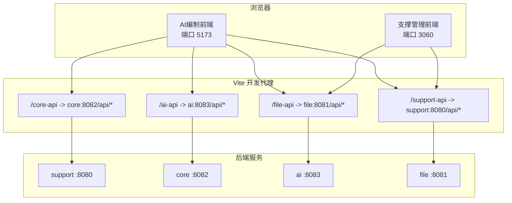
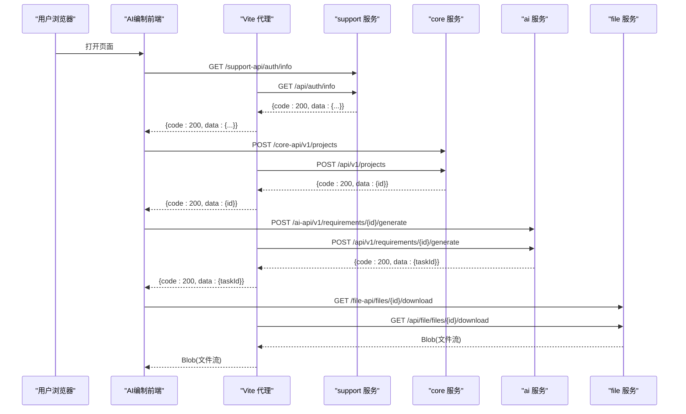
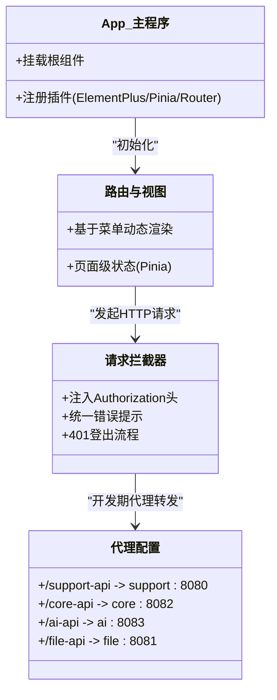
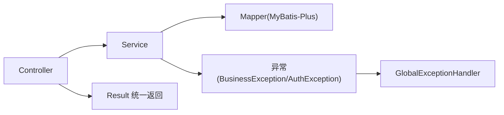
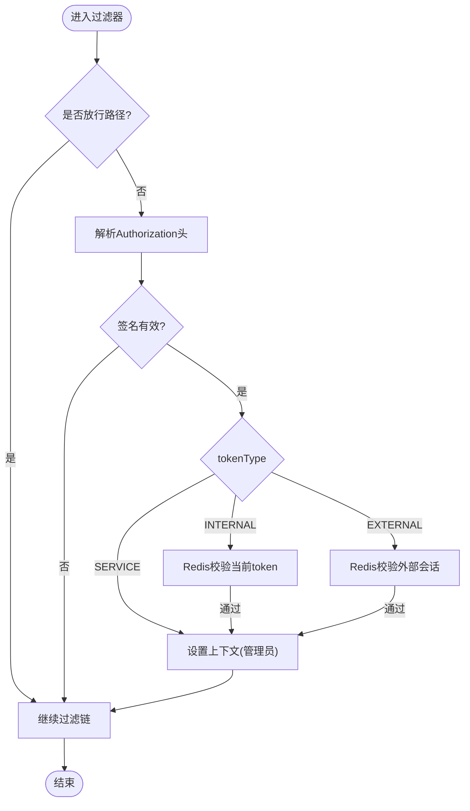
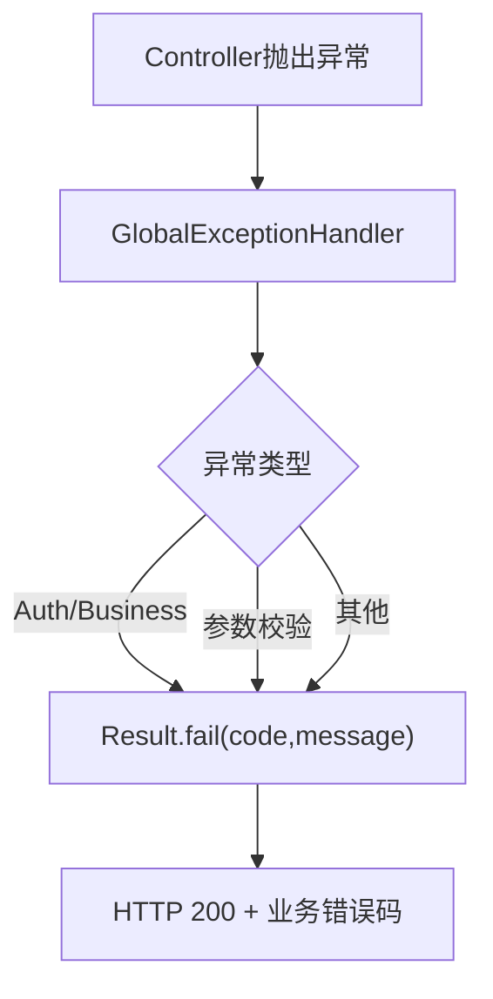
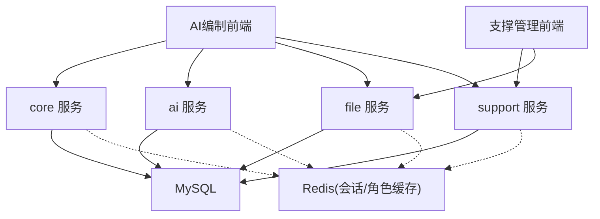

# 前后端分离架构

<cite>
**本文引用的文件列表**
- [ele-ai-tender-frontend/package.json](file://ele-ai-tender-frontend/package.json)
- [ele-ai-tender-support-frontend/package.json](file://ele-ai-tender-support-frontend/package.json)
- [ele-ai-tender-frontend/vite.config.ts](file://ele-ai-tender-frontend/vite.config.ts)
- [ele-ai-tender-support-frontend/vite.config.ts](file://ele-ai-tender-support-frontend/vite.config.ts)
- [FRONTEND_CONVENTIONS.md](file://docs/rules/FRONTEND_CONVENTIONS.md)
- [CODE_CONVENTIONS.md](file://docs/rules/CODE_CONVENTIONS.md)
- [SUPPORT_SYSTEM_SPEC.md](file://docs/rules/SUPPORT_SYSTEM_SPEC.md)
- [CORE_MODULE_SPEC.md](file://docs/rules/CORE_MODULE_SPEC.md)
- [ele-ai-tender-system/pom.xml](file://ele-ai-tender-system/pom.xml)
- [WebConfig.java（support）](file://ele-ai-tender-system/ele-ai-tender-support/src/main/java/com/jy/eleaitender/support/config/WebConfig.java)
- [WebConfig.java（file）](file://ele-ai-tender-system/ele-ai-tender-file/src/main/java/com/jy/eleaitender/file/config/WebConfig.java)
- [JwtAuthenticationFilter.java](file://ele-ai-tender-system/ele-ai-tender-common/src/main/java/com/jy/eleaitender/common/security/JwtAuthenticationFilter.java)
- [request.ts（AI编制前端）](file://ele-ai-tender-frontend/src/utils/request.ts)
- [request.ts（支撑前端）](file://ele-ai-tender-support-frontend/src/utils/request.ts)
</cite>

## 目录
1. [简介](#简介)
2. [项目结构](#项目结构)
3. [核心组件](#核心组件)
4. [架构总览](#架构总览)
5. [详细组件分析](#详细组件分析)
6. [依赖关系分析](#依赖关系分析)
7. [性能与可扩展性](#性能与可扩展性)
8. [故障排查指南](#故障排查指南)
9. [结论](#结论)
10. [附录：API设计规范与示例路径](#附录api设计规范与示例路径)

## 简介
本文件面向“招标文件AI编制系统”的前后端分离架构，覆盖以下要点：
- 双前端应用（用户端与管理端）的架构模式与职责边界
- Spring Boot 多模块后端服务划分与统一接口规范
- RESTful 设计原则、请求响应格式、错误处理机制
- 认证授权方案（JWT、权限控制、跨域配置）
- 前后端数据流图、组件交互图与部署架构图

## 项目结构
仓库采用“双前端 + 多后端服务”的分离式组织：
- 前端
  - AI编制业务前端：ele-ai-tender-frontend（Vue 3 + TypeScript + Vite + Element Plus + Pinia）
  - 支撑中心管理后台：ele-ai-tender-support-frontend（同上技术栈）
- 后端
  - ele-ai-tender-system 为 Maven 聚合工程，包含多个独立运行的 Spring Boot 服务（如 support、core、ai、file 等），通过统一前缀 /api 暴露 REST 接口

图表来源
- [ele-ai-tender-frontend/vite.config.ts:60-86](file://ele-ai-tender-frontend/vite.config.ts#L60-L86)
- [ele-ai-tender-support-frontend/vite.config.ts:24-58](file://ele-ai-tender-support-frontend/vite.config.ts#L24-L58)
- [FRONTEND_CONVENTIONS.md:27-43](file://docs/rules/FRONTEND_CONVENTIONS.md#L27-L43)

章节来源
- [ele-ai-tender-frontend/package.json:1-49](file://ele-ai-tender-frontend/package.json#L1-L49)
- [ele-ai-tender-support-frontend/package.json:1-35](file://ele-ai-tender-support-frontend/package.json#L1-L35)
- [FRONTEND_CONVENTIONS.md:1-43](file://docs/rules/FRONTEND_CONVENTIONS.md#L1-L43)

## 核心组件
- 前端基础设施
  - Vue 3 + TypeScript + Vite 构建与开发体验
  - Element Plus UI 组件库
  - Pinia 状态管理
  - Axios 封装的请求拦截器（统一鉴权头、全局错误提示、401 登出流程）
- 后端基础设施
  - Spring Boot 3.2.x + MyBatis-Plus + JJWT + Redis
  - 统一 Result 返回结构与全局异常处理器
  - JWT 过滤器 + 角色缓存 + 跨域配置
  - 多服务按领域拆分（support/core/ai/file）

章节来源
- [ele-ai-tender-frontend/src/utils/request.ts:1-80](file://ele-ai-tender-frontend/src/utils/request.ts#L1-L80)
- [ele-ai-tender-support-frontend/src/utils/request.ts:1-116](file://ele-ai-tender-support-frontend/src/utils/request.ts#L1-L116)
- [pom.xml:25-66](file://ele-ai-tender-system/pom.xml#L25-L66)
- [CODE_CONVENTIONS.md:95-113](file://docs/rules/CODE_CONVENTIONS.md#L95-L113)

## 架构总览
整体采用“前端静态资源 + 后端微服务化 API”的解耦形态。前端通过 Vite 开发代理将不同业务域路由到对应后端服务；生产环境由反向代理统一转发至各服务。

图表来源
- [ele-ai-tender-frontend/vite.config.ts:60-86](file://ele-ai-tender-frontend/vite.config.ts#L60-L86)
- [SUPPORT_SYSTEM_SPEC.md:9-22](file://docs/rules/SUPPORT_SYSTEM_SPEC.md#L9-L22)
- [CORE_MODULE_SPEC.md:30-50](file://docs/rules/CORE_MODULE_SPEC.md#L30-L50)

## 详细组件分析

### 前端应用架构（双前端）
- 技术栈与初始化
  - 两个前端均使用 Vue 3 + TypeScript + Vite + Element Plus + Pinia
  - 入口分别注册 Router、Pinia、Element Plus 并挂载根组件
- 状态管理
  - 统一通过 Pinia store 管理用户态、主题、项目/需求等业务状态
- API 调用层
  - 每个功能域在 src/api 下定义函数，集中维护后端路径与参数类型
  - Axios 实例统一注入 Authorization 头，统一处理业务码 401 与网络错误
- 代理与部署
  - 开发期通过 Vite proxy 将 /support-api、/core-api、/ai-api、/file-api 转发到各自后端
  - 生产环境 base 路径区分，便于 Nginx 或网关统一分发

图表来源
- [ele-ai-tender-frontend/src/main.ts:1-14](file://ele-ai-tender-frontend/src/main.ts#L1-L14)
- [ele-ai-tender-support-frontend/src/main.ts:1-24](file://ele-ai-tender-support-frontend/src/main.ts#L1-L24)
- [ele-ai-tender-frontend/src/utils/request.ts:1-80](file://ele-ai-tender-frontend/src/utils/request.ts#L1-L80)
- [ele-ai-tender-support-frontend/src/utils/request.ts:1-116](file://ele-ai-tender-support-frontend/src/utils/request.ts#L1-L116)
- [ele-ai-tender-frontend/vite.config.ts:60-86](file://ele-ai-tender-frontend/vite.config.ts#L60-L86)
- [ele-ai-tender-support-frontend/vite.config.ts:24-58](file://ele-ai-tender-support-frontend/vite.config.ts#L24-L58)

章节来源
- [FRONTEND_CONVENTIONS.md:1-43](file://docs/rules/FRONTEND_CONVENTIONS.md#L1-L43)
- [ele-ai-tender-frontend/package.json:14-32](file://ele-ai-tender-frontend/package.json#L14-L32)
- [ele-ai-tender-support-frontend/package.json:15-25](file://ele-ai-tender-support-frontend/package.json#L15-L25)

### 后端服务与分层
- 模块划分
  - support：认证、用户/角色/菜单、模板、知识库、模型配置、消息、统计、日志、版本、外部对接
  - core：项目、需求、评审项、检测、导出等核心业务
  - ai：AI任务、知识文档、模型连通性测试、聊天对话
  - file：文件上传下载、预览、转换
- 分层约定
  - Controller 仅做参数校验与结果包装，Service 承载业务逻辑，Mapper 负责数据访问
  - 统一 Result 返回结构，HTTP 状态码固定 200，业务错误通过 code/message 表达
  - 分页请求继承 BasePageRequest，响应直接返回 Page<T>

图表来源
- [CODE_CONVENTIONS.md:224-250](file://docs/rules/CODE_CONVENTIONS.md#L224-L250)
- [CODE_CONVENTIONS.md:274-310](file://docs/rules/CODE_CONVENTIONS.md#L274-L310)

章节来源
- [SUPPORT_SYSTEM_SPEC.md:1-70](file://docs/rules/SUPPORT_SYSTEM_SPEC.md#L1-L70)
- [CORE_MODULE_SPEC.md:30-50](file://docs/rules/CORE_MODULE_SPEC.md#L30-L50)
- [CODE_CONVENTIONS.md:95-113](file://docs/rules/CODE_CONVENTIONS.md#L95-L113)

### 认证与授权（JWT）
- 令牌生命周期
  - 登录成功后签发 JWT，内部用户与服务间调用 token 类型不同
  - 内部用户 token 需与 Redis 中存储的当前 token 比对，支持单点失效
  - 外部系统 token 支持带 jti 的会话级校验与兼容旧键
- 过滤器实现
  - JwtAuthenticationFilter 从 Authorization 头解析 Bearer Token
  - 根据 tokenType 选择校验策略（服务间免查Redis、内部用户查Redis、外部系统查Redis）
  - 校验通过后填充 SecurityContext（LoginUser），供后续权限注解使用
- 权限控制
  - 控制器方法使用 @RequireLogin/@RequirePermission 进行鉴权
  - 角色信息从 Redis 加载，管理员不受数据隔离限制

图表来源
- [JwtAuthenticationFilter.java:36-101](file://ele-ai-tender-system/ele-ai-tender-common/src/main/java/com/jy/eleaitender/common/security/JwtAuthenticationFilter.java#L36-L101)
- [WebConfig.java（support）:25-41](file://ele-ai-tender-system/ele-ai-tender-support/src/main/java/com/jy/eleaitender/support/config/WebConfig.java#L25-L41)
- [WebConfig.java（file）:24-41](file://ele-ai-tender-system/ele-ai-tender-file/src/main/java/com/jy/eleaitender/file/config/WebConfig.java#L24-L41)

章节来源
- [CODE_CONVENTIONS.md:349-361](file://docs/rules/CODE_CONVENTIONS.md#L349-L361)
- [WebConfig.java（support）:25-41](file://ele-ai-tender-system/ele-ai-tender-support/src/main/java/com/jy/eleaitender/support/config/WebConfig.java#L25-L41)
- [WebConfig.java（file）:24-41](file://ele-ai-tender-system/ele-ai-tender-file/src/main/java/com/jy/eleaitender/file/config/WebConfig.java#L24-L41)
- [JwtAuthenticationFilter.java:1-168](file://ele-ai-tender-system/ele-ai-tender-common/src/main/java/com/jy/eleaitender/common/security/JwtAuthenticationFilter.java#L1-L168)

### 跨域与内容协商
- 全局 CORS 允许所有来源与方法，默认 Content-Type 为 application/json
- 开发期通过 Vite proxy 解决同源问题；生产建议由网关/Nginx 统一配置

章节来源
- [WebConfig.java（support）:44-61](file://ele-ai-tender-system/ele-ai-tender-support/src/main/java/com/jy/eleaitender/support/config/WebConfig.java#L44-L61)
- [FRONTEND_CONVENTIONS.md:27-43](file://docs/rules/FRONTEND_CONVENTIONS.md#L27-L43)

### 统一错误处理与返回结构
- 统一返回体：{ code, message, data, timestamp }
- HTTP 状态码固定 200，业务错误通过 code 区分
- 全局异常处理器捕获业务异常、参数校验异常、未知异常并统一封装

图表来源
- [CODE_CONVENTIONS.md:95-113](file://docs/rules/CODE_CONVENTIONS.md#L95-L113)
- [CODE_CONVENTIONS.md:274-310](file://docs/rules/CODE_CONVENTIONS.md#L274-L310)

章节来源
- [CODE_CONVENTIONS.md:95-113](file://docs/rules/CODE_CONVENTIONS.md#L95-L113)
- [CODE_CONVENTIONS.md:274-310](file://docs/rules/CODE_CONVENTIONS.md#L274-L310)

## 依赖关系分析
- 前端依赖
  - Vue 3、TypeScript、Vite、Element Plus、Pinia、Axios
- 后端依赖
  - Spring Boot 3.2.x、MyBatis-Plus、JJWT、Hutool、MySQL、SpringDoc OpenAPI、Redisson、POI/Tika/Milvus 等
- 模块耦合
  - common 提供通用 DTO、安全、工具类
  - interaction 提供对外交互协议与 SPI
  - 各业务服务通过 REST 互相调用或通过消息/回调集成

图表来源
- [pom.xml:25-66](file://ele-ai-tender-system/pom.xml#L25-L66)
- [FRONTEND_CONVENTIONS.md:27-43](file://docs/rules/FRONTEND_CONVENTIONS.md#L27-L43)

章节来源
- [pom.xml:68-223](file://ele-ai-tender-system/pom.xml#L68-L223)
- [FRONTEND_CONVENTIONS.md:1-43](file://docs/rules/FRONTEND_CONVENTIONS.md#L1-L43)

## 性能与可扩展性
- 前端
  - 按需引入 Element Plus 图标与分块打包，减少首屏体积
  - 长轮询/定时任务用于 AI 任务进度拉取，避免频繁全量刷新
- 后端
  - 异步线程池与任务队列用于 AI 生成任务
  - Redis 缓存用户角色与会话，降低数据库压力
  - 文件服务独立部署，读写分离与对象存储扩展

[本节为通用指导，不直接分析具体文件]

## 故障排查指南
- 前端 401 处理
  - 响应拦截器检测到 code=401 时弹出确认框并执行登出，同时清理本地状态
- 网络错误与超时
  - 统一提示网络错误/超时，必要时引导重试
- 后端全局异常
  - 检查 GlobalExceptionHandler 是否正确捕获并返回统一结构
- 跨域问题
  - 开发期确认 Vite proxy 规则；生产期检查网关/Nginx 的 CORS 配置

章节来源
- [ele-ai-tender-frontend/src/utils/request.ts:38-77](file://ele-ai-tender-frontend/src/utils/request.ts#L38-L77)
- [ele-ai-tender-support-frontend/src/utils/request.ts:33-94](file://ele-ai-tender-support-frontend/src/utils/request.ts#L33-L94)
- [CODE_CONVENTIONS.md:274-310](file://docs/rules/CODE_CONVENTIONS.md#L274-L310)

## 结论
本项目采用清晰的前后端分离与多服务拆分，配合统一的接口规范、JWT 认证与全局异常处理，具备良好的可维护性与扩展性。双前端按场景切分，结合 Vite 代理与网关/Nginx 转发，实现了良好的开发与部署体验。

[本节为总结性内容，不直接分析具体文件]

## 附录：API设计规范与示例路径
- URL 风格
  - kebab-case、资源复数名词、层级资源与动作型后缀
- HTTP 方法语义
  - GET 查询、POST 创建/触发、PUT 全量更新、DELETE 删除
- 统一返回结构
  - { code, message, data, timestamp }，HTTP 状态码固定 200
- 分页规范
  - 请求：current、size；响应：Page<T>
- 典型接口示例（节选）
  - 认证：/api/auth/login、/api/auth/userinfo、/api/auth/menus
  - 用户：/api/users、/api/users/{id}
  - 角色：/api/roles、/api/roles/{id}/menus
  - 模板：/api/v1/template-configs
  - 需求：/api/v1/requirements、/api/v1/requirements/{id}/generate
  - 政策文件：/api/v1/policy-files

章节来源
- [CODE_CONVENTIONS.md:69-113](file://docs/rules/CODE_CONVENTIONS.md#L69-L113)
- [SUPPORT_SYSTEM_SPEC.md:9-70](file://docs/rules/SUPPORT_SYSTEM_SPEC.md#L9-L70)
- [CORE_MODULE_SPEC.md:30-50](file://docs/rules/CORE_MODULE_SPEC.md#L30-L50)