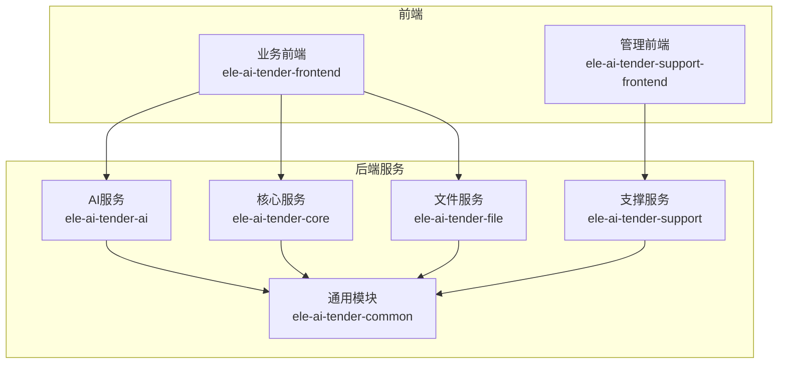
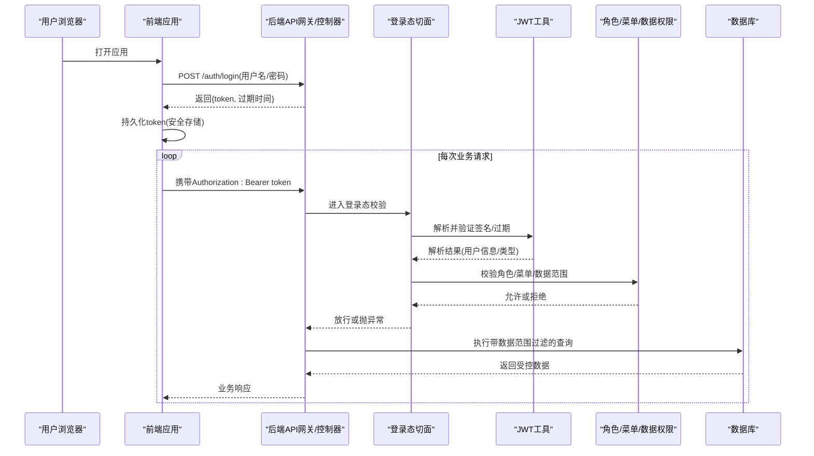
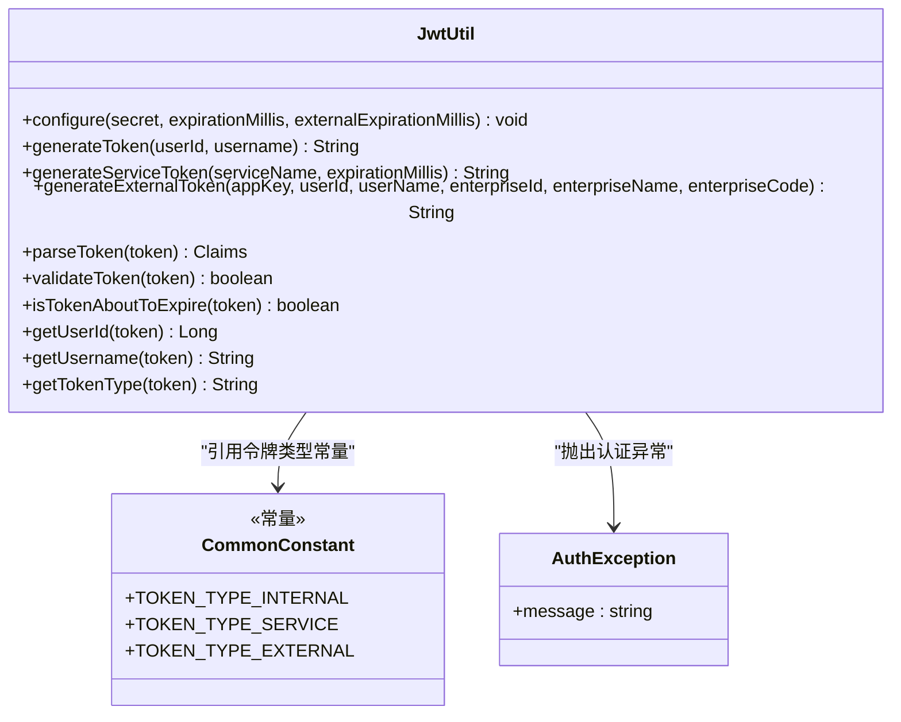
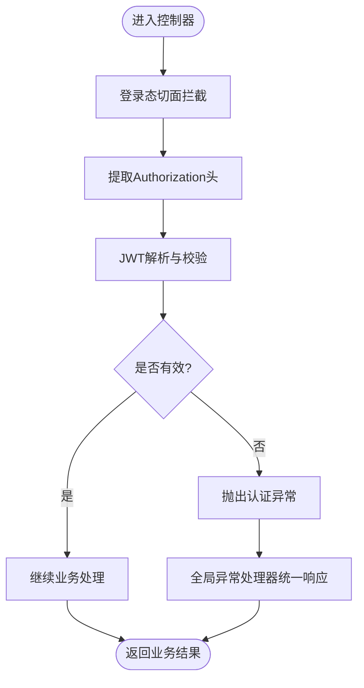
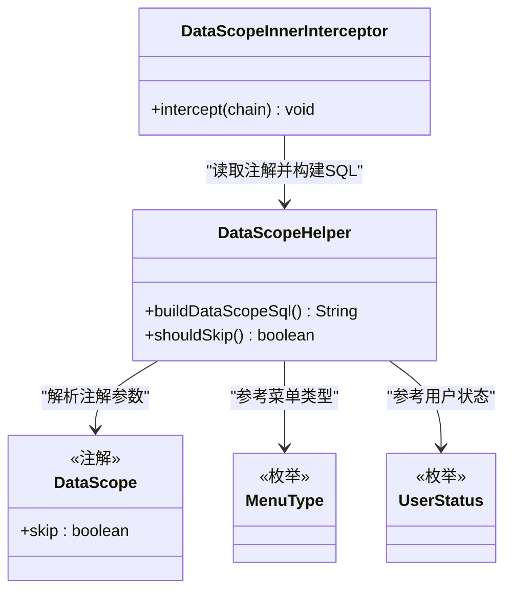
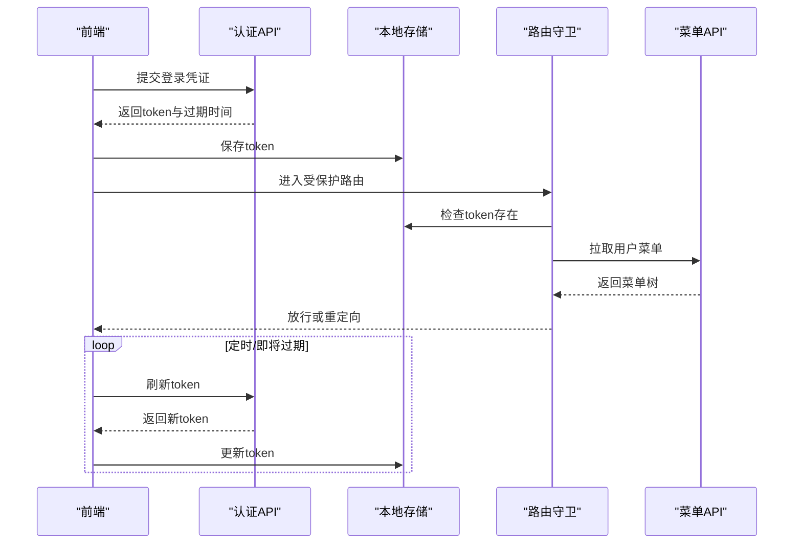
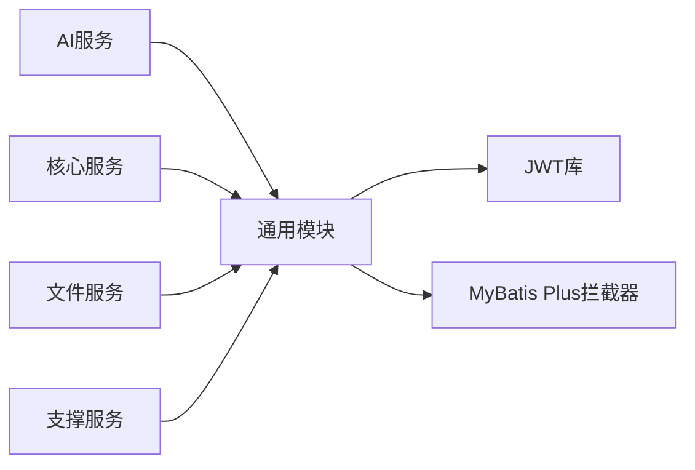

# 安全架构

<cite>
**本文引用的文件**   
- [JwtUtil.java](file://ele-ai-tender-system/ele-ai-tender-common/src/main/java/com/jy/eleaitender/common/util/JwtUtil.java)
- [RequireLoginAspect.java](file://ele-ai-tender-system/ele-ai-tender-common/src/main/java/com/jy/eleaitender/common/aspect/RequireLoginAspect.java)
- [DataScope.java](file://ele-ai-tender-system/ele-ai-tender-common/src/main/java/com/jy/eleaitender/common/datascope/DataScope.java)
- [DataScopeHelper.java](file://ele-ai-tender-system/ele-ai-tender-common/src/main/java/com/jy/eleaitender/common/datascope/DataScopeHelper.java)
- [DataScopeInnerInterceptor.java](file://ele-ai-tender-system/ele-ai-tender-common/src/main/java/com/jy/eleaitender/common/datascope/DataScopeInnerInterceptor.java)
- [AuthException.java](file://ele-ai-tender-system/ele-ai-tender-common/src/main/java/com/jy/eleaitender/common/exception/AuthException.java)
- [CommonConstant.java](file://ele-ai-tender-system/ele-ai-tender-common/src/main/java/com/jy/eleaitender/common/constant/CommonConstant.java)
- [RedisKeyConstant.java](file://ele-ai-tender-system/ele-ai-tender-common/src/main/java/com/jy/eleaitender/common/constant/RedisKeyConstant.java)
- [GlobalExceptionHandler.java](file://ele-ai-tender-system/ele-ai-tender-ai/src/main/java/com/jy/eleaitender/ai/handler/GlobalExceptionHandler.java)
- [AiApplication.java](file://ele-ai-tender-system/ele-ai-tender-ai/src/main/java/com/jy/eleaitender/ai/AiApplication.java)
- [WebConfig.java](file://ele-ai-tender-system/ele-ai-tender-ai/src/main/java/com/jy/eleaitender/ai/config/WebConfig.java)
- [MyBatisPlusConfig.java](file://ele-ai-tender-system/ele-ai-tender-ai/src/main/java/com/jy/eleaitender/ai/config/MyBatisPlusConfig.java)
- [MenuType.java](file://ele-ai-tender-system/ele-ai-tender-common/src/main/java/com/jy/eleaitender/common/enums/MenuType.java)
- [UserStatus.java](file://ele-ai-tender-system/ele-ai-tender-common/src/main/java/com/jy/eleaitender/common/enums/UserStatus.java)
- [ResponseCode.java](file://ele-ai-tender-system/ele-ai-tender-common/src/main/java/com/jy/eleaitender/common/enums/ResponseCode.java)
- [auth.ts](file://ele-ai-tender-frontend/src/api/auth.ts)
- [request.ts](file://ele-ai-tender-frontend/src/utils/request.ts)
- [storage.ts](file://ele-ai-tender-frontend/src/utils/storage.ts)
- [index.ts](file://ele-ai-tender-frontend/src/router/index.ts)
- [user.ts](file://ele-ai-tender-frontend/src/store/user.ts)
- [menu.ts](file://ele-ai-tender-support-frontend/src/api/menu.ts)
- [role.ts](file://ele-ai-tender-support-frontend/src/api/role.ts)
- [user.ts](file://ele-ai-tender-support-frontend/src/api/user.ts)
- [index.ts](file://ele-ai-tender-support-frontend/src/router/index.ts)
- [user.ts](file://ele-ai-tender-support-frontend/src/store/user.ts)
- [menu-route.ts](file://ele-ai-tender-support-frontend/src/utils/menu-route.ts)
</cite>

## 目录
1. [引言](#引言)
2. [项目结构](#项目结构)
3. [核心组件](#核心组件)
4. [架构总览](#架构总览)
5. [详细组件分析](#详细组件分析)
6. [依赖关系分析](#依赖关系分析)
7. [性能与安全权衡](#性能与安全权衡)
8. [故障排查指南](#故障排查指南)
9. [结论](#结论)
10. [附录](#附录)

## 引言
本安全架构文档面向“招标文件AI编制系统”，围绕身份认证、权限控制与数据安全三大主题，系统化阐述后端与前端的安全设计策略。重点覆盖：
- JWT令牌的生成、校验、刷新机制及令牌结构设计
- 基于角色的访问控制（RBAC）在菜单与数据层面的落地
- 前后端协同的认证流程与拦截策略
- 安全存储与异常处理最佳实践

## 项目结构
本项目采用多模块微服务化组织，安全能力集中在通用模块 ele-ai-tender-common，并在业务模块中通过AOP与配置类进行装配；前端分别提供业务端与管理端两套界面，各自实现登录态管理、路由守卫与动态菜单渲染。

图表来源
- [AiApplication.java](file://ele-ai-tender-system/ele-ai-tender-ai/src/main/java/com/jy/eleaitender/ai/AiApplication.java)
- [WebConfig.java](file://ele-ai-tender-system/ele-ai-tender-ai/src/main/java/com/jy/eleaitender/ai/config/WebConfig.java)
- [MyBatisPlusConfig.java](file://ele-ai-tender-system/ele-ai-tender-ai/src/main/java/com/jy/eleaitender/ai/config/MyBatisPlusConfig.java)

章节来源
- [AiApplication.java](file://ele-ai-tender-system/ele-ai-tender-ai/src/main/java/com/jy/eleaitender/ai/AiApplication.java)
- [WebConfig.java](file://ele-ai-tender-system/ele-ai-tender-ai/src/main/java/com/jy/eleaitender/ai/config/WebConfig.java)
- [MyBatisPlusConfig.java](file://ele-ai-tender-system/ele-ai-tender-ai/src/main/java/com/jy/eleaitender/ai/config/MyBatisPlusConfig.java)

## 核心组件
- JWT工具类：负责内部用户Token、服务间Token、外部系统Token的生成、解析、校验与过期判断，支持运行时密钥与过期时间配置。
- 登录态切面：统一拦截未登录请求，从请求头提取并校验JWT，必要时抛出认证异常。
- 数据权限拦截器：基于注解与上下文注入SQL条件，实现行级数据隔离。
- 全局异常处理器：将认证与授权异常转换为标准响应码。
- 前端认证与路由守卫：封装请求拦截、Token刷新、路由鉴权与动态菜单加载。

章节来源
- [JwtUtil.java](file://ele-ai-tender-system/ele-ai-tender-common/src/main/java/com/jy/eleaitender/common/util/JwtUtil.java)
- [RequireLoginAspect.java](file://ele-ai-tender-system/ele-ai-tender-common/src/main/java/com/jy/eleaitender/common/aspect/RequireLoginAspect.java)
- [DataScope.java](file://ele-ai-tender-system/ele-ai-tender-common/src/main/java/com/jy/eleaitender/common/datascope/DataScope.java)
- [DataScopeHelper.java](file://ele-ai-tender-system/ele-ai-tender-common/src/main/java/com/jy/eleaitender/common/datascope/DataScopeHelper.java)
- [DataScopeInnerInterceptor.java](file://ele-ai-tender-system/ele-ai-tender-common/src/main/java/com/jy/eleaitender/common/datascope/DataScopeInnerInterceptor.java)
- [GlobalExceptionHandler.java](file://ele-ai-tender-system/ele-ai-tender-ai/src/main/java/com/jy/eleaitender/ai/handler/GlobalExceptionHandler.java)
- [auth.ts](file://ele-ai-tender-frontend/src/api/auth.ts)
- [request.ts](file://ele-ai-tender-frontend/src/utils/request.ts)
- [storage.ts](file://ele-ai-tender-frontend/src/utils/storage.ts)
- [index.ts](file://ele-ai-tender-frontend/src/router/index.ts)
- [user.ts](file://ele-ai-tender-frontend/src/store/user.ts)

## 架构总览
下图展示端到端的安全交互：前端登录后获取JWT，后续请求携带令牌；后端通过AOP校验令牌有效性，结合RBAC与数据权限完成访问控制；异常由全局处理器统一收敛。

图表来源
- [RequireLoginAspect.java](file://ele-ai-tender-system/ele-ai-tender-common/src/main/java/com/jy/eleaitender/common/aspect/RequireLoginAspect.java)
- [JwtUtil.java](file://ele-ai-tender-system/ele-ai-tender-common/src/main/java/com/jy/eleaitender/common/util/JwtUtil.java)
- [DataScopeHelper.java](file://ele-ai-tender-system/ele-ai-tender-common/src/main/java/com/jy/eleaitender/common/datascope/DataScopeHelper.java)
- [DataScopeInnerInterceptor.java](file://ele-ai-tender-system/ele-ai-tender-common/src/main/java/com/jy/eleaitender/common/datascope/DataScopeInnerInterceptor.java)

## 详细组件分析

### JWT令牌体系
- 令牌类型
  - 内部用户Token：包含用户标识与用户名，用于常规登录态。
  - 服务间Token：用于服务调用，不依赖Redis校验。
  - 外部系统Token：包含企业与应用标识，适合第三方集成。
- 结构与字段
  - 公共字段：签发时间、过期时间、签名。
  - 内部用户：userId、username、type=internal。
  - 服务间：serviceName、username=serviceName、type=service。
  - 外部系统：appKey、userId、userName、enterpriseId、enterpriseName、enterpriseCode、type=external，可选JTI。
- 生命周期与刷新
  - 默认过期时间可配置；提供即将过期检测接口供前端刷新使用。
  - 建议前端在即将过期前主动刷新，避免中断体验。
- 安全要点
  - 密钥长度与算法强度需满足要求；生产环境应从配置中心注入。
  - Token仅承载最小必要信息，敏感信息不落盘。
  - 对外部Token引入JTI以增强会话唯一性（可扩展黑名单/白名单）。

图表来源
- [JwtUtil.java](file://ele-ai-tender-system/ele-ai-tender-common/src/main/java/com/jy/eleaitender/common/util/JwtUtil.java)
- [CommonConstant.java](file://ele-ai-tender-system/ele-ai-tender-common/src/main/java/com/jy/eleaitender/common/constant/CommonConstant.java)
- [AuthException.java](file://ele-ai-tender-system/ele-ai-tender-common/src/main/java/com/jy/eleaitender/common/exception/AuthException.java)

章节来源
- [JwtUtil.java](file://ele-ai-tender-system/ele-ai-tender-common/src/main/java/com/jy/eleaitender/common/util/JwtUtil.java)
- [CommonConstant.java](file://ele-ai-tender-system/ele-ai-tender-common/src/main/java/com/jy/eleaitender/common/constant/CommonConstant.java)
- [AuthException.java](file://ele-ai-tender-system/ele-ai-tender-common/src/main/java/com/jy/eleaitender/common/exception/AuthException.java)

### 登录态校验与全局异常
- 登录态切面
  - 统一拦截需要登录的接口，从请求头提取JWT并调用工具类校验。
  - 校验失败时抛出认证异常，交由全局异常处理器转换响应。
- 全局异常处理器
  - 捕获认证相关异常，返回统一的错误码与消息，便于前端集中处理。

图表来源
- [RequireLoginAspect.java](file://ele-ai-tender-system/ele-ai-tender-common/src/main/java/com/jy/eleaitender/common/aspect/RequireLoginAspect.java)
- [JwtUtil.java](file://ele-ai-tender-system/ele-ai-tender-common/src/main/java/com/jy/eleaitender/common/util/JwtUtil.java)
- [GlobalExceptionHandler.java](file://ele-ai-tender-system/ele-ai-tender-ai/src/main/java/com/jy/eleaitender/ai/handler/GlobalExceptionHandler.java)

章节来源
- [RequireLoginAspect.java](file://ele-ai-tender-system/ele-ai-tender-common/src/main/java/com/jy/eleaitender/common/aspect/RequireLoginAspect.java)
- [GlobalExceptionHandler.java](file://ele-ai-tender-system/ele-ai-tender-ai/src/main/java/com/jy/eleaitender/ai/handler/GlobalExceptionHandler.java)

### 基于角色的访问控制（RBAC）
- 角色与菜单
  - 角色定义用户权限集合，菜单项按类型区分（页面/按钮等），前端根据用户角色动态渲染可用菜单与操作按钮。
- 数据权限隔离
  - 通过注解标记方法是否需要数据范围过滤；拦截器在SQL层自动拼接租户/部门/个人维度条件，实现行级隔离。
  - 管理员或特定场景可跳过数据范围限制。
- 状态与枚举
  - 用户状态、菜单类型、响应码等枚举为权限判定与UI展示提供基础。

图表来源
- [DataScope.java](file://ele-ai-tender-system/ele-ai-tender-common/src/main/java/com/jy/eleaitender/common/datascope/DataScope.java)
- [DataScopeHelper.java](file://ele-ai-tender-system/ele-ai-tender-common/src/main/java/com/jy/eleaitender/common/datascope/DataScopeHelper.java)
- [DataScopeInnerInterceptor.java](file://ele-ai-tender-system/ele-ai-tender-common/src/main/java/com/jy/eleaitender/common/datascope/DataScopeInnerInterceptor.java)
- [MenuType.java](file://ele-ai-tender-system/ele-ai-tender-common/src/main/java/com/jy/eleaitender/common/enums/MenuType.java)
- [UserStatus.java](file://ele-ai-tender-system/ele-ai-tender-common/src/main/java/com/jy/eleaitender/common/enums/UserStatus.java)

章节来源
- [DataScope.java](file://ele-ai-tender-system/ele-ai-tender-common/src/main/java/com/jy/eleaitender/common/datascope/DataScope.java)
- [DataScopeHelper.java](file://ele-ai-tender-system/ele-ai-tender-common/src/main/java/com/jy/eleaitender/common/datascope/DataScopeHelper.java)
- [DataScopeInnerInterceptor.java](file://ele-ai-tender-system/ele-ai-tender-common/src/main/java/com/jy/eleaitender/common/datascope/DataScopeInnerInterceptor.java)
- [MenuType.java](file://ele-ai-tender-system/ele-ai-tender-common/src/main/java/com/jy/eleaitender/common/enums/MenuType.java)
- [UserStatus.java](file://ele-ai-tender-system/ele-ai-tender-common/src/main/java/com/jy/eleaitender/common/enums/UserStatus.java)

### 前端安全与令牌刷新
- 请求拦截
  - 在请求头附加Authorization，统一处理认证失败跳转登录页。
- 令牌存储
  - 使用安全的本地存储方案，避免XSS泄露风险；建议优先使用内存态+短期持久化策略。
- 路由守卫
  - 进入受保护路由前校验登录态与菜单权限，无权限则重定向至403或首页。
- 动态菜单
  - 根据当前用户角色拉取菜单树，渲染侧边栏与导航。
- 刷新策略
  - 监听即将过期事件，在后台静默刷新令牌，保证用户体验。

图表来源
- [auth.ts](file://ele-ai-tender-frontend/src/api/auth.ts)
- [request.ts](file://ele-ai-tender-frontend/src/utils/request.ts)
- [storage.ts](file://ele-ai-tender-frontend/src/utils/storage.ts)
- [index.ts](file://ele-ai-tender-frontend/src/router/index.ts)
- [user.ts](file://ele-ai-tender-frontend/src/store/user.ts)
- [menu.ts](file://ele-ai-tender-support-frontend/src/api/menu.ts)
- [role.ts](file://ele-ai-tender-support-frontend/src/api/role.ts)
- [user.ts](file://ele-ai-tender-support-frontend/src/api/user.ts)
- [index.ts](file://ele-ai-tender-support-frontend/src/router/index.ts)
- [user.ts](file://ele-ai-tender-support-frontend/src/store/user.ts)
- [menu-route.ts](file://ele-ai-tender-support-frontend/src/utils/menu-route.ts)

章节来源
- [auth.ts](file://ele-ai-tender-frontend/src/api/auth.ts)
- [request.ts](file://ele-ai-tender-frontend/src/utils/request.ts)
- [storage.ts](file://ele-ai-tender-frontend/src/utils/storage.ts)
- [index.ts](file://ele-ai-tender-frontend/src/router/index.ts)
- [user.ts](file://ele-ai-tender-frontend/src/store/user.ts)
- [menu.ts](file://ele-ai-tender-support-frontend/src/api/menu.ts)
- [role.ts](file://ele-ai-tender-support-frontend/src/api/role.ts)
- [user.ts](file://ele-ai-tender-support-frontend/src/api/user.ts)
- [index.ts](file://ele-ai-tender-support-frontend/src/router/index.ts)
- [user.ts](file://ele-ai-tender-support-frontend/src/store/user.ts)
- [menu-route.ts](file://ele-ai-tender-support-frontend/src/utils/menu-route.ts)

## 依赖关系分析
- 模块耦合
  - 业务服务依赖通用模块提供的JWT、AOP、数据权限与常量/枚举。
  - 前端依赖各自的API封装、路由守卫与状态管理。
- 外部依赖
  - JWT库用于签名与验签；MyBatis Plus拦截器用于数据权限SQL注入。
- 潜在风险
  - 密钥硬编码风险：应通过配置中心注入。
  - 跨域与CORS：需在Web配置中严格限定来源。
  - 日志脱敏：避免在日志中输出完整Token。

图表来源
- [AiApplication.java](file://ele-ai-tender-system/ele-ai-tender-ai/src/main/java/com/jy/eleaitender/ai/AiApplication.java)
- [MyBatisPlusConfig.java](file://ele-ai-tender-system/ele-ai-tender-ai/src/main/java/com/jy/eleaitender/ai/config/MyBatisPlusConfig.java)
- [DataScopeInnerInterceptor.java](file://ele-ai-tender-system/ele-ai-tender-common/src/main/java/com/jy/eleaitender/common/datascope/DataScopeInnerInterceptor.java)

章节来源
- [AiApplication.java](file://ele-ai-tender-system/ele-ai-tender-ai/src/main/java/com/jy/eleaitender/ai/AiApplication.java)
- [MyBatisPlusConfig.java](file://ele-ai-tender-system/ele-ai-tender-ai/src/main/java/com/jy/eleaitender/ai/config/MyBatisPlusConfig.java)
- [DataScopeInnerInterceptor.java](file://ele-ai-tender-system/ele-ai-tender-common/src/main/java/com/jy/eleaitender/common/datascope/DataScopeInnerInterceptor.java)

## 性能与安全权衡
- 令牌校验开销
  - JWT无状态校验成本低，但频繁解析仍有一定CPU消耗；可在网关层缓存校验结果或使用短周期令牌配合刷新。
- 数据权限SQL注入
  - 拦截器在每条查询上拼接条件，需注意复杂查询的性能影响；可通过索引优化与只读副本缓解。
- 刷新风暴
  - 大量并发即将过期可能导致刷新风暴；建议引入抖动与限流策略。

[本节为通用指导，无需源码引用]

## 故障排查指南
- 常见错误
  - Token无效/已过期：检查签名密钥一致性、过期时间与客户端时钟同步。
  - 未登录/无权限：确认登录态切面是否生效、路由守卫是否正确拦截。
  - 数据越权：核查@DataScope注解与数据范围规则是否匹配。
- 定位步骤
  - 查看全局异常处理器返回的错误码与消息。
  - 开启调试日志，观察JWT解析与数据权限SQL拼接过程。
  - 核对前端请求头是否携带Authorization，以及刷新逻辑是否触发。

章节来源
- [GlobalExceptionHandler.java](file://ele-ai-tender-system/ele-ai-tender-ai/src/main/java/com/jy/eleaitender/ai/handler/GlobalExceptionHandler.java)
- [RequireLoginAspect.java](file://ele-ai-tender-system/ele-ai-tender-common/src/main/java/com/jy/eleaitender/common/aspect/RequireLoginAspect.java)
- [DataScopeHelper.java](file://ele-ai-tender-system/ele-ai-tender-common/src/main/java/com/jy/eleaitender/common/datascope/DataScopeHelper.java)

## 结论
本安全架构以JWT为核心，结合AOP登录态校验与数据权限拦截器，构建了从前端到后端的闭环防护体系。通过RBAC与数据范围控制，实现了细粒度的功能与数据访问隔离。建议在后续迭代中完善密钥管理与刷新策略，强化日志脱敏与审计，持续提升整体安全性与可观测性。

[本节为总结性内容，无需源码引用]

## 附录
- 关键常量与枚举
  - 令牌类型常量：用于区分内部用户、服务间与外部系统令牌。
  - 用户状态与菜单类型：用于权限判定与前端渲染。
  - 响应码：统一错误码规范，便于前后端协作。

章节来源
- [CommonConstant.java](file://ele-ai-tender-system/ele-ai-tender-common/src/main/java/com/jy/eleaitender/common/constant/CommonConstant.java)
- [UserStatus.java](file://ele-ai-tender-system/ele-ai-tender-common/src/main/java/com/jy/eleaitender/common/enums/UserStatus.java)
- [MenuType.java](file://ele-ai-tender-system/ele-ai-tender-common/src/main/java/com/jy/eleaitender/common/enums/MenuType.java)
- [ResponseCode.java](file://ele-ai-tender-system/ele-ai-tender-common/src/main/java/com/jy/eleaitender/common/enums/ResponseCode.java)