# 微服务架构

<cite>
**本文引用的文件**   
- [ele-ai-tender-system/pom.xml](file://ele-ai-tender-system/pom.xml)
- [ele-ai-tender-core/src/main/java/com/jy/eleaitender/core/CoreApplication.java](file://ele-ai-tender-core/src/main/java/com/jy/eleaitender/core/CoreApplication.java)
- [ele-ai-tender-ai/src/main/java/com/jy/eleaitender/ai/AiApplication.java](file://ele-ai-tender-ai/src/main/java/com/jy/eleaitender/ai/AiApplication.java)
- [ele-ai-tender-file/src/main/java/com/jy/eleaitender/file/FileApplication.java](file://ele-ai-tender-file/src/main/java/com/jy/eleaitender/file/FileApplication.java)
- [ele-ai-tender-support/src/main/java/com/jy/eleaitender/support/SupportApplication.java](file://ele-ai-tender-support/src/main/java/com/jy/eleaitender/support/SupportApplication.java)
- [ele-ai-tender-common/src/main/java/com/jy/eleaitender/common/client/InternalFileServiceClient.java](file://ele-ai-tender-common/src/main/java/com/jy/eleaitender/common/client/InternalFileServiceClient.java)
- [ele-ai-tender-core/src/main/resources/application.yml](file://ele-ai-tender-core/src/main/resources/application.yml)
- [ele-ai-tender-ai/src/main/resources/application.yml](file://ele-ai-tender-ai/src/main/resources/application.yml)
- [ele-ai-tender-file/src/main/resources/application.yml](file://ele-ai-tender-file/src/main/resources/application.yml)
- [ele-ai-tender-support/src/main/resources/application.yml](file://ele-ai-tender-support/src/main/resources/application.yml)
- [docs/rules/CORE_MODULE_SPEC.md](file://docs/rules/CORE_MODULE_SPEC.md)
- [docs/rules/FILE_SERVICE_SPEC.md](file://docs/rules/FILE_SERVICE_SPEC.md)
- [docs/rules/SUPPORT_SYSTEM_SPEC.md](file://docs/rules/SUPPORT_SYSTEM_SPEC.md)
- [docs/rules/INTERACTION_INTEGRATION_SPEC.md](file://docs/rules/INTERACTION_INTEGRATION_SPEC.md)
- [ele-ai-tender-system/ele-ai-tender-interaction/pom.xml](file://ele-ai-tender-system/ele-ai-tender-interaction/pom.xml)
- [ele-ai-tender-system/ele-ai-tender-interaction/ele-ai-tender-common-interaction/pom.xml](file://ele-ai-tender-system/ele-ai-tender-interaction/ele-ai-tender-common-interaction/pom.xml)
- [ele-ai-tender-system/ele-ai-tender-interaction/ele-ai-tender-interaction-core/pom.xml](file://ele-ai-tender-system/ele-ai-tender-interaction/ele-ai-tender-interaction-core/pom.xml)
- [ele-ai-tender-system/ele-ai-tender-interaction/ele-ai-tender-interaction-autoconfigure/pom.xml](file://ele-ai-tender-system/ele-ai-tender-interaction/ele-ai-tender-interaction-autoconfigure/pom.xml)
- [ele-ai-tender-system/ele-ai-tender-interaction/ele-ai-tender-interaction-spring-boot-starter/pom.xml](file://ele-ai-tender-system/ele-ai-tender-interaction/ele-ai-tender-interaction-spring-boot-starter/pom.xml)
</cite>

## 更新摘要
**变更内容**   
- 更新了交互服务模块层次结构，反映Maven多模块架构优化
- ele-ai-tender-common-interaction现在作为ele-ai-tender-interaction聚合模块的子模块存在
- 增强了模块组织的逻辑性和可维护性
- 更新了依赖关系图和架构图以反映新的模块结构

## 目录
1. [引言](#引言)
2. [项目结构](#项目结构)
3. [核心组件](#核心组件)
4. [架构总览](#架构总览)
5. [详细组件分析](#详细组件分析)
6. [依赖关系分析](#依赖关系分析)
7. [性能与可扩展性](#性能与可扩展性)
8. [故障排查指南](#故障排查指南)
9. [结论](#结论)
10. [附录](#附录)

## 引言
本文件面向"招标文件AI编制系统"的微服务架构，基于 Spring Boot 3.2.2 进行多模块拆分与服务边界定义。文档围绕以下目标展开：
- 明确核心业务服务（ele-ai-tender-core）、AI处理服务（ele-ai-tender-ai）、文件处理服务（ele-ai-tender-file）、支撑服务（ele-ai-tender-support）和交互服务（ele-ai-tender-interaction）的职责划分
- 阐述服务间通信机制：RESTful API、内部客户端封装、异步任务与结果同步
- 解释 Maven 多模块依赖管理与公共模块（ele-ai-tender-common）设计模式及版本控制策略
- 提供架构图、服务依赖图与部署拓扑图，帮助开发者快速理解整体架构

## 项目结构
系统采用 Maven 多模块聚合工程，根 POM 统一管理版本与依赖，各子模块按职责拆分为独立可部署的微服务。关键模块如下：
- ele-ai-tender-common：跨模块共享的实体、枚举、DTO、通用工具、内部客户端等
- ele-ai-tender-core：核心业务编排（项目管理、需求编制、评审项、检测、模板快照、消息中心、政策文件等）
- ele-ai-tender-ai：AI能力（模型路由、任务执行、知识库检索、响应日志等）
- ele-ai-tender-file：文件上传下载、文档生成引擎（Word模板填充、Markdown转Word、文本提取与修复）
- ele-ai-tender-support：认证鉴权、用户/角色/菜单、模板配置、知识库配置、模型配置与路由、系统参数、政策文件、消息通知、统计分析、访问/操作日志、版本管理、外部系统对接
- ele-ai-tender-interaction：对外部系统的集成能力（SPI + Starter），兼容 JDK 8 与 Spring Boot 2.7.x，现采用优化的多层模块结构

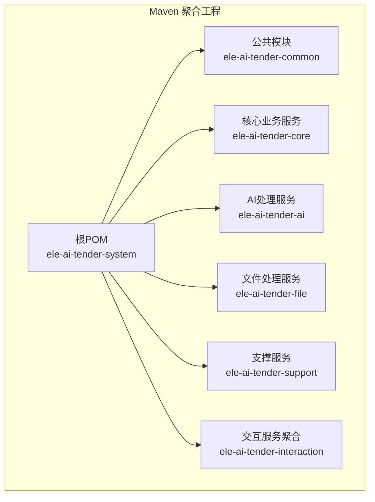

**章节来源**   
- [ele-ai-tender-system/pom.xml:15-22](file://ele-ai-tender-system/pom.xml#L15-L22)

### 交互服务模块层次结构优化

**更新** 交互服务现已采用优化的多层模块结构，提升了代码组织和可维护性

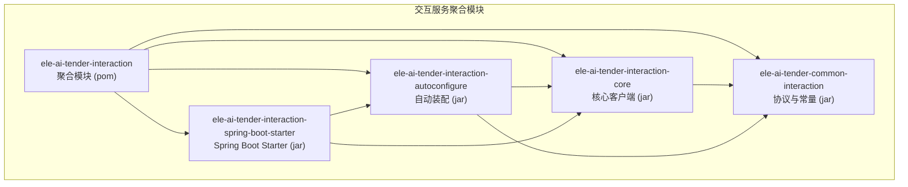

**图表来源**   
- [ele-ai-tender-system/ele-ai-tender-interaction/pom.xml:43-48](file://ele-ai-tender-system/ele-ai-tender-interaction/pom.xml#L43-L48)
- [ele-ai-tender-system/ele-ai-tender-interaction/ele-ai-tender-interaction-core/pom.xml:19-23](file://ele-ai-tender-system/ele-ai-tender-interaction/ele-ai-tender-interaction-core/pom.xml#L19-L23)
- [ele-ai-tender-system/ele-ai-tender-interaction/ele-ai-tender-interaction-autoconfigure/pom.xml:19-27](file://ele-ai-tender-system/ele-ai-tender-interaction/ele-ai-tender-interaction-autoconfigure/pom.xml#L19-L27)
- [ele-ai-tender-system/ele-ai-tender-interaction/ele-ai-tender-interaction-spring-boot-starter/pom.xml:19-27](file://ele-ai-tender-system/ele-ai-tender-interaction/ele-ai-tender-interaction-spring-boot-starter/pom.xml#L19-L27)

**章节来源**   
- [ele-ai-tender-system/ele-ai-tender-interaction/pom.xml:1-64](file://ele-ai-tender-system/ele-ai-tender-interaction/pom.xml#L1-L64)
- [ele-ai-tender-system/ele-ai-tender-interaction/ele-ai-tender-common-interaction/pom.xml:1-49](file://ele-ai-tender-system/ele-ai-tender-interaction/ele-ai-tender-common-interaction/pom.xml#L1-L49)
- [ele-ai-tender-system/ele-ai-tender-interaction/ele-ai-tender-interaction-core/pom.xml:1-55](file://ele-ai-tender-system/ele-ai-tender-interaction/ele-ai-tender-interaction-core/pom.xml#L1-L55)
- [ele-ai-tender-system/ele-ai-tender-interaction/ele-ai-tender-interaction-autoconfigure/pom.xml:1-56](file://ele-ai-tender-system/ele-ai-tender-interaction/ele-ai-tender-interaction-autoconfigure/pom.xml#L1-L56)
- [ele-ai-tender-system/ele-ai-tender-interaction/ele-ai-tender-interaction-spring-boot-starter/pom.xml:1-36](file://ele-ai-tender-system/ele-ai-tender-interaction/ele-ai-tender-interaction-spring-boot-starter/pom.xml#L1-L36)

## 核心组件
- 核心业务服务（core）
  - 负责项目全生命周期编排、阶段推进、AI任务调度与结果同步、检测流程编排、文档集成、消息与政策文件管理等
  - 通过 AI 模块提供的异步任务能力解耦生成过程，自身聚焦"何时生成"与"状态流转"
- AI处理服务（ai）
  - 负责模型路由、任务执行、知识库检索、调用记录与统计、连接性测试等
  - 与 core 通过 ai_task 表异步协作，支持本地/云端/私有化模型动态选择
- 文件处理服务（file）
  - 提供统一文件能力（上传/下载/查询/删除）与文档生成引擎（Word模板填充、Markdown转Word、文本提取与修复）
  - 为 core 提供结构化数据渲染与表格生成能力
- 支撑服务（support）
  - 提供认证鉴权、RBAC、模板/知识库/模型配置、系统参数、消息通知、统计分析、访问/操作日志、版本管理、外部系统接入
- 交互服务（interaction）
  - 提供对外部系统的 SPI 与 Starter，固定路径的 REST 接口，出站客户端能力（token、文件、解密、预存等）
  - **更新** 现采用四层模块化架构，包含协议层、核心层、自动装配层和Starter层

**章节来源**   
- [docs/rules/CORE_MODULE_SPEC.md:1-358](file://docs/rules/CORE_MODULE_SPEC.md#L1-L358)
- [docs/rules/FILE_SERVICE_SPEC.md:1-153](file://docs/rules/FILE_SERVICE_SPEC.md#L1-L153)
- [docs/rules/SUPPORT_SYSTEM_SPEC.md:1-258](file://docs/rules/SUPPORT_SYSTEM_SPEC.md#L1-L258)
- [docs/rules/INTERACTION_INTEGRATION_SPEC.md:1-89](file://docs/rules/INTERACTION_INTEGRATION_SPEC.md#L1-L89)

## 架构总览
系统以 RESTful API 为主的服务间通信方式，结合内部客户端封装与异步任务机制，形成清晰的服务边界与解耦链路。

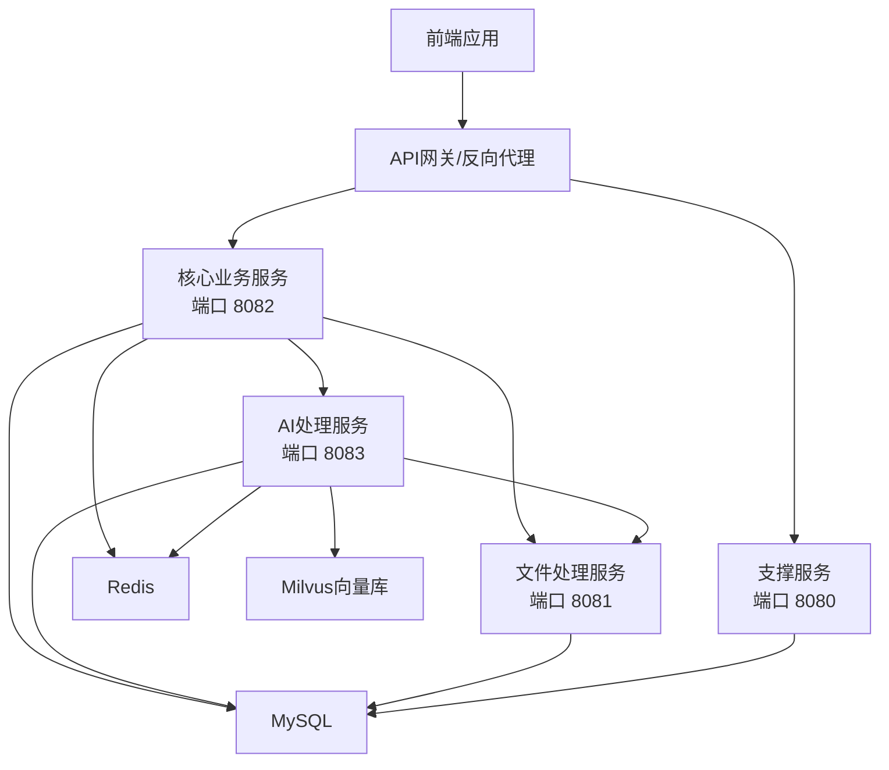

**图表来源**   
- [ele-ai-tender-core/src/main/resources/application.yml:1-59](file://ele-ai-tender-core/src/main/resources/application.yml#L1-L59)
- [ele-ai-tender-ai/src/main/resources/application.yml:1-72](file://ele-ai-tender-ai/src/main/resources/application.yml#L1-L72)
- [ele-ai-tender-file/src/main/resources/application.yml:1-63](file://ele-ai-tender-file/src/main/resources/application.yml#L1-L63)
- [ele-ai-tender-support/src/main/resources/application.yml:1-68](file://ele-ai-tender-support/src/main/resources/application.yml#L1-L68)

## 详细组件分析

### 核心业务服务（ele-ai-tender-core）
- 职责边界
  - 项目管理、阶段推进、AI任务编排与结果同步、检测流程编排、文档集成、消息中心、政策文件、模板快照等
- 关键约束
  - 项目状态与编制阶段严格顺序流转；AI任务通过 status + result_synced 双维度判断真实进度
  - 与 AI 模块通过 ai_task 表异步解耦，core 仅负责"何时生成"
- 对外接口
  - 项目、需求、评审项、检测、文档集成、模板、AI任务、反馈、消息、政策文件等 REST 接口

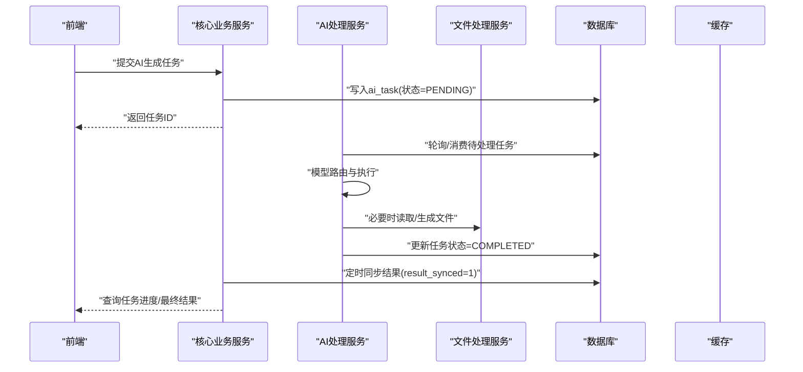

**图表来源**   
- [docs/rules/CORE_MODULE_SPEC.md:155-214](file://docs/rules/CORE_MODULE_SPEC.md#L155-L214)

**章节来源**   
- [docs/rules/CORE_MODULE_SPEC.md:1-358](file://docs/rules/CORE_MODULE_SPEC.md#L1-L358)
- [ele-ai-tender-core/src/main/java/com/jy/eleaitender/core/CoreApplication.java:1-24](file://ele-ai-tender-core/src/main/java/com/jy/eleaitender/core/CoreApplication.java#L1-L24)
- [ele-ai-tender-core/src/main/resources/application.yml:1-59](file://ele-ai-tender-core/src/main/resources/application.yml#L1-L59)

### AI处理服务（ele-ai-tender-ai）
- 职责边界
  - 模型路由（LOCAL/CLOUD/PRIVATE）、任务执行、知识库检索、调用记录、连接性测试
- 关键约束
  - 模型配置由支撑服务管理，运行时由 AI 模块路由；Token 用量统计与限流
- 与外部依赖
  - MySQL、Redis、Milvus（向量库）、OpenAI/DeepSeek 等

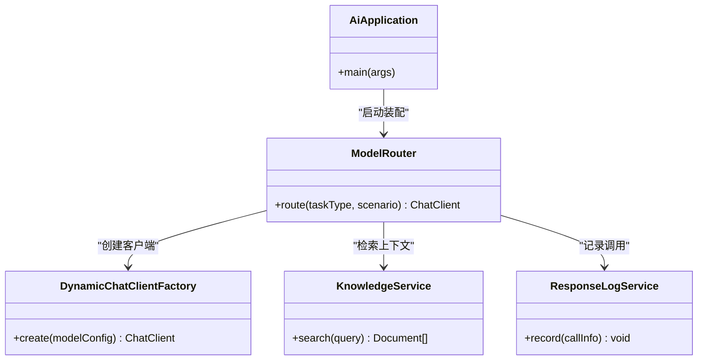

**图表来源**   
- [ele-ai-tender-ai/src/main/java/com/jy/eleaitender/ai/AiApplication.java:1-26](file://ele-ai-tender-ai/src/main/java/com/jy/eleaitender/ai/AiApplication.java#L1-L26)
- [docs/rules/CORE_MODULE_SPEC.md:295-330](file://docs/rules/CORE_MODULE_SPEC.md#L295-L330)

**章节来源**   
- [ele-ai-tender-ai/src/main/java/com/jy/eleaitender/ai/AiApplication.java:1-26](file://ele-ai-tender-ai/src/main/java/com/jy/eleaitender/ai/AiApplication.java#L1-L26)
- [ele-ai-tender-ai/src/main/resources/application.yml:1-72](file://ele-ai-tender-ai/src/main/resources/application.yml#L1-L72)
- [docs/rules/CORE_MODULE_SPEC.md:295-330](file://docs/rules/CORE_MODULE_SPEC.md#L295-L330)

### 文件处理服务（ele-ai-tender-file）
- 职责边界
  - 文件上传/下载/查询/删除；文档生成引擎（Word模板填充、Markdown转Word、文本提取与修复）
- 关键约束
  - poi-tl 原生引擎、占位符语法、两阶段渲染、表格生成边框设置、修订标记预处理
- 内部接口
  - /api/file/upload、download、info、delete、extract-text、structure、generate-doc、fix-doc

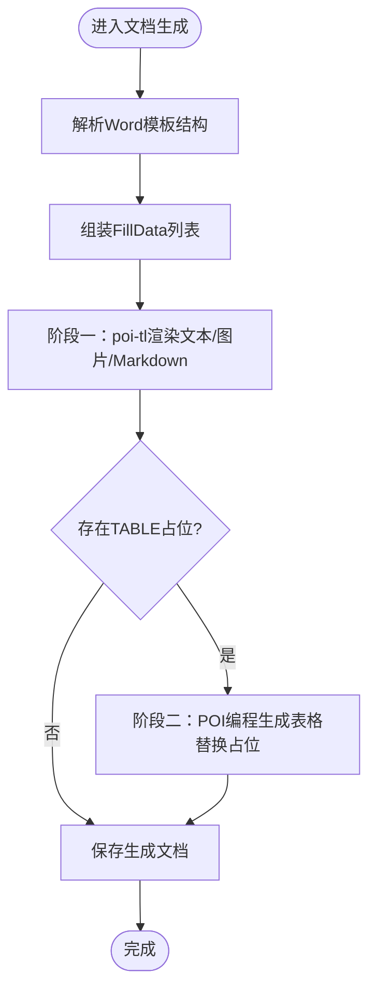

**图表来源**   
- [docs/rules/FILE_SERVICE_SPEC.md:33-72](file://docs/rules/FILE_SERVICE_SPEC.md#L33-L72)

**章节来源**   
- [docs/rules/FILE_SERVICE_SPEC.md:1-153](file://docs/rules/FILE_SERVICE_SPEC.md#L1-L153)
- [ele-ai-tender-file/src/main/java/com/jy/eleaitender/file/FileApplication.java:1-18](file://ele-ai-tender-file/src/main/java/com/jy/eleaitender/file/FileApplication.java#L1-L18)
- [ele-ai-tender-file/src/main/resources/application.yml:1-63](file://ele-ai-tender-file/src/main/resources/application.yml#L1-L63)

### 支撑服务（ele-ai-tender-support）
- 职责边界
  - 认证鉴权、RBAC、模板/知识库/模型配置、系统参数、政策文件、消息通知、统计分析、访问/操作日志、版本管理、外部系统对接
- 关键约束
  - JWT 双轨（内部/外部）、外部系统 HMAC-SHA256 签名、模板按类别+类型双维度配置、模型配置种子数据

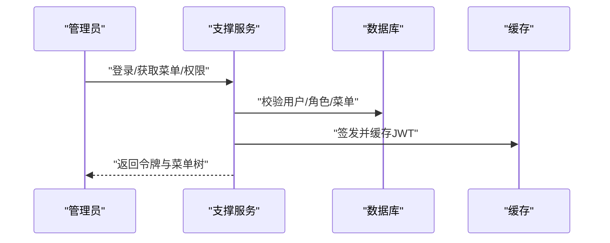

**图表来源**   
- [docs/rules/SUPPORT_SYSTEM_SPEC.md:221-232](file://docs/rules/SUPPORT_SYSTEM_SPEC.md#L221-L232)

**章节来源**   
- [docs/rules/SUPPORT_SYSTEM_SPEC.md:1-258](file://docs/rules/SUPPORT_SYSTEM_SPEC.md#L1-L258)
- [ele-ai-tender-support/src/main/java/com/jy/eleaitender/support/SupportApplication.java:1-21](file://ele-ai-tender-support/src/main/java/com/jy/eleaitender/support/SupportApplication.java#L1-L21)
- [ele-ai-tender-support/src/main/resources/application.yml:1-68](file://ele-ai-tender-support/src/main/resources/application.yml#L1-L68)

### 交互服务（ele-ai-tender-interaction）

**更新** 交互服务现已采用优化的四层模块化架构，提升了代码组织性和可维护性

- 定位与组成
  - 对外部系统的集成能力，包含 SPI 实现与 Starter 自动装配，兼容 JDK 8 与 Spring Boot 2.7.x
  - **新增** 四层模块结构：协议层（common-interaction）、核心层（interaction-core）、自动装配层（autoconfigure）、Starter层（spring-boot-starter）
- 固定路径与出站能力
  - 固定前缀 /api/eleAiTender/interaction，提供身份、项目信息、标书方案、CA密钥、回调等接口；出站客户端支持 token、文件、解密、预存等

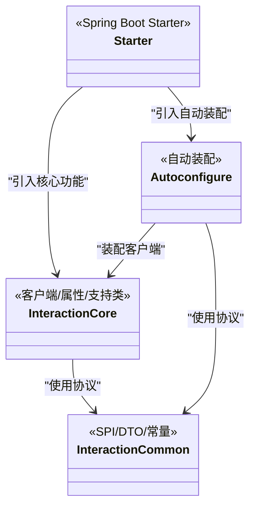

**图表来源**   
- [docs/rules/INTERACTION_INTEGRATION_SPEC.md:1-89](file://docs/rules/INTERACTION_INTEGRATION_SPEC.md#L1-L89)
- [ele-ai-tender-system/ele-ai-tender-interaction/pom.xml:43-48](file://ele-ai-tender-system/ele-ai-tender-interaction/pom.xml#L43-L48)

**章节来源**   
- [docs/rules/INTERACTION_INTEGRATION_SPEC.md:1-89](file://docs/rules/INTERACTION_INTEGRATION_SPEC.md#L1-L89)
- [ele-ai-tender-system/ele-ai-tender-interaction/pom.xml:1-64](file://ele-ai-tender-system/ele-ai-tender-interaction/pom.xml#L1-L64)

## 依赖关系分析
- 模块依赖
  - 所有业务服务均依赖公共模块（common），用于共享实体、枚举、DTO、工具与内部客户端
  - core 与 ai 依赖 common，并通过 REST 与 file 服务交互；ai 额外依赖 Milvus 与 OpenAI/DeepSeek
  - support 提供认证与配置能力，被其他服务在安全与配置层面复用
  - **更新** 交互服务采用分层依赖：core依赖common，autoconfigure依赖core和common，starter依赖core和autoconfigure
- 内部客户端封装
  - InternalFileServiceClient 封装对 file 服务的上传、下载、结构解析、文档生成、文本提取与修复等调用，内置服务间 JWT 认证与错误响应解析

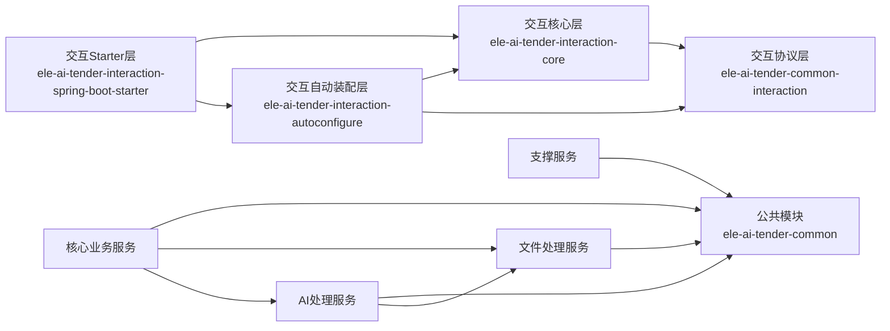

**图表来源**   
- [ele-ai-tender-system/pom.xml:79-124](file://ele-ai-tender-system/pom.xml#L79-L124)
- [ele-ai-tender-system/ele-ai-tender-interaction/ele-ai-tender-interaction-core/pom.xml:19-23](file://ele-ai-tender-system/ele-ai-tender-interaction/ele-ai-tender-interaction-core/pom.xml#L19-L23)
- [ele-ai-tender-system/ele-ai-tender-interaction/ele-ai-tender-interaction-autoconfigure/pom.xml:19-27](file://ele-ai-tender-system/ele-ai-tender-interaction/ele-ai-tender-interaction-autoconfigure/pom.xml#L19-L27)
- [ele-ai-tender-system/ele-ai-tender-interaction/ele-ai-tender-interaction-spring-boot-starter/pom.xml:19-27](file://ele-ai-tender-system/ele-ai-tender-interaction/ele-ai-tender-interaction-spring-boot-starter/pom.xml#L19-L27)
- [ele-ai-tender-common/src/main/java/com/jy/eleaitender/common/client/InternalFileServiceClient.java:1-362](file://ele-ai-tender-common/src/main/java/com/jy/eleaitender/common/client/InternalFileServiceClient.java#L1-L362)

**章节来源**   
- [ele-ai-tender-system/pom.xml:1-259](file://ele-ai-tender-system/pom.xml#L1-L259)
- [ele-ai-tender-common/src/main/java/com/jy/eleaitender/common/client/InternalFileServiceClient.java:1-362](file://ele-ai-tender-common/src/main/java/com/jy/eleaitender/common/client/InternalFileServiceClient.java#L1-L362)

## 性能与可扩展性
- 异步解耦
  - core 与 ai 通过 ai_task 表异步协作，避免长请求阻塞，提升吞吐与用户体验
- 模型路由与缓存
  - AI 模块根据 usage_scenario 与优先级动态选择模型，配合缓存减少配置读取开销
- 文件处理优化
  - 两阶段渲染与表格编程生成规避模板循环标签限制，提高稳定性与性能
- 分布式锁与限流
  - 使用 Redisson 实现分布式锁与 Token 用量统计，保障并发安全与资源可控
- **新增** 模块化架构优势
  - 交互服务分层设计提升了编译性能和构建效率
  - 清晰的依赖边界减少了不必要的依赖传递
  - 独立的协议层便于版本管理和向后兼容

## 故障排查指南
- 核心业务
  - 项目状态异常：检查 tb_project.status 与阶段推进逻辑
  - AI任务失败：查看 ai_task 状态与 result_synced，确认 AI 服务可用性与模型配置
- 文件服务
  - 上传失败：检查白名单、大小限制、存储目录权限
  - 下载 404：核对 file_info.file_path 与实际文件一致性
  - locationRef 定位失败：检查 elementIndex 越界与 WordTextExtractor 是否执行
- 支撑服务
  - 登录失败：检查 sup_user.status 与 Redis 中的 token
  - 外部认证签名失败：核对 app_secret 与时间戳偏差
- 内部客户端
  - 错误响应处理：InternalFileServiceClient 必须检查 code 字段并抛出具体错误
- **新增** 交互服务
  - 模块依赖问题：检查各层模块间的依赖声明是否正确
  - 自动装配失败：确认Spring Boot Starter是否正确引入
  - 协议版本不匹配：确保common-interaction版本与其他模块一致

**章节来源**   
- [docs/rules/CORE_MODULE_SPEC.md:342-350](file://docs/rules/CORE_MODULE_SPEC.md#L342-L350)
- [docs/rules/FILE_SERVICE_SPEC.md:139-147](file://docs/rules/FILE_SERVICE_SPEC.md#L139-L147)
- [docs/rules/SUPPORT_SYSTEM_SPEC.md:243-251](file://docs/rules/SUPPORT_SYSTEM_SPEC.md#L243-L251)
- [ele-ai-tender-common/src/main/java/com/jy/eleaitender/common/client/InternalFileServiceClient.java:313-343](file://ele-ai-tender-common/src/main/java/com/jy/eleaitender/common/client/InternalFileServiceClient.java#L313-L343)

## 结论
本架构通过清晰的微服务拆分与职责边界，结合 RESTful API、内部客户端封装与异步任务机制，实现了高内聚、低耦合的系统设计。**更新的交互服务模块化架构进一步提升了代码组织性和可维护性**。Maven 多模块与公共模块的统一版本管理保障了依赖一致性与可维护性。未来可在服务治理、可观测性与弹性伸缩方面进一步增强，以提升整体稳定性与扩展性。

## 附录

### 部署拓扑图
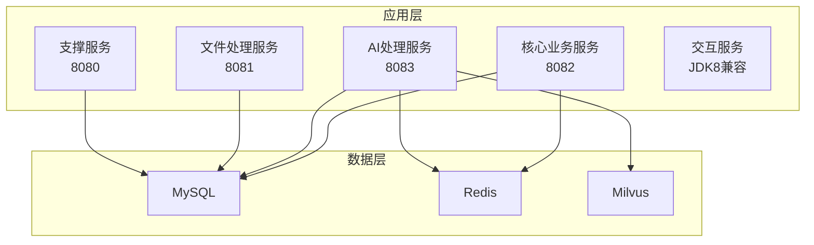

**图表来源**   
- [ele-ai-tender-core/src/main/resources/application.yml:16-27](file://ele-ai-tender-core/src/main/resources/application.yml#L16-L27)
- [ele-ai-tender-ai/src/main/resources/application.yml:16-27](file://ele-ai-tender-ai/src/main/resources/application.yml#L16-L27)
- [ele-ai-tender-file/src/main/resources/application.yml:20-31](file://ele-ai-tender-file/src/main/resources/application.yml#L20-31)
- [ele-ai-tender-support/src/main/resources/application.yml:16-27](file://ele-ai-tender-support/src/main/resources/application.yml#L16-L27)

### 交互服务模块依赖详情

**更新** 交互服务的新模块层次结构提供了更好的代码组织和维护性

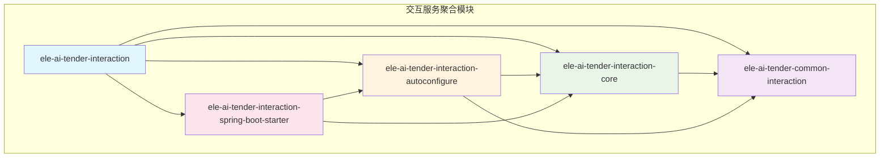

**图表来源**   
- [ele-ai-tender-system/ele-ai-tender-interaction/pom.xml:43-48](file://ele-ai-tender-system/ele-ai-tender-interaction/pom.xml#L43-L48)
- [ele-ai-tender-system/ele-ai-tender-interaction/ele-ai-tender-interaction-core/pom.xml:19-23](file://ele-ai-tender-system/ele-ai-tender-interaction/ele-ai-tender-interaction-core/pom.xml#L19-L23)
- [ele-ai-tender-system/ele-ai-tender-interaction/ele-ai-tender-interaction-autoconfigure/pom.xml:19-27](file://ele-ai-tender-system/ele-ai-tender-interaction/ele-ai-tender-interaction-autoconfigure/pom.xml#L19-L27)
- [ele-ai-tender-system/ele-ai-tender-interaction/ele-ai-tender-interaction-spring-boot-starter/pom.xml:19-27](file://ele-ai-tender-system/ele-ai-tender-interaction/ele-ai-tender-interaction-spring-boot-starter/pom.xml#L19-L27)