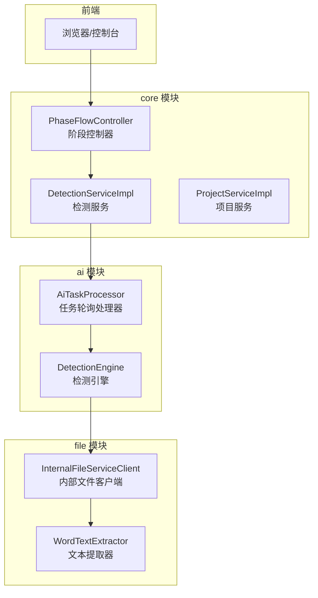
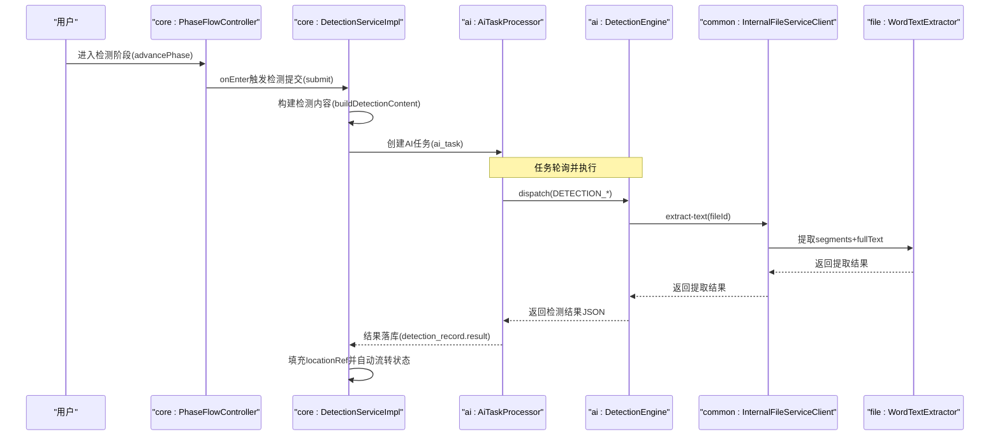
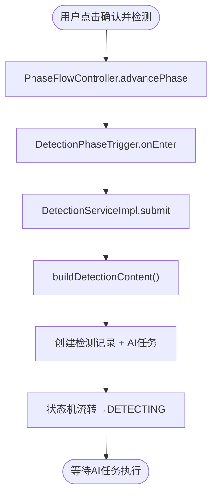
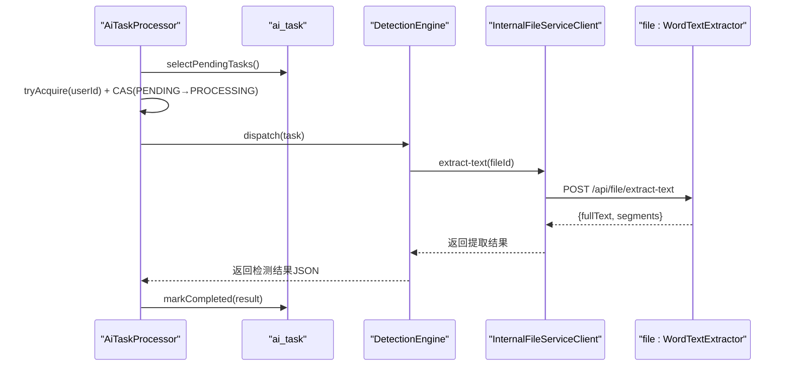
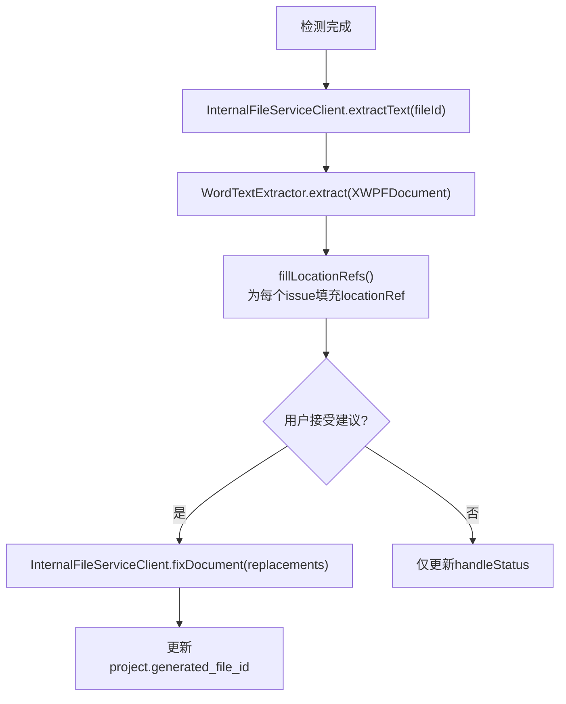
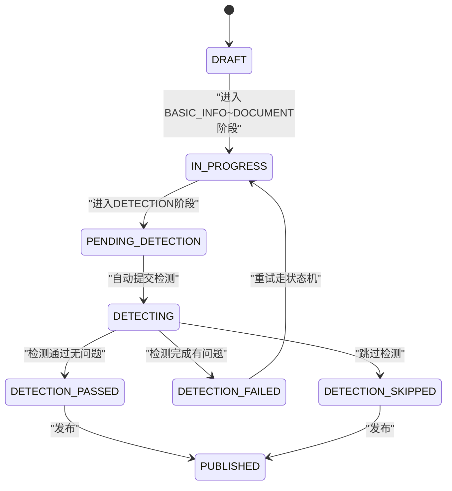
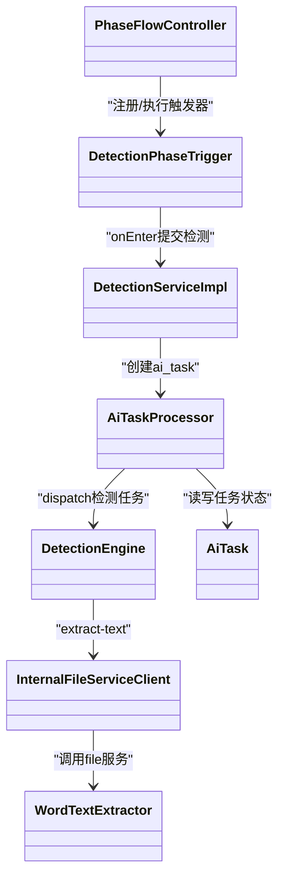

# 数据流设计

<cite>
**本文引用的文件**   
- [PhaseFlowController.java](file://ele-ai-tender-system/ele-ai-tender-core/src/main/java/com/jy/eleaitender/core/statemachine/PhaseFlowController.java)
- [DetectionPhaseTrigger.java](file://ele-ai-tender-system/ele-ai-tender-core/src/main/java/com/jy/eleaitender/core/statemachine/trigger/DetectionPhaseTrigger.java)
- [DetectionServiceImpl.java](file://ele-ai-tender-system/ele-ai-tender-core/src/main/java/com/jy/eleaitender/core/service/impl/DetectionServiceImpl.java)
- [AiTaskProcessor.java](file://ele-ai-tender-system/ele-ai-tender-ai/src/main/java/com/jy/eleaitender/ai/processor/AiTaskProcessor.java)
- [DetectionEngine.java](file://ele-ai-tender-system/ele-ai-tender-ai/src/main/java/com/jy/eleaitender/ai/processor/checker/DetectionEngine.java)
- [InternalFileServiceClient.java](file://ele-ai-tender-system/ele-ai-tender-common/src/main/java/com/jy/eleaitender/common/client/InternalFileServiceClient.java)
- [WordTextExtractor.java](file://ele-ai-tender-system/ele-ai-tender-file/src/main/java/com/jy/eleaitender/file/engine/WordTextExtractor.java)
- [AiTask.java](file://ele-ai-tender-system/ele-ai-tender-common/src/main/java/com/jy/eleaitender/common/entity/ai/AiTask.java)
- [ProjectServiceImpl.java](file://ele-ai-tender-system/ele-ai-tender-core/src/main/java/com/jy/eleaitender/core/service/impl/ProjectServiceImpl.java)
- [CORE_MODULE_SPEC.md](file://docs/rules/CORE_MODULE_SPEC.md)
- [DETECTION_FLOW_SPEC.md](file://docs/rules/DETECTION_FLOW_SPEC.md)
- [PHASE_FLOW_SPEC.md](file://docs/rules/PHASE_FLOW_SPEC.md)
- [FILE_SERVICE_SPEC.md](file://docs/rules/FILE_SERVICE_SPEC.md)
</cite>

## 目录
1. [引言](#引言)
2. [项目结构](#项目结构)
3. [核心组件](#核心组件)
4. [架构总览](#架构总览)
5. [详细组件分析](#详细组件分析)
6. [依赖关系分析](#依赖关系分析)
7. [性能与并发特性](#性能与并发特性)
8. [故障排查指南](#故障排查指南)
9. [结论](#结论)

## 引言
本文件面向“招标文件AI编制系统”的数据流设计，聚焦从用户操作到最终结果的完整数据处理路径。文档覆盖以下关键流程：
- 用户请求处理流程（阶段推进、检测提交）
- AI任务执行流程（轮询、分发、结果落库）
- 文件处理流程（文本提取、定位、修复）
- 状态同步流程（任务进度、业务状态联动）

同时说明服务间数据传递机制（请求参数封装、响应转换、异常信息）、异步任务处理机制（队列管理、结果回调、状态更新策略），并提供数据流图、时序图和状态转换图，帮助开发者理解系统的数据处理逻辑。

## 项目结构
系统采用多模块微服务架构，核心数据流转涉及以下模块与职责：
- core 模块：项目管理、阶段编排、检测编排、版本快照、消息通知
- ai 模块：AI任务调度、检测引擎编排、模型路由与调用
- file 模块：文件上传下载、Word文本提取、文档修复
- common 模块：内部服务客户端、通用实体与枚举、工具类

图表来源
- [PhaseFlowController.java:1-176](file://ele-ai-tender-system/ele-ai-tender-core/src/main/java/com/jy/eleaitender/core/statemachine/PhaseFlowController.java#L1-L176)
- [DetectionServiceImpl.java:1-578](file://ele-ai-tender-system/ele-ai-tender-core/src/main/java/com/jy/eleaitender/core/service/impl/DetectionServiceImpl.java#L1-L578)
- [AiTaskProcessor.java:1-196](file://ele-ai-tender-system/ele-ai-tender-ai/src/main/java/com/jy/eleaitender/ai/processor/AiTaskProcessor.java#L1-L196)
- [DetectionEngine.java:1-126](file://ele-ai-tender-system/ele-ai-tender-ai/src/main/java/com/jy/eleaitender/ai/processor/checker/DetectionEngine.java#L1-L126)
- [InternalFileServiceClient.java:1-362](file://ele-ai-tender-system/ele-ai-tender-common/src/main/java/com/jy/eleaitender/common/client/InternalFileServiceClient.java#L1-L362)
- [WordTextExtractor.java:1-202](file://ele-ai-tender-system/ele-ai-tender-file/src/main/java/com/jy/eleaitender/file/engine/WordTextExtractor.java#L1-L202)

章节来源
- [CORE_MODULE_SPEC.md](file://docs/rules/CORE_MODULE_SPEC.md)
- [DETECTION_FLOW_SPEC.md](file://docs/rules/DETECTION_FLOW_SPEC.md)
- [PHASE_FLOW_SPEC.md](file://docs/rules/PHASE_FLOW_SPEC.md)
- [FILE_SERVICE_SPEC.md](file://docs/rules/FILE_SERVICE_SPEC.md)

## 核心组件
- 阶段流程控制器（PhaseFlowController）：负责阶段推进校验、触发器注册与执行、Phase-Status联动。
- 检测服务（DetectionServiceImpl）：编排检测内容构建、创建检测记录与AI任务、接受/拒绝建议、批量修复、重试与自动通过判定。
- AI任务处理器（AiTaskProcessor）：定时轮询PENDING任务，并发控制后提交动态线程池执行，按类型分发至具体处理器。
- 检测引擎（DetectionEngine）：根据任务类型选择检测器，组装输入内容并返回检测结果JSON。
- 内部文件客户端（InternalFileServiceClient）：封装对file模块的HTTP调用，提供上传、下载、结构解析、生成文档、修复文档、文本提取等能力，并维护服务间JWT认证。
- Word文本提取器（WordTextExtractor）：从Word文档提取段落级文本与位置索引，支持规范化匹配与二分定位。
- AI任务实体（AiTask）：承载任务类型、关联项目/业务ID、请求参数、状态、结果、错误信息、超时与结果同步标记。

章节来源
- [PhaseFlowController.java:1-176](file://ele-ai-tender-system/ele-ai-tender-core/src/main/java/com/jy/eleaitender/core/statemachine/PhaseFlowController.java#L1-L176)
- [DetectionServiceImpl.java:1-578](file://ele-ai-tender-system/ele-ai-tender-core/src/main/java/com/jy/eleaitender/core/service/impl/DetectionServiceImpl.java#L1-L578)
- [AiTaskProcessor.java:1-196](file://ele-ai-tender-system/ele-ai-tender-ai/src/main/java/com/jy/eleaitender/ai/processor/AiTaskProcessor.java#L1-L196)
- [DetectionEngine.java:1-126](file://ele-ai-tender-system/ele-ai-tender-ai/src/main/java/com/jy/eleaitender/ai/processor/checker/DetectionEngine.java#L1-L126)
- [InternalFileServiceClient.java:1-362](file://ele-ai-tender-system/ele-ai-tender-common/src/main/java/com/jy/eleaitender/common/client/InternalFileServiceClient.java#L1-L362)
- [WordTextExtractor.java:1-202](file://ele-ai-tender-system/ele-ai-tender-file/src/main/java/com/jy/eleaitender/file/engine/WordTextExtractor.java#L1-L202)
- [AiTask.java:1-77](file://ele-ai-tender-system/ele-ai-tender-common/src/main/java/com/jy/eleaitender/common/entity/ai/AiTask.java#L1-L77)

## 架构总览
整体数据流围绕“阶段推进 → 检测提交 → AI任务执行 → 结果同步 → 文档修复 → 状态流转”展开。

图表来源
- [PhaseFlowController.java:1-176](file://ele-ai-tender-system/ele-ai-tender-core/src/main/java/com/jy/eleaitender/core/statemachine/PhaseFlowController.java#L1-L176)
- [DetectionPhaseTrigger.java:1-71](file://ele-ai-tender-system/ele-ai-tender-core/src/main/java/com/jy/eleaitender/core/statemachine/trigger/DetectionPhaseTrigger.java#L1-L71)
- [DetectionServiceImpl.java:1-578](file://ele-ai-tender-system/ele-ai-tender-core/src/main/java/com/jy/eleaitender/core/service/impl/DetectionServiceImpl.java#L1-L578)
- [AiTaskProcessor.java:1-196](file://ele-ai-tender-system/ele-ai-tender-ai/src/main/java/com/jy/eleaitender/ai/processor/AiTaskProcessor.java#L1-L196)
- [DetectionEngine.java:1-126](file://ele-ai-tender-system/ele-ai-tender-ai/src/main/java/com/jy/eleaitender/ai/processor/checker/DetectionEngine.java#L1-L126)
- [InternalFileServiceClient.java:1-362](file://ele-ai-tender-system/ele-ai-tender-common/src/main/java/com/jy/eleaitender/common/client/InternalFileServiceClient.java#L1-L362)
- [WordTextExtractor.java:1-202](file://ele-ai-tender-system/ele-ai-tender-file/src/main/java/com/jy/eleaitender/file/engine/WordTextExtractor.java#L1-L202)

## 详细组件分析

### 用户请求处理流程（阶段推进与检测提交）
- 阶段推进由 PhaseFlowController 统一管控，校验只能顺序推进到下一阶段；在进入目标阶段时执行对应触发器的 onEnter。
- 检测阶段触发器 DetectionPhaseTrigger.onEnter 从上下文提取政策文件ID列表，构造 DetectionSubmitRequest 并调用 DetectionServiceImpl.submit。
- submit 方法：
  - 构建检测内容（仅系统生成的需求内容与评审项标准纯文本）
  - 为每种检测类型创建 tb_detection_record 与 ai_task 记录
  - 更新项目状态机流转至 DETECTING

图表来源
- [PhaseFlowController.java:1-176](file://ele-ai-tender-system/ele-ai-tender-core/src/main/java/com/jy/eleaitender/core/statemachine/PhaseFlowController.java#L1-L176)
- [DetectionPhaseTrigger.java:1-71](file://ele-ai-tender-system/ele-ai-tender-core/src/main/java/com/jy/eleaitender/core/statemachine/trigger/DetectionPhaseTrigger.java#L1-L71)
- [DetectionServiceImpl.java:1-578](file://ele-ai-tender-system/ele-ai-tender-core/src/main/java/com/jy/eleaitender/core/service/impl/DetectionServiceImpl.java#L1-L578)

章节来源
- [PHASE_FLOW_SPEC.md](file://docs/rules/PHASE_FLOW_SPEC.md)
- [DETECTION_FLOW_SPEC.md](file://docs/rules/DETECTION_FLOW_SPEC.md)

### AI任务执行流程（轮询、分发、结果落库）
- AiTaskProcessor 每5秒轮询 ai_task 表中的 PENDING 任务，进行并发许可获取与CAS状态更新，随后提交到动态线程池执行。
- 根据 AiTaskType 分派到具体处理器，检测类型统一走 DetectionEngine.detect。
- DetectionEngine 解析请求参数，必要时调用文件服务提取内容，再调用具体检测器完成检测，返回 JSON 结果。
- 结果写入 ai_task.result，后续由同步处理器将结果落库到 tb_detection_record.result，并填充 locationRef。

图表来源
- [AiTaskProcessor.java:1-196](file://ele-ai-tender-system/ele-ai-tender-ai/src/main/java/com/jy/eleaitender/ai/processor/AiTaskProcessor.java#L1-L196)
- [DetectionEngine.java:1-126](file://ele-ai-tender-system/ele-ai-tender-ai/src/main/java/com/jy/eleaitender/ai/processor/checker/DetectionEngine.java#L1-L126)
- [InternalFileServiceClient.java:1-362](file://ele-ai-tender-system/ele-ai-tender-common/src/main/java/com/jy/eleaitender/common/client/InternalFileServiceClient.java#L1-L362)
- [WordTextExtractor.java:1-202](file://ele-ai-tender-system/ele-ai-tender-file/src/main/java/com/jy/eleaitender/file/engine/WordTextExtractor.java#L1-L202)

章节来源
- [CORE_MODULE_SPEC.md](file://docs/rules/CORE_MODULE_SPEC.md)

### 文件处理流程（文本提取、定位、修复）
- 文本提取：InternalFileServiceClient.extractText 调用 file 模块 /api/file/extract-text，返回 fullText 与 segments（段落/表格单元格的 elementIndex 与偏移量）。
- 定位填充：检测完成后，使用 WordTextExtractor.locate 在 segments 中定位 original 文本所在元素，生成 LocationRefVO 嵌入 detection_record.result。
- 文档修复：acceptIssue/acceptAll 通过 InternalFileServiceClient.fixDocument 调用 /api/file/fix-doc，基于 FixReplacement 携带 locationRef 精准替换，成功后更新 project.generated_file_id。

图表来源
- [InternalFileServiceClient.java:1-362](file://ele-ai-tender-system/ele-ai-tender-common/src/main/java/com/jy/eleaitender/common/client/InternalFileServiceClient.java#L1-L362)
- [WordTextExtractor.java:1-202](file://ele-ai-tender-system/ele-ai-tender-file/src/main/java/com/jy/eleaitender/file/engine/WordTextExtractor.java#L1-L202)
- [DetectionServiceImpl.java:1-578](file://ele-ai-tender-system/ele-ai-tender-core/src/main/java/com/jy/eleaitender/core/service/impl/DetectionServiceImpl.java#L1-L578)

章节来源
- [FILE_SERVICE_SPEC.md](file://docs/rules/FILE_SERVICE_SPEC.md)
- [DETECTION_FLOW_SPEC.md](file://docs/rules/DETECTION_FLOW_SPEC.md)

### 状态同步流程（任务进度与业务状态联动）
- AI任务进度映射：status=result_synced 双维度决定前端进度显示（PENDING/PROCESSING/COMPLETED/FAILED/AI_UNAVAILABLE/SKIPPED）。
- 检测进度：DetectionProgress 使用独立 API，COMPLETED 直接为 100%。
- 自动流转：当所有问题已处理（无 handleStatus=0），DetectionServiceImpl.tryTransitionToPassed 自动将项目状态转为 DETECTION_PASSED，并创建版本快照。
- 重试流程：必须走状态机 DETECTION_FAILED → IN_PROGRESS → PENDING_DETECTION → DETECTING，不允许直接设置状态。

图表来源
- [DetectionServiceImpl.java:1-578](file://ele-ai-tender-system/ele-ai-tender-core/src/main/java/com/jy/eleaitender/core/service/impl/DetectionServiceImpl.java#L1-L578)
- [PHASE_FLOW_SPEC.md](file://docs/rules/PHASE_FLOW_SPEC.md)
- [DETECTION_FLOW_SPEC.md](file://docs/rules/DETECTION_FLOW_SPEC.md)

章节来源
- [CORE_MODULE_SPEC.md](file://docs/rules/CORE_MODULE_SPEC.md)

## 依赖关系分析
- core 模块依赖 common 的内部文件客户端访问 file 模块；ai 模块通过 DetectionEngine 间接依赖文件服务。
- 阶段触发器与 Service 层存在循环依赖风险，已通过 @Lazy 注入解决。
- 任务调度与并发控制解耦：AiTaskProcessor 负责拉取与并发许可，DynamicThreadPoolManager 负责执行与超时控制。

图表来源
- [PhaseFlowController.java:1-176](file://ele-ai-tender-system/ele-ai-tender-core/src/main/java/com/jy/eleaitender/core/statemachine/PhaseFlowController.java#L1-L176)
- [DetectionPhaseTrigger.java:1-71](file://ele-ai-tender-system/ele-ai-tender-core/src/main/java/com/jy/eleaitender/core/statemachine/trigger/DetectionPhaseTrigger.java#L1-L71)
- [DetectionServiceImpl.java:1-578](file://ele-ai-tender-system/ele-ai-tender-core/src/main/java/com/jy/eleaitender/core/service/impl/DetectionServiceImpl.java#L1-L578)
- [AiTaskProcessor.java:1-196](file://ele-ai-tender-system/ele-ai-tender-ai/src/main/java/com/jy/eleaitender/ai/processor/AiTaskProcessor.java#L1-L196)
- [DetectionEngine.java:1-126](file://ele-ai-tender-system/ele-ai-tender-ai/src/main/java/com/jy/eleaitender/ai/processor/checker/DetectionEngine.java#L1-L126)
- [InternalFileServiceClient.java:1-362](file://ele-ai-tender-system/ele-ai-tender-common/src/main/java/com/jy/eleaitender/common/client/InternalFileServiceClient.java#L1-L362)
- [WordTextExtractor.java:1-202](file://ele-ai-tender-system/ele-ai-tender-file/src/main/java/com/jy/eleaitender/file/engine/WordTextExtractor.java#L1-L202)
- [AiTask.java:1-77](file://ele-ai-tender-system/ele-ai-tender-common/src/main/java/com/jy/eleaitender/common/entity/ai/AiTask.java#L1-L77)

章节来源
- [PHASE_FLOW_SPEC.md](file://docs/rules/PHASE_FLOW_SPEC.md)

## 性能与并发特性
- 任务轮询频率：AiTaskProcessor 每5秒轮询一次，DetectionServiceImpl 每10秒扫描待处理检测记录以同步状态。
- 并发控制：AiTaskProcessor 使用 UserConcurrencyManager 获取并发许可，避免单用户任务过多导致资源争用；CAS更新状态防止重复处理。
- 超时控制：任务执行支持可配置超时分钟数，超时则标记失败并释放并发许可。
- 文件服务限流与大小限制：默认最大文件大小500MB，白名单后缀需正确配置。

章节来源
- [AiTaskProcessor.java:1-196](file://ele-ai-tender-system/ele-ai-tender-ai/src/main/java/com/jy/eleaitender/ai/processor/AiTaskProcessor.java#L1-L196)
- [DetectionServiceImpl.java:1-578](file://ele-ai-tender-system/ele-ai-tender-core/src/main/java/com/jy/eleaitender/core/service/impl/DetectionServiceImpl.java#L1-L578)
- [FILE_SERVICE_SPEC.md](file://docs/rules/FILE_SERVICE_SPEC.md)

## 故障排查指南
- 检测任务不执行：检查 ai_task 是否为 PENDING，AiTaskProcessor 日志是否正常轮询。
- 检测结果为空：检查 tb_detection_record.result JSON，确认 AI 是否返回有效结果。
- locationRef 未填充：检查 AiTaskResultSyncHandler 日志是否报 extractText 或 fillLocationRefs 失败、project.generated_file_id 是否有值。
- 接受建议后文档未修复：检查 issue 的 original/targeted 是否有效、WordDocumentFixEngine 日志是否报告未找到原文、project.generated_file_id 是否已更新、locationRef 是否正确传递。
- 检测后状态未流转：检查是否所有 detection_record 已终态、是否仍有 handleStatus=0 的问题。
- 模板内容被误报为问题：检测仅作用于 buildDetectionContent（需求内容+评审项标准纯文本），模板内容不在检测范围；确认 content_file_id 为 null、content_snapshot 仅含需求与评审项。

章节来源
- [DETECTION_FLOW_SPEC.md](file://docs/rules/DETECTION_FLOW_SPEC.md)
- [FILE_SERVICE_SPEC.md](file://docs/rules/FILE_SERVICE_SPEC.md)

## 结论
本数据流设计通过“阶段控制器 + 检测服务 + AI任务调度 + 文件服务”的协作，实现了从用户操作到智能检测与文档修复的闭环。关键要点包括：
- 严格的状态机与阶段推进规则，确保流程可控
- 异步任务与并发控制保障高吞吐与稳定性
- 基于 locationRef 的精准定位与修复提升用户体验
- 明确的服务间数据契约与异常传递机制，便于排障与扩展