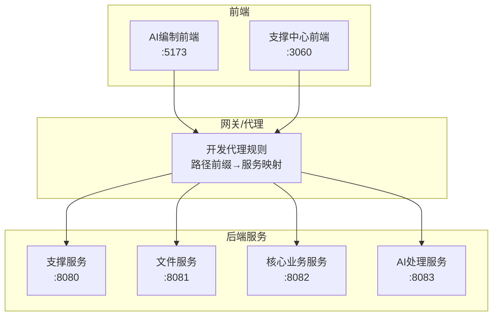
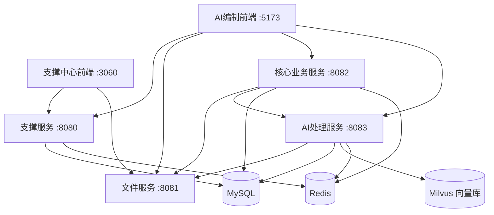
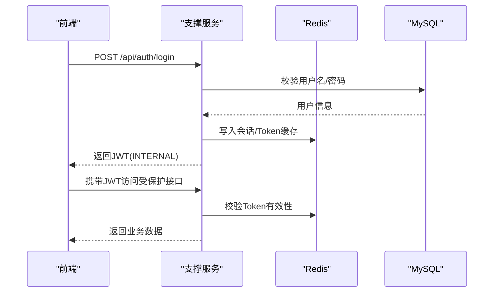
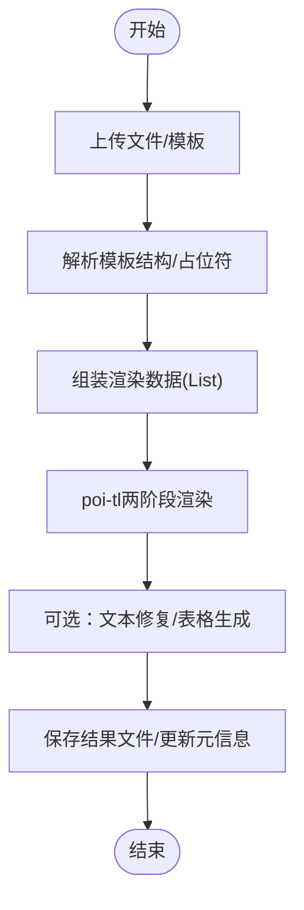
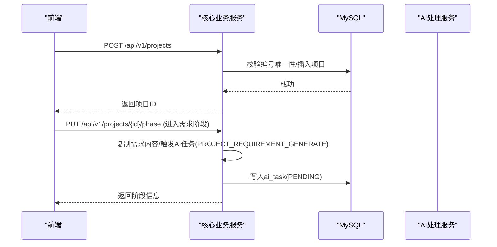
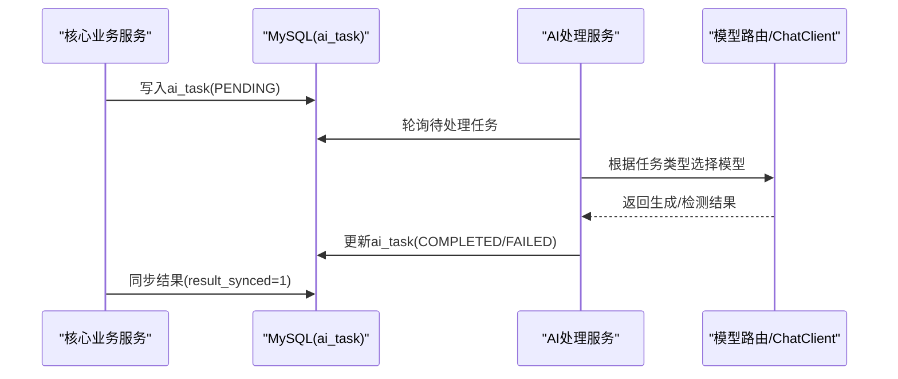
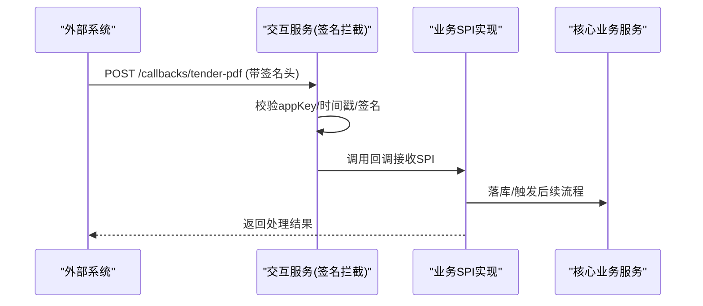
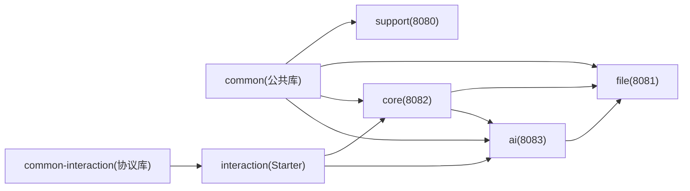
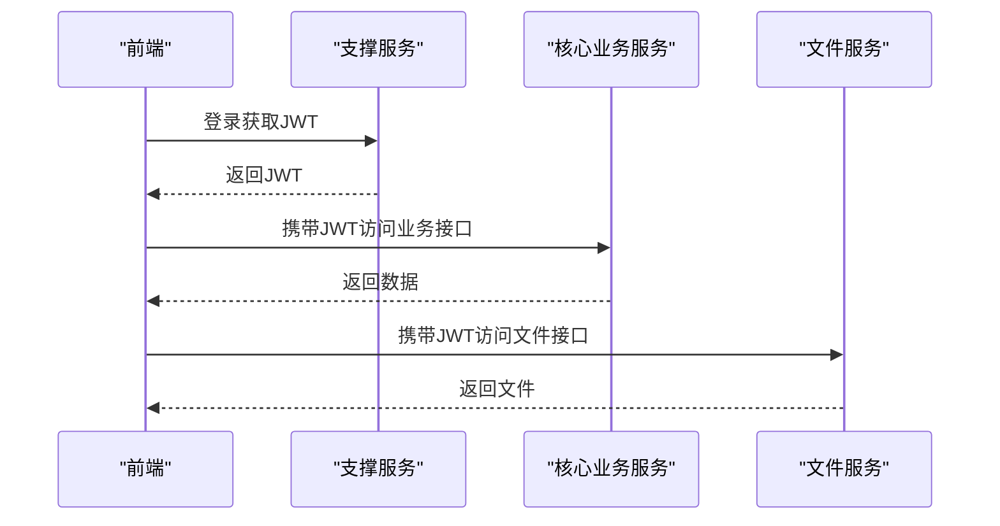
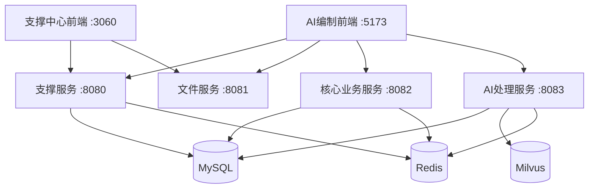

# 架构设计

<cite>
**本文引用的文件**
- [PROJECT_SPEC_FINAL.md](file://docs/rules/PROJECT_SPEC_FINAL.md)
- [CORE_MODULE_SPEC.md](file://docs/rules/CORE_MODULE_SPEC.md)
- [FILE_SERVICE_SPEC.md](file://docs/rules/FILE_SERVICE_SPEC.md)
- [SUPPORT_SYSTEM_SPEC.md](file://docs/rules/SUPPORT_SYSTEM_SPEC.md)
- [INTERACTION_INTEGRATION_SPEC.md](file://docs/rules/INTERACTION_INTEGRATION_SPEC.md)
- [FRONTEND_CONVENTIONS.md](file://docs/rules/FRONTEND_CONVENTIONS.md)
</cite>

## 更新摘要
**所做变更**
- 移除了独立的系统架构设计文档，相关内容已整合到项目README中
- 更新了文档结构以反映当前项目状态
- 保留了核心架构概念和技术细节
- 简化了文档组织，避免内容重复

## 目录
1. [引言](#引言)
2. [项目结构](#项目结构)
3. [核心组件](#核心组件)
4. [架构总览](#架构总览)
5. [详细组件分析](#详细组件分析)
6. [依赖关系分析](#依赖关系分析)
7. [性能与扩展性](#性能与扩展性)
8. [故障排查指南](#故障排查指南)
9. [结论](#结论)
10. [附录](#附录)

## 引言
本架构设计文档面向"招标文件AI编制系统"的开发者与运维人员，系统性阐述微服务拆分原则、通信机制、数据流向与依赖关系；明确各核心服务的职责边界（核心业务服务 ele-ai-tender-core、AI处理服务 ele-ai-tender-ai、文件处理服务 ele-ai-tender-file、支撑服务 ele-ai-tender-support、交互服务 ele-ai-tender-interaction）；并给出前后端分离的实现方案（API规范、认证授权、跨域策略），辅以系统架构图、组件交互图与部署拓扑图，帮助理解整体设计与扩展方式。

**注意**：原独立的系统架构设计文档已删除，相关架构信息已整合到项目README文件中，以避免内容重复和维护复杂性。

## 项目结构
系统采用多模块 Maven 工程组织，后端为 Spring Boot 微服务集群，前端为两个独立 Vue 3 应用：
- 支撑中心管理后台（端口 3060）
- AI编制业务前端（端口 5173）

后端模块清单与端口：
- ele-ai-tender-support（8080）
- ele-ai-tender-file（8081）
- ele-ai-tender-core（8082）
- ele-ai-tender-ai（8083）
- ele-ai-tender-common（公共库）
- ele-ai-tender-common-interaction（协议库）
- ele-ai-tender-interaction（Starter）

**图表来源**
- [FRONTEND_CONVENTIONS.md:29-43](file://docs/rules/FRONTEND_CONVENTIONS.md#L29-L43)
- [PROJECT_SPEC_FINAL.md:15-27](file://docs/rules/PROJECT_SPEC_FINAL.md#L15-L27)

**章节来源**
- [PROJECT_SPEC_FINAL.md:15-27](file://docs/rules/PROJECT_SPEC_FINAL.md#L15-L27)
- [FRONTEND_CONVENTIONS.md:29-43](file://docs/rules/FRONTEND_CONVENTIONS.md#L29-L43)

## 核心组件
- 支撑服务（support）：统一认证、用户/角色/菜单、模板配置、知识库配置、模型配置与路由、系统参数、政策文件、消息通知、统计分析、访问/操作日志、版本管理、外部系统对接。
- 文件服务（file）：统一文件上传/下载/查询/删除，文档生成引擎（Markdown→Word、Word模板→Word）、文本提取与修复。
- 核心业务服务（core）：项目管理、需求编制、评审项管理、文档集成、检测管理、AI任务编排、反馈、消息、用户政策文件、模板快照等。
- AI处理服务（ai）：AI能力提供（对话、匹配、知识检索、连通性测试）、任务处理器、模型路由、响应日志、线程池与并发控制。
- 交互服务（interaction）：对外接入 Starter，固定路径、SPI 契约、出站客户端、签名校验与 Token 获取。

**章节来源**
- [SUPPORT_SYSTEM_SPEC.md:1-20](file://docs/rules/SUPPORT_SYSTEM_SPEC.md#L1-L20)
- [FILE_SERVICE_SPEC.md:1-12](file://docs/rules/FILE_SERVICE_SPEC.md#L1-L12)
- [CORE_MODULE_SPEC.md:1-12](file://docs/rules/CORE_MODULE_SPEC.md#L1-L12)
- [INTERACTION_INTEGRATION_SPEC.md:1-20](file://docs/rules/INTERACTION_INTEGRATION_SPEC.md#L1-L20)

## 架构总览
系统采用前后端分离 + 微服务架构。前端通过开发代理将不同 API 前缀转发到对应后端服务；服务间通过 HTTP 内部调用或数据库异步解耦（AI任务）。安全方面，支撑服务签发 JWT，其他服务基于 Redis 校验；交互服务通过 HMAC-SHA256 签名拦截器保障外部系统调用安全。

**图表来源**
- [PROJECT_SPEC_FINAL.md:15-27](file://docs/rules/PROJECT_SPEC_FINAL.md#L15-L27)
- [CORE_MODULE_SPEC.md:284-293](file://docs/rules/CORE_MODULE_SPEC.md#L284-L293)

## 详细组件分析

### 支撑服务（ele-ai-tender-support）
- 职责边界
  - 认证与授权：账号密码登录、短信验证码登录、JWT 签发与校验、外部系统 token 签发与验证。
  - 权限与菜单：用户/角色/菜单树、RBAC 权限控制。
  - 模板与知识库：模板 CRUD、默认模板设置、知识库文档管理。
  - 模型配置与路由：模型启停、主备路由规则、统计与成本。
  - 系统参数、政策文件、消息通知、访问/操作日志、版本与插件管理。
  - 外部系统对接：app_key/app_secret、HMAC-SHA256 签名、回调接收。
- 关键约束
  - 认证双轨：INTERNAL 与 EXTERNAL 两种 JWT。
  - 模板按项目类别+类型双维度配置，review_config JSON 驱动评审项差异化生成。
  - 平台级与用户级政策文件分表管理。
- 典型流程（登录与鉴权）

**图表来源**
- [SUPPORT_SYSTEM_SPEC.md:9-23](file://docs/rules/SUPPORT_SYSTEM_SPEC.md#L9-L23)
- [SUPPORT_SYSTEM_SPEC.md:185-192](file://docs/rules/SUPPORT_SYSTEM_SPEC.md#L185-L192)

**章节来源**
- [SUPPORT_SYSTEM_SPEC.md:1-20](file://docs/rules/SUPPORT_SYSTEM_SPEC.md#L1-L20)
- [SUPPORT_SYSTEM_SPEC.md:193-232](file://docs/rules/SUPPORT_SYSTEM_SPEC.md#L193-L232)

### 文件服务（ele-ai-tender-file）
- 职责边界
  - 文件上传/下载/查询/删除，统一 file_id/file_sha256 字段约定。
  - 文档生成引擎：Word模板填充、Markdown转Word、表格编程生成、修订标记预处理。
  - 文本提取与修复：段落级文本+位置索引、精准定位替换。
- 关键约束
  - 白名单后缀、最大文件大小、ObjectMapper复用、fix-doc locationRef 反序列化要求。
  - 内部服务调用使用 TOKEN_TYPE_SERVICE 的 JWT，视为管理员权限。
- 典型流程（文档生成）

**图表来源**
- [FILE_SERVICE_SPEC.md:18-66](file://docs/rules/FILE_SERVICE_SPEC.md#L18-L66)
- [FILE_SERVICE_SPEC.md:129-137](file://docs/rules/FILE_SERVICE_SPEC.md#L129-L137)

**章节来源**
- [FILE_SERVICE_SPEC.md:1-12](file://docs/rules/FILE_SERVICE_SPEC.md#L1-L12)
- [FILE_SERVICE_SPEC.md:94-147](file://docs/rules/FILE_SERVICE_SPEC.md#L94-L147)

### 核心业务服务（ele-ai-tender-core）
- 职责边界
  - 项目管理、需求编制、评审项管理、文档集成、检测管理、AI任务编排、反馈、消息、用户政策文件、模板快照。
  - 状态机与阶段推进：DRAFT→IN_PROGRESS→...→PUBLISHED/ARCHIVED/CANCELLED；编制阶段顺序推进。
  - AI任务异步解耦：core写入 ai_task → ai 模块轮询执行 → core读取结果。
- 关键约束
  - 项目编号唯一性含已删除记录、并发冲突友好提示。
  - 政策文件适用类别多选筛选工具类。
  - AI任务进度与终态判断（status + result_synced）。
- 典型流程（项目创建与阶段推进）

**图表来源**
- [CORE_MODULE_SPEC.md:155-176](file://docs/rules/CORE_MODULE_SPEC.md#L155-L176)
- [CORE_MODULE_SPEC.md:187-213](file://docs/rules/CORE_MODULE_SPEC.md#L187-L213)

**章节来源**
- [CORE_MODULE_SPEC.md:1-12](file://docs/rules/CORE_MODULE_SPEC.md#L1-L12)
- [CORE_MODULE_SPEC.md:139-213](file://docs/rules/CORE_MODULE_SPEC.md#L139-L213)
- [CORE_MODULE_SPEC.md:284-293](file://docs/rules/CORE_MODULE_SPEC.md#L284-L293)

### AI处理服务（ele-ai-tender-ai）
- 职责边界
  - AI对话、文档匹配、知识检索、连通性测试。
  - 任务处理器：根据任务类型选择模型（LOCAL/CLOUD/PRIVATE），动态 ChatClient 工厂。
  - 响应日志、线程池与用户并发控制。
- 关键约束
  - 模型路由由 sup_model_route_rule 配置主备模型，ModelConfigCacheService 定期刷新。
  - Token 用量统计与限流（Redis key：ai:token:limit:{user_id}:{date}）。
- 典型流程（AI任务执行）

**图表来源**
- [CORE_MODULE_SPEC.md:295-330](file://docs/rules/CORE_MODULE_SPEC.md#L295-L330)
- [CORE_MODULE_SPEC.md:284-293](file://docs/rules/CORE_MODULE_SPEC.md#L284-L293)

**章节来源**
- [CORE_MODULE_SPEC.md:295-330](file://docs/rules/CORE_MODULE_SPEC.md#L295-L330)

### 交互服务（ele-ai-tender-interaction）
- 职责边界
  - 对外接入 Starter，固定路径 /api/eleAiTender/interaction。
  - SPI 契约：身份、项目信息、标书方案、CA密钥、回调接收等。
  - 出站客户端：获取 external token、用户信息、文件操作、加密解密、入口 URL 构造。
- 关键约束
  - HMAC-SHA256 签名校验，时间戳防重放。
  - 公开 API 保持 JDK 8 兼容，推荐运行环境 Spring Boot 2.7.x。
- 典型流程（外部系统回调）

**图表来源**
- [INTERACTION_INTEGRATION_SPEC.md:19-33](file://docs/rules/INTERACTION_INTEGRATION_SPEC.md#L19-L33)

**章节来源**
- [INTERACTION_INTEGRATION_SPEC.md:1-20](file://docs/rules/INTERACTION_INTEGRATION_SPEC.md#L1-L20)
- [INTERACTION_INTEGRATION_SPEC.md:57-83](file://docs/rules/INTERACTION_INTEGRATION_SPEC.md#L57-L83)

## 依赖关系分析
- 模块耦合与内聚
  - support/file/core/ai 各自聚焦单一职责，低耦合高内聚。
  - core 依赖 file（文档生成/文本提取）与 ai（AI能力），通过数据库异步解耦减少直接HTTP耦合。
  - interaction 作为 Starter 被宿主系统集成，不反向依赖业务服务。
- 外部依赖
  - MySQL：持久化存储。
  - Redis：会话、任务缓存、Token限流。
  - Milvus：向量检索（AI知识库）。
- 潜在循环依赖
  - 当前未见循环依赖；core 与 ai 通过 ai_task 表解耦。

**图表来源**
- [PROJECT_SPEC_FINAL.md:40-46](file://docs/rules/PROJECT_SPEC_FINAL.md#L40-L46)

**章节来源**
- [PROJECT_SPEC_FINAL.md:40-46](file://docs/rules/PROJECT_SPEC_FINAL.md#L40-L46)

## 性能与扩展性
- 异步与批处理
  - AI任务通过 ai_task 表异步解耦，支持批量生成与重试。
  - 文档生成两阶段渲染，避免大对象阻塞。
- 缓存与限流
  - Redis 用于会话、任务状态、Token用量统计与限流。
- 水平扩展
  - 无状态服务可横向扩容；AI任务队列可扩展消费者实例。
- 资源隔离
  - 线程池与用户并发管理器隔离不同场景负载。

**章节来源**
- [CORE_MODULE_SPEC.md:284-293](file://docs/rules/CORE_MODULE_SPEC.md#L284-L293)
- [FILE_SERVICE_SPEC.md:18-66](file://docs/rules/FILE_SERVICE_SPEC.md#L18-L66)

## 故障排查指南
- 登录失败
  - 检查 sup_user.status 是否启用，Redis 中 token 是否存在。
- 外部认证签名失败
  - 检查 app_secret 是否最新，时间戳偏差是否在允许范围。
- 外部系统token无效
  - 检查 Redis external_token 是否过期。
- 模型调用失败
  - 检查 sup_model_config 配置与 sup_model_route_rule 路由规则。
- 模板不可用
  - 检查 sup_template.status 是否为 ENABLED。
- 文件上传失败
  - 检查扩展名白名单、大小限制、磁盘写权限。
- 检测修复替换错误位置
  - 检查 locationRef 是否为空、elementIndex 越界、匹配降级逻辑。

**章节来源**
- [SUPPORT_SYSTEM_SPEC.md:243-251](file://docs/rules/SUPPORT_SYSTEM_SPEC.md#L243-L251)
- [FILE_SERVICE_SPEC.md:139-147](file://docs/rules/FILE_SERVICE_SPEC.md#L139-L147)

## 结论
本系统以清晰的服务边界与异步解耦为核心，结合统一的认证授权、文件与文档处理能力、AI模型路由与外部系统接入规范，形成可扩展、易维护的招标文件AI编制平台。建议在生产环境引入 API 网关与链路追踪，完善监控告警与灰度发布策略，进一步提升稳定性与可观测性。

## 附录

### 前后端分离实现方案
- API设计规范
  - 统一 RESTful 风格，版本号置于路径（/api/v1/*）。
  - 统一响应体结构与错误码，遵循通用编码规范。
- 认证授权机制
  - 支撑服务签发 INTERNAL/EXTERNAL 两种 JWT，其他服务基于 Redis 校验。
  - 文件服务对特定路径提供请求参数 token 认证过滤器。
- 跨域处理策略
  - 支撑服务开启 CORS 配置，开发期前端通过 Vite 代理将不同前缀转发至对应服务。

**图表来源**
- [FRONTEND_CONVENTIONS.md:29-43](file://docs/rules/FRONTEND_CONVENTIONS.md#L29-L43)

**章节来源**
- [FRONTEND_CONVENTIONS.md:29-43](file://docs/rules/FRONTEND_CONVENTIONS.md#L29-L43)

### 部署拓扑图（开发环境）

**图表来源**
- [PROJECT_SPEC_FINAL.md:15-27](file://docs/rules/PROJECT_SPEC_FINAL.md#L15-L27)

### 启动类与服务入口
- 核心业务服务启动类
- AI处理服务启动类
- 文件服务启动类
- 支撑服务启动类

**章节来源**
- [CoreApplication.java:1-24](file://ele-ai-tender-system/ele-ai-tender-core/src/main/java/com/jy/eleaitender/core/CoreApplication.java#L1-L24)
- [AiApplication.java:1-26](file://ele-ai-tender-system/ele-ai-tender-ai/src/main/java/com/jy/eleaitender/ai/AiApplication.java#L1-L26)
- [FileApplication.java:1-18](file://ele-ai-tender-system/ele-ai-tender-file/src/main/java/com/jy/eleaitender/file/FileApplication.java#L1-L18)
- [SupportApplication.java:1-21](file://ele-ai-tender-system/ele-ai-tender-support/src/main/java/com/jy/eleaitender/support/SupportApplication.java#L1-L21)