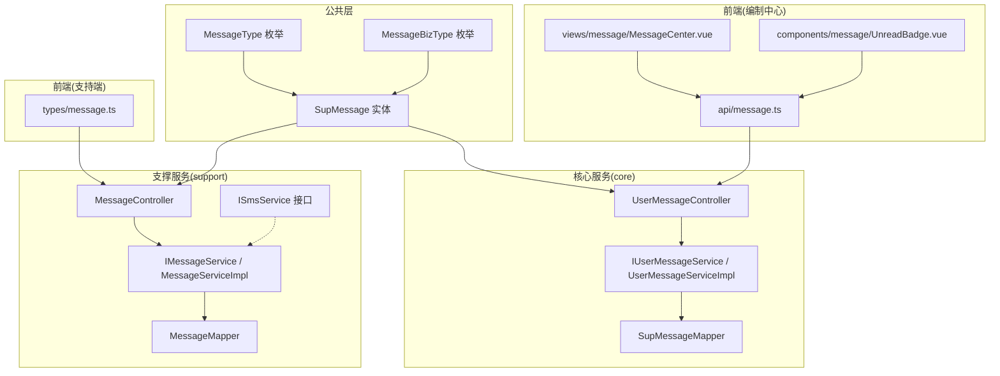
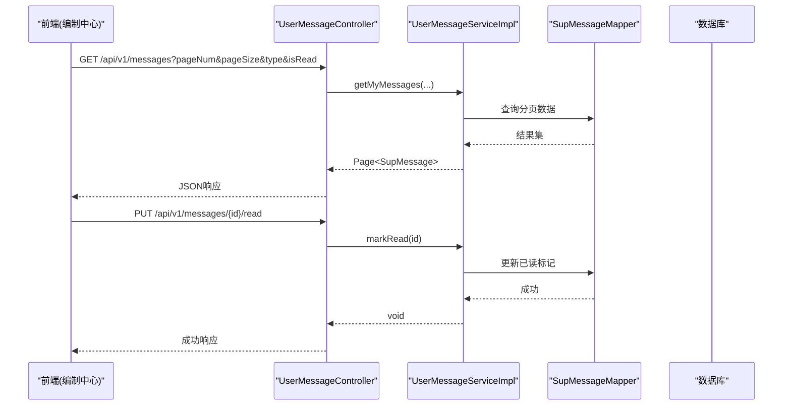
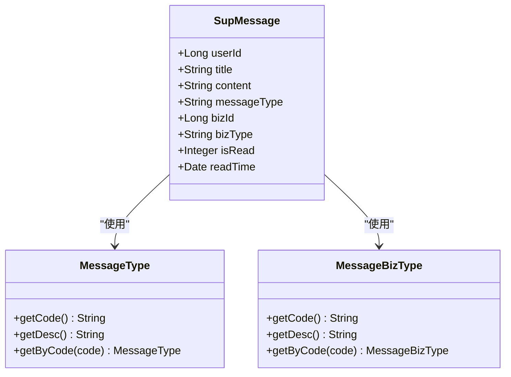
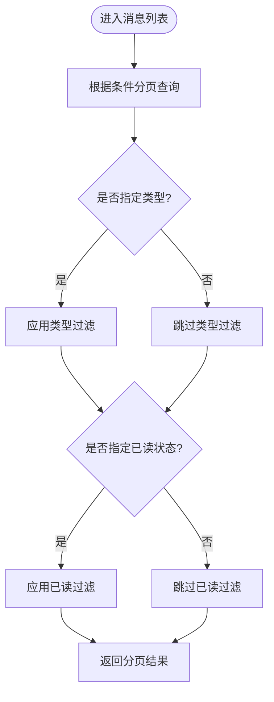
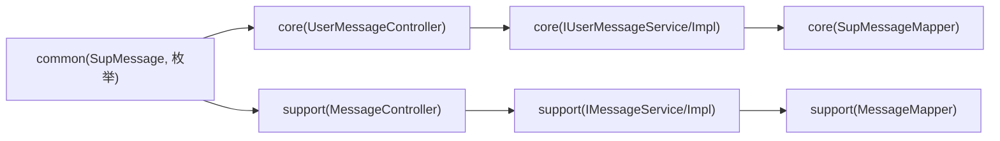

# 消息通知中心

<cite>
**本文引用的文件**   
- [SupMessage.java](file://ele-ai-tender-system/ele-ai-tender-common/src/main/java/com/jy/eleaitender/common/entity/support/SupMessage.java)
- [MessageType.java](file://ele-ai-tender-system/ele-ai-tender-common/src/main/java/com/jy/eleaitender/common/enums/MessageType.java)
- [MessageBizType.java](file://ele-ai-tender-system/ele-ai-tender-common/src/main/java/com/jy/eleaitender/common/enums/MessageBizType.java)
- [UserMessageController.java](file://ele-ai-tender-system/ele-ai-tender-core/src/main/java/com/jy/eleaitender/core/controller/UserMessageController.java)
- [IUserMessageService.java](file://ele-ai-tender-system/ele-ai-tender-core/src/main/java/com/jy/eleaitender/core/service/IUserMessageService.java)
- [UserMessageServiceImpl.java](file://ele-ai-tender-system/ele-ai-tender-core/src/main/java/com/jy/eleaitender/core/service/impl/UserMessageServiceImpl.java)
- [SupMessageMapper.java](file://ele-ai-tender-system/ele-ai-tender-core/src/main/java/com/jy/eleaitender/core/mapper/SupMessageMapper.java)
- [MessageVO.java](file://ele-ai-tender-system/ele-ai-tender-core/src/main/java/com/jy/eleaitender/core/dto/response/MessageVO.java)
- [MessageHelper.java](file://ele-ai-tender-system/ele-ai-tender-core/src/main/java/com/jy/eleaitender/core/helper/MessageHelper.java)
- [MessageController.java](file://ele-ai-tender-system/ele-ai-tender-support/src/main/java/com/jy/eleaitender/support/controller/MessageController.java)
- [IMessageService.java](file://ele-ai-tender-system/ele-ai-tender-support/src/main/java/com/jy/eleaitender/support/service/IMessageService.java)
- [MessageServiceImpl.java](file://ele-ai-tender-system/ele-ai-tender-support/src/main/java/com/jy/eleaitender/support/service/impl/MessageServiceImpl.java)
- [MessageMapper.java](file://ele-ai-tender-system/ele-ai-tender-support/src/main/java/com/jy/eleaitender/support/mapper/MessageMapper.java)
- [ISmsService.java](file://ele-ai-tender-system/ele-ai-tender-support/src/main/java/com/jy/eleaitender/support/service/ISmsService.java)
- [message.ts（前端API）](file://ele-ai-tender-frontend/src/api/message.ts)
- [MessageCenter.vue（前端页面）](file://ele-ai-tender-frontend/src/views/message/MessageCenter.vue)
- [UnreadBadge.vue（前端组件）](file://ele-ai-tender-frontend/src/components/message/UnreadBadge.vue)
- [message.ts（支持端类型）](file://ele-ai-tender-support-frontend/src/types/message.ts)
</cite>

## 目录
1. [简介](#简介)
2. [项目结构](#项目结构)
3. [核心组件](#核心组件)
4. [架构总览](#架构总览)
5. [详细组件分析](#详细组件分析)
6. [依赖关系分析](#依赖关系分析)
7. [性能与扩展性](#性能与扩展性)
8. [故障排查指南](#故障排查指南)
9. [结论](#结论)
10. [附录](#附录)

## 简介
本文件面向“招标文件AI编制系统”的消息通知中心，覆盖站内信、短信验证码、邮件通知、消息队列集成、分类与优先级、定时发送、阅读状态与统计、归档策略以及前端消息组件的使用与样式定制。文档基于仓库现有代码进行梳理，并给出可扩展的实现建议，帮助读者快速理解当前能力边界与后续演进方向。

## 项目结构
消息通知相关能力分布在以下模块：
- 公共层：消息实体与枚举定义
- 核心服务层（core）：用户侧消息接口与服务实现
- 支撑服务层（support）：管理侧消息接口与服务实现、短信能力抽象
- 前端（编制中心与支持端）：消息列表、未读角标、类型定义等

图示来源
- [SupMessage.java:1-44](file://ele-ai-tender-system/ele-ai-tender-common/src/main/java/com/jy/eleaitender/common/entity/support/SupMessage.java#L1-L44)
- [MessageType.java:1-38](file://ele-ai-tender-system/ele-ai-tender-common/src/main/java/com/jy/eleaitender/common/enums/MessageType.java#L1-L38)
- [MessageBizType.java:1-38](file://ele-ai-tender-system/ele-ai-tender-common/src/main/java/com/jy/eleaitender/common/enums/MessageBizType.java#L1-L38)
- [UserMessageController.java:1-66](file://ele-ai-tender-system/ele-ai-tender-core/src/main/java/com/jy/eleaitender/core/controller/UserMessageController.java#L1-L66)
- [IUserMessageService.java](file://ele-ai-tender-system/ele-ai-tender-core/src/main/java/com/jy/eleaitender/core/service/IUserMessageService.java)
- [UserMessageServiceImpl.java](file://ele-ai-tender-system/ele-ai-tender-core/src/main/java/com/jy/eleaitender/core/service/impl/UserMessageServiceImpl.java)
- [SupMessageMapper.java](file://ele-ai-tender-system/ele-ai-tender-core/src/main/java/com/jy/eleaitender/core/mapper/SupMessageMapper.java)
- [MessageController.java:1-66](file://ele-ai-tender-system/ele-ai-tender-support/src/main/java/com/jy/eleaitender/support/controller/MessageController.java#L1-L66)
- [IMessageService.java](file://ele-ai-tender-system/ele-ai-tender-support/src/main/java/com/jy/eleaitender/support/service/IMessageService.java)
- [MessageServiceImpl.java](file://ele-ai-tender-system/ele-ai-tender-support/src/main/java/com/jy/eleaitender/support/service/impl/MessageServiceImpl.java)
- [MessageMapper.java](file://ele-ai-tender-system/ele-ai-tender-support/src/main/java/com/jy/eleaitender/support/mapper/MessageMapper.java)
- [ISmsService.java:1-37](file://ele-ai-tender-system/ele-ai-tender-support/src/main/java/com/jy/eleaitender/support/service/ISmsService.java#L1-L37)
- [message.ts（前端API）](file://ele-ai-tender-frontend/src/api/message.ts)
- [MessageCenter.vue（前端页面）](file://ele-ai-tender-frontend/src/views/message/MessageCenter.vue)
- [UnreadBadge.vue（前端组件）](file://ele-ai-tender-frontend/src/components/message/UnreadBadge.vue)
- [message.ts（支持端类型）](file://ele-ai-tender-support-frontend/src/types/message.ts)

章节来源
- [SupMessage.java:1-44](file://ele-ai-tender-system/ele-ai-tender-common/src/main/java/com/jy/eleaitender/common/entity/support/SupMessage.java#L1-L44)
- [MessageType.java:1-38](file://ele-ai-tender-system/ele-ai-tender-common/src/main/java/com/jy/eleaitender/common/enums/MessageType.java#L1-L38)
- [MessageBizType.java:1-38](file://ele-ai-tender-system/ele-ai-tender-common/src/main/java/com/jy/eleaitender/common/enums/MessageBizType.java#L1-L38)
- [UserMessageController.java:1-66](file://ele-ai-tender-system/ele-ai-tender-core/src/main/java/com/jy/eleaitender/core/controller/UserMessageController.java#L1-L66)
- [MessageController.java:1-66](file://ele-ai-tender-system/ele-ai-tender-support/src/main/java/com/jy/eleaitender/support/controller/MessageController.java#L1-L66)
- [ISmsService.java:1-37](file://ele-ai-tender-system/ele-ai-tender-support/src/main/java/com/jy/eleaitender/support/service/ISmsService.java#L1-L37)

## 核心组件
- 数据模型
  - SupMessage：站内信实体，包含目标用户、标题、内容、消息类型、业务关联ID与类型、已读标记与阅读时间等字段。
  - MessageType：消息类型枚举（系统、审核、检测、预警）。
  - MessageBizType：消息关联业务类型枚举（项目、需求、检测、模板）。
- 控制器与服务
  - 核心服务(UserMessageController + IUserMessageService + UserMessageServiceImpl)：提供分页查询、标记已读、全部已读、未读数、删除等能力。
  - 支撑服务(MessageController + IMessageService + MessageServiceImpl)：提供相同能力的管理侧入口，便于统一维护。
  - Mapper：SupMessageMapper/MessageMapper 对接数据库持久化。
- 辅助能力
  - MessageVO：用于对外返回的消息视图对象。
  - MessageHelper：消息组装或处理辅助类。
  - ISmsService：短信验证码能力抽象，提供发送与校验方法。

章节来源
- [SupMessage.java:1-44](file://ele-ai-tender-system/ele-ai-tender-common/src/main/java/com/jy/eleaitender/common/entity/support/SupMessage.java#L1-L44)
- [MessageType.java:1-38](file://ele-ai-tender-system/ele-ai-tender-common/src/main/java/com/jy/eleaitender/common/enums/MessageType.java#L1-L38)
- [MessageBizType.java:1-38](file://ele-ai-tender-system/ele-ai-tender-common/src/main/java/com/jy/eleaitender/common/enums/MessageBizType.java#L1-L38)
- [UserMessageController.java:1-66](file://ele-ai-tender-system/ele-ai-tender-core/src/main/java/com/jy/eleaitender/core/controller/UserMessageController.java#L1-L66)
- [IUserMessageService.java](file://ele-ai-tender-system/ele-ai-tender-core/src/main/java/com/jy/eleaitender/core/service/IUserMessageService.java)
- [UserMessageServiceImpl.java](file://ele-ai-tender-system/ele-ai-tender-core/src/main/java/com/jy/eleaitender/core/service/impl/UserMessageServiceImpl.java)
- [SupMessageMapper.java](file://ele-ai-tender-system/ele-ai-tender-core/src/main/java/com/jy/eleaitender/core/mapper/SupMessageMapper.java)
- [MessageController.java:1-66](file://ele-ai-tender-system/ele-ai-tender-support/src/main/java/com/jy/eleaitender/support/controller/MessageController.java#L1-L66)
- [IMessageService.java](file://ele-ai-tender-system/ele-ai-tender-support/src/main/java/com/jy/eleaitender/support/service/IMessageService.java)
- [MessageServiceImpl.java](file://ele-ai-tender-system/ele-ai-tender-support/src/main/java/com/jy/eleaitender/support/service/impl/MessageServiceImpl.java)
- [MessageMapper.java](file://ele-ai-tender-system/ele-ai-tender-support/src/main/java/com/jy/eleaitender/support/mapper/MessageMapper.java)
- [MessageVO.java](file://ele-ai-tender-system/ele-ai-tender-core/src/main/java/com/jy/eleaitender/core/dto/response/MessageVO.java)
- [MessageHelper.java](file://ele-ai-tender-system/ele-ai-tender-core/src/main/java/com/jy/eleaitender/core/helper/MessageHelper.java)
- [ISmsService.java:1-37](file://ele-ai-tender-system/ele-ai-tender-support/src/main/java/com/jy/eleaitender/support/service/ISmsService.java#L1-L37)

## 架构总览
消息通知中心采用分层架构：
- 表现层：前后端通过REST API交互；前端提供消息列表、未读角标等组件。
- 控制层：核心服务与管理侧分别暴露消息操作接口。
- 服务层：封装业务逻辑，调用Mapper完成持久化，并可扩展短信、邮件、队列等能力。
- 数据层：MyBatis-Plus映射到sup_message表。

图示来源
- [UserMessageController.java:1-66](file://ele-ai-tender-system/ele-ai-tender-core/src/main/java/com/jy/eleaitender/core/controller/UserMessageController.java#L1-L66)
- [IUserMessageService.java](file://ele-ai-tender-system/ele-ai-tender-core/src/main/java/com/jy/eleaitender/core/service/IUserMessageService.java)
- [UserMessageServiceImpl.java](file://ele-ai-tender-system/ele-ai-tender-core/src/main/java/com/jy/eleaitender/core/service/impl/UserMessageServiceImpl.java)
- [SupMessageMapper.java](file://ele-ai-tender-system/ele-ai-tender-core/src/main/java/com/jy/eleaitender/core/mapper/SupMessageMapper.java)

## 详细组件分析

### 数据模型与分类
- SupMessage字段说明
  - userId：接收人
  - title/content：标题与正文
  - messageType：消息类型（SYSTEM/AUDIT/DETECTION/WARNING）
  - bizId/bizType：关联业务标识与类型（PROJECT/REQUIREMENT/DETECTION/TEMPLATE）
  - isRead/readTime：阅读状态与时间
- 分类与业务域
  - MessageType与MessageBizType为消息分类与业务域的统一规范，便于前端展示与后端筛选。

图示来源
- [SupMessage.java:1-44](file://ele-ai-tender-system/ele-ai-tender-common/src/main/java/com/jy/eleaitender/common/entity/support/SupMessage.java#L1-L44)
- [MessageType.java:1-38](file://ele-ai-tender-system/ele-ai-tender-common/src/main/java/com/jy/eleaitender/common/enums/MessageType.java#L1-L38)
- [MessageBizType.java:1-38](file://ele-ai-tender-system/ele-ai-tender-common/src/main/java/com/jy/eleaitender/common/enums/MessageBizType.java#L1-L38)

章节来源
- [SupMessage.java:1-44](file://ele-ai-tender-system/ele-ai-tender-common/src/main/java/com/jy/eleaitender/common/entity/support/SupMessage.java#L1-L44)
- [MessageType.java:1-38](file://ele-ai-tender-system/ele-ai-tender-common/src/main/java/com/jy/eleaitender/common/enums/MessageType.java#L1-L38)
- [MessageBizType.java:1-38](file://ele-ai-tender-system/ele-ai-tender-common/src/main/java/com/jy/eleaitender/common/enums/MessageBizType.java#L1-L38)

### 核心服务（编制中心）
- 功能清单
  - 分页查询我的消息（支持按类型、是否已读过滤）
  - 标记单条/全部已读
  - 获取未读数量
  - 删除消息
- 关键路径
  - GET /api/v1/messages
  - PUT /api/v1/messages/{id}/read
  - PUT /api/v1/messages/read-all
  - GET /api/v1/messages/unread-count
  - DELETE /api/v1/messages/{id}

章节来源
- [UserMessageController.java:1-66](file://ele-ai-tender-system/ele-ai-tender-core/src/main/java/com/jy/eleaitender/core/controller/UserMessageController.java#L1-L66)
- [IUserMessageService.java](file://ele-ai-tender-system/ele-ai-tender-core/src/main/java/com/jy/eleaitender/core/service/IUserMessageService.java)
- [UserMessageServiceImpl.java](file://ele-ai-tender-system/ele-ai-tender-core/src/main/java/com/jy/eleaitender/core/service/impl/UserMessageServiceImpl.java)
- [SupMessageMapper.java](file://ele-ai-tender-system/ele-ai-tender-core/src/main/java/com/jy/eleaitender/core/mapper/SupMessageMapper.java)

### 支撑服务（管理侧）
- 功能清单
  - 与核心服务一致的查询、已读、未读数、删除接口，便于后台统一管理。
- 关键路径
  - GET /api/v1/messages
  - GET /api/v1/messages/unread-count
  - PUT /api/v1/messages/{id}/read
  - PUT /api/v1/messages/read-all
  - DELETE /api/v1/messages/{id}

章节来源
- [MessageController.java:1-66](file://ele-ai-tender-system/ele-ai-tender-support/src/main/java/com/jy/eleaitender/support/controller/MessageController.java#L1-L66)
- [IMessageService.java](file://ele-ai-tender-system/ele-ai-tender-support/src/main/java/com/jy/eleaitender/support/service/IMessageService.java)
- [MessageServiceImpl.java](file://ele-ai-tender-system/ele-ai-tender-support/src/main/java/com/jy/eleaitender/support/service/impl/MessageServiceImpl.java)
- [MessageMapper.java](file://ele-ai-tender-system/ele-ai-tender-support/src/main/java/com/jy/eleaitender/support/mapper/MessageMapper.java)

### 短信通知服务集成
- 现状
  - 提供ISmsService接口，定义验证码发送与校验能力，场景包括登录、注册、重置密码、绑定手机等。
- 建议实现要点
  - 网关配置：将不同厂商的短信网关以策略模式接入，通过配置项选择默认通道。
  - 模板管理：在数据库中维护模板ID与变量占位符，结合业务场景动态渲染。
  - 发送状态跟踪：记录每次发送的请求ID、渠道、耗时、回执状态，便于对账与重试。
  - 限流与防刷：基于手机号+IP+场景维度做频率限制。
  - 失败补偿：对超时或未知回执的消息纳入重试队列，指数退避重试。

章节来源
- [ISmsService.java:1-37](file://ele-ai-tender-system/ele-ai-tender-support/src/main/java/com/jy/eleaitender/support/service/ISmsService.java#L1-L37)

### 邮件通知功能
- 现状
  - 仓库中未发现邮件发送的具体实现。
- 建议实现要点
  - 模板引擎：使用Freemarker/Thymeleaf管理HTML模板，支持变量替换与多语言。
  - 附件处理：大附件走对象存储，邮件内仅保留下载链接，避免邮件体积过大。
  - 发送队列：将邮件任务投递至消息队列，消费者异步发送，提升吞吐与可观测性。
  - 失败重试与死信：对发送失败的消息进行重试，超过阈值转入死信队列人工干预。
  - 安全与合规：敏感信息脱敏，启用TLS，记录审计日志。

[本节为概念性建议，不直接分析具体文件]

### 消息队列集成方案
- 现状
  - 仓库中未发现消息队列相关实现。
- 建议实现要点
  - 异步处理：将站内信、短信、邮件等写入队列，消费者批量拉取并执行。
  - 幂等与去重：基于消息唯一键（如userId+bizId+type）防止重复投递。
  - 重试机制：固定间隔或指数退避重试，记录失败原因与次数。
  - 失败补偿：对长期失败的消息转入死信队列，并提供人工处理界面。
  - 监控告警：对队列积压、消费延迟、失败率设置阈值告警。

[本节为概念性建议，不直接分析具体文件]

### 消息分类、优先级与定时发送
- 现状
  - 已有MessageType与MessageBizType用于分类；SupMessage未包含优先级与定时发送字段。
- 建议实现要点
  - 优先级：在SupMessage新增priority字段（如紧急/高/普通/低），并在查询与展示时体现。
  - 定时发送：新增scheduledAt字段，配合调度器扫描待发送消息，到达时间后入队或直接落库并推送。
  - 路由规则：根据bizType与messageType决定触达渠道（站内信/短信/邮件）。

章节来源
- [SupMessage.java:1-44](file://ele-ai-tender-system/ele-ai-tender-common/src/main/java/com/jy/eleaitender/common/entity/support/SupMessage.java#L1-L44)
- [MessageType.java:1-38](file://ele-ai-tender-system/ele-ai-tender-common/src/main/java/com/jy/eleaitender/common/enums/MessageType.java#L1-L38)
- [MessageBizType.java:1-38](file://ele-ai-tender-system/ele-ai-tender-common/src/main/java/com/jy/eleaitender/common/enums/MessageBizType.java#L1-L38)

### 阅读状态管理与统计
- 现状
  - 提供标记单条/全部已读、未读数查询接口；SupMessage包含isRead与readTime。
- 建议实现要点
  - 批量已读优化：对“全部已读”采用批量更新，减少DB压力。
  - 统计指标：累计未读、按类型/业务域维度的未读分布，便于仪表盘展示。
  - 软删除与归档：对历史消息提供归档策略（如冷数据迁移至历史表或ES）。

章节来源
- [UserMessageController.java:1-66](file://ele-ai-tender-system/ele-ai-tender-core/src/main/java/com/jy/eleaitender/core/controller/UserMessageController.java#L1-L66)
- [MessageController.java:1-66](file://ele-ai-tender-system/ele-ai-tender-support/src/main/java/com/jy/eleaitender/support/controller/MessageController.java#L1-L66)
- [SupMessage.java:1-44](file://ele-ai-tender-system/ele-ai-tender-common/src/main/java/com/jy/eleaitender/common/entity/support/SupMessage.java#L1-L44)

### 前端消息组件使用指南
- 页面与API
  - MessageCenter.vue：消息中心主页面，负责列表展示、筛选、跳转详情等。
  - api/message.ts：封装消息相关的HTTP请求，供页面与组件调用。
  - UnreadBadge.vue：未读角标组件，显示未读数量。
- 使用步骤
  - 在页面引入MessageCenter.vue，按需挂载路由。
  - 在需要显示未读数的位置引入UnreadBadge.vue，并通过API获取未读数。
  - 自定义样式：通过SCSS变量或组件插槽覆盖默认样式，保持与设计令牌一致。
- 类型定义
  - 支持端types/message.ts：提供消息相关TS类型，保证前后端契约一致性。

章节来源
- [message.ts（前端API）](file://ele-ai-tender-frontend/src/api/message.ts)
- [MessageCenter.vue（前端页面）](file://ele-ai-tender-frontend/src/views/message/MessageCenter.vue)
- [UnreadBadge.vue（前端组件）](file://ele-ai-tender-frontend/src/components/message/UnreadBadge.vue)
- [message.ts（支持端类型）](file://ele-ai-tender-support-frontend/src/types/message.ts)

## 依赖关系分析
- 模块耦合
  - core与support均依赖common中的SupMessage及枚举，形成稳定的数据契约。
  - 控制器依赖各自的服务接口，服务实现依赖Mapper，层次清晰。
- 外部依赖
  - MyBatis-Plus：简化CRUD与分页。
  - 可选：消息队列、短信网关、邮件服务（建议以接口形式解耦）。

图示来源
- [SupMessage.java:1-44](file://ele-ai-tender-system/ele-ai-tender-common/src/main/java/com/jy/eleaitender/common/entity/support/SupMessage.java#L1-L44)
- [UserMessageController.java:1-66](file://ele-ai-tender-system/ele-ai-tender-core/src/main/java/com/jy/eleaitender/core/controller/UserMessageController.java#L1-L66)
- [MessageController.java:1-66](file://ele-ai-tender-system/ele-ai-tender-support/src/main/java/com/jy/eleaitender/support/controller/MessageController.java#L1-L66)
- [IUserMessageService.java](file://ele-ai-tender-system/ele-ai-tender-core/src/main/java/com/jy/eleaitender/core/service/IUserMessageService.java)
- [UserMessageServiceImpl.java](file://ele-ai-tender-system/ele-ai-tender-core/src/main/java/com/jy/eleaitender/core/service/impl/UserMessageServiceImpl.java)
- [SupMessageMapper.java](file://ele-ai-tender-system/ele-ai-tender-core/src/main/java/com/jy/eleaitender/core/mapper/SupMessageMapper.java)
- [IMessageService.java](file://ele-ai-tender-system/ele-ai-tender-support/src/main/java/com/jy/eleaitender/support/service/IMessageService.java)
- [MessageServiceImpl.java](file://ele-ai-tender-system/ele-ai-tender-support/src/main/java/com/jy/eleaitender/support/service/impl/MessageServiceImpl.java)
- [MessageMapper.java](file://ele-ai-tender-system/ele-ai-tender-support/src/main/java/com/jy/eleaitender/support/mapper/MessageMapper.java)

## 性能与扩展性
- 查询优化
  - 针对userId、messageType、isRead建立复合索引，加速分页与筛选。
  - 对“全部已读”采用批量更新，降低事务开销。
- 读写分离
  - 读多写少场景下，可将查询路由至只读实例。
- 缓存
  - 未读数可短期缓存于Redis，定期刷新或事件驱动更新。
- 扩展点
  - 通过ISmsService等接口扩展多渠道通知；通过消息队列解耦发送流程。

[本节为通用建议，不直接分析具体文件]

## 故障排查指南
- 常见问题
  - 未读数异常：检查“全部已读”是否批量更新成功；核对缓存是否过期。
  - 消息丢失：确认生产者是否成功落库；若引入队列，检查消费者消费情况与重试策略。
  - 短信发送失败：查看ISmsService实现日志，核对网关配置、模板ID与签名参数。
- 定位手段
  - 接口层：观察Controller返回值与异常堆栈。
  - 服务层：在服务实现中增加关键路径日志（入参、出参、耗时）。
  - 数据层：核对SQL执行计划与慢查询日志。

[本节为通用建议，不直接分析具体文件]

## 结论
当前消息通知中心已具备站内信的核心能力（实体、分类、读写接口、未读统计），并提供了短信验证码的能力抽象。建议在后续迭代中补充邮件通知、消息队列、优先级与定时发送、归档策略等能力，以提升系统的可靠性与可观测性。前端组件已就绪，可按需扩展样式与交互体验。

## 附录
- 术语
  - 站内信：系统内部消息，用户在应用内可见。
  - 短信验证码：通过短信网关向用户手机发送一次性验证码。
  - 消息队列：用于异步解耦与削峰填谷的中间件。
- 参考接口
  - 核心服务：/api/v1/messages（GET/PUT/DELETE）
  - 支撑服务：/api/v1/messages（GET/PUT/DELETE）