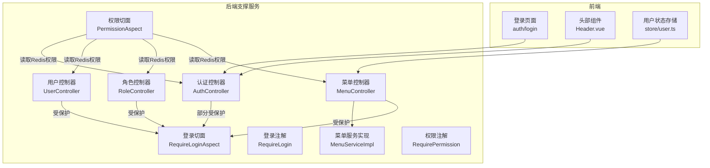
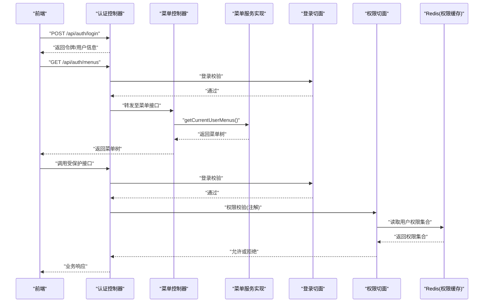
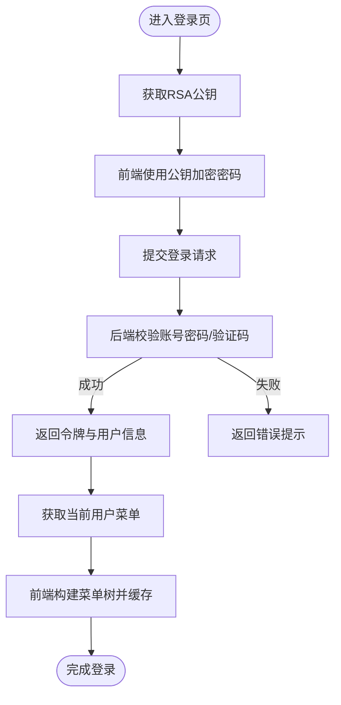
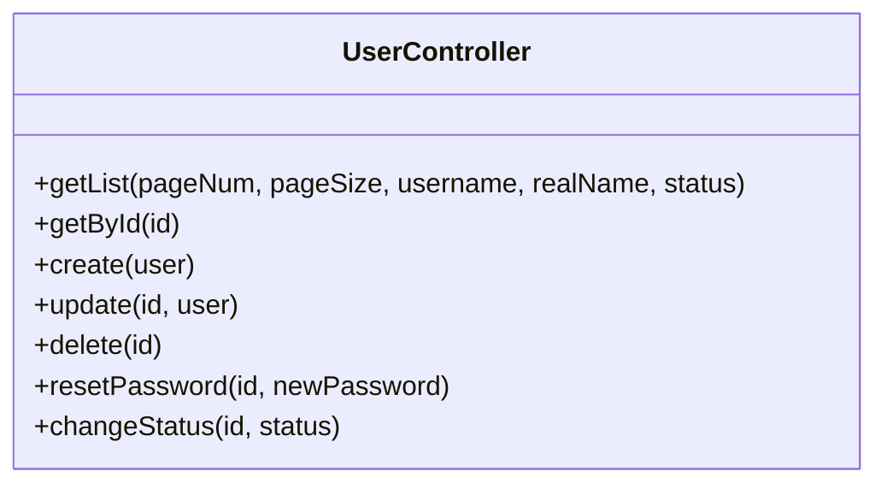
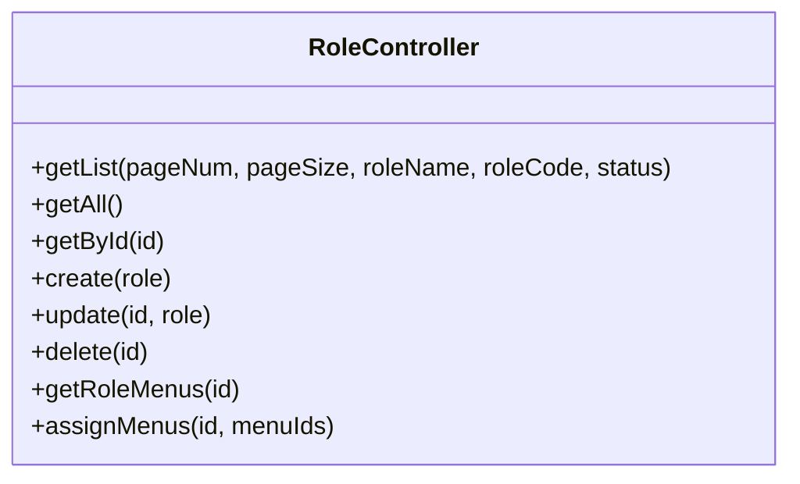
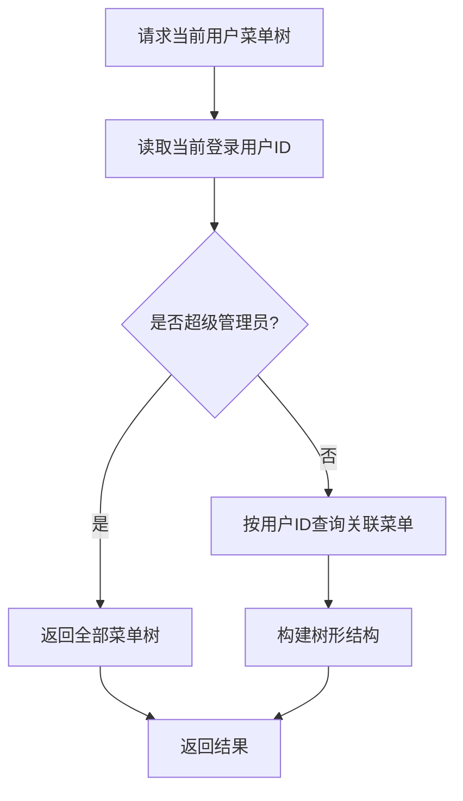
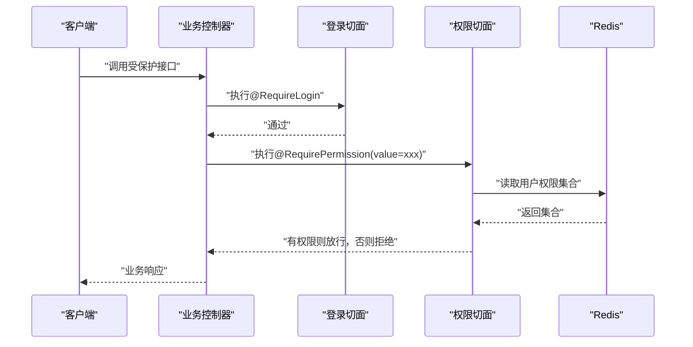
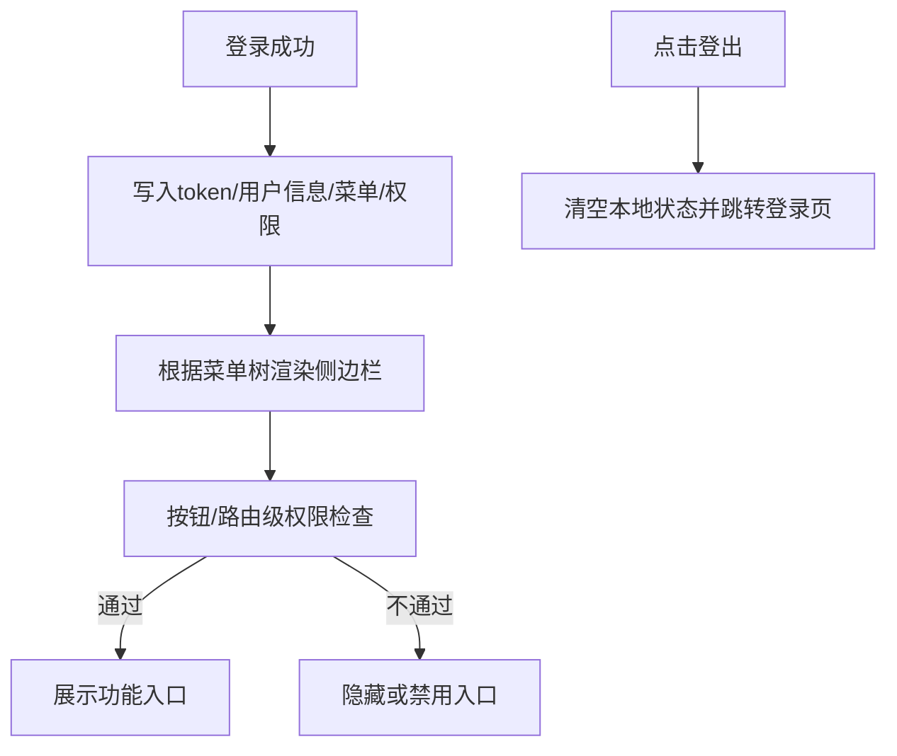
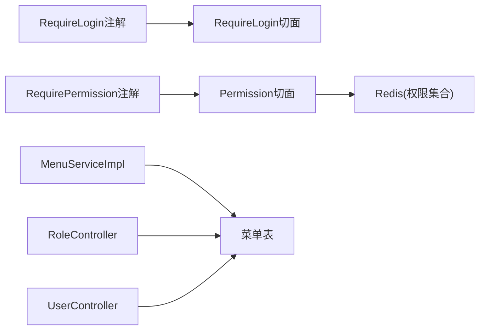

# 用户权限管理

<cite>
**本文引用的文件**
- [AuthController.java](file://ele-ai-tender-system/ele-ai-tender-support/src/main/java/com/jy/eleaitender/support/controller/AuthController.java)
- [UserController.java](file://ele-ai-tender-system/ele-ai-tender-support/src/main/java/com/jy/eleaitender/support/controller/UserController.java)
- [RoleController.java](file://ele-ai-tender-system/ele-ai-tender-support/src/main/java/com/jy/eleaitender/support/controller/RoleController.java)
- [MenuController.java](file://ele-ai-tender-system/ele-ai-tender-support/src/main/java/com/jy/eleaitender/support/controller/MenuController.java)
- [MenuServiceImpl.java](file://ele-ai-tender-system/ele-ai-tender-support/src/main/java/com/jy/eleaitender/support/service/impl/MenuServiceImpl.java)
- [RequireLogin.java](file://ele-ai-tender-system/ele-ai-tender-common/src/main/java/com/jy/eleaitender/common/security/annotation/RequireLogin.java)
- [RequireLoginAspect.java](file://ele-ai-tender-system/ele-ai-tender-common/src/main/java/com/jy/eleaitender/common/aspect/RequireLoginAspect.java)
- [RequirePermission.java](file://ele-ai-tender-system/ele-ai-tender-support/src/main/java/com/jy/eleaitender/support/security/annotation/RequirePermission.java)
- [PermissionAspect.java](file://ele-ai-tender-system/ele-ai-tender-support/src/main/java/com/jy/eleaitender/support/aspect/PermissionAspect.java)
- [user.ts](file://ele-ai-tender-support-frontend/src/store/user.ts)
- [Header.vue](file://ele-ai-tender-support-frontend/src/layouts/components/Header.vue)
</cite>

## 目录
1. [简介](#简介)
2. [项目结构](#项目结构)
3. [核心组件](#核心组件)
4. [架构总览](#架构总览)
5. [详细组件分析](#详细组件分析)
6. [依赖关系分析](#依赖关系分析)
7. [性能考虑](#性能考虑)
8. [故障排查指南](#故障排查指南)
9. [结论](#结论)
10. [附录](#附录)

## 简介
本文件面向“招标文件AI编制系统”的用户权限管理功能，围绕RBAC（基于角色的访问控制）模型，系统性说明以下能力：
- 用户生命周期管理：注册、登录认证、密码管理与会话控制
- 角色与权限：角色定义与分配、菜单权限控制、接口级权限拦截
- 数据权限控制：按用户范围过滤数据的机制与扩展点
- 操作审计日志：关键操作的记录与追踪
- 安全策略配置：密码传输加密、登录态校验、权限缓存
- 管理员操作指南与最佳实践

## 项目结构
权限相关的前后端实现分布在支持服务模块与管理端前端中：
- 后端（support 模块）提供认证、用户、角色、菜单等API，并通过注解与切面实现登录校验与权限拦截
- 前端（support-frontend）负责登录流程、动态菜单加载、权限检查与登出清理

图表来源
- [AuthController.java:1-129](file://ele-ai-tender-system/ele-ai-tender-support/src/main/java/com/jy/eleaitender/support/controller/AuthController.java#L1-L129)
- [UserController.java:1-103](file://ele-ai-tender-system/ele-ai-tender-support/src/main/java/com/jy/eleaitender/support/controller/UserController.java#L1-L103)
- [RoleController.java:1-98](file://ele-ai-tender-system/ele-ai-tender-support/src/main/java/com/jy/eleaitender/support/controller/RoleController.java#L1-L98)
- [MenuController.java:1-80](file://ele-ai-tender-system/ele-ai-tender-support/src/main/java/com/jy/eleaitender/support/controller/MenuController.java#L1-L80)
- [MenuServiceImpl.java:1-43](file://ele-ai-tender-system/ele-ai-tender-support/src/main/java/com/jy/eleaitender/support/service/impl/MenuServiceImpl.java#L1-L43)
- [RequireLogin.java:1-13](file://ele-ai-tender-system/ele-ai-tender-common/src/main/java/com/jy/eleaitender/common/security/annotation/RequireLogin.java#L1-L13)
- [RequireLoginAspect.java:1-22](file://ele-ai-tender-system/ele-ai-tender-common/src/main/java/com/jy/eleaitender/common/aspect/RequireLoginAspect.java#L1-L22)
- [RequirePermission.java:1-18](file://ele-ai-tender-system/ele-ai-tender-support/src/main/java/com/jy/eleaitender/support/security/annotation/RequirePermission.java#L1-L18)
- [PermissionAspect.java:1-57](file://ele-ai-tender-system/ele-ai-tender-support/src/main/java/com/jy/eleaitender/support/aspect/PermissionAspect.java#L1-L57)
- [user.ts:77-121](file://ele-ai-tender-support-frontend/src/store/user.ts#L77-L121)
- [Header.vue:65-103](file://ele-ai-tender-support-frontend/src/layouts/components/Header.vue#L65-L103)

章节来源
- [AuthController.java:1-129](file://ele-ai-tender-system/ele-ai-tender-support/src/main/java/com/jy/eleaitender/support/controller/AuthController.java#L1-L129)
- [MenuServiceImpl.java:1-43](file://ele-ai-tender-system/ele-ai-tender-support/src/main/java/com/jy/eleaitender/support/service/impl/MenuServiceImpl.java#L1-L43)
- [RequireLoginAspect.java:1-22](file://ele-ai-tender-system/ele-ai-tender-common/src/main/java/com/jy/eleaitender/common/aspect/RequireLoginAspect.java#L1-L22)
- [PermissionAspect.java:1-57](file://ele-ai-tender-system/ele-ai-tender-support/src/main/java/com/jy/eleaitender/support/aspect/PermissionAspect.java#L1-L57)
- [user.ts:77-121](file://ele-ai-tender-support-frontend/src/store/user.ts#L77-L121)

## 核心组件
- 认证与登录
  - 提供公钥获取、用户名密码登录、短信验证码登录、重置密码、修改密码、登出、当前用户信息与菜单获取等接口
  - 登录成功后返回令牌与会话上下文，后续请求通过登录切面校验
- 用户管理
  - 分页查询、详情、创建、更新、删除、重置密码、启用/禁用
- 角色管理
  - 分页查询、全部列表、详情、创建、更新、删除、角色菜单权限的获取与分配
- 菜单管理
  - 当前用户菜单树、平铺列表、详情、增删改
  - 根据用户ID动态构建菜单树，超级管理员可见全部菜单
- 权限拦截
  - 登录校验注解与切面：未登录直接拒绝
  - 接口权限注解与切面：从Redis读取用户权限集合进行匹配

章节来源
- [AuthController.java:48-128](file://ele-ai-tender-system/ele-ai-tender-support/src/main/java/com/jy/eleaitender/support/controller/AuthController.java#L48-L128)
- [UserController.java:27-101](file://ele-ai-tender-system/ele-ai-tender-support/src/main/java/com/jy/eleaitender/support/controller/UserController.java#L27-L101)
- [RoleController.java:28-96](file://ele-ai-tender-system/ele-ai-tender-support/src/main/java/com/jy/eleaitender/support/controller/RoleController.java#L28-L96)
- [MenuController.java:29-78](file://ele-ai-tender-system/ele-ai-tender-support/src/main/java/com/jy/eleaitender/support/controller/MenuController.java#L29-L78)
- [MenuServiceImpl.java:27-39](file://ele-ai-tender-system/ele-ai-tender-support/src/main/java/com/jy/eleaitender/support/service/impl/MenuServiceImpl.java#L27-L39)
- [RequireLoginAspect.java:15-21](file://ele-ai-tender-system/ele-ai-tender-common/src/main/java/com/jy/eleaitender/common/aspect/RequireLoginAspect.java#L15-L21)
- [PermissionAspect.java:32-56](file://ele-ai-tender-system/ele-ai-tender-support/src/main/java/com/jy/eleaitender/support/aspect/PermissionAspect.java#L32-L56)

## 架构总览
下图展示了从前端到后端的完整认证与授权链路，包括登录、菜单动态加载、接口级权限拦截。

图表来源
- [AuthController.java:54-113](file://ele-ai-tender-system/ele-ai-tender-support/src/main/java/com/jy/eleaitender/support/controller/AuthController.java#L54-L113)
- [MenuController.java:29-34](file://ele-ai-tender-system/ele-ai-tender-support/src/main/java/com/jy/eleaitender/support/controller/MenuController.java#L29-L34)
- [MenuServiceImpl.java:27-39](file://ele-ai-tender-system/ele-ai-tender-support/src/main/java/com/jy/eleaitender/support/service/impl/MenuServiceImpl.java#L27-L39)
- [RequireLoginAspect.java:15-21](file://ele-ai-tender-system/ele-ai-tender-common/src/main/java/com/jy/eleaitender/common/aspect/RequireLoginAspect.java#L15-L21)
- [PermissionAspect.java:32-56](file://ele-ai-tender-system/ele-ai-tender-support/src/main/java/com/jy/eleaitender/support/aspect/PermissionAspect.java#L32-L56)

## 详细组件分析

### 认证与登录（用户生命周期）
- 公钥获取：用于前端对密码进行RSA加密传输，保障口令在传输过程中的安全性
- 用户名密码登录：验证通过后返回用户令牌与基本信息
- 手机验证码登录：结合短信验证码完成无密码登录
- 重置密码：通过短信验证码重置用户密码
- 修改密码：当前用户修改自身密码，需旧密码与新密码均经RSA解密
- 登出：清除服务端会话上下文
- 当前用户信息与菜单：登录后获取用户基础信息与动态菜单树

图表来源
- [AuthController.java:48-83](file://ele-ai-tender-system/ele-ai-tender-support/src/main/java/com/jy/eleaitender/support/controller/AuthController.java#L48-L83)
- [AuthController.java:108-127](file://ele-ai-tender-system/ele-ai-tender-support/src/main/java/com/jy/eleaitender/support/controller/AuthController.java#L108-L127)
- [user.ts:77-121](file://ele-ai-tender-support-frontend/src/store/user.ts#L77-L121)

章节来源
- [AuthController.java:48-127](file://ele-ai-tender-system/ele-ai-tender-support/src/main/java/com/jy/eleaitender/support/controller/AuthController.java#L48-L127)
- [user.ts:77-121](file://ele-ai-tender-support-frontend/src/store/user.ts#L77-L121)

### 用户管理
- 分页查询：支持按用户名、真实姓名、状态筛选
- 详情：按ID获取用户信息
- 创建/更新/删除：维护用户主数据
- 重置密码：管理员可重置指定用户密码
- 启用/禁用：控制用户可用状态

图表来源
- [UserController.java:27-101](file://ele-ai-tender-system/ele-ai-tender-support/src/main/java/com/jy/eleaitender/support/controller/UserController.java#L27-L101)

章节来源
- [UserController.java:27-101](file://ele-ai-tender-system/ele-ai-tender-support/src/main/java/com/jy/eleaitender/support/controller/UserController.java#L27-L101)

### 角色管理（RBAC核心）
- 分页查询与全量列表：便于前端下拉选择
- 详情/创建/更新/删除：角色主数据维护
- 角色菜单权限：获取与分配角色对应的菜单集合

图表来源
- [RoleController.java:28-96](file://ele-ai-tender-system/ele-ai-tender-support/src/main/java/com/jy/eleaitender/support/controller/RoleController.java#L28-L96)

章节来源
- [RoleController.java:28-96](file://ele-ai-tender-system/ele-ai-tender-support/src/main/java/com/jy/eleaitender/support/controller/RoleController.java#L28-L96)

### 菜单管理（动态加载与显示控制）
- 当前用户菜单树：根据登录用户ID动态生成，超级管理员可见全部菜单
- 平铺列表：供管理员统一维护
- 增删改：菜单元数据维护

图表来源
- [MenuController.java:29-34](file://ele-ai-tender-system/ele-ai-tender-support/src/main/java/com/jy/eleaitender/support/controller/MenuController.java#L29-L34)
- [MenuServiceImpl.java:27-39](file://ele-ai-tender-system/ele-ai-tender-support/src/main/java/com/jy/eleaitender/support/service/impl/MenuServiceImpl.java#L27-L39)

章节来源
- [MenuController.java:29-78](file://ele-ai-tender-system/ele-ai-tender-support/src/main/java/com/jy/eleaitender/support/controller/MenuController.java#L29-L78)
- [MenuServiceImpl.java:27-39](file://ele-ai-tender-system/ele-ai-tender-support/src/main/java/com/jy/eleaitender/support/service/impl/MenuServiceImpl.java#L27-L39)

### 接口级权限拦截（RBAC操作权限）
- 登录校验注解与切面：方法或类级别标注后，未登录直接拒绝
- 权限校验注解与切面：方法级别标注所需权限标识，切面从Redis读取用户权限集合进行匹配
- 权限来源：通常由登录成功后将用户角色与菜单权限写入Redis，键前缀包含用户ID

图表来源
- [RequireLogin.java:1-13](file://ele-ai-tender-system/ele-ai-tender-common/src/main/java/com/jy/eleaitender/common/security/annotation/RequireLogin.java#L1-L13)
- [RequireLoginAspect.java:15-21](file://ele-ai-tender-system/ele-ai-tender-common/src/main/java/com/jy/eleaitender/common/aspect/RequireLoginAspect.java#L15-L21)
- [RequirePermission.java:1-18](file://ele-ai-tender-system/ele-ai-tender-support/src/main/java/com/jy/eleaitender/support/security/annotation/RequirePermission.java#L1-L18)
- [PermissionAspect.java:32-56](file://ele-ai-tender-system/ele-ai-tender-support/src/main/java/com/jy/eleaitender/support/aspect/PermissionAspect.java#L32-L56)

章节来源
- [RequireLoginAspect.java:15-21](file://ele-ai-tender-system/ele-ai-tender-common/src/main/java/com/jy/eleaitender/common/aspect/RequireLoginAspect.java#L15-L21)
- [PermissionAspect.java:32-56](file://ele-ai-tender-system/ele-ai-tender-support/src/main/java/com/jy/eleaitender/support/aspect/PermissionAspect.java#L32-L56)

### 前端权限与菜单渲染
- 用户状态存储：维护令牌、用户信息、菜单树与权限集合；提供权限检查方法与登出清理
- 头部组件：提供密码修改弹窗与登出逻辑，配合后端接口完成会话清理

图表来源
- [user.ts:77-121](file://ele-ai-tender-support-frontend/src/store/user.ts#L77-L121)
- [Header.vue:65-103](file://ele-ai-tender-support-frontend/src/layouts/components/Header.vue#L65-L103)

章节来源
- [user.ts:77-121](file://ele-ai-tender-support-frontend/src/store/user.ts#L77-L121)
- [Header.vue:65-103](file://ele-ai-tender-support-frontend/src/layouts/components/Header.vue#L65-L103)

## 依赖关系分析
- 注解与切面解耦：登录与权限校验通过注解声明式接入，切面集中处理，降低业务代码耦合
- 菜单与角色解耦：菜单树按用户维度计算，角色仅作为权限来源之一，便于扩展
- 权限缓存：通过Redis集中存储用户权限集合，避免频繁数据库查询
- 前后端协作：前端基于菜单树与权限集合控制UI展示与路由访问

图表来源
- [RequireLogin.java:1-13](file://ele-ai-tender-system/ele-ai-tender-common/src/main/java/com/jy/eleaitender/common/security/annotation/RequireLogin.java#L1-L13)
- [RequireLoginAspect.java:15-21](file://ele-ai-tender-system/ele-ai-tender-common/src/main/java/com/jy/eleaitender/common/aspect/RequireLoginAspect.java#L15-L21)
- [RequirePermission.java:1-18](file://ele-ai-tender-system/ele-ai-tender-support/src/main/java/com/jy/eleaitender/support/security/annotation/RequirePermission.java#L1-L18)
- [PermissionAspect.java:32-56](file://ele-ai-tender-system/ele-ai-tender-support/src/main/java/com/jy/eleaitender/support/aspect/PermissionAspect.java#L32-L56)
- [MenuServiceImpl.java:27-39](file://ele-ai-tender-system/ele-ai-tender-support/src/main/java/com/jy/eleaitender/support/service/impl/MenuServiceImpl.java#L27-L39)
- [RoleController.java:28-96](file://ele-ai-tender-system/ele-ai-tender-support/src/main/java/com/jy/eleaitender/support/controller/RoleController.java#L28-L96)
- [UserController.java:27-101](file://ele-ai-tender-system/ele-ai-tender-support/src/main/java/com/jy/eleaitender/support/controller/UserController.java#L27-L101)

章节来源
- [RequireLoginAspect.java:15-21](file://ele-ai-tender-system/ele-ai-tender-common/src/main/java/com/jy/eleaitender/common/aspect/RequireLoginAspect.java#L15-L21)
- [PermissionAspect.java:32-56](file://ele-ai-tender-system/ele-ai-tender-support/src/main/java/com/jy/eleaitender/support/aspect/PermissionAspect.java#L32-L56)
- [MenuServiceImpl.java:27-39](file://ele-ai-tender-system/ele-ai-tender-support/src/main/java/com/jy/eleaitender/support/service/impl/MenuServiceImpl.java#L27-L39)

## 性能考虑
- 权限缓存：将用户权限集合缓存至Redis，减少每次鉴权的数据库访问
- 菜单树构建：仅在登录或权限变更时重建，避免频繁计算
- 登录切面轻量：仅校验上下文是否存在，开销极低
- 建议：
  - 为权限集合设置合理过期时间，并在角色/菜单变更后主动刷新
  - 对高频接口增加幂等与限流策略，防止恶意探测

[本节为通用指导，无需源码引用]

## 故障排查指南
- 未登录被拒
  - 现象：调用受保护接口返回未授权
  - 排查：确认登录是否成功、令牌是否正确携带、登录切面是否生效
- 权限不足
  - 现象：已登录但调用特定接口被拒绝
  - 排查：确认用户是否具备对应权限标识、Redis中权限集合是否更新
- 菜单不显示
  - 现象：登录后菜单为空或部分缺失
  - 排查：确认当前用户是否为超级管理员、角色菜单分配是否正确、菜单树构建逻辑是否正常
- 密码修改失败
  - 现象：修改密码时报错
  - 排查：确认前端RSA解密参数是否正确、旧密码是否匹配、新密码是否符合策略

章节来源
- [RequireLoginAspect.java:15-21](file://ele-ai-tender-system/ele-ai-tender-common/src/main/java/com/jy/eleaitender/common/aspect/RequireLoginAspect.java#L15-L21)
- [PermissionAspect.java:32-56](file://ele-ai-tender-system/ele-ai-tender-support/src/main/java/com/jy/eleaitender/support/aspect/PermissionAspect.java#L32-L56)
- [MenuServiceImpl.java:27-39](file://ele-ai-tender-system/ele-ai-tender-support/src/main/java/com/jy/eleaitender/support/service/impl/MenuServiceImpl.java#L27-L39)
- [AuthController.java:115-127](file://ele-ai-tender-system/ele-ai-tender-support/src/main/java/com/jy/eleaitender/support/controller/AuthController.java#L115-L127)

## 结论
本权限体系以RBAC为核心，结合注解化鉴权与Redis缓存，实现了登录态校验、接口级权限拦截与动态菜单展示。通过角色-菜单-用户的清晰分层，既满足灵活授权需求，又具备良好的可扩展性与性能表现。建议在后续迭代中完善数据权限控制与操作审计日志，进一步提升系统的可观测性与合规性。

[本节为总结性内容，无需源码引用]

## 附录

### 管理员操作指南
- 用户管理
  - 创建用户：填写必要信息并保存
  - 重置密码：为新用户或忘记密码用户提供初始密码
  - 启用/禁用：控制用户登录可用性
- 角色管理
  - 创建角色：定义角色名称与编码
  - 分配菜单权限：勾选该角色可访问的菜单项
  - 绑定用户：为用户分配一个或多个角色（若存在用户-角色接口）
- 菜单管理
  - 新增/编辑/删除菜单：维护导航结构与权限标识
  - 查看当前用户菜单树：验证权限分配效果

章节来源
- [UserController.java:27-101](file://ele-ai-tender-system/ele-ai-tender-support/src/main/java/com/jy/eleaitender/support/controller/UserController.java#L27-L101)
- [RoleController.java:28-96](file://ele-ai-tender-system/ele-ai-tender-support/src/main/java/com/jy/eleaitender/support/controller/RoleController.java#L28-L96)
- [MenuController.java:29-78](file://ele-ai-tender-system/ele-ai-tender-support/src/main/java/com/jy/eleaitender/support/controller/MenuController.java#L29-L78)

### 权限设计最佳实践
- 最小权限原则：仅授予完成工作所需的最小权限
- 角色粒度适中：避免过细或过粗的角色划分，提升可维护性
- 权限标识规范：为每个菜单与操作定义唯一标识，便于前端控制与后端校验
- 缓存一致性：角色/菜单变更后及时刷新权限缓存，避免延迟导致的不一致
- 安全传输：敏感字段（如密码）采用RSA加密传输
- 审计与追溯：对关键操作记录日志，便于问题定位与合规审计

[本节为通用指导，无需源码引用]