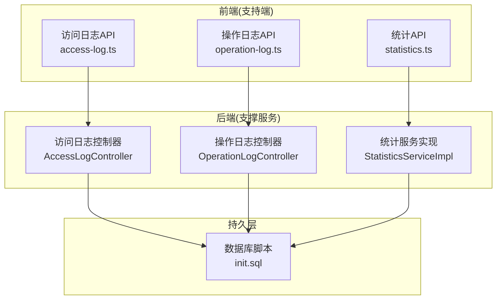
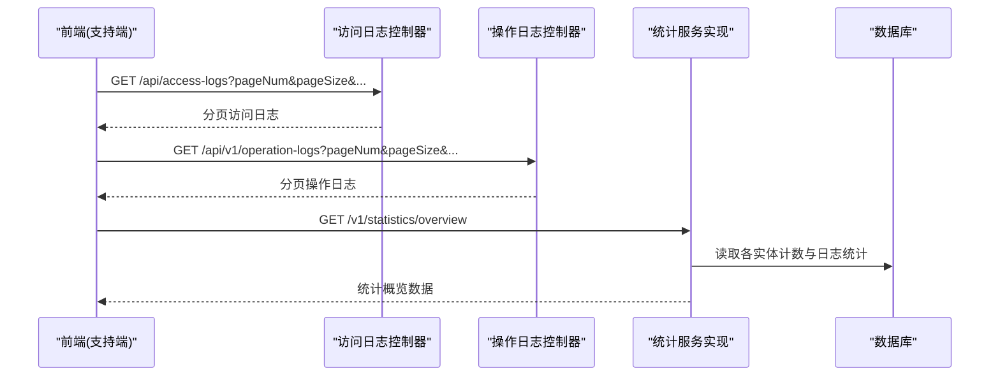
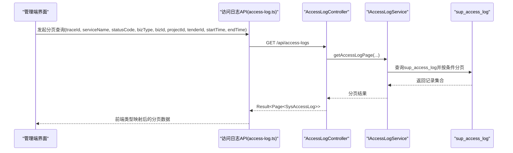
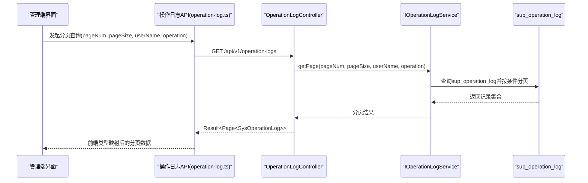
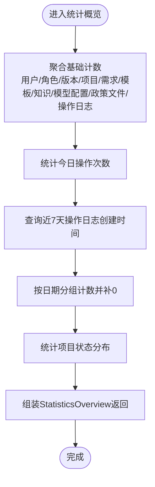
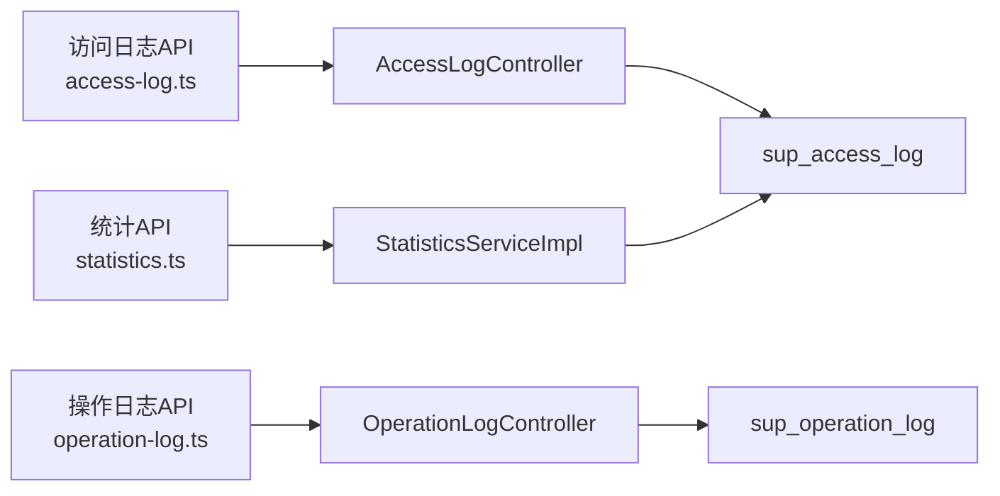

# 监控统计

<cite>
**本文引用的文件**   
- [AccessLogController.java](file://ele-ai-tender-system/ele-ai-tender-support/src/main/java/com/jy/eleaitender/support/controller/AccessLogController.java)
- [OperationLogController.java](file://ele-ai-tender-system/ele-ai-tender-support/src/main/java/com/jy/eleaitender/support/controller/OperationLogController.java)
- [StatisticsServiceImpl.java](file://ele-ai-tender-system/ele-ai-tender-support/src/main/java/com/jy/eleaitender/support/service/impl/StatisticsServiceImpl.java)
- [init.sql](file://ele-ai-tender-system/ele-ai-tender-support/sql/init.sql)
- [access-log.ts](file://ele-ai-tender-support-frontend/src/api/access-log.ts)
- [operation-log.ts](file://ele-ai-tender-support-frontend/src/api/operation-log.ts)
- [statistics.ts](file://ele-ai-tender-support-frontend/src/api/statistics.ts)
- [operation-log.ts(类型)](file://ele-ai-tender-support-frontend/src/types/operation-log.ts)
- [statistics.ts(类型)](file://ele-ai-tender-support-frontend/src/types/statistics.ts)
</cite>

## 目录
1. [简介](#简介)
2. [项目结构](#项目结构)
3. [核心组件](#核心组件)
4. [架构总览](#架构总览)
5. [详细组件分析](#详细组件分析)
6. [依赖分析](#依赖分析)
7. [性能考虑](#性能考虑)
8. [故障排查指南](#故障排查指南)
9. [结论](#结论)
10. [附录](#附录)

## 简介
本章节面向“招标文件AI编制系统”的监控与统计能力，聚焦以下方面：
- 访问日志管理：HTTP请求日志记录、IP地址追踪、用户行为分析与访问模式识别。
- 操作日志审计：关键业务操作记录、操作人追踪、时间戳与结果记录。
- 系统性能监控：接口响应时间、数据库查询性能、内存使用与CPU占用率（建议方案）。
- 业务数据统计分析：项目数量、文档生成、用户活跃度与趋势预测（基于现有统计接口扩展）。
- 告警规则配置、异常检测与自动通知（建议方案）。
- 可视化报表、数据导出与自定义指标配置（建议方案）。
- 监控数据存储策略、清理机制与性能优化建议。

## 项目结构
后端支撑模块提供访问日志、操作日志与统计概览的API；前端支撑页面通过API调用展示列表与概览数据。数据库脚本包含操作日志表与访问日志表的建表语句。

图表来源
- [AccessLogController.java:1-64](file://ele-ai-tender-system/ele-ai-tender-support/src/main/java/com/jy/eleaitender/support/controller/AccessLogController.java#L1-L64)
- [OperationLogController.java:1-35](file://ele-ai-tender-system/ele-ai-tender-support/src/main/java/com/jy/eleaitender/support/controller/OperationLogController.java#L1-L35)
- [StatisticsServiceImpl.java:76-166](file://ele-ai-tender-system/ele-ai-tender-support/src/main/java/com/jy/eleaitender/support/service/impl/StatisticsServiceImpl.java#L76-L166)
- [init.sql:213-238](file://ele-ai-tender-system/ele-ai-tender-support/sql/init.sql#L213-L238)
- [access-log.ts:1-104](file://ele-ai-tender-support-frontend/src/api/access-log.ts#L1-L104)
- [operation-log.ts:1-10](file://ele-ai-tender-support-frontend/src/api/operation-log.ts#L1-L10)
- [statistics.ts:1-10](file://ele-ai-tender-support-frontend/src/api/statistics.ts#L1-L10)

章节来源
- [AccessLogController.java:1-64](file://ele-ai-tender-system/ele-ai-tender-support/src/main/java/com/jy/eleaitender/support/controller/AccessLogController.java#L1-L64)
- [OperationLogController.java:1-35](file://ele-ai-tender-system/ele-ai-tender-support/src/main/java/com/jy/eleaitender/support/controller/OperationLogController.java#L1-L35)
- [StatisticsServiceImpl.java:76-166](file://ele-ai-tender-system/ele-ai-tender-support/src/main/java/com/jy/eleaitender/support/service/impl/StatisticsServiceImpl.java#L76-L166)
- [init.sql:213-238](file://ele-ai-tender-system/ele-ai-tender-support/sql/init.sql#L213-L238)
- [access-log.ts:1-104](file://ele-ai-tender-support-frontend/src/api/access-log.ts#L1-L104)
- [operation-log.ts:1-10](file://ele-ai-tender-support-frontend/src/api/operation-log.ts#L1-L10)
- [statistics.ts:1-10](file://ele-ai-tender-support-frontend/src/api/statistics.ts#L1-L10)

## 核心组件
- 访问日志管理
  - 后端提供分页查询接口，支持按traceId、服务名、状态码、业务类型、业务ID、项目ID、招标ID、时间范围等条件筛选。
  - 前端封装了访问日志查询API，并定义了后端字段到前端类型的映射，便于统一展示。
- 操作日志审计
  - 后端提供分页查询接口，支持按用户名、操作类型筛选。
  - 前端定义操作日志信息结构与查询参数类型，用于列表展示与过滤。
- 统计概览
  - 后端统计服务聚合多类计数（用户、角色、版本、项目、需求、模板、知识、模型配置、政策文件、操作日志等），并提供今日操作次数、近7天每日操作量、项目状态分布等。
  - 前端提供统计概览API调用入口。

章节来源
- [AccessLogController.java:24-62](file://ele-ai-tender-system/ele-ai-tender-support/src/main/java/com/jy/eleaitender/support/controller/AccessLogController.java#L24-L62)
- [access-log.ts:4-104](file://ele-ai-tender-support-frontend/src/api/access-log.ts#L4-L104)
- [OperationLogController.java:17-33](file://ele-ai-tender-system/ele-ai-tender-support/src/main/java/com/jy/eleaitender/support/controller/OperationLogController.java#L17-L33)
- [operation-log.ts:1-21](file://ele-ai-tender-support-frontend/src/types/operation-log.ts#L1-L21)
- [StatisticsServiceImpl.java:76-166](file://ele-ai-tender-system/ele-ai-tender-support/src/main/java/com/jy/eleaitender/support/service/impl/StatisticsServiceImpl.java#L76-L166)
- [statistics.ts:1-10](file://ele-ai-tender-support-frontend/src/api/statistics.ts#L1-L10)

## 架构总览
下图展示了从前端到后端再到数据库的关键链路，涵盖访问日志、操作日志与统计概览的数据流。

图表来源
- [AccessLogController.java:31-62](file://ele-ai-tender-system/ele-ai-tender-support/src/main/java/com/jy/eleaitender/support/controller/AccessLogController.java#L31-L62)
- [OperationLogController.java:24-33](file://ele-ai-tender-system/ele-ai-tender-support/src/main/java/com/jy/eleaitender/support/controller/OperationLogController.java#L24-L33)
- [StatisticsServiceImpl.java:76-166](file://ele-ai-tender-system/ele-ai-tender-support/src/main/java/com/jy/eleaitender/support/service/impl/StatisticsServiceImpl.java#L76-L166)

## 详细组件分析

### 访问日志管理
- 功能要点
  - HTTP请求日志记录：包含方法、URI、客户端IP、状态码、耗时、请求头/体、响应体、错误类型/信息等。
  - IP地址追踪：clientIp字段可用于定位来源。
  - 用户行为分析：结合userId、userName、bizType、bizId、projectId、tenderId等维度进行行为关联。
  - 访问模式识别：通过startTime/endTime筛选与statusCode、serviceName分组，识别高频路径与异常时段。
- 接口契约
  - 后端接口：GET /api/access-logs，支持分页与多维筛选。
  - 前端API：封装分页查询与字段映射，返回统一数据结构。
- 数据模型
  - 前端类型：AccessLogInfo（由后端字段映射而来）。
  - 后端实体：SysAccessLog（由控制器返回类型可知）。
- 典型流程

图表来源
- [AccessLogController.java:31-62](file://ele-ai-tender-system/ele-ai-tender-support/src/main/java/com/jy/eleaitender/support/controller/AccessLogController.java#L31-L62)
- [access-log.ts:78-104](file://ele-ai-tender-support-frontend/src/api/access-log.ts#L78-L104)
- [init.sql:235-238](file://ele-ai-tender-system/ele-ai-tender-support/sql/init.sql#L235-L238)

章节来源
- [AccessLogController.java:24-62](file://ele-ai-tender-system/ele-ai-tender-support/src/main/java/com/jy/eleaitender/support/controller/AccessLogController.java#L24-L62)
- [access-log.ts:1-104](file://ele-ai-tender-support-frontend/src/api/access-log.ts#L1-L104)
- [init.sql:235-238](file://ele-ai-tender-system/ele-ai-tender-support/sql/init.sql#L235-L238)

### 操作日志审计
- 功能要点
  - 关键业务操作记录：operation字段标识操作类型，method记录请求方法，params记录请求参数。
  - 操作人追踪：user_id/user_name可追溯责任人。
  - 时间戳与执行时长：create_time记录操作时间，execute_time记录执行时长（毫秒）。
  - 结果记录：可通过后续扩展增加successFlag/resultCode等字段以完善结果判定。
- 接口契约
  - 后端接口：GET /api/v1/operation-logs，支持分页与按用户名、操作类型筛选。
  - 前端API：封装分页查询，返回统一数据结构。
- 数据模型
  - 前端类型：OperationLogInfo、OperationLogQueryParams。
  - 后端实体：SysOperationLog（由控制器返回类型可知）。
- 典型流程

图表来源
- [OperationLogController.java:24-33](file://ele-ai-tender-system/ele-ai-tender-support/src/main/java/com/jy/eleaitender/support/controller/OperationLogController.java#L24-L33)
- [operation-log.ts:1-10](file://ele-ai-tender-support-frontend/src/api/operation-log.ts#L1-L10)
- [operation-log.ts(类型):1-21](file://ele-ai-tender-support-frontend/src/types/operation-log.ts#L1-L21)
- [init.sql:218-232](file://ele-ai-tender-system/ele-ai-tender-support/sql/init.sql#L218-L232)

章节来源
- [OperationLogController.java:17-33](file://ele-ai-tender-system/ele-ai-tender-support/src/main/java/com/jy/eleaitender/support/controller/OperationLogController.java#L17-L33)
- [operation-log.ts:1-10](file://ele-ai-tender-support-frontend/src/api/operation-log.ts#L1-L10)
- [operation-log.ts(类型):1-21](file://ele-ai-tender-support-frontend/src/types/operation-log.ts#L1-L21)
- [init.sql:218-232](file://ele-ai-tender-system/ele-ai-tender-support/sql/init.sql#L218-L232)

### 系统性能监控（建议方案）
- 目标
  - 接口响应时间：在网关或拦截器中采集请求开始/结束时间，计算耗时并写入访问日志或专用指标存储。
  - 数据库查询性能：通过慢查询日志与SQL执行计划分析，结合索引优化减少全表扫描。
  - 内存使用与CPU占用率：通过JVM监控（如Prometheus+Grafana）采集堆内存、GC、线程数与CPU使用率。
- 实施建议
  - 接入Spring Boot Actuator暴露健康与度量端点。
  - 引入Micrometer与Prometheus收集指标，Grafana进行可视化。
  - 对热点接口添加注解式埋点，输出耗时分位值（P50/P90/P99）。
- 与现有体系集成
  - 将耗时指标同步写入sup_access_log.elapsedMs字段，便于统一检索与分析。
  - 为高耗时查询建立索引与分页限制，避免大结果集拖垮数据库。

[本节为通用建议，不直接分析具体文件]

### 业务数据统计分析
- 现有能力
  - 统计概览：聚合用户、角色、版本、项目、需求、模板、知识、模型配置、政策文件、操作日志等计数。
  - 今日操作次数：按当日时间范围统计操作日志数量。
  - 近7天每日操作量：单次查询7天内操作日志创建时间，内存按日期分组计数，缺失日期补0。
  - 项目状态分布：按状态分组统计项目数量。
- 前端对接
  - 提供getOverview接口，返回StatisticsOverview结构，包括dailyOperations与projectStatusDist等数组项。
- 扩展方向
  - 文档生成统计：新增“文档生成任务”计数与成功率、平均耗时。
  - 用户活跃度：按登录频次、活跃天数、最近访问时间统计。
  - 业务趋势预测：基于历史操作量与项目进度，采用时序模型进行短期预测。

图表来源
- [StatisticsServiceImpl.java:76-166](file://ele-ai-tender-system/ele-ai-tender-support/src/main/java/com/jy/eleaitender/support/service/impl/StatisticsServiceImpl.java#L76-L166)
- [statistics.ts:1-10](file://ele-ai-tender-support-frontend/src/api/statistics.ts#L1-L10)
- [statistics.ts(类型):1-36](file://ele-ai-tender-support-frontend/src/types/statistics.ts#L1-L36)

章节来源
- [StatisticsServiceImpl.java:76-166](file://ele-ai-tender-system/ele-ai-tender-support/src/main/java/com/jy/eleaitender/support/service/impl/StatisticsServiceImpl.java#L76-L166)
- [statistics.ts:1-10](file://ele-ai-tender-support-frontend/src/api/statistics.ts#L1-L10)
- [statistics.ts(类型):1-36](file://ele-ai-tender-support-frontend/src/types/statistics.ts#L1-L36)

### 告警规则配置、异常检测与自动通知（建议方案）
- 告警规则
  - 访问异常：连续N次5xx错误或超时阈值触发。
  - 性能劣化：接口P95/P99耗时超过阈值。
  - 资源告警：CPU>80%、内存使用率>85%、磁盘空间不足。
- 异常检测
  - 基于滑动窗口统计错误率与耗时分位值，动态基线对比。
  - 对关键业务操作失败率进行监控。
- 自动通知
  - 通过邮件、企业微信、钉钉或短信通道发送告警。
  - 支持告警级别分级与静默期配置，避免风暴。

[本节为通用建议，不直接分析具体文件]

### 可视化报表、数据导出与自定义统计指标（建议方案）
- 可视化报表
  - 使用Grafana展示系统指标与业务指标看板。
  - 管理端内置报表页面，支持按日/周/月维度查看。
- 数据导出
  - 支持CSV/Excel导出访问日志与操作日志，提供下载链接与异步任务。
- 自定义统计指标
  - 提供指标注册中心，允许业务方注册自定义计数器、计时器与直方图。
  - 指标命名规范与标签维度约定，确保可观测性一致。

[本节为通用建议，不直接分析具体文件]

### 监控数据存储策略、清理机制与性能优化建议
- 存储策略
  - 访问日志与操作日志落库至sup_access_log与sup_operation_log，合理设计索引（如按create_time、user_id、ip等）。
  - 冷热分离：近期数据保留在热库，历史归档至冷存储或对象存储。
- 清理机制
  - 定时任务按策略删除过期日志（如保留90天），避免表膨胀。
  - 分区表或按月分表，提升查询与清理效率。
- 性能优化
  - 批量写入与异步落库，降低主链路延迟。
  - 控制请求体/响应体大小，避免超大字段影响I/O。
  - 针对高频查询字段建立复合索引，减少回表。

章节来源
- [init.sql:218-238](file://ele-ai-tender-system/ele-ai-tender-support/sql/init.sql#L218-L238)

## 依赖分析
- 组件耦合
  - 前端API模块依赖后端控制器提供的REST接口。
  - 控制器依赖服务层与持久层，最终访问数据库表。
- 外部依赖
  - 分页插件、安全注解、Swagger注解等框架组件。
- 潜在风险
  - 大结果集查询可能导致数据库压力，需分页与索引优化。
  - 日志字段过大可能影响写入性能，应控制长度与内容。

图表来源
- [AccessLogController.java:31-62](file://ele-ai-tender-system/ele-ai-tender-support/src/main/java/com/jy/eleaitender/support/controller/AccessLogController.java#L31-L62)
- [OperationLogController.java:24-33](file://ele-ai-tender-system/ele-ai-tender-support/src/main/java/com/jy/eleaitender/support/controller/OperationLogController.java#L24-L33)
- [StatisticsServiceImpl.java:76-166](file://ele-ai-tender-system/ele-ai-tender-support/src/main/java/com/jy/eleaitender/support/service/impl/StatisticsServiceImpl.java#L76-L166)
- [access-log.ts:78-104](file://ele-ai-tender-support-frontend/src/api/access-log.ts#L78-L104)
- [operation-log.ts:1-10](file://ele-ai-tender-support-frontend/src/api/operation-log.ts#L1-L10)
- [statistics.ts:1-10](file://ele-ai-tender-support-frontend/src/api/statistics.ts#L1-L10)
- [init.sql:218-238](file://ele-ai-tender-system/ele-ai-tender-support/sql/init.sql#L218-L238)

章节来源
- [AccessLogController.java:31-62](file://ele-ai-tender-system/ele-ai-tender-support/src/main/java/com/jy/eleaitender/support/controller/AccessLogController.java#L31-L62)
- [OperationLogController.java:24-33](file://ele-ai-tender-system/ele-ai-tender-support/src/main/java/com/jy/eleaitender/support/controller/OperationLogController.java#L24-L33)
- [StatisticsServiceImpl.java:76-166](file://ele-ai-tender-system/ele-ai-tender-support/src/main/java/com/jy/eleaitender/support/service/impl/StatisticsServiceImpl.java#L76-L166)
- [access-log.ts:78-104](file://ele-ai-tender-support-frontend/src/api/access-log.ts#L78-L104)
- [operation-log.ts:1-10](file://ele-ai-tender-support-frontend/src/api/operation-log.ts#L1-L10)
- [statistics.ts:1-10](file://ele-ai-tender-support-frontend/src/api/statistics.ts#L1-L10)
- [init.sql:218-238](file://ele-ai-tender-system/ele-ai-tender-support/sql/init.sql#L218-L238)

## 性能考虑
- 接口响应时间
  - 在访问日志中记录elapsedMs，结合前端展示与后端埋点，定位慢接口。
- 数据库查询性能
  - 为sup_access_log与sup_operation_log的常用查询字段建立索引（如create_time、user_id、ip、status_code）。
  - 避免SELECT *，仅选择必要字段，减少网络传输与序列化开销。
- 内存与CPU
  - 使用连接池与线程池合理配置，避免资源争用。
  - 对统计接口进行缓存（如Redis），降低重复计算。
- 日志写入性能
  - 采用异步写入与批量插入，避免阻塞主业务链路。
  - 控制requestBody/responseBody大小，必要时脱敏与截断。

[本节为通用建议，不直接分析具体文件]

## 故障排查指南
- 访问日志问题
  - 检查traceId是否贯穿链路，确认前后端传递一致性。
  - 核对startTime/endTime格式与时区，确保筛选有效。
  - 关注statusCode与errorType/errorMessage，快速定位异常。
- 操作日志问题
  - 确认user_id/user_name是否正确填充，避免匿名操作无法追踪。
  - 检查execute_time是否为空，评估是否存在未记录耗时的场景。
- 统计概览问题
  - 核对todayOperationCount与last7DaysOperations的计算逻辑，确认时间边界与补0策略。
  - 验证projectStatusDist的状态枚举与名称映射是否一致。

章节来源
- [AccessLogController.java:31-62](file://ele-ai-tender-system/ele-ai-tender-support/src/main/java/com/jy/eleaitender/support/controller/AccessLogController.java#L31-L62)
- [OperationLogController.java:24-33](file://ele-ai-tender-system/ele-ai-tender-support/src/main/java/com/jy/eleaitender/support/controller/OperationLogController.java#L24-L33)
- [StatisticsServiceImpl.java:76-166](file://ele-ai-tender-system/ele-ai-tender-support/src/main/java/com/jy/eleaitender/support/service/impl/StatisticsServiceImpl.java#L76-L166)

## 结论
当前系统在访问日志、操作日志与统计概览方面已具备基础能力，能够满足日常运维与审计需求。建议在现有基础上进一步完善性能监控、告警与可视化报表，并通过合理的存储策略与清理机制保障系统长期稳定运行。

## 附录
- 相关API路径
  - 访问日志：GET /api/access-logs
  - 操作日志：GET /api/v1/operation-logs
  - 统计概览：GET /v1/statistics/overview
- 数据表
  - sup_access_log：系统访问日志表
  - sup_operation_log：操作日志表

章节来源
- [AccessLogController.java:24-62](file://ele-ai-tender-system/ele-ai-tender-support/src/main/java/com/jy/eleaitender/support/controller/AccessLogController.java#L24-L62)
- [OperationLogController.java:17-33](file://ele-ai-tender-system/ele-ai-tender-support/src/main/java/com/jy/eleaitender/support/controller/OperationLogController.java#L17-L33)
- [statistics.ts:1-10](file://ele-ai-tender-support-frontend/src/api/statistics.ts#L1-L10)
- [init.sql:218-238](file://ele-ai-tender-system/ele-ai-tender-support/sql/init.sql#L218-L238)