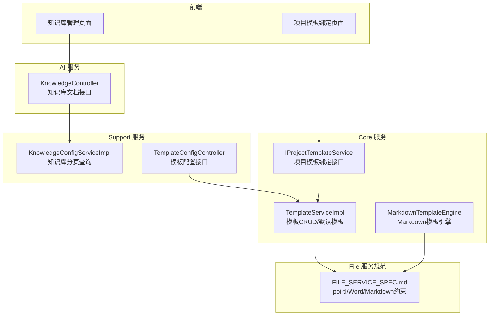
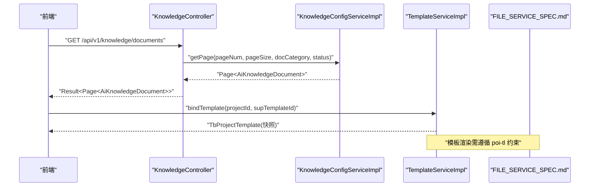
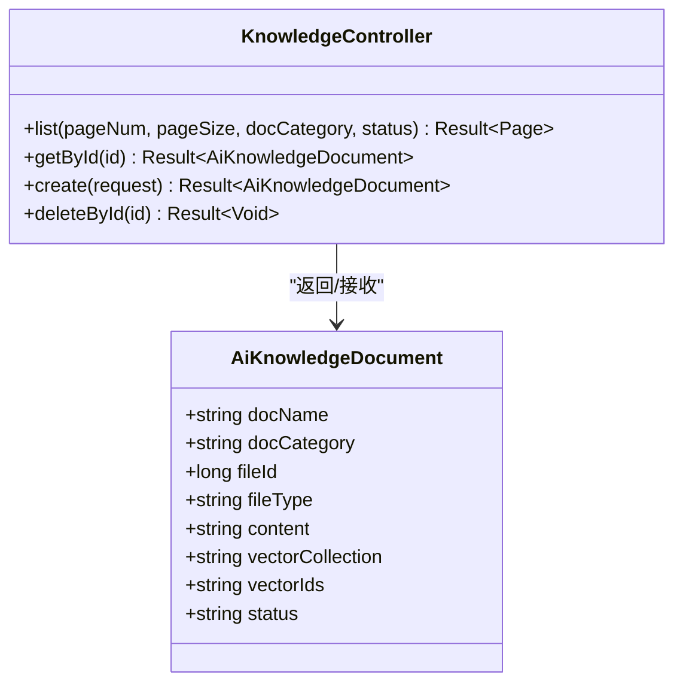
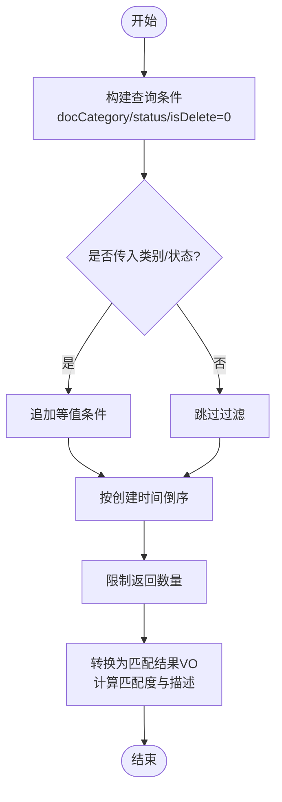
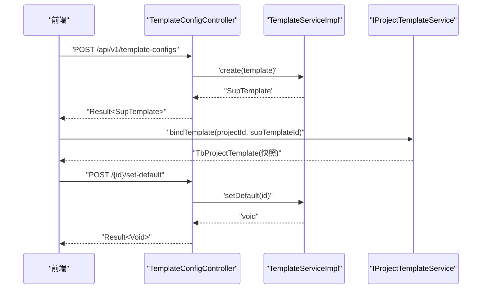
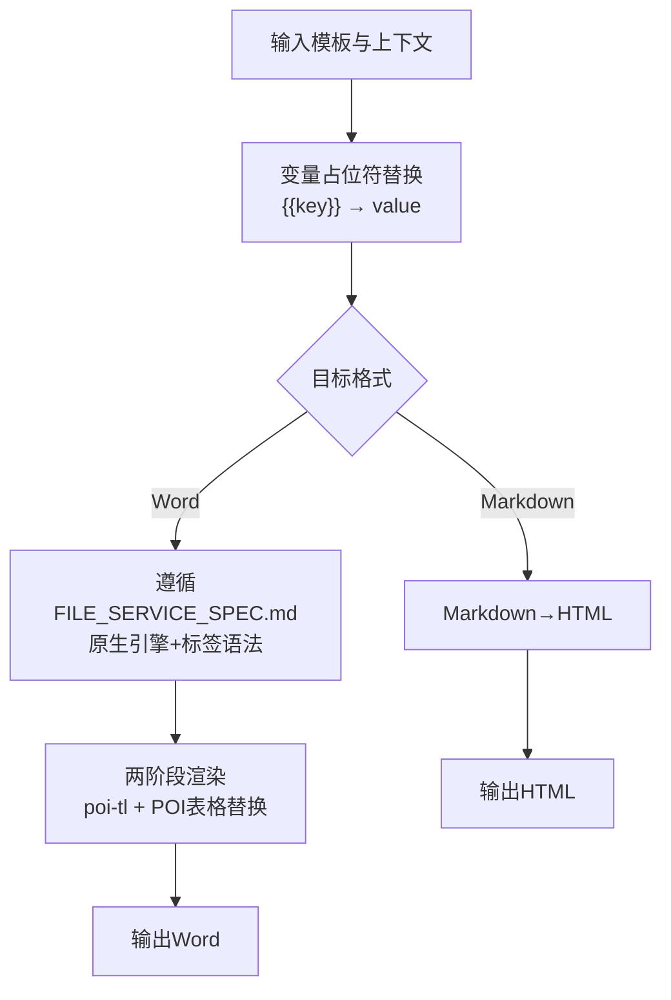
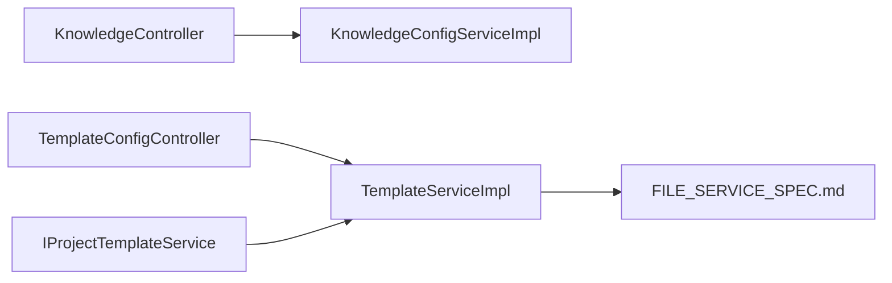

# 知识库与模板管理

<cite>
**本文引用的文件**
- [AiKnowledgeDocument.java](file://ele-ai-tender-system/ele-ai-tender-common/src/main/java/com/jy/eleaitender/common/entity/ai/AiKnowledgeDocument.java)
- [KnowledgeController.java](file://ele-ai-tender-system/ele-ai-tender-ai/src/main/java/com/jy/eleaitender/ai/controller/KnowledgeController.java)
- [KnowledgeConfigServiceImpl.java](file://ele-ai-tender-system/ele-ai-tender-support/src/main/java/com/jy/eleaitender/support/service/impl/KnowledgeConfigServiceImpl.java)
- [RequirementServiceImpl.java](file://ele-ai-tender-system/ele-ai-tender-core/src/main/java/com/jy/eleaitender/core/service/impl/RequirementServiceImpl.java)
- [MarkdownTemplateEngine.java](file://ele-ai-tender-system/ele-ai-tender-core/src/main/java/com/jy/eleaitender/core/engine/MarkdownTemplateEngine.java)
- [FILE_SERVICE_SPEC.md](file://docs/rules/FILE_SERVICE_SPEC.md)
- [projectTemplate.ts](file://ele-ai-tender-frontend/src/api/projectTemplate.ts)
- [TemplateServiceImpl.java](file://ele-ai-tender-system/ele-ai-tender-core/src/main/java/com/jy/eleaitender/core/service/impl/TemplateServiceImpl.java)
- [IProjectTemplateService.java](file://ele-ai-tender-system/ele-ai-tender-core/src/main/java/com/jy/eleaitender/core/service/IProjectTemplateService.java)
- [TemplateConfigController.java](file://ele-ai-tender-system/ele-ai-tender-support/src/main/java/com/jy/eleaitender/support/controller/TemplateConfigController.java)
</cite>

## 目录
1. [引言](#引言)
2. [项目结构](#项目结构)
3. [核心组件](#核心组件)
4. [架构总览](#架构总览)
5. [详细组件分析](#详细组件分析)
6. [依赖关系分析](#依赖关系分析)
7. [性能与优化](#性能与优化)
8. [故障排查指南](#故障排查指南)
9. [结论](#结论)
10. [附录](#附录)

## 引言
本文件面向“招标文件AI编制系统”的知识库与模板管理功能，系统性阐述：
- 向量知识库的构建与管理（文档上传、文本提取、向量化处理、相似度检索）
- 知识文档的分类管理与标签体系、检索优化策略
- 项目模板管理（创建、版本控制、默认模板、状态管理、项目绑定快照）
- 文档模板引擎（占位符语法、条件渲染、循环处理、函数调用能力边界）
- 模板预览、测试与发布流程
- 模板市场概念（共享、复用、协作编辑）
- 知识库索引优化、检索性能调优与模板缓存策略配置方法

## 项目结构
围绕知识库与模板管理，代码分布在以下模块：
- AI 服务：提供知识库文档的 REST 接口
- Support 服务：提供模板配置与知识库文档列表查询等支撑能力
- Core 服务：提供模板业务逻辑、项目模板绑定与 Markdown 模板引擎
- File 服务规范：定义 Word/Markdown 模板渲染、结构解析、文本提取等约束
- 前端：提供项目模板绑定与知识库管理页面

图表来源
- [KnowledgeController.java:1-55](file://ele-ai-tender-system/ele-ai-tender-ai/src/main/java/com/jy/eleaitender/ai/controller/KnowledgeController.java#L1-L55)
- [KnowledgeConfigServiceImpl.java:1-30](file://ele-ai-tender-system/ele-ai-tender-support/src/main/java/com/jy/eleaitender/support/service/impl/KnowledgeConfigServiceImpl.java#L1-L30)
- [TemplateConfigController.java:1-81](file://ele-ai-tender-system/ele-ai-tender-support/src/main/java/com/jy/eleaitender/support/controller/TemplateConfigController.java#L1-L81)
- [TemplateServiceImpl.java:1-125](file://ele-ai-tender-system/ele-ai-tender-core/src/main/java/com/jy/eleaitender/core/service/impl/TemplateServiceImpl.java#L1-L125)
- [IProjectTemplateService.java:1-34](file://ele-ai-tender-system/ele-ai-tender-core/src/main/java/com/jy/eleaitender/core/service/IProjectTemplateService.java#L1-L34)
- [MarkdownTemplateEngine.java:1-82](file://ele-ai-tender-system/ele-ai-tender-core/src/main/java/com/jy/eleaitender/core/engine/MarkdownTemplateEngine.java#L1-L82)
- [FILE_SERVICE_SPEC.md:1-153](file://docs/rules/FILE_SERVICE_SPEC.md#L1-L153)

章节来源
- [KnowledgeController.java:1-55](file://ele-ai-tender-system/ele-ai-tender-ai/src/main/java/com/jy/eleaitender/ai/controller/KnowledgeController.java#L1-L55)
- [KnowledgeConfigServiceImpl.java:1-30](file://ele-ai-tender-system/ele-ai-tender-support/src/main/java/com/jy/eleaitender/support/service/impl/KnowledgeConfigServiceImpl.java#L1-L30)
- [TemplateConfigController.java:1-81](file://ele-ai-tender-system/ele-ai-tender-support/src/main/java/com/jy/eleaitender/support/controller/TemplateConfigController.java#L1-L81)
- [TemplateServiceImpl.java:1-125](file://ele-ai-tender-system/ele-ai-tender-core/src/main/java/com/jy/eleaitender/core/service/impl/TemplateServiceImpl.java#L1-L125)
- [IProjectTemplateService.java:1-34](file://ele-ai-tender-system/ele-ai-tender-core/src/main/java/com/jy/eleaitender/core/service/IProjectTemplateService.java#L1-L34)
- [MarkdownTemplateEngine.java:1-82](file://ele-ai-tender-system/ele-ai-tender-core/src/main/java/com/jy/eleaitender/core/engine/MarkdownTemplateEngine.java#L1-L82)
- [FILE_SERVICE_SPEC.md:1-153](file://docs/rules/FILE_SERVICE_SPEC.md#L1-L153)

## 核心组件
- 知识库文档实体：用于持久化文档元数据、文本内容、向量集合与ID映射、状态等。
- 知识库文档控制器：对外暴露文档列表、详情、创建、删除等接口。
- 知识库配置服务：按类别、状态进行分页查询，支持软删除过滤。
- 模板配置控制器：提供模板的增删改查、设为默认、状态设置等接口。
- 模板服务实现：模板分页、默认模板选择、创建/更新/删除、批量删除、默认模板切换。
- 项目模板服务接口：项目引用模板（从通用模板到项目模板快照）、按项目获取、级联删除。
- Markdown 模板引擎：变量替换与 Markdown→HTML 转换，供内部生成使用。
- 文件服务规范：定义 poi-tl 占位符语法、两阶段渲染、修订标记预处理、表格生成约束等。

章节来源
- [AiKnowledgeDocument.java:1-31](file://ele-ai-tender-system/ele-ai-tender-common/src/main/java/com/jy/eleaitender/common/entity/ai/AiKnowledgeDocument.java#L1-L31)
- [KnowledgeController.java:1-55](file://ele-ai-tender-system/ele-ai-tender-ai/src/main/java/com/jy/eleaitender/ai/controller/KnowledgeController.java#L1-L55)
- [KnowledgeConfigServiceImpl.java:1-30](file://ele-ai-tender-system/ele-ai-tender-support/src/main/java/com/jy/eleaitender/support/service/impl/KnowledgeConfigServiceImpl.java#L1-L30)
- [TemplateConfigController.java:1-81](file://ele-ai-tender-system/ele-ai-tender-support/src/main/java/com/jy/eleaitender/support/controller/TemplateConfigController.java#L1-L81)
- [TemplateServiceImpl.java:1-125](file://ele-ai-tender-system/ele-ai-tender-core/src/main/java/com/jy/eleaitender/core/service/impl/TemplateServiceImpl.java#L1-L125)
- [IProjectTemplateService.java:1-34](file://ele-ai-tender-system/ele-ai-tender-core/src/main/java/com/jy/eleaitender/core/service/IProjectTemplateService.java#L1-L34)
- [MarkdownTemplateEngine.java:1-82](file://ele-ai-tender-system/ele-ai-tender-core/src/main/java/com/jy/eleaitender/core/engine/MarkdownTemplateEngine.java#L1-L82)
- [FILE_SERVICE_SPEC.md:1-153](file://docs/rules/FILE_SERVICE_SPEC.md#L1-L153)

## 架构总览
知识库与模板管理的整体交互如下：
- 前端通过 KnowledgeController 访问知识库文档；通过 TemplateConfigController 管理模板；通过 IProjectTemplateService 将通用模板绑定到项目形成快照。
- 模板渲染遵循 FILE_SERVICE_SPEC.md 中关于 poi-tl 的约束，确保占位符、循环、条件、图片、包含等语法正确。
- Markdown 模板引擎在 Core 模块内完成变量替换与 Markdown→HTML 转换，满足需求导出等场景。

图表来源
- [KnowledgeController.java:1-55](file://ele-ai-tender-system/ele-ai-tender-ai/src/main/java/com/jy/eleaitender/ai/controller/KnowledgeController.java#L1-L55)
- [KnowledgeConfigServiceImpl.java:1-30](file://ele-ai-tender-system/ele-ai-tender-support/src/main/java/com/jy/eleaitender/support/service/impl/KnowledgeConfigServiceImpl.java#L1-L30)
- [TemplateServiceImpl.java:1-125](file://ele-ai-tender-system/ele-ai-tender-core/src/main/java/com/jy/eleaitender/core/service/impl/TemplateServiceImpl.java#L1-L125)
- [FILE_SERVICE_SPEC.md:1-153](file://docs/rules/FILE_SERVICE_SPEC.md#L1-L153)

## 详细组件分析

### 知识库文档模型与接口
- 文档模型字段包括：文档名称、类别、文件ID、文件类型、文本内容、向量集合名、向量ID列表JSON、状态。
- 控制器提供分页列表、详情、创建、删除接口，均要求登录。

图表来源
- [AiKnowledgeDocument.java:1-31](file://ele-ai-tender-system/ele-ai-tender-common/src/main/java/com/jy/eleaitender/common/entity/ai/AiKnowledgeDocument.java#L1-L31)
- [KnowledgeController.java:1-55](file://ele-ai-tender-system/ele-ai-tender-ai/src/main/java/com/jy/eleaitender/ai/controller/KnowledgeController.java#L1-L55)

章节来源
- [AiKnowledgeDocument.java:1-31](file://ele-ai-tender-system/ele-ai-tender-common/src/main/java/com/jy/eleaitender/common/entity/ai/AiKnowledgeDocument.java#L1-L31)
- [KnowledgeController.java:1-55](file://ele-ai-tender-system/ele-ai-tender-ai/src/main/java/com/jy/eleaitender/ai/controller/KnowledgeController.java#L1-L55)

### 知识库文档分类与检索
- 支持按文档类别、状态筛选，并过滤软删除记录。
- 在需求匹配场景中，按项目类型（文档类别）与关键词进行基础评分与描述生成，便于快速定位相关文档。

图表来源
- [KnowledgeConfigServiceImpl.java:1-30](file://ele-ai-tender-system/ele-ai-tender-support/src/main/java/com/jy/eleaitender/support/service/impl/KnowledgeConfigServiceImpl.java#L1-L30)
- [RequirementServiceImpl.java:334-396](file://ele-ai-tender-system/ele-ai-tender-core/src/main/java/com/jy/eleaitender/core/service/impl/RequirementServiceImpl.java#L334-L396)

章节来源
- [KnowledgeConfigServiceImpl.java:1-30](file://ele-ai-tender-system/ele-ai-tender-support/src/main/java/com/jy/eleaitender/support/service/impl/KnowledgeConfigServiceImpl.java#L1-L30)
- [RequirementServiceImpl.java:334-396](file://ele-ai-tender-system/ele-ai-tender-core/src/main/java/com/jy/eleaitender/core/service/impl/RequirementServiceImpl.java#L334-L396)

### 项目模板管理
- 模板配置接口：分页查询、详情、创建、更新、删除、设为默认、状态设置。
- 模板服务实现：分页、默认模板选择、创建/更新/删除、批量删除、默认模板切换（同项目类别下仅一个默认）。
- 项目模板绑定：将通用模板快照到项目模板表，支持按项目获取与级联删除。

图表来源
- [TemplateConfigController.java:1-81](file://ele-ai-tender-system/ele-ai-tender-support/src/main/java/com/jy/eleaitender/support/controller/TemplateConfigController.java#L1-L81)
- [TemplateServiceImpl.java:1-125](file://ele-ai-tender-system/ele-ai-tender-core/src/main/java/com/jy/eleaitender/core/service/impl/TemplateServiceImpl.java#L1-L125)
- [IProjectTemplateService.java:1-34](file://ele-ai-tender-system/ele-ai-tender-core/src/main/java/com/jy/eleaitender/core/service/IProjectTemplateService.java#L1-L34)

章节来源
- [TemplateConfigController.java:1-81](file://ele-ai-tender-system/ele-ai-tender-support/src/main/java/com/jy/eleaitender/support/controller/TemplateConfigController.java#L1-L81)
- [TemplateServiceImpl.java:1-125](file://ele-ai-tender-system/ele-ai-tender-core/src/main/java/com/jy/eleaitender/core/service/impl/TemplateServiceImpl.java#L1-L125)
- [IProjectTemplateService.java:1-34](file://ele-ai-tender-system/ele-ai-tender-core/src/main/java/com/jy/eleaitender/core/service/IProjectTemplateService.java#L1-L34)

### 文档模板引擎与渲染约束
- Markdown 模板引擎：支持变量占位符替换与 Markdown→HTML 转换，适用于内部文档生成。
- Word 模板渲染遵循 FILE_SERVICE_SPEC.md 中的约束：
  - 必须使用原生引擎，禁止 SpringEL
  - 占位符语法为 {{变量名}}，支持中英文变量名
  - 完整标签语法：文本、循环（区块对）、图片、包含（子模板）、条件（区块对）
  - 两阶段渲染：先 poi-tl 渲染文本/图片/Markdown，再 POI 扫描占位段落用 TableGenerator 替换为真实表格
  - 修订标记预处理：渲染前接受所有修订，避免 poi-tl 编译异常
  - poi-tl 版本要求 ≥ 1.12.2

图表来源
- [MarkdownTemplateEngine.java:1-82](file://ele-ai-tender-system/ele-ai-tender-core/src/main/java/com/jy/eleaitender/core/engine/MarkdownTemplateEngine.java#L1-L82)
- [FILE_SERVICE_SPEC.md:33-71](file://docs/rules/FILE_SERVICE_SPEC.md#L33-L71)

章节来源
- [MarkdownTemplateEngine.java:1-82](file://ele-ai-tender-system/ele-ai-tender-core/src/main/java/com/jy/eleaitender/core/engine/MarkdownTemplateEngine.java#L1-L82)
- [FILE_SERVICE_SPEC.md:33-71](file://docs/rules/FILE_SERVICE_SPEC.md#L33-L71)

### 模板预览、测试与发布流程
- 预览：通过模板详情接口获取模板内容与结构定义，结合渲染引擎进行本地或在线预览。
- 测试：基于占位符语法与标签规则进行用例验证，确保循环、条件、图片、包含等标签正确。
- 发布：通过状态设置接口将模板置为可用状态，并可设为默认模板以便项目自动绑定。

章节来源
- [TemplateConfigController.java:1-81](file://ele-ai-tender-system/ele-ai-tender-support/src/main/java/com/jy/eleaitender/support/controller/TemplateConfigController.java#L1-L81)
- [TemplateServiceImpl.java:1-125](file://ele-ai-tender-system/ele-ai-tender-core/src/main/java/com/jy/eleaitender/core/service/impl/TemplateServiceImpl.java#L1-L125)
- [FILE_SERVICE_SPEC.md:33-71](file://docs/rules/FILE_SERVICE_SPEC.md#L33-L71)

### 模板市场概念（共享、复用、协作编辑）
- 共享：将模板设置为公开或团队可见，允许其他用户复用。
- 复用：项目创建时根据项目类别与类型自动绑定默认模板，减少重复工作。
- 协作编辑：多人协同维护模板版本，结合版本控制与变更日志，确保可追溯。

[本节为概念性说明，不直接分析具体文件]

### 项目模板绑定（前端调用）
- 前端通过 projectTemplateApi.bind 与 getByProject 接口完成模板绑定与读取。

章节来源
- [projectTemplate.ts:1-14](file://ele-ai-tender-frontend/src/api/projectTemplate.ts#L1-L14)

## 依赖关系分析
- 控制器与服务层解耦：KnowledgeController 依赖 IKnowledgeDocumentService（由 Support 提供分页查询），TemplateConfigController 依赖 ITemplateConfigService（由 Core 提供模板业务）。
- 模板渲染依赖 FILE_SERVICE_SPEC.md 的约束，确保跨模块一致性与稳定性。
- 项目模板绑定通过 IProjectTemplateService 将通用模板快照到项目维度，保证项目独立演进。

图表来源
- [KnowledgeController.java:1-55](file://ele-ai-tender-system/ele-ai-tender-ai/src/main/java/com/jy/eleaitender/ai/controller/KnowledgeController.java#L1-L55)
- [KnowledgeConfigServiceImpl.java:1-30](file://ele-ai-tender-system/ele-ai-tender-support/src/main/java/com/jy/eleaitender/support/service/impl/KnowledgeConfigServiceImpl.java#L1-L30)
- [TemplateConfigController.java:1-81](file://ele-ai-tender-system/ele-ai-tender-support/src/main/java/com/jy/eleaitender/support/controller/TemplateConfigController.java#L1-L81)
- [TemplateServiceImpl.java:1-125](file://ele-ai-tender-system/ele-ai-tender-core/src/main/java/com/jy/eleaitender/core/service/impl/TemplateServiceImpl.java#L1-L125)
- [FILE_SERVICE_SPEC.md:1-153](file://docs/rules/FILE_SERVICE_SPEC.md#L1-L153)

章节来源
- [KnowledgeController.java:1-55](file://ele-ai-tender-system/ele-ai-tender-ai/src/main/java/com/jy/eleaitender/ai/controller/KnowledgeController.java#L1-L55)
- [KnowledgeConfigServiceImpl.java:1-30](file://ele-ai-tender-system/ele-ai-tender-support/src/main/java/com/jy/eleaitender/support/service/impl/KnowledgeConfigServiceImpl.java#L1-L30)
- [TemplateConfigController.java:1-81](file://ele-ai-tender-system/ele-ai-tender-support/src/main/java/com/jy/eleaitender/support/controller/TemplateConfigController.java#L1-L81)
- [TemplateServiceImpl.java:1-125](file://ele-ai-tender-system/ele-ai-tender-core/src/main/java/com/jy/eleaitender/core/service/impl/TemplateServiceImpl.java#L1-L125)
- [FILE_SERVICE_SPEC.md:1-153](file://docs/rules/FILE_SERVICE_SPEC.md#L1-L153)

## 性能与优化
- 知识库索引优化
  - 利用 AiKnowledgeDocument.vectorCollection 与 vectorIds 字段对接外部向量数据库，提升语义检索效率。
  - 建议对 docCategory、status、isDelete 建立复合索引以加速分页与过滤。
- 检索性能调优
  - 在需求匹配场景中，优先按类别过滤，再进行关键词模糊匹配，降低全表扫描范围。
  - 限制返回条数（如 LIMIT 20），避免大结果集传输。
- 模板缓存策略
  - 对常用模板的结构定义与渲染结果进行缓存（如 Redis），缩短渲染耗时。
  - 缓存键可按模板ID+版本号+状态组合，失效策略采用写扩散或定时刷新。
- 渲染性能
  - 遵循 FILE_SERVICE_SPEC.md 的两阶段渲染与修订标记预处理，避免异常与回退路径。
  - 合理使用表格生成与 Markdown 渲染，避免过大对象导致内存压力。

[本节提供通用指导，未直接分析具体文件]

## 故障排查指南
- 模板渲染异常
  - 检查是否使用了原生引擎而非 SpringEL，确认占位符语法符合 FILE_SERVICE_SPEC.md。
  - 若出现 IndexOutOfBoundsException，确认是否在渲染前执行了“接受所有修订”。
- 表格渲染问题
  - 确认 TABLE 类型已通过 POI 编程生成，避免相邻标签合并导致的标签不匹配。
- 知识库检索不准确
  - 检查 docCategory 与 status 是否正确设置，确认 isDelete 过滤生效。
  - 核对向量集合与向量ID映射是否同步更新。
- 项目模板绑定失败
  - 确认源模板存在且状态可用，检查唯一约束与级联删除逻辑。

章节来源
- [FILE_SERVICE_SPEC.md:33-71](file://docs/rules/FILE_SERVICE_SPEC.md#L33-L71)
- [KnowledgeConfigServiceImpl.java:1-30](file://ele-ai-tender-system/ele-ai-tender-support/src/main/java/com/jy/eleaitender/support/service/impl/KnowledgeConfigServiceImpl.java#L1-L30)
- [TemplateServiceImpl.java:1-125](file://ele-ai-tender-system/ele-ai-tender-core/src/main/java/com/jy/eleaitender/core/service/impl/TemplateServiceImpl.java#L1-L125)

## 结论
本项目在知识库与模板管理方面形成了清晰的职责划分与稳定的渲染约束：
- 知识库文档通过实体与控制器暴露标准接口，配合 Support 服务实现高效分页与过滤。
- 模板管理覆盖 CRUD、默认模板与状态管理，并通过项目模板绑定实现模板快照与项目隔离。
- 模板渲染严格遵循文件服务规范，保障 Word/Markdown 生成的稳定性与一致性。
- 后续可在向量检索、缓存策略与模板市场方面持续优化，提升用户体验与系统性能。

[本节为总结性内容，不直接分析具体文件]

## 附录
- 前端项目模板绑定 API 参考
  - bind(projectId, supTemplateId)
  - getByProject(projectId)

章节来源
- [projectTemplate.ts:1-14](file://ele-ai-tender-frontend/src/api/projectTemplate.ts#L1-L14)