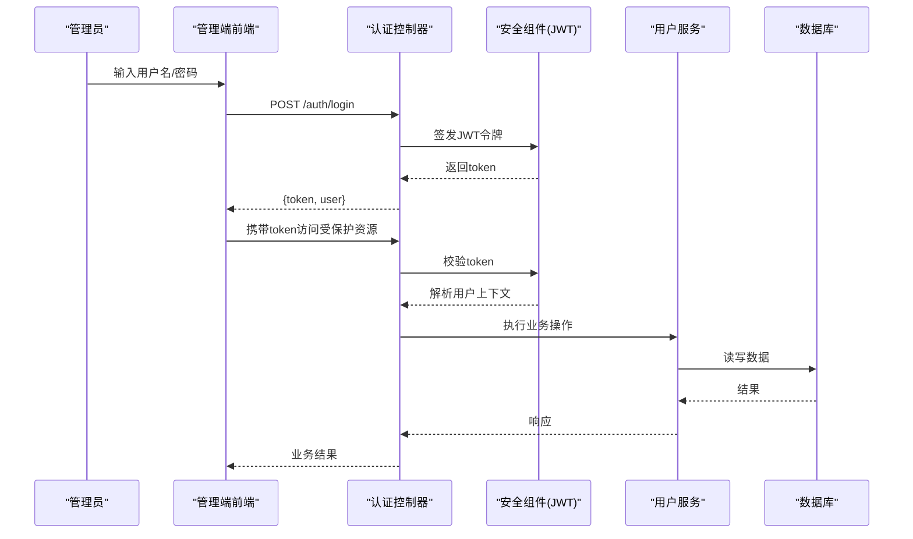
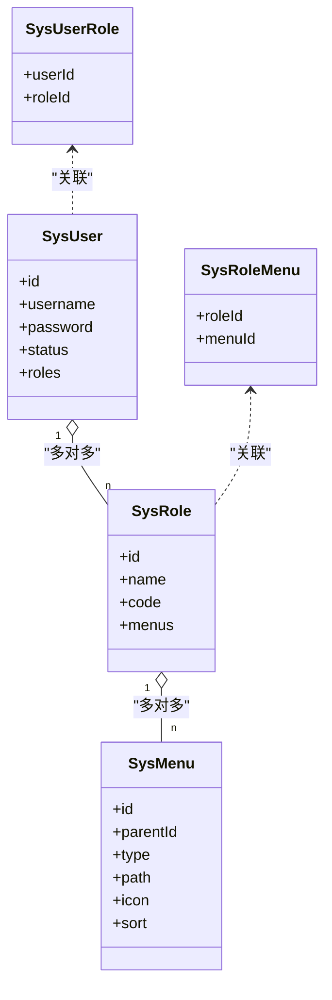
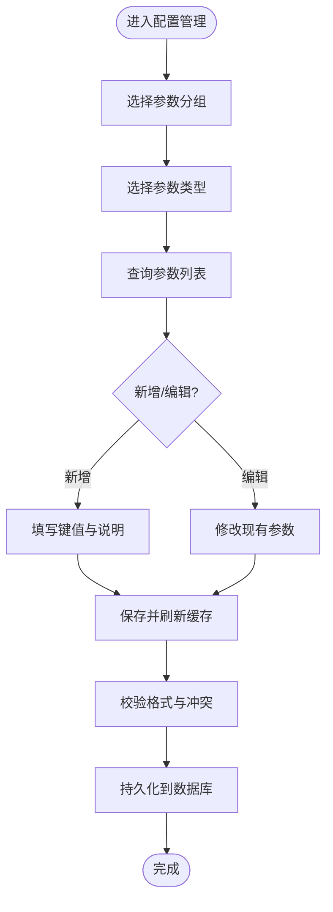
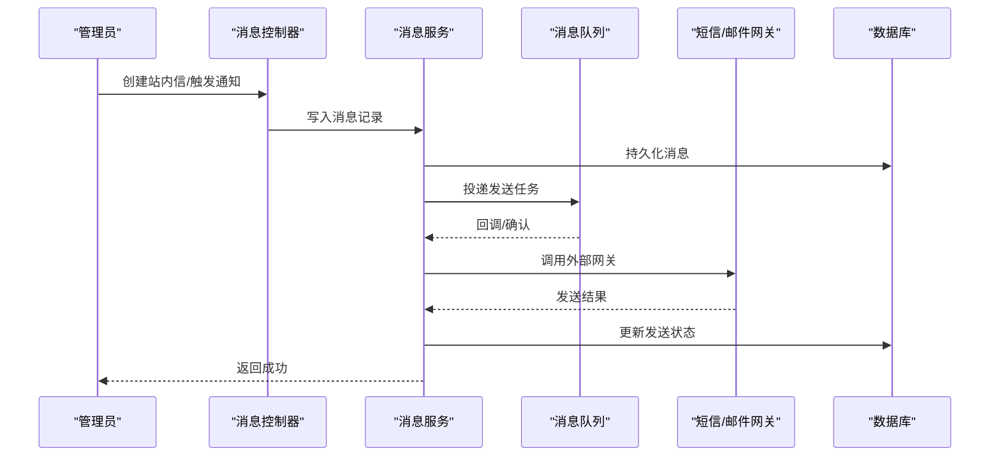
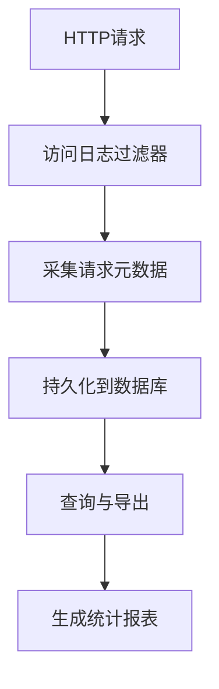
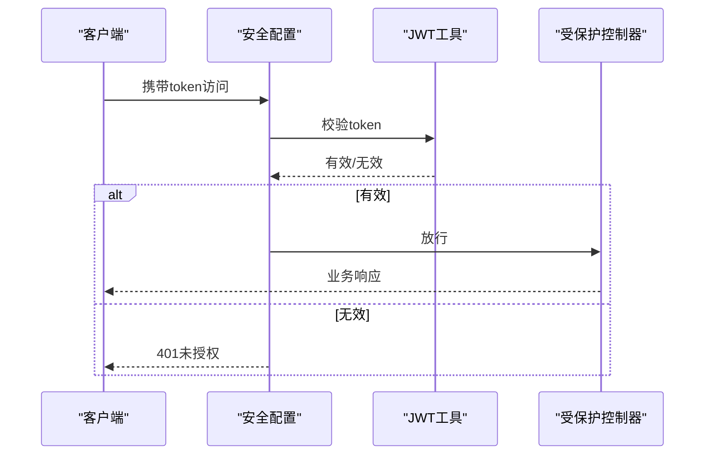
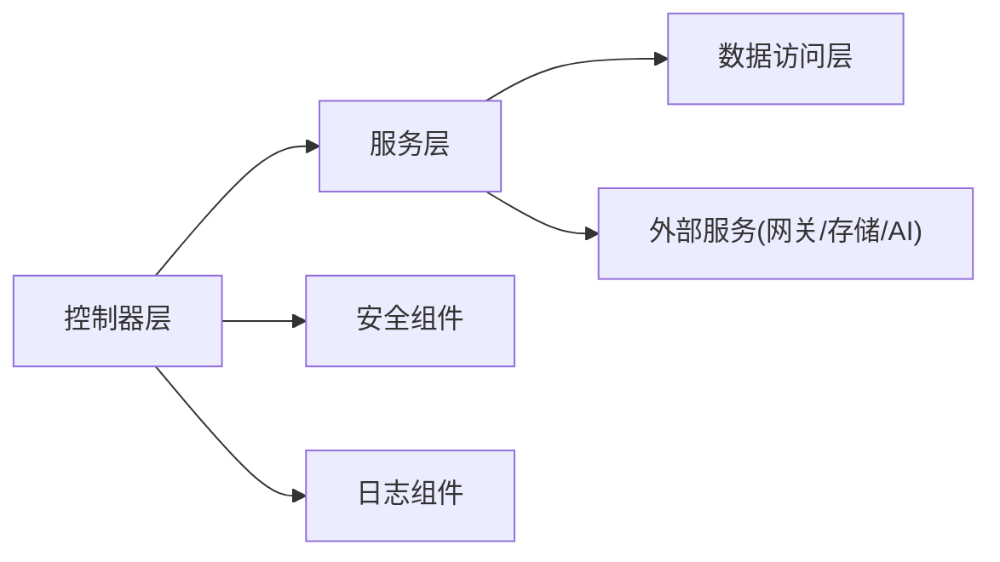

# 系统管理

<cite>
**本文引用的文件**   
- [ele-ai-tender-support/src/main/java/com/jy/eleaitender/support/controller/AuthController.java](file://ele-ai-tender-system/ele-ai-tender-support/src/main/java/com/jy/eleaitender/support/controller/AuthController.java)
- [ele-ai-tender-support/src/main/java/com/jy/eleaitender/support/controller/UserController.java](file://ele-ai-tender-system/ele-ai-tender-support/src/main/java/com/jy/eleaitender/support/controller/UserController.java)
- [ele-ai-tender-support/src/main/java/com/jy/eleaitender/support/controller/RoleController.java](file://ele-ai-tender-system/ele-ai-tender-support/src/main/java/com/jy/eleaitender/support/controller/RoleController.java)
- [ele-ai-tender-support/src/main/java/com/jy/eleaitender/support/controller/MenuController.java](file://ele-ai-tender-system/ele-ai-tender-support/src/main/java/com/jy/eleaitender/support/controller/MenuController.java)
- [ele-ai-tender-support/src/main/java/com/jy/eleaitender/support/controller/SysParamController.java](file://ele-ai-tender-system/ele-ai-tender-support/src/main/java/com/jy/eleaitender/support/controller/SysParamController.java)
- [ele-ai-tender-support/src/main/java/com/jy/eleaitender/support/controller/ModelConfigController.java](file://ele-ai-tender-system/ele-ai-tender-support/src/main/java/com/jy/eleaitender/support/controller/ModelConfigController.java)
- [ele-ai-tender-support/src/main/java/com/jy/eleaitender/support/controller/ModelRouteController.java](file://ele-ai-tender-system/ele-ai-tender-support/src/main/java/com/jy/eleaitender/support/controller/ModelRouteController.java)
- [ele-ai-tender-support/src/main/java/com/jy/eleaitender/support/controller/MessageController.java](file://ele-ai-tender-system/ele-ai-tender-support/src/main/java/com/jy/eleaitender/support/controller/MessageController.java)
- [ele-ai-tender-support/src/main/java/com/jy/eleaitender/support/controller/AccessLogController.java](file://ele-ai-tender-system/ele-ai-tender-support/src/main/java/com/jy/eleaitender/support/controller/AccessLogController.java)
- [ele-ai-tender-support/src/main/java/com/jy/eleaitender/support/controller/OperationLogController.java](file://ele-ai-tender-system/ele-ai-tender-support/src/main/java/com/jy/eleaitender/support/controller/OperationLogController.java)
- [ele-ai-tender-support/src/main/java/com/jy/eleaitender/support/controller/StatisticsController.java](file://ele-ai-tender-system/ele-ai-tender-support/src/main/java/com/jy/eleaitender/support/controller/StatisticsController.java)
- [ele-ai-tender-support/src/main/java/com/jy/eleaitender/support/controller/VersionController.java](file://ele-ai-tender-system/ele-ai-tender-support/src/main/java/com/jy/eleaitender/support/controller/VersionController.java)
- [ele-ai-tender-support/src/main/java/com/jy/eleaitender/support/service/impl/AuthServiceImpl.java](file://ele-ai-tender-system/ele-ai-tender-support/src/main/java/com/jy/eleaitender/support/service/impl/AuthServiceImpl.java)
- [ele-ai-tender-support/src/main/java/com/jy/eleaitender/support/service/impl/UserServiceImpl.java](file://ele-ai-tender-system/ele-ai-tender-support/src/main/java/com/jy/eleaitender/support/service/impl/UserServiceImpl.java)
- [ele-ai-tender-support/src/main/java/com/jy/eleaitender/support/service/impl/RoleServiceImpl.java](file://ele-ai-tender-system/ele-ai-tender-support/src/main/java/com/jy/eleaitender/support/service/impl/RoleServiceImpl.java)
- [ele-ai-tender-support/src/main/java/com/jy/eleaitender/support/service/impl/MenuServiceImpl.java](file://ele-ai-tender-system/ele-ai-tender-support/src/main/java/com/jy/eleaitender/support/service/impl/MenuServiceImpl.java)
- [ele-ai-tender-support/src/main/java/com/jy/eleaitender/support/service/impl/SysParamServiceImpl.java](file://ele-ai-tender-system/ele-ai-tender-support/src/main/java/com/jy/eleaitender/support/service/impl/SysParamServiceImpl.java)
- [ele-ai-tender-support/src/main/java/com/jy/eleaitender/support/service/impl/ModelConfigServiceImpl.java](file://ele-ai-tender-system/ele-ai-tender-support/src/main/java/com/jy/eleaitender/support/service/impl/ModelConfigServiceImpl.java)
- [ele-ai-tender-support/src/main/java/com/jy/eleaitender/support/service/impl/ModelRouteServiceImpl.java](file://ele-ai-tender-system/ele-ai-tender-support/src/main/java/com/jy/eleaitender/support/service/impl/ModelRouteServiceImpl.java)
- [ele-ai-tender-support/src/main/java/com/jy/eleaitender/support/service/impl/MessageServiceImpl.java](file://ele-ai-tender-system/ele-ai-tender-support/src/main/java/com/jy/eleaitender/support/service/impl/MessageServiceImpl.java)
- [ele-ai-tender-support/src/main/java/com/jy/eleaitender/support/service/impl/AccessLogServiceImpl.java](file://ele-ai-tender-system/ele-ai-tender-support/src/main/java/com/jy/eleaitender/support/service/impl/AccessLogServiceImpl.java)
- [ele-ai-tender-support/src/main/java/com/jy/eleaitender/support/service/impl/OperationLogServiceImpl.java](file://ele-ai-tender-system/ele-ai-tender-support/src/main/java/com/jy/eleaitender/support/service/impl/OperationLogServiceImpl.java)
- [ele-ai-tender-support/src/main/java/com/jy/eleaitender/support/service/impl/StatisticsServiceImpl.java](file://ele-ai-tender-system/ele-ai-tender-support/src/main/java/com/jy/eleaitender/support/service/impl/StatisticsServiceImpl.java)
- [ele-ai-tender-support/src/main/java/com/jy/eleaitender/support/service/impl/VersionServiceImpl.java](file://ele-ai-tender-system/ele-ai-tender-support/src/main/java/com/jy/eleaitender/support/service/impl/VersionServiceImpl.java)
- [ele-ai-tender-common/src/main/java/com/jy/eleaitender/common/logging/HttpRequestLogFilter.java](file://ele-ai-tender-system/ele-ai-tender-common/src/main/java/com/jy/eleaitender/common/logging/HttpRequestLogFilter.java)
- [ele-ai-tender-common/src/main/java/com/jy/eleaitender/common/logging/AccessLogPersistenceService.java](file://ele-ai-tender-system/ele-ai-tender-common/src/main/java/com/jy/eleaitender/common/logging/AccessLogPersistenceService.java)
- [ele-ai-tender-common/src/main/java/com/jy/eleaitender/common/logging/DbAccessLogPersistenceService.java](file://ele-ai-tender-system/ele-ai-tender-common/src/main/java/com/jy/eleaitender/common/logging/DbAccessLogPersistenceService.java)
- [ele-ai-tender-common/src/main/java/com/jy/eleaitender/common/security/JwtTokenUtil.java](file://ele-ai-tender-system/ele-ai-tender-common/src/main/java/com/jy/eleaitender/common/security/JwtTokenUtil.java)
- [ele-ai-tender-common/src/main/java/com/jy/eleaitender/common/datascope/DataScopeHelper.java](file://ele-ai-tender-system/ele-ai-tender-common/src/main/java/com/jy/eleaitender/common/datascope/DataScopeHelper.java)
- [ele-ai-tender-common/src/main/java/com/jy/eleaitender/common/enums/MessageType.java](file://ele-ai-tender-system/ele-ai-tender-common/src/main/java/com/jy/eleaitender/common/enums/MessageType.java)
- [ele-ai-tender-common/src/main/java/com/jy/eleaitender/common/enums/MessageBizType.java](file://ele-ai-tender-system/ele-ai-tender-common/src/main/java/com/jy/eleaitender/common/enums/MessageBiz类型.java)
- [ele-ai-tender-common/src/main/java/com/jy/eleaitender/common/enums/MenuType.java](file://ele-ai-tender-system/ele-ai-tender-common/src/main/java/com/jy/eleaitender/common/enums/MenuType.java)
- [ele-ai-tender-common/src/main/java/com/jy/eleaitender/common/enums/ParamGroup.java](file://ele-ai-tender-system/ele-ai-tender-common/src/main/java/com/jy/eleaitender/common/enums/ParamGroup.java)
- [ele-ai-tender-common/src/main/java/com/jy/eleaitender/common/enums/ParamType.java](file://ele-ai-tender-system/ele-ai-tender-common/src/main/java/com/jy/eleaitender/common/enums/ParamType.java)
- [ele-ai-tender-common/src/main/java/com/jy/eleaitender/common/enums/UserStatus.java](file://ele-ai-tender-system/ele-ai-tender-common/src/main/java/com/jy/eleaitender/common/enums/UserStatus.java)
- [ele-ai-tender-common/src/main/java/com/jy/eleaitender/common/entity/core/SysUser.java](file://ele-ai-tender-system/ele-ai-tender-common/src/main/java/com/jy/eleaitender/common/entity/core/SysUser.java)
- [ele-ai-tender-common/src/main/java/com/jy/eleaitender/common/entity/core/SysRole.java](file://ele-ai-tender-system/ele-ai-tender-common/src/main/java/com/jy/eleaitender/common/entity/core/SysRole.java)
- [ele-ai-tender-common/src/main/java/com/jy/eleaitender/common/entity/core/SysMenu.java](file://ele-ai-tender-system/ele-ai-tender-common/src/main/java/com/jy/eleaitender/common/entity/core/SysMenu.java)
- [ele-ai-tender-common/src/main/java/com/jy/eleaitender/common/entity/core/SysUserRole.java](file://ele-ai-tender-system/ele-ai-tender-common/src/main/java/com/jy/eleaitender/common/entity/core/SysUserRole.java)
- [ele-ai-tender-common/src/main/java/com/jy/eleaitender/common/entity/core/SysRoleMenu.java](file://ele-ai-tender-system/ele-ai-tender-common/src/main/java/com/jy/eleaitender/common/entity/core/SysRoleMenu.java)
- [ele-ai-tender-common/src/main/java/com/jy/eleaitender/common/entity/support/SysParameter.java](file://ele-ai-tender-system/ele-ai-tender-common/src/main/java/com/jy/eleaitender/common/entity/support/SysParameter.java)
- [ele-ai-tender-common/src/main/java/com/jy/eleaitender/common/entity/support/AiModelConfig.java](file://ele-ai-tender-system/ele-ai-tender-common/src/main/java/com/jy/eleaitender/common/entity/support/AiModelConfig.java)
- [ele-ai-tender-common/src/main/java/com/jy/eleaitender/common/entity/support/AiModelRouteRule.java](file://ele-ai-tender-system/ele-ai-tender-common/src/main/java/com/jy/eleaitender/common/entity/support/AiModelRouteRule.java)
- [ele-ai-tender-common/src/main/java/com/jy/eleaitender/common/entity/support/SysMessage.java](file://ele-ai-tender-system/ele-ai-tender-common/src/main/java/com/jy/eleaitender/common/entity/support/SysMessage.java)
- [ele-ai-tender-common/src/main/java/com/jy/eleaitender/common/entity/support/SysAccessLog.java](file://ele-ai-tender-system/ele-ai-tender-common/src/main/java/com/jy/eleaitender/common/entity/support/SysAccessLog.java)
- [ele-ai-tender-common/src/main/java/com/jy/eleaitender/common/entity/support/SysOperationLog.java](file://ele-ai-tender-system/ele-ai-tender-common/src/main/java/com/jy/eleaitender/common/entity/support/SysOperationLog.java)
- [ele-ai-tender-common/src/main/java/com/jy/eleaitender/common/entity/support/SysVersion.java](file://ele-ai-tender-system/ele-ai-tender-common/src/main/java/com/jy/eleaitender/common/entity/support/SysVersion.java)
- [ele-ai-tender-support/src/main/java/com/jy/eleaitender/support/config/SecurityConfig.java](file://ele-ai-tender-system/ele-ai-tender-support/src/main/java/com/jy/eleaitender/support/config/SecurityConfig.java)
- [ele-ai-tender-support/src/main/java/com/jy/eleaitender/support/config/MessageQueueConfig.java](file://ele-ai-tender-system/ele-ai-tender-support/src/main/java/com/jy/eleaitender/support/config/MessageQueueConfig.java)
- [ele-ai-tender-support/src/main/java/com/jy/eleaitender/support/schedule/MessageSendScheduler.java](file://ele-ai-tender-system/ele-ai-tender-support/src/main/java/com/jy/eleaitender/support/schedule/MessageSendScheduler.java)
</cite>

## 目录
1. [简介](#简介)
2. [项目结构](#项目结构)
3. [核心组件](#核心组件)
4. [架构总览](#架构总览)
5. [详细组件分析](#详细组件分析)
6. [依赖分析](#依赖分析)
7. [性能考虑](#性能考虑)
8. [故障排查指南](#故障排查指南)
9. [结论](#结论)
10. [附录](#附录)

## 简介
本文件面向“招标文件AI编制系统”的系统管理功能，围绕RBAC权限模型的用户管理体系、系统配置管理、消息通知中心、监控统计、维护工具与插件扩展机制进行系统化说明。文档同时提供管理员操作指南与运维最佳实践，帮助读者快速理解并高效使用系统管理能力。

## 项目结构
系统管理相关能力主要分布在支持服务模块 ele-ai-tender-support 及其公共模块 ele-ai-tender-common 中：
- 控制层（controller）：对外暴露用户、角色、菜单、参数、模型配置、路由规则、消息、日志、统计、版本等管理接口
- 服务层（service/impl）：实现业务逻辑，封装数据访问与跨域调用
- 实体与枚举（entity/enums）：定义RBAC、配置、消息、日志、版本等数据模型
- 安全与鉴权（security）：JWT令牌校验、登录鉴权
- 日志采集（logging）：HTTP访问日志过滤器与持久化策略
- 调度与队列（schedule/config）：定时任务与消息队列集成

```mermaid
graph TB
subgraph "前端管理界面"
FE["管理端页面<br/>ele-ai-tender-support-frontend"]
end
subgraph "支持服务(Support)"
CAuth["认证控制器 AuthController"]
CUser["用户控制器 UserController"]
CRole["角色控制器 RoleController"]
CMenu["菜单控制器 MenuController"]
CParam["参数控制器 SysParamController"]
CModelCfg["模型配置控制器 ModelConfigController"]
CModelRoute["模型路由控制器 ModelRouteController"]
CMsg["消息控制器 MessageController"]
CAccLog["访问日志控制器 AccessLogController"]
COpLog["操作日志控制器 OperationLogController"]
CStat["统计控制器 StatisticsController"]
CVers["版本控制器 VersionController"]
end
subgraph "公共模块(Common)"
Sec["安全与JWT<br/>JwtTokenUtil / SecurityConfig"]
LogF["访问日志过滤器<br/>HttpRequestLogFilter"]
LogSvc["访问日志持久化<br/>AccessLogPersistenceService / DbAccessLogPersistenceService"]
Ent["实体与枚举<br/>SysUser/SysRole/SysMenu/..."]
end
FE --> CAuth
FE --> CUser
FE --> CRole
FE --> CMenu
FE --> CParam
FE --> CModelCfg
FE --> CModelRoute
FE --> CMsg
FE --> CAccLog
FE --> COpLog
FE --> CStat
FE --> CVers
CAuth --> Sec
CUser --> Ent
CRole --> Ent
CMenu --> Ent
CParam --> Ent
CModelCfg --> Ent
CModelRoute --> Ent
CMsg --> Ent
CAccLog --> LogSvc
COpLog --> Ent
CStat --> Ent
CVers --> Ent
LogF --> LogSvc
```

图表来源
- [ele-ai-tender-support/src/main/java/com/jy/eleaitender/support/controller/AuthController.java](file://ele-ai-tender-system/ele-ai-tender-support/src/main/java/com/jy/eleaitender/support/controller/AuthController.java)
- [ele-ai-tender-support/src/main/java/com/jy/eleaitender/support/controller/UserController.java](file://ele-ai-tender-system/ele-ai-tender-support/src/main/java/com/jy/eleaitender/support/controller/UserController.java)
- [ele-ai-tender-support/src/main/java/com/jy/eleaitender/support/controller/RoleController.java](file://ele-ai-tender-system/ele-ai-tender-support/src/main/java/com/jy/eleaitender/support/controller/RoleController.java)
- [ele-ai-tender-support/src/main/java/com/jy/eleaitender/support/controller/MenuController.java](file://ele-ai-tender-system/ele-ai-tender-support/src/main/java/com/jy/eleaitender/support/controller/MenuController.java)
- [ele-ai-tender-support/src/main/java/com/jy/eleaitender/support/controller/SysParamController.java](file://ele-ai-tender-system/ele-ai-tender-support/src/main/java/com/jy/eleaitender/support/controller/SysParamController.java)
- [ele-ai-tender-support/src/main/java/com/jy/eleaitender/support/controller/ModelConfigController.java](file://ele-ai-tender-system/ele-ai-tender-support/src/main/java/com/jy/eleaitender/support/controller/ModelConfigController.java)
- [ele-ai-tender-support/src/main/java/com/jy/eleaitender/support/controller/ModelRouteController.java](file://ele-ai-tender-system/ele-ai-tender-support/src/main/java/com/jy/eleaitender/support/controller/ModelRouteController.java)
- [ele-ai-tender-support/src/main/java/com/jy/eleaitender/support/controller/MessageController.java](file://ele-ai-tender-system/ele-ai-tender-support/src/main/java/com/jy/eleaitender/support/controller/MessageController.java)
- [ele-ai-tender-support/src/main/java/com/jy/eleaitender/support/controller/AccessLogController.java](file://ele-ai-tender-system/ele-ai-tender-support/src/main/java/com/jy/eleaitender/support/controller/AccessLogController.java)
- [ele-ai-tender-support/src/main/java/com/jy/eleaitender/support/controller/OperationLogController.java](file://ele-ai-tender-system/ele-ai-tender-support/src/main/java/com/jy/eleaitender/support/controller/OperationLogController.java)
- [ele-ai-tender-support/src/main/java/com/jy/eleaitender/support/controller/StatisticsController.java](file://ele-ai-tender-system/ele-ai-tender-support/src/main/java/com/jy/eleaitender/support/controller/StatisticsController.java)
- [ele-ai-tender-support/src/main/java/com/jy/eleaitender/support/controller/VersionController.java](file://ele-ai-tender-system/ele-ai-tender-support/src/main/java/com/jy/eleaitender/support/controller/VersionController.java)
- [ele-ai-tender-common/src/main/java/com/jy/eleaitender/common/logging/HttpRequestLogFilter.java](file://ele-ai-tender-system/ele-ai-tender-common/src/main/java/com/jy/eleaitender/common/logging/HttpRequestLogFilter.java)
- [ele-ai-tender-common/src/main/java/com/jy/eleaitender/common/logging/AccessLogPersistenceService.java](file://ele-ai-tender-system/ele-ai-tender-common/src/main/java/com/jy/eleaitender/common/logging/AccessLogPersistenceService.java)
- [ele-ai-tender-common/src/main/java/com/jy/eleaitender/common/logging/DbAccessLogPersistenceService.java](file://ele-ai-tender-system/ele-ai-tender-common/src/main/java/com/jy/eleaitender/common/logging/DbAccessLogPersistenceService.java)
- [ele-ai-tender-common/src/main/java/com/jy/eleaitender/common/security/JwtTokenUtil.java](file://ele-ai-tender-system/ele-ai-tender-common/src/main/java/com/jy/eleaitender/common/security/JwtTokenUtil.java)
- [ele-ai-tender-support/src/main/java/com/jy/eleaitender/support/config/SecurityConfig.java](file://ele-ai-tender-system/ele-ai-tender-support/src/main/java/com/jy/eleaitender/support/config/SecurityConfig.java)

章节来源
- [ele-ai-tender-support/src/main/java/com/jy/eleaitender/support/controller/AuthController.java](file://ele-ai-tender-system/ele-ai-tender-support/src/main/java/com/jy/eleaitender/support/controller/AuthController.java)
- [ele-ai-tender-support/src/main/java/com/jy/eleaitender/support/controller/UserController.java](file://ele-ai-tender-system/ele-ai-tender-support/src/main/java/com/jy/eleaitender/support/controller/UserController.java)
- [ele-ai-tender-support/src/main/java/com/jy/eleaitender/support/controller/RoleController.java](file://ele-ai-tender-system/ele-ai-tender-support/src/main/java/com/jy/eleaitender/support/controller/RoleController.java)
- [ele-ai-tender-support/src/main/java/com/jy/eleaitender/support/controller/MenuController.java](file://ele-ai-tender-system/ele-ai-tender-support/src/main/java/com/jy/eleaitender/support/controller/MenuController.java)
- [ele-ai-tender-support/src/main/java/com/jy/eleaitender/support/controller/SysParamController.java](file://ele-ai-tender-system/ele-ai-tender-support/src/main/java/com/jy/eleaitender/support/controller/SysParamController.java)
- [ele-ai-tender-support/src/main/java/com/jy/eleaitender/support/controller/ModelConfigController.java](file://ele-ai-tender-system/ele-ai-tender-support/src/main/java/com/jy/eleaitender/support/controller/ModelConfigController.java)
- [ele-ai-tender-support/src/main/java/com/jy/eleaitender/support/controller/ModelRouteController.java](file://ele-ai-tender-system/ele-ai-tender-support/src/main/java/com/jy/eleaitender/support/controller/ModelRouteController.java)
- [ele-ai-tender-support/src/main/java/com/jy/eleaitender/support/controller/MessageController.java](file://ele-ai-tender-system/ele-ai-tender-support/src/main/java/com/jy/eleaitender/support/controller/MessageController.java)
- [ele-ai-tender-support/src/main/java/com/jy/eleaitender/support/controller/AccessLogController.java](file://ele-ai-tender-system/ele-ai-tender-support/src/main/java/com/jy/eleaitender/support/controller/AccessLogController.java)
- [ele-ai-tender-support/src/main/java/com/jy/eleaitender/support/controller/OperationLogController.java](file://ele-ai-tender-system/ele-ai-tender-support/src/main/java/com/jy/eleaitender/support/controller/OperationLogController.java)
- [ele-ai-tender-support/src/main/java/com/jy/eleaitender/support/controller/StatisticsController.java](file://ele-ai-tender-system/ele-ai-tender-support/src/main/java/com/jy/eleaitender/support/controller/StatisticsController.java)
- [ele-ai-tender-support/src/main/java/com/jy/eleaitender/support/controller/VersionController.java](file://ele-ai-tender-system/ele-ai-tender-support/src/main/java/com/jy/eleaitender/support/controller/VersionController.java)
- [ele-ai-tender-common/src/main/java/com/jy/eleaitender/common/logging/HttpRequestLogFilter.java](file://ele-ai-tender-system/ele-ai-tender-common/src/main/java/com/jy/eleaitender/common/logging/HttpRequestLogFilter.java)
- [ele-ai-tender-common/src/main/java/com/jy/eleaitender/common/logging/AccessLogPersistenceService.java](file://ele-ai-tender-system/ele-ai-tender-common/src/main/java/com/jy/eleaitender/common/logging/AccessLogPersistenceService.java)
- [ele-ai-tender-common/src/main/java/com/jy/eleaitender/common/logging/DbAccessLogPersistenceService.java](file://ele-ai-tender-system/ele-ai-tender-common/src/main/java/com/jy/eleaitender/common/logging/DbAccessLogPersistenceService.java)
- [ele-ai-tender-common/src/main/java/com/jy/eleaitender/common/security/JwtTokenUtil.java](file://ele-ai-tender-system/ele-ai-tender-common/src/main/java/com/jy/eleaitender/common/security/JwtTokenUtil.java)
- [ele-ai-tender-support/src/main/java/com/jy/eleaitender/support/config/SecurityConfig.java](file://ele-ai-tender-system/ele-ai-tender-support/src/main/java/com/jy/eleaitender/support/config/SecurityConfig.java)

## 核心组件
本节聚焦系统管理的六大核心能力：
- RBAC用户与权限体系：用户、角色、菜单及数据范围
- 系统配置管理：参数配置、模型配置、路由规则
- 消息通知中心：站内信、短信、邮件与队列集成
- 监控统计：访问日志、操作日志、性能指标与业务统计
- 维护工具：备份恢复、版本管理与插件扩展
- 安全与鉴权：JWT令牌、登录流程与权限拦截

章节来源
- [ele-ai-tender-support/src/main/java/com/jy/eleaitender/support/controller/UserController.java](file://ele-ai-tender-system/ele-ai-tender-support/src/main/java/com/jy/eleaitender/support/controller/UserController.java)
- [ele-ai-tender-support/src/main/java/com/jy/eleaitender/support/controller/RoleController.java](file://ele-ai-tender-system/ele-ai-tender-support/src/main/java/com/jy/eleaitender/support/controller/RoleController.java)
- [ele-ai-tender-support/src/main/java/com/jy/eleaitender/support/controller/MenuController.java](file://ele-ai-tender-system/ele-ai-tender-support/src/main/java/com/jy/eleaitender/support/controller/MenuController.java)
- [ele-ai-tender-support/src/main/java/com/jy/eleaitender/support/controller/SysParamController.java](file://ele-ai-tender-system/ele-ai-tender-support/src/main/java/com/jy/eleaitender/support/controller/SysParamController.java)
- [ele-ai-tender-support/src/main/java/com/jy/eleaitender/support/controller/ModelConfigController.java](file://ele-ai-tender-system/ele-ai-tender-support/src/main/java/com/jy/eleaitender/support/controller/ModelConfigController.java)
- [ele-ai-tender-support/src/main/java/com/jy/eleaitender/support/controller/ModelRouteController.java](file://ele-ai-tender-system/ele-ai-tender-support/src/main/java/com/jy/eleaitender/support/controller/ModelRouteController.java)
- [ele-ai-tender-support/src/main/java/com/jy/eleaitender/support/controller/MessageController.java](file://ele-ai-tender-system/ele-ai-tender-support/src/main/java/com/jy/eleaitender/support/controller/MessageController.java)
- [ele-ai-tender-support/src/main/java/com/jy/eleaitender/support/controller/AccessLogController.java](file://ele-ai-tender-system/ele-ai-tender-support/src/main/java/com/jy/eleaitender/support/controller/AccessLogController.java)
- [ele-ai-tender-support/src/main/java/com/jy/eleaitender/support/controller/OperationLogController.java](file://ele-ai-tender-system/ele-ai-tender-support/src/main/java/com/jy/eleaitender/support/controller/OperationLogController.java)
- [ele-ai-tender-support/src/main/java/com/jy/eleaitender/support/controller/StatisticsController.java](file://ele-ai-tender-system/ele-ai-tender-support/src/main/java/com/jy/eleaitender/support/controller/StatisticsController.java)
- [ele-ai-tender-support/src/main/java/com/jy/eleaitender/support/controller/VersionController.java](file://ele-ai-tender-system/ele-ai-tender-support/src/main/java/com/jy/eleaitender/support/controller/VersionController.java)

## 架构总览
系统管理采用前后端分离的REST风格架构，前端通过API调用后端控制器，控制器委托服务层完成业务处理，并通过数据访问层持久化到数据库。安全方面基于JWT进行身份校验，访问日志通过过滤器统一采集并异步持久化。

图表来源
- [ele-ai-tender-support/src/main/java/com/jy/eleaitender/support/controller/AuthController.java](file://ele-ai-tender-system/ele-ai-tender-support/src/main/java/com/jy/eleaitender/support/controller/AuthController.java)
- [ele-ai-tender-common/src/main/java/com/jy/eleaitender/common/security/JwtTokenUtil.java](file://ele-ai-tender-system/ele-ai-tender-common/src/main/java/com/jy/eleaitender/common/security/JwtTokenUtil.java)
- [ele-ai-tender-support/src/main/java/com/jy/eleaitender/support/service/impl/UserServiceImpl.java](file://ele-ai-tender-system/ele-ai-tender-support/src/main/java/com/jy/eleaitender/support/service/impl/UserServiceImpl.java)

## 详细组件分析

### RBAC用户与权限体系
- 用户管理：用户的增删改查、状态管理、密码重置、分页查询与条件筛选
- 角色管理：角色的创建、编辑、删除、启用禁用、分配菜单权限
- 菜单管理：树形菜单维护、类型区分（目录/菜单/按钮）、排序与可见性控制
- 数据范围：基于数据范围注解与辅助类，在查询时自动拼接数据权限SQL片段
- 权限校验：登录成功后颁发JWT，后续请求由安全配置拦截并校验令牌，结合角色与菜单权限控制访问

图表来源
- [ele-ai-tender-common/src/main/java/com/jy/eleaitender/common/entity/core/SysUser.java](file://ele-ai-tender-system/ele-ai-tender-common/src/main/java/com/jy/eleaitender/common/entity/core/SysUser.java)
- [ele-ai-tender-common/src/main/java/com/jy/eleaitender/common/entity/core/SysRole.java](file://ele-ai-tender-system/ele-ai-tender-common/src/main/java/com/jy/eleaitender/common/entity/core/SysRole.java)
- [ele-ai-tender-common/src/main/java/com/jy/eleaitender/common/entity/core/SysMenu.java](file://ele-ai-tender-system/ele-ai-tender-common/src/main/java/com/jy/eleaitender/common/entity/core/SysMenu.java)
- [ele-ai-tender-common/src/main/java/com/jy/eleaitender/common/entity/core/SysUserRole.java](file://ele-ai-tender-system/ele-ai-tender-common/src/main/java/com/jy/eleaitender/common/entity/core/SysUserRole.java)
- [ele-ai-tender-common/src/main/java/com/jy/eleaitender/common/entity/core/SysRoleMenu.java](file://ele-ai-tender-system/ele-ai-tender-common/src/main/java/com/jy/eleaitender/common/entity/core/SysRoleMenu.java)
- [ele-ai-tender-common/src/main/java/com/jy/eleaitender/common/enums/MenuType.java](file://ele-ai-tender-system/ele-ai-tender-common/src/main/java/com/jy/eleaitender/common/enums/MenuType.java)
- [ele-ai-tender-common/src/main/java/com/jy/eleaitender/common/enums/UserStatus.java](file://ele-ai-tender-system/ele-ai-tender-common/src/main/java/com/jy/eleaitender/common/enums/UserStatus.java)
- [ele-ai-tender-support/src/main/java/com/jy/eleaitender/support/controller/UserController.java](file://ele-ai-tender-system/ele-ai-tender-support/src/main/java/com/jy/eleaitender/support/controller/UserController.java)
- [ele-ai-tender-support/src/main/java/com/jy/eleaitender/support/controller/RoleController.java](file://ele-ai-tender-system/ele-ai-tender-support/src/main/java/com/jy/eleaitender/support/controller/RoleController.java)
- [ele-ai-tender-support/src/main/java/com/jy/eleaitender/support/controller/MenuController.java](file://ele-ai-tender-system/ele-ai-tender-support/src/main/java/com/jy/eleaitender/support/controller/MenuController.java)
- [ele-ai-tender-common/src/main/java/com/jy/eleaitender/common/datascope/DataScopeHelper.java](file://ele-ai-tender-system/ele-ai-tender-common/src/main/java/com/jy/eleaitender/common/datascope/DataScopeHelper.java)

章节来源
- [ele-ai-tender-support/src/main/java/com/jy/eleaitender/support/controller/UserController.java](file://ele-ai-tender-system/ele-ai-tender-support/src/main/java/com/jy/eleaitender/support/controller/UserController.java)
- [ele-ai-tender-support/src/main/java/com/jy/eleaitender/support/controller/RoleController.java](file://ele-ai-tender-system/ele-ai-tender-support/src/main/java/com/jy/eleaitender/support/controller/RoleController.java)
- [ele-ai-tender-support/src/main/java/com/jy/eleaitender/support/controller/MenuController.java](file://ele-ai-tender-system/ele-ai-tender-support/src/main/java/com/jy/eleaitender/support/controller/MenuController.java)
- [ele-ai-tender-common/src/main/java/com/jy/eleaitender/common/datascope/DataScopeHelper.java](file://ele-ai-tender-system/ele-ai-tender-common/src/main/java/com/jy/eleaitender/common/datascope/DataScopeHelper.java)

### 系统配置管理
- 参数配置：按分组与类型维护系统运行参数，支持动态刷新与缓存读取
- 模型配置：集中管理AI模型连接信息、密钥与超时等参数
- 路由规则：根据场景或负载将请求路由至不同模型实例，支持优先级与权重
- 业务规则：通过参数与规则表驱动业务流程开关与阈值调整

图表来源
- [ele-ai-tender-support/src/main/java/com/jy/eleaitender/support/controller/SysParamController.java](file://ele-ai-tender-system/ele-ai-tender-support/src/main/java/com/jy/eleaitender/support/controller/SysParamController.java)
- [ele-ai-tender-support/src/main/java/com/jy/eleaitender/support/service/impl/SysParamServiceImpl.java](file://ele-ai-tender-system/ele-ai-tender-support/src/main/java/com/jy/eleaitender/support/service/impl/SysParamServiceImpl.java)
- [ele-ai-tender-common/src/main/java/com/jy/eleaitender/common/entity/support/SysParameter.java](file://ele-ai-tender-system/ele-ai-tender-common/src/main/java/com/jy/eleaitender/common/entity/support/SysParameter.java)
- [ele-ai-tender-common/src/main/java/com/jy/eleaitender/common/enums/ParamGroup.java](file://ele-ai-tender-system/ele-ai-tender-common/src/main/java/com/jy/eleaitender/common/enums/ParamGroup.java)
- [ele-ai-tender-common/src/main/java/com/jy/eleaitender/common/enums/ParamType.java](file://ele-ai-tender-system/ele-ai-tender-common/src/main/java/com/jy/eleaitender/common/enums/ParamType.java)
- [ele-ai-tender-support/src/main/java/com/jy/eleaitender/support/controller/ModelConfigController.java](file://ele-ai-tender-system/ele-ai-tender-support/src/main/java/com/jy/eleaitender/support/controller/ModelConfigController.java)
- [ele-ai-tender-support/src/main/java/com/jy/eleaitender/support/controller/ModelRouteController.java](file://ele-ai-tender-system/ele-ai-tender-support/src/main/java/com/jy/eleaitender/support/controller/ModelRouteController.java)
- [ele-ai-tender-common/src/main/java/com/jy/eleaitender/common/entity/support/AiModelConfig.java](file://ele-ai-tender-system/ele-ai-tender-common/src/main/java/com/jy/eleaitender/common/entity/support/AiModelConfig.java)
- [ele-ai-tender-common/src/main/java/com/jy/eleaitender/common/entity/support/AiModelRouteRule.java](file://ele-ai-tender-system/ele-ai-tender-common/src/main/java/com/jy/eleaitender/common/entity/support/AiModelRouteRule.java)

章节来源
- [ele-ai-tender-support/src/main/java/com/jy/eleaitender/support/controller/SysParamController.java](file://ele-ai-tender-system/ele-ai-tender-support/src/main/java/com/jy/eleaitender/support/controller/SysParamController.java)
- [ele-ai-tender-support/src/main/java/com/jy/eleaitender/support/service/impl/SysParamServiceImpl.java](file://ele-ai-tender-system/ele-ai-tender-support/src/main/java/com/jy/eleaitender/support/service/impl/SysParamServiceImpl.java)
- [ele-ai-tender-support/src/main/java/com/jy/eleaitender/support/controller/ModelConfigController.java](file://ele-ai-tender-system/ele-ai-tender-support/src/main/java/com/jy/eleaitender/support/controller/ModelConfigController.java)
- [ele-ai-tender-support/src/main/java/com/jy/eleaitender/support/controller/ModelRouteController.java](file://ele-ai-tender-system/ele-ai-tender-support/src/main/java/com/jy/eleaitender/support/controller/ModelRouteController.java)

### 消息通知中心
- 站内信：用户可在管理端查看未读与已读消息，支持批量标记与删除
- 短信与邮件：通过网关客户端发送通知，支持模板与重试
- 消息队列：异步投递消息，提升吞吐与解耦；支持失败重试与死信处理
- 定时任务：周期性扫描待发消息并执行发送

图表来源
- [ele-ai-tender-support/src/main/java/com/jy/eleaitender/support/controller/MessageController.java](file://ele-ai-tender-system/ele-ai-tender-support/src/main/java/com/jy/eleaitender/support/controller/MessageController.java)
- [ele-ai-tender-support/src/main/java/com/jy/eleaitender/support/service/impl/MessageServiceImpl.java](file://ele-ai-tender-system/ele-ai-tender-support/src/main/java/com/jy/eleaitender/support/service/impl/MessageServiceImpl.java)
- [ele-ai-tender-support/src/main/java/com/jy/eleaitender/support/config/MessageQueueConfig.java](file://ele-ai-tender-system/ele-ai-tender-support/src/main/java/com/jy/eleaitender/support/config/MessageQueueConfig.java)
- [ele-ai-tender-support/src/main/java/com/jy/eleaitender/support/schedule/MessageSendScheduler.java](file://ele-ai-tender-system/ele-ai-tender-support/src/main/java/com/jy/eleaitender/support/schedule/MessageSendScheduler.java)
- [ele-ai-tender-common/src/main/java/com/jy/eleaitender/common/entity/support/SysMessage.java](file://ele-ai-tender-system/ele-ai-tender-common/src/main/java/com/jy/eleaitender/common/entity/support/SysMessage.java)
- [ele-ai-tender-common/src/main/java/com/jy/eleaitender/common/enums/MessageType.java](file://ele-ai-tender-system/ele-ai-tender-common/src/main/java/com/jy/eleaitender/common/enums/MessageType.java)
- [ele-ai-tender-common/src/main/java/com/jy/eleaitender/common/enums/MessageBizType.java](file://ele-ai-tender-system/ele-ai-tender-common/src/main/java/com/jy/eleaitender/common/enums/MessageBiz类型.java)

章节来源
- [ele-ai-tender-support/src/main/java/com/jy/eleaitender/support/controller/MessageController.java](file://ele-ai-tender-system/ele-ai-tender-support/src/main/java/com/jy/eleaitender/support/controller/MessageController.java)
- [ele-ai-tender-support/src/main/java/com/jy/eleaitender/support/service/impl/MessageServiceImpl.java](file://ele-ai-tender-system/ele-ai-tender-support/src/main/java/com/jy/eleaitender/support/service/impl/MessageServiceImpl.java)
- [ele-ai-tender-support/src/main/java/com/jy/eleaitender/support/config/MessageQueueConfig.java](file://ele-ai-tender-system/ele-ai-tender-support/src/main/java/com/jy/eleaitender/support/config/MessageQueueConfig.java)
- [ele-ai-tender-support/src/main/java/com/jy/eleaitender/support/schedule/MessageSendScheduler.java](file://ele-ai-tender-system/ele-ai-tender-support/src/main/java/com/jy/eleaitender/support/schedule/MessageSendScheduler.java)

### 监控统计
- 访问日志：通过过滤器统一捕获HTTP请求与响应，持久化到数据库，支持检索与导出
- 操作日志：记录关键业务操作的审计信息，便于追溯与合规检查
- 性能指标：可结合监控平台收集QPS、延迟、错误率等指标
- 业务统计：聚合项目、需求、模板等核心业务数据，生成报表与趋势图

图表来源
- [ele-ai-tender-common/src/main/java/com/jy/eleaitender/common/logging/HttpRequestLogFilter.java](file://ele-ai-tender-system/ele-ai-tender-common/src/main/java/com/jy/eleaitender/common/logging/HttpRequestLogFilter.java)
- [ele-ai-tender-common/src/main/java/com/jy/eleaitender/common/logging/AccessLogPersistenceService.java](file://ele-ai-tender-system/ele-ai-tender-common/src/main/java/com/jy/eleaitender/common/logging/AccessLogPersistenceService.java)
- [ele-ai-tender-common/src/main/java/com/jy/eleaitender/common/logging/DbAccessLogPersistenceService.java](file://ele-ai-tender-system/ele-ai-tender-common/src/main/java/com/jy/eleaitender/common/logging/DbAccessLogPersistenceService.java)
- [ele-ai-tender-support/src/main/java/com/jy/eleaitender/support/controller/AccessLogController.java](file://ele-ai-tender-system/ele-ai-tender-support/src/main/java/com/jy/eleaitender/support/controller/AccessLogController.java)
- [ele-ai-tender-support/src/main/java/com/jy/eleaitender/support/controller/OperationLogController.java](file://ele-ai-tender-system/ele-ai-tender-support/src/main/java/com/jy/eleaitender/support/controller/OperationLogController.java)
- [ele-ai-tender-support/src/main/java/com/jy/eleaitender/support/controller/StatisticsController.java](file://ele-ai-tender-system/ele-ai-tender-support/src/main/java/com/jy/eleaitender/support/controller/StatisticsController.java)
- [ele-ai-tender-common/src/main/java/com/jy/eleaitender/common/entity/support/SysAccessLog.java](file://ele-ai-tender-system/ele-ai-tender-common/src/main/java/com/jy/eleaitender/common/entity/support/SysAccessLog.java)
- [ele-ai-tender-common/src/main/java/com/jy/eleaitender/common/entity/support/SysOperationLog.java](file://ele-ai-tender-system/ele-ai-tender-common/src/main/java/com/jy/eleaitender/common/entity/support/SysOperationLog.java)

章节来源
- [ele-ai-tender-support/src/main/java/com/jy/eleaitender/support/controller/AccessLogController.java](file://ele-ai-tender-system/ele-ai-tender-support/src/main/java/com/jy/eleaitender/support/controller/AccessLogController.java)
- [ele-ai-tender-support/src/main/java/com/jy/eleaitender/support/controller/OperationLogController.java](file://ele-ai-tender-system/ele-ai-tender-support/src/main/java/com/jy/eleaitender/support/controller/OperationLogController.java)
- [ele-ai-tender-support/src/main/java/com/jy/eleaitender/support/controller/StatisticsController.java](file://ele-ai-tender-system/ele-ai-tender-support/src/main/java/com/jy/eleaitender/support/controller/StatisticsController.java)
- [ele-ai-tender-common/src/main/java/com/jy/eleaitender/common/logging/HttpRequestLogFilter.java](file://ele-ai-tender-system/ele-ai-tender-common/src/main/java/com/jy/eleaitender/common/logging/HttpRequestLogFilter.java)

### 维护工具与扩展机制
- 数据备份恢复：提供备份与恢复入口，建议配合数据库原生工具与快照策略
- 版本管理：记录应用版本、发布说明与变更历史，支持回滚提示
- 插件扩展：通过SPI或扩展点加载自定义能力，如消息通道、存储引擎、鉴权策略等
- 健康检查：提供健康检查接口，用于负载均衡与健康探针

章节来源
- [ele-ai-tender-support/src/main/java/com/jy/eleaitender/support/controller/VersionController.java](file://ele-ai-tender-system/ele-ai-tender-support/src/main/java/com/jy/eleaitender/support/controller/VersionController.java)
- [ele-ai-tender-support/src/main/java/com/jy/eleaitender/support/service/impl/VersionServiceImpl.java](file://ele-ai-tender-system/ele-ai-tender-support/src/main/java/com/jy/eleaitender/support/service/impl/VersionServiceImpl.java)
- [ele-ai-tender-common/src/main/java/com/jy/eleaitender/common/entity/support/SysVersion.java](file://ele-ai-tender-system/ele-ai-tender-common/src/main/java/com/jy/eleaitender/common/entity/support/SysVersion.java)

### 安全与鉴权
- JWT令牌：登录成功后颁发令牌，包含用户标识与过期时间
- 安全配置：全局拦截器校验令牌有效性，拒绝非法访问
- 权限控制：结合角色与菜单权限，控制页面与按钮级访问

图表来源
- [ele-ai-tender-support/src/main/java/com/jy/eleaitender/support/config/SecurityConfig.java](file://ele-ai-tender-system/ele-ai-tender-support/src/main/java/com/jy/eleaitender/support/config/SecurityConfig.java)
- [ele-ai-tender-common/src/main/java/com/jy/eleaitender/common/security/JwtTokenUtil.java](file://ele-ai-tender-system/ele-ai-tender-common/src/main/java/com/jy/eleaitender/common/security/JwtTokenUtil.java)
- [ele-ai-tender-support/src/main/java/com/jy/eleaitender/support/controller/AuthController.java](file://ele-ai-tender-system/ele-ai-tender-support/src/main/java/com/jy/eleaitender/support/controller/AuthController.java)

章节来源
- [ele-ai-tender-support/src/main/java/com/jy/eleaitender/support/config/SecurityConfig.java](file://ele-ai-tender-system/ele-ai-tender-support/src/main/java/com/jy/eleaitender/support/config/SecurityConfig.java)
- [ele-ai-tender-common/src/main/java/com/jy/eleaitender/common/security/JwtTokenUtil.java](file://ele-ai-tender-system/ele-ai-tender-common/src/main/java/com/jy/eleaitender/common/security/JwtTokenUtil.java)
- [ele-ai-tender-support/src/main/java/com/jy/eleaitender/support/controller/AuthController.java](file://ele-ai-tender-system/ele-ai-tender-support/src/main/java/com/jy/eleaitender/support/controller/AuthController.java)

## 依赖分析
- 低耦合高内聚：控制器仅负责接收请求与返回响应，业务逻辑下沉至服务层，数据访问通过Mapper/Repository完成
- 横切关注点：安全与日志通过过滤器与AOP方式注入，避免侵入业务代码
- 外部依赖：消息网关、对象存储、AI模型服务等通过配置与客户端抽象隔离，便于替换与扩展

图表来源
- [ele-ai-tender-support/src/main/java/com/jy/eleaitender/support/controller/AuthController.java](file://ele-ai-tender-system/ele-ai-tender-support/src/main/java/com/jy/eleaitender/support/controller/AuthController.java)
- [ele-ai-tender-support/src/main/java/com/jy/eleaitender/support/service/impl/AuthServiceImpl.java](file://ele-ai-tender-system/ele-ai-tender-support/src/main/java/com/jy/eleaitender/support/service/impl/AuthServiceImpl.java)
- [ele-ai-tender-common/src/main/java/com/jy/eleaitender/common/logging/HttpRequestLogFilter.java](file://ele-ai-tender-system/ele-ai-tender-common/src/main/java/com/jy/eleaitender/common/logging/HttpRequestLogFilter.java)
- [ele-ai-tender-common/src/main/java/com/jy/eleaitender/common/security/JwtTokenUtil.java](file://ele-ai-tender-system/ele-ai-tender-common/src/main/java/com/jy/eleaitender/common/security/JwtTokenUtil.java)

章节来源
- [ele-ai-tender-support/src/main/java/com/jy/eleaitender/support/controller/AuthController.java](file://ele-ai-tender-system/ele-ai-tender-support/src/main/java/com/jy/eleaitender/support/controller/AuthController.java)
- [ele-ai-tender-support/src/main/java/com/jy/eleaitender/support/service/impl/AuthServiceImpl.java](file://ele-ai-tender-system/ele-ai-tender-support/src/main/java/com/jy/eleaitender/support/service/impl/AuthServiceImpl.java)
- [ele-ai-tender-common/src/main/java/com/jy/eleaitender/common/logging/HttpRequestLogFilter.java](file://ele-ai-tender-system/ele-ai-tender-common/src/main/java/com/jy/eleaitender/common/logging/HttpRequestLogFilter.java)
- [ele-ai-tender-common/src/main/java/com/jy/eleaitender/common/security/JwtTokenUtil.java](file://ele-ai-tender-system/ele-ai-tender-common/src/main/java/com/jy/eleaitender/common/security/JwtTokenUtil.java)

## 性能考虑
- 访问日志异步持久化：在高并发场景下，优先采用异步落库或批处理，降低主链路延迟
- 消息队列削峰填谷：将耗时发送任务入队，消费者限流与重试，避免雪崩
- 缓存热点配置：对频繁读取的参数与菜单数据进行缓存，设置合理TTL与失效策略
- 数据库索引优化：为常用查询字段建立索引，避免全表扫描
- 连接池与线程池：合理配置数据库连接池与线程池大小，防止资源耗尽

[本节为通用指导，不直接分析具体文件]

## 故障排查指南
- 登录失败：检查JWT配置、密码加密策略与用户状态
- 权限不足：核对角色-菜单分配、数据范围设置与接口白名单
- 消息发送失败：查看队列消费日志、网关返回码与重试次数
- 访问日志缺失：确认过滤器是否生效、持久化服务是否正常
- 性能问题：定位慢查询、线程池饱和与外部服务超时

章节来源
- [ele-ai-tender-support/src/main/java/com/jy/eleaitender/support/controller/AuthController.java](file://ele-ai-tender-system/ele-ai-tender-support/src/main/java/com/jy/eleaitender/support/controller/AuthController.java)
- [ele-ai-tender-support/src/main/java/com/jy/eleaitender/support/controller/MessageController.java](file://ele-ai-tender-system/ele-ai-tender-support/src/main/java/com/jy/eleaitender/support/controller/MessageController.java)
- [ele-ai-tender-common/src/main/java/com/jy/eleaitender/common/logging/HttpRequestLogFilter.java](file://ele-ai-tender-system/ele-ai-tender-common/src/main/java/com/jy/eleaitender/common/logging/HttpRequestLogFilter.java)

## 结论
系统管理模块以RBAC为核心，结合JWT与数据范围实现细粒度权限控制；通过统一的配置管理与消息通知中心提升系统可维护性与可扩展性；完善的监控统计与维护工具为稳定运行提供保障。遵循本文档的操作指南与最佳实践，可有效提升系统的安全性与可用性。

## 附录
- 管理员操作要点
  - 初始化超级管理员账号并分配全部菜单权限
  - 按部门与岗位划分角色，最小权限原则分配菜单与按钮
  - 配置AI模型与路由规则，确保连通性与容灾切换
  - 开启访问日志与操作日志，定期归档与审计
  - 制定备份策略与演练计划，验证恢复流程
- 运维最佳实践
  - 灰度发布与回滚预案
  - 容量规划与压测基线
  - 告警阈值与值班响应
  - 变更评审与上线清单

[本节为通用指导，不直接分析具体文件]