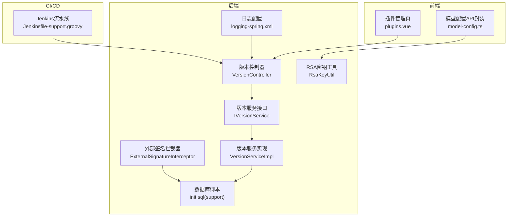
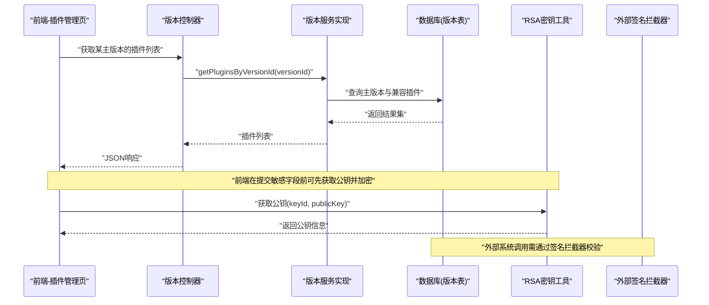
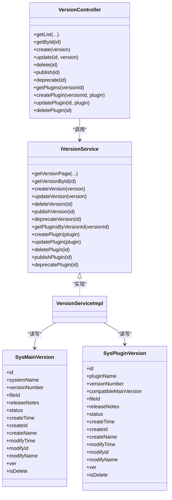
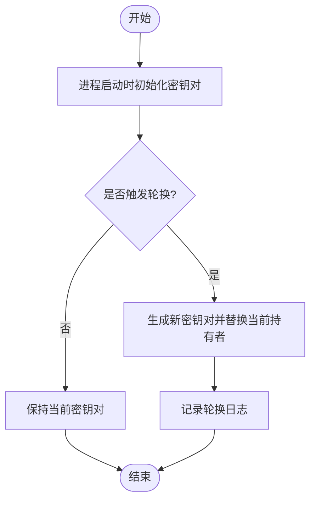
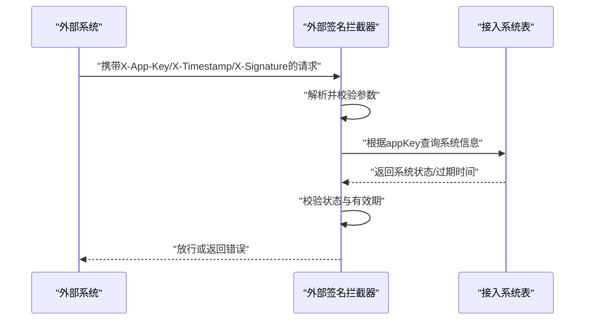
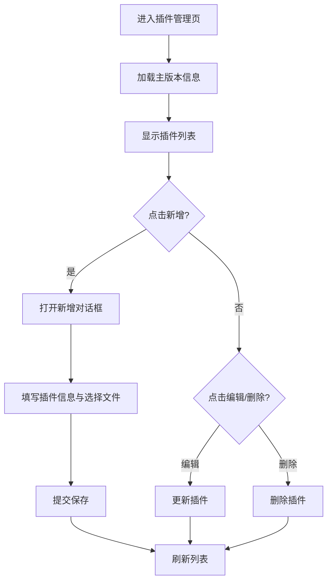
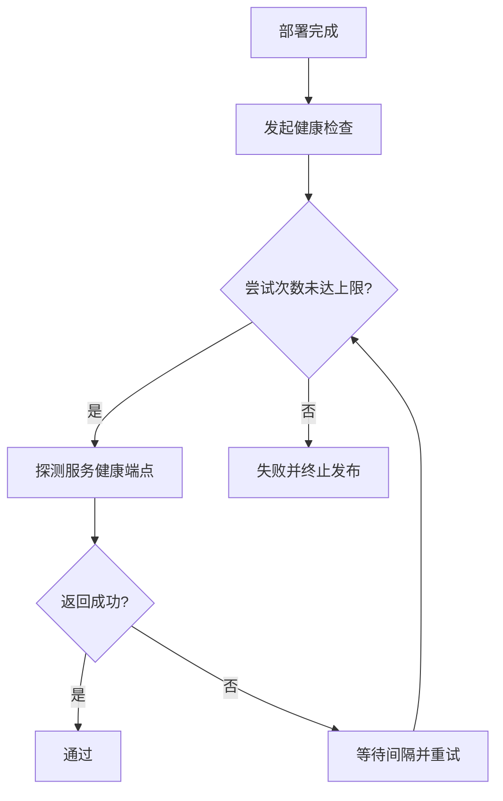
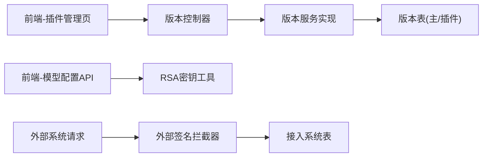

# 系统维护

<cite>
**本文引用的文件**   
- [IVersionService.java](file://ele-ai-tender-system/ele-ai-tender-support/src/main/java/com/jy/eleaitender/support/service/IVersionService.java)
- [VersionServiceImpl.java](file://ele-ai-tender-system/ele-ai-tender-support/src/main/java/com/jy/eleaitender/support/service/impl/VersionServiceImpl.java)
- [VersionController.java](file://ele-ai-tender-system/ele-ai-tender-support/src/main/java/com/jy/eleaitender/support/controller/VersionController.java)
- [init.sql（support）](file://ele-ai-tender-system/ele-ai-tender-support/sql/init.sql)
- [RsaKeyUtil.java](file://ele-ai-tender-system/ele-ai-tender-common/src/main/java/com/jy/eleaitender/common/util/RsaKeyUtil.java)
- [model-config.ts](file://ele-ai-tender-support-frontend/src/api/model-config.ts)
- [plugins.vue](file://ele-ai-tender-support-frontend/src/views/version/plugins.vue)
- [ExternalSignatureInterceptor.java](file://ele-ai-tender-system/ele-ai-tender-core/src/main/java/com/jy/eleaitender/core/config/ExternalSignatureInterceptor.java)
- [logging-spring.xml（support）](file://ele-ai-tender-system/ele-ai-tender-support/src/main/resources/logging-spring.xml)
- [Jenkinsfile-support.groovy](file://Jenkinsfile-support.groovy)
- [SUPPORT_SYSTEM_SPEC.md](file://docs/rules/SUPPORT_SYSTEM_SPEC.md)
</cite>

## 目录
1. [简介](#简介)
2. [项目结构](#项目结构)
3. [核心组件](#核心组件)
4. [架构总览](#架构总览)
5. [详细组件分析](#详细组件分析)
6. [依赖关系分析](#依赖关系分析)
7. [性能与容量规划](#性能与容量规划)
8. [故障排查指南](#故障排查指南)
9. [结论](#结论)
10. [附录：运维自动化与最佳实践](#附录运维自动化与最佳实践)

## 简介
本文件面向“招标文件AI编制系统”的系统维护能力，聚焦以下主题：
- 系统版本管理：主版本、插件版本、依赖关系检查与升级兼容性验证
- RSA密钥轮换：自动生成、定时轮换、历史密钥保留与安全存储
- 系统健康检查：数据库连接、外部服务可用性、磁盘空间与服务状态监控
- 数据备份与恢复：全量/增量策略、灾难恢复流程
- 系统清理工具：临时文件清理、日志轮转、过期数据清理、存储空间优化
- 诊断与排障：诊断工具、错误报告收集、问题定位方法
- 最佳实践与自动化脚本使用

## 项目结构
系统维护相关能力主要分布在支持模块（support）、通用工具（common）、前端支撑页面（support-frontend），以及CI流水线（Jenkinsfile）。

图表来源
- [VersionController.java:1-126](file://ele-ai-tender-system/ele-ai-tender-support/src/main/java/com/jy/eleaitender/support/controller/VersionController.java#L1-L126)
- [IVersionService.java:1-42](file://ele-ai-tender-system/ele-ai-tender-support/src/main/java/com/jy/eleaitender/support/service/IVersionService.java#L1-L42)
- [VersionServiceImpl.java:1-135](file://ele-ai-tender-system/ele-ai-tender-support/src/main/java/com/jy/eleaitender/support/service/impl/VersionServiceImpl.java#L1-L135)
- [init.sql（support）:168-214](file://ele-ai-tender-system/ele-ai-tender-support/sql/init.sql#L168-L214)
- [RsaKeyUtil.java:1-96](file://ele-ai-tender-system/ele-ai-tender-common/src/main/java/com/jy/eleaitender/common/util/RsaKeyUtil.java#L1-L96)
- [model-config.ts:68-86](file://ele-ai-tender-support-frontend/src/api/model-config.ts#L68-L86)
- [plugins.vue:1-118](file://ele-ai-tender-support-frontend/src/views/version/plugins.vue#L1-L118)
- [ExternalSignatureInterceptor.java:32-65](file://ele-ai-tender-system/ele-ai-tender-core/src/main/java/com/jy/eleaitender/core/config/ExternalSignatureInterceptor.java#L32-L65)
- [logging-spring.xml（support）:78-117](file://ele-ai-tender-system/ele-ai-tender-support/src/main/resources/logging-spring.xml#L78-L117)
- [Jenkinsfile-support.groovy:114-131](file://Jenkinsfile-support.groovy#L114-L131)

章节来源
- [SUPPORT_SYSTEM_SPEC.md:157-183](file://docs/rules/SUPPORT_SYSTEM_SPEC.md#L157-L183)

## 核心组件
- 版本管理服务：提供主版本与插件版本的创建、更新、删除、发布、下线及按版本查询插件列表等能力。
- RSA密钥工具：在进程内生成并持有当前密钥对，支持公钥获取与基于keyId的解密校验。
- 外部签名拦截器：对外部接入系统进行鉴权与时效性校验，保障系统间交互安全。
- 日志滚动配置：通过Logback按级别输出并控制历史保留与大小上限，辅助排障与容量治理。
- 前端插件管理页：围绕指定主版本进行插件制品的增删改查与状态管理。
- CI健康检查：部署后对服务进行多次重试式健康探测，确保上线质量。

章节来源
- [IVersionService.java:1-42](file://ele-ai-tender-system/ele-ai-tender-support/src/main/java/com/jy/eleaitender/support/service/IVersionService.java#L1-L42)
- [VersionServiceImpl.java:1-135](file://ele-ai-tender-system/ele-ai-tender-support/src/main/java/com/jy/eleaitender/support/service/impl/VersionServiceImpl.java#L1-L135)
- [RsaKeyUtil.java:1-96](file://ele-ai-tender-system/ele-ai-tender-common/src/main/java/com/jy/eleaitender/common/util/RsaKeyUtil.java#L1-L96)
- [ExternalSignatureInterceptor.java:32-65](file://ele-ai-tender-system/ele-ai-tender-core/src/main/java/com/jy/eleaitender/core/config/ExternalSignatureInterceptor.java#L32-L65)
- [logging-spring.xml（support）:78-117](file://ele-ai-tender-system/ele-ai-tender-support/src/main/resources/logging-spring.xml#L78-L117)
- [plugins.vue:1-118](file://ele-ai-tender-support-frontend/src/views/version/plugins.vue#L1-L118)
- [Jenkinsfile-support.groovy:114-131](file://Jenkinsfile-support.groovy#L114-L131)

## 架构总览
系统维护的关键调用链如下：
- 前端插件管理页发起请求至版本控制器
- 控制器调用版本服务接口与实现，读写主版本与插件版本表
- RSA工具为敏感参数加密/解密提供能力
- 外部签名拦截器负责外部系统访问的安全校验
- 日志配置统一输出运行期信息，便于排障
- CI流水线在部署后进行健康检查

图表来源
- [VersionController.java:1-126](file://ele-ai-tender-system/ele-ai-tender-support/src/main/java/com/jy/eleaitender/support/controller/VersionController.java#L1-L126)
- [VersionServiceImpl.java:1-135](file://ele-ai-tender-system/ele-ai-tender-support/src/main/java/com/jy/eleaitender/support/service/impl/VersionServiceImpl.java#L1-L135)
- [init.sql（support）:168-214](file://ele-ai-tender-system/ele-ai-tender-support/sql/init.sql#L168-L214)
- [RsaKeyUtil.java:1-96](file://ele-ai-tender-system/ele-ai-tender-common/src/main/java/com/jy/eleaitender/common/util/RsaKeyUtil.java#L1-L96)
- [ExternalSignatureInterceptor.java:32-65](file://ele-ai-tender-system/ele-ai-tender-core/src/main/java/com/jy/eleaitender/core/config/ExternalSignatureInterceptor.java#L32-L65)

## 详细组件分析

### 版本管理（主版本与插件版本）
- 功能范围
  - 主版本：分页查询、详情、创建、更新、删除、发布、下线
  - 插件版本：按主版本查询、创建、更新、删除、发布、下线
  - 依赖关系：插件记录包含“适配的主系统版本”，用于约束兼容性
- 关键流程
  - 创建插件时自动回填“适配的主系统版本号”
  - 查询插件列表时按“兼容主版本+未删除”过滤并按时间倒序
- 数据结构要点
  - 主版本表：系统名称、版本号、文件ID、发布说明、状态、审计字段、逻辑删除、乐观锁
  - 插件版本表：插件名称、版本号、适配主版本、文件ID、发布说明、状态、审计字段、逻辑删除、乐观锁

图表来源
- [VersionController.java:1-126](file://ele-ai-tender-system/ele-ai-tender-support/src/main/java/com/jy/eleaitender/support/controller/VersionController.java#L1-L126)
- [IVersionService.java:1-42](file://ele-ai-tender-system/ele-ai-tender-support/src/main/java/com/jy/eleaitender/support/service/IVersionService.java#L1-L42)
- [VersionServiceImpl.java:1-135](file://ele-ai-tender-system/ele-ai-tender-support/src/main/java/com/jy/eleaitender/support/service/impl/VersionServiceImpl.java#L1-L135)
- [init.sql（support）:168-214](file://ele-ai-tender-system/ele-ai-tender-support/sql/init.sql#L168-L214)

章节来源
- [VersionController.java:1-126](file://ele-ai-tender-system/ele-ai-tender-support/src/main/java/com/jy/eleaitender/support/controller/VersionController.java#L1-L126)
- [VersionServiceImpl.java:1-135](file://ele-ai-tender-system/ele-ai-tender-support/src/main/java/com/jy/eleaitender/support/service/impl/VersionServiceImpl.java#L1-L135)
- [init.sql（support）:168-214](file://ele-ai-tender-system/ele-ai-tender-support/sql/init.sql#L168-L214)
- [SUPPORT_SYSTEM_SPEC.md:157-183](file://docs/rules/SUPPORT_SYSTEM_SPEC.md#L157-L183)

### RSA密钥轮换任务
- 能力概述
  - 启动时自动生成密钥对，并提供当前公钥信息（keyId + publicKey）
  - 支持运行时轮换（rotate），切换当前私钥以增强安全性
  - 解密时校验keyId，不匹配则拒绝，避免旧密文被新私钥误解
- 前端集成
  - 前端在需要加密敏感字段（如API Key）时，先获取公钥并执行加密，再连同keyId一并提交
- 安全建议
  - 定期轮换密钥，缩短私钥暴露窗口
  - 仅将公钥下发给可信客户端
  - 服务端解密失败应记录告警并提示重新获取公钥

图表来源
- [RsaKeyUtil.java:1-96](file://ele-ai-tender-system/ele-ai-tender-common/src/main/java/com/jy/eleaitender/common/util/RsaKeyUtil.java#L1-L96)
- [model-config.ts:68-86](file://ele-ai-tender-support-frontend/src/api/model-config.ts#L68-L86)

章节来源
- [RsaKeyUtil.java:1-96](file://ele-ai-tender-system/ele-ai-tender-common/src/main/java/com/jy/eleaitender/common/util/RsaKeyUtil.java#L1-L96)
- [model-config.ts:68-86](file://ele-ai-tender-support-frontend/src/api/model-config.ts#L68-L86)

### 外部系统鉴权与兼容性校验
- 外部签名拦截器负责：
  - 校验请求头完整性（应用Key、时间戳、签名）
  - 校验应用Key有效性、启用状态与有效期
  - 防止重放与篡改（结合时间戳与签名）
- 与版本管理的关联
  - 外部系统对接时应遵循已发布的版本规范，避免不兼容调用

图表来源
- [ExternalSignatureInterceptor.java:32-65](file://ele-ai-tender-system/ele-ai-tender-core/src/main/java/com/jy/eleaitender/core/config/ExternalSignatureInterceptor.java#L32-L65)
- [init.sql（support）:145-163](file://ele-ai-tender-system/ele-ai-tender-support/sql/init.sql#L145-L163)

章节来源
- [ExternalSignatureInterceptor.java:32-65](file://ele-ai-tender-system/ele-ai-tender-core/src/main/java/com/jy/eleaitender/core/config/ExternalSignatureInterceptor.java#L32-L65)
- [init.sql（support）:145-163](file://ele-ai-tender-system/ele-ai-tender-support/sql/init.sql#L145-L163)

### 前端插件管理界面
- 功能点
  - 展示所选主版本基本信息（版本号、名称、状态、创建时间）
  - 新增/编辑/删除插件，设置排序与状态
  - 上传插件制品文件（通过文件接口）
- 交互流程
  - 进入页面加载主版本信息
  - 打开对话框填写插件元数据与选择文件
  - 提交后刷新列表

图表来源
- [plugins.vue:1-118](file://ele-ai-tender-support-frontend/src/views/version/plugins.vue#L1-L118)
- [VersionController.java:88-126](file://ele-ai-tender-system/ele-ai-tender-support/src/main/java/com/jy/eleaitender/support/controller/VersionController.java#L88-L126)

章节来源
- [plugins.vue:1-118](file://ele-ai-tender-support-frontend/src/views/version/plugins.vue#L1-L118)
- [VersionController.java:88-126](file://ele-ai-tender-system/ele-ai-tender-support/src/main/java/com/jy/eleaitender/support/controller/VersionController.java#L88-L126)

### 健康检查与部署后验证
- 部署后健康检查
  - 流水线在部署完成后对服务进行多次重试式健康探测，超时或失败则阻断发布
- 建议扩展
  - 增加数据库连通性、外部依赖（如对象存储、消息队列）可用性检查
  - 增加磁盘空间阈值告警与自检

图表来源
- [Jenkinsfile-support.groovy:114-131](file://Jenkinsfile-support.groovy#L114-L131)

章节来源
- [Jenkinsfile-support.groovy:114-131](file://Jenkinsfile-support.groovy#L114-L131)

### 日志轮转与容量治理
- 日志分级输出：INFO/WARN/ERROR分别落盘，便于快速定位问题
- 滚动策略：按文件大小与历史数量限制，控制总大小上限
- 环境差异：开发/测试/生产可通过Profile差异化配置

章节来源
- [logging-spring.xml（support）:78-117](file://ele-ai-tender-system/ele-ai-tender-support/src/main/resources/logging-spring.xml#L78-L117)

## 依赖关系分析
- 组件耦合
  - 控制器依赖服务接口，服务实现依赖Mapper与实体类
  - 前端插件管理页依赖版本管理API
  - RSA工具为前后端敏感数据传输提供安全保障
  - 外部签名拦截器依赖接入系统表进行鉴权
- 潜在风险
  - 若插件与主版本兼容性校验不足，可能导致升级后行为异常
  - RSA轮换期间若客户端未及时刷新公钥，会导致解密失败

图表来源
- [plugins.vue:1-118](file://ele-ai-tender-support-frontend/src/views/version/plugins.vue#L1-L118)
- [VersionController.java:1-126](file://ele-ai-tender-system/ele-ai-tender-support/src/main/java/com/jy/eleaitender/support/controller/VersionController.java#L1-L126)
- [VersionServiceImpl.java:1-135](file://ele-ai-tender-system/ele-ai-tender-support/src/main/java/com/jy/eleaitender/support/service/impl/VersionServiceImpl.java#L1-L135)
- [init.sql（support）:168-214](file://ele-ai-tender-system/ele-ai-tender-support/sql/init.sql#L168-L214)
- [model-config.ts:68-86](file://ele-ai-tender-support-frontend/src/api/model-config.ts#L68-L86)
- [RsaKeyUtil.java:1-96](file://ele-ai-tender-system/ele-ai-tender-common/src/main/java/com/jy/eleaitender/common/util/RsaKeyUtil.java#L1-L96)
- [ExternalSignatureInterceptor.java:32-65](file://ele-ai-tender-system/ele-ai-tender-core/src/main/java/com/jy/eleaitender/core/config/ExternalSignatureInterceptor.java#L32-L65)
- [init.sql（support）:145-163](file://ele-ai-tender-system/ele-ai-tender-support/sql/init.sql#L145-L163)

## 性能与容量规划
- 版本与插件查询
  - 利用索引（系统名+版本号、兼容主版本、状态）提升分页与筛选性能
- 日志容量
  - 合理设置单文件大小、最大历史文件数与总大小上限，避免磁盘打满
- 健康检查
  - 控制重试次数与间隔，避免对下游造成压力

[本节为通用指导，无需源码引用]

## 故障排查指南
- 常见问题
  - 插件无法列出：确认主版本存在且插件未逻辑删除；检查兼容主版本字段是否正确
  - 解密失败：提示“请重新获取公钥”，多为RSA轮换导致客户端仍使用旧公钥
  - 外部系统调用失败：检查应用Key、时间戳、签名与有效期
- 定位手段
  - 查看对应级别日志文件（WARN/ERROR）
  - 核对数据库记录状态与审计字段
  - 使用流水线健康检查日志定位部署阶段问题

章节来源
- [RsaKeyUtil.java:72-82](file://ele-ai-tender-system/ele-ai-tender-common/src/main/java/com/jy/eleaitender/common/util/RsaKeyUtil.java#L72-L82)
- [ExternalSignatureInterceptor.java:32-65](file://ele-ai-tender-system/ele-ai-tender-core/src/main/java/com/jy/eleaitender/core/config/ExternalSignatureInterceptor.java#L32-L65)
- [logging-spring.xml（support）:78-117](file://ele-ai-tender-system/ele-ai-tender-support/src/main/resources/logging-spring.xml#L78-L117)

## 结论
本系统维护方案围绕“版本治理、密钥安全、健康检查、日志与容量、排障与自动化”展开，形成从发布到运行的闭环。建议在后续迭代中完善：
- 插件依赖与兼容性矩阵校验
- 密钥轮换策略与历史密钥归档
- 更丰富的健康检查项与指标上报
- 备份与恢复机制落地

[本节为总结性内容，无需源码引用]

## 附录：运维自动化与最佳实践
- 版本发布最佳实践
  - 先创建草稿版本，完善发布说明后再发布
  - 插件必须绑定兼容主版本，禁止跨大版本混用
- 密钥轮换最佳实践
  - 定期轮换，并在变更窗口内通知前端刷新公钥
  - 记录轮换事件，便于审计与回溯
- 健康检查与回滚
  - 部署后健康检查失败立即回滚
  - 逐步灰度放量，观察错误率与延迟
- 日志与容量治理
  - 按级别输出，生产环境开启ERROR集中告警
  - 定期评估日志总量与磁盘水位，调整滚动策略
- 备份与恢复（建议）
  - 全量备份：每日一次，保留N天
  - 增量备份：每小时一次，保留M小时
  - 灾难恢复演练：每季度至少一次，验证RTO/RPO达标
- 清理与优化（建议）
  - 临时文件：按天清理
  - 过期数据：按业务规则归档与删除
  - 存储空间：监控热点目录，及时扩容或迁移

[本节为通用指导，无需源码引用]