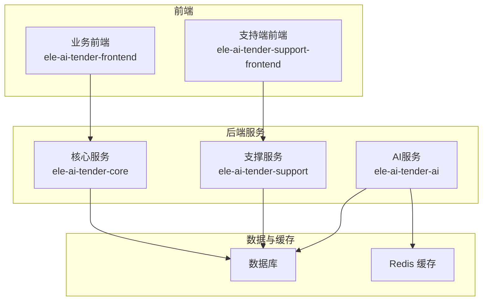
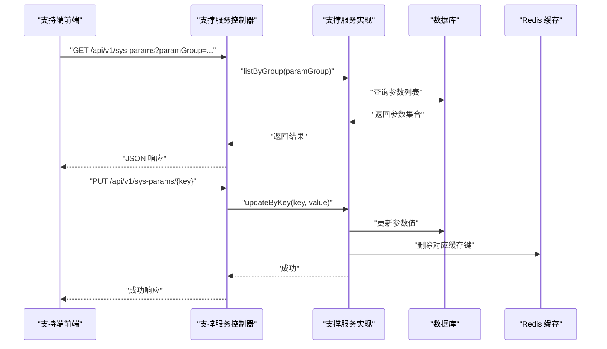
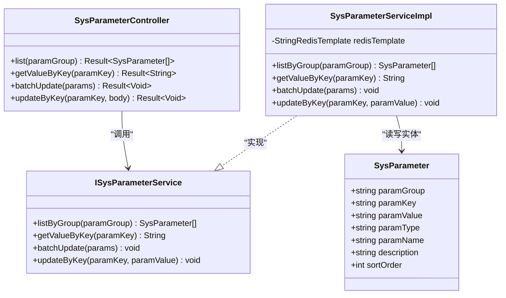
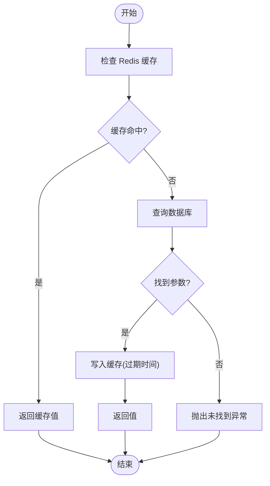
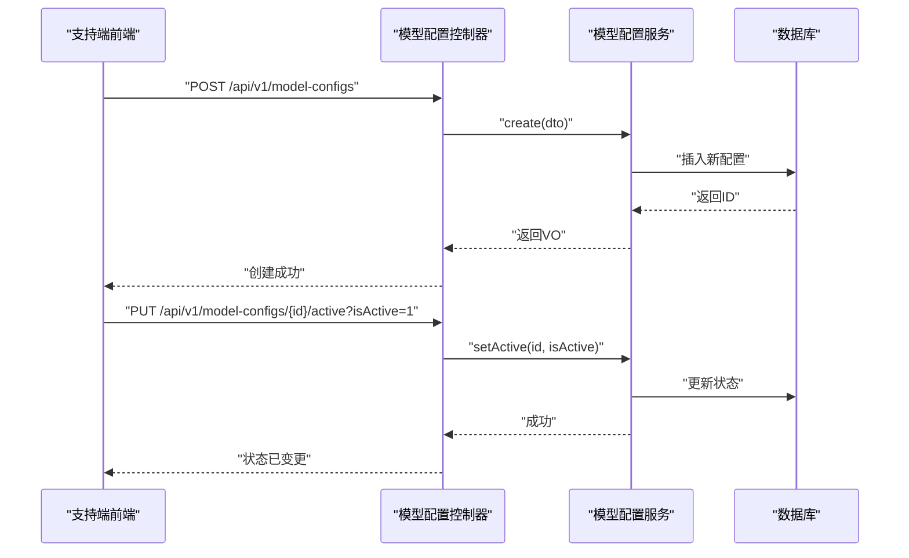
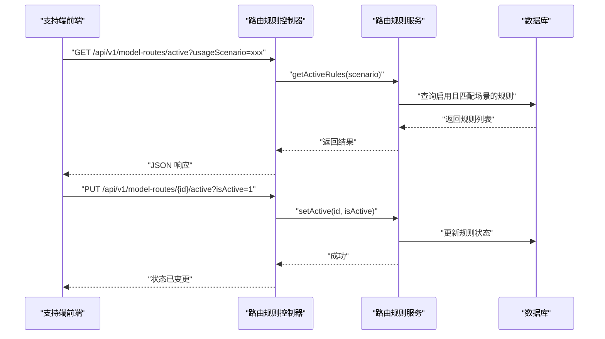
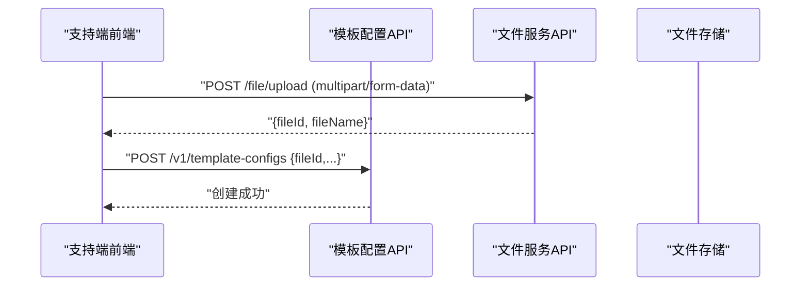
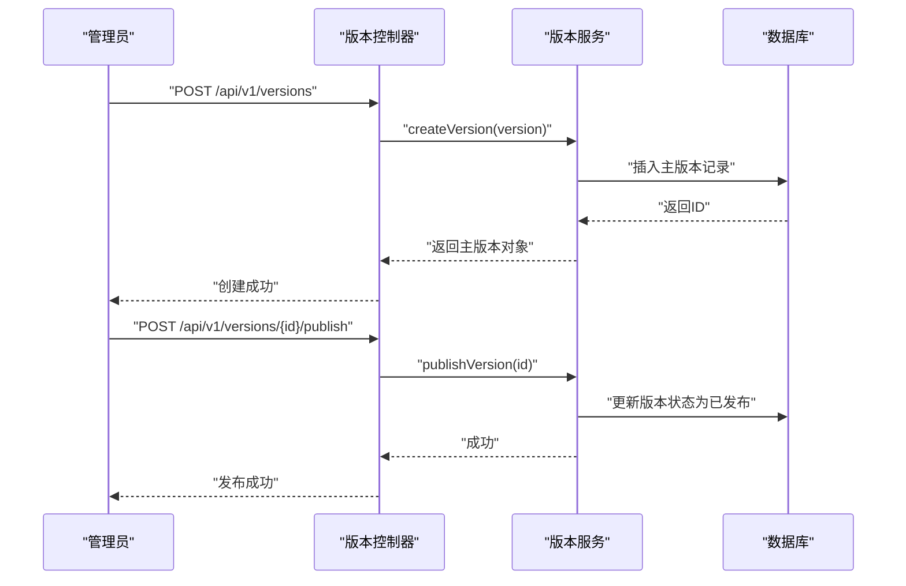
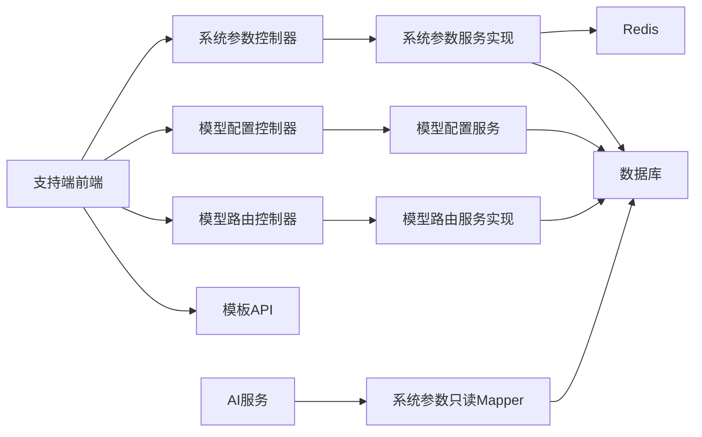

# 系统配置管理

<cite>
**本文引用的文件**   
- [SysParameterController.java](file://ele-ai-tender-system/ele-ai-tender-support/src/main/java/com/jy/eleaitender/support/controller/SysParameterController.java)
- [ISysParameterService.java](file://ele-ai-tender-system/ele-ai-tender-support/src/main/java/com/jy/eleaitender/support/service/ISysParameterService.java)
- [SysParameterServiceImpl.java](file://ele-ai-tender-system/ele-ai-tender-support/src/main/java/com/jy/eleaitender/support/service/impl/SysParameterServiceImpl.java)
- [SysParameterReadMapper.java](file://ele-ai-tender-system/ele-ai-tender-ai/src/main/java/com/jy/eleaitender/ai/mapper/SysParameterReadMapper.java)
- [SysParameter.java](file://ele-ai-tender-system/ele-ai-tender-common/src/main/java/com/jy/eleaitender/common/entity/support/SysParameter.java)
- [sys-param.ts](file://ele-ai-tender-support-frontend/src/api/sys-param.ts)
- [sys-param.ts（类型）](file://ele-ai-tender-support-frontend/src/types/sys-param.ts)
- [ModelConfigController.java](file://ele-ai-tender-system/ele-ai-tender-support/src/main/java/com/jy/eleaitender/support/controller/ModelConfigController.java)
- [IModelConfigService.java](file://ele-ai-tender-system/ele-ai-tender-support/src/main/java/com/jy/eleaitender/support/service/IModelConfigService.java)
- [model-config.ts](file://ele-ai-tender-support-frontend/src/api/model-config.ts)
- [ModelRouteRuleController.java](file://ele-ai-tender-system/ele-ai-tender-support/src/main/java/com/jy/eleaitender/support/controller/ModelRouteRuleController.java)
- [IModelRouteRuleService.java](file://ele-ai-tender-system/ele-ai-tender-support/src/main/java/com/jy/eleaitender/support/service/IModelRouteRuleService.java)
- [ModelRouteRuleServiceImpl.java](file://ele-ai-tender-system/ele-ai-tender-support/src/main/java/com/jy/eleaitender/support/service/impl/ModelRouteRuleServiceImpl.java)
- [model-route.ts](file://ele-ai-tender-support-frontend/src/api/model-route.ts)
- [template.ts（支持端）](file://ele-ai-tender-support-frontend/src/api/template.ts)
- [template.ts（业务前端）](file://ele-ai-tender-frontend/src/api/template.ts)
- [ProjectVersionServiceImpl.java](file://ele-ai-tender-system/ele-ai-tender-core/src/main/java/com/jy/eleaitender/core/service/impl/ProjectVersionServiceImpl.java)
- [VersionController.java](file://ele-ai-tender-system/ele-ai-tender-support/src/main/java/com/jy/eleaitender/support/controller/VersionController.java)
- [Jenkinsfile-support.groovy](file://Jenkinsfile-support.groovy)
- [Jenkinsfile-core.groovy](file://Jenkinsfile-core.groovy)
- [Jenkinsfile-ai.groovy](file://Jenkinsfile-ai.groovy)
- [Jenkinsfile-file.groovy](file://Jenkinsfile-file.groovy)
</cite>

## 目录
1. [简介](#简介)
2. [项目结构](#项目结构)
3. [核心组件](#核心组件)
4. [架构总览](#架构总览)
5. [详细组件分析](#详细组件分析)
6. [依赖关系分析](#依赖关系分析)
7. [性能考虑](#性能考虑)
8. [故障排查指南](#故障排查指南)
9. [结论](#结论)
10. [附录](#附录)

## 简介
本文件面向“招标文件AI编制系统”的配置管理能力，覆盖以下范围：
- 系统参数配置管理：基础参数、业务参数、界面参数的动态配置与维护
- AI模型配置管理：模型提供商设置、API密钥管理、模型路由规则与负载均衡策略
- 模板配置管理：项目模板、文档模板、业务规则模板的维护
- 配置版本控制、热重载机制与变更审计
- 配置备份恢复、环境隔离与迁移工具使用指南

## 项目结构
配置相关能力分布在支撑服务（support）、AI模块（ai）、核心模块（core）以及前后端中：
- 支撑服务提供系统参数、模型配置、模型路由、模板、版本等后端接口
- AI模块通过只读Mapper读取系统参数
- 前端分别提供“支持端”和“业务前端”的配置管理页面与API封装
- 构建与发布由Jenkins流水线完成，便于多环境部署与回滚

图表来源
- [SysParameterController.java:1-59](file://ele-ai-tender-system/ele-ai-tender-support/src/main/java/com/jy/eleaitender/support/controller/SysParameterController.java#L1-L59)
- [ModelConfigController.java:1-98](file://ele-ai-tender-system/ele-ai-tender-support/src/main/java/com/jy/eleaitender/support/controller/ModelConfigController.java#L1-L98)
- [ModelRouteRuleController.java:1-80](file://ele-ai-tender-system/ele-ai-tender-support/src/main/java/com/jy/eleaitender/support/controller/ModelRouteRuleController.java#L1-L80)
- [SysParameterReadMapper.java:1-12](file://ele-ai-tender-system/ele-ai-tender-ai/src/main/java/com/jy/eleaitender/ai/mapper/SysParameterReadMapper.java#L1-L12)

章节来源
- [SysParameterController.java:1-59](file://ele-ai-tender-system/ele-ai-tender-support/src/main/java/com/jy/eleaitender/support/controller/SysParameterController.java#L1-L59)
- [ModelConfigController.java:1-98](file://ele-ai-tender-system/ele-ai-tender-support/src/main/java/com/jy/eleaitender/support/controller/ModelConfigController.java#L1-L98)
- [ModelRouteRuleController.java:1-80](file://ele-ai-tender-system/ele-ai-tender-support/src/main/java/com/jy/eleaitender/support/controller/ModelRouteRuleController.java#L1-L80)
- [SysParameterReadMapper.java:1-12](file://ele-ai-tender-system/ele-ai-tender-ai/src/main/java/com/jy/eleaitender/ai/mapper/SysParameterReadMapper.java#L1-L12)

## 核心组件
- 系统参数管理：提供按分组查询、按key取值、批量更新与单键更新；读取路径带Redis缓存，更新后清理缓存
- AI模型配置管理：提供分页查询、详情、创建、更新、删除、批量删除、激活/停用等能力
- 模型路由规则管理：提供分页查询、按场景获取生效规则、创建/更新/删除、启用/停用
- 模板配置管理：支持模板列表、详情、创建、更新、删除、设为默认、状态切换及文件上传
- 版本控制：项目版本快照与主版本/插件版本管理，支持发布与废弃
- 构建与发布：Jenkins流水线定义各服务与环境变量，便于环境隔离与回滚

章节来源
- [ISysParameterService.java:1-44](file://ele-ai-tender-system/ele-ai-tender-support/src/main/java/com/jy/eleaitender/support/service/ISysParameterService.java#L1-L44)
- [SysParameterServiceImpl.java:1-93](file://ele-ai-tender-system/ele-ai-tender-support/src/main/java/com/jy/eleaitender/support/service/impl/SysParameterServiceImpl.java#L1-L93)
- [IModelConfigService.java:1-19](file://ele-ai-tender-system/ele-ai-tender-support/src/main/java/com/jy/eleaitender/support/service/IModelConfigService.java#L1-L19)
- [IModelRouteRuleService.java:1-61](file://ele-ai-tender-system/ele-ai-tender-support/src/main/java/com/jy/eleaitender/support/service/IModelRouteRuleService.java#L1-L61)
- [template.ts（支持端）:1-81](file://ele-ai-tender-support-frontend/src/api/template.ts#L1-L81)
- [ProjectVersionServiceImpl.java:38-65](file://ele-ai-tender-system/ele-ai-tender-core/src/main/java/com/jy/eleaitender/core/service/impl/ProjectVersionServiceImpl.java#L38-L65)
- [VersionController.java:36-108](file://ele-ai-tender-system/ele-ai-tender-support/src/main/java/com/jy/eleaitender/support/controller/VersionController.java#L36-L108)

## 架构总览
配置管理整体采用“前端-支撑服务-数据层”的分层架构，AI侧以只读方式消费系统参数。

图表来源
- [SysParameterController.java:27-58](file://ele-ai-tender-system/ele-ai-tender-support/src/main/java/com/jy/eleaitender/support/controller/SysParameterController.java#L27-L58)
- [SysParameterServiceImpl.java:36-92](file://ele-ai-tender-system/ele-ai-tender-support/src/main/java/com/jy/eleaitender/support/service/impl/SysParameterServiceImpl.java#L36-L92)

## 详细组件分析

### 系统参数配置管理
- 功能要点
  - 按分组查询参数列表，支持可选分组过滤与排序
  - 根据key获取参数值，优先从Redis缓存读取，未命中则查库并回填缓存
  - 批量更新与单键更新，更新成功后清除对应缓存键
- 数据结构
  - 系统参数实体包含分组、键、值、类型、名称、说明、排序等字段
- 前端交互
  - 支持端前端提供按分组查询、按key取值、批量更新、单键更新的API封装
  - 类型定义包含id、分组、键、值、类型、名称、说明、排序、时间戳等

图表来源
- [SysParameter.java:1-38](file://ele-ai-tender-system/ele-ai-tender-common/src/main/java/com/jy/eleaitender/common/entity/support/SysParameter.java#L1-L38)
- [ISysParameterService.java:1-44](file://ele-ai-tender-system/ele-ai-tender-support/src/main/java/com/jy/eleaitender/support/service/ISysParameterService.java#L1-L44)
- [SysParameterServiceImpl.java:1-93](file://ele-ai-tender-system/ele-ai-tender-support/src/main/java/com/jy/eleaitender/support/service/impl/SysParameterServiceImpl.java#L1-L93)
- [SysParameterController.java:1-59](file://ele-ai-tender-system/ele-ai-tender-support/src/main/java/com/jy/eleaitender/support/controller/SysParameterController.java#L1-L59)

图表来源
- [SysParameterServiceImpl.java:47-68](file://ele-ai-tender-system/ele-ai-tender-support/src/main/java/com/jy/eleaitender/support/service/impl/SysParameterServiceImpl.java#L47-L68)

章节来源
- [SysParameterController.java:27-58](file://ele-ai-tender-system/ele-ai-tender-support/src/main/java/com/jy/eleaitender/support/controller/SysParameterController.java#L27-L58)
- [SysParameterServiceImpl.java:36-92](file://ele-ai-tender-system/ele-ai-tender-support/src/main/java/com/jy/eleaitender/support/service/impl/SysParameterServiceImpl.java#L36-L92)
- [sys-param.ts:1-25](file://ele-ai-tender-support-frontend/src/api/sys-param.ts#L1-L25)
- [sys-param.ts（类型）:1-13](file://ele-ai-tender-support-frontend/src/types/sys-param.ts#L1-L13)

### AI模型配置管理
- 功能要点
  - 分页查询模型配置，支持按模型类型、供应商、使用场景、名称、状态筛选
  - 获取启用的模型配置列表（下拉选择用）
  - 创建、更新、删除、批量删除、激活/停用
- 前端交互
  - 支持端前端提供模型配置的增删改查与状态切换API
  - 更新时自动对apiKey进行RSA加密处理，并附带keyId

图表来源
- [ModelConfigController.java:55-98](file://ele-ai-tender-system/ele-ai-tender-support/src/main/java/com/jy/eleaitender/support/controller/ModelConfigController.java#L55-L98)
- [IModelConfigService.java:10-19](file://ele-ai-tender-system/ele-ai-tender-support/src/main/java/com/jy/eleaitender/support/service/IModelConfigService.java#L10-L19)
- [model-config.ts:37-66](file://ele-ai-tender-support-frontend/src/api/model-config.ts#L37-L66)

章节来源
- [ModelConfigController.java:1-98](file://ele-ai-tender-system/ele-ai-tender-support/src/main/java/com/jy/eleaitender/support/controller/ModelConfigController.java#L1-L98)
- [IModelConfigService.java:1-19](file://ele-ai-tender-system/ele-ai-tender-support/src/main/java/com/jy/eleaitender/support/service/IModelConfigService.java#L1-L19)
- [model-config.ts:37-66](file://ele-ai-tender-support-frontend/src/api/model-config.ts#L37-L66)

### 模型路由规则配置
- 功能要点
  - 分页查询路由规则，支持按使用场景筛选
  - 获取指定场景的生效路由规则（按优先级排序）
  - 创建、更新、删除、启用/停用
- 前端交互
  - 支持端前端提供路由规则的CRUD与状态切换API

图表来源
- [ModelRouteRuleController.java:28-80](file://ele-ai-tender-system/ele-ai-tender-support/src/main/java/com/jy/eleaitender/support/controller/ModelRouteRuleController.java#L28-L80)
- [IModelRouteRuleService.java:12-61](file://ele-ai-tender-system/ele-ai-tender-support/src/main/java/com/jy/eleaitender/support/service/IModelRouteRuleService.java#L12-L61)
- [ModelRouteRuleServiceImpl.java:60-106](file://ele-ai-tender-system/ele-ai-tender-support/src/main/java/com/jy/eleaitender/support/service/impl/ModelRouteRuleServiceImpl.java#L60-L106)
- [model-route.ts:1-25](file://ele-ai-tender-support-frontend/src/api/model-route.ts#L1-L25)

章节来源
- [ModelRouteRuleController.java:1-80](file://ele-ai-tender-system/ele-ai-tender-support/src/main/java/com/jy/eleaitender/support/controller/ModelRouteRuleController.java#L1-L80)
- [IModelRouteRuleService.java:1-61](file://ele-ai-tender-system/ele-ai-tender-support/src/main/java/com/jy/eleaitender/support/service/IModelRouteRuleService.java#L1-L61)
- [ModelRouteRuleServiceImpl.java:60-106](file://ele-ai-tender-system/ele-ai-tender-support/src/main/java/com/jy/eleaitender/support/service/impl/ModelRouteRuleServiceImpl.java#L60-L106)
- [model-route.ts:1-25](file://ele-ai-tender-support-frontend/src/api/model-route.ts#L1-L25)

### 模板配置管理
- 功能要点
  - 支持端提供模板配置的分页查询、详情、创建、更新、删除、批量删除、设为默认、状态切换
  - 模板文件上传通过独立axios实例访问文件服务
  - 业务前端提供模板列表、详情、默认模板获取接口
- 典型流程
  - 在支持端创建或更新模板时，先上传模板文件至文件服务，再保存模板配置引用

图表来源
- [template.ts（支持端）:27-81](file://ele-ai-tender-support-frontend/src/api/template.ts#L27-L81)
- [template.ts（业务前端）:1-17](file://ele-ai-tender-frontend/src/api/template.ts#L1-L17)

章节来源
- [template.ts（支持端）:1-81](file://ele-ai-tender-support-frontend/src/api/template.ts#L1-L81)
- [template.ts（业务前端）:1-17](file://ele-ai-tender-frontend/src/api/template.ts#L1-L17)

### 配置版本控制与变更审计
- 项目版本快照
  - 核心服务在项目维度生成版本快照，记录关键内容摘要与状态
- 主版本与插件版本
  - 支撑服务提供主版本与插件版本的创建、更新、删除、发布、废弃等操作
- 操作日志
  - 系统参数与模型配置等关键操作的控制器标注了操作日志注解，便于审计追踪

图表来源
- [VersionController.java:48-86](file://ele-ai-tender-system/ele-ai-tender-support/src/main/java/com/jy/eleaitender/support/controller/VersionController.java#L48-L86)
- [ProjectVersionServiceImpl.java:48-65](file://ele-ai-tender-system/ele-ai-tender-core/src/main/java/com/jy/eleaitender/core/service/impl/ProjectVersionServiceImpl.java#L48-L65)

章节来源
- [VersionController.java:36-108](file://ele-ai-tender-system/ele-ai-tender-support/src/main/java/com/jy/eleaitender/support/controller/VersionController.java#L36-L108)
- [ProjectVersionServiceImpl.java:38-65](file://ele-ai-tender-system/ele-ai-tender-core/src/main/java/com/jy/eleaitender/core/service/impl/ProjectVersionServiceImpl.java#L38-L65)

### 热重载机制与配置变更审计
- 热重载机制
  - 系统参数更新后主动删除Redis缓存键，后续读取将重新加载最新值，达到近似“热重载”的效果
- 变更审计
  - 关键写操作在控制器层标注操作日志注解，结合支撑服务的操作日志能力进行审计

章节来源
- [SysParameterServiceImpl.java:78-92](file://ele-ai-tender-system/ele-ai-tender-support/src/main/java/com/jy/eleaitender/support/service/impl/SysParameterServiceImpl.java#L78-L92)
- [SysParameterController.java:41-58](file://ele-ai-tender-system/ele-ai-tender-support/src/main/java/com/jy/eleaitender/support/controller/SysParameterController.java#L41-L58)

### 配置备份恢复、环境隔离与迁移工具
- 环境隔离
  - Jenkins流水线为不同服务与环境定义独立变量（如目标服务器、端口、分支、应用环境），便于多环境部署
- 构建与回滚
  - 流水线包含检出、初始化、构建、部署阶段，并保留历史构建产物，便于快速回滚
- 迁移建议
  - 基于版本控制的主版本与插件版本能力，可将配置变更纳入版本发布流程，配合数据库脚本与配置文件差异进行迁移

章节来源
- [Jenkinsfile-support.groovy:1-41](file://Jenkinsfile-support.groovy#L1-L41)
- [Jenkinsfile-core.groovy:1-42](file://Jenkinsfile-core.groovy#L1-L42)
- [Jenkinsfile-ai.groovy:1-42](file://Jenkinsfile-ai.groovy#L1-L42)
- [Jenkinsfile-file.groovy:1-42](file://Jenkinsfile-file.groovy#L1-L42)

## 依赖关系分析
- 组件耦合
  - 支撑服务控制器依赖服务接口，服务实现依赖数据访问与缓存
  - AI模块仅通过只读Mapper读取系统参数，避免对支撑服务写操作的直接依赖
- 外部依赖
  - Redis用于系统参数缓存加速
  - 数据库用于持久化配置与版本信息
  - 文件服务用于模板文件上传与存储

图表来源
- [SysParameterController.java:1-59](file://ele-ai-tender-system/ele-ai-tender-support/src/main/java/com/jy/eleaitender/support/controller/SysParameterController.java#L1-L59)
- [ModelConfigController.java:1-98](file://ele-ai-tender-system/ele-ai-tender-support/src/main/java/com/jy/eleaitender/support/controller/ModelConfigController.java#L1-L98)
- [ModelRouteRuleController.java:1-80](file://ele-ai-tender-system/ele-ai-tender-support/src/main/java/com/jy/eleaitender/support/controller/ModelRouteRuleController.java#L1-L80)
- [SysParameterReadMapper.java:1-12](file://ele-ai-tender-system/ele-ai-tender-ai/src/main/java/com/jy/eleaitender/ai/mapper/SysParameterReadMapper.java#L1-L12)

章节来源
- [SysParameterController.java:1-59](file://ele-ai-tender-system/ele-ai-tender-support/src/main/java/com/jy/eleaitender/support/controller/SysParameterController.java#L1-L59)
- [ModelConfigController.java:1-98](file://ele-ai-tender-system/ele-ai-tender-support/src/main/java/com/jy/eleaitender/support/controller/ModelConfigController.java#L1-L98)
- [ModelRouteRuleController.java:1-80](file://ele-ai-tender-system/ele-ai-tender-support/src/main/java/com/jy/eleaitender/support/controller/ModelRouteRuleController.java#L1-L80)
- [SysParameterReadMapper.java:1-12](file://ele-ai-tender-system/ele-ai-tender-ai/src/main/java/com/jy/eleaitender/ai/mapper/SysParameterReadMapper.java#L1-L12)

## 性能考虑
- 系统参数读取路径引入Redis缓存，显著降低数据库压力
- 更新操作及时清理缓存，保证一致性
- 模型路由规则按场景与优先级查询，减少无效匹配开销
- 模板文件上传走独立文件服务，避免阻塞主业务流程

[本节为通用性能建议，不直接分析具体文件]

## 故障排查指南
- 系统参数未找到
  - 现象：按key取值或更新时报错
  - 排查：确认数据库中是否存在该参数键；检查Redis缓存是否被误删或过期
- 模型配置状态变更失败
  - 现象：激活/停用接口返回错误
  - 排查：确认配置ID存在；检查数据库连接与服务日志
- 路由规则未生效
  - 现象：按场景获取不到生效规则
  - 排查：确认规则已启用且优先级正确；检查场景名称是否匹配
- 模板文件上传失败
  - 现象：上传接口超时或返回错误
  - 排查：检查文件服务连通性与鉴权；确认文件大小与格式限制

章节来源
- [SysParameterServiceImpl.java:47-92](file://ele-ai-tender-system/ele-ai-tender-support/src/main/java/com/jy/eleaitender/support/service/impl/SysParameterServiceImpl.java#L47-L92)
- [ModelConfigController.java:90-98](file://ele-ai-tender-system/ele-ai-tender-support/src/main/java/com/jy/eleaitender/support/controller/ModelConfigController.java#L90-L98)
- [ModelRouteRuleController.java:38-80](file://ele-ai-tender-system/ele-ai-tender-support/src/main/java/com/jy/eleaitender/support/controller/ModelRouteRuleController.java#L38-L80)
- [template.ts（支持端）:69-81](file://ele-ai-tender-support-frontend/src/api/template.ts#L69-L81)

## 结论
本系统配置管理模块围绕“系统参数、AI模型配置、模型路由、模板与版本”五大能力展开，具备高可用与可运维特性：
- 通过Redis缓存提升系统参数读取性能，并通过更新后清理缓存实现近实时生效
- 模型配置与路由规则提供完善的CRUD与状态管理，满足多模型与多场景需求
- 模板配置与文件服务解耦，保障大文件上传稳定性
- 版本控制与操作日志为配置变更提供追溯与回滚能力
- Jenkins流水线支持多环境隔离与快速回滚，提升交付效率

[本节为总结性内容，不直接分析具体文件]

## 附录
- 常用API路径参考
  - 系统参数：/api/v1/sys-params、/api/v1/sys-params/value
  - 模型配置：/api/v1/model-configs、/api/v1/model-configs/{id}/active
  - 模型路由：/api/v1/model-routes、/api/v1/model-routes/active
  - 模板配置：/v1/template-configs、/v1/template-configs/{id}/set-default
  - 版本管理：/api/v1/versions、/api/v1/versions/{id}/publish

[本节为概览性内容，不直接分析具体文件]