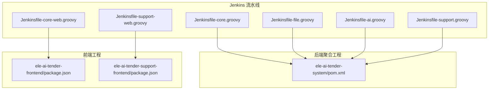
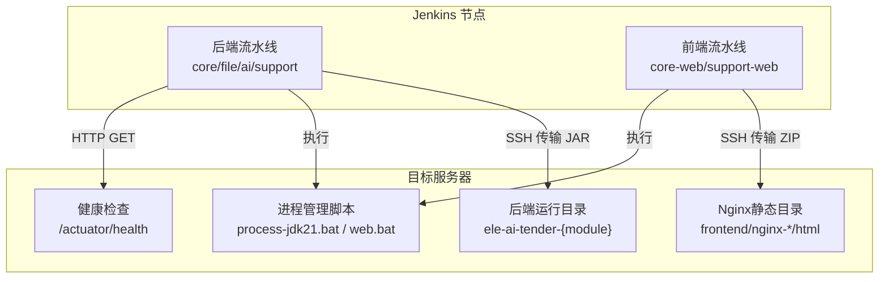
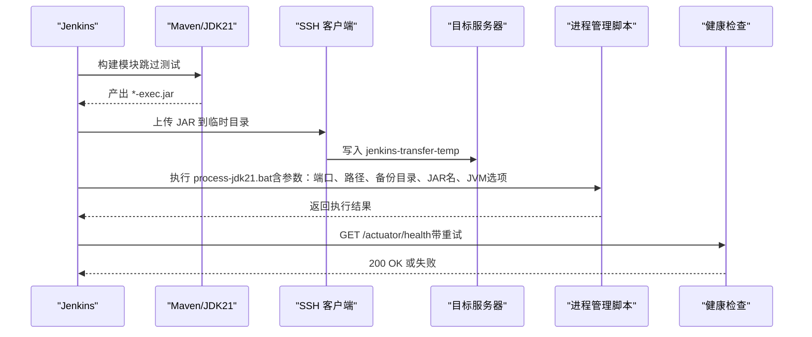
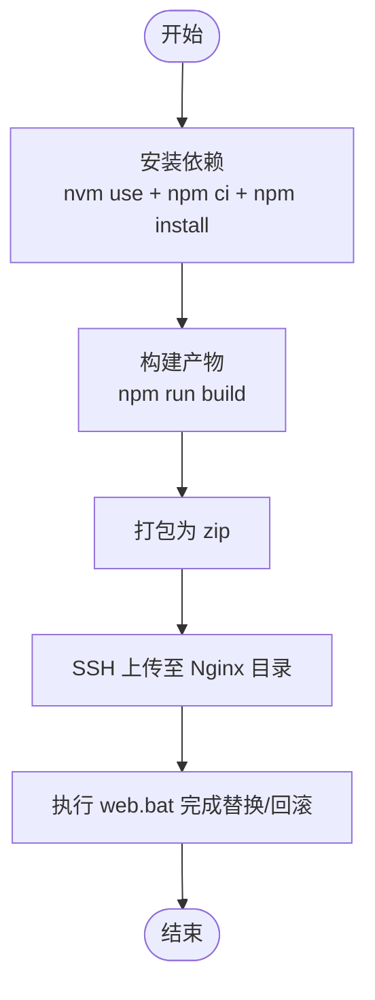
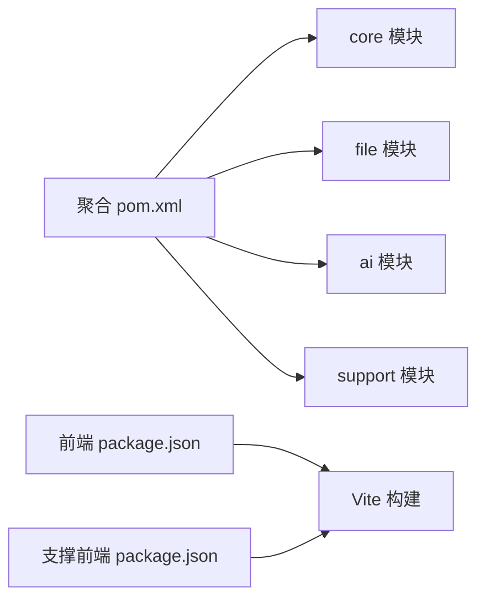

# CI/CD流水线

<cite>
**本文引用的文件**   
- [Jenkinsfile-core.groovy](file://Jenkinsfile-core.groovy)
- [Jenkinsfile-file.groovy](file://Jenkinsfile-file.groovy)
- [Jenkinsfile-ai.groovy](file://Jenkinsfile-ai.groovy)
- [Jenkinsfile-support.groovy](file://Jenkinsfile-support.groovy)
- [Jenkinsfile-core-web.groovy](file://Jenkinsfile-core-web.groovy)
- [Jenkinsfile-support-web.groovy](file://Jenkinsfile-support-web.groovy)
- [pom.xml](file://ele-ai-tender-system/pom.xml)
- [package.json（主前端）](file://ele-ai-tender-frontend/package.json)
- [package.json（支撑前端）](file://ele-ai-tender-support-frontend/package.json)
</cite>

## 目录
1. [简介](#简介)
2. [项目结构](#项目结构)
3. [核心组件](#核心组件)
4. [架构总览](#架构总览)
5. [详细组件分析](#详细组件分析)
6. [依赖关系分析](#依赖关系分析)
7. [性能与稳定性考虑](#性能与稳定性考虑)
8. [故障排查指南](#故障排查指南)
9. [结论](#结论)
10. [附录](#附录)

## 简介
本文件为“招标文件AI编制系统”的CI/CD流水线配置文档，聚焦于基于Jenkins的自动化构建、部署与健康检查流程。当前仓库提供了多个Jenkins流水线脚本，分别覆盖后端Java服务与前端静态资源：
- 后端服务：core、file、ai、support四个Spring Boot模块
- 前端应用：主前端ele-ai-tender-frontend与支撑前端ele-ai-tender-support-frontend

流水线采用Maven多模块构建、SSH远程发布、进程管理与健康检查的组合方式，实现从代码到运行的端到端自动化。

## 项目结构
仓库根目录包含若干Jenkinsfile脚本，每个脚本对应一个可独立构建与部署的应用或模块；后端统一在ele-ai-tender-system聚合工程下管理，前端各自维护独立的Node/Vite工程。

图表来源
- [Jenkinsfile-core.groovy:1-132](file://Jenkinsfile-core.groovy#L1-L132)
- [Jenkinsfile-file.groovy:1-132](file://Jenkinsfile-file.groovy#L1-L132)
- [Jenkinsfile-ai.groovy:1-132](file://Jenkinsfile-ai.groovy#L1-L132)
- [Jenkinsfile-support.groovy:1-132](file://Jenkinsfile-support.groovy#L1-L132)
- [Jenkinsfile-core-web.groovy:1-104](file://Jenkinsfile-core-web.groovy#L1-L104)
- [Jenkinsfile-support-web.groovy:1-104](file://Jenkinsfile-support-web.groovy#L1-L104)
- [pom.xml:1-260](file://ele-ai-tender-system/pom.xml#L1-L260)
- [package.json（主前端）:1-49](file://ele-ai-tender-frontend/package.json#L1-L49)
- [package.json（支撑前端）:1-35](file://ele-ai-tender-support-frontend/package.json#L1-L35)

章节来源
- [Jenkinsfile-core.groovy:1-132](file://Jenkinsfile-core.groovy#L1-L132)
- [Jenkinsfile-file.groovy:1-132](file://Jenkinsfile-file.groovy#L1-L132)
- [Jenkinsfile-ai.groovy:1-132](file://Jenkinsfile-ai.groovy#L1-L132)
- [Jenkinsfile-support.groovy:1-132](file://Jenkinsfile-support.groovy#L1-L132)
- [Jenkinsfile-core-web.groovy:1-104](file://Jenkinsfile-core-web.groovy#L1-L104)
- [Jenkinsfile-support-web.groovy:1-104](file://Jenkinsfile-support-web.groovy#L1-L104)
- [pom.xml:1-260](file://ele-ai-tender-system/pom.xml#L1-L260)
- [package.json（主前端）:1-49](file://ele-ai-tender-frontend/package.json#L1-L49)
- [package.json（支撑前端）:1-35](file://ele-ai-tender-support-frontend/package.json#L1-L35)

## 核心组件
- 后端服务流水线（core/file/ai/support）
  - 工具链：JDK21、Maven
  - 构建命令：在聚合工程下按模块构建并跳过测试
  - 产物：*-exec.jar
  - 部署：通过SSH将JAR传输至目标服务器，调用本地批处理脚本完成进程重启与备份
  - 验证：HTTP健康检查（actuator/health），带重试机制
- 前端流水线（core-web/support-web）
  - 工具链：NodeJS 22.21.1
  - 构建：npm ci + npm install + npm run build
  - 打包：生成zip归档
  - 部署：通过SSH上传至Nginx静态目录，调用本地批处理脚本完成替换与回滚

章节来源
- [Jenkinsfile-core.groovy:1-132](file://Jenkinsfile-core.groovy#L1-L132)
- [Jenkinsfile-file.groovy:1-132](file://Jenkinsfile-file.groovy#L1-L132)
- [Jenkinsfile-ai.groovy:1-132](file://Jenkinsfile-ai.groovy#L1-L132)
- [Jenkinsfile-support.groovy:1-132](file://Jenkinsfile-support.groovy#L1-L132)
- [Jenkinsfile-core-web.groovy:1-104](file://Jenkinsfile-core-web.groovy#L1-L104)
- [Jenkinsfile-support-web.groovy:1-104](file://Jenkinsfile-support-web.groovy#L1-L104)

## 架构总览
下图展示了各流水线与目标环境的交互关系，包括构建、传输、进程管理与健康检查。

图表来源
- [Jenkinsfile-core.groovy:72-96](file://Jenkinsfile-core.groovy#L72-L96)
- [Jenkinsfile-file.groovy:72-96](file://Jenkinsfile-file.groovy#L72-L96)
- [Jenkinsfile-ai.groovy:72-96](file://Jenkinsfile-ai.groovy#L72-L96)
- [Jenkinsfile-support.groovy:72-96](file://Jenkinsfile-support.groovy#L72-L96)
- [Jenkinsfile-core-web.groovy:78-101](file://Jenkinsfile-core-web.groovy#L78-L101)
- [Jenkinsfile-support-web.groovy:78-101](file://Jenkinsfile-support-web.groovy#L78-L101)

## 详细组件分析

### 后端服务流水线（以 core 为例）
该流水线负责后端服务的构建、部署与健康检查，其他后端服务（file、ai、support）结构一致，仅环境变量不同。

图表来源
- [Jenkinsfile-core.groovy:46-71](file://Jenkinsfile-core.groovy#L46-L71)
- [Jenkinsfile-core.groovy:72-96](file://Jenkinsfile-core.groovy#L72-L96)
- [Jenkinsfile-core.groovy:97-129](file://Jenkinsfile-core.groovy#L97-L129)

章节来源
- [Jenkinsfile-core.groovy:1-132](file://Jenkinsfile-core.groovy#L1-L132)
- [Jenkinsfile-file.groovy:1-132](file://Jenkinsfile-file.groovy#L1-L132)
- [Jenkinsfile-ai.groovy:1-132](file://Jenkinsfile-ai.groovy#L1-L132)
- [Jenkinsfile-support.groovy:1-132](file://Jenkinsfile-support.groovy#L1-L132)

### 前端流水线（以 core-web 为例）
该流水线负责Vue前端的依赖安装、构建、打包与部署。

图表来源
- [Jenkinsfile-core-web.groovy:38-77](file://Jenkinsfile-core-web.groovy#L38-L77)
- [Jenkinsfile-core-web.groovy:78-101](file://Jenkinsfile-core-web.groovy#L78-L101)

章节来源
- [Jenkinsfile-core-web.groovy:1-104](file://Jenkinsfile-core-web.groovy#L1-L104)
- [Jenkinsfile-support-web.groovy:1-104](file://Jenkinsfile-support-web.groovy#L1-L104)
- [package.json（主前端）:1-49](file://ele-ai-tender-frontend/package.json#L1-L49)
- [package.json（支撑前端）:1-35](file://ele-ai-tender-support-frontend/package.json#L1-L35)

### Maven 多模块构建与插件
- 聚合工程定义了模块列表与统一的依赖版本管理
- 构建阶段使用maven-surefire-plugin进行单元测试（默认启用）
- 当前流水线在构建时显式跳过测试，便于快速迭代；如需质量门禁，可在流水线中移除跳过测试的参数

章节来源
- [pom.xml:15-23](file://ele-ai-tender-system/pom.xml#L15-L23)
- [pom.xml:251-256](file://ele-ai-tender-system/pom.xml#L251-L256)
- [Jenkinsfile-core.groovy:52-55](file://Jenkinsfile-core.groovy#L52-L55)

### 部署与进程管理
- 后端：通过SSH将JAR上传至目标服务器的临时目录，随后调用本地批处理脚本完成进程启动、旧版本备份与切换
- 前端：通过SSH上传zip至Nginx静态目录，随后调用本地批处理脚本完成静态资源替换与回滚

章节来源
- [Jenkinsfile-core.groovy:72-96](file://Jenkinsfile-core.groovy#L72-L96)
- [Jenkinsfile-file.groovy:72-96](file://Jenkinsfile-file.groovy#L72-L96)
- [Jenkinsfile-ai.groovy:72-96](file://Jenkinsfile-ai.groovy#L72-L96)
- [Jenkinsfile-support.groovy:72-96](file://Jenkinsfile-support.groovy#L72-L96)
- [Jenkinsfile-core-web.groovy:78-101](file://Jenkinsfile-core-web.groovy#L78-L101)
- [Jenkinsfile-support-web.groovy:78-101](file://Jenkinsfile-support-web.groovy#L78-L101)

### 健康检查与重试
- 后端服务在部署后发起对/actuator/health的GET请求，最多尝试指定次数，每次间隔固定秒数
- 若最终未获得成功响应，流水线标记失败

章节来源
- [Jenkinsfile-core.groovy:97-129](file://Jenkinsfile-core.groovy#L97-L129)
- [Jenkinsfile-file.groovy:97-129](file://Jenkinsfile-file.groovy#L97-L129)
- [Jenkinsfile-ai.groovy:97-129](file://Jenkinsfile-ai.groovy#L97-L129)
- [Jenkinsfile-support.groovy:97-129](file://Jenkinsfile-support.groovy#L97-L129)

## 依赖关系分析
- 后端模块依赖由聚合工程的dependencyManagement统一管理，确保版本一致性
- 流水线通过-maven和-jdk工具声明，保证构建环境稳定
- 前端依赖由各自的package.json管理，流水线使用指定的Node版本进行构建

图表来源
- [pom.xml:15-23](file://ele-ai-tender-system/pom.xml#L15-L23)
- [package.json（主前端）:1-49](file://ele-ai-tender-frontend/package.json#L1-L49)
- [package.json（支撑前端）:1-35](file://ele-ai-tender-support-frontend/package.json#L1-L35)

章节来源
- [pom.xml:1-260](file://ele-ai-tender-system/pom.xml#L1-L260)
- [package.json（主前端）:1-49](file://ele-ai-tender-frontend/package.json#L1-L49)
- [package.json（支撑前端）:1-35](file://ele-ai-tender-support-frontend/package.json#L1-L35)

## 性能与稳定性考虑
- 并发控制：流水线禁用并发构建，避免同一应用多次部署导致状态不一致
- 超时保护：设置整体构建超时时间，防止长时间挂起
- 日志保留：限制构建历史保留天数与数量，降低磁盘占用
- 健康检查重试：提供最大尝试次数与等待间隔，提高部署成功率
- 内存参数：后端服务通过JVM参数控制堆大小，可按模块负载调整

章节来源
- [Jenkinsfile-core.groovy:21-25](file://Jenkinsfile-core.groovy#L21-L25)
- [Jenkinsfile-file.groovy:21-25](file://Jenkinsfile-file.groovy#L21-L25)
- [Jenkinsfile-ai.groovy:21-25](file://Jenkinsfile-ai.groovy#L21-L25)
- [Jenkinsfile-support.groovy:21-25](file://Jenkinsfile-support.groovy#L21-L25)
- [Jenkinsfile-core-web.groovy:13-17](file://Jenkinsfile-core-web.groovy#L13-L17)
- [Jenkinsfile-support-web.groovy:13-17](file://Jenkinsfile-support-web.groovy#L13-L17)

## 故障排查指南
- 构建失败
  - 检查Maven与JDK工具是否已正确配置
  - 确认聚合工程模块名称与流水线变量一致
  - 查看构建日志中的错误输出
- 部署失败
  - 校验SSH凭据与目标服务器可达性
  - 确认目标服务器上存在所需的批处理脚本与目录权限
  - 检查JAR包是否存在且命名匹配
- 健康检查失败
  - 确认服务端口与上下文路径正确
  - 检查/actuator/health是否暴露且返回200
  - 适当增加重试次数与等待间隔
- 前端部署失败
  - 确认Node版本与依赖安装成功
  - 检查Nginx静态目录路径与权限
  - 查看web.bat执行日志

章节来源
- [Jenkinsfile-core.groovy:46-71](file://Jenkinsfile-core.groovy#L46-L71)
- [Jenkinsfile-core.groovy:72-96](file://Jenkinsfile-core.groovy#L72-L96)
- [Jenkinsfile-core.groovy:97-129](file://Jenkinsfile-core.groovy#L97-L129)
- [Jenkinsfile-core-web.groovy:38-77](file://Jenkinsfile-core-web.groovy#L38-L77)
- [Jenkinsfile-core-web.groovy:78-101](file://Jenkinsfile-core-web.groovy#L78-L101)

## 结论
当前CI/CD流水线实现了后端与前端应用的自动化构建与部署，具备基础的健康检查与重试能力。建议在后续迭代中逐步引入以下增强项以提升质量与可观测性：
- 在流水线中恢复单元测试执行，并集成代码质量与静态分析
- 引入Docker镜像构建、漏洞扫描与安全验证
- 完善蓝绿/金丝雀发布与一键回滚策略
- 建立监控告警与故障自愈机制

[本节不直接分析具体文件，无需列出章节来源]

## 附录

### 建议的流水线增强清单（概念性）
- 代码质量与静态分析
  - 集成SonarQube扫描，设定质量门禁阈值
  - 引入SpotBugs/PMD等静态分析插件
- 自动化测试策略
  - 单元测试：在流水线中执行，生成覆盖率报告
  - 集成测试：启动依赖服务（数据库、缓存），执行接口级测试
  - 端到端测试：基于浏览器或API契约测试，验证关键业务流程
- Docker镜像构建与推送
  - 构建多阶段镜像，优化体积
  - 标签策略：分支名+提交哈希+语义化版本
  - 漏洞扫描：集成Trivy/Clair，阻断高危漏洞
- 灰度与回滚
  - 蓝绿部署：双实例并行，流量切换
  - 金丝雀发布：按比例放量，自动回滚条件
  - 一键回滚：基于上次成功构建快照快速恢复
- 监控与告警
  - 构建指标：耗时、成功率、失败原因分类
  - 服务指标：健康检查、错误率、延迟
  - 告警通知：邮件、企业微信、钉钉等渠道

[本节为通用建议，不直接分析具体文件，无需列出章节来源]