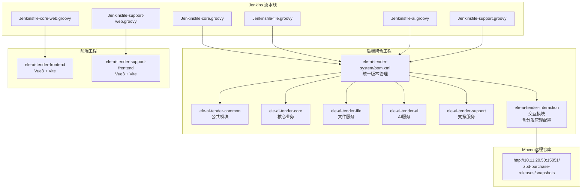
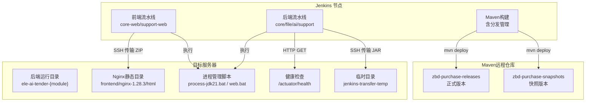
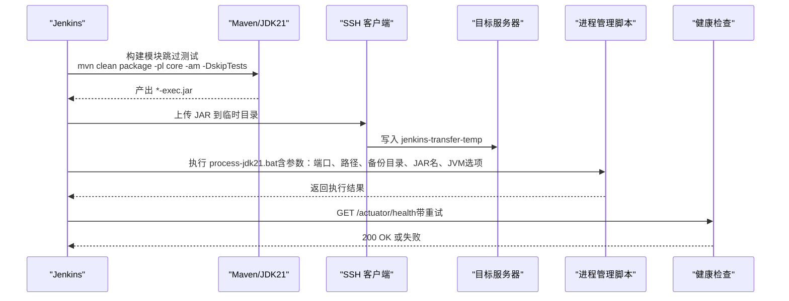
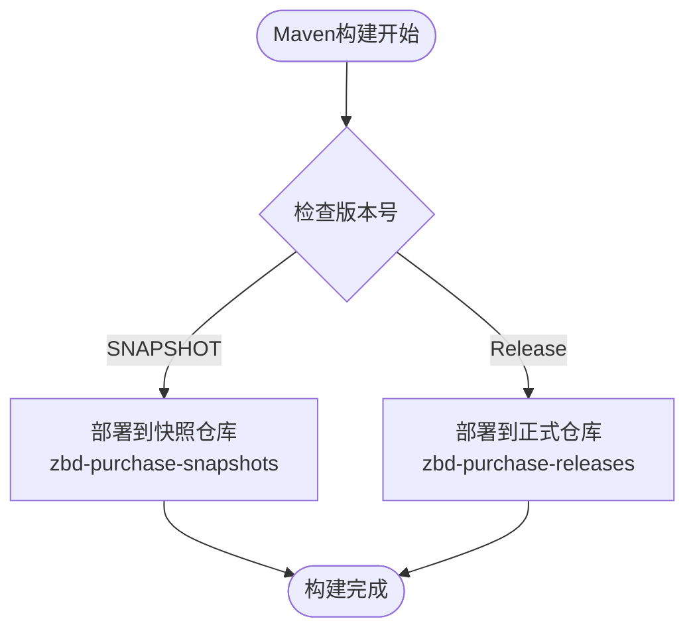
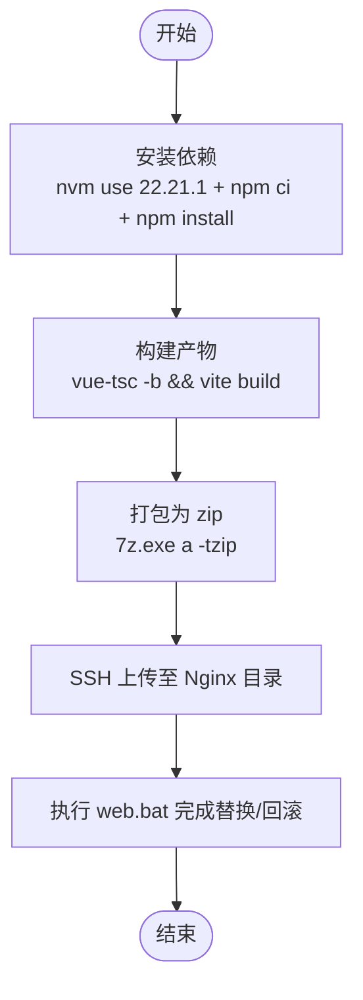
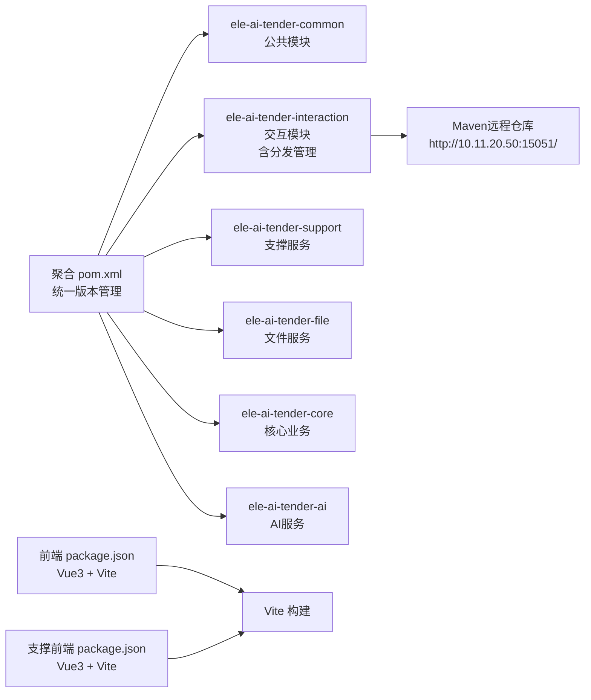

# CI/CD流水线

<cite>
**本文引用的文件**   
- [Jenkinsfile-core.groovy](file://Jenkinsfile-core.groovy)
- [Jenkinsfile-file.groovy](file://Jenkinsfile-file.groovy)
- [Jenkinsfile-ai.groovy](file://Jenkinsfile-ai.groovy)
- [Jenkinsfile-support.groovy](file://Jenkinsfile-support.groovy)
- [Jenkinsfile-core-web.groovy](file://Jenkinsfile-core-web.groovy)
- [Jenkinsfile-support-web.groovy](file://Jenkinsfile-support-web.groovy)
- [pom.xml](file://ele-ai-tender-system/pom.xml)
- [interaction pom.xml](file://ele-ai-tender-system/ele-ai-tender-interaction/pom.xml)
- [package.json（主前端）](file://ele-ai-tender-frontend/package.json)
- [package.json（支撑前端）](file://ele-ai-tender-support-frontend/package.json)
</cite>

## 更新摘要
**变更内容**   
- 新增Maven分发管理配置，支持通过专用端点http://10.11.20.50:15051/进行发布和快照仓库部署
- 在interaction模块中配置了独立的distributionManagement，支持正式版本和快照版本的分别部署
- 增强了CI/CD流水线的构件管理能力，为后续集成远程仓库部署奠定基础
- 保持了现有构建流程的稳定性，新增的分发配置不影响当前部署策略

## 目录
1. [简介](#简介)
2. [项目结构](#项目结构)
3. [核心组件](#核心组件)
4. [架构总览](#架构总览)
5. [详细组件分析](#详细组件分析)
6. [依赖关系分析](#依赖关系分析)
7. [性能与稳定性考虑](#性能与稳定性考虑)
8. [故障排查指南](#故障排查指南)
9. [结论](#结论)
10. [附录](#附录)

## 简介
本文件为"招标文件AI编制系统"的CI/CD流水线配置文档，聚焦于基于Jenkins的自动化构建、部署与健康检查流程。经过重大重组后，当前仓库提供了简化的Jenkins流水线脚本，分别覆盖后端Java服务与前端静态资源：
- 后端服务：core、file、ai、support四个Spring Boot模块，采用统一的聚合工程构建
- 前端应用：主前端ele-ai-tender-frontend与支撑前端ele-ai-tender-support-frontend，使用Vite构建
- **新增**：Maven分发管理配置，支持通过专用端点进行构件发布和快照部署

流水线采用Maven多模块构建、SSH远程发布、进程管理与健康检查的组合方式，实现从代码到运行的端到端自动化。

## 项目结构
仓库根目录包含若干Jenkinsfile脚本，每个脚本对应一个可独立构建与部署的应用或模块；后端统一在ele-ai-tender-system聚合工程下管理，前端各自维护独立的Node/Vite工程。

**图表来源**
- [Jenkinsfile-core.groovy:1-132](file://Jenkinsfile-core.groovy#L1-L132)
- [Jenkinsfile-file.groovy:1-132](file://Jenkinsfile-file.groovy#L1-L132)
- [Jenkinsfile-ai.groovy:1-132](file://Jenkinsfile-ai.groovy#L1-L132)
- [Jenkinsfile-support.groovy:1-132](file://Jenkinsfile-support.groovy#L1-L132)
- [Jenkinsfile-core-web.groovy:1-104](file://Jenkinsfile-core-web.groovy#L1-L104)
- [Jenkinsfile-support-web.groovy:1-104](file://Jenkinsfile-support-web.groovy#L1-L104)
- [pom.xml:15-23](file://ele-ai-tender-system/pom.xml#L15-L23)
- [interaction pom.xml:64-79](file://ele-ai-tender-system/ele-ai-tender-interaction/pom.xml#L64-L79)

## 核心组件
- **后端服务流水线（core/file/ai/support）**
  - 工具链：JDK21、Maven
  - 构建命令：在聚合工程下按模块构建并跳过测试（`mvn clean package -pl ${APP_NAME} -am -DskipTests`）
  - 产物：*-exec.jar
  - 部署：通过SSH将JAR传输至目标服务器，调用本地批处理脚本完成进程重启与备份
  - 验证：HTTP健康检查（actuator/health），带重试机制
- **前端流水线（core-web/support-web）**
  - 工具链：NodeJS 22.21.1
  - 构建：npm ci + npm install + npm run build（Vue3 + Vite）
  - 打包：生成zip归档
  - 部署：通过SSH上传至Nginx静态目录，调用本地批处理脚本完成替换与回滚
- **Maven分发管理（新增）**
  - 支持正式版本和快照版本的分别部署
  - 专用端点：http://10.11.20.50:15051/
  - 仓库ID：zbd-purchase-releases / zbd-purchase-snapshots

**章节来源**
- [Jenkinsfile-core.groovy:1-132](file://Jenkinsfile-core.groovy#L1-L132)
- [Jenkinsfile-file.groovy:1-132](file://Jenkinsfile-file.groovy#L1-L132)
- [Jenkinsfile-ai.groovy:1-132](file://Jenkinsfile-ai.groovy#L1-L132)
- [Jenkinsfile-support.groovy:1-132](file://Jenkinsfile-support.groovy#L1-L132)
- [Jenkinsfile-core-web.groovy:1-104](file://Jenkinsfile-core-web.groovy#L1-L104)
- [Jenkinsfile-support-web.groovy:1-104](file://Jenkinsfile-support-web.groovy#L1-L104)
- [interaction pom.xml:64-79](file://ele-ai-tender-system/ele-ai-tender-interaction/pom.xml#L64-L79)

## 架构总览
下图展示了各流水线与目标环境的交互关系，包括构建、传输、进程管理与健康检查，以及新增的Maven构件分发能力。

**图表来源**
- [Jenkinsfile-core.groovy:72-96](file://Jenkinsfile-core.groovy#L72-L96)
- [Jenkinsfile-file.groovy:72-96](file://Jenkinsfile-file.groovy#L72-L96)
- [Jenkinsfile-ai.groovy:72-96](file://Jenkinsfile-ai.groovy#L72-L96)
- [Jenkinsfile-support.groovy:72-96](file://Jenkinsfile-support.groovy#L72-L96)
- [Jenkinsfile-core-web.groovy:78-101](file://Jenkinsfile-core-web.groovy#L78-L101)
- [Jenkinsfile-support-web.groovy:78-101](file://Jenkinsfile-support-web.groovy#L78-L101)
- [interaction pom.xml:64-79](file://ele-ai-tender-system/ele-ai-tender-interaction/pom.xml#L64-L79)

## 详细组件分析

### 后端服务流水线（以 core 为例）
该流水线负责后端服务的构建、部署与健康检查，其他后端服务（file、ai、support）结构一致，仅环境变量不同。

**图表来源**
- [Jenkinsfile-core.groovy:46-71](file://Jenkinsfile-core.groovy#L46-71)
- [Jenkinsfile-core.groovy:72-96](file://Jenkinsfile-core.groovy#L72-96)
- [Jenkinsfile-core.groovy:97-129](file://Jenkinsfile-core.groovy#L97-129)

**章节来源**
- [Jenkinsfile-core.groovy:1-132](file://Jenkinsfile-core.groovy#L1-L132)
- [Jenkinsfile-file.groovy:1-132](file://Jenkinsfile-file.groovy#L1-L132)
- [Jenkinsfile-ai.groovy:1-132](file://Jenkinsfile-ai.groovy#L1-L132)
- [Jenkinsfile-support.groovy:1-132](file://Jenkinsfile-support.groovy#L1-L132)

### Maven分发管理配置（新增）
**更新** 新增了Maven分发管理配置，支持通过专用端点进行构件发布。

- **分发端点配置**
  - 基础URL：http://10.11.20.50:15051/
  - 正式版本仓库：http://10.11.20.50:15051/repository/zbd-purchase-releases/
  - 快照版本仓库：http://10.11.20.50:15051/repository/zbd-purchase-snapshots/
- **仓库标识**
  - 正式版本ID：zbd-purchase-releases
  - 快照版本ID：zbd-purchase-snapshots
- **适用模块**
  - 当前配置应用于interaction模块及其子模块
  - 支持JDK8兼容的交互契约模块发布

**图表来源**
- [interaction pom.xml:64-79](file://ele-ai-tender-system/ele-ai-tender-interaction/pom.xml#L64-L79)

**章节来源**
- [interaction pom.xml:64-79](file://ele-ai-tender-system/ele-ai-tender-interaction/pom.xml#L64-L79)

### 前端流水线（以 core-web 为例）
该流水线负责Vue前端的依赖安装、构建、打包与部署。

**图表来源**
- [Jenkinsfile-core-web.groovy:38-77](file://Jenkinsfile-core-web.groovy#L38-77)
- [Jenkinsfile-core-web.groovy:78-101](file://Jenkinsfile-core-web.groovy#L78-101)

**章节来源**
- [Jenkinsfile-core-web.groovy:1-104](file://Jenkinsfile-core-web.groovy#L1-L104)
- [Jenkinsfile-support-web.groovy:1-104](file://Jenkinsfile-support-web.groovy#L1-L104)
- [package.json（主前端）:1-49](file://ele-ai-tender-frontend/package.json#L1-L49)
- [package.json（支撑前端）:1-35](file://ele-ai-tender-support-frontend/package.json#L1-L35)

### Maven 多模块构建与插件
- **聚合工程定义了模块列表与统一的依赖版本管理**
  - 包含7个核心模块：common、common-interaction、interaction、support、file、core、ai
  - 统一管理Spring Boot 3.2.2、MyBatis Plus 3.5.5等关键依赖版本
- **构建阶段使用maven-surefire-plugin进行单元测试（默认启用）**
  - 当前流水线在构建时显式跳过测试，便于快速迭代
  - 如需质量门禁，可在流水线中移除跳过测试的参数
- **插件管理**
  - spring-boot-maven-plugin：用于打包可执行的JAR文件
  - maven-compiler-plugin：配置JDK 21编译环境
  - maven-surefire-plugin：单元测试执行
- **新增分发管理**
  - interaction模块配置了独立的distributionManagement
  - 支持正式版本和快照版本的分别部署

**章节来源**
- [pom.xml:15-23](file://ele-ai-tender-system/pom.xml#L15-L23)
- [pom.xml:251-256](file://ele-ai-tender-system/pom.xml#L251-L256)
- [pom.xml:225-258](file://ele-ai-tender-system/pom.xml#L225-L258)
- [Jenkinsfile-core.groovy:52-55](file://Jenkinsfile-core.groovy#L52-L55)
- [interaction pom.xml:64-79](file://ele-ai-tender-system/ele-ai-tender-interaction/pom.xml#L64-L79)

### 部署与进程管理
- **后端部署流程**
  - 通过SSH将JAR上传至目标服务器的临时目录（jenkins-transfer-temp）
  - 调用本地批处理脚本process-jdk21.bat完成进程启动、旧版本备份与切换
  - 支持不同模块的JVM内存配置（如AI模块2G、Core模块1G等）
- **前端部署流程**
  - 通过SSH上传zip至Nginx静态目录（E:\java\tender-document-tool\frontend\nodejs-1.28.3\html）
  - 调用本地批处理脚本web.bat完成静态资源替换与回滚
  - 使用7-Zip进行压缩打包
- **Maven构件分发（新增）**
  - 支持通过mvn deploy命令发布构件到远程仓库
  - 自动根据版本号选择对应的仓库（releases或snapshots）

**章节来源**
- [Jenkinsfile-core.groovy:72-96](file://Jenkinsfile-core.groovy#L72-L96)
- [Jenkinsfile-file.groovy:72-96](file://Jenkinsfile-file.groovy#L72-L96)
- [Jenkinsfile-ai.groovy:72-96](file://Jenkinsfile-ai.groovy#L72-L96)
- [Jenkinsfile-support.groovy:72-96](file://Jenkinsfile-support.groovy#L72-L96)
- [Jenkinsfile-core-web.groovy:78-101](file://Jenkinsfile-core-web.groovy#L78-L101)
- [Jenkinsfile-support-web.groovy:78-101](file://Jenkinsfile-support-web.groovy#L78-L101)
- [interaction pom.xml:64-79](file://ele-ai-tender-system/ele-ai-tender-interaction/pom.xml#L64-L79)

### 健康检查与重试
- **后端服务健康检查**
  - 在部署后发起对/actuator/health的GET请求
  - 最多尝试5次，每次间隔30秒
  - 若最终未获得成功响应（200-299状态码），流水线标记失败
- **前端部署验证**
  - 通过批处理脚本确保静态资源正确替换
  - 支持自动回滚机制

**章节来源**
- [Jenkinsfile-core.groovy:97-129](file://Jenkinsfile-core.groovy#L97-L129)
- [Jenkinsfile-file.groovy:97-129](file://Jenkinsfile-file.groovy#L97-L129)
- [Jenkinsfile-ai.groovy:97-129](file://Jenkinsfile-ai.groovy#L97-L129)
- [Jenkinsfile-support.groovy:97-129](file://Jenkinsfile-support.groovy#L97-L129)

## 依赖关系分析
- **后端模块依赖由聚合工程的dependencyManagement统一管理**
  - 确保所有模块使用一致的Spring Boot、MyBatis Plus等依赖版本
  - 内部模块间依赖关系清晰：common → interaction → business modules
- **流水线通过-maven和-jdk工具声明**
  - 保证构建环境稳定（JDK21、Maven）
  - 前端使用NodeJS 22.21.1版本
- **前端依赖由各自的package.json管理**
  - 主前端：Vue3 + Element Plus + TipTap编辑器
  - 支撑前端：Vue3 + Element Plus基础功能
- **新增Maven分发依赖**
  - interaction模块支持向远程仓库发布构件
  - 为后续微服务间的依赖管理提供基础

**图表来源**
- [pom.xml:15-23](file://ele-ai-tender-system/pom.xml#L15-L23)
- [interaction pom.xml:64-79](file://ele-ai-tender-system/ele-ai-tender-interaction/pom.xml#L64-L79)
- [package.json（主前端）:1-49](file://ele-ai-tender-frontend/package.json#L1-L49)
- [package.json（支撑前端）:1-35](file://ele-ai-tender-support-frontend/package.json#L1-L35)

**章节来源**
- [pom.xml:1-260](file://ele-ai-tender-system/pom.xml#L1-L260)
- [interaction pom.xml:64-79](file://ele-ai-tender-system/ele-ai-tender-interaction/pom.xml#L64-L79)
- [package.json（主前端）:1-49](file://ele-ai-tender-frontend/package.json#L1-L49)
- [package.json（支撑前端）:1-35](file://ele-ai-tender-support-frontend/package.json#L1-L35)

## 性能与稳定性考虑
- **并发控制**：流水线禁用并发构建，避免同一应用多次部署导致状态不一致
- **超时保护**：设置整体构建超时时间（15分钟），防止长时间挂起
- **日志保留**：限制构建历史保留天数（3天）与数量（10个），降低磁盘占用
- **健康检查重试**：提供最大尝试次数（5次）与等待间隔（30秒），提高部署成功率
- **内存参数优化**：后端服务通过JVM参数控制堆大小，按模块负载调整（Support: 512M, File: 768M, Core: 1G, AI: 2G）
- **构建缓存**：使用npm ci确保依赖安装的一致性和速度
- **网络稳定性**：新增的Maven分发配置需要稳定的网络连接，建议在网络层做好容错处理

**章节来源**
- [Jenkinsfile-core.groovy:21-25](file://Jenkinsfile-core.groovy#L21-L25)
- [Jenkinsfile-file.groovy:21-25](file://Jenkinsfile-file.groovy#L21-L25)
- [Jenkinsfile-ai.groovy:21-25](file://Jenkinsfile-ai.groovy#L21-L25)
- [Jenkinsfile-support.groovy:21-25](file://Jenkinsfile-support.groovy#L21-L25)
- [Jenkinsfile-core-web.groovy:13-17](file://Jenkinsfile-core-web.groovy#L13-L17)
- [Jenkinsfile-support-web.groovy:13-17](file://Jenkinsfile-support-web.groovy#L13-L17)

## 故障排查指南
- **构建失败**
  - 检查Maven与JDK工具是否已正确配置
  - 确认聚合工程模块名称与流水线变量一致
  - 查看构建日志中的错误输出
  - 验证网络依赖下载是否正常
- **部署失败**
  - 校验SSH凭据与目标服务器可达性
  - 确认目标服务器上存在所需的批处理脚本与目录权限
  - 检查JAR包是否存在且命名匹配
  - 验证临时目录空间是否充足
- **健康检查失败**
  - 确认服务端口与上下文路径正确
  - 检查/actuator/health是否暴露且返回200
  - 适当增加重试次数与等待间隔
  - 查看服务启动日志定位问题
- **前端部署失败**
  - 确认Node版本与依赖安装成功
  - 检查Nginx静态目录路径与权限
  - 查看web.bat执行日志
  - 验证压缩包解压后的文件结构
- **Maven分发失败（新增）**
  - 检查Maven settings.xml中的server配置是否正确
  - 验证远程仓库地址http://10.11.20.50:15051/的可达性
  - 确认仓库ID（zbd-purchase-releases/snapshots）配置正确
  - 检查网络防火墙规则是否允许访问远程仓库

**章节来源**
- [Jenkinsfile-core.groovy:46-71](file://Jenkinsfile-core.groovy#L46-L71)
- [Jenkinsfile-core.groovy:72-96](file://Jenkinsfile-core.groovy#L72-L96)
- [Jenkinsfile-core.groovy:97-129](file://Jenkinsfile-core.groovy#L97-L129)
- [Jenkinsfile-core-web.groovy:38-77](file://Jenkinsfile-core-web.groovy#L38-L77)
- [Jenkinsfile-core-web.groovy:78-101](file://Jenkinsfile-core-web.groovy#L78-L101)
- [interaction pom.xml:64-79](file://ele-ai-tender-system/ele-ai-tender-interaction/pom.xml#L64-L79)

## 结论
经过重大重组后，当前CI/CD流水线实现了更加简洁高效的自动化构建与部署。新的架构具有以下特点：
- **简化构建流程**：专注于核心模块的独立构建，减少不必要的复杂性
- **统一配置管理**：通过聚合工程统一管理依赖版本和构建配置
- **增强稳定性**：完善的健康检查和重试机制，提高部署成功率
- **优化性能**：合理的内存配置和超时设置，提升构建效率
- **新增构件管理**：通过Maven分发管理配置，支持正式的构件发布和快照版本管理

建议在后续迭代中逐步引入以下增强项以提升质量与可观测性：
- 在流水线中恢复单元测试执行，并集成代码质量与静态分析
- 引入Docker镜像构建、漏洞扫描与安全验证
- 完善蓝绿/金丝雀发布与一键回滚策略
- 建立监控告警与故障自愈机制
- 集成Maven远程仓库的认证和安全配置

## 附录

### 建议的流水线增强清单（概念性）
- **代码质量与静态分析**
  - 集成SonarQube扫描，设定质量门禁阈值
  - 引入SpotBugs/PMD等静态分析插件
- **自动化测试策略**
  - 单元测试：在流水线中执行，生成覆盖率报告
  - 集成测试：启动依赖服务（数据库、缓存），执行接口级测试
  - 端到端测试：基于浏览器或API契约测试，验证关键业务流程
- **Docker镜像构建与推送**
  - 构建多阶段镜像，优化体积
  - 标签策略：分支名+提交哈希+语义化版本
  - 漏洞扫描：集成Trivy/Clair，阻断高危漏洞
- **灰度与回滚**
  - 蓝绿部署：双实例并行，流量切换
  - 金丝雀发布：按比例放量，自动回滚条件
  - 一键回滚：基于上次成功构建快照快速恢复
- **监控与告警**
  - 构建指标：耗时、成功率、失败原因分类
  - 服务指标：健康检查、错误率、延迟
  - 告警通知：邮件、企业微信、钉钉等渠道
- **Maven仓库管理（新增）**
  - 配置Maven settings.xml中的server认证信息
  - 实现自动版本管理和构件清理策略
  - 集成仓库安全扫描和合规检查