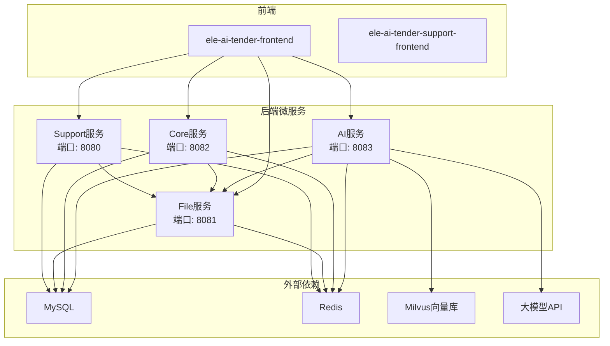
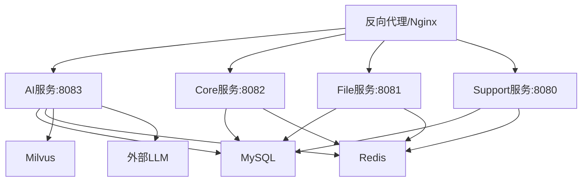
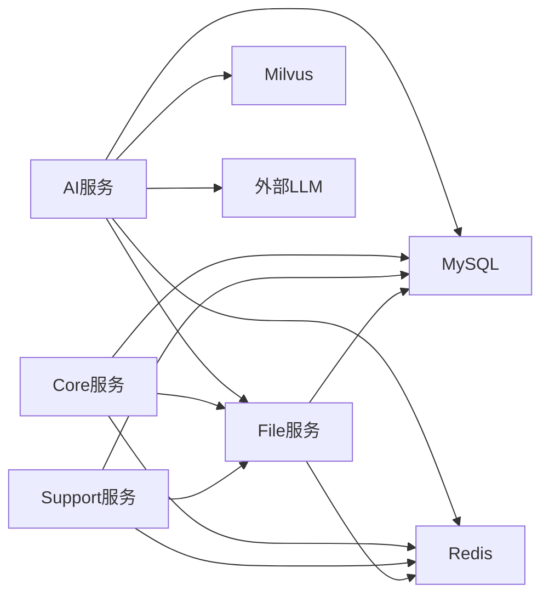

# Docker容器化部署

<cite>
**本文引用的文件**   
- [ele-ai-tender-ai.yml](file://docs/guides/ele-ai-tender-ai.yml)
- [ele-ai-tender-core.yml](file://docs/guides/ele-ai-tender-core.yml)
- [ele-ai-tender-file.yml](file://docs/guides/ele-ai-tender-file.yml)
- [ele-ai-tender-support.yml](file://docs/guides/ele-ai-tender-support.yml)
- [application.yml（AI服务）](file://ele-ai-tender-system/ele-ai-tender-ai/src/main/resources/application.yml)
- [application.yml（Core服务）](file://ele-ai-tender-system/ele-ai-tender-core/src/main/resources/application.yml)
- [application.yml（File服务）](file://ele-ai-tender-system/ele-ai-tender-file/src/main/resources/application.yml)
- [application.yml（Support服务）](file://ele-ai-tender-system/ele-ai-tender-support/src/main/resources/application.yml)
- [Jenkinsfile-ai.groovy](file://Jenkinsfile-ai.groovy)
</cite>

## 目录
1. [简介](#简介)
2. [项目结构](#项目结构)
3. [核心组件](#核心组件)
4. [架构总览](#架构总览)
5. [详细组件分析](#详细组件分析)
6. [依赖分析](#依赖分析)
7. [性能考虑](#性能考虑)
8. [故障排查指南](#故障排查指南)
9. [结论](#结论)
10. [附录](#附录)

## 简介
本文件面向“招标文件AI编制系统”的容器化与编排部署，覆盖以下目标：
- 为每个微服务模块提供Docker镜像构建方案（基础镜像选择、多阶段构建优化、环境变量配置、端口映射）。
- 使用Docker Compose进行本地与测试环境编排（服务依赖、网络、数据卷、服务发现）。
- 提供生产级Kubernetes清单（Deployment、Service、ConfigMap、Secret、Ingress），并说明资源限制、健康检查探针与日志收集。
- 给出容器安全加固、镜像扫描与版本管理最佳实践。

## 项目结构
仓库采用前后端分离与多模块后端组织方式：
- 前端：ele-ai-tender-frontend、ele-ai-tender-support-frontend（静态资源由Nginx或CDN托管）。
- 后端微服务：ele-ai-tender-ai、ele-ai-tender-core、ele-ai-tender-file、ele-ai-tender-support。
- 接口规范：docs/guides/*.yml（OpenAPI）。
- CI流水线：根目录Jenkinsfile-*.groovy（当前以JAR直发为主，可平滑迁移到容器化）。

**图表来源** 
- [application.yml（AI服务）:1-72](file://ele-ai-tender-system/ele-ai-tender-ai/src/main/resources/application.yml#L1-L72)
- [application.yml（Core服务）:1-59](file://ele-ai-tender-system/ele-ai-tender-core/src/main/resources/application.yml#L1-L59)
- [application.yml（File服务）:1-63](file://ele-ai-tender-system/ele-ai-tender-file/src/main/resources/application.yml#L1-L63)
- [application.yml（Support服务）:1-68](file://ele-ai-tender-system/ele-ai-tender-support/src/main/resources/application.yml#L1-L68)

**章节来源**
- [application.yml（AI服务）:1-72](file://ele-ai-tender-system/ele-ai-tender-ai/src/main/resources/application.yml#L1-L72)
- [application.yml（Core服务）:1-59](file://ele-ai-tender-system/ele-ai-tender-core/src/main/resources/application.yml#L1-L59)
- [application.yml（File服务）:1-63](file://ele-ai-tender-system/ele-ai-tender-file/src/main/resources/application.yml#L1-L63)
- [application.yml（Support服务）:1-68](file://ele-ai-tender-system/ele-ai-tender-support/src/main/resources/application.yml#L1-L68)

## 核心组件
- AI服务（ele-ai-tender-ai）
  - 对外暴露AI对话、文本优化、建议、检测任务等接口。
  - 依赖：MySQL、Redis、Milvus、外部LLM API、内部文件服务。
  - 默认端口：8083。
- Core服务（ele-ai-tender-core）
  - 项目管理、需求/评审项、文档集成导出、检测流程编排等。
  - 依赖：MySQL、Redis、内部文件服务。
  - 默认端口：8082。
- File服务（ele-ai-tender-file）
  - 统一文件上传/下载/删除与信息获取，支持表单分片与大文件。
  - 依赖：MySQL、Redis、本地文件存储路径。
  - 默认端口：8081。
- Support服务（ele-ai-tender-support）
  - 用户认证、菜单、消息、模型配置、路由规则、外部系统对接等。
  - 依赖：MySQL、Redis、短信网关。
  - 默认端口：8080。

**章节来源**
- [ele-ai-tender-ai.yml:1-255](file://docs/guides/ele-ai-tender-ai.yml#L1-L255)
- [ele-ai-tender-core.yml:1-800](file://docs/guides/ele-ai-tender-core.yml#L1-L800)
- [ele-ai-tender-file.yml:1-62](file://docs/guides/ele-ai-tender-file.yml#L1-L62)
- [ele-ai-tender-support.yml:1-800](file://docs/guides/ele-ai-tender-support.yml#L1-L800)
- [application.yml（AI服务）:1-72](file://ele-ai-tender-system/ele-ai-tender-ai/src/main/resources/application.yml#L1-L72)
- [application.yml（Core服务）:1-59](file://ele-ai-tender-system/ele-ai-tender-core/src/main/resources/application.yml#L1-L59)
- [application.yml（File服务）:1-63](file://ele-ai-tender-system/ele-ai-tender-file/src/main/resources/application.yml#L1-L63)
- [application.yml（Support服务）:1-68](file://ele-ai-tender-system/ele-ai-tender-support/src/main/resources/application.yml#L1-L68)

## 架构总览
下图展示容器化后的服务关系与关键依赖。

**图表来源** 
- [application.yml（AI服务）:1-72](file://ele-ai-tender-system/ele-ai-tender-ai/src/main/resources/application.yml#L1-L72)
- [application.yml（Core服务）:1-59](file://ele-ai-tender-system/ele-ai-tender-core/src/main/resources/application.yml#L1-L59)
- [application.yml（File服务）:1-63](file://ele-ai-tender-system/ele-ai-tender-file/src/main/resources/application.yml#L1-L63)
- [application.yml（Support服务）:1-68](file://ele-ai-tender-system/ele-ai-tender-support/src/main/resources/application.yml#L1-L68)

## 详细组件分析

### 容器镜像构建（多阶段与基础镜像）
- 通用策略
  - 基础镜像：推荐eclipse-temurin:21-jre-alpine（轻量、稳定、兼容Spring Boot 3.x/JDK21）。
  - 多阶段构建：第一阶段使用maven:3.9-eclipse-temurin-21执行编译打包；第二阶段仅拷贝target/*.jar与必要启动脚本，显著减小镜像体积。
  - 非root运行：在最终镜像中创建专用用户并切换UID/GID，避免以root运行。
  - 时区与编码：设置TZ=Asia/Shanghai与LANG/CODEPAGE，确保日志与时间一致。
- 各服务要点
  - AI服务：需注入Milvus、Redis、数据库、JWT密钥、内部文件服务地址、LLM凭据等环境变量。
  - Core服务：需注入数据库、Redis、JWT密钥、内部文件服务地址等。
  - File服务：需挂载持久化存储卷至FILE_STORAGE_BASE_PATH，并调整最大请求大小。
  - Support服务：需注入数据库、Redis、JWT密钥、短信网关参数等。

参考的环境变量键名与默认值来源于各服务的application.yml，详见“章节来源”。

**章节来源**
- [application.yml（AI服务）:1-72](file://ele-ai-tender-system/ele-ai-tender-ai/src/main/resources/application.yml#L1-L72)
- [application.yml（Core服务）:1-59](file://ele-ai-tender-system/ele-ai-tender-core/src/main/resources/application.yml#L1-L59)
- [application.yml（File服务）:1-63](file://ele-ai-tender-system/ele-ai-tender-file/src/main/resources/application.yml#L1-L63)
- [application.yml（Support服务）:1-68](file://ele-ai-tender-system/ele-ai-tender-support/src/main/resources/application.yml#L1-L68)

### 环境变量与端口映射
- 公共环境变量
  - SERVER_PORT：服务监听端口（AI:8083, Core:8082, File:8081, Support:8080）。
  - SPRING_DATASOURCE_URL/USERNAME/PASSWORD：数据库连接。
  - SPRING_DATA_REDIS_HOST/PORT/DATABASE/PASSWORD：Redis连接。
  - APP_JWT_SECRET/APP_JWT_EXPIRATION/APP_JWT_EXTERNAL_EXPIRATION：JWT相关。
  - INTERNAL_FILE_SERVICE_URL：内部文件服务地址。
- 服务特有
  - AI服务：DEEPSEEK_API_KEY、DEEPSEEK_BASE_URL、MILVUS_HOST/PORT/DATABASE。
  - File服务：FILE_STORAGE_BASE_PATH、允许的文件类型与大小限制。
  - Support服务：MSG_USERNAME/PWD/EXTEND/URL/ISFORMAL（短信网关）。

端口映射建议：宿主机端口与服务端口一一对应，便于调试与监控。

**章节来源**
- [application.yml（AI服务）:1-72](file://ele-ai-tender-system/ele-ai-tender-ai/src/main/resources/application.yml#L1-L72)
- [application.yml（Core服务）:1-59](file://ele-ai-tender-system/ele-ai-tender-core/src/main/resources/application.yml#L1-L59)
- [application.yml（File服务）:1-63](file://ele-ai-tender-system/ele-ai-tender-file/src/main/resources/application.yml#L1-L63)
- [application.yml（Support服务）:1-68](file://ele-ai-tender-system/ele-ai-tender-support/src/main/resources/application.yml#L1-L68)

### Docker Compose编排（开发/测试）
- 服务定义
  - 四个后端服务分别声明image、ports、environment、depends_on、volumes（File服务需要持久化卷）。
  - 通过自定义网络（如tender-net）实现服务间DNS发现。
- 依赖关系
  - AI/Core/Support依赖MySQL、Redis；AI额外依赖Milvus。
  - 所有后端依赖File服务（通过INTERNAL_FILE_SERVICE_URL）。
- 数据卷
  - File服务：将宿主目录映射到容器内FILE_STORAGE_BASE_PATH，保证文件持久化。
- 服务发现
  - 在同一Compose网络下，服务名即主机名（如http://file-service:8081）。

注意：当前仓库未包含docker-compose.yml，以下为基于现有配置的编排建议，实际使用时请根据环境替换敏感信息。

[本节为概念性编排说明，不直接分析具体源码文件，故无“章节来源”]

### Kubernetes生产部署清单（示例要点）
- Deployment
  - 每个服务一个Deployment，副本数按负载设定（建议至少2）。
  - 资源限制：requests/limits（CPU/内存），结合压测结果调优。
  - 环境变量：从ConfigMap/Secret注入，避免硬编码。
  - 健康检查：livenessProbe/readinessProbe指向HTTP健康端点（例如/actuator/health或自定义/health）。
- Service
  - ClusterIP类型，暴露服务端口供内部调用。
  - Ingress对外暴露前端与API入口，按域名或路径分发。
- ConfigMap
  - 存放非敏感配置（如数据库地址、Redis地址、Milvus地址、内部文件服务地址、日志级别等）。
- Secret
  - 存放敏感信息（数据库密码、Redis密码、JWT密钥、LLM API Key、短信网关凭据等）。
- Ingress
  - 配置TLS证书、域名、路径转发规则，统一鉴权与限流。

[本节为概念性清单说明，不直接分析具体源码文件，故无“章节来源”]

### 健康检查与探针
- 健康端点
  - 当前CI流水线对/actuator/health发起GET请求作为健康检查（见Jenkinsfile-ai.groovy）。
  - 建议在Kubernetes中使用相同端点作为livenessProbe与readinessProbe。
- 探针配置建议
  - livenessProbe：失败则重启容器，快速恢复异常状态。
  - readinessProbe：失败则从负载均衡摘除，等待依赖就绪。
  - 初始延迟与超时时间需结合服务启动耗时与依赖初始化时间合理设置。

**章节来源**
- [Jenkinsfile-ai.groovy:97-129](file://Jenkinsfile-ai.groovy#L97-L129)

### 日志收集与追踪
- 日志格式
  - application.yml中已配置traceId占位符，便于链路追踪。
- 收集方案
  - 容器stdout/stderr输出，配合DaemonSet采集器（如Fluent Bit/Filebeat）集中收集。
  - 结构化JSON输出，便于ELK/Loki检索与分析。
- 追踪
  - 结合网关或Sidecar注入traceId，贯穿跨服务调用。

**章节来源**
- [application.yml（AI服务）:66-72](file://ele-ai-tender-system/ele-ai-tender-ai/src/main/resources/application.yml#L66-L72)
- [application.yml（Core服务）:53-59](file://ele-ai-tender-system/ele-ai-tender-core/src/main/resources/application.yml#L53-L59)
- [application.yml（File服务）:60-63](file://ele-ai-tender-system/ele-ai-tender-file/src/main/resources/application.yml#L60-L63)
- [application.yml（Support服务）:65-68](file://ele-ai-tender-system/ele-ai-tender-support/src/main/resources/application.yml#L65-L68)

## 依赖分析
- 服务间依赖
  - AI/Core/Support均通过INTERNAL_FILE_SERVICE_URL访问File服务。
  - AI服务额外依赖Milvus与外部LLM。
- 外部依赖
  - MySQL：所有服务共享数据库实例或独立实例（建议按库隔离）。
  - Redis：会话缓存、任务队列、热点数据。
  - Milvus：向量检索（AI知识文档）。
  - 外部LLM：AI对话与生成能力。

**图表来源** 
- [application.yml（AI服务）:1-72](file://ele-ai-tender-system/ele-ai-tender-ai/src/main/resources/application.yml#L1-L72)
- [application.yml（Core服务）:1-59](file://ele-ai-tender-system/ele-ai-tender-core/src/main/resources/application.yml#L1-L59)
- [application.yml（File服务）:1-63](file://ele-ai-tender-system/ele-ai-tender-file/src/main/resources/application.yml#L1-L63)
- [application.yml（Support服务）:1-68](file://ele-ai-tender-system/ele-ai-tender-support/src/main/resources/application.yml#L1-L68)

**章节来源**
- [application.yml（AI服务）:1-72](file://ele-ai-tender-system/ele-ai-tender-ai/src/main/resources/application.yml#L1-L72)
- [application.yml（Core服务）:1-59](file://ele-ai-tender-system/ele-ai-tender-core/src/main/resources/application.yml#L1-L59)
- [application.yml（File服务）:1-63](file://ele-ai-tender-system/ele-ai-tender-file/src/main/resources/application.yml#L1-L63)
- [application.yml（Support服务）:1-68](file://ele-ai-tender-system/ele-ai-tender-support/src/main/resources/application.yml#L1-L68)

## 性能考虑
- JVM与容器资源
  - 设置合理的JVM堆大小（-Xmx/-Xms），并与容器limits保持一致，避免OOMKill。
  - 开启G1GC或ZGC（视JDK与负载特征而定）。
- I/O与并发
  - File服务大文件上传需关注max-file-size与max-request-size，必要时启用分片上传。
  - 合理设置线程池与连接池（数据库、Redis、HTTP客户端）。
- 缓存与降级
  - 利用Redis缓存热点数据与令牌；对AI调用增加重试与熔断策略。
- 水平扩展
  - 无状态服务可横向扩容；有状态依赖（DB/Redis/Milvus）需独立高可用集群。

[本节为通用性能指导，不直接分析具体源码文件，故无“章节来源”]

## 故障排查指南
- 健康检查失败
  - 确认/actuator/health可达，且依赖（DB/Redis/Milvus/LLM）正常。
  - 检查环境变量与网络连通性（尤其是INTERNAL_FILE_SERVICE_URL）。
- 文件上传失败
  - 核对FILE_STORAGE_BASE_PATH是否挂载成功，权限是否正确。
  - 检查multipart大小限制与磁盘空间。
- 认证与鉴权
  - 校验APP_JWT_SECRET在各服务间保持一致。
  - 检查外部系统签名与Token交换流程。
- 日志定位
  - 通过traceId串联跨服务调用日志，快速定位问题链路。

**章节来源**
- [Jenkinsfile-ai.groovy:97-129](file://Jenkinsfile-ai.groovy#L97-L129)
- [application.yml（File服务）:16-20](file://ele-ai-tender-system/ele-ai-tender-file/src/main/resources/application.yml#L16-L20)
- [application.yml（AI服务）:55-65](file://ele-ai-tender-system/ele-ai-tender-ai/src/main/resources/application.yml#L55-L65)
- [application.yml（Core服务）:43-51](file://ele-ai-tender-system/ele-ai-tender-core/src/main/resources/application.yml#L43-L51)
- [application.yml（Support服务）:42-56](file://ele-ai-tender-system/ele-ai-tender-support/src/main/resources/application.yml#L42-L56)

## 结论
通过将各微服务容器化并使用Compose/Kubernetes编排，可实现一致的构建产物、灵活的配置管理与弹性伸缩。结合健康检查、日志收集与安全加固，可在开发与生产环境中获得更高的稳定性与可观测性。

[本节为总结性内容，不直接分析具体源码文件，故无“章节来源”]

## 附录

### 容器安全加固
- 最小镜像：使用alpine或distroless基础镜像，减少攻击面。
- 非root运行：在镜像中创建普通用户并切换UID/GID。
- 只读文件系统：除必要写入目录外，其余设为只读。
- 镜像扫描：在CI中加入Trivy/Grype等扫描，阻断高危漏洞镜像。
- 密钥管理：使用Secret/密钥管理服务，避免明文。

[本节为通用安全建议，不直接分析具体源码文件，故无“章节来源”]

### 镜像扫描与版本管理
- 标签策略：语义化版本（v1.2.3）、分支名（feature/xxx）、提交哈希（sha256:...）。
- 制品库：私有Harbor/Nexus，拉取白名单与签名校验。
- 回滚策略：保留最近N个版本，支持一键回滚。

[本节为通用版本管理建议，不直接分析具体源码文件，故无“章节来源”]

### OpenAPI与端口参考
- AI服务：/api/v1/ai/*、/api/v1/detection/*、/api/v1/knowledge/*
- Core服务：/api/v1/ai-tasks/*、/api/v1/detection/*、/api/v1/documents/*、/api/v1/projects/*、/api/v1/requirements/*、/api/v1/review-items/*
- File服务：/api/file/*
- Support服务：/api/auth/*、/api/menus/*、/api/v1/messages/*、/api/v1/model-configs/*、/api/v1/model-routes/*、/api/external/*

**章节来源**
- [ele-ai-tender-ai.yml:1-255](file://docs/guides/ele-ai-tender-ai.yml#L1-L255)
- [ele-ai-tender-core.yml:1-800](file://docs/guides/ele-ai-tender-core.yml#L1-L800)
- [ele-ai-tender-file.yml:1-62](file://docs/guides/ele-ai-tender-file.yml#L1-L62)
- [ele-ai-tender-support.yml:1-800](file://docs/guides/ele-ai-tender-support.yml#L1-L800)