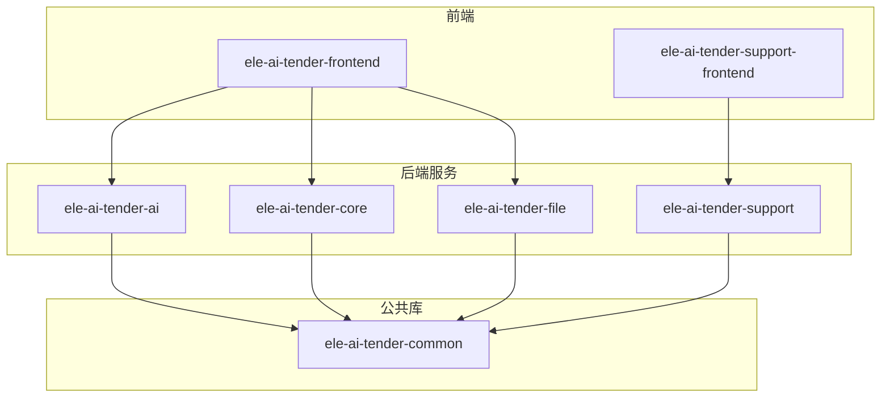
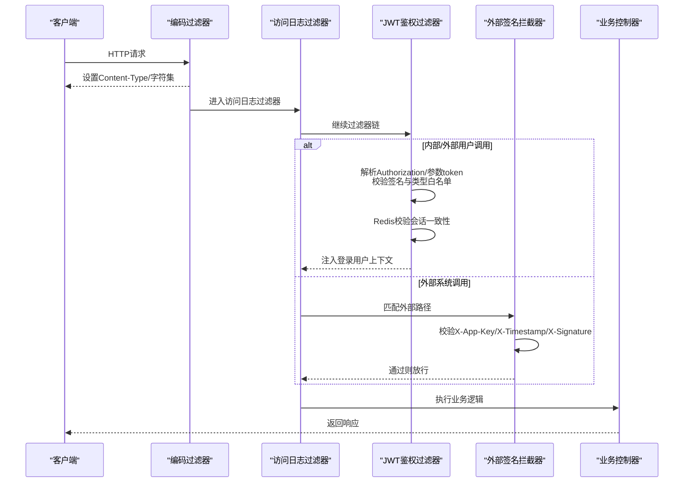
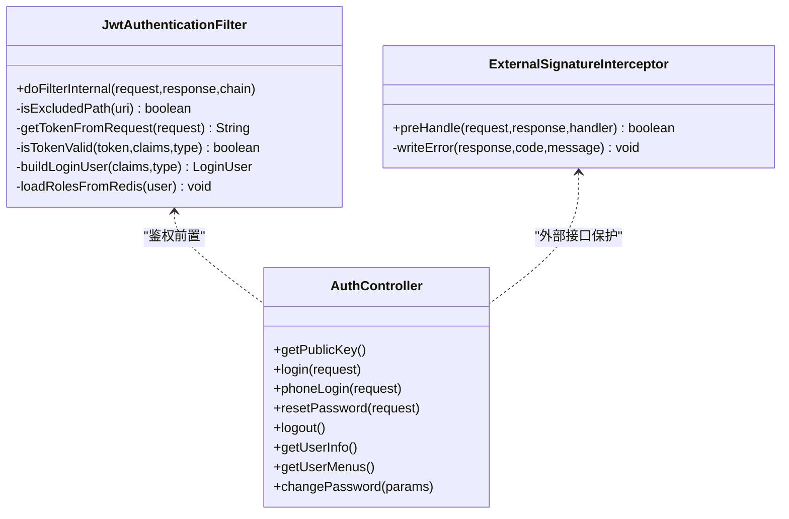
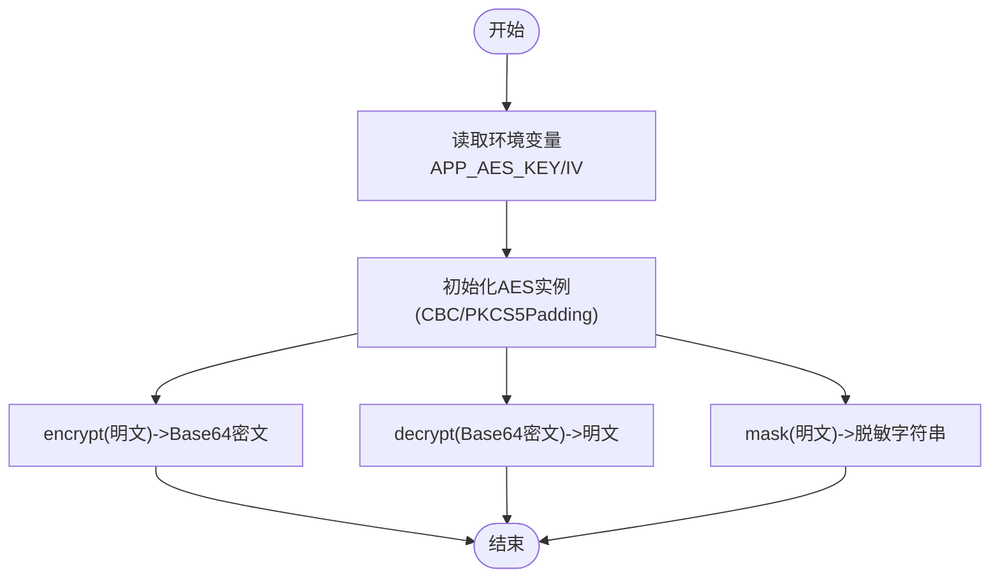
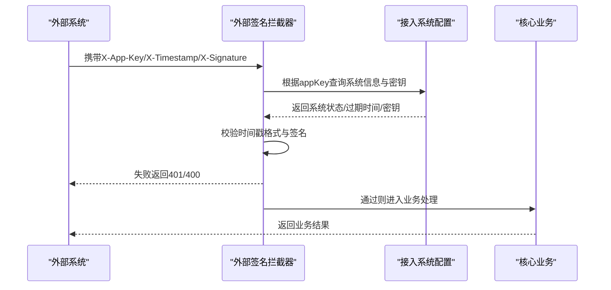
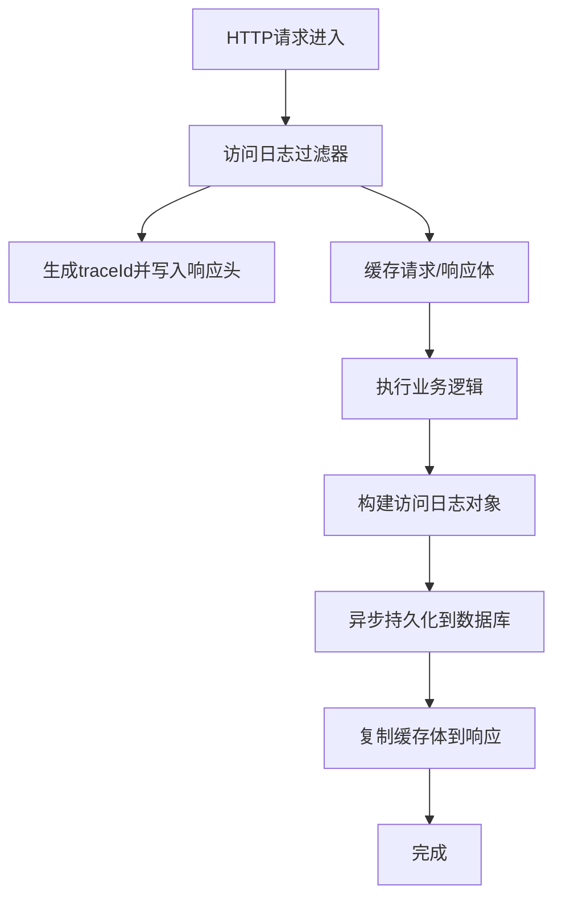
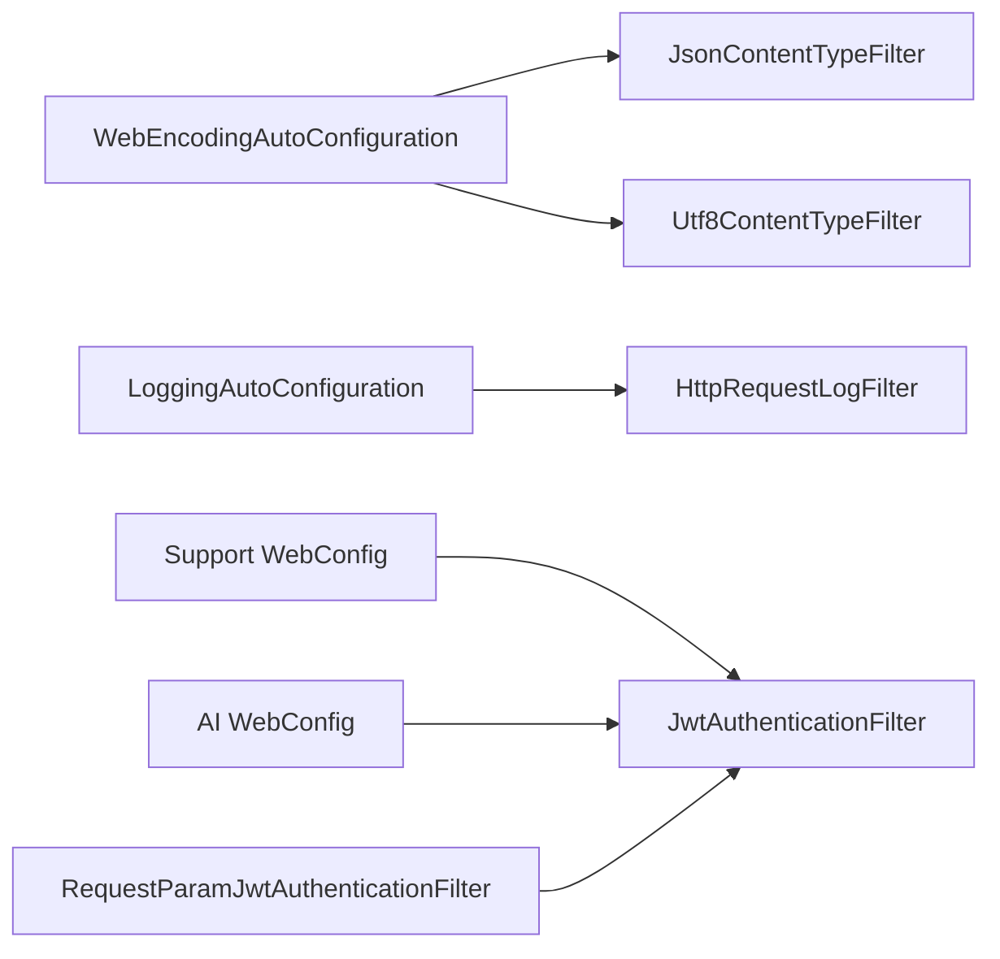

# 安全加固

<cite>
**本文引用的文件**   
- [JwtAuthenticationFilter.java](file://ele-ai-tender-system/ele-ai-tender-common/src/main/java/com/jy/eleaitender/common/security/JwtAuthenticationFilter.java)
- [AuthController.java](file://ele-ai-tender-system/ele-ai-tender-support/src/main/java/com/jy/eleaitender/support/controller/AuthController.java)
- [WebConfig.java（支持服务）](file://ele-ai-tender-system/ele-ai-tender-support/src/main/java/com/jy/eleaitender/support/config/WebConfig.java)
- [WebConfig.java（AI服务）](file://ele-ai-tender-system/ele-ai-tender-ai/src/main/java/com/jy/eleaitender/ai/config/WebConfig.java)
- [RequestParamJwtAuthenticationFilter.java](file://ele-ai-tender-system/ele-ai-tender-file/src/main/java/com/jy/eleaitender/file/security/RequestParamJwtAuthenticationFilter.java)
- [ExternalSignatureInterceptor.java](file://ele-ai-tender-system/ele-ai-tender-core/src/main/java/com/jy/eleaitender/core/config/ExternalSignatureInterceptor.java)
- [AesUtil.java](file://ele-ai-tender-system/ele-ai-tender-common/src/main/java/com/jy/eleaitender/common/util/AesUtil.java)
- [WebEncodingAutoConfiguration.java](file://ele-ai-tender-system/ele-ai-tender-common/src/main/java/com/jy/eleaitender/common/web/WebEncodingAutoConfiguration.java)
- [LoggingAutoConfiguration.java](file://ele-ai-tender-system/ele-ai-tender-common/src/main/java/com/jy/eleaitender/common/logging/LoggingAutoConfiguration.java)
- [HttpRequestLogFilter.java](file://ele-ai-tender-system/ele-ai-tender-common/src/main/java/com/jy/eleaitender/common/logging/HttpRequestLogFilter.java)
</cite>

## 目录
1. [简介](#简介)
2. [项目结构](#项目结构)
3. [核心组件](#核心组件)
4. [架构总览](#架构总览)
5. [详细组件分析](#详细组件分析)
6. [依赖关系分析](#依赖关系分析)
7. [性能考量](#性能考量)
8. [故障排查指南](#故障排查指南)
9. [结论](#结论)
10. [附录](#附录)

## 简介
本指南面向“招标文件AI编制系统”的安全加固，围绕身份认证与授权、数据安全保护、API安全防护、网络安全配置、应用安全加固、审计日志与合规、应急响应等维度提供系统化建议。文档结合仓库中现有实现进行对照说明，并给出可落地的加固策略与最佳实践。

## 项目结构
本项目采用前后端分离与多服务微服务化组织：
- 前端：ele-ai-tender-frontend、ele-ai-tender-support-frontend
- 后端服务：ele-ai-tender-ai、ele-ai-tender-core、ele-ai-tender-file、ele-ai-tender-support
- 公共能力：ele-ai-tender-common（包含安全、日志、编码、工具类等）

[本节为概念性结构说明，无需来源标注]

## 核心组件
- 统一JWT鉴权过滤器：负责从请求中提取令牌、校验签名、类型白名单、Redis会话一致性校验，并将登录用户信息注入上下文。
- 外部API签名拦截器：对特定外部接口路径进行AppKey+时间戳+签名校验，防止伪造与重放。
- 认证控制器：提供公钥获取、密码登录、短信验证码登录、重置密码、登出、菜单与用户信息等能力。
- AES加解密工具：用于敏感数据加密存储与脱敏展示。
- Web编码自动配置：统一JSON与UTF-8编码过滤，降低字符集相关风险。
- 访问日志过滤器：统一采集请求/响应体、耗时、异常信息，并可选持久化到数据库。

章节来源
- [JwtAuthenticationFilter.java:1-168](file://ele-ai-tender-system/ele-ai-tender-common/src/main/java/com/jy/eleaitender/common/security/JwtAuthenticationFilter.java#L1-L168)
- [ExternalSignatureInterceptor.java:1-86](file://ele-ai-tender-system/ele-ai-tender-core/src/main/java/com/jy/eleaitender/core/config/ExternalSignatureInterceptor.java#L1-L86)
- [AuthController.java:1-129](file://ele-ai-tender-system/ele-ai-tender-support/src/main/java/com/jy/eleaitender/support/controller/AuthController.java#L1-L129)
- [AesUtil.java:1-107](file://ele-ai-tender-system/ele-ai-tender-common/src/main/java/com/jy/eleaitender/common/util/AesUtil.java#L1-L107)
- [WebEncodingAutoConfiguration.java:1-41](file://ele-ai-tender-system/ele-ai-tender-common/src/main/java/com/jy/eleaitender/common/web/WebEncodingAutoConfiguration.java#L1-L41)
- [LoggingAutoConfiguration.java:31-50](file://ele-ai-tender-system/ele-ai-tender-common/src/main/java/com/jy/eleaitender/common/logging/LoggingAutoConfiguration.java#L31-L50)
- [HttpRequestLogFilter.java:1-137](file://ele-ai-tender-system/ele-ai-tender-common/src/main/java/com/jy/eleaitender/common/logging/HttpRequestLogFilter.java#L1-L137)

## 架构总览
下图展示了典型请求在系统中的安全处理链路：前端发起请求→全局编码过滤→访问日志记录→JWT鉴权或外部签名校验→业务控制器→返回结果。

图表来源
- [WebEncodingAutoConfiguration.java:1-41](file://ele-ai-tender-system/ele-ai-tender-common/src/main/java/com/jy/eleaitender/common/web/WebEncodingAutoConfiguration.java#L1-L41)
- [LoggingAutoConfiguration.java:31-50](file://ele-ai-tender-system/ele-ai-tender-common/src/main/java/com/jy/eleaitender/common/logging/LoggingAutoConfiguration.java#L31-L50)
- [HttpRequestLogFilter.java:1-137](file://ele-ai-tender-system/ele-ai-tender-common/src/main/java/com/jy/eleaitender/common/logging/HttpRequestLogFilter.java#L1-L137)
- [JwtAuthenticationFilter.java:1-168](file://ele-ai-tender-system/ele-ai-tender-common/src/main/java/com/jy/eleaitender/common/security/JwtAuthenticationFilter.java#L1-L168)
- [ExternalSignatureInterceptor.java:1-86](file://ele-ai-tender-system/ele-ai-tender-core/src/main/java/com/jy/eleaitender/core/config/ExternalSignatureInterceptor.java#L1-L86)

## 详细组件分析

### 身份认证与授权
- JWT令牌管理
  - 过滤器从请求头或请求参数提取令牌，校验JWT签名与类型白名单；针对内部用户与外部系统调用，进一步与Redis中的会话令牌比对，确保令牌未被撤销或过期。
  - 服务间调用Token仅校验签名，不查Redis，适合高吞吐内部调用场景。
  - 登录用户上下文在请求结束后清理，避免线程复用导致的数据泄露。
- RBAC与细粒度访问控制
  - 当前过滤器从Redis加载角色集合至上下文，便于后续基于角色的权限判断。
  - 建议在控制器层引入注解式鉴权（如@RequireLogin、@PreAuthorize），并结合数据范围注解实现行级隔离。
- 登录流程与密码传输安全
  - 提供RSA公钥接口，前端使用公钥对密码进行加密后再提交，降低明文口令在网络中暴露的风险。
  - 支持手机号验证码登录与短信重置密码，需配合频率限制与IP限流。

图表来源
- [JwtAuthenticationFilter.java:1-168](file://ele-ai-tender-system/ele-ai-tender-common/src/main/java/com/jy/eleaitender/common/security/JwtAuthenticationFilter.java#L1-L168)
- [ExternalSignatureInterceptor.java:1-86](file://ele-ai-tender-system/ele-ai-tender-core/src/main/java/com/jy/eleaitender/core/config/ExternalSignatureInterceptor.java#L1-L86)
- [AuthController.java:1-129](file://ele-ai-tender-system/ele-ai-tender-support/src/main/java/com/jy/eleaitender/support/controller/AuthController.java#L1-L129)

章节来源
- [JwtAuthenticationFilter.java:1-168](file://ele-ai-tender-system/ele-ai-tender-common/src/main/java/com/jy/eleaitender/common/security/JwtAuthenticationFilter.java#L1-L168)
- [AuthController.java:1-129](file://ele-ai-tender-system/ele-ai-tender-support/src/main/java/com/jy/eleaitender/support/controller/AuthController.java#L1-L129)

### 数据安全保护
- 敏感数据加密存储
  - 提供AES工具类，支持CBC模式与PKCS5Padding，密钥与IV可通过环境变量覆盖，便于不同环境隔离。
  - 提供脱敏方法，用于日志与界面展示时隐藏关键信息。
- 传输层加密
  - 建议全站强制HTTPS，并在网关/反向代理层启用TLS 1.2+与强密码套件。
- 密钥管理系统
  - 建议将密钥交由KMS/Secrets Manager统一管理，避免硬编码与环境变量散乱存放。
  - 定期轮换密钥，并对历史密文制定迁移策略。

图表来源
- [AesUtil.java:1-107](file://ele-ai-tender-system/ele-ai-tender-common/src/main/java/com/jy/eleaitender/common/util/AesUtil.java#L1-L107)

章节来源
- [AesUtil.java:1-107](file://ele-ai-tender-system/ele-ai-tender-common/src/main/java/com/jy/eleaitender/common/util/AesUtil.java#L1-L107)

### API安全防护
- 请求签名验证与防重放
  - 外部接口拦截器校验X-App-Key、X-Timestamp、X-Signature，拒绝缺失或不合法的时间戳，并依据系统状态与过期时间做准入控制。
  - 建议增加时间窗口校验（如±5分钟）与一次性Nonce机制，彻底防范重放攻击。
- SQL注入防护
  - 建议使用参数化查询与ORM框架的预编译特性，禁止拼接SQL；对输入进行严格校验与白名单过滤。
- XSS攻击防护
  - 统一设置响应头Content-Type为application/json，避免浏览器误解析为HTML；对用户输入进行输出编码与CSP策略配置。
- 其他
  - 对大体积请求与慢速连接进行限速与超时控制，防止资源耗尽。

图表来源
- [ExternalSignatureInterceptor.java:1-86](file://ele-ai-tender-system/ele-ai-tender-core/src/main/java/com/jy/eleaitender/core/config/ExternalSignatureInterceptor.java#L1-L86)

章节来源
- [ExternalSignatureInterceptor.java:1-86](file://ele-ai-tender-system/ele-ai-tender-core/src/main/java/com/jy/eleaitender/core/config/ExternalSignatureInterceptor.java#L1-L86)

### 网络安全配置
- 防火墙规则
  - 仅开放必要端口（如80/443），内网服务间通信走私有网络与最小权限原则。
- WAF配置
  - 启用WAF规则集，拦截常见OWASP Top 10攻击；对特殊路径（如上传、导出）进行更严格的校验。
- DDoS防护策略
  - 在边缘节点启用速率限制、连接数限制与IP黑名单；对异常流量进行告警与自动封禁。

[本节为通用安全建议，无需来源标注]

### 应用安全加固
- 依赖包漏洞扫描
  - 在CI流水线集成SCA工具（如npm audit、Maven Dependency-Check），阻断高危漏洞合并。
- 安全编码规范
  - 输入校验、输出编码、错误信息脱敏、最小权限原则、敏感操作二次确认。
- 渗透测试
  - 上线前开展黑盒/灰盒渗透测试，覆盖认证、越权、注入、文件上传、SSRF等高风险点。

[本节为通用安全建议，无需来源标注]

### 安全审计日志、合规检查与应急响应
- 审计日志
  - 统一HTTP访问日志过滤器采集请求/响应体、耗时、异常与traceId，并支持异步持久化到数据库。
  - 建议对敏感字段进行脱敏，保留必要的审计要素（用户、IP、UA、URI、耗时、状态码）。
- 合规检查
  - 遵循个人信息保护法与数据安全法要求，落实最小必要、目的限定、留存期限与访问审计。
- 应急响应预案
  - 建立事件分级与处置流程，包括快速熔断、账号冻结、密钥轮换、补丁发布与回滚策略。

图表来源
- [HttpRequestLogFilter.java:1-137](file://ele-ai-tender-system/ele-ai-tender-common/src/main/java/com/jy/eleaitender/common/logging/HttpRequestLogFilter.java#L1-L137)
- [LoggingAutoConfiguration.java:31-50](file://ele-ai-tender-system/ele-ai-tender-common/src/main/java/com/jy/eleaitender/common/logging/LoggingAutoConfiguration.java#L31-L50)

章节来源
- [HttpRequestLogFilter.java:1-137](file://ele-ai-tender-system/ele-ai-tender-common/src/main/java/com/jy/eleaitender/common/logging/HttpRequestLogFilter.java#L1-L137)
- [LoggingAutoConfiguration.java:31-50](file://ele-ai-tender-system/ele-ai-tender-common/src/main/java/com/jy/eleaitender/common/logging/LoggingAutoConfiguration.java#L31-L50)

## 依赖关系分析
- 过滤器与拦截器装配
  - 各服务通过WebConfig注册JWT过滤器，统一拦截/api/*路径。
  - 文件服务提供基于请求参数的JWT过滤器变体，满足特定场景需求。
- 编码与日志自动配置
  - 公共库提供JSON与UTF-8编码过滤器自动装配，以及访问日志过滤器装配。

图表来源
- [WebEncodingAutoConfiguration.java:1-41](file://ele-ai-tender-system/ele-ai-tender-common/src/main/java/com/jy/eleaitender/common/web/WebEncodingAutoConfiguration.java#L1-L41)
- [LoggingAutoConfiguration.java:31-50](file://ele-ai-tender-system/ele-ai-tender-common/src/main/java/com/jy/eleaitender/common/logging/LoggingAutoConfiguration.java#L31-L50)
- [WebConfig.java（支持服务）:30-61](file://ele-ai-tender-system/ele-ai-tender-support/src/main/java/com/jy/eleaitender/support/config/WebConfig.java#L30-L61)
- [WebConfig.java（AI服务）:1-33](file://ele-ai-tender-system/ele-ai-tender-ai/src/main/java/com/jy/eleaitender/ai/config/WebConfig.java#L1-L33)
- [RequestParamJwtAuthenticationFilter.java:1-31](file://ele-ai-tender-system/ele-ai-tender-file/src/main/java/com/jy/eleaitender/file/security/RequestParamJwtAuthenticationFilter.java#L1-L31)

章节来源
- [WebConfig.java（支持服务）:30-61](file://ele-ai-tender-system/ele-ai-tender-support/src/main/java/com/jy/eleaitender/support/config/WebConfig.java#L30-L61)
- [WebConfig.java（AI服务）:1-33](file://ele-ai-tender-system/ele-ai-tender-ai/src/main/java/com/jy/eleaitender/ai/config/WebConfig.java#L1-L33)
- [RequestParamJwtAuthenticationFilter.java:1-31](file://ele-ai-tender-system/ele-ai-tender-file/src/main/java/com/jy/eleaitender/file/security/RequestParamJwtAuthenticationFilter.java#L1-L31)

## 性能考量
- JWT校验
  - 服务间调用跳过Redis校验，减少延迟；内部用户与外部系统调用需命中Redis，建议开启本地缓存或热点键优化。
- 访问日志
  - 对SSE流式请求不进行响应体包装，避免阻塞与内存占用；常规请求采用缓存包装器，注意控制请求/响应体大小与采样率。
- 编码过滤器
  - 编码过滤器优先级较高，应确保其轻量高效，避免重复包装。

[本节为通用性能建议，无需来源标注]

## 故障排查指南
- 认证失败
  - 检查Authorization头是否携带Bearer Token或对应参数名是否正确；核对令牌类型是否在白名单；确认Redis中会话令牌一致。
- 外部签名失败
  - 核对X-App-Key是否存在且有效、时间戳是否超出允许窗口、签名算法与排序是否与约定一致。
- 日志未持久化
  - 检查访问日志开关与持久化服务是否可用；确认数据库表结构与索引是否正常。
- 编码问题
  - 确认JSON与UTF-8过滤器已生效，响应头Content-Type正确设置。

章节来源
- [JwtAuthenticationFilter.java:1-168](file://ele-ai-tender-system/ele-ai-tender-common/src/main/java/com/jy/eleaitender/common/security/JwtAuthenticationFilter.java#L1-L168)
- [ExternalSignatureInterceptor.java:1-86](file://ele-ai-tender-system/ele-ai-tender-core/src/main/java/com/jy/eleaitender/core/config/ExternalSignatureInterceptor.java#L1-L86)
- [HttpRequestLogFilter.java:1-137](file://ele-ai-tender-system/ele-ai-tender-common/src/main/java/com/jy/eleaitender/common/logging/HttpRequestLogFilter.java#L1-L137)
- [WebEncodingAutoConfiguration.java:1-41](file://ele-ai-tender-system/ele-ai-tender-common/src/main/java/com/jy/eleaitender/common/web/WebEncodingAutoConfiguration.java#L1-L41)

## 结论
本指南基于现有代码实现了统一的JWT鉴权、外部签名校验、敏感数据加密与访问日志采集等基础安全能力。在此基础上，建议进一步完善RBAC注解化鉴权、细粒度数据范围控制、WAF与DDoS防护、密钥管理与合规审计，形成端到端的安全闭环。

[本节为总结性内容，无需来源标注]

## 附录
- 建议补充的清单
  - 全量接口清单与访问级别划分
  - 外部系统接入规范（签名算法、时间窗口、Nonce策略）
  - 敏感字段清单与加密/脱敏策略
  - 安全基线与巡检项（证书有效期、弱口令、默认账户、危险函数）
  - 应急预案演练计划与复盘模板

[本节为通用建议，无需来源标注]