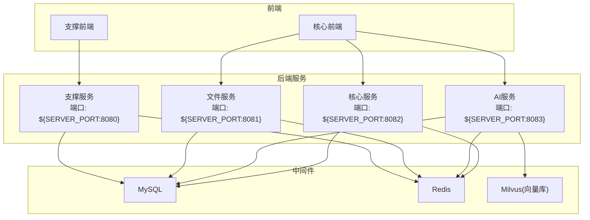
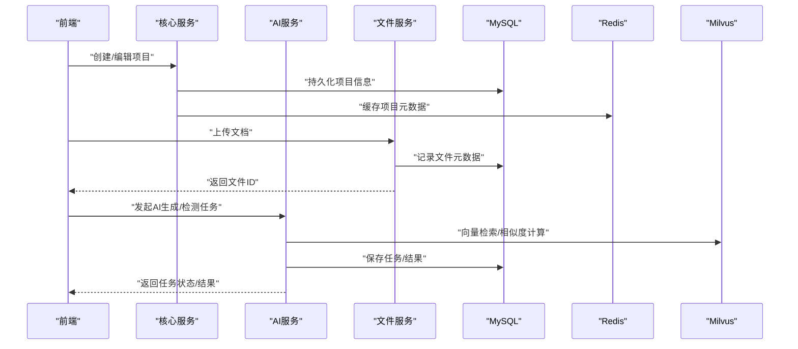
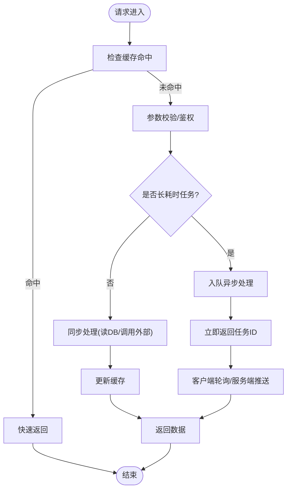
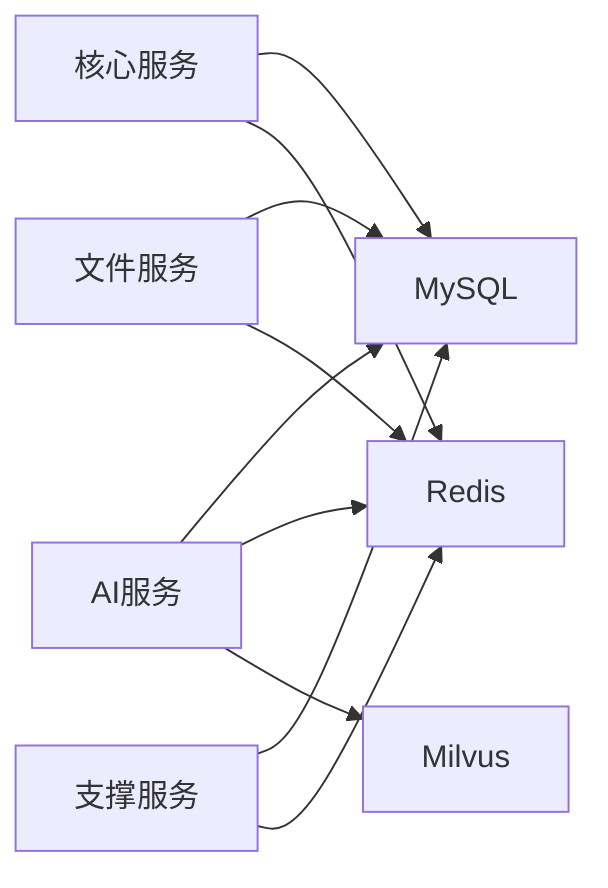

# 性能优化与调优

<cite>
**本文引用的文件**   
- [ele-ai-tender-ai/application.yml](file://ele-ai-tender-system/ele-ai-tender-ai/src/main/resources/application.yml)
- [ele-ai-tender-core/application.yml](file://ele-ai-tender-system/ele-ai-tender-core/src/main/resources/application.yml)
- [ele-ai-tender-file/application.yml](file://ele-ai-tender-system/ele-ai-tender-file/src/main/resources/application.yml)
- [ele-ai-tender-support/application.yml](file://ele-ai-tender-system/ele-ai-tender-support/src/main/resources/application.yml)
- [Jenkinsfile-ai.groovy](file://Jenkinsfile-ai.groovy)
- [Jenkinsfile-core.groovy](file://Jenkinsfile-core.groovy)
- [Jenkinsfile-file.groovy](file://Jenkinsfile-file.groovy)
- [Jenkinsfile-support.groovy](file://Jenkinsfile-support.groovy)
</cite>

## 目录
1. [引言](#引言)
2. [项目结构](#项目结构)
3. [核心组件](#核心组件)
4. [架构总览](#架构总览)
5. [详细组件分析](#详细组件分析)
6. [依赖分析](#依赖分析)
7. [性能考虑](#性能考虑)
8. [故障排查指南](#故障排查指南)
9. [结论](#结论)
10. [附录](#附录)

## 引言
本指南面向“招标文件AI编制系统”的后端与前端，聚焦生产可用的性能优化与调优实践。内容覆盖：
- JVM参数调优（堆内存、GC选择、GC日志）
- 数据库性能优化（SQL、索引、连接池、慢查询）
- Redis缓存优化（穿透防护、热点预热、一致性）
- API接口性能优化（响应时间、并发、异步）
- 前端性能优化（资源压缩、懒加载、CDN、浏览器缓存）
- 压测方法、基准测试与容量规划建议

说明：本仓库未显式包含数据库连接池、Redis客户端、线程池等具体实现类；本节基于现有配置文件与构建脚本进行可落地的优化建议与落地路径说明。

## 项目结构
系统采用多模块微服务架构，关键后端服务包括：
- AI服务（ele-ai-tender-ai）：对外提供AI对话、文档匹配、知识检索等能力
- 核心服务（ele-ai-tender-core）：项目管理、流程编排、任务调度等核心业务
- 文件服务（ele-ai-tender-file）：文件上传、预览、转换等
- 支撑服务（ele-ai-tender-support）：系统管理、消息、统计等通用能力

各服务均通过application.yml配置数据源、Redis、JWT、日志等基础能力。CI/CD中通过JAR_OPTS注入JVM启动参数。

图表来源
- [ele-ai-tender-ai/application.yml:1-72](file://ele-ai-tender-system/ele-ai-tender-ai/src/main/resources/application.yml#L1-L72)
- [ele-ai-tender-core/application.yml:1-59](file://ele-ai-tender-system/ele-ai-tender-core/src/main/resources/application.yml#L1-L59)
- [ele-ai-tender-file/application.yml:1-63](file://ele-ai-tender-system/ele-ai-tender-file/src/main/resources/application.yml#L1-L63)
- [ele-ai-tender-support/application.yml:1-68](file://ele-ai-tender-system/ele-ai-tender-support/src/main/resources/application.yml#L1-L68)

章节来源
- [ele-ai-tender-ai/application.yml:1-72](file://ele-ai-tender-system/ele-ai-tender-ai/src/main/resources/application.yml#L1-L72)
- [ele-ai-tender-core/application.yml:1-59](file://ele-ai-tender-system/ele-ai-tender-core/src/main/resources/application.yml#L1-L59)
- [ele-ai-tender-file/application.yml:1-63](file://ele-ai-tender-system/ele-ai-tender-file/src/main/resources/application.yml#L1-L63)
- [ele-ai-tender-support/application.yml:1-68](file://ele-ai-tender-system/ele-ai-tender-support/src/main/resources/application.yml#L1-L68)

## 核心组件
- 应用配置
  - 服务端口、编码、外部依赖（MySQL、Redis、Milvus）、JWT、内部文件服务地址、日志级别等均在各自服务的application.yml中定义
- 构建与运行
  - CI脚本通过JAR_OPTS注入JVM参数（如-Xmx），用于控制堆大小与编码

章节来源
- [ele-ai-tender-ai/application.yml:1-72](file://ele-ai-tender-system/ele-ai-tender-ai/src/main/resources/application.yml#L1-L72)
- [ele-ai-tender-core/application.yml:1-59](file://ele-ai-tender-system/ele-ai-tender-core/src/main/resources/application.yml#L1-L59)
- [ele-ai-tender-file/application.yml:1-63](file://ele-ai-tender-system/ele-ai-tender-file/src/main/resources/application.yml#L1-L63)
- [ele-ai-tender-support/application.yml:1-68](file://ele-ai-tender-system/ele-ai-tender-support/src/main/resources/application.yml#L1-L68)
- [Jenkinsfile-ai.groovy:10](file://Jenkinsfile-ai.groovy#L10)
- [Jenkinsfile-core.groovy:10](file://Jenkinsfile-core.groovy#L10)
- [Jenkinsfile-file.groovy:10](file://Jenkinsfile-file.groovy#L10)
- [Jenkinsfile-support.groovy:10](file://Jenkinsfile-support.groovy#L10)

## 架构总览
从性能视角看，系统的关键瓶颈通常出现在：
- 外部模型调用（AI服务）的延迟与吞吐
- 数据库读写热点与慢查询
- 大文件处理（文件服务）的I/O与内存占用
- 前端首屏与交互体验

图表来源
- [ele-ai-tender-ai/application.yml:1-72](file://ele-ai-tender-system/ele-ai-tender-ai/src/main/resources/application.yml#L1-L72)
- [ele-ai-tender-core/application.yml:1-59](file://ele-ai-tender-system/ele-ai-tender-core/src/main/resources/application.yml#L1-L59)
- [ele-ai-tender-file/application.yml:1-63](file://ele-ai-tender-system/ele-ai-tender-file/src/main/resources/application.yml#L1-L63)
- [ele-ai-tender-support/application.yml:1-68](file://ele-ai-tender-system/ele-ai-tender-support/src/main/resources/application.yml#L1-L68)

## 详细组件分析

### JVM参数调优
- 现状
  - CI脚本通过JAR_OPTS设置最大堆大小（例如AI服务为2G、核心服务为1G、文件服务为768M、支撑服务为512M）
- 建议
  - 根据服务特征差异化配置：
    - AI服务：偏向CPU与网络IO，适当提高堆并关注Metaspace与直接内存
    - 文件服务：大文件处理需关注堆外内存与临时对象分配
    - 核心/支撑服务：以事务与CRUD为主，合理设置新生代比例
  - GC选择：
    - 默认使用ZGC或G1（取决于JDK版本），优先开启低延迟目标
  - GC日志：
    - 启用GC日志并定期归档，结合指标平台做趋势分析
  - 监控与告警：
    - 关注Full GC次数、停顿时长、堆使用率、线程阻塞情况

章节来源
- [Jenkinsfile-ai.groovy:10](file://Jenkinsfile-ai.groovy#L10)
- [Jenkinsfile-core.groovy:10](file://Jenkinsfile-core.groovy#L10)
- [Jenkinsfile-file.groovy:10](file://Jenkinsfile-file.groovy#L10)
- [Jenkinsfile-support.groovy:10](file://Jenkinsfile-support.groovy#L10)

### 数据库性能优化
- 现状
  - 各服务通过application.yml配置MySQL连接URL、用户名、密码、时区等
  - MyBatis-Plus已启用驼峰映射与逻辑删除字段
- 建议
  - SQL优化
    - 避免SELECT *，按需取列；减少子查询，尽量JOIN
    - 分页查询使用覆盖索引，避免深分页
  - 索引设计
    - 高频过滤条件建复合索引；注意选择性；避免过度索引
  - 连接池配置
    - 当前配置未显式声明连接池参数，建议在application.yml中补充连接池相关配置（如最大连接数、空闲回收、超时等）
  - 慢查询分析
    - 开启MySQL慢查询日志，定期分析Top N语句
    - 在MyBatis层输出SQL（开发环境已启用stdout日志）辅助定位

章节来源
- [ele-ai-tender-ai/application.yml:16-20](file://ele-ai-tender-system/ele-ai-tender-ai/src/main/resources/application.yml#L16-L20)
- [ele-ai-tender-core/application.yml:16-20](file://ele-ai-tender-system/ele-ai-tender-core/src/main/resources/application.yml#L16-L20)
- [ele-ai-tender-file/application.yml:20-24](file://ele-ai-tender-system/ele-ai-tender-file/src/main/resources/application.yml#L20-L24)
- [ele-ai-tender-support/application.yml:16-20](file://ele-ai-tender-system/ele-ai-tender-support/src/main/resources/application.yml#L16-L20)
- [ele-ai-tender-ai/application.yml:36-48](file://ele-ai-tender-system/ele-ai-tender-ai/src/main/resources/application.yml#L36-L48)
- [ele-ai-tender-core/application.yml:29-41](file://ele-ai-tender-system/ele-ai-tender-core/src/main/resources/application.yml#L29-L41)
- [ele-ai-tender-file/application.yml:37-48](file://ele-ai-tender-system/ele-ai-tender-file/src/main/resources/application.yml#L37-L48)
- [ele-ai-tender-support/application.yml:29-40](file://ele-ai-tender-system/ele-ai-tender-support/src/main/resources/application.yml#L29-L40)

### Redis缓存优化
- 现状
  - 各服务配置了Redis主机、端口、库号、密码与部分超时
- 建议
  - 缓存穿透防护
    - 对不存在的数据写入空值并设置短TTL；布隆过滤器拦截恶意请求
  - 热点数据预热
    - 启动阶段或定时任务预加载高频字典、模板、策略等
  - 一致性保证
    - 先更新DB再删缓存；或使用延迟双删；必要时引入订阅机制
  - 连接与序列化
    - 调整连接池大小、超时、重试；统一序列化策略，避免大对象

章节来源
- [ele-ai-tender-ai/application.yml:21-27](file://ele-ai-tender-system/ele-ai-tender-ai/src/main/resources/application.yml#L21-L27)
- [ele-ai-tender-core/application.yml:21-27](file://ele-ai-tender-system/ele-ai-tender-core/src/main/resources/application.yml#L21-L27)
- [ele-ai-tender-file/application.yml:25-30](file://ele-ai-tender-system/ele-ai-tender-file/src/main/resources/application.yml#L25-L30)
- [ele-ai-tender-support/application.yml:21-27](file://ele-ai-tender-system/ele-ai-tender-support/src/main/resources/application.yml#L21-L27)

### API接口性能优化
- 现状
  - 服务端口与编码配置齐全；AI服务集成外部模型；文件服务支持大文件上传
- 建议
  - 响应时间优化
    - 合并接口、减少往返；分页+增量拉取；压缩响应体
  - 并发能力提升
    - 合理设置Tomcat线程池；限流与熔断保护下游
  - 异步处理机制
    - 长耗时任务（如AI生成、文档解析）采用异步队列+回调/轮询

[本图为概念流程图，无需源码对应]

### 前端性能优化
- 现状
  - 前端工程位于ele-ai-tender-frontend与ele-ai-tender-support-frontend，使用Vite构建
- 建议
  - 资源压缩与分包
    - 启用Gzip/Brotli；按路由与组件拆分；第三方库按需引入
  - 懒加载
    - 路由级与组件级懒加载；图片/视频懒加载
  - CDN加速
    - 静态资源上CDN；版本化文件名；开启强缓存
  - 浏览器缓存策略
    - HTML不缓存，JS/CSS/图片长期缓存；利用ETag/Last-Modified

[本节为通用指导，不涉及具体源码文件]

## 依赖分析
- 服务间依赖
  - 核心服务依赖MySQL与Redis
  - AI服务依赖MySQL、Redis与Milvus
  - 文件服务依赖MySQL与Redis
  - 支撑服务依赖MySQL与Redis
- 外部依赖
  - AI服务对接外部模型（OpenAI兼容API）
  - 文件服务支持大文件上传（multipart限制）

图表来源
- [ele-ai-tender-ai/application.yml:16-53](file://ele-ai-tender-system/ele-ai-tender-ai/src/main/resources/application.yml#L16-L53)
- [ele-ai-tender-core/application.yml:16-27](file://ele-ai-tender-system/ele-ai-tender-core/src/main/resources/application.yml#L16-L27)
- [ele-ai-tender-file/application.yml:20-30](file://ele-ai-tender-system/ele-ai-tender-file/src/main/resources/application.yml#L20-L30)
- [ele-ai-tender-support/application.yml:16-27](file://ele-ai-tender-system/ele-ai-tender-support/src/main/resources/application.yml#L16-L27)

章节来源
- [ele-ai-tender-ai/application.yml:16-53](file://ele-ai-tender-system/ele-ai-tender-ai/src/main/resources/application.yml#L16-L53)
- [ele-ai-tender-core/application.yml:16-27](file://ele-ai-tender-system/ele-ai-tender-core/src/main/resources/application.yml#L16-L27)
- [ele-ai-tender-file/application.yml:20-30](file://ele-ai-tender-system/ele-ai-tender-file/src/main/resources/application.yml#L20-L30)
- [ele-ai-tender-support/application.yml:16-27](file://ele-ai-tender-system/ele-ai-tender-support/src/main/resources/application.yml#L16-L27)

## 性能考虑
- 容量规划
  - 依据QPS、P99延迟、数据量增长曲线评估CPU/内存/磁盘/带宽
  - 分库分表与读写分离在数据量达到阈值后评估
- 压测与基准
  - 使用工具模拟真实负载，关注错误率、吞吐、延迟分布
  - 建立回归基线，变更前后对比
- 稳定性
  - 全链路限流、熔断、降级；幂等与重试策略
  - 灰度发布与回滚预案

[本节为通用指导，不涉及具体源码文件]

## 故障排查指南
- JVM问题
  - 现象：频繁Full GC、OOM、卡顿
  - 动作：查看GC日志、堆转储；调整堆大小与GC参数；定位大对象
- 数据库问题
  - 现象：慢查询、锁等待、连接耗尽
  - 动作：开启慢查询日志；分析执行计划；优化SQL与索引；扩容连接池
- Redis问题
  - 现象：命中率低、延迟高、断连
  - 动作：检查网络与时钟；调整连接池与超时；监控Key分布与热点
- API问题
  - 现象：超时、5xx增多、CPU飙升
  - 动作：查看线程栈与慢接口；增加超时与重试上限；异步化长任务

[本节为通用指导，不涉及具体源码文件]

## 结论
通过对JVM、数据库、Redis、API与前端的全链路优化，并结合压测与容量规划，可显著提升系统的吞吐与稳定性。建议在生产环境逐步落地上述优化项，并以指标驱动持续迭代。

## 附录
- 关键配置位置参考
  - AI服务：端口、数据源、Redis、Milvus、JWT、日志
  - 核心服务：端口、数据源、Redis、JWT、日志
  - 文件服务：端口、数据源、Redis、大文件上传限制、日志
  - 支撑服务：端口、数据源、Redis、JWT、短信网关、日志
- 构建参数参考
  - 各服务JAR_OPTS中的最大堆大小设置

章节来源
- [ele-ai-tender-ai/application.yml:1-72](file://ele-ai-tender-system/ele-ai-tender-ai/src/main/resources/application.yml#L1-L72)
- [ele-ai-tender-core/application.yml:1-59](file://ele-ai-tender-system/ele-ai-tender-core/src/main/resources/application.yml#L1-L59)
- [ele-ai-tender-file/application.yml:1-63](file://ele-ai-tender-system/ele-ai-tender-file/src/main/resources/application.yml#L1-L63)
- [ele-ai-tender-support/application.yml:1-68](file://ele-ai-tender-system/ele-ai-tender-support/src/main/resources/application.yml#L1-L68)
- [Jenkinsfile-ai.groovy:10](file://Jenkinsfile-ai.groovy#L10)
- [Jenkinsfile-core.groovy:10](file://Jenkinsfile-core.groovy#L10)
- [Jenkinsfile-file.groovy:10](file://Jenkinsfile-file.groovy#L10)
- [Jenkinsfile-support.groovy:10](file://Jenkinsfile-support.groovy#L10)