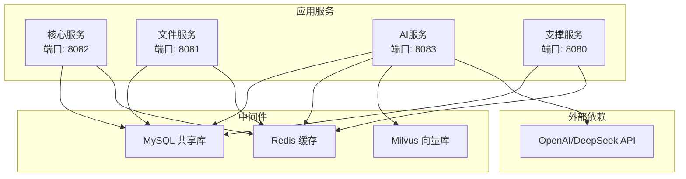
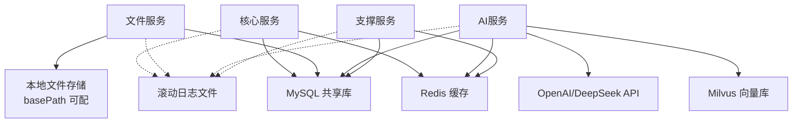
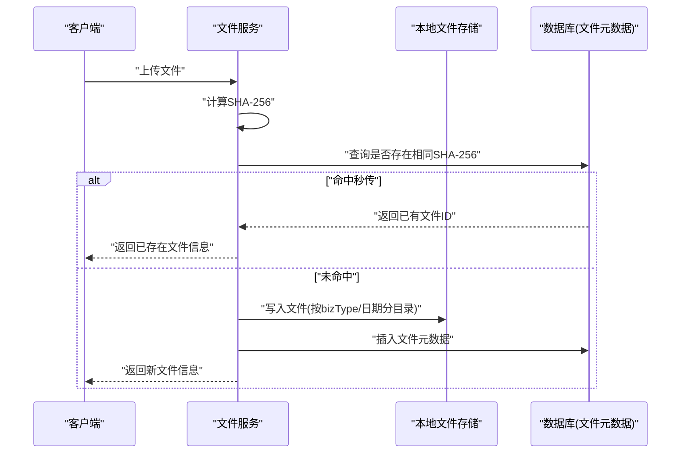
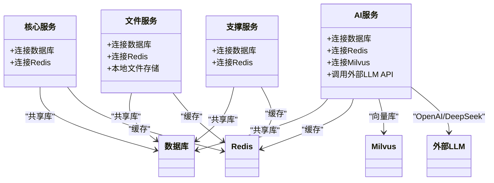

# 灾难恢复与备份

<cite>
**本文引用的文件**   
- [ele-ai-tender-core/application.yml](file://ele-ai-tender-system/ele-ai-tender-core/src/main/resources/application.yml)
- [ele-ai-tender-file/application.yml](file://ele-ai-tender-system/ele-ai-tender-file/src/main/resources/application.yml)
- [ele-ai-tender-support/application.yml](file://ele-ai-tender-system/ele-ai-tender-support/src/main/resources/application.yml)
- [ele-ai-tender-ai/application.yml](file://ele-ai-tender-system/ele-ai-tender-ai/src/main/resources/application.yml)
- [FileStorageConfig.java](file://ele-ai-tender-system/ele-ai-tender-file/src/main/java/com/jy/eleaitender/file/config/FileStorageConfig.java)
- [LocalFileStorageServiceImpl.java](file://ele-ai-tender-system/ele-ai-tender-file/src/main/java/com/jy/eleaitender/file/service/impl/LocalFileStorageServiceImpl.java)
- [DbAccessLogPersistenceService.java](file://ele-ai-tender-system/ele-ai-tender-common/src/main/java/com/jy/eleaitender/common/logging/DbAccessLogPersistenceService.java)
- [LoggingAutoConfiguration.java](file://ele-ai-tender-system/ele-ai-tender-common/src/main/java/com/jy/eleaitender/common/logging/LoggingAutoConfiguration.java)
- [DynamicThreadPoolManager.java](file://ele-ai-tender-system/ele-ai-tender-ai/src/main/java/com/jy/eleaitender/ai/threadpool/DynamicThreadPoolManager.java)
- [SysParameterServiceImpl.java](file://ele-ai-tender-system/ele-ai-tender-support/src/main/java/com/jy/eleaitender/support/service/impl/SysParameterServiceImpl.java)
- [application-dev.yml（support）](file://ele-ai-tender-system/ele-ai-tender-support/src/main/resources/application-dev.yml)
- [logback-spring.xml（ai）](file://ele-ai-tender-system/ele-ai-tender-ai/src/main/resources/logback-spring.xml)
- [Jenkinsfile-core.groovy](file://Jenkinsfile-core.groovy)
- [Jenkinsfile-file.groovy](file://Jenkinsfile-file.groovy)
- [Jenkinsfile-ai.groovy](file://Jenkinsfile-ai.groovy)
- [Jenkinsfile-support.groovy](file://Jenkinsfile-support.groovy)
</cite>

## 目录
1. [引言](#引言)
2. [项目结构](#项目结构)
3. [核心组件](#核心组件)
4. [架构总览](#架构总览)
5. [详细组件分析](#详细组件分析)
6. [依赖关系分析](#依赖关系分析)
7. [性能考虑](#性能考虑)
8. [故障排查指南](#故障排查指南)
9. [结论](#结论)
10. [附录](#附录)

## 引言
本文件为“招标文件AI编制系统”的灾难恢复与备份策略文档，面向运维、SRE与研发人员。内容覆盖数据备份方案（数据库全量/增量/实时同步）、文件存储备份（对象存储冗余、本地备份、异地容灾）、系统恢复流程（单节点故障、数据中心级灾难、业务连续性保障）、RTO/RPO目标与恢复优先级、一致性保证、演练计划与验证、应急预案更新机制，以及监控告警、自动恢复触发与人工干预流程。

## 项目结构
系统由多个微服务组成：core（核心业务）、file（文件服务）、ai（AI能力）、support（支撑中心）。各服务均通过配置连接共享数据库与Redis；文件服务提供本地文件系统存储实现，并记录文件元数据到数据库；日志采用滚动文件输出；部署流水线包含健康检查步骤，便于自动化回滚与快速恢复。

图表来源
- [ele-ai-tender-core/application.yml:1-59](file://ele-ai-tender-system/ele-ai-tender-core/src/main/resources/application.yml#L1-L59)
- [ele-ai-tender-file/application.yml:1-63](file://ele-ai-tender-system/ele-ai-tender-file/src/main/resources/application.yml#L1-L63)
- [ele-ai-tender-support/application.yml:1-68](file://ele-ai-tender-system/ele-ai-tender-support/src/main/resources/application.yml#L1-L68)
- [ele-ai-tender-ai/application.yml:1-72](file://ele-ai-tender-system/ele-ai-tender-ai/src/main/resources/application.yml#L1-L72)

章节来源
- [ele-ai-tender-core/application.yml:1-59](file://ele-ai-tender-system/ele-ai-tender-core/src/main/resources/application.yml#L1-L59)
- [ele-ai-tender-file/application.yml:1-63](file://ele-ai-tender-system/ele-ai-tender-file/src/main/resources/application.yml#L1-L63)
- [ele-ai-tender-support/application.yml:1-68](file://ele-ai-tender-system/ele-ai-tender-support/src/main/resources/application.yml#L1-L68)
- [ele-ai-tender-ai/application.yml:1-72](file://ele-ai-tender-system/ele-ai-tender-ai/src/main/resources/application.yml#L1-L72)

## 核心组件
- 数据库与缓存
  - 所有服务共享同一数据库实例与Redis实例，连接信息通过环境变量注入。
  - 关键配置项包括数据库URL、用户名、密码、Redis主机、端口、密码、数据库编号等。
- 文件存储
  - 文件服务提供本地文件系统存储实现，支持按业务类型与日期分目录组织，计算SHA-256用于秒传与去重，元数据落库。
  - 可配置最大文件大小、允许的文件类型列表、根路径等。
- 访问日志持久化
  - 访问日志默认异步落库，线程池不可用时降级为同步写入，避免丢日志。
  - 当Mapper Bean缺失时，自动禁用DB持久化。
- 动态线程池
  - AI服务动态线程池从数据库参数表读取配置，定时轮询变更并刷新执行器与并发控制。
- 系统参数缓存
  - 支撑服务将系统参数缓存至Redis，降低读放大。
- 日志滚动
  - AI服务使用RollingFileAppender按大小和时间滚动，限制历史保留天数与单文件大小。
- 部署与健康检查
  - 各模块Jenkinsfile包含健康检查重试逻辑，失败则阻断发布或触发回滚。

章节来源
- [ele-ai-tender-core/application.yml:16-27](file://ele-ai-tender-system/ele-ai-tender-core/src/main/resources/application.yml#L16-L27)
- [ele-ai-tender-file/application.yml:20-31](file://ele-ai-tender-system/ele-ai-tender-file/src/main/resources/application.yml#L20-L31)
- [ele-ai-tender-support/application.yml:16-27](file://ele-ai-tender-system/ele-ai-tender-support/src/main/resources/application.yml#L16-L27)
- [ele-ai-tender-ai/application.yml:16-27](file://ele-ai-tender-system/ele-ai-tender-ai/src/main/resources/application.yml#L16-L27)
- [FileStorageConfig.java:15-46](file://ele-ai-tender-system/ele-ai-tender-file/src/main/java/com/jy/eleaitender/file/config/FileStorageConfig.java#L15-L46)
- [LocalFileStorageServiceImpl.java:46-95](file://ele-ai-tender-system/ele-ai-tender-file/src/main/java/com/jy/eleaitender/file/service/impl/LocalFileStorageServiceImpl.java#L46-L95)
- [DbAccessLogPersistenceService.java:28-39](file://ele-ai-tender-system/ele-ai-tender-common/src/main/java/com/jy/eleaitender/common/logging/DbAccessLogPersistenceService.java#L28-L39)
- [LoggingAutoConfiguration.java:73-81](file://ele-ai-tender-system/ele-ai-tender-common/src/main/java/com/jy/eleaitender/common/logging/LoggingAutoConfiguration.java#L73-L81)
- [DynamicThreadPoolManager.java:68-86](file://ele-ai-tender-system/ele-ai-tender-ai/src/main/java/com/jy/eleaitender/ai/threadpool/DynamicThreadPoolManager.java#L68-L86)
- [SysParameterServiceImpl.java:25-34](file://ele-ai-tender-system/ele-ai-tender-support/src/main/java/com/jy/eleaitender/support/service/impl/SysParameterServiceImpl.java#L25-L34)
- [logback-spring.xml（ai）:55-83](file://ele-ai-tender-system/ele-ai-tender-ai/src/main/resources/logback-spring.xml#L55-L83)
- [Jenkinsfile-core.groovy:114-131](file://Jenkinsfile-core.groovy#L114-L131)
- [Jenkinsfile-file.groovy:114-131](file://Jenkinsfile-file.groovy#L114-L131)
- [Jenkinsfile-ai.groovy:114-131](file://Jenkinsfile-ai.groovy#L114-L131)
- [Jenkinsfile-support.groovy:114-131](file://Jenkinsfile-support.groovy#L114-L131)

## 架构总览
下图展示与备份恢复相关的组件交互：数据库、Redis、Milvus、本地文件存储、日志与外部API。

图表来源
- [ele-ai-tender-core/application.yml:16-27](file://ele-ai-tender-system/ele-ai-tender-core/src/main/resources/application.yml#L16-L27)
- [ele-ai-tender-file/application.yml:20-31](file://ele-ai-tender-system/ele-ai-tender-file/src/main/resources/application.yml#L20-L31)
- [ele-ai-tender-ai/application.yml:16-27](file://ele-ai-tender-system/ele-ai-tender-ai/src/main/resources/application.yml#L16-L27)
- [ele-ai-tender-ai/application.yml:50-54](file://ele-ai-tender-system/ele-ai-tender-ai/src/main/resources/application.yml#L50-L54)
- [FileStorageConfig.java:15-46](file://ele-ai-tender-system/ele-ai-tender-file/src/main/java/com/jy/eleaitender/file/config/FileStorageConfig.java#L15-L46)
- [logback-spring.xml（ai）:55-83](file://ele-ai-tender-system/ele-ai-tender-ai/src/main/resources/logback-spring.xml#L55-L83)

## 详细组件分析

### 数据备份方案
- 数据库全量备份
  - 建议对共享MySQL进行每日全量备份，结合binlog开启增量与时间点恢复。
  - 备份范围需覆盖所有模块使用的表空间与索引。
- 增量备份与实时同步
  - 基于MySQL binlog的增量复制（如主从复制或CDC工具）可实现近实时同步，满足较低RPO目标。
  - 注意跨服务共享库的一致性边界，确保事务内多表变更在同一个binlog事件流中。
- Redis备份
  - 定期快照（RDB）与AOF持久化组合，结合异地副本，降低缓存丢失风险。
- Milvus备份
  - 针对向量库，建议定期导出集合元数据与数据快照，并在异地存储保留多版本。

章节来源
- [ele-ai-tender-core/application.yml:16-27](file://ele-ai-tender-system/ele-ai-tender-core/src/main/resources/application.yml#L16-L27)
- [ele-ai-tender-file/application.yml:20-31](file://ele-ai-tender-system/ele-ai-tender-file/src/main/resources/application.yml#L20-L31)
- [ele-ai-tender-support/application.yml:16-27](file://ele-ai-tender-system/ele-ai-tender-support/src/main/resources/application.yml#L16-L27)
- [ele-ai-tender-ai/application.yml:16-27](file://ele-ai-tender-system/ele-ai-tender-ai/src/main/resources/application.yml#L16-L27)
- [ele-ai-tender-ai/application.yml:50-54](file://ele-ai-tender-system/ele-ai-tender-ai/src/main/resources/application.yml#L50-L54)

### 文件存储备份
- 本地文件存储
  - 文件服务默认使用本地磁盘路径作为存储根目录，路径可通过配置项设置。
  - 上传流程会计算SHA-256，若存在相同哈希则走“秒传”，减少重复IO。
  - 文件元数据（文件名、相对路径、大小、SHA-256、业务类型）落库，便于恢复后重建索引。
- 对象存储冗余
  - 建议引入对象存储（如S3兼容）作为主存储或冷备层，实现多副本与跨区域冗余。
- 本地备份与异地容灾
  - 对本地文件目录进行周期性快照与增量同步，同时向异地对象存储推送增量副本。
  - 校验策略：对备份集定期做完整性校验（如对比SHA-256），确保可恢复性。

图表来源
- [LocalFileStorageServiceImpl.java:46-95](file://ele-ai-tender-system/ele-ai-tender-file/src/main/java/com/jy/eleaitender/file/service/impl/LocalFileStorageServiceImpl.java#L46-L95)
- [LocalFileStorageServiceImpl.java:97-149](file://ele-ai-tender-system/ele-ai-tender-file/src/main/java/com/jy/eleaitender/file/service/impl/LocalFileStorageServiceImpl.java#L97-L149)
- [FileStorageConfig.java:15-46](file://ele-ai-tender-system/ele-ai-tender-file/src/main/java/com/jy/eleaitender/file/config/FileStorageConfig.java#L15-L46)

章节来源
- [LocalFileStorageServiceImpl.java:46-95](file://ele-ai-tender-system/ele-ai-tender-file/src/main/java/com/jy/eleaitender/file/service/impl/LocalFileStorageServiceImpl.java#L46-L95)
- [LocalFileStorageServiceImpl.java:97-149](file://ele-ai-tender-system/ele-ai-tender-file/src/main/java/com/jy/eleaitender/file/service/impl/LocalFileStorageServiceImpl.java#L97-L149)
- [FileStorageConfig.java:15-46](file://ele-ai-tender-system/ele-ai-tender-file/src/main/java/com/jy/eleaitender/file/config/FileStorageConfig.java#L15-L46)

### 系统恢复流程
- 单节点故障恢复
  - 服务无状态或具备水平扩展能力时，优先通过编排平台重启或替换故障节点。
  - 文件服务本地文件损坏时，从对象存储或异地副本恢复文件目录，再根据数据库元数据重建索引。
- 数据中心级灾难恢复
  - 切换流量至备用数据中心，先恢复数据库（全量+增量回放），再恢复文件存储（对象存储/异地副本），最后启动服务。
  - 对于AI服务，确认Milvus与外部API连通性后再上线。
- 业务连续性保障
  - 通过多活或双活架构、读写分离、缓存预热等手段缩短恢复时间。
  - 关键接口增加熔断与限流，避免雪崩。

章节来源
- [ele-ai-tender-file/application.yml:50-56](file://ele-ai-tender-system/ele-ai-tender-file/src/main/resources/application.yml#L50-L56)
- [ele-ai-tender-ai/application.yml:50-54](file://ele-ai-tender-system/ele-ai-tender-ai/src/main/resources/application.yml#L50-L54)

### RTO与RPO目标设定、恢复优先级与一致性保证
- RTO/RPO建议
  - 核心业务（订单、项目、需求生成）：RPO≤5分钟，RTO≤30分钟。
  - 辅助功能（日志、统计）：RPO≤1小时，RTO≤2小时。
- 恢复优先级
  - 数据库 > 文件存储 > 缓存 > 向量库 > 外部API。
- 一致性保证
  - 数据库层面使用事务与binlog顺序回放。
  - 文件层面以SHA-256校验一致性与幂等上传。
  - 缓存失效策略：恢复后主动清理热点键，避免脏读。

章节来源
- [LocalFileStorageServiceImpl.java:46-95](file://ele-ai-tender-system/ele-ai-tender-file/src/main/java/com/jy/eleaitender/file/service/impl/LocalFileStorageServiceImpl.java#L46-L95)

### 演练计划、恢复验证与应急预案更新机制
- 演练计划
  - 季度演练：模拟单节点故障与数据中心级灾难，验证RTO/RPO达成情况。
  - 月度演练：文件存储恢复与一致性校验。
- 恢复验证
  - 数据库：抽样比对关键表行数与校验和。
  - 文件：随机抽取文件进行SHA-256校验。
  - 服务：健康检查与冒烟用例通过。
- 应急预案更新
  - 每次演练后复盘，更新预案与操作手册，纳入配置基线与自动化脚本。

章节来源
- [Jenkinsfile-core.groovy:114-131](file://Jenkinsfile-core.groovy#L114-L131)
- [Jenkinsfile-file.groovy:114-131](file://Jenkinsfile-file.groovy#L114-L131)
- [Jenkinsfile-ai.groovy:114-131](file://Jenkinsfile-ai.groovy#L114-L131)
- [Jenkinsfile-support.groovy:114-131](file://Jenkinsfile-support.groovy#L114-L131)

### 监控告警配置、自动恢复触发与人工干预流程
- 监控告警
  - 服务健康检查失败、数据库连接异常、文件IO错误、日志滚动异常等指标接入统一监控平台。
  - 日志级别与滚动策略可观测，避免磁盘打满。
- 自动恢复触发
  - 健康检查连续失败达到阈值，自动触发重启或灰度回滚。
  - 动态线程池参数变更自动生效，无需停机。
- 人工干预流程
  - 重大故障升级通道明确，必要时手动切换流量、隔离问题节点、执行数据修复脚本。

章节来源
- [DbAccessLogPersistenceService.java:28-39](file://ele-ai-tender-system/ele-ai-tender-common/src/main/java/com/jy/eleaitender/common/logging/DbAccessLogPersistenceService.java#L28-L39)
- [LoggingAutoConfiguration.java:73-81](file://ele-ai-tender-system/ele-ai-tender-common/src/main/java/com/jy/eleaitender/common/logging/LoggingAutoConfiguration.java#L73-L81)
- [DynamicThreadPoolManager.java:68-86](file://ele-ai-tender-system/ele-ai-tender-ai/src/main/java/com/jy/eleaitender/ai/threadpool/DynamicThreadPoolManager.java#L68-L86)
- [logback-spring.xml（ai）:55-83](file://ele-ai-tender-system/ele-ai-tender-ai/src/main/resources/logback-spring.xml#L55-L83)
- [Jenkinsfile-core.groovy:114-131](file://Jenkinsfile-core.groovy#L114-L131)

## 依赖关系分析
- 服务间依赖
  - 核心、AI、支撑服务均依赖共享数据库与Redis；AI服务额外依赖Milvus与外部LLM API。
- 配置与环境
  - 开发环境示例显示独立IP与端口，便于隔离测试与演练。
- 运行时特性
  - 访问日志异步落库且具备降级策略；动态线程池支持热更新；JWT密钥与过期时间集中配置。

图表来源
- [ele-ai-tender-core/application.yml:16-27](file://ele-ai-tender-system/ele-ai-tender-core/src/main/resources/application.yml#L16-L27)
- [ele-ai-tender-file/application.yml:20-31](file://ele-ai-tender-system/ele-ai-tender-file/src/main/resources/application.yml#L20-L31)
- [ele-ai-tender-support/application.yml:16-27](file://ele-ai-tender-system/ele-ai-tender-support/src/main/resources/application.yml#L16-L27)
- [ele-ai-tender-ai/application.yml:16-27](file://ele-ai-tender-system/ele-ai-tender-ai/src/main/resources/application.yml#L16-L27)
- [ele-ai-tender-ai/application.yml:50-54](file://ele-ai-tender-system/ele-ai-tender-ai/src/main/resources/application.yml#L50-L54)

章节来源
- [application-dev.yml（support）:1-26](file://ele-ai-tender-system/ele-ai-tender-support/src/main/resources/application-dev.yml#L1-L26)

## 性能考虑
- 数据库连接池与慢查询优化，避免备份窗口影响在线性能。
- 文件上传大文件场景下，合理设置内存缓冲与磁盘IO策略，避免阻塞。
- 日志滚动策略防止磁盘占满导致服务不可用。
- 动态线程池参数调优，平衡吞吐与延迟。

[本节为通用指导，不直接分析具体文件]

## 故障排查指南
- 访问日志无法落库
  - 检查Mapper Bean是否可用；若缺失则自动禁用DB持久化，避免阻塞请求。
  - 观察线程池可用性，必要时降级为同步写入。
- 文件上传失败
  - 校验文件大小与类型白名单；检查本地存储路径权限与剩余空间。
  - 核对数据库元数据是否成功插入。
- 动态线程池未生效
  - 确认数据库参数表字段与Hash变化检测逻辑；查看轮询间隔与刷新日志。
- 健康检查失败
  - 参考Jenkinsfile中的重试与失败处理逻辑，定位服务启动或依赖连通性问题。

章节来源
- [LoggingAutoConfiguration.java:73-81](file://ele-ai-tender-system/ele-ai-tender-common/src/main/java/com/jy/eleaitender/common/logging/LoggingAutoConfiguration.java#L73-L81)
- [DbAccessLogPersistenceService.java:28-39](file://ele-ai-tender-system/ele-ai-tender-common/src/main/java/com/jy/eleaitender/common/logging/DbAccessLogPersistenceService.java#L28-L39)
- [LocalFileStorageServiceImpl.java:200-220](file://ele-ai-tender-system/ele-ai-tender-file/src/main/java/com/jy/eleaitender/file/service/impl/LocalFileStorageServiceImpl.java#L200-L220)
- [DynamicThreadPoolManager.java:68-86](file://ele-ai-tender-system/ele-ai-tender-ai/src/main/java/com/jy/eleaitender/ai/threadpool/DynamicThreadPoolManager.java#L68-L86)
- [Jenkinsfile-core.groovy:114-131](file://Jenkinsfile-core.groovy#L114-L131)

## 结论
本策略围绕共享数据库、本地文件存储、缓存与向量库的关键依赖，构建了全量/增量/实时同步的多层次备份体系，并结合健康检查与动态参数调整提升恢复效率。通过明确的RTO/RPO目标、恢复优先级与一致性校验，辅以演练与监控告警，可有效保障系统在单节点与数据中心级故障下的业务连续性。

[本节为总结性内容，不直接分析具体文件]

## 附录
- 配置要点清单
  - 数据库连接：url、username、password
  - Redis连接：host、port、database、password
  - 文件存储：basePath、allowedTypes、maxSize
  - Milvus连接：host、port、database
  - JWT密钥与过期时间：secret、expiration、external-expiration
- 恢复检查清单
  - 数据库：全量恢复+增量回放完成，关键表校验通过
  - 文件存储：目录结构与元数据一致，抽样SHA-256校验通过
  - 服务：健康检查通过，冒烟用例通过
  - 日志：滚动正常，磁盘占用可控

章节来源
- [ele-ai-tender-core/application.yml:16-27](file://ele-ai-tender-system/ele-ai-tender-core/src/main/resources/application.yml#L16-L27)
- [ele-ai-tender-file/application.yml:20-31](file://ele-ai-tender-system/ele-ai-tender-file/src/main/resources/application.yml#L20-L31)
- [ele-ai-tender-support/application.yml:16-27](file://ele-ai-tender-system/ele-ai-tender-support/src/main/resources/application.yml#L16-L27)
- [ele-ai-tender-ai/application.yml:16-27](file://ele-ai-tender-system/ele-ai-tender-ai/src/main/resources/application.yml#L16-L27)
- [ele-ai-tender-ai/application.yml:50-54](file://ele-ai-tender-system/ele-ai-tender-ai/src/main/resources/application.yml#L50-L54)
- [FileStorageConfig.java:15-46](file://ele-ai-tender-system/ele-ai-tender-file/src/main/java/com/jy/eleaitender/file/config/FileStorageConfig.java#L15-L46)