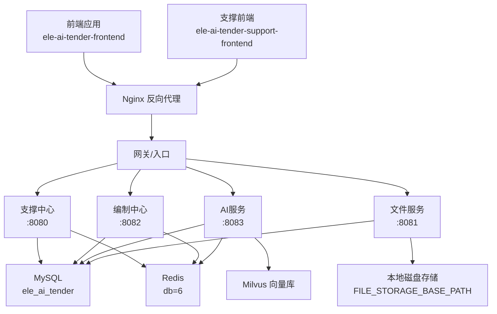
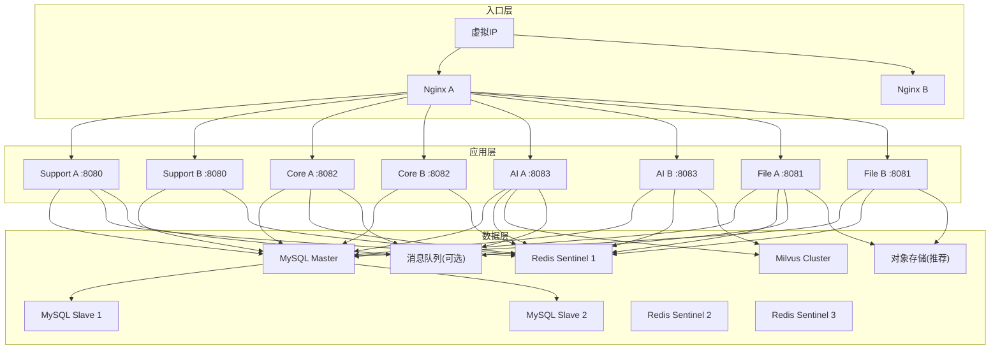
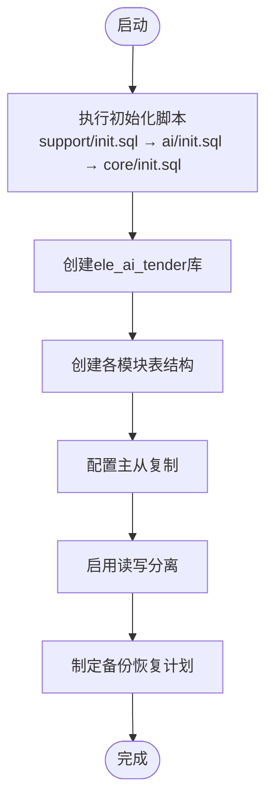
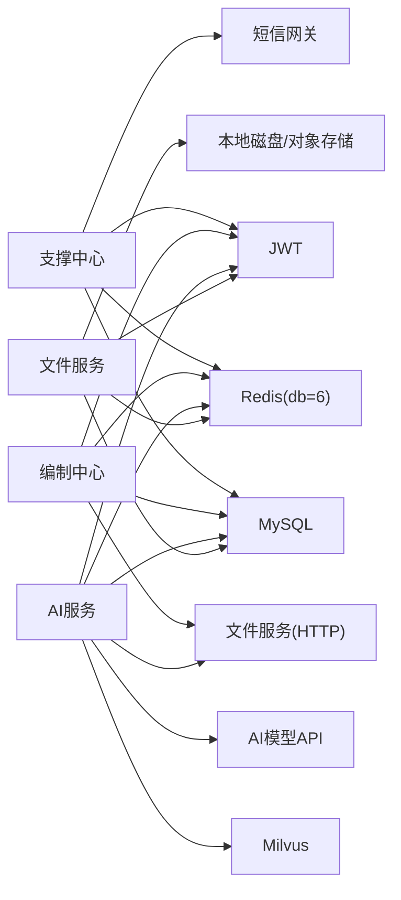

# 生产环境部署

<cite>
**本文引用的文件**   
- [ele-ai-tender-ai/application.yml](file://ele-ai-tender-system/ele-ai-tender-ai/src/main/resources/application.yml)
- [ele-ai-tender-core/application.yml](file://ele-ai-tender-system/ele-ai-tender-core/src/main/resources/application.yml)
- [ele-ai-tender-file/application.yml](file://ele-ai-tender-system/ele-ai-tender-file/src/main/resources/application.yml)
- [ele-ai-tender-support/application.yml](file://ele-ai-tender-system/ele-ai-tender-support/src/main/resources/application.yml)
- [ele-ai-tender-support/application-dev.yml](file://ele-ai-tender-system/ele-ai-tender-support/src/main/resources/application-dev.yml)
- [ele-ai-tender-ai/init.sql](file://ele-ai-tender-system/ele-ai-tender-ai/sql/init.sql)
- [ele-ai-tender-core/init.sql](file://ele-ai-tender-system/ele-ai-tender-core/sql/init.sql)
- [ele-ai-tender-file/init.sql](file://ele-ai-tender-system/ele-ai-tender-file/sql/init.sql)
- [ele-ai-tender-support/init.sql](file://ele-ai-tender-system/ele-ai-tender-support/sql/init.sql)
- [ele-ai-tender-ai OpenAPI](file://docs/guides/ele-ai-tender-ai.yml)
- [ele-ai-tender-core OpenAPI](file://docs/guides/ele-ai-tender-core.yml)
- [ele-ai-tender-file OpenAPI](file://docs/guides/ele-ai-tender-file.yml)
- [ele-ai-tender-support OpenAPI](file://docs/guides/ele-ai-tender-support.yml)
- [vite.config.ts](file://ele-ai-tender-frontend/vite.config.ts)
- [Jenkinsfile-core-web.groovy](file://Jenkinsfile-core-web.groovy)
- [Jenkinsfile-support-web.groovy](file://Jenkinsfile-support-web.groovy)
</cite>

## 目录
1. [简介](#简介)
2. [项目结构](#项目结构)
3. [核心组件](#核心组件)
4. [架构总览](#架构总览)
5. [详细组件分析](#详细组件分析)
6. [依赖分析](#依赖分析)
7. [性能考虑](#性能考虑)
8. [故障排查指南](#故障排查指南)
9. [结论](#结论)
10. [附录](#附录)

## 简介
本指南面向“招标文件AI编制系统”的生产环境部署，覆盖高可用架构设计、负载均衡与反向代理（Nginx）、数据库主从复制与读写分离、Redis集群与哨兵模式、消息队列与文件存储、第三方服务集成、容量规划、性能调优与安全加固。文档严格基于仓库内配置文件、SQL初始化脚本与OpenAPI规范进行说明，确保落地可执行。

## 项目结构
系统由多个独立微服务组成，共享同一数据库实例（逻辑库）与Redis命名空间，并通过内部文件服务提供统一文件存取能力：
- ele-ai-tender-support：支撑中心（认证、权限、菜单、消息、模型配置、外部系统集成等）
- ele-ai-tender-core：业务编排（项目、需求、评审项、检测流程、任务调度等）
- ele-ai-tender-ai：AI能力（对话、优化、建议、知识库、模型路由、响应记录等）
- ele-ai-tender-file：文件服务（上传、下载、信息、删除；本地磁盘存储）
- 前端：ele-ai-tender-frontend、ele-ai-tender-support-frontend（Vite构建，开发期通过代理访问后端）

图表来源
- [ele-ai-tender-support/application.yml:1-68](file://ele-ai-tender-system/ele-ai-tender-support/src/main/resources/application.yml#L1-L68)
- [ele-ai-tender-core/application.yml:1-59](file://ele-ai-tender-system/ele-ai-tender-core/src/main/resources/application.yml#L1-L59)
- [ele-ai-tender-ai/application.yml:1-72](file://ele-ai-tender-system/ele-ai-tender-ai/src/main/resources/application.yml#L1-L72)
- [ele-ai-tender-file/application.yml:1-63](file://ele-ai-tender-system/ele-ai-tender-file/src/main/resources/application.yml#L1-L63)

章节来源
- [ele-ai-tender-support/application.yml:1-68](file://ele-ai-tender-system/ele-ai-tender-support/src/main/resources/application.yml#L1-L68)
- [ele-ai-tender-core/application.yml:1-59](file://ele-ai-tender-system/ele-ai-tender-core/src/main/resources/application.yml#L1-L59)
- [ele-ai-tender-ai/application.yml:1-72](file://ele-ai-tender-system/ele-ai-tender-ai/src/main/resources/application.yml#L1-L72)
- [ele-ai-tender-file/application.yml:1-63](file://ele-ai-tender-system/ele-ai-tender-file/src/main/resources/application.yml#L1-L63)

## 核心组件
- 支撑中心（Support）：负责用户、角色、菜单、接入系统、消息、模型配置与路由规则、系统参数等基础能力。默认端口8080。
- 编制中心（Core）：承载项目、需求、评审项、检测流程、版本快照、模板快照等业务编排。默认端口8082。
- AI服务（AI）：提供AI对话、文本优化、建议、知识库管理、模型连通性测试、响应日志等。默认端口8083。
- 文件服务（File）：提供文件上传、下载、信息、删除接口，支持大文件（最大500MB），默认端口8081。
- 外部依赖：
  - MySQL：所有模块共用ele_ai_tender库，按表前缀区分模块数据。
  - Redis：统一使用db=6，用于会话、缓存、验证码、限流等。
  - Milvus：AI知识库向量检索。
  - 短信网关：支撑中心短信发送。
  - 内部文件服务：其他服务通过HTTP调用文件服务。

章节来源
- [ele-ai-tender-support/application.yml:1-68](file://ele-ai-tender-system/ele-ai-tender-support/src/main/resources/application.yml#L1-L68)
- [ele-ai-tender-core/application.yml:1-59](file://ele-ai-tender-system/ele-ai-tender-core/src/main/resources/application.yml#L1-L59)
- [ele-ai-tender-ai/application.yml:1-72](file://ele-ai-tender-system/ele-ai-tender-ai/src/main/resources/application.yml#L1-L72)
- [ele-ai-tender-file/application.yml:1-63](file://ele-ai-tender-system/ele-ai-tender-file/src/main/resources/application.yml#L1-L63)

## 架构总览
生产环境推荐采用如下高可用拓扑：
- 入口层：Nginx多实例+Keepalived实现VIP漂移与SSL卸载，集中处理静态资源、反向代理、限流熔断、缓存策略。
- 应用层：各服务无状态化，至少双节点部署，配合健康检查与自动重启。
- 数据层：
  - MySQL：一主多从，读写分离（应用侧或中间件）。
  - Redis：哨兵模式（3节点以上），持久化开启，分库隔离不同业务域。
  - Milvus：独立集群，按collection划分知识域。
  - 文件存储：分布式对象存储（如MinIO/OSS）替代本地磁盘，提升可靠性与扩展性。
- 消息队列：可选RabbitMQ/Kafka，用于异步任务、通知、审计日志落盘等。

[此图为概念架构图，不直接映射具体源码文件]

## 详细组件分析

### Nginx反向代理与负载均衡
- 目标
  - 统一入口、SSL终止、请求路由、限流熔断、静态资源缓存、健康检查。
- 关键要点
  - SSL证书：在Nginx集中管理，启用TLS 1.2+，优先ECDHE套件，定期轮换。
  - 路由规则：按路径将/api/*转发至对应服务，/api/file/*指向文件服务，/api/auth/*指向支撑中心，/api/v1/*根据子路径分发到Core/AI。
  - 限流熔断：对SSE长连接（AI对话）设置超时与并发限制；对上传接口限制大小与速率；对敏感接口增加白名单与重试退避。
  - 缓存策略：静态资源开启强缓存与协商缓存；API响应按需开启短缓存（需结合ETag/Last-Modified）。
- 参考
  - 前端开发期代理配置位于vite.config.ts，生产应替换为Nginx配置。
  - 前端打包产物发布流水线见Jenkinsfile-core-web.groovy与Jenkinsfile-support-web.groovy。

章节来源
- [vite.config.ts:1-39](file://ele-ai-tender-frontend/vite.config.ts#L1-L39)
- [Jenkinsfile-core-web.groovy:1-40](file://Jenkinsfile-core-web.groovy#L1-L40)
- [Jenkinsfile-support-web.groovy:1-40](file://Jenkinsfile-support-web.groovy#L1-L40)

### 数据库主从复制与读写分离
- 目标
  - 保障数据一致性与可用性，提升读吞吐，简化备份恢复。
- 方案
  - 主从复制：MySQL主库写入，从库异步复制；监控延迟与一致性校验。
  - 读写分离：应用层或中间件根据SQL类型选择主/从；写操作强制走主库。
  - 备份恢复：全量+增量备份，定期演练恢复；跨机房异地容灾。
- 初始化脚本
  - 支撑中心、编制中心、AI、文件服务均共用ele_ai_tender库，按表前缀区分。
  - 建库与表结构见各模块init.sql。

图表来源
- [ele-ai-tender-support/init.sql:1-682](file://ele-ai-tender-system/ele-ai-tender-support/sql/init.sql#L1-L682)
- [ele-ai-tender-ai/init.sql:1-119](file://ele-ai-tender-system/ele-ai-tender-ai/sql/init.sql#L1-L119)
- [ele-ai-tender-core/init.sql:1-272](file://ele-ai-tender-system/ele-ai-tender-core/sql/init.sql#L1-L272)
- [ele-ai-tender-file/init.sql:1-80](file://ele-ai-tender-system/ele-ai-tender-file/sql/init.sql#L1-L80)

章节来源
- [ele-ai-tender-support/init.sql:1-682](file://ele-ai-tender-system/ele-ai-tender-support/sql/init.sql#L1-L682)
- [ele-ai-tender-ai/init.sql:1-119](file://ele-ai-tender-system/ele-ai-tender-ai/sql/init.sql#L1-L119)
- [ele-ai-tender-core/init.sql:1-272](file://ele-ai-tender-system/ele-ai-tender-core/sql/init.sql#L1-L272)
- [ele-ai-tender-file/init.sql:1-80](file://ele-ai-tender-system/ele-ai-tender-file/sql/init.sql#L1-L80)

### Redis缓存集群与哨兵模式
- 目标
  - 提供高可用缓存、会话、验证码、限流计数等能力。
- 方案
  - 哨兵模式：至少3个哨兵节点，监控主从切换；客户端直连哨兵获取主节点地址。
  - 持久化：开启RDB+AOF混合持久化，平衡性能与数据安全。
  - 内存优化：合理设置maxmemory与淘汰策略（如allkeys-lru），避免OOM。
  - 命名空间：本项目统一使用db=6，可按业务域进一步拆分key前缀。
- 配置参考
  - 各服务application.yml中redis.host/port/password/database/timeout等。

章节来源
- [ele-ai-tender-support/application.yml:1-68](file://ele-ai-tender-system/ele-ai-tender-support/src/main/resources/application.yml#L1-L68)
- [ele-ai-tender-core/application.yml:1-59](file://ele-ai-tender-system/ele-ai-tender-core/src/main/resources/application.yml#L1-L59)
- [ele-ai-tender-ai/application.yml:1-72](file://ele-ai-tender-system/ele-ai-tender-ai/src/main/resources/application.yml#L1-L72)
- [ele-ai-tender-file/application.yml:1-63](file://ele-ai-tender-system/ele-ai-tender-file/src/main/resources/application.yml#L1-L63)

### 消息队列部署（可选）
- 目标
  - 解耦异步任务、削峰填谷、可靠投递与重试。
- 方案
  - 选型：RabbitMQ/Kafka均可；若仅轻量场景，可使用Redis Streams作为过渡。
  - 使用点：检测任务结果回调、消息通知、访问日志落库、AI任务异步处理。
  - 可靠性：开启持久化、消费者ACK、幂等处理与死信队列。
- 现状
  - 代码未显式引入MQ依赖，可在后续演进中按需接入。

[本节为通用指导，不直接引用具体源码文件]

### 文件存储配置
- 目标
  - 安全、稳定地存储与管理用户上传的招标文件及相关附件。
- 方案
  - 当前实现：本地磁盘存储，路径由FILE_STORAGE_BASE_PATH控制，单文件最大500MB。
  - 生产建议：迁移至对象存储（MinIO/OSS/S3），通过文件服务抽象层屏蔽差异。
  - 安全：校验文件类型与大小、计算SHA-256、病毒扫描、访问鉴权。
- 接口参考
  - 文件上传、下载、信息、删除接口定义见ele-ai-tender-file OpenAPI。

章节来源
- [ele-ai-tender-file/application.yml:1-63](file://ele-ai-tender-system/ele-ai-tender-file/src/main/resources/application.yml#L1-L63)
- [ele-ai-tender-file OpenAPI:1-62](file://docs/guides/ele-ai-tender-file.yml#L1-L62)

### 第三方服务集成
- 目标
  - 对接AI模型供应商、短信网关、外部系统等。
- 方案
  - AI模型：通过sup_model_config与sup_model_route_rule动态配置与路由；AI服务读取并调用。
  - 短信网关：支撑中心msg.*配置项控制。
  - 外部系统：支撑中心提供外部用户换取Token、签名验证、用户信息等接口。
- 配置参考
  - AI服务openai.base-url与api-key环境变量。
  - 支撑中心短信网关URL与凭据。
  - 外部系统集成接口定义见ele-ai-tender-support OpenAPI。

章节来源
- [ele-ai-tender-ai/application.yml:1-72](file://ele-ai-tender-system/ele-ai-tender-ai/src/main/resources/application.yml#L1-L72)
- [ele-ai-tender-support/application.yml:1-68](file://ele-ai-tender-system/ele-ai-tender-support/src/main/resources/application.yml#L1-L68)
- [ele-ai-tender-support/OpenAPI:1-800](file://docs/guides/ele-ai-tender-support.yml#L1-L800)

### 安全加固措施
- 传输安全
  - Nginx统一SSL终止，禁用弱协议与套件，启用HSTS。
  - 内部服务间通信建议使用HTTPS或受控内网。
- 身份与授权
  - JWT密钥全局一致，过期时间按内外部分别配置；支撑中心负责签发与校验。
  - 细粒度菜单与按钮权限控制，RBAC模型。
- 输入与输出
  - 统一异常处理与错误码；敏感信息脱敏；请求体大小限制。
- 审计与追踪
  - 访问日志、操作日志、链路追踪ID贯穿请求。

章节来源
- [ele-ai-tender-support/application.yml:1-68](file://ele-ai-tender-system/ele-ai-tender-support/src/main/resources/application.yml#L1-L68)
- [ele-ai-tender-core/application.yml:1-59](file://ele-ai-tender-system/ele-ai-tender-core/src/main/resources/application.yml#L1-L59)
- [ele-ai-tender-ai/application.yml:1-72](file://ele-ai-tender-system/ele-ai-tender-ai/src/main/resources/application.yml#L1-L72)
- [ele-ai-tender-file/application.yml:1-63](file://ele-ai-tender-system/ele-ai-tender-file/src/main/resources/application.yml#L1-L63)

## 依赖分析
- 服务间依赖
  - 支撑中心：MySQL、Redis、短信网关、JWT。
  - 编制中心：MySQL、Redis、JWT、内部文件服务。
  - AI服务：MySQL、Redis、Milvus、JWT、内部文件服务、AI模型API。
  - 文件服务：MySQL、Redis、JWT、本地磁盘（建议迁移对象存储）。
- 配置依赖
  - 各服务通过环境变量注入敏感配置（数据库、Redis、JWT、AI模型、文件服务URL等）。
  - 支撑中心dev环境示例展示了实际连接参数位置。

图表来源
- [ele-ai-tender-support/application.yml:1-68](file://ele-ai-tender-system/ele-ai-tender-support/src/main/resources/application.yml#L1-L68)
- [ele-ai-tender-core/application.yml:1-59](file://ele-ai-tender-system/ele-ai-tender-core/src/main/resources/application.yml#L1-L59)
- [ele-ai-tender-ai/application.yml:1-72](file://ele-ai-tender-system/ele-ai-tender-ai/src/main/resources/application.yml#L1-L72)
- [ele-ai-tender-file/application.yml:1-63](file://ele-ai-tender-system/ele-ai-tender-file/src/main/resources/application.yml#L1-L63)
- [ele-ai-tender-support/application-dev.yml:1-26](file://ele-ai-tender-system/ele-ai-tender-support/src/main/resources/application-dev.yml#L1-L26)

章节来源
- [ele-ai-tender-support/application.yml:1-68](file://ele-ai-tender-system/ele-ai-tender-support/src/main/resources/application.yml#L1-L68)
- [ele-ai-tender-core/application.yml:1-59](file://ele-ai-tender-system/ele-ai-tender-core/src/main/resources/application.yml#L1-L59)
- [ele-ai-tender-ai/application.yml:1-72](file://ele-ai-tender-system/ele-ai-tender-ai/src/main/resources/application.yml#L1-L72)
- [ele-ai-tender-file/application.yml:1-63](file://ele-ai-tender-system/ele-ai-tender-file/src/main/resources/application.yml#L1-L63)
- [ele-ai-tender-support/application-dev.yml:1-26](file://ele-ai-tender-system/ele-ai-tender-support/src/main/resources/application-dev.yml#L1-L26)

## 性能考虑
- 应用层
  - 水平扩展：无状态服务多副本部署，Nginx轮询或加权均衡。
  - 线程池与超时：AI任务与检测任务设置合理的超时与重试上限，避免雪崩。
  - 连接池：数据库与Redis连接池大小按CPU核数与QPS估算。
- 数据层
  - MySQL：索引优化、慢查询治理、主从延迟监控；热点表分库分表评估。
  - Redis：内存淘汰策略、大Key清理、热Key预热。
- 网络与缓存
  - Nginx开启gzip、HTTP/2、Keep-Alive；静态资源CDN加速。
  - API响应缓存策略结合ETag/Last-Modified，减少重复计算。

[本节为通用指导，不直接引用具体源码文件]

## 故障排查指南
- 常见问题定位
  - 登录失败：检查JWT密钥一致性、Redis连通性、用户表数据。
  - 文件上传失败：检查文件大小限制、磁盘空间、MIME类型白名单。
  - AI对话超时：检查AI模型API可达性、超时配置、线程池与队列积压。
  - 检测任务卡住：查看任务状态表、重试次数、外部回调记录。
- 日志与追踪
  - 统一traceId贯穿请求；Nginx与应用日志分层收集；错误堆栈上报。
- 回滚与降级
  - 灰度发布与快速回滚；AI不可用时降级为手动流程。

章节来源
- [ele-ai-tender-ai/init.sql:1-119](file://ele-ai-tender-system/ele-ai-tender-ai/sql/init.sql#L1-L119)
- [ele-ai-tender-core/init.sql:1-272](file://ele-ai-tender-system/ele-ai-tender-core/sql/init.sql#L1-L272)
- [ele-ai-tender-support/init.sql:1-682](file://ele-ai-tender-system/ele-ai-tender-support/sql/init.sql#L1-L682)

## 结论
本指南基于仓库现有配置与脚本，给出了生产环境的高可用部署蓝图与关键实施要点。建议在上线前完成压测与演练，完善监控告警与自动化运维体系，逐步将本地文件存储迁移至对象存储，并按需引入消息队列以提升系统弹性与可观测性。

## 附录

### 服务端口与默认配置速查
- 支撑中心：8080
- 文件服务：8081
- 编制中心：8082
- AI服务：8083
- Redis：db=6
- 文件存储：FILE_STORAGE_BASE_PATH

章节来源
- [ele-ai-tender-support/application.yml:1-68](file://ele-ai-tender-system/ele-ai-tender-support/src/main/resources/application.yml#L1-L68)
- [ele-ai-tender-file/application.yml:1-63](file://ele-ai-tender-system/ele-ai-tender-file/src/main/resources/application.yml#L1-L63)
- [ele-ai-tender-core/application.yml:1-59](file://ele-ai-tender-system/ele-ai-tender-core/src/main/resources/application.yml#L1-L59)
- [ele-ai-tender-ai/application.yml:1-72](file://ele-ai-tender-system/ele-ai-tender-ai/src/main/resources/application.yml#L1-L72)

### 关键API分组与用途
- 支撑中心：认证、菜单、消息、模型配置、外部系统集成
- 编制中心：项目、需求、评审项、检测流程、文档集成与导出
- AI服务：对话、优化、建议、知识库、匹配历史需求
- 文件服务：上传、下载、信息、删除

章节来源
- [ele-ai-tender-support/OpenAPI:1-800](file://docs/guides/ele-ai-tender-support.yml#L1-L800)
- [ele-ai-tender-core/OpenAPI:1-800](file://docs/guides/ele-ai-tender-core.yml#L1-L800)
- [ele-ai-tender-ai/OpenAPI:1-255](file://docs/guides/ele-ai-tender-ai.yml#L1-L255)
- [ele-ai-tender-file/OpenAPI:1-62](file://docs/guides/ele-ai-tender-file.yml#L1-L62)