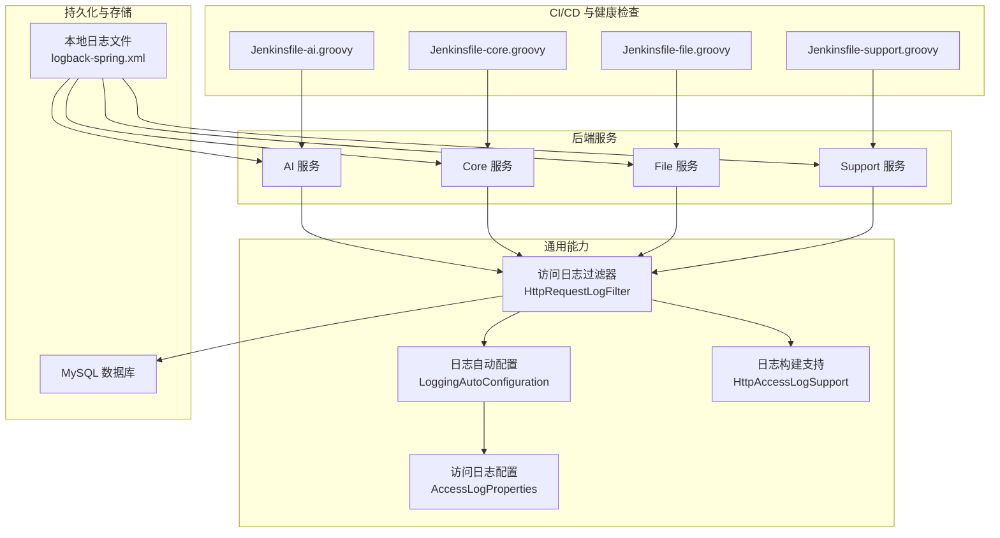
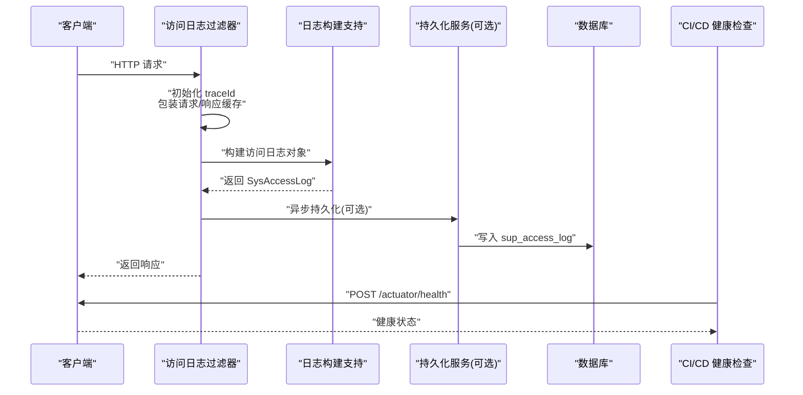
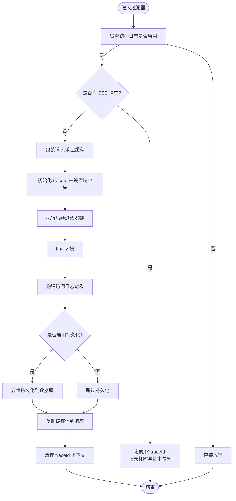
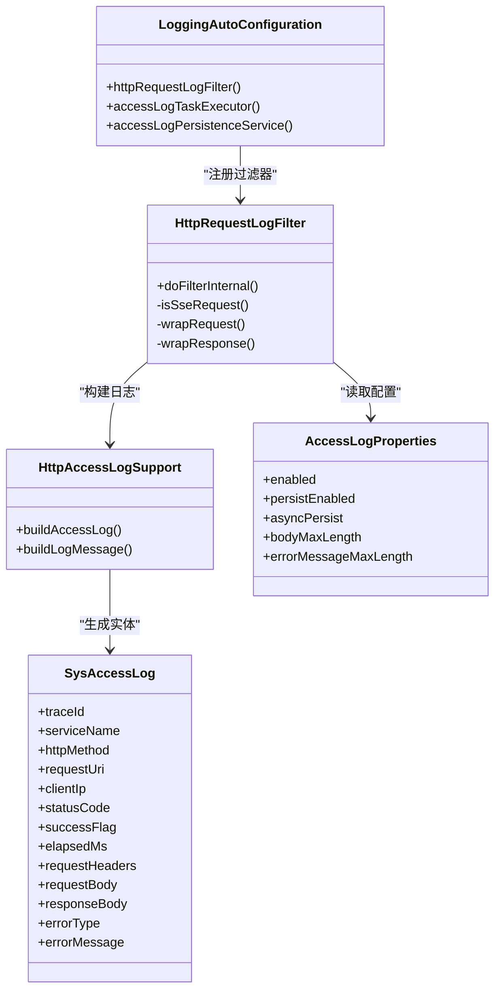

# 监控告警体系

<cite>
**本文引用的文件**
- [LoggingAutoConfiguration.java](file://ele-ai-tender-system/ele-ai-tender-common/src/main/java/com/jy/eleaitender/common/logging/LoggingAutoConfiguration.java)
- [HttpRequestLogFilter.java](file://ele-ai-tender-system/ele-ai-tender-common/src/main/java/com/jy/eleaitender/common/logging/HttpRequestLogFilter.java)
- [HttpAccessLogSupport.java](file://ele-ai-tender-system/ele-ai-tender-common/src/main/java/com/jy/eleaitender/common/logging/HttpAccessLogSupport.java)
- [AccessLogProperties.java](file://ele-ai-tender-system/ele-ai-tender-common/src/main/java/com/jy/eleaitender/common/logging/AccessLogProperties.java)
- [application.yml（core）](file://ele-ai-tender-system/ele-ai-tender-core/src/main/resources/application.yml)
- [logback-spring.xml（core）](file://ele-ai-tender-system/ele-ai-tender-core/src/main/resources/logback-spring.xml)
- [init.sql（support）](file://ele-ai-tender-system/ele-ai-tender-support/sql/init.sql)
- [Jenkinsfile-core.groovy](file://Jenkinsfile-core.groovy)
- [Jenkinsfile-ai.groovy](file://Jenkinsfile-ai.groovy)
- [Jenkinsfile-file.groovy](file://Jenkinsfile-file.groovy)
- [Jenkinsfile-support.groovy](file://Jenkinsfile-support.groovy)
</cite>

## 目录
1. [引言](#引言)
2. [项目结构](#项目结构)
3. [核心组件](#核心组件)
4. [架构总览](#架构总览)
5. [详细组件分析](#详细组件分析)
6. [依赖关系分析](#依赖关系分析)
7. [性能考量](#性能考量)
8. [故障排查指南](#故障排查指南)
9. [结论](#结论)
10. [附录](#附录)

## 引言
本文件为“招标文件AI编制系统”的监控与告警体系设计文档，覆盖应用性能监控（APM）、分布式链路追踪、日志收集与分析、健康检查、业务指标与异常检测、告警策略与通知渠道、以及故障自愈机制。文档基于仓库现有实现进行梳理，并给出可落地的扩展建议与可视化方案，帮助运维与研发快速建立稳定可靠的观测能力。

## 项目结构
本项目采用多模块微服务架构，后端包含 AI、Core、File、Support 等子系统，前端包含主业务前端与管理端前端。监控相关的基础设施主要位于通用日志组件与配置中，并通过 Spring Boot Actuator 暴露健康检查端点，结合 CI/CD 脚本完成部署后健康探测。

图表来源
- [LoggingAutoConfiguration.java:1-82](file://ele-ai-tender-system/ele-ai-tender-common/src/main/java/com/jy/eleaitender/common/logging/LoggingAutoConfiguration.java#L1-L82)
- [HttpRequestLogFilter.java:1-137](file://ele-ai-tender-system/ele-ai-tender-common/src/main/java/com/jy/eleaitender/common/logging/HttpRequestLogFilter.java#L1-L137)
- [HttpAccessLogSupport.java:36-57](file://ele-ai-tender-system/ele-ai-tender-common/src/main/java/com/jy/eleaitender/common/logging/HttpAccessLogSupport.java#L36-L57)
- [AccessLogProperties.java:1-23](file://ele-ai-tender-system/ele-ai-tender-common/src/main/java/com/jy/eleaitender/common/logging/AccessLogProperties.java#L1-L23)
- [logback-spring.xml（core）:1-88](file://ele-ai-tender-system/ele-ai-tender-core/src/main/resources/logback-spring.xml#L1-L88)
- [Jenkinsfile-core.groovy:114-131](file://Jenkinsfile-core.groovy#L114-L131)
- [Jenkinsfile-ai.groovy:114-131](file://Jenkinsfile-ai.groovy#L114-L131)
- [Jenkinsfile-file.groovy:114-131](file://Jenkinsfile-file.groovy#L114-L131)
- [Jenkinsfile-support.groovy:114-131](file://Jenkinsfile-support.groovy#L114-L131)

章节来源
- [LoggingAutoConfiguration.java:1-82](file://ele-ai-tender-system/ele-ai-tender-common/src/main/java/com/jy/eleaitender/common/logging/LoggingAutoConfiguration.java#L1-L82)
- [HttpRequestLogFilter.java:1-137](file://ele-ai-tender-system/ele-ai-tender-common/src/main/java/com/jy/eleaitender/common/logging/HttpRequestLogFilter.java#L1-L137)
- [HttpAccessLogSupport.java:36-57](file://ele-ai-tender-system/ele-ai-tender-common/src/main/java/com/jy/eleaitender/common/logging/HttpAccessLogSupport.java#L36-L57)
- [AccessLogProperties.java:1-23](file://ele-ai-tender-system/ele-ai-tender-common/src/main/java/com/jy/eleaitender/common/logging/AccessLogProperties.java#L1-L23)
- [application.yml（core）:53-58](file://ele-ai-tender-system/ele-ai-tender-core/src/main/resources/application.yml#L53-L58)
- [logback-spring.xml（core）:1-88](file://ele-ai-tender-system/ele-ai-tender-core/src/main/resources/logback-spring.xml#L1-L88)
- [init.sql（support）:237-272](file://ele-ai-tender-system/ele-ai-tender-support/sql/init.sql#L237-L272)
- [Jenkinsfile-core.groovy:114-131](file://Jenkinsfile-core.groovy#L114-L131)
- [Jenkinsfile-ai.groovy:114-131](file://Jenkinsfile-ai.groovy#L114-L131)
- [Jenkinsfile-file.groovy:114-131](file://Jenkinsfile-file.groovy#L114-L131)
- [Jenkinsfile-support.groovy:114-131](file://Jenkinsfile-support.groovy#L114-L131)

## 核心组件
- 访问日志过滤器：统一拦截 HTTP 请求，注入 traceId，记录请求/响应摘要、耗时、状态码、错误信息，并可选择异步持久化到数据库。
- 日志自动配置：注册过滤器、提供异步写入线程池、按开关控制是否启用持久化。
- 日志构建支持：封装访问日志对象构建逻辑，提取关键上下文（traceId、服务名、HTTP 方法、URI、客户端 IP、状态码、耗时、请求头/体摘要、异常信息等）。
- 访问日志配置：集中管理访问日志开关、持久化开关、异步持久化开关、请求/响应体最大长度、错误消息最大长度等。
- 日志输出：通过 logback 将日志输出到控制台与分级文件（INFO/WARN/ERROR），便于本地调试与线上采集。
- 健康检查：各服务暴露 /actuator/health 端点，由 Jenkins 在部署后进行健康探测，失败则中止发布流程。

章节来源
- [LoggingAutoConfiguration.java:1-82](file://ele-ai-tender-system/ele-ai-tender-common/src/main/java/com/jy/eleaitender/common/logging/LoggingAutoConfiguration.java#L1-L82)
- [HttpRequestLogFilter.java:1-137](file://ele-ai-tender-system/ele-ai-tender-common/src/main/java/com/jy/eleaitender/common/logging/HttpRequestLogFilter.java#L1-L137)
- [HttpAccessLogSupport.java:36-57](file://ele-ai-tender-system/ele-ai-tender-common/src/main/java/com/jy/eleaitender/common/logging/HttpAccessLogSupport.java#L36-L57)
- [AccessLogProperties.java:1-23](file://ele-ai-tender-system/ele-ai-tender-common/src/main/java/com/jy/eleaitender/common/logging/AccessLogProperties.java#L1-L23)
- [logback-spring.xml（core）:1-88](file://ele-ai-tender-system/ele-ai-tender-core/src/main/resources/logback-spring.xml#L1-L88)
- [Jenkinsfile-core.groovy:114-131](file://Jenkinsfile-core.groovy#L114-L131)
- [Jenkinsfile-ai.groovy:114-131](file://Jenkinsfile-ai.groovy#L114-L131)
- [Jenkinsfile-file.groovy:114-131](file://Jenkinsfile-file.groovy#L114-L131)
- [Jenkinsfile-support.groovy:114-131](file://Jenkinsfile-support.groovy#L114-L131)

## 架构总览
下图展示了从请求进入、日志采集、持久化到健康检查的整体流程，以及与外部系统的集成点。

图表来源
- [HttpRequestLogFilter.java:41-106](file://ele-ai-tender-system/ele-ai-tender-common/src/main/java/com/jy/eleaitender/common/logging/HttpRequestLogFilter.java#L41-L106)
- [HttpAccessLogSupport.java:36-57](file://ele-ai-tender-system/ele-ai-tender-common/src/main/java/com/jy/eleaitender/common/logging/HttpAccessLogSupport.java#L36-L57)
- [LoggingAutoConfiguration.java:66-80](file://ele-ai-tender-system/ele-ai-tender-common/src/main/java/com/jy/eleaitender/common/logging/LoggingAutoConfiguration.java#L66-L80)
- [init.sql（support）:237-272](file://ele-ai-tender-system/ele-ai-tender-support/sql/init.sql#L237-L272)
- [Jenkinsfile-core.groovy:114-131](file://Jenkinsfile-core.groovy#L114-L131)

## 详细组件分析

### 访问日志过滤器（HttpRequestLogFilter）
- 职责：统一拦截 HTTP 请求，注入 traceId，记录请求/响应摘要、耗时、状态码、错误信息；对 SSE 流式请求特殊处理以避免丢失事件。
- 关键点：
  - 使用 ContentCachingRequestWrapper/ContentCachingResponseWrapper 避免日志采集消费流导致后续读取为空。
  - 非 SSE 请求在 finally 块中构建访问日志并持久化，随后将缓存体写回响应。
  - SSE 请求不包装响应，直接透传，仅记录基础信息与耗时。
- 复杂度：O(1) 额外开销（缓存包装器与字符串摘要），注意 bodyMaxLength 限制避免大体积日志。

图表来源
- [HttpRequestLogFilter.java:41-106](file://ele-ai-tender-system/ele-ai-tender-common/src/main/java/com/jy/eleaitender/common/logging/HttpRequestLogFilter.java#L41-L106)
- [AccessLogProperties.java:11-22](file://ele-ai-tender-system/ele-ai-tender-common/src/main/java/com/jy/eleaitender/common/logging/AccessLogProperties.java#L11-L22)

章节来源
- [HttpRequestLogFilter.java:1-137](file://ele-ai-tender-system/ele-ai-tender-common/src/main/java/com/jy/eleaitender/common/logging/HttpRequestLogFilter.java#L1-L137)

### 日志自动配置（LoggingAutoConfiguration）
- 职责：注册访问日志过滤器、提供异步写入线程池、根据配置决定是否启用数据库持久化。
- 关键点：
  - 过滤器以最高优先级注册，确保最早拦截请求。
  - 当未提供持久化实现或 Mapper 缺失时，记录警告并降级为无操作持久化。
  - 默认开启持久化，可通过配置关闭。

章节来源
- [LoggingAutoConfiguration.java:1-82](file://ele-ai-tender-system/ele-ai-tender-common/src/main/java/com/jy/eleaitender/common/logging/LoggingAutoConfiguration.java#L1-L82)

### 日志构建支持（HttpAccessLogSupport）
- 职责：封装访问日志对象的构建逻辑，提取关键上下文字段。
- 关键点：
  - 填充 traceId、服务名、HTTP 方法、URI、客户端 IP、状态码、成功标志、耗时、请求头/体摘要、异常类型/信息等。
  - 支持按配置截断请求/响应体与错误消息长度，避免过大日志影响性能。

章节来源
- [HttpAccessLogSupport.java:36-57](file://ele-ai-tender-system/ele-ai-tender-common/src/main/java/com/jy/eleaitender/common/logging/HttpAccessLogSupport.java#L36-L57)

### 访问日志配置（AccessLogProperties）
- 职责：集中管理访问日志相关开关与参数。
- 关键点：
  - enabled：是否启用访问日志采集。
  - persistEnabled：是否启用持久化。
  - asyncPersist：是否异步持久化。
  - bodyMaxLength、errorMessageMaxLength：控制日志大小上限。

章节来源
- [AccessLogProperties.java:1-23](file://ele-ai-tender-system/ele-ai-tender-common/src/main/java/com/jy/eleaitender/common/logging/AccessLogProperties.java#L1-L23)

### 日志输出（logback-spring.xml）
- 职责：定义日志输出目标与滚动策略。
- 关键点：
  - 控制台输出用于开发调试。
  - INFO/WARN/ERROR 分级文件输出，按时间与大小滚动，保留历史天数。
  - 可在生产环境接入日志采集代理（如 Filebeat）将日志转发至 ELK。

章节来源
- [logback-spring.xml（core）:1-88](file://ele-ai-tender-system/ele-ai-tender-core/src/main/resources/logback-spring.xml#L1-L88)

### 健康检查（Actuator + Jenkins）
- 职责：服务暴露 /actuator/health 端点，CI/CD 在部署后轮询健康状态，失败则中止发布。
- 关键点：
  - 每个服务的 Jenkinsfile 均包含健康检查步骤，多次重试并在失败时打印详细信息。
  - 建议在 Kubernetes 或容器编排平台中也配置 Liveness/Readiness 探针，增强稳定性。

章节来源
- [Jenkinsfile-core.groovy:114-131](file://Jenkinsfile-core.groovy#L114-L131)
- [Jenkinsfile-ai.groovy:114-131](file://Jenkinsfile-ai.groovy#L114-L131)
- [Jenkinsfile-file.groovy:114-131](file://Jenkinsfile-file.groovy#L114-L131)
- [Jenkinsfile-support.groovy:114-131](file://Jenkinsfile-support.groovy#L114-L131)

## 依赖关系分析
- 组件耦合：
  - HttpRequestLogFilter 依赖 AccessLogProperties 与 HttpAccessLogSupport，选择性地依赖 AccessLogPersistenceService。
  - LoggingAutoConfiguration 负责装配过滤器与持久化实现，条件装配降低耦合。
- 外部依赖：
  - MySQL 用于持久化访问日志（sup_access_log）。
  - Logback 用于本地日志输出。
  - Jenkins 调用 /actuator/health 进行健康检查。

图表来源
- [LoggingAutoConfiguration.java:1-82](file://ele-ai-tender-system/ele-ai-tender-common/src/main/java/com/jy/eleaitender/common/logging/LoggingAutoConfiguration.java#L1-L82)
- [HttpRequestLogFilter.java:1-137](file://ele-ai-tender-system/ele-ai-tender-common/src/main/java/com/jy/eleaitender/common/logging/HttpRequestLogFilter.java#L1-L137)
- [HttpAccessLogSupport.java:36-57](file://ele-ai-tender-system/ele-ai-tender-common/src/main/java/com/jy/eleaitender/common/logging/HttpAccessLogSupport.java#L36-L57)
- [AccessLogProperties.java:1-23](file://ele-ai-tender-system/ele-ai-tender-common/src/main/java/com/jy/eleaitender/common/logging/AccessLogProperties.java#L1-L23)

章节来源
- [LoggingAutoConfiguration.java:1-82](file://ele-ai-tender-system/ele-ai-tender-common/src/main/java/com/jy/eleaitender/common/logging/LoggingAutoConfiguration.java#L1-L82)
- [HttpRequestLogFilter.java:1-137](file://ele-ai-tender-system/ele-ai-tender-common/src/main/java/com/jy/eleaitender/common/logging/HttpRequestLogFilter.java#L1-L137)
- [HttpAccessLogSupport.java:36-57](file://ele-ai-tender-system/ele-ai-tender-common/src/main/java/com/jy/eleaitender/common/logging/HttpAccessLogSupport.java#L36-L57)
- [AccessLogProperties.java:1-23](file://ele-ai-tender-system/ele-ai-tender-common/src/main/java/com/jy/eleaitender/common/logging/AccessLogProperties.java#L1-L23)

## 性能考量
- 访问日志采集：
  - 使用 ContentCaching 包装器会占用内存，需合理设置 bodyMaxLength 与 errorMessageMaxLength。
  - 异步持久化可降低请求延迟，但需关注队列积压与背压策略。
- 日志滚动与磁盘空间：
  - 按时间与大小滚动，保留历史天数，避免磁盘爆满。
  - 在生产环境建议接入日志采集代理，减少本地磁盘压力。
- 健康检查：
  - 健康检查应轻量且快速，避免引入复杂依赖导致误判。
  - 在容器编排平台增加 Liveness/Readiness 探针，提升自愈能力。

[本节为通用指导，无需具体文件引用]

## 故障排查指南
- 访问日志未持久化：
  - 检查 AccessLogProperties 的 persistEnabled 与 asyncPersist 配置。
  - 确认 SysAccessLogMapper 是否存在，若缺失将降级为无操作持久化。
- 日志过大或性能下降：
  - 调整 bodyMaxLength 与 errorMessageMaxLength，避免大体积日志。
  - 评估是否需要对特定接口禁用访问日志采集。
- 健康检查失败：
  - 查看 Jenkins 日志中的健康检查失败原因与重试次数。
  - 确认 /actuator/health 端点可达且返回正常状态。
- 日志无法定位问题：
  - 利用 traceId 关联请求全链路日志，结合 sup_access_log 表进行检索。
  - 在 logback 中按需提高日志级别，辅助定位问题。

章节来源
- [LoggingAutoConfiguration.java:66-80](file://ele-ai-tender-system/ele-ai-tender-common/src/main/java/com/jy/eleaitender/common/logging/LoggingAutoConfiguration.java#L66-L80)
- [AccessLogProperties.java:11-22](file://ele-ai-tender-system/ele-ai-tender-common/src/main/java/com/jy/eleaitender/common/logging/AccessLogProperties.java#L11-L22)
- [Jenkinsfile-core.groovy:114-131](file://Jenkinsfile-core.groovy#L114-L131)
- [logback-spring.xml（core）:1-88](file://ele-ai-tender-system/ele-ai-tender-core/src/main/resources/logback-spring.xml#L1-L88)

## 结论
当前系统在访问日志采集、持久化与健康检查方面已具备良好基础。建议在此基础上扩展 APM（Prometheus/Grafana）、分布式链路追踪（SkyWalking/Zipkin）、ELK 日志分析与告警策略，形成完整的监控告警闭环，提升系统可观测性与稳定性。

[本节为总结性内容，无需具体文件引用]

## 附录

### APM 配置建议（Spring Boot Actuator + Prometheus + Grafana）
- 暴露指标：
  - 启用 Spring Boot Actuator 的 metrics 与 prometheus 端点。
  - 自定义业务指标（如 AI 任务成功率、耗时分布、线程池使用率）。
- 数据采集：
  - 部署 Prometheus，配置 scrape_configs 抓取各服务 /actuator/prometheus。
- 可视化：
  - 在 Grafana 中导入 Spring Boot 与 JVM 面板，创建业务指标看板。
- 告警：
  - 在 Prometheus Alertmanager 中配置阈值告警（如错误率、P99 延迟、线程池饱和）。

[本节为概念性建议，无需具体文件引用]

### 分布式链路追踪（SkyWalking/Zipkin）
- 集成方式：
  - 在服务中引入 SkyWalking Agent 或 Zipkin Starter。
  - 配置采样率与上报地址。
- 链路 ID 传递：
  - 通过过滤器在请求头中传递 traceId，跨服务传播。
- 性能瓶颈分析：
  - 在 SkyWalking UI 或 Zipkin UI 中查看链路拓扑、慢查询与异常节点。

[本节为概念性建议，无需具体文件引用]

### 日志收集与分析（ELK）
- 部署：
  - 安装 Elasticsearch、Logstash、Kibana。
  - 使用 Filebeat 采集本地日志文件并转发至 ES。
- 日志格式规范：
  - 统一 JSON 格式，包含 traceId、service_name、level、message、timestamp 等字段。
- 搜索与告警：
  - 在 Kibana 中创建索引模式与仪表盘。
  - 配置 Logstash 过滤规则与告警规则（如 ERROR 级别频率阈值）。

[本节为概念性建议，无需具体文件引用]

### 健康检查与自动故障转移
- 自定义健康检查端点：
  - 扩展 Actuator HealthContributor，检查数据库、Redis、外部依赖可用性。
- 服务依赖状态监控：
  - 在健康检查中聚合依赖状态，返回整体健康结果。
- 自动故障转移：
  - 在容器编排平台配置 Liveness/Readiness 探针，配合滚动更新与副本数保障高可用。

[本节为概念性建议，无需具体文件引用]

### 业务指标监控与用户行为分析
- 业务指标：
  - 统计 AI 任务生成成功率、平均耗时、模板使用量、评审项通过率等。
- 用户行为分析：
  - 基于访问日志与业务日志，分析用户路径、热点页面、功能使用率。
- 异常检测算法：
  - 基于时序数据（如错误率、延迟）使用滑动窗口与阈值策略进行异常检测。
  - 可引入机器学习模型进行动态基线检测。

[本节为概念性建议，无需具体文件引用]

### 告警策略与通知渠道
- 告警策略：
  - 定义多级告警（警告、严重、致命），按业务影响面分级。
- 通知渠道：
  - 集成邮件、企业微信、钉钉、短信等通知渠道。
- 故障自愈：
  - 针对常见故障（如线程池饱和、连接池耗尽）实现自动扩容或重启策略。

[本节为概念性建议，无需具体文件引用]