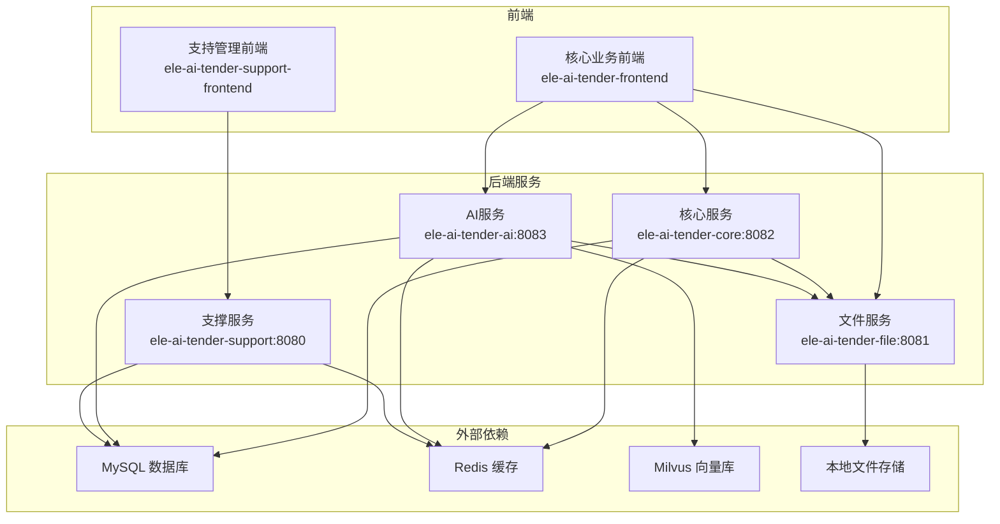
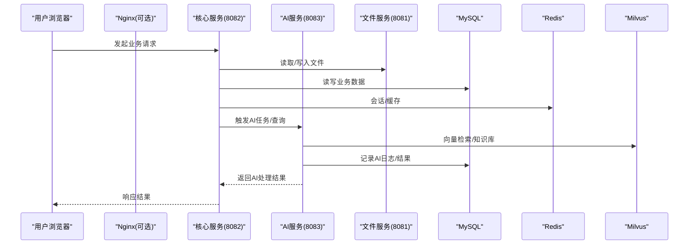
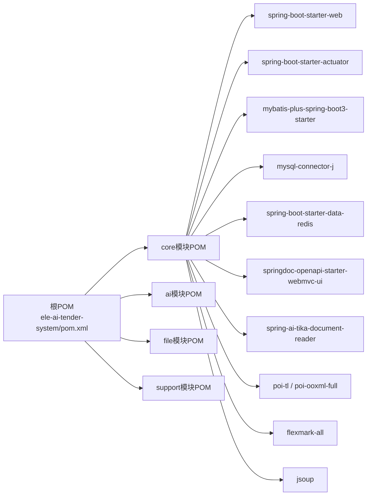
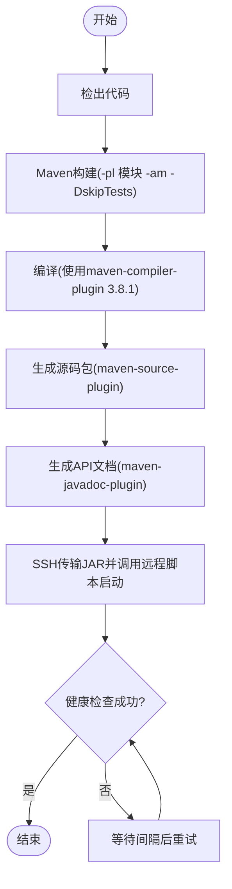

# 部署运维

<cite>
**本文引用的文件**   
- [ele-ai-tender-system/pom.xml](file://ele-ai-tender-system/pom.xml)
- [ele-ai-tender-core/pom.xml](file://ele-ai-tender-system/ele-ai-tender-core/pom.xml)
- [ele-ai-tender-core/application.yml](file://ele-ai-tender-system/ele-ai-tender-core/src/main/resources/application.yml)
- [ele-ai-tender-ai/application.yml](file://ele-ai-tender-system/ele-ai-tender-ai/src/main/resources/application.yml)
- [ele-ai-tender-file/application.yml](file://ele-ai-tender-system/ele-ai-tender-file/src/main/resources/application.yml)
- [ele-ai-tender-support/application.yml](file://ele-ai-tender-system/ele-ai-tender-support/src/main/resources/application.yml)
- [Jenkinsfile-ai.groovy](file://Jenkinsfile-ai.groovy)
- [Jenkinsfile-core.groovy](file://Jenkinsfile-core.groovy)
- [Jenkinsfile-file.groovy](file://Jenkinsfile-file.groovy)
- [Jenkinsfile-support.groovy](file://Jenkinsfile-support.groovy)
- [Jenkinsfile-core-web.groovy](file://Jenkinsfile-core-web.groovy)
- [Jenkinsfile-support-web.groovy](file://Jenkinsfile-support-web.groovy)
- [ele-ai-tender-core OpenAPI](file://docs/guides/ele-ai-tender-core.yml)
- [ele-ai-tender-ai OpenAPI](file://docs/guides/ele-ai-tender-ai.yml)
- [ele-ai-tender-file OpenAPI](file://docs/guides/ele-ai-tender-file.yml)
- [ele-ai-tender-support OpenAPI](file://docs/guides/ele-ai-tender-support.yml)
</cite>

## 更新摘要
**变更内容**   
- Maven构建配置升级：maven-compiler-plugin从3.5.1升级到3.8.1
- 新增maven-source-plugin和maven-javadoc-plugin支持
- 增强Nexus仓库发布能力，支持starter包发布
- 优化Java编译性能和兼容性

## 目录
1. [简介](#简介)
2. [项目结构](#项目结构)
3. [核心组件](#核心组件)
4. [架构总览](#架构总览)
5. [详细组件分析](#详细组件分析)
6. [依赖分析](#依赖分析)
7. [性能与容量规划](#性能与容量规划)
8. [CI/CD流水线](#cicd流水线)
9. [生产环境部署指南](#生产环境部署指南)
10. [监控与告警体系](#监控与告警体系)
11. [安全加固](#安全加固)
12. [故障排查与应急预案](#故障排查与应急预案)
13. [结论](#结论)

## 简介
本运维文档面向"招标文件AI编制系统"的生产级部署与运维，覆盖容器化微服务编排、网络与存储、服务发现、CI/CD流水线、负载均衡、数据库与缓存集群、消息队列、监控告警、健康检查与自愈、容量规划、性能调优、安全加固及灾难恢复等主题。文档基于仓库中现有配置与流水线脚本进行说明，并给出可落地的最佳实践建议。

**更新** 本次更新重点关注Maven构建配置的升级，包括编译器插件版本提升和新插件的引入，以支持更高效的构建流程和更好的Nexus仓库集成。

## 项目结构
后端采用多模块Maven工程，包含支撑服务、文件服务、核心业务服务与AI服务；前端为两个独立Web应用（核心业务前端与支持管理前端）。各服务均通过Spring Boot构建，暴露REST API，并通过OpenAPI规范定义接口。

章节来源
- [ele-ai-tender-system/pom.xml:1-260](file://ele-ai-tender-system/pom.xml#L1-L260)

## 核心组件
- 支撑服务（Support）：提供认证、菜单、消息、模型配置、外部系统集成等能力，默认端口8080。
- 文件服务（File）：提供统一上传、下载、删除与Esign对接，默认端口8081，支持大文件上传与本地文件存储。
- 核心服务（Core）：项目管理、需求与评审项、检测流程、文档集成与导出等，默认端口8082。
- AI服务（AI）：对话、优化、建议、知识文档管理与匹配，默认端口8083，连接外部LLM与Milvus向量库。

关键配置要点
- 所有服务通过环境变量注入数据库、Redis、JWT、内部文件服务地址等敏感或差异化配置。
- Core/AI/Support均引入MyBatis Plus与MySQL驱动；AI额外引入Milvus客户端与Spring AI相关依赖。
- File服务开启multipart大小限制，并配置本地文件存储路径与允许类型。

章节来源
- [ele-ai-tender-core/application.yml:1-59](file://ele-ai-tender-system/ele-ai-tender-core/src/main/resources/application.yml#L1-L59)
- [ele-ai-tender-ai/application.yml:1-72](file://ele-ai-tender-system/ele-ai-tender-ai/src/main/resources/application.yml#L1-L72)
- [ele-ai-tender-file/application.yml:1-63](file://ele-ai-tender-system/ele-ai-tender-file/src/main/resources/application.yml#L1-L63)
- [ele-ai-tender-support/application.yml:1-68](file://ele-ai-tender-system/ele-ai-tender-support/src/main/resources/application.yml#L1-L68)

## 架构总览
系统采用前后端分离与微服务分层：前端静态资源由Nginx托管，后端服务以Spring Boot单体进程运行（当前未使用Docker/K8s），通过HTTP调用协作。对外暴露的API通过OpenAPI文档定义，便于网关与测试验证。

## 详细组件分析

### 支撑服务（Support）
职责
- 认证登录、短信验证码、用户信息、菜单树、消息中心、模型配置与路由、外部系统集成与签名校验等。

关键配置
- 端口8080，启用Swagger，JWT密钥与过期时间，内部文件服务URL，短信网关参数。

章节来源
- [ele-ai-tender-support/application.yml:1-68](file://ele-ai-tender-system/ele-ai-tender-support/src/main/resources/application.yml#L1-L68)

### 文件服务（File）
职责
- 统一文件上传、下载、删除、Esign对接，支持大文件与多种格式。

关键配置
- 端口8081，最大请求与文件大小500MB，本地存储路径与允许类型白名单。

章节来源
- [ele-ai-tender-file/application.yml:1-63](file://ele-ai-tender-system/ele-ai-tender-file/src/main/resources/application.yml#L1-L63)

### 核心服务（Core）
职责
- 项目、需求、评审项、检测流程、文档集成与导出、版本管理等。

关键配置
- 端口8082，连接MySQL与Redis，表前缀ai_，逻辑删除字段isDelete，内部文件服务URL。

章节来源
- [ele-ai-tender-core/application.yml:1-59](file://ele-ai-tender-system/ele-ai-tender-core/src/main/resources/application.yml#L1-L59)

### AI服务（AI）
职责
- 对话、文本优化、建议、知识文档管理、历史需求匹配，连接外部LLM与Milvus向量库。

关键配置
- 端口8083，连接MySQL与Redis，Milvus主机/端口/库名，外部LLM Base URL与API Key，内部文件服务URL。

章节来源
- [ele-ai-tender-ai/application.yml:1-72](file://ele-ai-tender-system/ele-ai-tender-ai/src/main/resources/application.yml#L1-L72)

## 依赖分析
- 构建与打包：根POM统一管理版本与插件，子模块通过spring-boot-maven-plugin生成可执行JAR（classifier=exec）。
- 运行时依赖：Spring Boot Web、Actuator、MyBatis Plus、MySQL、Redis、SpringDoc OpenAPI、Jackson/Lombok/Hutool等。
- AI扩展：Spring AI、Milvus SDK、Tika文档解析、POI-TL、Flexmark、Jsoup等。

**更新** Maven构建配置已升级，主要变更包括：
- maven-compiler-plugin从3.5.1升级到3.8.1，提供更好的Java编译性能和兼容性
- 新增maven-source-plugin用于生成源码包，支持源码发布到Nexus仓库
- 新增maven-javadoc-plugin用于生成API文档，便于开发者查阅接口说明
- 这些变更增强了项目的构建效率和可维护性

章节来源
- [ele-ai-tender-system/pom.xml:1-260](file://ele-ai-tender-system/pom.xml#L1-L260)

## 性能与容量规划
- JVM内存
  - 支撑服务：默认堆较小，建议根据并发与功能适当上调。
  - 文件服务：大文件处理需关注堆与元空间，结合GC策略调整。
  - 核心服务：文档生成与检测较重，建议中等以上堆。
  - AI服务：涉及外部LLM与向量检索，建议较大堆与合理超时。
- 线程池与超时
  - 对AI调用、文件IO、数据库连接设置合理的超时与重试上限，避免雪崩。
- 数据库
  - 索引与分页优化，慢查询治理，读写分离与分库分表按需演进。
- Redis
  - 热点Key与序列化体积控制，合理设置过期与淘汰策略。
- 文件存储
  - 本地磁盘容量与IOPS评估，必要时迁移至对象存储（S3/OSS）以提升可扩展性。
- 外部依赖
  - Milvus与LLM服务的QPS与延迟指标纳入容量规划，预留弹性扩容能力。

## CI/CD流水线
当前流水线基于Jenkins Groovy脚本，按服务维度分别定义，流程包括：检出、构建、部署、健康检查。

**更新** 随着Maven构建配置的升级，CI/CD流水线需要相应调整以充分利用新的构建特性：

- 构建阶段
  - 在ele-ai-tender-system目录下执行Maven构建，仅构建目标模块及其上游依赖，跳过测试。
  - 新的maven-compiler-plugin 3.8.1提供更快的编译速度和更好的错误诊断。
  - maven-source-plugin自动生成源码包，便于调试和问题排查。
  - maven-javadoc-plugin生成完整的API文档，支持在线查阅。
- 部署阶段
  - 通过SSH将JAR包传输到目标服务器临时目录，并调用远程脚本启动/重启服务。
- 健康检查
  - 循环调用/actuator/health直至成功或达到最大尝试次数。

章节来源
- [Jenkinsfile-core.groovy:1-132](file://Jenkinsfile-core.groovy#L1-L132)
- [Jenkinsfile-ai.groovy:1-132](file://Jenkinsfile-ai.groovy#L1-L132)
- [Jenkinsfile-file.groovy:1-132](file://Jenkinsfile-file.groovy#L1-L132)
- [Jenkinsfile-support.groovy:1-132](file://Jenkinsfile-support.groovy#L1-L132)

## 生产环境部署指南

### 容器化与编排（推荐方案）
- 镜像构建
  - 基于JDK21基础镜像，将每个服务打包为独立镜像，最小化镜像体积。
  - 利用新的Maven构建配置优化镜像层缓存，加快构建速度。
- 编排工具
  - Kubernetes：使用Deployment+Service+Ingress实现服务编排、网络与服务发现；ConfigMap/Secret管理配置；PersistentVolume挂载文件存储。
  - Docker Compose：适用于单机或小规模集群快速部署。
- 网络与服务发现
  - 通过Kubernetes Service或Consul/Nacos提供服务注册与发现；Ingress统一入口与TLS终止。
- 存储卷挂载
  - 文件服务本地存储映射为持久卷，确保数据持久化与备份。
- 配置管理
  - 使用ConfigMap注入非敏感配置，Secret管理敏感信息（数据库密码、JWT密钥、外部API Key）。

### 负载均衡
- 入口层
  - Nginx/HAProxy作为反向代理，按路径或域名分发到不同服务。
- 应用层
  - 同一服务多实例，配合负载均衡器轮询或加权策略。
- 健康检查
  - 利用/actuator/health进行主动探测，剔除异常节点。

### 数据库集群搭建
- MySQL主从复制与读写分离，或使用云数据库高可用版。
- 连接池参数（最大连接数、空闲回收、超时）按负载调优。
- 定期备份与演练恢复。

### Redis缓存集群
- 哨兵模式或Cluster模式，保证高可用。
- 合理设置maxmemory与淘汰策略，避免OOM。
- 跨机房容灾与数据一致性策略。

### 消息队列部署
- 当前未见显式MQ依赖，若后续引入异步解耦（如检测任务、通知），建议使用Kafka/RabbitMQ。
- 分区与副本策略、消费者组与幂等设计。

## 监控与告警体系
- 应用性能监控
  - 接入Prometheus+Grafana采集JVM、HTTP、DB、Redis等指标。
- 日志收集分析
  - 集中式日志（ELK/EFK），统一traceId贯穿链路。
- 健康检查与自愈
  - 利用/actuator/health与健康探针，结合编排平台自动重启或滚动更新。
- 告警规则
  - 错误率、延迟、资源使用阈值告警，联动通知渠道。

## 安全加固
- 传输安全
  - 全站HTTPS，证书集中管理，HSTS启用。
- 身份与鉴权
  - JWT密钥强随机且定期轮换，外部系统签名校验，最小权限原则。
- 输入校验与防护
  - 严格校验与过滤，防注入、XSS、CSRF。
- 敏感信息保护
  - 配置文件与密钥通过Secret管理，禁止硬编码。
- 审计与合规
  - 访问日志、操作日志留存与审计。

## 故障排查与应急预案

### 常见问题定位
- 服务无法启动
  - 检查端口占用、数据库/Redis连通性、JWT与外部服务配置。
- 健康检查失败
  - 查看/actuator/health输出与应用日志，确认依赖是否就绪。
- 文件上传失败
  - 核对multipart大小限制、磁盘空间与权限。
- AI调用超时
  - 检查外部LLM可达性与配额，调整超时与重试策略。

**更新** 针对Maven构建配置升级后的问题排查：
- 编译错误：检查Java版本兼容性和依赖冲突
- 源码包生成失败：确认maven-source-plugin配置正确
- API文档生成问题：检查Javadoc注释完整性
- Nexus仓库发布失败：验证仓库权限和配置

章节来源
- [Jenkinsfile-core.groovy:97-131](file://Jenkinsfile-core.groovy#L97-L131)
- [Jenkinsfile-ai.groovy:97-131](file://Jenkinsfile-ai.groovy#L97-L131)
- [Jenkinsfile-file.groovy:97-131](file://Jenkinsfile-file.groovy#L97-L131)
- [Jenkinsfile-support.groovy:97-131](file://Jenkinsfile-support.groovy#L97-L131)

### 回滚与应急
- 灰度发布与蓝绿切换，保留上一版本镜像/JAR以便快速回滚。
- 数据库变更遵循可逆脚本与双写过渡策略。
- 重大故障时优先降级AI与非核心功能，保障核心业务流程。

## 结论
本项目已具备清晰的微服务边界与API契约，当前部署以Jenkins驱动的JAR直发为主。随着Maven构建配置的升级，项目的构建效率和维护性得到显著提升。建议逐步向容器化与编排平台迁移，完善监控告警与安全加固，形成稳定、可观测、可演进的运维体系。

**更新总结** Maven构建配置的升级为项目带来了以下改进：
- 更快的编译速度和更好的错误诊断
- 自动化的源码包和API文档生成
- 增强的Nexus仓库集成能力
- 更好的Java版本兼容性和性能优化

这些改进为后续的容器化部署和持续集成提供了更好的基础。