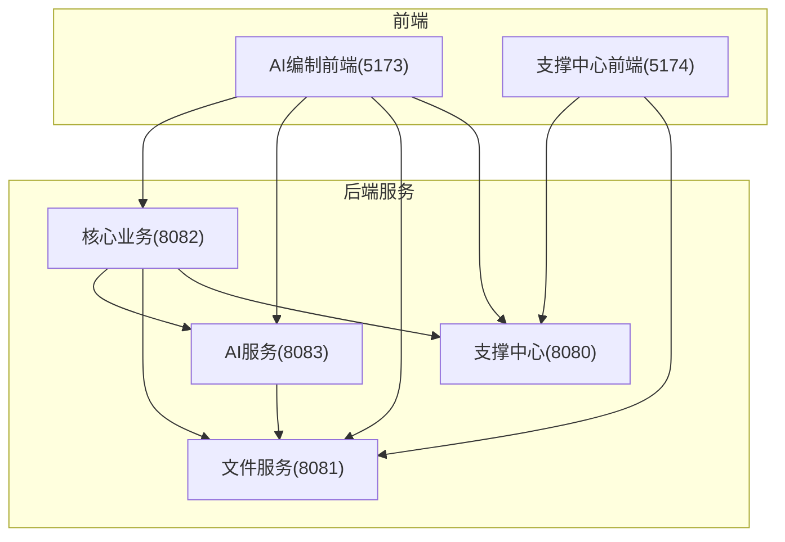
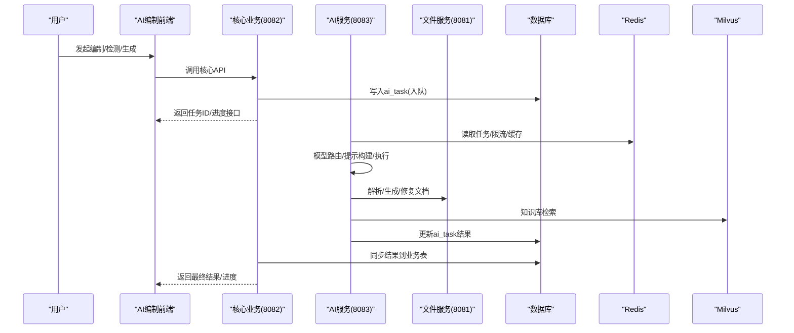
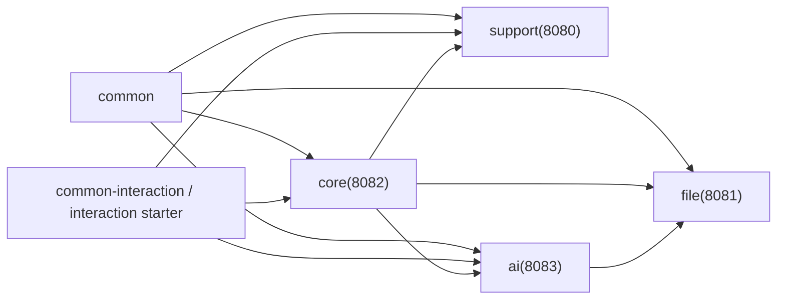

# 项目概述

<cite>
**本文引用的文件列表**
- [README.md](file://README.md)
- [PROJECT_SPEC_FINAL.md](file://docs/rules/PROJECT_SPEC_FINAL.md)
- [CORE_MODULE_SPEC.md](file://docs/rules/CORE_MODULE_SPEC.md)
- [AI_MODULE_SPEC.md](file://docs/rules/AI_MODULE_SPEC.md)
- [SUPPORT_SYSTEM_SPEC.md](file://docs/rules/SUPPORT_SYSTEM_SPEC.md)
- [FILE_SERVICE_SPEC.md](file://docs/rules/FILE_SERVICE_SPEC.md)
- [pom.xml](file://ele-ai-tender-system/pom.xml)
- [CoreApplication.java](file://ele-ai-tender-system/ele-ai-tender-core/src/main/java/com/jy/eleaitender/core/CoreApplication.java)
- [AiApplication.java](file://ele-ai-tender-system/ele-ai-tender-ai/src/main/java/com/jy/eleaitender/ai/AiApplication.java)
- [SupportApplication.java](file://ele-ai-tender-system/ele-ai-tender-support/src/main/java/com/jy/eleaitender/support/SupportApplication.java)
- [FileApplication.java](file://ele-ai-tender-system/ele-ai-tender-file/src/main/java/com/jy/eleaitender/file/FileApplication.java)
</cite>

## 目录
1. [引言](#引言)
2. [项目结构](#项目结构)
3. [核心组件](#核心组件)
4. [架构总览](#架构总览)
5. [详细组件分析](#详细组件分析)
6. [依赖关系分析](#依赖关系分析)
7. [性能与可扩展性](#性能与可扩展性)
8. [故障排查指南](#故障排查指南)
9. [结论](#结论)
10. [附录：技术栈概览](#附录技术栈概览)

## 引言
本项目为“招标文件AI编制系统”，面向招标采购场景，提供项目管理、业务需求编制、智能检测、文档生成、知识库检索与模型路由等能力。系统采用前后端分离与微服务架构，支持独立部署、嵌入第三方平台与一体机模式。通过AI增强（对话式助手、内容生成、合规性检测）显著提升招标文件编制效率与质量。

## 项目结构
仓库包含两个前端应用与一个后端多模块工程：
- 前端
  - ele-ai-tender-frontend：AI编制业务前端（端口 5173）
  - ele-ai-tender-support-frontend：支撑中心管理后台（端口 5174）
- 后端（Maven 多模块）
  - ele-ai-tender-common：公共实体、工具类、异常、统一响应
  - ele-ai-tender-common-interaction：交互协议 DTO/SPI/路径常量（JDK8兼容）
  - ele-ai-tender-interaction：业务系统接入 Starter（JDK8兼容）
  - ele-ai-tender-support（8080）：认证、用户/角色/菜单、模板、知识库配置、模型配置与路由、系统参数、政策文件、消息、统计、日志、版本、外部对接
  - ele-ai-tender-file（8081）：文件上传/下载/查询/删除；文档生成引擎（Markdown→Word、Word模板→Word）
  - ele-ai-tender-core（8082）：项目管理、业务需求编制、评审项管理、文档集成、检测管理、AI任务管理、反馈、消息、用户政策文件、模板快照
  - ele-ai-tender-ai（8083）：AI助手、知识库检索、文档匹配、智能检测、模型路由

图表来源
- [README.md:15-36](file://README.md#L15-L36)
- [pom.xml:15-23](file://ele-ai-tender-system/pom.xml#L15-L23)

章节来源
- [README.md:1-167](file://README.md#L1-L167)
- [PROJECT_SPEC_FINAL.md:15-28](file://docs/rules/PROJECT_SPEC_FINAL.md#L15-L28)
- [pom.xml:15-23](file://ele-ai-tender-system/pom.xml#L15-L23)

## 核心组件
- 支撑中心（8080）
  - 认证授权（JWT + Redis）、RBAC权限、模板与知识库配置、模型配置与路由、系统参数、政策文件、消息中心、统计分析、访问/操作日志、版本管理、外部系统对接
- 文件服务（8081）
  - 通用文件能力（上传/下载/查询/删除），文档生成引擎（Markdown→Word、Word模板渲染、文本提取、修复）
- 核心业务（8082）
  - 项目管理（状态/阶段流转、版本快照）、业务需求编制（创建/编辑/导出）、评审项管理（三级树）、文档集成（Markdown→Word）、智能检测（提交/进度/报告/建议处理）、AI任务管理、AI内容反馈、用户消息、用户政策文件、模板快照
- AI服务（8083）
  - AI助手（对话/优化/SSE流式）、知识库（文档上传/向量化/Milvus检索）、文档匹配、智能检测（敏感词/错别字/政策审查/格式规范）、模型路由（本地/云端/私有化）

章节来源
- [README.md:44-89](file://README.md#L44-L89)
- [SUPPORT_SYSTEM_SPEC.md:1-258](file://docs/rules/SUPPORT_SYSTEM_SPEC.md#L1-L258)
- [FILE_SERVICE_SPEC.md:1-153](file://docs/rules/FILE_SERVICE_SPEC.md#L1-L153)
- [CORE_MODULE_SPEC.md:1-358](file://docs/rules/CORE_MODULE_SPEC.md#L1-L358)
- [AI_MODULE_SPEC.md:1-211](file://docs/rules/AI_MODULE_SPEC.md#L1-L211)

## 架构总览
系统以“编排+能力”解耦为核心思想：core负责业务流程编排与数据持久化，ai提供AI能力并通过异步任务表进行解耦协作；file提供文件与文档生成能力；support提供系统与运营管理能力。

图表来源
- [CORE_MODULE_SPEC.md:155-214](file://docs/rules/CORE_MODULE_SPEC.md#L155-L214)
- [AI_MODULE_SPEC.md:49-108](file://docs/rules/AI_MODULE_SPEC.md#L49-L108)
- [FILE_SERVICE_SPEC.md:18-93](file://docs/rules/FILE_SERVICE_SPEC.md#L18-L93)

## 详细组件分析

### 支撑中心（8080）
- 职责边界
  - 系统级配置与治理：用户/角色/菜单、模板、知识库配置、模型配置与路由、系统参数、政策文件、消息、统计、日志、版本、外部系统对接
- 关键约束
  - 双轨认证（内部/外部）、RBAC、模板按类别+类型双维度配置、模型配置驱动运行时路由
- 典型流程
  - 登录鉴权 → 获取菜单/权限 → 访问受保护资源
  - 模板创建/更新时触发文件服务结构解析并保存结构定义
  - 模型配置变更由AI服务缓存刷新后生效

章节来源
- [SUPPORT_SYSTEM_SPEC.md:1-258](file://docs/rules/SUPPORT_SYSTEM_SPEC.md#L1-L258)
- [PROJECT_SPEC_FINAL.md:40-68](file://docs/rules/PROJECT_SPEC_FINAL.md#L40-L68)

### 文件服务（8081）
- 职责边界
  - 文件上传/下载/查询/删除；文档生成引擎（Markdown→Word、Word模板→Word、文本提取、修复）
- 关键约束
  - 原生poi-tl引擎、占位符语法、两阶段渲染、表格编程生成、修订标记预处理、locationRef精准定位
- 典型流程
  - 上传文件 → 计算SHA-256 → 存储元信息
  - 文档生成：组装数据 → poi-tl渲染 → 表格替换 → 输出.docx
  - 文本提取：段落级segments + fullText，供检测位置匹配

章节来源
- [FILE_SERVICE_SPEC.md:1-153](file://docs/rules/FILE_SERVICE_SPEC.md#L1-L153)

### 核心业务（8082）
- 职责边界
  - 业务编排：项目/需求/评审项/检测/文档集成/AI任务/反馈/消息/用户政策文件/模板快照
- 关键约束
  - 项目状态与编制阶段严格流转；AI任务通过ai_task异步解耦；评审项三级结构与review_config控制；Token用量与上限策略
- 典型流程
  - 创建项目 → 进入需求阶段 → 触发AI生成需求 → 设置评审项 → 文档集成 → 提交检测 → 接受/拒绝建议 → 发布/归档

章节来源
- [CORE_MODULE_SPEC.md:1-358](file://docs/rules/CORE_MODULE_SPEC.md#L1-L358)

### AI服务（8083）
- 职责边界
  - AI能力提供：助手对话、知识库检索、文档匹配、智能检测、模型路由
- 关键约束
  - AiTaskProcessor轮询执行；三步式需求生成（大纲→分章→审查修订）；检测并行编排；线程池动态扩缩容与用户并发控制；Prompt体系与JSON修复
- 典型流程
  - 接收任务 → 模型路由 → 构建Prompt → 调用大模型 → 解析结果 → 落库/回调

章节来源
- [AI_MODULE_SPEC.md:1-211](file://docs/rules/AI_MODULE_SPEC.md#L1-L211)

### 启动入口与服务发现
- 各服务均基于Spring Boot启动，启用定时任务扫描，MapperScan与ComponentScan限定包范围
- 启动类示例
  - CoreApplication、AiApplication、SupportApplication、FileApplication

章节来源
- [CoreApplication.java:1-24](file://ele-ai-tender-system/ele-ai-tender-core/src/main/java/com/jy/eleaitender/core/CoreApplication.java#L1-L24)
- [AiApplication.java:1-26](file://ele-ai-tender-system/ele-ai-tender-ai/src/main/java/com/jy/eleaitender/ai/AiApplication.java#L1-L26)
- [SupportApplication.java:1-21](file://ele-ai-tender-system/ele-ai-tender-support/src/main/java/com/jy/eleaitender/support/SupportApplication.java#L1-L21)
- [FileApplication.java:1-18](file://ele-ai-tender-system/ele-ai-tender-file/src/main/java/com/jy/eleaitender/file/FileApplication.java#L1-L18)

## 依赖关系分析
- 模块划分原则
  - 非交互公共类型 → common
  - 交互协议DTO/SPI/路径常量 → common-interaction（单源，禁止复制）
  - controller/facade边界通过mapper显式转换，service层不直接透传协议DTO
  - core负责编排，ai负责能力，通过ai_task表异步解耦，无直接HTTP耦合
- 外部依赖
  - Spring AI、Milvus、Apache Tika、poi-tl、flexmark、JSoup、MyBatis-Plus、MySQL、Redisson、JWT等

图表来源
- [PROJECT_SPEC_FINAL.md:40-68](file://docs/rules/PROJECT_SPEC_FINAL.md#L40-L68)
- [pom.xml:68-124](file://ele-ai-tender-system/pom.xml#L68-L124)

章节来源
- [PROJECT_SPEC_FINAL.md:40-68](file://docs/rules/PROJECT_SPEC_FINAL.md#L40-L68)
- [pom.xml:68-124](file://ele-ai-tender-system/pom.xml#L68-L124)

## 性能与可扩展性
- 异步解耦：core写入ai_task，ai轮询执行，core再同步结果，避免长连接阻塞
- 线程池与并发控制：DynamicThreadPoolManager动态调整线程池参数；UserConcurrencyManager实现全局+用户级并发限制
- 向量检索：Milvus Top-K检索，结合分块大小与Embedding策略提升召回质量
- 文档生成：两阶段渲染与表格编程生成规避poi-tl循环标签问题，提高稳定性
- Token与限流：按模型/用户维度统计与上限控制，保障成本与稳定性

章节来源
- [AI_MODULE_SPEC.md:143-161](file://docs/rules/AI_MODULE_SPEC.md#L143-L161)
- [CORE_MODULE_SPEC.md:284-293](file://docs/rules/CORE_MODULE_SPEC.md#L284-L293)
- [FILE_SERVICE_SPEC.md:33-72](file://docs/rules/FILE_SERVICE_SPEC.md#L33-L72)

## 故障排查指南
- AI任务卡在PROCESSING
  - 检查ai_task.started_at是否超时；查看AiTaskProcessor日志；必要时跳过任务
- 模型调用失败
  - 核对sup_model_config与sup_model_route_rule配置；确认api_key与endpoint
- 知识库检索不准
  - 检查ai_knowledge_document.vector_ids是否完成向量化
- 线程池任务堆积
  - 检查sup_sys_parameter线程池参数与DynamicThreadPoolManager日志
- 用户并发超限
  - 检查UserConcurrencyManager的Semaphore许可数与活跃计数
- 文档生成异常
  - 检查模板修订标记是否已接受；确认poi-tl版本≥1.12.2；校验占位符语法与数据结构
- 检测修复替换错误位置
  - 检查FixReplacement.locationRef是否为空；elementIndex是否越界；是否命中降级全文档匹配

章节来源
- [AI_MODULE_SPEC.md:189-197](file://docs/rules/AI_MODULE_SPEC.md#L189-L197)
- [FILE_SERVICE_SPEC.md:139-147](file://docs/rules/FILE_SERVICE_SPEC.md#L139-L147)
- [CORE_MODULE_SPEC.md:342-349](file://docs/rules/CORE_MODULE_SPEC.md#L342-L349)

## 结论
本系统以“编排+能力”的微服务架构，将核心业务与AI能力解耦，借助异步任务与统一的文件/文档生成能力，实现了从需求编制、评审项设计到文档集成与智能检测的全链路自动化与智能化。通过严格的模块边界、规范的接口契约与完善的排障指引，开发者可快速理解全貌并高效扩展。

## 附录：技术栈概览
- 后端基线
  - JDK 21、Spring Boot 3.2.2、MyBatis-Plus 3.5.5、MySQL 8.4.0、Redis、Redisson
- AI相关
  - Spring AI 1.1.0、Milvus 2.3.3、Apache Tika 2.9.0、poi-tl 1.12.2、flexmark-java 0.64.0、JSoup 1.17.2
- 前端
  - Vue 3 + TypeScript + Vite + Element Plus + Pinia

章节来源
- [README.md:9-11](file://README.md#L9-L11)
- [PROJECT_SPEC_FINAL.md:29-38](file://docs/rules/PROJECT_SPEC_FINAL.md#L29-L38)
- [pom.xml:25-66](file://ele-ai-tender-system/pom.xml#L25-L66)