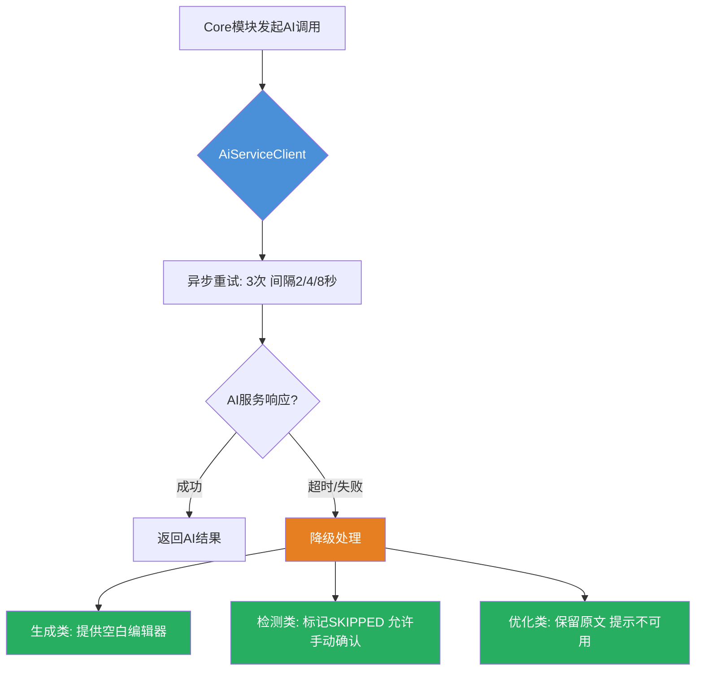
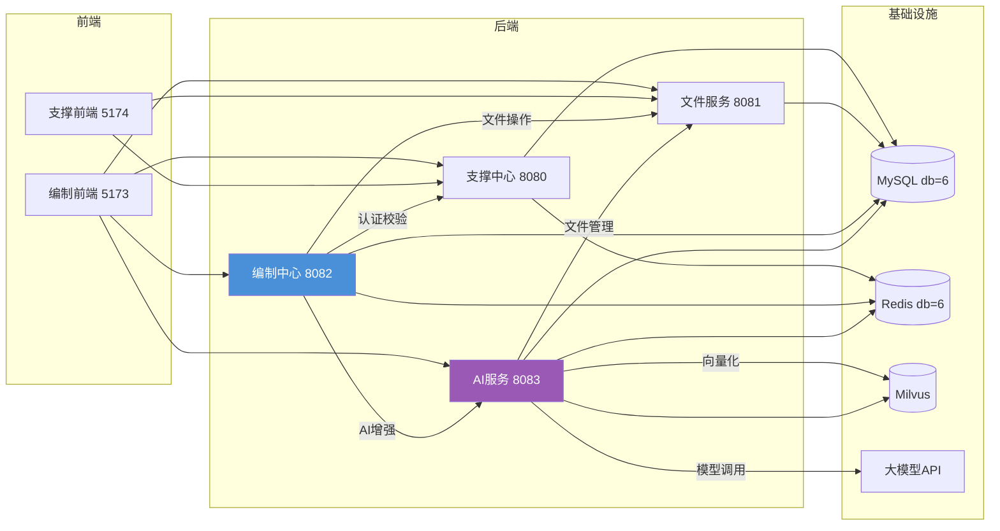

# 招标文件AI编制工具平台 - 开发计划

## Context

招标文件AI编制工具平台已完成项目初始化（阶段一），7个Maven模块框架搭建完毕，数据库表结构定义完成，基础认证/权限/文件服务已实现。当前需要推进阶段二：业务功能开发，将框架代码转化为可运行的完整系统。

**核心原则**：AI服务为编制中心提供增强能力，AI不可用时编制中心业务流程不受影响（异步重试+降级为手动模式）。

**开发优先级**：支撑中心 → 编制中心 → AI能力

---

## 阶段一：支撑中心完善（Priority 1）

> 目标：补齐支撑中心缺失的业务功能，支撑中心前端同步开发

[阶段一：支撑中心完善-业务开发计划.md](阶段一：支撑中心完善-业务开发计划.md)

---

## 阶段二：编制中心核心业务（Priority 2）

> 目标：实现编制中心的5阶段文件编制流程、业务需求AI生成流、文档导出

[阶段二：编制中心核心-业务开发计划.md](阶段二：编制中心核心-业务开发计划.md)

---

## 阶段三：AI能力实现（Priority 3）

> 目标：实现AI服务的核心能力，通过Spring AI接入大模型，实现知识库检索和智能检测

[阶段三：AI能力实现 - 业务开发计划.md](阶段三：AI能力实现-业务开发计划.md)

---

## 阶段四：集成联调与优化

> 目标：全链路联调、性能优化、用户体验打磨

### 4.1 服务间调用集成

**改造文件**：
| 文件 | 说明 |
|------|------|
| `AiServiceClient` (core模块) | 完善AI服务调用客户端（重试、超时、降级） |
| `SupportServiceClient` (core模块) | 支撑中心认证校验调用 |
| `FileServiceClient` (core/ai模块) | 文件服务调用 |

**降级策略实现**：
```
调用AI服务 → 超时5秒 → 重试3次(间隔2/4/8秒) → 仍失败 → 降级为手动模式
调用文件服务 → 超时10秒 → 重试2次 → 失败 → 返回错误提示
调用支撑中心 → 超时3秒 → 重试2次 → 失败 → 返回认证失败
```

### 4.2 前端SSE流式响应处理

**新建工具**：
| 文件 | 说明 |
|------|------|
| `src/utils/sse.ts` | SSE客户端封装（支持重连、降级提示） |
| `src/composables/useAiStream.ts` | AI流式响应组合式函数 |

**SSE处理逻辑**：
```
建立EventSource连接 → 接收流式数据 → 实时渲染到编辑器
→ 连接异常 → 显示重试提示 → 自动重连3次
→ 重连失败 → 提示AI服务不可用，切换手动模式
```

### 4.3 自动保存机制

**实现方式**：
- 前端：每2分钟自动调用保存接口
- 后端：自动保存内容到 `autoSaveContent` 字段（不覆盖正式内容）
- 恢复：页面加载时检查是否有未保存的自动保存内容，提示恢复

### 4.4 文档导出完善

**Word模板设计**：
- 创建标准招标文件Word模板（.docx）
- 使用poi-tl的变量语法 `{{变量名}}`
- 模板变量映射：项目信息、需求内容、评审项、检测结论

---

## 关键架构设计

### AI降级策略架构



### 服务调用关系



---

## 数据库变更汇总

### 新建表
| 表名 | 模块 | 说明 |
|------|------|------|
| `sup_policy_file` | support | 系统政策文件 |
| `ai_policy_file` | core | 用户政策文件 |
| `sup_operation_log` | support | 操作日志 |
| `ai_conversation` | ai | AI对话历史 |

### 已有表可能需要的字段扩展
| 表名 | 新增字段 | 说明 |
|------|----------|------|
| `ai_review_item` | review_type, score, weight, is_required | 评审类型和评分 |
| `ai_requirement` | auto_save_content | 自动保存内容 |
| `ai_project` | review_type | 评审方式（智能/人工） |
| `ai_detection_record` | policy_file_ids | 关联的政策文件 |

---

## 验证方案

### 阶段一验证（支撑中心）
1. 政策文件上传/分类/查看/删除功能测试
2. 操作日志记录和查询验证
3. 消息中心收发和已读标记测试
4. 统计数据准确性验证
5. 支撑中心前端所有页面交互测试

### 阶段二验证（编制中心）
1. 项目5阶段流程完整性测试
2. 业务需求3种匹配模式测试
3. 文档集成和Word导出验证
4. 检测流程（提交→进度→报告）测试
5. 项目状态流转正确性验证
6. **AI降级测试**：停止AI服务后，编制中心仍可正常操作

### 阶段三验证（AI能力）
1. AI对话SSE流式响应测试
2. 需求生成质量和流式输出测试
3. 知识库向量化→检索→匹配全链路测试
4. 4项智能检测准确性测试
5. 模型路由切换测试（本地↔云端）
6. AI服务恢复后自动切换回AI增强模式

### 阶段四验证（集成联调）
1. 全链路：创建项目→5阶段→检测→发布
2. 第三方系统跳转创建项目测试
3. 自动保存和恢复测试
4. 并发场景下SSE响应测试
5. 前端构建无报错 (`npm run build`)
6. 后端测试通过 (`mvn clean test`)

---

## 任务依赖关系

```mermaid
gantt
    title 开发阶段依赖关系
    dateFormat X
    axisFormat %s

    section 阶段一-支撑中心
    政策文件管理(后端)          :a1, 0, 1
    操作日志(后端)              :a2, 0, 1
    消息中心(后端)              :a3, 0, 1
    统计分析(后端)              :a4, 0, 1
    支撑前端页面               :a5, 1, 2

    section 阶段二-编制中心
    政策文件+消息(后端)         :b1, 1, 2
    5阶段流程(后端)             :b2, 1, 3
    AI降级客户端(后端)          :b3, 1, 2
    编制前端页面               :b4, 2, 4

    section 阶段三-AI能力
    Spring AI集成              :c1, 3, 4
    AI助手+知识库              :c2, 4, 5
    文档匹配+生成              :c3, 4, 5
    智能检测                   :c4, 5, 6
    模型路由                   :c5, 4, 5

    section 阶段四-联调
    服务间集成                 :d1, 6, 7
    SSE+自动保存              :d2, 6, 7
    文档导出                   :d3, 6, 7
    全链路测试                 :d4, 7, 8
```


