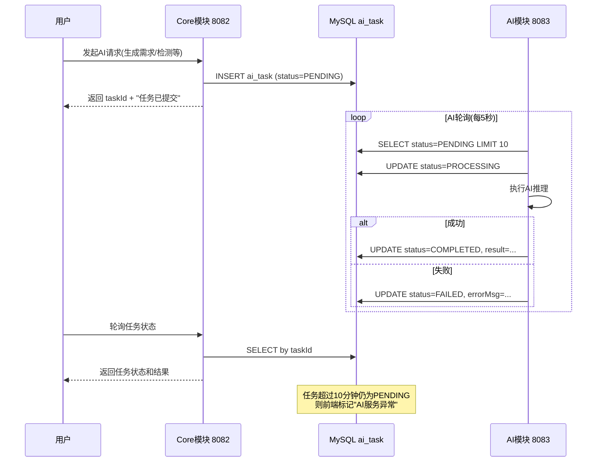
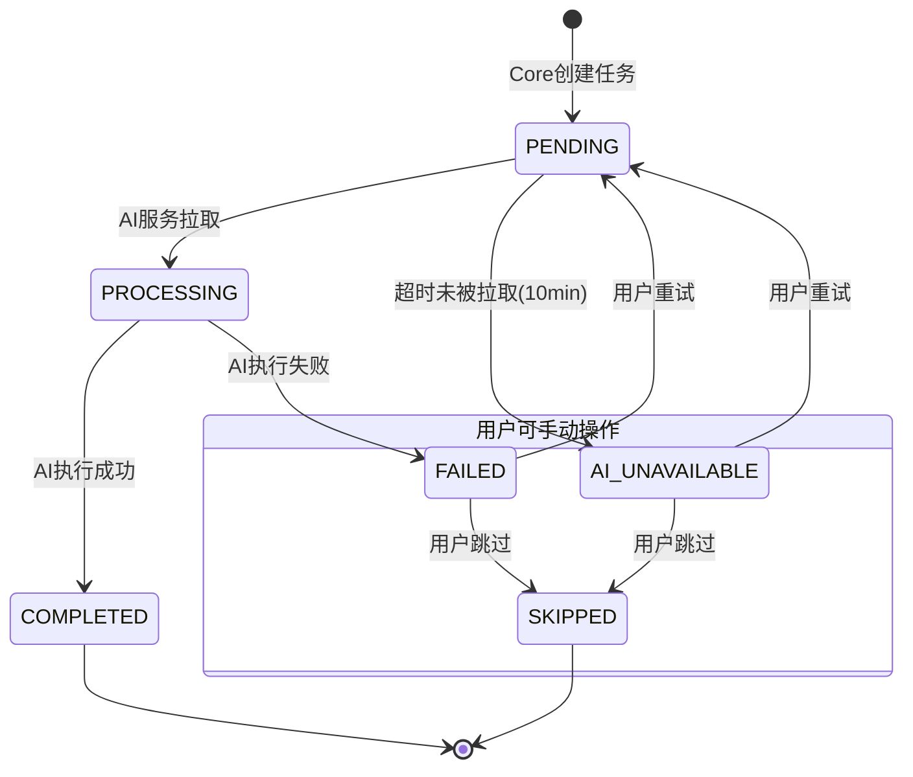
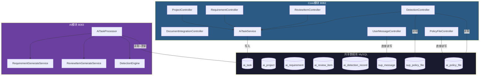
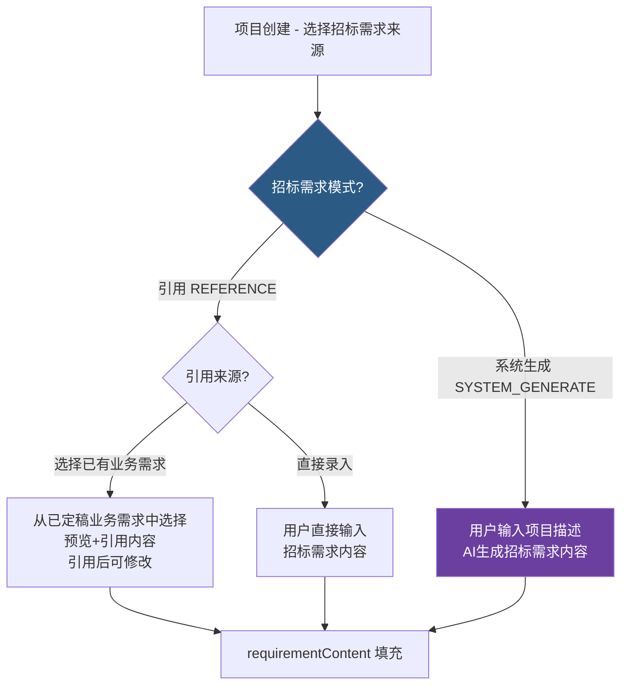
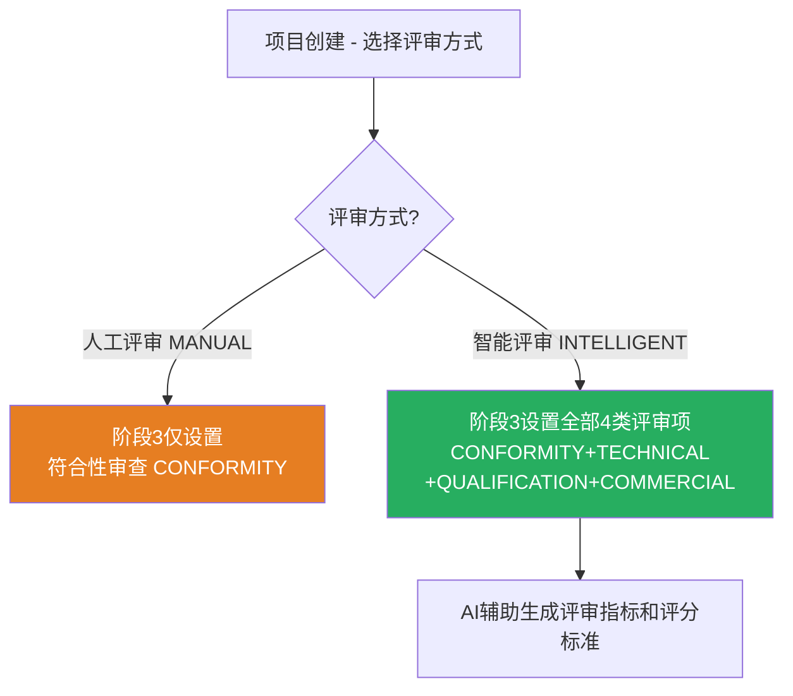
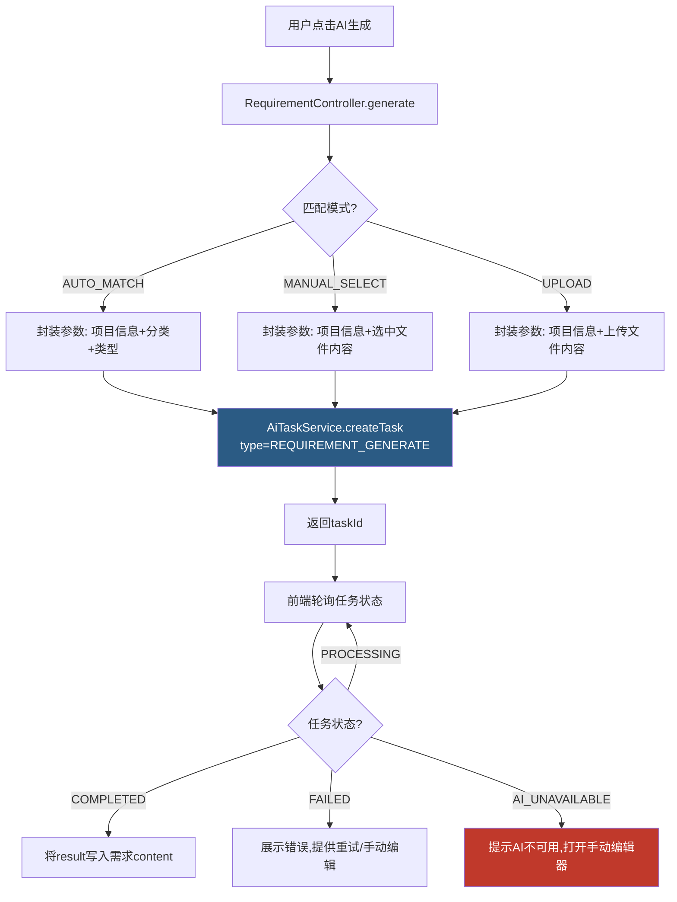
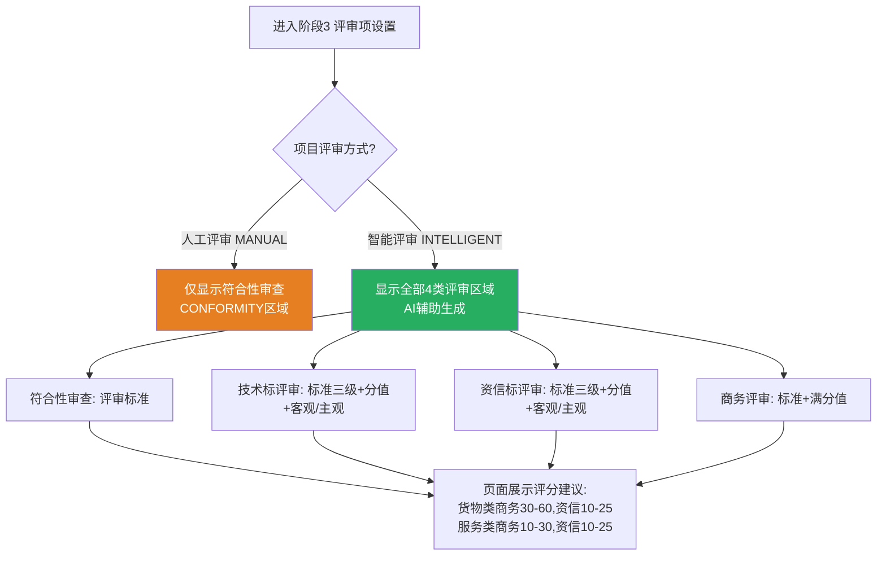
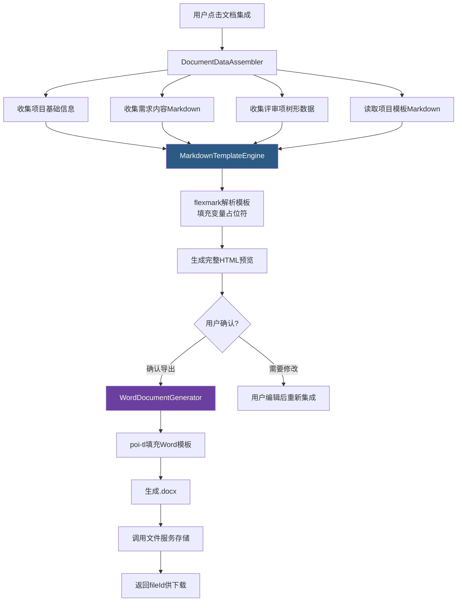
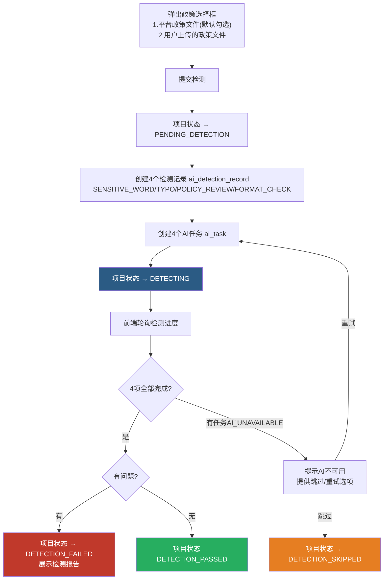
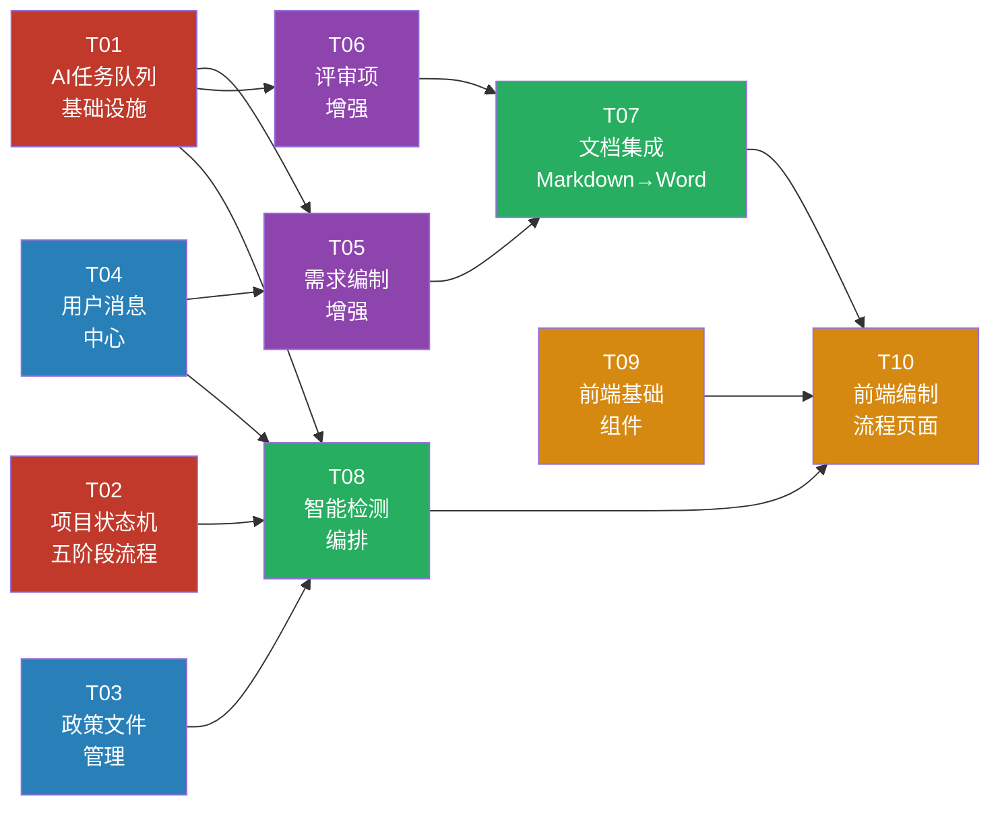

# 阶段二：编制中心核心业务 - 开发计划

> **版本**: v1.1
> **基线**: 基于阶段一框架代码 + 开发计划 v1
> **权威文档**: `docs/projects/招标文件AI编制系统_需求文档V1.0.md`（以此为准）+ 原型设计（补充参考）
> **核心原则**: AI服务通过任务队列异步解耦，AI不可用时编制中心业务流程不受影响
>
> ### 模块命名对照（需求文档定义）
>
> | 原型/旧称 | 需求文档正式名称 | 代码模块 |
> |-----------|----------------|---------|
> | 编制业务需求 | **业务需求管理** | RequirementController |
> | 项目管理 | **招标文件管理** | ProjectController |
> | 模板管理 | **文件模板管理** | TemplateController |

---

## 一、架构设计

### 1.1 AI任务队列模式

编制中心与AI服务之间采用**数据库任务队列**解耦。core模块只负责写入任务记录，AI模块负责消费执行。



### 1.2 AI任务状态流转



### 1.3 服务调用全景



---

## 二、数据库变更

### 2.1 新建表：ai_task（AI任务队列表）

```sql
CREATE TABLE ai_task (
  id BIGINT AUTO_INCREMENT PRIMARY KEY COMMENT '任务ID',
  task_type VARCHAR(50) NOT NULL COMMENT '任务类型: REQUIREMENT_GENERATE/REVIEW_ITEM_GENERATE/DETECTION_SENSITIVE_WORD/DETECTION_TYPO/DETECTION_POLICY_REVIEW/DETECTION_FORMAT_CHECK/TEXT_OPTIMIZE',
  project_id BIGINT COMMENT '关联项目ID',
  biz_id BIGINT COMMENT '关联业务ID(需求ID/评审项ID/检测记录ID等)',
  biz_type VARCHAR(30) COMMENT '业务类型: REQUIREMENT/REVIEW_ITEM/DETECTION',
  request_params JSON NOT NULL COMMENT '请求参数(包含生成所需上下文)',
  file_ids VARCHAR(500) COMMENT '关联文件ID列表(逗号分隔)',
  status VARCHAR(20) NOT NULL DEFAULT 'PENDING' COMMENT '任务状态: PENDING/PROCESSING/COMPLETED/FAILED/AI_UNAVAILABLE/SKIPPED',
  result LONGTEXT COMMENT '执行结果(JSON格式)',
  error_msg VARCHAR(1000) COMMENT '错误信息',
  retry_count INT DEFAULT 0 COMMENT '已重试次数',
  max_retry INT DEFAULT 3 COMMENT '最大重试次数',
  started_at DATETIME COMMENT 'AI开始处理时间',
  completed_at DATETIME COMMENT '完成时间',
  timeout_minutes INT DEFAULT 10 COMMENT '超时时间(分钟)',
  -- BaseEntity标准字段
  create_time DATETIME DEFAULT CURRENT_TIMESTAMP,
  create_id BIGINT,
  create_name VARCHAR(50),
  modify_time DATETIME DEFAULT CURRENT_TIMESTAMP ON UPDATE CURRENT_TIMESTAMP,
  modify_id BIGINT,
  modify_name VARCHAR(50),
  ver INT DEFAULT 1,
  is_delete TINYINT DEFAULT 0,
  INDEX idx_status (status),
  INDEX idx_task_type (task_type),
  INDEX idx_project_id (project_id),
  INDEX idx_create_time (create_time),
  INDEX idx_status_type (status, task_type)
) COMMENT 'AI任务队列表';
```

### 2.2 新建表：ai_policy_file（用户政策文件表）

```sql
CREATE TABLE ai_policy_file (
  id BIGINT AUTO_INCREMENT PRIMARY KEY COMMENT '文件ID',
  file_name VARCHAR(200) NOT NULL COMMENT '文件名称',
  file_category VARCHAR(30) NOT NULL COMMENT '文件分类: LAW/REGULATION/POLICY',
  applicable_category VARCHAR(30) COMMENT '适用项目类别: LIMITED_BELOW/PROPERTY_TRADE/GOVERNMENT_PROCUREMENT',
  file_id BIGINT COMMENT '关联file_info的id',
  file_size BIGINT COMMENT '文件大小(字节)',
  file_type VARCHAR(20) COMMENT '文件格式: PDF/DOCX/DOC/XLSX',
  description VARCHAR(500) COMMENT '文件描述',
  user_id BIGINT NOT NULL COMMENT '上传用户ID',
  status TINYINT DEFAULT 1 COMMENT '状态: 0=禁用 1=启用',
  -- BaseEntity标准字段
  create_time DATETIME DEFAULT CURRENT_TIMESTAMP,
  create_id BIGINT,
  create_name VARCHAR(50),
  modify_time DATETIME DEFAULT CURRENT_TIMESTAMP ON UPDATE CURRENT_TIMESTAMP,
  modify_id BIGINT,
  modify_name VARCHAR(50),
  ver INT DEFAULT 1,
  is_delete TINYINT DEFAULT 0,
  INDEX idx_user_id (user_id),
  INDEX idx_file_category (file_category),
  INDEX idx_status (status)
) COMMENT '用户政策文件表';
```

### 2.3 已有表字段扩展

```sql
-- =============================================
-- ai_project 增加字段（需求文档 3.3.1/3.3.2 + 原型补充）
-- =============================================
ALTER TABLE ai_project
  ADD COLUMN current_phase INT DEFAULT 1 COMMENT '当前编制阶段: 1-基础信息/2-需求生成/3-评审项/4-文档集成/5-智能检测' AFTER status,
  ADD COLUMN progress INT DEFAULT 0 COMMENT '完成进度(百分比 0-100)' AFTER current_phase,
  ADD COLUMN project_description TEXT COMMENT '项目基本情况描述' AFTER budget,
  -- 以下为原型补充字段（非需求文档必填，但原型页面涉及）
  ADD COLUMN tender_unit VARCHAR(200) COMMENT '招标单位' AFTER project_description,
  ADD COLUMN project_location VARCHAR(200) COMMENT '项目地点' AFTER tender_unit,
  ADD COLUMN contact_person VARCHAR(50) COMMENT '联系人' AFTER project_location,
  ADD COLUMN contact_phone VARCHAR(20) COMMENT '联系电话' AFTER contact_person,
  ADD COLUMN expected_publish_time DATE COMMENT '预期发布时间' AFTER contact_phone,
  ADD COLUMN remark VARCHAR(500) COMMENT '备注' AFTER expected_publish_time,
  ADD COLUMN generated_file_id BIGINT COMMENT '生成的招标文件ID(关联file_info)' AFTER remark;
-- 注意: project_code(项目编号) 由用户输入, 1-50字符, 唯一; 现有字段已支持

-- =============================================
-- ai_requirement 增加字段（需求文档 3.2.1/3.2.2）
-- =============================================
ALTER TABLE ai_requirement
  ADD COLUMN service_sub_type VARCHAR(50) COMMENT '服务子分类: 物业/IT服务/咨询服务/维保服务等' AFTER project_type,
  ADD COLUMN progress INT DEFAULT 0 COMMENT '完成进度(百分比 0-100)' AFTER status,
  ADD COLUMN auto_save_content LONGTEXT COMMENT '自动保存内容(未提交的草稿)' AFTER content,
  ADD COLUMN auto_save_time DATETIME COMMENT '自动保存时间' AFTER auto_save_content;
-- 注意: status 字段值改用 IN_PROGRESS(进行中)/COMPLETED(已完成)，与需求文档3.2.1对齐

-- =============================================
-- ai_review_item 增加评审类型和评分字段（需求文档阶段3评审项设置）
-- =============================================
ALTER TABLE ai_review_item
  ADD COLUMN review_type VARCHAR(30) COMMENT '评审类型: CONFORMITY/TECHNICAL/QUALIFICATION/COMMERCIAL' AFTER sort_order,
  ADD COLUMN score DECIMAL(5,2) COMMENT '分值(评审分值)' AFTER review_type,
  ADD COLUMN max_score DECIMAL(5,2) COMMENT '满分值(商务评审专用)' AFTER score,
  ADD COLUMN weight DECIMAL(5,2) COMMENT '权重(百分比)' AFTER max_score,
  ADD COLUMN subjectivity VARCHAR(20) COMMENT '客观/主观: OBJECTIVE/SUBJECTIVE (技术标/资信标专用)' AFTER weight,
  ADD COLUMN is_required TINYINT DEFAULT 0 COMMENT '是否必审项: 0-否 1-是' AFTER subjectivity;

-- =============================================
-- ai_detection_record 增加政策文件关联
-- =============================================
ALTER TABLE ai_detection_record
  ADD COLUMN policy_file_ids VARCHAR(500) COMMENT '关联政策文件ID列表(逗号分隔)' AFTER content_snapshot,
  ADD COLUMN task_id BIGINT COMMENT '关联AI任务ID' AFTER policy_file_ids;
```

### 2.4 检测类型变更说明（需求文档 3.2.5 / 3.3.2 阶段5）

> **重要**: 检测类型与 CLAUDE.md 中的定义不同，以需求文档为准。

| 检测类型 | 代码枚举值 | 适用场景 | 说明 |
|---------|-----------|---------|------|
| 敏感词检测 | SENSITIVE_WORD | 业务需求检测 + 最终文档检测 | 检测并标记敏感词汇 |
| 错别字检测 | TYPO | 业务需求检测 + 最终文档检测 | 检测并标记错别字 |
| 政策文件审查 | POLICY_REVIEW | 仅最终文档检测(阶段5) | 可选择相关政策文件进行合规性检查 |
| 格式规范检测 | FORMAT_CHECK | 仅最终文档检测(阶段5) | 检测文档格式规范性 |

- **业务需求智能检测(3.2.5)**: 仅 `SENSITIVE_WORD` + `TYPO` (2项)
- **最终文档智能检测(阶段5)**: `SENSITIVE_WORD` + `TYPO` + `POLICY_REVIEW` + `FORMAT_CHECK` (4项)

### 2.5 评审项结构说明（需求文档阶段3）

| 评审类型 | 代码枚举 | 子项结构 | 特有字段 |
|---------|---------|---------|---------|
| 符合性审查 | CONFORMITY | 评审标准(单级) | — |
| 技术标评审 | TECHNICAL | 评审标准(支持三级) | 评审分值 + 客观/主观(subjectivity) |
| 资信标评审 | QUALIFICATION | 评审标准(支持三级) | 评审分值 + 客观/主观(subjectivity) |
| 商务评审 | COMMERCIAL | 评审标准(单级) | 满分值(maxScore) |

**评分建议（作为AI生成参考分值依据）**:
- 货物类项目：商务分30-60，资信10-25分
- 服务类项目：商务分10-30，资信10-25分

**评审方式与评审项的关系**:
- **人工评审**: 只需设置**符合性审查**内容（CONFORMITY），其余评审由人工线下完成
- **智能评审**: 需设置全部4类评审项，由AI辅助生成评审指标和评分标准

---

## 三、任务清单

### T01 - AI任务队列基础设施

> **依赖**: 无
> **影响模块**: common + core + ai

#### 新建文件

| 文件 | 模块 | 路径 | 说明 |
|------|------|------|------|
| `AiTask` | common | `common/src/.../entity/ai/AiTask.java` | AI任务实体 |
| `AiTaskStatus` | common | `common/src/.../enums/AiTaskStatus.java` | 任务状态枚举: PENDING/PROCESSING/COMPLETED/FAILED/AI_UNAVAILABLE/SKIPPED |
| `AiTaskType` | common | `common/src/.../enums/AiTaskType.java` | 任务类型枚举: REQUIREMENT_GENERATE/REVIEW_ITEM_GENERATE/DETECTION_SENSITIVE_WORD/DETECTION_TYPO/DETECTION_POLICY_REVIEW/DETECTION_FORMAT_CHECK/TEXT_OPTIMIZE |
| `AiTaskMapper` | core | `core/src/.../mapper/AiTaskMapper.java` | 任务Mapper |
| `IAiTaskService` | core | `core/src/.../service/IAiTaskService.java` | 任务服务接口 |
| `AiTaskServiceImpl` | core | `core/src/.../service/impl/AiTaskServiceImpl.java` | 任务服务实现 |
| `AiTaskController` | core | `core/src/.../controller/AiTaskController.java` | 任务查询/重试/跳过接口 |
| `AiTaskCreateRequest` | core | `core/src/.../dto/request/AiTaskCreateRequest.java` | 创建任务请求DTO |
| `AiTaskVO` | core | `core/src/.../dto/response/AiTaskVO.java` | 任务状态响应VO |
| `AiTaskMapper` (ai) | ai | `ai/src/.../mapper/AiTaskMapper.java` | AI模块读取任务的Mapper |
| `AiTaskProcessor` | ai | `ai/src/.../processor/AiTaskProcessor.java` | AI任务轮询处理器(定时任务) |
| `AiTaskTimeoutChecker` | core | `core/src/.../scheduler/AiTaskTimeoutChecker.java` | 超时检查定时任务 |

#### IAiTaskService 接口定义

```java
public interface IAiTaskService {
    // 创建AI任务（核心方法，其他Service调用此方法提交任务）
    AiTask createTask(AiTaskType type, Long projectId, Long bizId, String bizType,
                      Map<String, Object> requestParams, String fileIds);

    // 查询任务状态
    AiTaskVO getTaskStatus(Long taskId);

    // 查询项目的所有任务
    List<AiTaskVO> getTasksByProject(Long projectId);

    // 用户重试任务
    void retryTask(Long taskId);

    // 用户跳过任务（降级为手动模式）
    void skipTask(Long taskId);

    // 标记超时任务为AI_UNAVAILABLE（定时任务调用）
    int markTimeoutTasks();
}
```

#### API端点

```
GET    /api/v1/ai-tasks/{id}              - 查询任务状态
GET    /api/v1/ai-tasks/project/{projectId} - 查询项目所有任务
POST   /api/v1/ai-tasks/{id}/retry        - 重试任务
POST   /api/v1/ai-tasks/{id}/skip         - 跳过任务(降级手动)
```

#### AiTaskProcessor（AI模块定时处理器）核心逻辑

```java
@Scheduled(fixedDelay = 5000) // 每5秒轮询
public void processPendingTasks() {
    List<AiTask> tasks = aiTaskMapper.selectPendingTasks(10); // 批量拉取
    for (AiTask task : tasks) {
        // CAS更新状态为PROCESSING，防止并发
        int updated = aiTaskMapper.casUpdateStatus(task.getId(), "PENDING", "PROCESSING");
        if (updated == 0) continue; // 已被其他实例抢占

        try {
            Object result = dispatch(task); // 按taskType分发执行
            markCompleted(task, result);
        } catch (Exception e) {
            markFailed(task, e.getMessage());
        }
    }
}
```

#### 超时检查（core模块定时任务）

```java
@Scheduled(fixedRate = 60000) // 每分钟检查
public void checkTimeoutTasks() {
    aiTaskService.markTimeoutTasks(); // PENDING超过timeout_minutes的标记为AI_UNAVAILABLE
}
```

#### 验证标准

- [ ] 创建任务后状态为PENDING
- [ ] AI模块启动后能拉取PENDING任务并处理
- [ ] 任务超时后自动标记为AI_UNAVAILABLE
- [ ] 用户可以重试FAILED/AI_UNAVAILABLE任务
- [ ] 用户可以跳过任务，状态变为SKIPPED
- [ ] 并发环境下同一任务不会被重复处理(CAS保证)
- [ ] AI模块停止后，新任务保持PENDING直到超时
- [ ] AI模块恢复后，自动处理积压的PENDING任务
- [ ] 前端轮询能正确展示任务进度
- [ ] 任务结果正确写入result字段

---

### T02 - 项目状态机与五阶段流程

> **依赖**: 无
> **影响模块**: core

#### 新建文件

| 文件 | 路径 | 说明 |
|------|------|------|
| `ProjectStateMachine` | `core/src/.../statemachine/ProjectStateMachine.java` | 项目状态机（定义合法状态转换） |
| `ProjectPhase` | `common/src/.../enums/ProjectPhase.java` | 编制阶段枚举: BASIC_INFO(1)/REQUIREMENT(2)/REVIEW_ITEM(3)/DOCUMENT(4)/DETECTION(5) |
| `ProjectInitRequest` | `core/src/.../dto/request/ProjectInitRequest.java` | 基础信息录入请求DTO |
| `ProjectPhaseVO` | `core/src/.../dto/response/ProjectPhaseVO.java` | 项目阶段进度VO |
| `RequirementSourceType` | `common/src/.../enums/RequirementSourceType.java` | 招标需求来源枚举: REFERENCE(引用)/SYSTEM_GENERATE(系统生成) |

#### 修改文件

| 文件 | 改动 |
|------|------|
| `ProjectController` | 新增 `initProject()`、`getPhase()`、`advancePhase()` 接口 |
| `IProjectService` + `ProjectServiceImpl` | 新增状态流转方法、阶段推进逻辑、进度计算逻辑 |
| `AiProject` | 新增字段映射: `currentPhase`, `progress`, `projectDescription`, `tenderUnit`, `projectLocation`, `contactPerson`, `contactPhone`, `expectedPublishTime`, `remark` |
| `ProjectRequest` | 补充全部新字段，项目编号(projectCode)校验: 1-50字符+唯一 |
| `ProjectVO` | 补充全部新字段，含进度百分比 |

#### 项目创建字段清单（需求文档3.3.2）

| 字段 | Java字段 | 类型 | 必填 | 校验规则 | 来源 |
|------|---------|------|------|---------|------|
| 项目编号 | projectCode | String | 是 | 1-50字符，唯一 | 用户输入 |
| 项目名称 | projectName | String | 是 | 1-100字符，唯一 | 用户输入 |
| 项目类别 | projectCategory | Enum | 是 | LIMITED_BELOW/PROPERTY_TRADE/GOVERNMENT_PROCUREMENT | 下拉选择 |
| 项目类型 | projectType | Enum | 是 | ENGINEERING/GOODS/SERVICE | 下拉选择 |
| 项目预算 | budget | BigDecimal | 是 | 正数，2位小数，万元 | 用户输入 |
| 评审方式 | reviewType | Enum | 是 | INTELLIGENT(智能评审)/MANUAL(人工评审) | 单选 |
| 招标需求 | requirementSource | Enum | 是 | REFERENCE(引用)/SYSTEM_GENERATE(系统生成) | 单选 |
| 项目基本情况描述 | projectDescription | String | 否 | ≤500字符 | 用户输入 |
| 招标单位 | tenderUnit | String | 否 | — | 原型补充 |
| 项目地点 | projectLocation | String | 否 | — | 原型补充 |
| 联系人 | contactPerson | String | 否 | — | 原型补充 |
| 联系电话 | contactPhone | String | 否 | — | 原型补充 |
| 预期发布时间 | expectedPublishTime | Date | 否 | — | 原型补充 |
| 备注 | remark | String | 否 | ≤500字符 | 原型补充 |
| 生成的招标文件ID | generatedFileId | Long | 否 | 关联file_info | 文档集成阶段(T07)生成后回写 |

#### 招标需求双模式（需求文档3.3.2）



#### 评审方式与评审项关系



#### ProjectStateMachine 核心逻辑

```java
public class ProjectStateMachine {
    // 合法状态转换表
    private static final Map<ProjectStatus, Set<ProjectStatus>> TRANSITIONS = Map.of(
        DRAFT, Set.of(IN_PROGRESS, CANCELLED),
        IN_PROGRESS, Set.of(PENDING_DETECTION, CANCELLED),
        PENDING_DETECTION, Set.of(DETECTING, IN_PROGRESS, CANCELLED),
        DETECTING, Set.of(DETECTION_PASSED, DETECTION_FAILED, DETECTION_SKIPPED),
        DETECTION_PASSED, Set.of(PUBLISHED, IN_PROGRESS),
        DETECTION_FAILED, Set.of(IN_PROGRESS),
        DETECTION_SKIPPED, Set.of(PUBLISHED, IN_PROGRESS),
        PUBLISHED, Set.of(ARCHIVED),
        ARCHIVED, Set.of()
    );

    public static void transition(AiProject project, ProjectStatus target) {
        if (!TRANSITIONS.getOrDefault(project.getStatus(), Set.of()).contains(target)) {
            throw new BusinessException(PROJECT_STATUS_ERROR,
                "不允许从 " + project.getStatus() + " 转为 " + target);
        }
        project.setStatus(target.getCode());
    }
}
```

#### 新增API端点

```
POST   /api/v1/projects/{id}/init          - 基础信息录入（阶段1完成，状态 DRAFT→IN_PROGRESS）
GET    /api/v1/projects/{id}/phase         - 获取项目当前阶段信息
PUT    /api/v1/projects/{id}/phase         - 手动推进阶段
PUT    /api/v1/projects/{id}/status        - 变更项目状态（含校验）
POST   /api/v1/projects/{id}/cancel        - 取消项目
POST   /api/v1/projects/{id}/publish       - 发布项目（检测通过/跳过后）
POST   /api/v1/projects/{id}/archive       - 归档项目
```

#### 验证标准

- [ ] DRAFT项目可以执行init，状态变为IN_PROGRESS
- [ ] IN_PROGRESS项目不能再次init
- [ ] 非法状态转换抛出BusinessException
- [ ] 取消操作在DRAFT/IN_PROGRESS/PENDING_DETECTION状态均可执行
- [ ] 只有DETECTION_PASSED/DETECTION_SKIPPED可以发布
- [ ] PUBLISHED项目可以归档
- [ ] currentPhase随阶段操作正确更新
- [ ] progress(完成进度)随阶段推进自动计算（如每阶段20%）
- [ ] 状态变更同时发送消息通知（依赖T04）
- [ ] 版本快照在关键状态变更时自动创建
- [ ] 并发操作通过乐观锁(ver)防止冲突
- [ ] 项目编号(projectCode)唯一性校验正确
- [ ] 项目名称(projectName)唯一性校验正确
- [ ] 评审方式(reviewType)正确影响阶段3评审项范围
- [ ] 招标需求引用模式: 选择已有业务需求后正确填充requirementContent
- [ ] 招标需求系统生成模式: 创建AI生成任务正确

---

### T03 - 编制中心政策文件管理

> **依赖**: 无
> **影响模块**: common + core

#### 新建文件

| 文件 | 路径 | 说明 |
|------|------|------|
| `AiPolicyFile` | `common/src/.../entity/ai/AiPolicyFile.java` | 用户政策文件实体 |
| `PolicyFileRequest` | `core/src/.../dto/request/PolicyFileRequest.java` | 政策文件请求DTO |
| `PolicyFileVO` | `core/src/.../dto/response/PolicyFileVO.java` | 政策文件响应VO |
| `AiPolicyFileMapper` | `core/src/.../mapper/AiPolicyFileMapper.java` | Mapper |
| `IPolicyFileService` | `core/src/.../service/IPolicyFileService.java` | 服务接口 |
| `PolicyFileServiceImpl` | `core/src/.../service/impl/PolicyFileServiceImpl.java` | 服务实现（按user_id过滤） |
| `PolicyFileController` | `core/src/.../controller/PolicyFileController.java` | 控制器 |

#### API端点

```
GET    /api/v1/policy-files                - 分页查询当前用户的政策文件
POST   /api/v1/policy-files                - 上传政策文件（关联文件服务）
GET    /api/v1/policy-files/{id}           - 查看详情
DELETE /api/v1/policy-files/{id}           - 删除
PUT    /api/v1/policy-files/{id}/status    - 启用/禁用
GET    /api/v1/policy-files/all            - 获取全部可用政策文件（系统级+用户级合并，供检测选择用）
```

#### 关键设计

- 查询接口自动按当前登录用户的 `user_id` 过滤（从JWT中获取）
- `/all` 接口合并查询 `sup_policy_file`(系统级) + `ai_policy_file`(用户级)，用于检测阶段选择政策文件
- 文件上传通过前端直传文件服务(8081)获取 `fileId`，再通过此接口保存关联

#### 验证标准

- [ ] 用户只能看到自己上传的政策文件
- [ ] `/all` 接口正确合并系统级和用户级政策文件
- [ ] 上传时正确关联file_info
- [ ] 删除为逻辑删除
- [ ] 按分类、适用类别筛选正常工作
- [ ] 支持PDF/DOCX/DOC/XLSX格式
- [ ] 文件大小正确记录
- [ ] 非文件所有者不能删除/修改
- [ ] 禁用的文件不出现在 `/all` 列表中
- [ ] 分页参数校验正常

---

### T04 - 用户消息中心

> **依赖**: 无（直接读写sup_message表）
> **影响模块**: core

#### 新建文件

| 文件 | 路径 | 说明 |
|------|------|------|
| `SupMessageMapper` | `core/src/.../mapper/SupMessageMapper.java` | 消息Mapper（读sup_message表） |
| `IUserMessageService` | `core/src/.../service/IUserMessageService.java` | 用户消息服务接口 |
| `UserMessageServiceImpl` | `core/src/.../service/impl/UserMessageServiceImpl.java` | 消息服务实现 |
| `UserMessageController` | `core/src/.../controller/UserMessageController.java` | 消息中心控制器 |
| `MessageVO` | `core/src/.../dto/response/MessageVO.java` | 消息响应VO |
| `MessageHelper` | `core/src/.../helper/MessageHelper.java` | 消息发送辅助类（其他Service调用来发通知） |

#### API端点

```
GET    /api/v1/messages                    - 分页查询消息（支持按类型筛选）
PUT    /api/v1/messages/{id}/read          - 标记已读
PUT    /api/v1/messages/read-all           - 全部标记已读
GET    /api/v1/messages/unread-count       - 未读消息数
DELETE /api/v1/messages/{id}               - 删除消息
```

#### MessageHelper 设计

```java
@Component
public class MessageHelper {
    // 供其他Service调用，发送通知
    public void sendProjectNotice(Long userId, String title, String content, Long projectId) {
        SupMessage msg = new SupMessage();
        msg.setUserId(userId);
        msg.setTitle(title);
        msg.setContent(content);
        msg.setMessageType(MessageType.SYSTEM.getCode());
        msg.setBizType(MessageBizType.PROJECT.getCode());
        msg.setBizId(projectId);
        msg.setIsRead(0);
        supMessageMapper.insert(msg);
    }

    public void sendDetectionNotice(...) { ... }
    public void sendTemplateNotice(...) { ... }
}
```

#### 消息触发场景

| 触发点 | 消息类型 | 标题模板 |
|--------|---------|---------|
| 项目创建 | SYSTEM | 项目「{name}」创建成功 |
| 检测完成(通过) | DETECTION | 项目「{name}」检测通过 |
| 检测完成(未通过) | DETECTION | 项目「{name}」检测未通过，共{n}个问题 |
| 检测跳过 | WARNING | 项目「{name}」已跳过AI检测 |
| AI任务失败 | WARNING | AI任务执行失败：{taskType} |
| AI服务不可用 | WARNING | AI服务暂时不可用，任务已挂起 |
| 文档集成完成 | SYSTEM | 项目「{name}」文档集成完成 |

#### 验证标准

- [ ] 用户只能查看自己的消息
- [ ] 标记已读后 `is_read=1` 且 `read_time` 有值
- [ ] 全部已读批量更新正确
- [ ] 未读计数准确
- [ ] MessageHelper发送消息后立即可查
- [ ] 按消息类型筛选正常
- [ ] 删除为逻辑删除
- [ ] 分页按创建时间倒序
- [ ] 消息中包含正确的bizId和bizType
- [ ] 并发标记已读无异常

---

### T05 - 需求编制增强（AI生成 + 自动保存）

> **依赖**: T01(AI任务队列), T04(消息通知)
> **影响模块**: core

#### 修改文件

| 文件 | 改动 |
|------|------|
| `RequirementController` | 新增 `generate()`、`autoSave()`、`recoverAutoSave()`、`detect()` 接口 |
| `IRequirementService` + Impl | 新增AI生成请求、自动保存、恢复逻辑、需求检测逻辑 |
| `AiRequirement` 实体 | 新增字段映射: `serviceSubType`, `progress`, `autoSaveContent`, `autoSaveTime` |
| `RequirementRequest` | 补充 `serviceSubType` 字段; 确认 `content` 字段(LONGTEXT) |
| `RequirementVO` | 补充 `serviceSubType`, `progress` 字段 |

#### 需求创建字段清单（需求文档3.2.2）

| 字段 | Java字段 | 类型 | 必填 | 校验规则 | 说明 |
|------|---------|------|------|---------|------|
| 项目名称 | requirementName | String | 是 | 1-100字符，唯一 | 业务需求的项目名称 |
| 项目类型 | projectType | Enum | 是 | ENGINEERING/GOODS/SERVICE | 含子分类 |
| 服务子分类 | serviceSubType | String | 否 | 物业/IT服务/咨询服务/维保服务等 | 当projectType=SERVICE时 |
| 项目预算 | budget | BigDecimal | 是 | 正数，万元 | — |
| 项目基本情况描述 | requirementDescription | String | 否 | ≤500字符 | — |

#### 需求列表字段（需求文档3.2.1）

| 展示字段 | Java字段 | 说明 |
|---------|---------|------|
| 项目名称 | requirementName | — |
| 项目类型 | projectType + serviceSubType | 含子分类显示 |
| 项目预算 | budget | 万元 |
| 需求状态 | status | IN_PROGRESS(进行中) / COMPLETED(已完成) |
| 完成进度 | progress | 百分比 0-100 |
| 创建时间 | createTime | — |

> **状态说明**: 需求文档3.2.1定义需求状态为 **进行中/已完成** 两种简单状态，不同于原型的多步骤状态流。

#### 业务需求智能检测（需求文档3.2.5）

业务需求的检测仅包含**2项**（非最终文档的4项）：

| 检测类型 | 说明 |
|---------|------|
| 敏感词检测 (SENSITIVE_WORD) | 检测并标记敏感词汇 |
| 错别字检查 (TYPO) | 检测并标记错别字 |

```
POST   /api/v1/requirements/{id}/detect          - 提交需求检测（创建2个AI任务）
GET    /api/v1/requirements/{id}/detect/status    - 查询需求检测状态
POST   /api/v1/requirements/{id}/detect/accept    - 接受检测建议
POST   /api/v1/requirements/{id}/detect/reject    - 拒绝检测建议
```

#### 新建文件

| 文件 | 路径 | 说明 |
|------|------|------|
| `RequirementGenerateRequest` | `core/src/.../dto/request/RequirementGenerateRequest.java` | AI生成需求请求（含项目信息、参考内容、匹配模式） |

#### 新增API端点

```
POST   /api/v1/requirements/{id}/generate          - 提交AI生成需求任务（创建ai_task）
GET    /api/v1/requirements/{id}/generate/status    - 查询生成任务状态
POST   /api/v1/requirements/{id}/auto-save          - 自动保存草稿
GET    /api/v1/requirements/{id}/auto-save           - 获取自动保存内容（用于恢复）
DELETE /api/v1/requirements/{id}/auto-save           - 清除自动保存内容
```

#### 生成流程



#### 自动保存机制

- 前端每120秒自动调用 `/auto-save`，将编辑器内容保存到 `auto_save_content`
- 页面加载时调用 `/auto-save` GET，如果有内容则提示恢复
- 正式保存(PUT)后清除自动保存内容

#### 验证标准

- [ ] 提交生成后返回taskId，任务状态为PENDING
- [ ] AI处理完成后，result包含生成的需求内容(Markdown)
- [ ] 用户确认后，content字段更新为AI生成内容
- [ ] AI不可用时，用户可手动编辑并保存
- [ ] 自动保存每120秒写入auto_save_content
- [ ] 页面重新加载能检测到未保存的草稿
- [ ] 正式保存后自动保存内容被清除
- [ ] 3种匹配模式的参数正确传递到任务表
- [ ] 重试任务重置retry_count并改状态为PENDING
- [ ] 需求生成完成后发送消息通知
- [ ] serviceSubType在projectType=SERVICE时正确保存
- [ ] progress百分比正确展示
- [ ] 需求状态正确使用IN_PROGRESS/COMPLETED
- [ ] 需求检测仅创建SENSITIVE_WORD+TYPO两个任务（不含POLICY_REVIEW和FORMAT_CHECK）
- [ ] 检测建议接受/拒绝操作正确

---

### T06 - 评审项管理增强

> **依赖**: T01(AI任务队列)
> **影响模块**: core

#### 修改文件

| 文件 | 改动 |
|------|------|
| `ReviewItemController` | 新增 `generateByAi()` 接口 |
| `IReviewItemService` + Impl | 新增AI生成评审项方法、评审方式条件校验 |
| `AiReviewItem` 实体 | 新增 `reviewType`、`score`、`maxScore`、`weight`、`subjectivity`、`isRequired` 字段 |
| `ReviewItemRequest` | 新增 `reviewType`、`score`、`maxScore`、`weight`、`subjectivity`、`isRequired` 字段 |
| `ReviewItemTreeVO` | 新增 `reviewType`、`score`、`maxScore`、`weight`、`subjectivity`、`isRequired` 字段 |

#### 新建文件

| 文件 | 路径 | 说明 |
|------|------|------|
| `ReviewItemGenerateRequest` | `core/src/.../dto/request/ReviewItemGenerateRequest.java` | AI生成评审项请求（含评审方式、项目类型、分值建议） |
| `ReviewType` | `common/src/.../enums/ReviewType.java` | 评审类型枚举: CONFORMITY(符合性审查)/TECHNICAL(技术标)/QUALIFICATION(资信标)/COMMERCIAL(商务评审) |
| `SubjectivityType` | `common/src/.../enums/SubjectivityType.java` | 客观/主观枚举: OBJECTIVE(客观)/SUBJECTIVE(主观) |

#### 新增API端点

```
POST   /api/v1/review-items/{projectId}/generate         - 提交AI生成评审项任务
GET    /api/v1/review-items/{projectId}/generate/status   - 查询生成任务状态
POST   /api/v1/review-items/batch                         - 批量创建评审项（AI生成结果确认后批量入库）
PUT    /api/v1/review-items/batch                         - 批量更新评审项
```

#### AI生成结果格式

```json
{
  "reviewItems": [
    {
      "reviewType": "CONFORMITY",
      "level": 1,
      "itemName": "资格性审查",
      "children": [
        {
          "level": 2,
          "itemName": "营业执照",
          "itemContent": "投标人须提供有效的营业执照副本",
          "isRequired": 1,
          "children": [...]
        }
      ]
    },
    {
      "reviewType": "TECHNICAL",
      "level": 1,
      "itemName": "技术标评审",
      "score": 60,
      "children": [
        {
          "level": 2,
          "itemName": "技术方案",
          "score": 30,
          "subjectivity": "SUBJECTIVE",
          "children": [
            {
              "level": 3,
              "itemName": "实施方案",
              "itemContent": "投标人提供详细的实施方案",
              "score": 15,
              "subjectivity": "SUBJECTIVE"
            }
          ]
        }
      ]
    },
    {
      "reviewType": "QUALIFICATION",
      "level": 1,
      "itemName": "资信标评审",
      "score": 20,
      "children": [
        {
          "level": 2,
          "itemName": "企业资质",
          "score": 10,
          "subjectivity": "OBJECTIVE",
          "children": [...]
        }
      ]
    },
    {
      "reviewType": "COMMERCIAL",
      "level": 1,
      "itemName": "商务评审",
      "children": [
        {
          "level": 2,
          "itemName": "报价评审",
          "itemContent": "投标报价评审",
          "maxScore": 40
        }
      ]
    }
  ]
}
```

#### 评审方式条件逻辑



#### 验证标准

- [ ] 智能评审: AI生成评审项包含四类评审(符合性/技术/资信/商务)
- [ ] 人工评审: 仅显示符合性审查区域，不生成其他三类
- [ ] 生成的树形结构支持三级嵌套
- [ ] 批量创建正确处理parentId关系
- [ ] reviewType/score/maxScore/weight/subjectivity字段正确保存和查询
- [ ] subjectivity仅在TECHNICAL和QUALIFICATION类型中有值
- [ ] maxScore仅在COMMERCIAL类型中有值
- [ ] AI不可用时，用户可手动添加评审项
- [ ] 已有评审项的项目可以追加AI生成
- [ ] 分值合计校验（可选）
- [ ] 评分建议文案正确展示在页面上
- [ ] 必审项标记正确
- [ ] 排序序号自动递增
- [ ] 删除顶级项级联删除子项（已有逻辑确认）
- [ ] AI生成结果支持"赞"/"不行"反馈标记，AI据此优化

---

### T07 - 文档集成（Markdown → Word）

> **依赖**: T02(项目阶段), T05(需求内容), T06(评审项)
> **影响模块**: core

#### 新建文件

| 文件 | 路径 | 说明 |
|------|------|------|
| `DocumentIntegrationController` | `core/src/.../controller/DocumentIntegrationController.java` | 文档集成控制器 |
| `IDocumentIntegrationService` | `core/src/.../service/IDocumentIntegrationService.java` | 文档集成服务接口 |
| `DocumentIntegrationServiceImpl` | `core/src/.../service/impl/DocumentIntegrationServiceImpl.java` | 文档集成实现 |
| `WordDocumentGenerator` | `core/src/.../engine/WordDocumentGenerator.java` | Word文档生成器（poi-tl） |
| `DocumentPreviewVO` | `core/src/.../dto/response/DocumentPreviewVO.java` | 文档预览VO |
| `DocumentDataAssembler` | `core/src/.../engine/DocumentDataAssembler.java` | 文档数据组装器（收集项目+需求+评审项） |

#### 修改文件

| 文件 | 改动 |
|------|------|
| `MarkdownTemplateEngine` | 实现真正的Markdown→HTML转换逻辑（flexmark-java） |
| `ProjectController` | 完善 `export()` 接口实现 |

#### API端点

```
POST   /api/v1/documents/integrate/{projectId}  - 执行文档集成（生成预览用HTML）
GET    /api/v1/documents/preview/{projectId}     - 获取集成预览（HTML）
GET    /api/v1/documents/export/{projectId}      - 导出Word文档（.docx下载）
PUT    /api/v1/documents/edit/{projectId}        - 编辑集成后的文档内容
```

#### 文档生成流程



#### DocumentDataAssembler 数据模型

```java
public class DocumentData {
    // 项目信息
    private String projectName;
    private String projectCode;
    private String projectCategory;  // 中文
    private String projectType;      // 中文
    private BigDecimal budget;

    // 需求内容（Markdown）
    private String requirementContent;

    // 评审项（树形结构）
    private List<ReviewItemTreeVO> conformityItems;   // 符合性审查
    private List<ReviewItemTreeVO> technicalItems;     // 技术标评审
    private List<ReviewItemTreeVO> qualificationItems; // 资信标评审
    private List<ReviewItemTreeVO> commercialItems;    // 商务评审
}
```

#### 验证标准

- [ ] Markdown模板正确解析，变量占位符被替换
- [ ] 需求内容中的Markdown格式在HTML预览中正确渲染
- [ ] 评审项按四类分组正确填充到文档中
- [ ] Word导出文件可以被Microsoft Word正常打开
- [ ] 导出的Word保持表格、标题等基本格式
- [ ] 导出文件通过文件服务存储，返回可下载的fileId
- [ ] 空需求/空评审项时不报错，显示占位提示
- [ ] 多次集成不会产生重复数据
- [ ] 项目阶段正确推进到4(文档集成)
- [ ] 集成完成后发送消息通知
- [ ] 导出Word成功后，generatedFileId回写到ai_project

---

### T08 - 智能检测编排（Core侧代理）

> **依赖**: T01(AI任务队列), T02(项目状态机), T03(政策文件), T04(消息通知)
> **影响模块**: core
>
> **重要**: 此处的智能检测是**最终文档检测（阶段5）**，与T05中的业务需求检测不同。
> - 业务需求检测(T05): 仅 SENSITIVE_WORD + TYPO (2项)
> - 最终文档检测(T08): SENSITIVE_WORD + TYPO + POLICY_REVIEW + FORMAT_CHECK (4项)

#### 新建文件

| 文件 | 路径 | 说明 |
|------|------|------|
| `DetectionController` | `core/src/.../controller/DetectionController.java` | 检测流程控制器（core模块） |
| `IDetectionService` | `core/src/.../service/IDetectionService.java` | 检测服务接口（core模块） |
| `DetectionServiceImpl` | `core/src/.../service/impl/DetectionServiceImpl.java` | 检测服务实现 |
| `DetectionSubmitRequest` | `core/src/.../dto/request/DetectionSubmitRequest.java` | 提交检测请求（含政策文件选择） |
| `DetectionProgressVO` | `core/src/.../dto/response/DetectionProgressVO.java` | 检测进度VO |
| `DetectionReportVO` | `core/src/.../dto/response/DetectionReportVO.java` | 检测报告VO |
| `DetectionIssueVO` | `core/src/.../dto/response/DetectionIssueVO.java` | 检测问题项VO |
| `AiDetectionRecordMapper` | `core/src/.../mapper/AiDetectionRecordMapper.java` | 检测记录Mapper(core模块) |
| `DetectionType` | `common/src/.../enums/DetectionType.java` | 检测类型枚举: SENSITIVE_WORD/TYPO/POLICY_REVIEW/FORMAT_CHECK |

#### API端点

```
POST   /api/v1/detection/submit/{projectId}       - 提交最终文档检测（弹出政策选择框，创建4个AI任务）
GET    /api/v1/detection/progress/{projectId}      - 获取检测进度（4项检测各自状态）
GET    /api/v1/detection/report/{projectId}        - 获取检测报告（所有问题汇总）
POST   /api/v1/detection/{recordId}/accept         - 接受检测建议（应用修改）
POST   /api/v1/detection/{recordId}/reject         - 拒绝检测建议
POST   /api/v1/detection/accept-all/{projectId}    - 一键接受所有建议（批量修正）
POST   /api/v1/detection/skip/{projectId}          - 跳过检测（AI不可用时）
POST   /api/v1/detection/retry/{projectId}         - 重新检测
```

#### 检测提交流程



#### 政策文件选择逻辑（需求文档阶段5）

检测提交前弹出政策选择框，分两部分：
1. **平台政策文件**: 当前项目类别(projectCategory)匹配到的**启用状态**平台政策文件(sup_policy_file)，默认勾选，可取消
2. **用户政策文件**: 当前项目类别匹配到的**启用状态**用户上传的政策文件(ai_policy_file)

#### DetectionProgressVO 结构

```java
public class DetectionProgressVO {
    private Long projectId;
    private String overallStatus;  // DETECTING/PASSED/FAILED/SKIPPED
    private List<DetectionItemProgress> items;

    @Data
    public static class DetectionItemProgress {
        private String detectionType;   // SENSITIVE_WORD/TYPO/POLICY_REVIEW/FORMAT_CHECK
        private String typeName;        // 中文名: 敏感词检测/错别字检测/政策文件审查/格式规范检测
        private String taskStatus;      // PENDING/PROCESSING/COMPLETED/FAILED/AI_UNAVAILABLE
        private Integer issueCount;     // 问题数
        private BigDecimal score;       // 得分
    }
}
```

#### 验证标准

- [ ] 提交最终文档检测创建4条检测记录和4个AI任务（SENSITIVE_WORD+TYPO+POLICY_REVIEW+FORMAT_CHECK）
- [ ] 项目状态正确从IN_PROGRESS→PENDING_DETECTION→DETECTING
- [ ] 进度接口实时反映4项检测的状态
- [ ] 全部通过时自动变为DETECTION_PASSED
- [ ] 存在问题时变为DETECTION_FAILED
- [ ] 跳过检测时变为DETECTION_SKIPPED
- [ ] 检测报告正确汇总所有问题
- [ ] 接受建议后对应问题标记为已处理
- [ ] 一键接受所有建议批量修正功能正确
- [ ] AI不可用时，跳过检测不影响后续发布
- [ ] 关联的政策文件ID列表正确记录
- [ ] 政策文件选择框正确区分平台/用户文件，按项目类别过滤

---

### T09 - 前端：AI任务状态组件与SSE工具

> **依赖**: 无（前端基础组件）
> **影响模块**: ele-ai-tender-frontend

#### 新建文件

| 文件 | 路径 | 说明 |
|------|------|------|
| `src/api/ai-task.ts` | API | AI任务相关API |
| `src/api/detection.ts` | API | 检测相关API |
| `src/api/document.ts` | API | 文档集成API |
| `src/api/policy-file.ts` | API | 政策文件API |
| `src/api/message.ts` | API | 消息中心API |
| `src/types/ai-task.ts` | 类型 | AI任务类型定义 |
| `src/types/detection.ts` | 类型 | 检测类型定义 |
| `src/types/document.ts` | 类型 | 文档类型定义 |
| `src/types/policy-file.ts` | 类型 | 政策文件类型定义 |
| `src/types/message.ts` | 类型 | 消息类型定义 |
| `src/composables/useTaskPolling.ts` | Hook | 任务轮询组合式函数 |
| `src/composables/useAutoSave.ts` | Hook | 自动保存组合式函数 |
| `src/components/AiTaskStatus.vue` | 组件 | AI任务状态展示组件(进度条+状态) |
| `src/components/AiUnavailableAlert.vue` | 组件 | AI不可用提示组件(含重试/跳过操作) |

#### useTaskPolling 核心逻辑

```typescript
// composables/useTaskPolling.ts
export function useTaskPolling(taskId: Ref<number | null>) {
  const task = ref<AiTaskVO | null>(null)
  const isPolling = ref(false)
  let timer: ReturnType<typeof setInterval> | null = null

  const startPolling = () => {
    isPolling.value = true
    timer = setInterval(async () => {
      if (!taskId.value) return
      const res = await getTaskStatus(taskId.value)
      task.value = res
      if (['COMPLETED', 'FAILED', 'AI_UNAVAILABLE', 'SKIPPED'].includes(res.status)) {
        stopPolling()
      }
    }, 3000) // 每3秒轮询
  }

  const stopPolling = () => {
    if (timer) clearInterval(timer)
    isPolling.value = false
  }

  // ...返回 task, isPolling, startPolling, stopPolling, retry, skip
}
```

#### useAutoSave 核心逻辑

```typescript
// composables/useAutoSave.ts
export function useAutoSave(id: Ref<number>, content: Ref<string>, saveApi: Function) {
  let timer: ReturnType<typeof setInterval> | null = null

  const startAutoSave = () => {
    timer = setInterval(async () => {
      if (content.value) {
        await saveApi(id.value, { content: content.value })
      }
    }, 120000) // 每2分钟
  }

  // ...返回 startAutoSave, stopAutoSave, recoverDraft
}
```

#### 验证标准

- [ ] useTaskPolling 正确轮询任务状态
- [ ] 任务完成后自动停止轮询
- [ ] AI不可用时展示AiUnavailableAlert组件
- [ ] 重试/跳过操作调用正确API
- [ ] useAutoSave 每2分钟自动保存
- [ ] 页面卸载时停止轮询和自动保存
- [ ] 组件销毁时正确清理定时器
- [ ] 网络异常时轮询不崩溃
- [ ] 任务状态变化触发正确的UI更新
- [ ] 所有API接口与后端端点对应

---

### T10 - 前端：编制流程页面

> **依赖**: T09(前端基础组件), 需安装 md-editor-v3、docx-preview
> **影响模块**: ele-ai-tender-frontend

#### 安装依赖

```bash
cd ele-ai-tender-frontend
npm install md-editor-v3 docx-preview diff2html
```

#### 新建/修改页面

| 页面 | 文件路径 | 说明 | 对应阶段 |
|------|---------|------|---------|
| 项目编制向导 | `src/views/project/ProjectWizard.vue` | **新建** - 五阶段向导容器（Steps组件） | 全阶段 |
| 基础信息录入 | `src/views/project/phases/PhaseBasicInfo.vue` | **新建** - 模板选择+匹配模式 | 阶段1 |
| 需求生成 | `src/views/project/phases/PhaseRequirement.vue` | **新建** - AI生成+Markdown编辑器 | 阶段2 |
| 评审项设置 | `src/views/project/phases/PhaseReviewItem.vue` | **新建** - 树形编辑器+AI生成 | 阶段3 |
| 文档集成 | `src/views/project/phases/PhaseDocument.vue` | **新建** - 文档预览+导出 | 阶段4 |
| 智能检测 | `src/views/project/phases/PhaseDetection.vue` | **新建** - 检测进度+报告 | 阶段5 |
| 政策文件管理 | `src/views/policy/PolicyFileList.vue` | **新建** | 独立页面 |
| 消息中心 | `src/views/message/MessageCenter.vue` | **新建** | 独立页面 |

#### 新建组件

| 组件 | 文件路径 | 说明 |
|------|---------|------|
| MarkdownEditor | `src/components/editor/MarkdownEditor.vue` | 基于md-editor-v3封装 |
| DocxPreview | `src/components/preview/DocxPreview.vue` | 基于docx-preview封装 |
| ReviewItemTree | `src/components/review/ReviewItemTree.vue` | 评审项树形编辑器 |
| DetectionProgress | `src/components/detection/DetectionProgress.vue` | 检测进度展示(4项检测) |
| DetectionReport | `src/components/detection/DetectionReport.vue` | 检测报告展示 |
| PolicyFileSelect | `src/components/detection/PolicyFileSelect.vue` | 政策文件选择器(系统+用户) |
| TemplateSelector | `src/components/project/TemplateSelector.vue` | 模板选择器 |
| UnreadBadge | `src/components/message/UnreadBadge.vue` | 未读消息角标(Header中) |

#### 路由更新

```typescript
// 新增路由
{ path: '/project/:id/wizard', component: ProjectWizard, meta: { title: '项目编制' } },
{ path: '/policy-file', component: PolicyFileList, meta: { title: '政策文件' } },
{ path: '/message', component: MessageCenter, meta: { title: '消息中心' } },
```

#### Sidebar菜单更新（使用需求文档正式名称）

```
首页
招标文件管理          ← 原"项目管理"
  ├ 项目列表
  └ 新建项目
业务需求管理          ← 原"业务需求"
  ├ 需求列表
  └ 新建需求
政策文件管理          ← 新增
消息中心              ← 新增
```

#### 关键页面设计

**ProjectWizard.vue（五阶段向导）**:
- 使用Element Plus的 `el-steps` 组件
- 根据 `currentPhase` 展示对应阶段内容
- 每个阶段是独立的子组件
- 阶段间数据通过props/provide传递

**PhaseRequirement.vue（需求生成）**:
- 左侧：Markdown编辑器（md-editor-v3）
- 右上：AI生成按钮 + 任务状态展示
- 右下：匹配模式选择（自动/手动/上传）
- AI不可用时：隐藏AI按钮，直接显示编辑器

**PhaseDetection.vue（智能检测）**:
- 政策文件选择面板
- 4项检测进度条（实时更新）
- 检测报告表格（问题列表+接受/拒绝操作）
- AI不可用提示+跳过按钮

#### 验证标准

- [ ] 五阶段向导正确展示，步骤条反映当前阶段
- [ ] Markdown编辑器正常渲染和编辑
- [ ] AI生成按钮提交后展示轮询进度
- [ ] AI完成后内容自动填充到编辑器
- [ ] 评审项树形编辑器支持添加/编辑/删除/拖拽排序
- [ ] 文档预览正确渲染HTML
- [ ] Word导出下载正常
- [ ] 检测进度实时更新
- [ ] 政策文件选择器合并展示系统级和用户级
- [ ] 消息中心列表+已读/未读操作正常

---

## 四、任务依赖关系



### 并行开发建议

| 批次 | 可并行任务 | 说明 |
|------|----------|------|
| 第1批 | T01 + T02 + T03 + T04 + T09 | 无相互依赖，全部可并行 |
| 第2批 | T05 + T06 | 依赖T01完成 |
| 第3批 | T07 + T08 | 依赖T02-T06 |
| 第4批 | T10 | 依赖T07-T09 |

---

## 五、SQL变更汇总

```sql
-- ============================================
-- 阶段二数据库变更脚本
-- ============================================

-- 1. 新建表
-- ai_task: AI任务队列表（见2.1）
-- ai_policy_file: 用户政策文件表（见2.2）

-- 2. 已有表字段扩展（见2.3）
-- ai_project: +current_phase, progress, project_description, tender_unit, project_location,
--             contact_person, contact_phone, expected_publish_time, remark, generated_file_id
-- ai_requirement: +service_sub_type, progress, auto_save_content, auto_save_time
-- ai_review_item: +review_type, score, max_score, weight, subjectivity, is_required
-- ai_detection_record: +policy_file_ids, task_id
```

---

## 六、验证方案

### 集成验证场景

| # | 场景 | 预期结果 |
|---|------|---------|
| 1 | 创建项目（含项目编号用户输入） | 项目 DRAFT→IN_PROGRESS，currentPhase=1，projectCode唯一 |
| 2 | AI生成需求（AI在线） | 任务PENDING→PROCESSING→COMPLETED，需求content填充 |
| 3 | AI生成需求（AI离线） | 任务PENDING→AI_UNAVAILABLE，用户可手动编辑 |
| 4 | AI生成评审项（智能评审） | 四类评审项正确生成(含subjectivity/maxScore)，支持批量确认入库 |
| 5 | AI生成评审项（人工评审） | 仅生成符合性审查区域 |
| 6 | 文档集成 → 预览 | HTML正确渲染项目信息+需求+评审项 |
| 7 | 文档集成 → 导出Word | .docx可下载，内容完整 |
| 8 | 业务需求智能检测 | 仅2项检测(敏感词+错别字)，结果正确展示 |
| 9 | 最终文档智能检测（AI在线） | 4项检测(敏感词+错别字+政策审查+格式检测)全部完成，展示报告 |
| 10 | 最终文档智能检测（AI离线） | 提示AI不可用，可跳过检测后发布 |
| 11 | 检测通过 → 发布 | 状态 DETECTION_PASSED→PUBLISHED |
| 12 | 全链路：创建→编制→检测→发布 | 完整走通5阶段流程 |
| 13 | 招标需求引用模式 | 选择已有业务需求后正确引用内容 |
| 14 | 招标需求系统生成模式 | AI生成招标需求内容并填充 |

### AI降级验证

| # | 操作 | AI在线预期 | AI离线预期 |
|---|------|----------|----------|
| 1 | 生成需求 | AI返回生成内容 | 提示不可用，打开空白编辑器 |
| 2 | 生成评审项 | AI返回评审项树 | 提示不可用，打开空白评审表单 |
| 3 | 业务需求检测 | 2项检测完成 | 提示不可用，可跳过 |
| 4 | 最终文档检测 | 4项检测完成 | 提示不可用，可跳过检测发布 |
| 5 | AI恢复 | 自动处理积压任务 | - |

---

## 七、文件清单汇总

### 新建文件（共~45个）

#### Common模块（9个）
| 文件 | 说明 |
|------|------|
| `AiTask.java` | AI任务实体 |
| `AiPolicyFile.java` | 用户政策文件实体 |
| `AiTaskStatus.java` | 任务状态枚举: PENDING/PROCESSING/COMPLETED/FAILED/AI_UNAVAILABLE/SKIPPED |
| `AiTaskType.java` | 任务类型枚举: REQUIREMENT_GENERATE/REVIEW_ITEM_GENERATE/DETECTION_SENSITIVE_WORD/DETECTION_TYPO/DETECTION_POLICY_REVIEW/DETECTION_FORMAT_CHECK/TEXT_OPTIMIZE |
| `ProjectPhase.java` | 编制阶段枚举: BASIC_INFO(1)/REQUIREMENT(2)/REVIEW_ITEM(3)/DOCUMENT(4)/DETECTION(5) |
| `ReviewType.java` | 评审类型枚举: CONFORMITY/TECHNICAL/QUALIFICATION/COMMERCIAL |
| `SubjectivityType.java` | 客观/主观枚举: OBJECTIVE(客观)/SUBJECTIVE(主观) |
| `DetectionType.java` | 检测类型枚举: SENSITIVE_WORD/TYPO/POLICY_REVIEW/FORMAT_CHECK |
| `RequirementSourceType.java` | 招标需求来源枚举: REFERENCE(引用)/SYSTEM_GENERATE(系统生成) |

#### Core模块（20个）
| 文件 | 说明 |
|------|------|
| `AiTaskMapper.java` | 任务Mapper |
| `AiPolicyFileMapper.java` | 政策文件Mapper |
| `SupMessageMapper.java` | 消息Mapper |
| `AiDetectionRecordMapper.java` | 检测记录Mapper |
| `IAiTaskService.java` + Impl | 任务服务 |
| `IPolicyFileService.java` + Impl | 政策文件服务 |
| `IUserMessageService.java` + Impl | 消息服务 |
| `IDetectionService.java` + Impl | 检测服务 |
| `IDocumentIntegrationService.java` + Impl | 文档集成服务 |
| `AiTaskController.java` | 任务控制器 |
| `PolicyFileController.java` | 政策文件控制器 |
| `UserMessageController.java` | 消息控制器 |
| `DetectionController.java` | 检测控制器 |
| `DocumentIntegrationController.java` | 文档集成控制器 |
| `ProjectStateMachine.java` | 项目状态机 |
| `WordDocumentGenerator.java` | Word生成器 |
| `DocumentDataAssembler.java` | 文档数据组装器 |
| `MessageHelper.java` | 消息发送辅助类 |
| `AiTaskTimeoutChecker.java` | 任务超时检查 |
| DTO/VO若干 | 请求/响应对象 |

#### AI模块（2个）
| 文件 | 说明 |
|------|------|
| `AiTaskMapper.java` | AI模块任务Mapper |
| `AiTaskProcessor.java` | 任务轮询处理器 |

#### 前端（~25个）
| 文件 | 说明 |
|------|------|
| API文件 ×5 | ai-task/detection/document/policy-file/message |
| 类型文件 ×5 | 对应类型定义 |
| Composables ×2 | useTaskPolling/useAutoSave |
| 页面 ×8 | Wizard+5阶段+政策文件+消息中心 |
| 组件 ×8 | 编辑器/预览/树形/进度/报告/选择器/角标/状态 |

### 修改文件（共~18个）

| 文件 | 改动概要 |
|------|---------|
| `AiProject.java` | +currentPhase, progress, projectDescription, tenderUnit, projectLocation, contactPerson, contactPhone, expectedPublishTime, remark, generatedFileId |
| `AiRequirement.java` | +serviceSubType, progress, autoSaveContent, autoSaveTime; status改用IN_PROGRESS/COMPLETED |
| `AiReviewItem.java` | +reviewType, score, maxScore, weight, subjectivity, isRequired |
| `AiDetectionRecord.java` | +policyFileIds, taskId |
| `ProjectController.java` | +init/phase/status/publish/archive接口 |
| `RequirementController.java` | +generate/autoSave/detect接口 |
| `ReviewItemController.java` | +generateByAi/batch接口 |
| `IProjectService.java` + Impl | +状态流转/阶段推进/进度计算/招标需求双模式 |
| `IRequirementService.java` + Impl | +AI生成/自动保存/需求检测(2项) |
| `IReviewItemService.java` + Impl | +AI生成/批量操作/评审方式条件校验 |
| `MarkdownTemplateEngine.java` | 实现真正的Markdown→HTML逻辑 |
| `ProjectRequest.java` | +全部新增字段(projectDescription, tenderUnit等) |
| `ProjectVO.java` | +全部新增字段(progress等) |
| `RequirementRequest.java` | +serviceSubType |
| `RequirementVO.java` | +serviceSubType, progress |
| `ReviewItemRequest/TreeVO` | +maxScore, subjectivity等新字段 |
| 前端路由/侧边栏 | +新页面路由和菜单（使用需求文档正式名称） |
