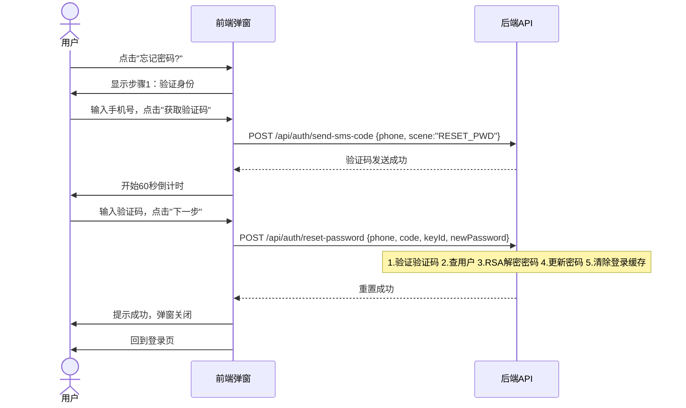

# 短信验证码重置密码功能设计

## 需求背景

通过手机验证码登录注册的用户，密码由系统随机生成（BCrypt 加密存储），用户无法得知密码，也无法通过账号密码方式登录。需要提供"忘记密码"功能，让用户通过手机验证码验证身份后自行设置新密码。

## 方案选型

**两步式弹窗**：弹窗分两步，先验证身份（手机号+验证码），通过后显示新密码输入框。

选择理由：安全性与体验平衡，符合"先验证身份再改密码"的常见模式。

## 业务流程



## 后端设计

### 新增 DTO

**ResetPasswordRequest**（放在 `ele-ai-tender-common/dto/request/`）：

| 字段 | 类型 | 校验 | 说明 |
|------|------|------|------|
| phone | String | `@NotBlank` + 手机号正则 | 手机号 |
| code | String | `@NotBlank` + 4-6位数字 | 短信验证码 |
| keyId | String | `@NotBlank` | RSA 密钥 ID |
| newPassword | String | `@NotBlank` + 6-20位 | RSA 加密后的新密码 |

### 修改 DTO

**SendSmsCodeRequest**：新增可选 `scene` 字段（String），默认 `LOGIN`，重置密码时传 `RESET_PWD`。

### 新增接口

**AuthController** `POST /api/auth/reset-password`（公开路径，无需登录）：

```java
@PostMapping("/reset-password")
@Operation(summary = "短信验证码重置密码")
public Result<Void> resetPassword(@Valid @RequestBody ResetPasswordRequest request) {
    authService.resetPasswordByPhone(request);
    return Result.success();
}
```

### 新增 Service 方法

**IAuthService** / **AuthServiceImpl**：

```java
void resetPasswordByPhone(ResetPasswordRequest request);
```

实现逻辑：
1. `smsService.verifyCode(phone, code)` 校验验证码
2. `userMapper.selectByPhone(phone)` 查用户，不存在抛 `BusinessException("该手机号未注册")`
3. `RsaKeyUtil.decryptPassword(keyId, newPassword)` 解密新密码
4. 新密码长度校验（6-20位）
5. `PasswordUtil.encode(newPassword)` 加密后更新用户密码
6. 清除该用户已登录的 Token/权限缓存（强制重新登录）

### 修改公开路径

**WebConfig**：在 `JwtAuthenticationFilter` 的排除路径列表中加入 `/api/auth/reset-password`。

### 修改发送验证码接口

**AuthController.sendSmsCode**：从 request 中取 scene 字段，传给 `smsService.sendSmsCode(phone, scene, ipAddress)`。

## 前端设计

### 新增组件

**ResetPasswordDialog.vue**（放在 `ele-ai-tender-frontend/src/components/auth/`）：

两步式弹窗：
- **步骤1 - 验证身份**：手机号输入框 + 验证码输入框(含获取验证码按钮) + "下一步"按钮
- **步骤2 - 设置新密码**：新密码输入框 + 确认密码输入框 + "确认重置"按钮

交互规则：
- 步骤1 点击"下一步"时，前端仅做基本校验（字段非空），验证码校验由后端 reset-password 接口完成
- 步骤2 点击"确认重置"时，校验两次密码一致，然后调用 reset-password API
- 重置成功后：提示"密码重置成功，请重新登录"，关闭弹窗
- 获取验证码：60秒倒计时，复用现有逻辑

### 修改 Login.vue

在账号密码表单的"记住密码"下方，添加"忘记密码?"链接，点击打开 ResetPasswordDialog。

### 修改 auth.ts

- `sendSmsCode` 增加 scene 参数
- 新增 `resetPassword(phone, code, newPassword)` 方法（内部获取 RSA 公钥并加密密码）

## 改动范围

| 文件 | 改动类型 | 说明 |
|------|----------|------|
| `common/.../dto/request/ResetPasswordRequest.java` | 新增 | 重置密码请求 DTO |
| `common/.../dto/request/SendSmsCodeRequest.java` | 修改 | 新增 scene 字段 |
| `support/.../controller/AuthController.java` | 修改 | 新增 reset-password 接口，修改 send-sms-code 取 scene |
| `support/.../service/IAuthService.java` | 修改 | 新增 resetPasswordByPhone 方法 |
| `support/.../service/impl/AuthServiceImpl.java` | 修改 | 实现 resetPasswordByPhone |
| `support/.../config/WebConfig.java` | 修改 | 公开路径加 /api/auth/reset-password |
| `frontend/src/components/auth/ResetPasswordDialog.vue` | 新增 | 重置密码弹窗组件 |
| `frontend/src/views/auth/Login.vue` | 修改 | 添加"忘记密码?"链接 |
| `frontend/src/api/auth.ts` | 修改 | sendSmsCode 加 scene，新增 resetPassword |
| `frontend/src/types/auth.ts` | 修改 | 类型定义更新 |
