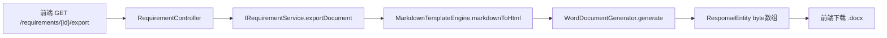

# 需求导出 Word 文档接口设计

## 问题

前端 `RequirementGenerate.vue` 调用 `GET /core-api/v1/requirements/{id}/export`，期望下载 .docx 文件（Blob），但后端 `RequirementController` 中没有此端点，接口 404。

## 决策

- **导出方式**：Markdown→HTML→Word（复用 flexmark + POI + jsoup 技术栈）
- **导出内容**：仅需求正文 Markdown 内容，不含元信息
- **实现方案**：core 模块直接生成（方案 A），不经过 file 模块

## 数据流



## 代码变更

### 1. core 模块 pom.xml — 无需变更

flexmark-all、jsoup 已在 core 模块中声明，poi-ooxml 通过 poi-tl 传递引入。

### 2. 复用已有引擎类（已移入 core 模块）

**MarkdownTemplateEngine**（`com.jy.eleaitender.core.engine.MarkdownTemplateEngine`）

- `markdownToHtml(String markdown)` — Markdown → HTML

**WordDocumentGenerator**（`com.jy.eleaitender.core.engine.WordDocumentGenerator`）

- `generate(Map<String, Object> documentData, String htmlContent)` — HTML → Word 字节数组
- 已支持渲染：h1-h6 / p / table / ul-ol / blockquote / hr / strong-em-u-code-a
- 文档标题取 `documentData.get("projectName")`，居中宋体加粗

### 3. RequirementController — 新增端点（变更编号顺延）

```java
@GetMapping("/{id}/export")
@RequireLogin
@Operation(summary = "导出需求文档")
public ResponseEntity<Resource> exportDocument(@PathVariable Long id) {
    // 调用 requirementService.exportDocument(id)
    // 返回 ResponseEntity.ok()
    //   .header(Content-Disposition, "attachment; filename=xxx.docx")
    //   .header(Content-Type, "application/vnd.openxmlformats-officedocument...")
    //   .body(new ByteArrayResource(bytes))
}
```

### 4. IRequirementService / RequirementServiceImpl

```java
// 接口
byte[] exportDocument(Long id);

// 实现
public byte[] exportDocument(Long id) {
    TbRequirement req = getById(id); // 不存在抛异常
    String content = req.getContent();
    if (content == null) content = "";
    String html = markdownTemplateEngine.markdownToHtml(content);
    Map<String, Object> data = Map.of("projectName", req.getRequirementName());
    return wordDocumentGenerator.generate(data, html);
}
```

## 接口定义

```
GET /api/v1/requirements/{id}/export
Authorization: Bearer <token>

→ 200 OK
  Content-Type: application/vnd.openxmlformats-officedocument.wordprocessingml.document
  Content-Disposition: attachment; filename="<requirementName>.docx"
  Body: Word 文件二进制流

→ 需求不存在
  { "code": 404, "msg": "需求不存在" }

→ 内容为空
  返回仅含标题的空 Word 文档（200 OK）
```

## 不涉及的变更

- common 模块不变（避免引入重依赖污染其他模块）
- file 模块不变（其引擎有项目文档特定逻辑，保持独立）
- 前端无需改动（API 路径和返回格式已正确）
