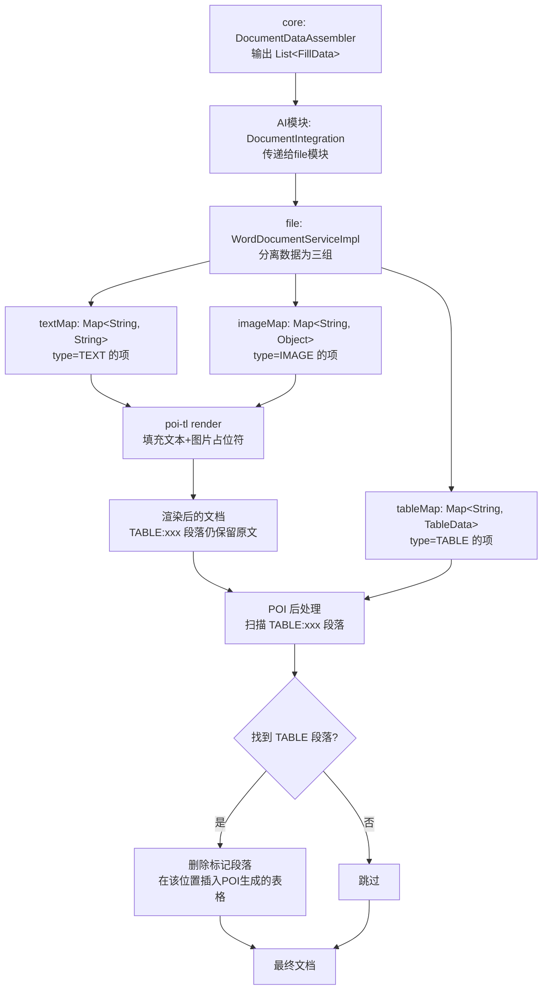

# 文档集成 FillData 格式标注方案设计

## Context

当前文档集成使用 poi-tl 统一渲染所有占位符，表格通过 `{{?items}}` 循环标签生成行，渲染后用 POI 后处理合并单元格。但 poi-tl 的 `refactorRun` 会将相邻标签（如 `{{?allReviewItems}}{{categoryName}}`）合并为一个标签，导致渲染报错。已尝试6种修复方案均失败，根因是 poi-tl 内部行为无法控制。

**新策略**：core 模块在组装填充数据时标注每项的格式类型（TEXT/TABLE/IMAGE），file 模块按类型选择生成方式——文本和图片仍走 poi-tl，表格绕过 poi-tl 直接用 POI 编程生成，彻底规避相邻标签合并 Bug。

## 核心决策

| 决策项 | 选择 | 理由 |
|--------|------|------|
| 数据模型 | 结构化 `List<FillData>` | 接口更清晰，type 显式声明 |
| 表格占位方式 | 独立段落 `{{TABLE:key}}` | 表头由代码生成，占位符仅标记位置 |
| 表格样式 | 硬编码默认样式 | 简单可控，后续可扩展 |
| IMAGE 类型 | 立即支持 | 完善三种类型体系 |
| 渲染策略 | 两阶段：poi-tl 渲染文本/图片 → POI 生成表格 | 各取所长 |

## 数据模型

### FillData（common 模块新增）

```java
package com.jy.eleaitender.common.dto;

import lombok.Data;

@Data
public class FillData {
    private FillType type;    // TEXT / TABLE / IMAGE
    private String key;       // 占位符名称
    private Object value;     // TEXT→String, TABLE→TableData, IMAGE→ImageData
}
```

### FillType 枚举

```java
package com.jy.eleaitender.common.dto;

public enum FillType {
    TEXT,    // 文本，poi-tl {{key}} 替换
    TABLE,   // 表格，POI 编程生成，模板中 {{TABLE:key}} 标记位置
    IMAGE    // 图片，poi-tl {{@key}} 替换
}
```

### TableData

```java
package com.jy.eleaitender.common.dto;

import lombok.Data;
import java.util.List;
import java.util.Map;

@Data
public class TableData {
    private List<ColumnDef> columns;                // 列定义（key+表头文本）
    private List<Map<String, String>> rows;         // 行数据，key 为 ColumnDef.key
    private List<MergeRule> mergeRules;             // 合并规则
}
```

### ColumnDef

```java
package com.jy.eleaitender.common.dto;

import lombok.Data;

@Data
public class ColumnDef {
    private String key;         // 列标识（英文，如 "categoryName"），用于行数据Map的key
    private String header;      // 表头显示文本（如 "类别"）
    private int width;          // 列宽（EMU，0=自动）
}
```

### MergeRule

```java
package com.jy.eleaitender.common.dto;

import lombok.Data;

@Data
public class MergeRule {
    private int columnIndex;            // 哪一列（0-based）
    private MergeStrategy strategy;     // 合并策略
}
```

### MergeStrategy 枚举

```java
package com.jy.eleaitender.common.dto;

public enum MergeStrategy {
    BY_SAME_TEXT    // 相邻相同文本合并
}
```

### ImageData

```java
package com.jy.eleaitender.common.dto;

import lombok.Data;

@Data
public class ImageData {
    private String base64;      // 图片Base64编码（与url二选一，JSON传输友好）
    private String url;         // 图片URL（与base64二选一）
    private int width;          // 宽度（EMU，0=自动）
    private int height;         // 高度（EMU，0=自动）
}
```

## 模板占位符语法

| 类型 | 语法 | 数据类型 | 渲染方式 |
|------|------|----------|----------|
| 文本 | `{{projectName}}` | String | poi-tl 替换 |
| 表格 | `{{TABLE:allReviewItems}}` | TableData | POI 编程生成（独立段落） |
| 图片 | `{{@sealImage}}` | ImageData | poi-tl 图片渲染 |

**模板示例**：

```
项目名称：{{projectName}}
项目编号：{{projectCode}}
预算金额：{{budget}}

{{TABLE:allReviewItems}}

联系人：{{contactPerson}}
```

## 渲染流程



### 两阶段渲染详细步骤

**阶段一：poi-tl 渲染文本和图片**

1. 将 `List<FillData>` 按 type 分组：
   - TEXT → `Map<String, String>` 传给 poi-tl
   - IMAGE → `Map<String, Object>` 转为 poi-tl 的 `PictureRenderData`
   - TABLE → 暂存，同时将 key 映射为 poi-tl 的占位符保留值
2. **关键**：为 TABLE 类型的占位符，在 poi-tl 的 data Map 中放入一个特殊标记值（如 `"__TABLE_PLACEHOLDER__allReviewItems"`），这样 poi-tl 会将其渲染为文本而非删除，阶段二可通过文本匹配定位
3. 预处理模板（清除修订标记、合并碎片 Run — 保留现有逻辑）
4. poi-tl compile + render
5. 此时文档中 `{{TABLE:allReviewItems}}` 被渲染为 `__TABLE_PLACEHOLDER__allReviewItems` 文本

**阶段二：POI 编程生成表格**

1. 打开渲染后的文档
2. 遍历所有段落，匹配 `__TABLE_PLACEHOLDER__xxx` 文本模式
3. 对每个匹配的段落：
   - 提取 key（如 `allReviewItems`）
   - 从 tableMap 中获取对应的 `TableData`
   - 删除该段落
   - 在该位置用 `TableGenerator` 插入完整表格
4. 保存最终文档

## TableGenerator 表格生成器

```java
package com.jy.eleaitender.file.engine;

public class TableGenerator {

    private static final String TABLE_PLACEHOLDER_PREFIX = "__TABLE_PLACEHOLDER__";

    /**
     * 扫描文档中的表格占位符段落并替换为生成的表格
     */
    public void replaceTablePlaceholders(XWPFDocument doc, Map<String, TableData> tableDataMap) {
        List<XWPFParagraph> paragraphs = doc.getParagraphs();
        // 从后往前遍历，避免位置偏移
        for (int i = paragraphs.size() - 1; i >= 0; i--) {
            String text = paragraphs.get(i).getText();
            if (text != null && text.startsWith(TABLE_PLACEHOLDER_PREFIX)) {
                String key = text.substring(TABLE_PLACEHOLDER_PREFIX.length());
                TableData tableData = tableDataMap.get(key);
                if (tableData != null) {
                    insertTable(doc, i, tableData);
                }
            }
        }
    }

    /**
     * 在指定位置插入表格
     */
    public void insertTable(XWPFDocument doc, int paragraphPos, TableData tableData) {
        // 1. 删除标记段落
        doc.removeBodyElement(paragraphPos);

        // 2. 在同一位置插入新表格
        XWPFTable table = doc.insertNewTable(paragraphPos);

        // 3. 生成表头行
        createHeaderRow(table, tableData.getColumns());

        // 4. 生成数据行（含合并）
        createDataRows(table, tableData);

        // 5. 应用默认样式
        applyDefaultStyle(table);
    }

    private void createHeaderRow(XWPFTable table, List<ColumnDef> columns) {
        XWPFTableRow headerRow = table.getRow(0);
        for (int i = 0; i < columns.size(); i++) {
            XWPFTableCell cell = headerRow.getCell(i);
            setCellText(cell, columns.get(i).getHeader());
            setBold(cell, true);
        }
    }

    private void createDataRows(XWPFTable table, TableData tableData) {
        List<Map<String, String>> rows = tableData.getRows();
        List<ColumnDef> columns = tableData.getColumns();
        List<MergeRule> rules = tableData.getMergeRules();

        // 合并状态追踪：每列记录当前合并区间
        Map<Integer, MergeInterval> mergeIntervals = new HashMap<>();

        for (int rowIdx = 0; rowIdx < rows.size(); rowIdx++) {
            XWPFTableRow row = table.createRow();
            Map<String, String> rowData = rows.get(rowIdx);

            for (int colIdx = 0; colIdx < columns.size(); colIdx++) {
                String cellText = rowData.getOrDefault(columns.get(colIdx).getKey(), "");
                XWPFTableCell cell = row.getCell(colIdx);
                setCellText(cell, cellText);

                // 处理该列的合并逻辑
                processMerge(cell, colIdx, cellText, rowIdx, mergeIntervals, rules, table);
            }
        }

        // 收尾：处理最后一批合并区间
        finalizeMerges(mergeIntervals, table, rules);
    }
}
```

## 改动范围

### common 模块（5个新增文件 + 1个修改）

| 文件 | 操作 | 说明 |
|------|------|------|
| `dto/FillData.java` | 新增 | 填充数据项 |
| `dto/FillType.java` | 新增 | 填充类型枚举 |
| `dto/TableData.java` | 新增 | 表格数据（含 ColumnDef） |
| `dto/ColumnDef.java` | 新增 | 列定义（key + header + width） |
| `dto/ImageData.java` | 新增 | 图片数据 |
| `client/InternalFileServiceClient.java` | 修改 | `generateDocument` 参数从 `Map<String,Object>` 改为 `List<FillData>` |

### core 模块（2个修改文件）

| 文件 | 操作 | 说明 |
|------|------|------|
| `engine/DocumentDataAssembler.java` | 修改 | `assemble()` 返回 `List<FillData>`，评审项数据构造为 `TableData` |
| `service/impl/DocumentIntegrationServiceImpl.java` | 修改 | 适配 `List<FillData>` 数据结构 |

### ai 模块（1个修改文件）

| 文件 | 操作 | 说明 |
|------|------|------|
| `processor/generator/DocumentIntegration.java` | 修改 | 传递 `List<FillData>` 给 file 模块 |

### file 模块（4个文件）

| 文件 | 操作 | 说明 |
|------|------|------|
| `engine/TableGenerator.java` | 新增 | POI 编程生成表格 |
| `engine/WordTemplateEngine.java` | 修改 | 简化：移除 `renderFromCleaned`/`applyCellMerges`，保留 `render` 和 `cleanTemplate` |
| `service/impl/WordDocumentServiceImpl.java` | 修改 | 新渲染流程：分离数据 → poi-tl 渲染 → POI 表格生成 |
| `controller/FileController.java` | 修改 | 适配 `List<FillData>` 请求参数 |
| `engine/MergeConfig.java` | 删除 | 不再需要，合并规则在 TableData 中 |

## 验证方式

1. **编译验证**：`mvn clean compile` 通过（common 模块先 install）
2. **模板渲染测试**：
   - 准备含 `{{projectName}}`、`{{TABLE:allReviewItems}}`、`{{@sealImage}}` 的模板
   - 调用 `generateDocument` 接口
   - 验证生成的文档中文本替换正确、表格生成正确（含表头和数据行）、单元格合并正确
3. **回归测试**：
   - 不含表格的模板仍正常渲染
   - 旧的 `render()` 方法仍可用于纯文本模板
4. **边界测试**：
   - 表格数据为空（0行）
   - 多个 TABLE 占位符
   - IMAGE 数据使用 bytes 和 url 两种方式

## 迁移策略

- `DocumentDataAssembler` 同时保留旧的 `assembleAsMap()` 和新的 `assembleAsFillDataList()` 方法，平滑过渡
- `InternalFileServiceClient` 保留旧方法签名，新增重载方法
- 确认所有调用方迁移后，再删除旧方法
