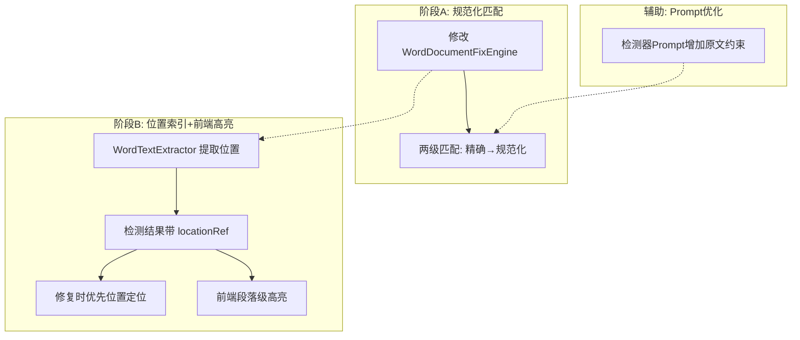

# 检测原文模糊匹配设计

## 问题描述

智能检测结果中的 `original` 原文与 Word 文档实际文本存在格式差异（空格、换行、全角半角等），导致 `WordDocumentFixEngine` 使用 `String.contains()` 精确匹配时超过 50% 的问题项匹配失败，`handleStatus=3`（未找到原文）。

### 差异来源

1. **Run 合并问题**：Word 同一段落由多个 Run 组成，提取纯文本和 `paragraph.getText()` 返回的文本之间有空格/换行差异
2. **AI 改写问题**：AI 模型返回 `original` 字段时，可能添加或删除了换行、空格

## 解决方案：渐进式两阶段

### 阶段 A：规范化模糊匹配（立即实施）

在 `WordDocumentFixEngine` 中，将精确匹配改为两级匹配策略。

#### 两级匹配流程

```
Level 1: 精确匹配 → String.contains(original)
  ↓ 未命中
Level 2: 规范化匹配 → normalize(text).contains(normalize(original))
  ↓ 未命中
返回未找到 (handleStatus=3)
```

#### 规范化规则

```java
static String normalize(String text) {
    if (text == null) return "";
    // 移除所有空白字符（包括普通空白、换行、制表符、不间断空格U+00A0、全角空格U+3000）
    // 中文文本中空格/换行通常是格式差异，移除后比较可消除这些差异
    return text.replaceAll("[\\s\\u00A0\\u3000]+", "");
}
```

#### 修改文件

| 文件 | 改动 |
|------|------|
| `ele-ai-tender-file/.../WordDocumentFixEngine.java` | 新增 `normalize()` 方法，`replaceInParagraph()` 中精确匹配失败后尝试规范化匹配 |

#### 规范化匹配的替换逻辑

规范化匹配确认段落包含目标文本后，需要在**原始文本**中定位并替换：

1. 对段落原始文本和 original 都做规范化
2. 在规范化后的段落文本中找到 original 的起止位置
3. 将规范化位置映射回原始文本位置（逐字符推进，跳过空白差异）
4. 在原始文本的对应位置执行替换

### 阶段 B：位置索引 + 前端高亮（后续实施）

#### 新增 WordTextExtractor

提取 Word 文档文本时，同时记录每段文本的位置索引：

```
段落0: {paragraphIndex: 0, text: "第一章 招标公告"}
段落1: {paragraphIndex: 1, text: "1.1 项目概况"}
表格0单元格(0,0): {tableIndex: 0, row: 0, col: 0, text: "项目名称"}
```

#### 检测结果增加 locationRef

在 `DetectionIssueVO` 和结果 JSON 中增加位置引用字段：

```json
{
  "original": "招标人可以在招标文件中要求投标人提供担保",
  "targeted": "招标人可以在招标文件中要求投标人提交投标保证金",
  "locationRef": {
    "paragraphIndex": 5,
    "segmentIndex": 2
  }
}
```

#### 修复时优先位置定位

```
有 locationRef → 定位到指定段落 → 段落内精确/规范化匹配
无 locationRef → 全文档精确/规范化匹配（兼容旧数据）
```

#### 前端段落级高亮

1. 用 `docx-preview` 渲染 Word 文档
2. 根据 `paragraphIndex` 找到对应段落 DOM
3. 段落内搜索 `original` 文本用 `<mark>` 高亮

#### 修改文件

| 文件 | 改动 |
|------|------|
| `ele-ai-tender-file/` 新增 `WordTextExtractor.java` | 提取文本 + 位置索引 |
| `ele-ai-tender-ai/.../BaseDetector.java` | 提取时传位置索引给 AI |
| `ele-ai-tender-common/.../DetectionIssueVO.java` | 加 `locationRef` 字段 |
| `ele-ai-tender-core/.../DetectionServiceImpl.java` | 修复时使用位置索引 |
| `ele-ai-tender-frontend/.../DetectionReport.vue` | Word 预览高亮定位 |

### 辅助：AI Prompt 优化

在各检测器的 Prompt 中增加原文约束：

```
重要规则：original 字段必须是从原文中逐字复制的，不得添加、删除或修改任何字符，
包括空格、换行和标点符号。如果原文中有换行，original 中也必须保留相同的换行。
```

## 整体架构



## 兼容性

- 阶段 A 完全向后兼容，不改变数据结构，只改匹配逻辑
- 阶段 B 的 `locationRef` 为可选字段，旧检测结果无此字段时走全文档匹配兜底
- 前端高亮功能渐进增强，不影响现有检测结果展示
