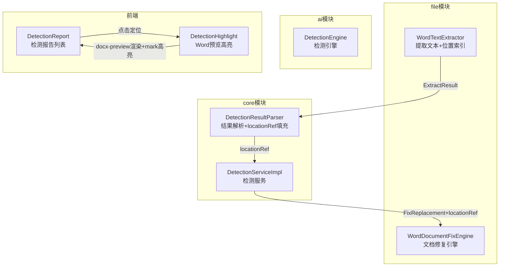
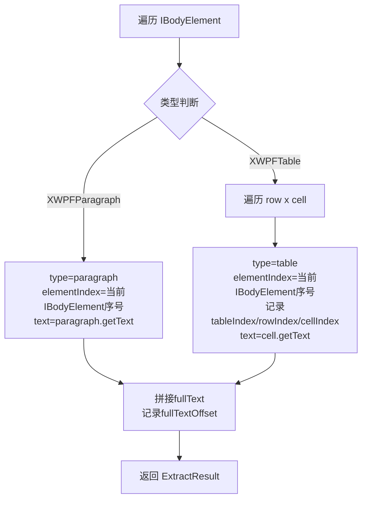
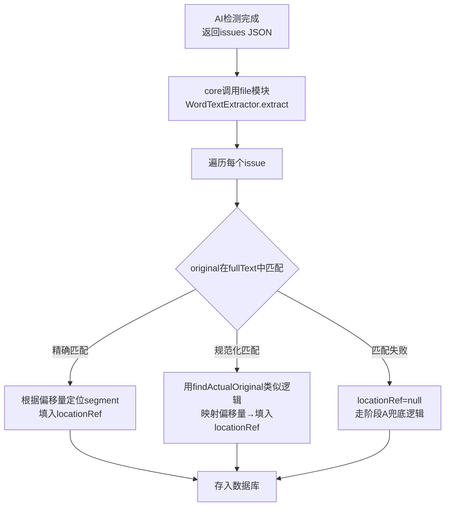
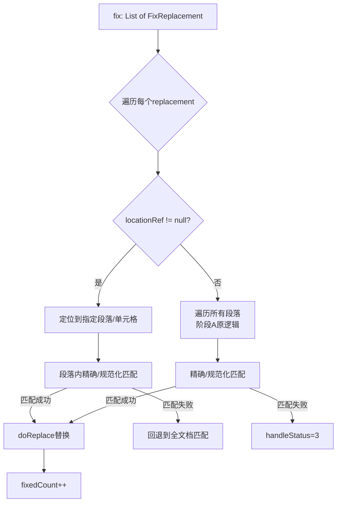
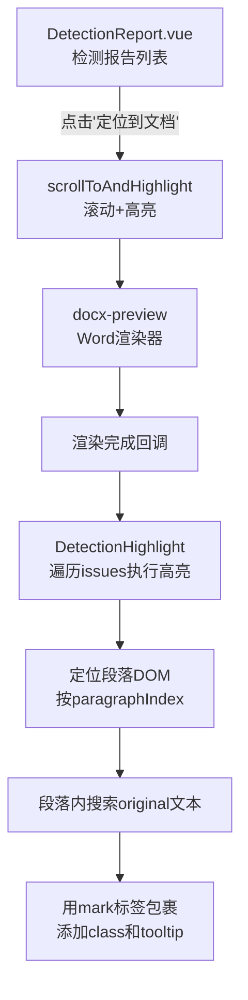

# 检测位置索引与前端高亮 — 阶段B设计文档

> 创建时间: 2026-04-29 | 状态: 设计确认

## 背景

阶段A（规范化模糊匹配）已实现，解决了检测原文因空格/换行差异匹配失败的问题。但仍有以下不足：

1. **修复定位慢**：全文档遍历匹配，段落越多越慢
2. **多处匹配风险**：短原文可能在文档多处命中，`String.replace()` 替换所有匹配项
3. **前端无定位**：检测报告只有文字列表，用户无法直观看到问题在文档中的位置

阶段B通过**段落级位置索引**解决这些问题。

## 目标

| 目标 | 度量 |
|------|------|
| 修复定位速度 | O(n) → O(1)，直接定位段落 |
| 多处匹配精准 | 优先替换指定段落内的匹配项 |
| 前端可视化 | Word预览中行内高亮问题文本 |

## 架构



## 一、数据结构

### 1.1 locationRef 定义

嵌入检测结果JSON的每个issue中，不新增数据库字段。

```json
{
  "original": "限额以下工程",
  "targeted": "政府采购服务",
  "locationRef": {
    "type": "paragraph",
    "elementIndex": 3
  }
}
```

表格类型：

```json
{
  "locationRef": {
    "type": "table",
    "elementIndex": 5,
    "tableIndex": 0,
    "rowIndex": 2,
    "cellIndex": 1
  }
}
```

### 1.2 后端VO

`LocationRefVO` 作为 common 模块独立类，供 `DetectionIssueVO` 和 `FixReplacement` 共用：

```java
// common模块，com.jy.eleaitender.common.dto
@Data
public class LocationRefVO {
    private String type;            // "paragraph" | "table"
    private Integer elementIndex;   // IBodyElement 序号（文档顶层元素序号）
    private Integer tableIndex;     // 表格序号（table类型，在IBodyElement中的表格序号）
    private Integer rowIndex;       // 行序号（table类型）
    private Integer cellIndex;      // 列序号（table类型）
}
```

**关键**：`elementIndex` 是文档顶层 `IBodyElement` 的序号（段落和表格共享），不是段落专用序号。这样后端通过 `doc.getBodyElements().get(elementIndex)` 即可定位，无需区分段落/表格的索引空间。

### 1.3 前端类型

```typescript
interface DetectionIssueVO {
  // ... 现有字段
  locationRef?: {
    type: 'paragraph' | 'table'
    elementIndex?: number
    tableIndex?: number
    rowIndex?: number
    cellIndex?: number
  }
}
```

### 1.4 向后兼容

- 旧数据没有 `locationRef` 字段，为 `null`
- 修复时无 `locationRef` 走阶段A全文档匹配逻辑
- 前端无 `locationRef` 时不显示"定位到文档"按钮
- `elementIndex` 是 IBodyElement 序号，段落和表格共享同一序号空间，后端通过 `doc.getBodyElements().get(elementIndex)` 统一定位

## 二、WordTextExtractor

### 2.1 职责

提取Word文档的文本+位置索引，供后端匹配 `locationRef`。

### 2.2 数据结构

```java
public class WordTextExtractor {

    @Data
    public static class ExtractResult {
        private List<TextSegment> segments;  // 有序文本段
        private String fullText;              // 全文拼接（匹配用）
    }

    @Data
    public static class TextSegment {
        private String type;          // "paragraph" | "table"
        private int elementIndex;     // IBodyElement 序号（文档顶层元素序号）
        private Integer tableIndex;   // 表格序号（table类型）
        private Integer rowIndex;     // 行序号（table类型）
        private Integer cellIndex;    // 列序号（table类型）
        private String text;          // 该段文本
        private int fullTextOffset;   // 在 fullText 中的起始偏移量
    }
}
```

### 2.3 提取逻辑



**关键**：`elementIndex` 是 IBodyElement 的序号，段落和表格共享。后端通过 `doc.getBodyElements().get(elementIndex)` 即可统一定位。前端 docx-preview 渲染后，DOM 元素按 `elementIndex` 顺序排列，可直接映射。

### 2.4 匹配算法

```
1. extract() 得到 ExtractResult（segments + fullText）
2. 对每个检测 issue 的 original:
   a. 精确匹配: fullText.indexOf(original)
   b. 规范化匹配: normalize(fullText).indexOf(normalize(original)) → 映射回原文偏移
3. 根据偏移量在 segments 中二分查找 → 定位 TextSegment → 填入 locationRef
4. 多处匹配取第一个（与当前 replace 行为一致）
```

### 2.5 放置位置

`ele-ai-tender-file` 模块，与 `WordDocumentFixEngine` 同包（`com.jy.eleaitender.file.engine`）。

## 三、locationRef 填充策略（混合策略）

### 3.1 填充时机

检测完成后、结果存入数据库前，core 模块调用 file 模块提取文本并填充。

### 3.2 填充流程



### 3.3 API 设计

file 模块新增接口：

```
POST /api/v1/file/word/extract-text
请求: { fileId: Long }
响应: { segments: [...], fullText: "..." }
```

core 模块调用 `fileServiceClient.extractText(fileId)` 获取 `ExtractResult`，在本地完成匹配和填充。

## 四、修复引擎改造

### 4.1 FixReplacement 扩展

```java
@Data
public class FixReplacement {
    private String original;
    private String targeted;
    private LocationRefVO locationRef;  // 新增，可为null
}
```

### 4.2 WordDocumentFixEngine.fix() 改造



### 4.3 定位逻辑

使用 `elementIndex` 通过 `IBodyElement` 统一定位，不再区分段落/表格的索引空间：

```java
private XWPFParagraph locateParagraph(XWPFDocument doc, LocationRefVO ref) {
    IBodyElement element = doc.getBodyElements().get(ref.getElementIndex());
    if ("paragraph".equals(ref.getType()) && element instanceof XWPFParagraph) {
        return (XWPFParagraph) element;
    } else if ("table".equals(ref.getType()) && element instanceof XWPFTable) {
        XWPFTable table = (XWPFTable) element;
        XWPFTableRow row = table.getRow(ref.getRowIndex());
        XWPFTableCell cell = row.getCell(ref.getCellIndex());
        return cell.getParagraphs().get(0);
    }
    return null;  // 定位失败，回退到全文档匹配
}
```

## 五、前端段落级高亮

### 5.1 组件架构



### 5.2 高亮实现

1. **定位段落DOM**：docx-preview 渲染后，段落按顺序生成 `<p>` 元素。通过 `paragraphIndex` 找到目标段落。

2. **行内高亮**：在段落 DOM 内用 `TreeWalker` 或 `Range API` 搜索 `original` 文本，用 `<mark>` 包裹。

3. **颜色编码**：
   - 高风险(HIGH)：红色 `#ffcdd2` 背景 + `#f44336` 下划线
   - 中风险(MEDIUM)：橙色 `#ffe0b2` 背景 + `#ff9800` 下划线
   - 低风险(LOW)：蓝色 `#bbdefb` 背景 + `#2196f3` 下划线

4. **交互**：
   - 点击高亮文本 → 弹出操作气泡（接受/拒绝/关闭）
   - 接受后 → 调用API → 移除高亮 → 更新列表状态

5. **滚动定位**：
   - 点击"📍 定位到文档"按钮 → `scrollIntoView({ behavior: 'smooth', block: 'center' })`
   - 定位后添加脉冲动画 `animation: pulse 1.5s 2` 吸引注意力

### 5.3 改造点

| 组件 | 改动 |
|------|------|
| `DetectionReport.vue` | 新增"定位到文档"按钮，点击调用 scrollToAndHighlight |
| 新增 `useDetectionHighlight.ts` | composable，封装高亮逻辑 |
| `detection.ts` 类型 | 新增 `locationRef` 字段 |
| `DetectionReport.vue` 样式 | 新增 `.detection-highlight` / `.detection-highlight--pulse` CSS |

### 5.4 边界情况

- **段落内多处匹配**：高亮第一个匹配项（与修复引擎行为一致）
- **原文跨段落**：`locationRef` 指向原文起始段落，高亮起始部分
- **docx-preview DOM不稳定**：段落索引基于渲染顺序，docx-preview 版本变更需回归测试
- **无 locationRef**：不显示"定位到文档"按钮，保持当前行为

## 六、实施顺序

先后端再前端：

```
第1步: WordTextExtractor（file模块）
第2步: LocationRefVO + FixReplacement 扩展（common模块）
第3步: 匹配填充逻辑（core模块）
第4步: 修复引擎改造（file模块）
第5步: 后端联调测试
第6步: 前端类型+高亮组件（frontend）
第7步: 前端联调测试
```

## 七、文件改动清单

| 文件 | 模块 | 改动 |
|------|------|------|
| `WordTextExtractor.java` | file | 新增：文本提取+位置索引 |
| `WordDocumentFixEngine.java` | file | 改造：支持 locationRef 定位 |
| `LocationRefVO.java` | common | 新增：独立位置索引VO（供DetectionIssueVO和FixReplacement共用） |
| `FixReplacement.java` | common | 改造：新增 locationRef 字段 |
| `DetectionIssueVO.java` | core | 改造：新增 locationRef 字段 |
| `DetectionServiceImpl.java` | core | 改造：检测完成后填充 locationRef |
| `DetectionResultParser.java` | core | 改造：解析/填充 locationRef |
| `InternalFileServiceClient.java` | core | 改造：新增 extractText 调用 |
| `FileController.java` | file | 新增：extract-text 接口 |
| `detection.ts` | frontend | 改造：新增 locationRef 类型 |
| `DetectionReport.vue` | frontend | 改造：定位按钮+高亮交互 |
| `useDetectionHighlight.ts` | frontend | 新增：高亮逻辑composable |

## 八、风险与缓解

| 风险 | 缓解措施 |
|------|----------|
| docx-preview DOM结构不稳定 | 段落索引基于渲染顺序，封装定位逻辑便于适配 |
| 段落内文本搜索匹配到错误位置 | 利用 locationRef 约定搜索范围，短文本需人工确认 |
| 旧数据无 locationRef | null 兼容，走阶段A逻辑 |
| 表格内段落定位复杂 | 先支持简单段落，表格作为扩展按需实现 |
