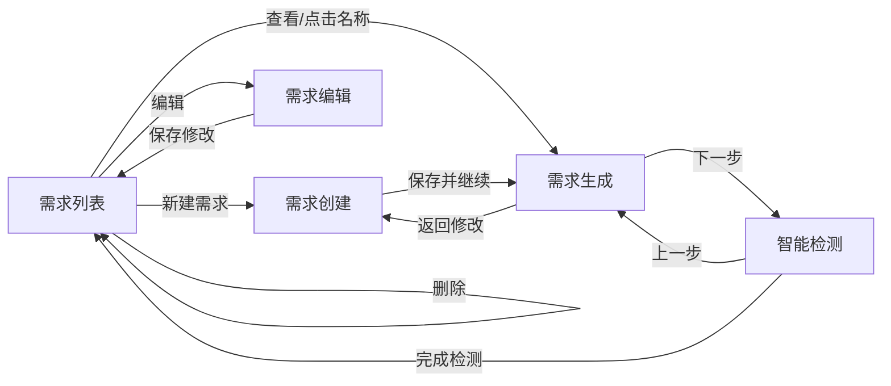

# 编制业务需求模块 - 前端页面还原设计

> 基于 `docs/projects/招标文件AI编制系统_原型设计/` 下的5个HTML原型文件，全面还原编制业务需求模块的前端页面。

## 一、设计目标

将现有5个业务需求页面全面重构，使UI布局和交互逻辑与原型设计一致。现有页面仅有基础功能骨架，原型设计提供了完整的交互细节、表单字段、页面跳转关系等。

## 二、路由变更

| 旧路由 | 新路由 | 页面组件 | 说明 |
|--------|--------|----------|------|
| `/requirement/edit/:id` | `/requirement/editor/:id` | RequirementEditor | 内容编辑器保留，路径变更 |
| — | `/requirement/edit/:id` | RequirementEdit | **新增**元数据编辑表单页 |

## 三、页面改动清单

### 3.1 RequirementList.vue（小改）

| 改动项 | 现有 | 原型目标 |
|--------|------|----------|
| 表头标题 | "需求编制" | "编制业务需求" |
| 表格列 | 需求名称/项目类型/预算/状态/进度/时间/操作 | 项目名称/项目类型/项目预算(万元)/完成进度/创建时间/操作 |
| 操作按钮 | 查看/生成/检测/删除 | 查看/删除 |
| 分页文案 | 标准Element | "共 X 条记录，当前显示第 M-N 条" |

**核心变更**：
1. 表头改为"编制业务需求"
2. 移除状态列，操作列只保留查看+删除
3. 分页增加自定义文案
4. 项目名称列点击跳转到 `/requirement/generate/:id`

### 3.2 RequirementCreate.vue（大改）

| 改动项 | 现有 | 原型目标 |
|--------|------|----------|
| 表单结构 | 单一表单5字段 | 分两节：基本信息5字段+匹配模式 |
| 项目类型 | 3选项 | 带子分类（服务类下4个子类） |
| 匹配模式 | 简单radio+上传 | 三种模式完整UI |
| 手动选择 | 无 | 文件卡片列表+匹配度+预览 |
| 底部按钮 | 提交+取消 | 返回列表+取消+保存并继续 |
| AI开关 | 有 | 无 |

**核心变更**：
1. 移除AI辅助开关
2. 项目类型增加子分类选项（服务类 → 物业/IT服务/咨询服务/维保服务）
3. 匹配模式拆分为独立组件 `MatchModePanel`：
   - 自动匹配：说明文字
   - 手动选择：调用API获取匹配文件列表，展示文件卡片（含匹配度百分比、预览按钮、选择按钮，单选）
   - 上传：拖拽上传区（仅doc/docx，单文件50MB）
4. 底部按钮改为：返回列表、取消、保存并继续
5. 保存并继续后跳转到生成页

### 3.3 RequirementEdit.vue（新建）

基于原型 `business-requirement-edit.html`，全新创建。

**表单结构**：
1. **业务需求基本信息**：项目名称、项目类型（3选项）、项目预算(万元)、需求类型（新增需求/修改需求/延续需求）、项目基本情况描述
2. **参考文件选择**：三种模式
   - 系统自动匹配：说明文字 + "开始匹配"按钮
   - 系统匹配用户选择：checkbox多选文件列表 + 预览按钮
   - 本地上传：拖拽上传区（doc/docx/pdf）
3. **资格要求**：动态列表，可增删，最少1条

**路由**：`/requirement/edit/:id` → `RequirementEdit.vue`

**复用组件**：匹配模式面板（编辑页模式不同：多选checkbox vs 单选卡片），资格要求独立组件 `QualificationList`。

### 3.4 RequirementGenerate.vue（大改）

| 改动项 | 现有 | 原型目标 |
|--------|------|----------|
| 生成进度 | 无 | 进度条+状态标签 |
| 内容结构 | 纯Markdown预览/编辑 | 结构化：基本信息+参考文件+需求详情+关键标签 |
| 操作按钮 | AI生成+切换编辑 | 保存+编辑+导出 |
| AI反馈 | 无 | 赞/踩反馈按钮 |
| AI助手 | 右侧固定面板 | 浮动可折叠面板 |
| 底部导航 | 无 | 返回修改+下一步：智能检测 |

**核心变更**：
1. 新增生成进度区域（进度条+百分比+状态标签）
2. 内容区改为结构化展示：项目基本信息卡片 → 参考文件列表 → 业务需求详情（Markdown预览/编辑切换） → 关键标签
3. 操作按钮改为：保存、编辑、导出
4. AI反馈：内容下方增加赞/踩按钮
5. 底部增加导航按钮：返回修改、下一步：智能检测
6. AI助手面板改为浮动可折叠样式

### 3.5 RequirementDetect.vue（中改）

| 改动项 | 现有 | 原型目标 |
|--------|------|----------|
| 页面结构 | 检测卡片+结果列表 | 4个卡片：进度+汇总+详情+结论 |
| 检测汇总 | 无 | 错别字X个+敏感词Y个 |
| 重新检测 | 无 | 有重新检测按钮 |
| 接受/拒绝 | 禁用 | 功能可用 |
| 查看原文 | 无 | 有查看原文按钮 |
| 检测结论 | 无 | 总结文字+导航按钮 |

**核心变更**：
1. 重构为4个卡片区域布局
2. 新增检测结果汇总卡片
3. 新增检测结论卡片（含总结+上一步/完成检测按钮）
4. 启用接受/拒绝建议功能（调用后端API）
5. 新增查看原文功能（弹窗显示原文上下文）
6. 新增重新检测功能

## 四、共享组件设计

### 4.1 MatchModePanel

**位置**：`src/components/requirement/MatchModePanel.vue`

**Props**：
```typescript
interface Props {
  modelValue: string           // 当前选中的匹配模式
  matchFiles?: MatchFile[]     // 手动选择的文件列表
  selectedFileId?: number      // 手动模式选中的文件ID（create单选）
  selectedFileIds?: number[]   // 手动模式选中的文件IDs（edit多选）
  uploadAccept?: string        // 上传接受的文件类型
  uploadLimit?: number         // 上传文件数量限制
  mode: 'create' | 'edit'     // 区分创建页和编辑页的交互差异
}
```

**Emits**：`update:modelValue`, `update:selectedFileId`, `update:selectedFileIds`, `file-preview`

### 4.2 FileCard

**位置**：`src/components/requirement/FileCard.vue`

**Props**：
```typescript
interface Props {
  file: MatchFile              // 文件信息
  matchPercent?: number        // 匹配度百分比
  selectable?: boolean         // 是否可选中
  selected?: boolean           // 是否已选中
  selectionMode?: 'single' | 'multi'  // 选择模式
}
```

**Emits**：`select`, `preview`

### 4.3 QualificationList

**位置**：`src/components/requirement/QualificationList.vue`

**Props**：
```typescript
interface Props {
  modelValue: string[]         // 资格要求列表
  minItems?: number            // 最小条目数，默认1
}
```

**Emits**：`update:modelValue`

## 五、类型定义扩展

```typescript
// src/types/requirement.ts 新增

/** 匹配文件信息 */
interface MatchFile {
  id: number
  fileName: string
  fileType: string       // 工程类/货物类/服务类
  budget?: number        // 预算
  matchPercent?: number  // 匹配度
  matchDesc?: string     // 匹配说明
  uploadTime?: string    // 上传时间
}

/** 需求类型枚举 */
type RequirementType = 'NEW' | 'MODIFY' | 'CONTINUE'

/** 需求创建参数扩展 */
interface RequirementCreateParams {
  requirementName: string
  projectCategory: string
  projectType: string
  projectSubType?: string       // 新增：项目子类型
  budget?: number
  requirementDescription?: string
  matchMode: string
  matchedFileId?: number        // 手动选择/自动匹配的文件ID
  uploadedFileId?: number       // 上传的文件ID
}

/** 需求编辑参数 */
interface RequirementEditParams {
  requirementName: string
  projectType: string
  budget?: number
  requirementType: RequirementType
  requirementDescription?: string
  matchMode: string
  matchedFileIds?: number[]     // 多选文件IDs
  uploadedFileId?: number
  qualifications: string[]      // 资格要求列表
}
```

## 六、API扩展

```typescript
// src/api/requirement.ts 新增

/** 获取匹配文件列表 */
getMatchFiles(params: { requirementId?: number; keyword?: string }) {
  return request.get<any, MatchFile[]>('/core-api/v1/requirements/match-files', { params })
}

/** 预览匹配文件 */
previewMatchFile(fileId: number) {
  return request.get<any, any>(`/core-api/v1/requirements/match-files/${fileId}/preview`)
}

/** 导出需求文档 */
exportDocument(id: number) {
  return request.get<any, Blob>(`/core-api/v1/requirements/${id}/export`, { responseType: 'blob' })
}
```

## 七、页面导航关系



## 八、实施顺序

1. **类型定义和API扩展** — 更新 types/requirement.ts, api/requirement.ts
2. **共享组件** — MatchModePanel, FileCard, QualificationList
3. **路由调整** — 修改 router/index.ts
4. **RequirementList.vue** — 小改
5. **RequirementCreate.vue** — 大改
6. **RequirementEdit.vue** — 新建
7. **RequirementGenerate.vue** — 大改
8. **RequirementDetect.vue** — 中改

---

*设计文档生成时间: 2026-04-15*
*基于原型设计版本: V1.0*
