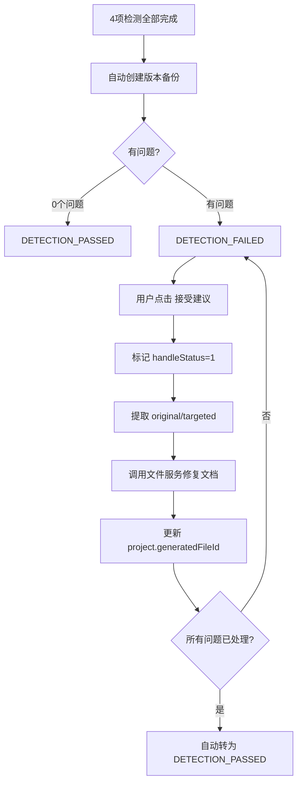

# 对话上下文：智能检测修复功能实现

> 生成时间: 2026-04-27 11:33 | 状态: 待确认

---

## 📋 问题背景

**项目**: 招标文件AI编制工具（ele-ai-tender）
**涉及模块**: core(8082) / file(8081) / common / 前端(5173)
**涉及阶段**: 项目编制第5阶段 — 智能检测(DETECTION)

项目级智能检测有4项检测（敏感词/错别字/政策文件审查/格式规范检测），检测完成后前端展示报告，用户可"接受建议"或"拒绝建议"。但当前"接受建议"仅标记 `handleStatus` 状态，**不修改任何文档内容**，修复闭环断裂。

对比需求级检测（2项）已有完整的 `acceptDetectionIssue()` 自动替换原文逻辑，项目级缺失。

## 🔴 核心问题

1. **项目级"接受建议"不修复文档** — `DetectionServiceImpl.acceptIssue()` 只调用 `updateIssueHandleStatus()`，不修改 `project.generatedFileId` 对应的 .docx 文件
2. **前后端检测类型枚举不一致** — 前端用 `FAIRNESS`/`COMPLIANCE`，后端用 `POLICY_REVIEW`/`FORMAT_CHECK`
3. **DETECTION_FAILED 无法转回 PASSED** — 状态机只允许 `FAILED → IN_PROGRESS`（重试），处理后无法转通过
4. **无版本备份** — 修复文档前无备份机制

## 🎯 实现目标

1. 检测完成时自动创建项目版本备份
2. 接受建议时直接修改 Word 文档（接受即修复，非批量确认）
3. 所有问题处理完毕后自动转为 DETECTION_PASSED
4. 修复前后端检测类型枚举不一致

## 🔧 技术约束

- 修复方式：直接修改 .docx 文件（非修改源内容+重生成）
- 文件模块负责所有 Word 文档操作，core 模块通过 `InternalFileServiceClient` 调用
- `TbProjectVersion` 已有版本备份机制，直接复用
- Apache POI `XWPFDocument` 处理多 Run 文本合并替换
- 每次修复生成新文件（新 fileId），旧文件保留作为版本快照

## ✅ 最终方案

### 整体流程



### 核心机制

1. **接受即修复**: `acceptIssue()` 中提取 issue 的 original/targeted → 调用 `fileServiceClient.fixDocument()` → 更新 `generatedFileId`
2. **WordDocumentFixEngine**: 基于 POI 合并段落 Runs → 查找 original → 替换为 targeted → 重建 Runs
3. **tryTransitionToPassed**: 每次 accept/reject 后检查是否所有 handleStatus≠0，自动转 PASSED
4. **版本备份**: `AiTaskResultSyncHandler` 中检测完成时自动创建 `TbProjectVersion`

### 文件名策略

- 首次修复: `fixed_1745789000000_招标文件.docx`
- 再次修复: 用正则去掉旧的 `fixed_时间戳_` 前缀，拼接新时间戳

## 📝 关键代码变更

### 新建文件 (3个)

| 文件 | 说明 |
|------|------|
| `common/src/.../dto/FixReplacement.java` | 替换项 DTO: original + targeted |
| `common/src/.../dto/response/WordFixResultVO.java` | 修复结果: fileId + fixedCount + failedCount |
| `file/src/.../engine/WordDocumentFixEngine.java` | POI 文本替换引擎，处理段落/表格/页眉页脚 |

### 修改文件 (11个)

| 文件 | 变更 |
|------|------|
| `core/statemachine/ProjectStateMachine.java` | 增加 `DETECTION_FAILED → DETECTION_PASSED` 转换 |
| `core/util/DetectionResultParser.java` | 新增 `parseAcceptedReplacements()` + `hasUnresolvedIssues()` |
| `core/scheduler/AiTaskResultSyncHandler.java` | 注入 `IProjectVersionService`，检测完成时创建版本快照 |
| `core/service/impl/DetectionServiceImpl.java` | 注入 `InternalFileServiceClient` + `IProjectVersionService`；改造 `acceptIssue()` 加入文档修复；改造 `acceptAll()` 批量修复；新增 `tryTransitionToPassed()` |
| `file/service/IWordDocumentService.java` | 新增 `fixDocument()` 方法 |
| `file/service/impl/WordDocumentServiceImpl.java` | 实现 `fixDocument()`：读文件→fixEngine→上传新文件 |
| `file/controller/FileController.java` | 新增 `POST /api/file/fix-doc` 端点 |
| `common/client/InternalFileServiceClient.java` | 新增 `fixDocument()` + `parseFixResultResponse()` |
| `frontend/src/types/detection.ts` | 移除 `FAIRNESS`/`COMPLIANCE`，保留 `POLICY_REVIEW`/`FORMAT_CHECK` |
| `frontend/src/views/project/phases/PhaseDetection.vue` | 修复 checkbox 值；`canFinish` 要求 PASSED/SKIPPED；accept/reject 后刷新项目状态 |
| `frontend/src/components/detection/DetectionReport.vue` | typeMap 改为 `POLICY_REVIEW`/`FORMAT_CHECK` |

## 🎯 当前进度

| 步骤 | 状态 |
|------|------|
| Step 1: 状态机增加 FAILED→PASSED | ✅ 已完成 |
| Step 2: 新增 DTO | ✅ 已完成 |
| Step 3: WordDocumentFixEngine | ✅ 已完成 |
| Step 4-5: 文件服务 fixDocument + Client | ✅ 已完成 |
| Step 6: DetectionResultParser 辅助方法 | ✅ 已完成 |
| Step 7: 检测完成自动版本备份 | ✅ 已完成 |
| Step 8-9: acceptIssue/acceptAll 改造 | ✅ 已完成 |
| Step 10-11: 前端类型修复和状态驱动 | ✅ 已完成 |
| 后端编译验证 | ✅ common + file + core 全部编译通过 |
| 前端类型检查 | ✅ vue-tsc --noEmit 通过 |
| 端到端功能测试 | ❌ 待确认（需启动4个后端服务+前端） |

## 💡 使用方法

### 后端启动（需 JDK 21）

```bash
JAVA_HOME="D:/Users/admin/.jdks/openjdk-21.0.5"
cd ele-ai-tender-system

# 先 install common（如有变更）
mvn install -pl ele-ai-tender-common -am -Dmaven.test.skip=true

# 启动各服务
cd ele-ai-tender-support && mvn spring-boot:run   # 8080
cd ele-ai-tender-file    && mvn spring-boot:run   # 8081
cd ele-ai-tender-core    && mvn spring-boot:run   # 8082
cd ele-ai-tender-ai      && mvn spring-boot:run   # 8083
```

### 验证流程

1. 创建项目 → 完成前4个阶段 → 生成文档
2. 进入智能检测 → 提交检测 → 等待4项检测完成
3. 查 `tb_project_version` 确认版本备份已创建
4. 确认项目状态为 DETECTION_FAILED
5. 点击"接受建议" → 验证文档已修复 + generatedFileId 已更新
6. 逐条处理所有问题 → 验证自动转为 DETECTION_PASSED
7. 下载修复后文档确认文本已替换

## 🐛 已知问题和待解决

1. **POI 多 Run 格式丢失**: 合并 Runs 替换文本时会丢失跨 Run 的局部格式（如部分加粗）。对检测修复场景（替换短词组）可接受，但如需精细格式保留需进一步优化
2. **linter 自动修改**: `AiTaskResultSyncHandler.java` 和 `DetectionResultParser.java` 被 linter 重构了 import 和方法引用（`JsonUtil.getText/getInt` 静态导入），编译已通过
3. **未做端到端测试**: 需要启动4个后端服务验证完整链路

## 🚀 下一步计划

1. 启动全量服务进行端到端功能测试
2. 测试 acceptAll 批量修复场景
3. 测试"拒绝建议"后所有问题处理完的自动转 PASSED
4. 如有格式丢失问题，考虑优化 WordDocumentFixEngine 的 Run 级别替换

## 📝 备注

- `WordDocumentFixEngine` 的 `replaceInParagraph()` 采用段落级合并策略，简单可靠
- 文件名策略：`fixed_时间戳_原始文件名`，多次修复时自动去除旧前缀
- `handleStatus` 含义：0=未处理, 1=已接受, 2=已拒绝, 3=未找到原文
- linter 将 `DetectionResultParser` 中的 `getStringValue`/`getIntValue` 重构为 `JsonUtil` 静态方法引用
