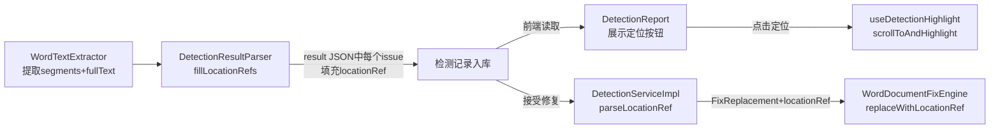

# 检测位置索引与前端高亮 — 阶段B 对话上下文

> 生成时间: 2026-04-29 | 状态: **待确认**（代码已完成，需端到端测试验证）

---

## 📋 问题背景

**项目**: 招标文件AI编制工具 (ele-ai-tender)
**模块**: 智能检测子系统
**前置**: 阶段A（规范化模糊匹配）已完成，解决了检测原文因空格/换行差异导致匹配失败的问题
**当前阶段**: 阶段B — 检测位置索引与前端高亮

### 阶段A遗留问题

1. **修复定位慢**: 全文档遍历匹配，段落越多越慢
2. **多处匹配风险**: 短原文可能在文档多处命中，`String.replace()` 替换所有匹配项
3. **前端无定位**: 检测报告只有文字列表，用户无法直观看到问题在文档中的位置

---

## 🔴 核心问题

检测系统缺乏**段落级位置索引**，导致：
- 后端修复引擎无法精准定位到具体段落/单元格，只能全文档替换
- 前端检测报告无法在Word预览中高亮定位问题文本
- 同一原文多处出现时无法区分应修复哪一处

---

## 🎯 实现目标

| 目标 | 度量 | 状态 |
|------|------|------|
| 修复定位速度 | O(n) → O(1)，`doc.getBodyElements().get(elementIndex)` 直接定位 | ✅ |
| 多处匹配精准 | 优先替换 locationRef 指定段落/单元格内的匹配项 | ✅ |
| 前端可视化 | Word预览中行内高亮问题文本，点击检测项定位到文档对应位置 | ✅ |
| 向后兼容 | 无 locationRef 时自动降级到全文档匹配（阶段A行为） | ✅ |

---

## 🔧 技术约束

- **无数据库变更**: locationRef 嵌入在检测结果 JSON 中，不新增表/字段
- **elementIndex 定义**: IBodyElement 序号（段落和表格共享同一索引空间），不是段落专用索引
- **两级匹配**: 精确匹配优先 → 规范化匹配兜底（复用阶段A的 TextNormalizeUtil）
- **混合填充策略**: 后端自动匹配为主，AI返回的position作为兜底
- **docx-preview DOM 结构**: `.docx-wrapper > section.docx > *` 是顶层元素，按 elementIndex 顺序对应
- **JDK 21 必须显式设置**: `JAVA_HOME="D:/Users/admin/.jdks/openjdk-21.0.5"`

---

## ✅ 最终方案

### 核心数据结构: LocationRefVO

```java
public class LocationRefVO {
    private String type;        // "paragraph" | "table"
    private Integer elementIndex; // IBodyElement 序号
    private Integer tableIndex;   // 表格序号（table类型）
    private Integer rowIndex;     // 行号（table类型）
    private Integer cellIndex;    // 列号（table类型）
}
```

嵌入位置:
- `DetectionIssueVO.locationRef` — 前端展示+定位
- `FixReplacement.locationRef` — 后端精准修复

### 数据流



### 后端关键组件

1. **WordTextExtractor** (file模块) — 从XWPFDocument提取文本段落+位置索引
   - `extract(XWPFDocument)` → `ExtractResult { segments, fullText }`
   - `locate(ExtractResult, original)` → `LocationRefVO`
   - 支持段落和表格单元格两种类型

2. **DetectionResultParser.fillLocationRefs** (core模块) — 批量填充locationRef
   - 精确匹配 → 规范化匹配 → 二分查找segment → 填充JSON

3. **AiTaskResultSyncHandler** (core模块) — 检测完成后自动填充
   - 调用 `fileServiceClient.extractText()` 获取 segments
   - 调用 `DetectionResultParser.fillLocationRefs()` 填充
   - try-catch 不阻塞主流程

4. **WordDocumentFixEngine.replaceWithLocationRef** (file模块) — 精准修复
   - `doc.getBodyElements().get(elementIndex)` O(1) 定位
   - 段落: 直接替换 / 表格: 定位到单元格再替换
   - 失败时降级到全文档匹配

5. **FileController** (file模块) — 新增 `POST /extract-text` 接口

### 前端关键组件

1. **useDetectionHighlight** composable — Word预览高亮+定位
   - `findTopLevelElementByIndex`: `.docx-wrapper > section.docx > *` 映射 elementIndex
   - `applyHighlights`: 段落直接高亮 / 表格内查找段落再高亮
   - `highlightTextInElement`: 跨 textNode 匹配，每个覆盖节点创建 `<mark>`
   - `scrollToAndHighlight`: scrollIntoView + 背景闪烁
   - `onBeforeUnmount` 清理 mark 和 setTimeout

2. **PhaseDetection.vue** — 左右分栏布局(40%报告/60%预览)
   - DocxPreview 组件 + useDetectionHighlight composable

3. **DetectionReport.vue** — 新增"定位到文档"按钮(有locationRef时显示)

---

## 📝 关键代码变更

### 新增文件

| 文件 | 说明 | 代码行 |
|------|------|--------|
| `common/dto/LocationRefVO.java` | 位置索引VO | 26 |
| `common/util/TextNormalizeUtil.java` | 文本规范化工具(从FixEngine提取) | 27 |
| `file/engine/WordTextExtractor.java` | Word文档文本提取器 | 201 |
| `frontend/composables/useDetectionHighlight.ts` | 前端高亮+定位composable | 171 |
| `test/WordTextExtractorTest.java` | 提取器单元测试 | 130 |
| `test/WordDocumentFixEngineTest.java` | 修复引擎测试 | 69 |

### 修改文件

| 文件 | 变更 |
|------|------|
| `common/dto/FixReplacement.java` | +locationRef 字段 |
| `common/client/InternalFileServiceClient.java` | +extractText方法, ObjectMapper复用为静态常量 |
| `core/dto/response/DetectionIssueVO.java` | +locationRef 字段 |
| `core/util/DetectionResultParser.java` | +fillLocationRefs/parseLocationRef/parseAcceptedReplacements(含locationRef) |
| `core/scheduler/AiTaskResultSyncHandler.java` | +检测完成后自动填充locationRef |
| `core/service/impl/DetectionServiceImpl.java` | +acceptIssue时传递locationRef |
| `file/controller/FileController.java` | +extract-text接口, fixDocument保留locationRef(Map<String,Object>) |
| `file/engine/WordDocumentFixEngine.java` | +replaceWithLocationRef/replaceInTableCell, normalize委托TextNormalizeUtil |
| `file/service/IWordDocumentService.java` | +extractText接口 |
| `file/service/impl/WordDocumentServiceImpl.java` | +extractText实现 |
| `frontend/types/detection.ts` | +locationRef类型定义 |
| `frontend/components/detection/DetectionReport.vue` | +定位按钮 |
| `frontend/components/document/DocxPreview.vue` | +defineExpose({containerRef}) |
| `frontend/views/project/phases/PhaseDetection.vue` | 左右分栏+DocxPreview+高亮composable |

### Commit 记录

```
f43f2bd refactor(file-client): InternalFileServiceClient 复用静态ObjectMapper
c99e3ac fix(detection): 代码审查修复 — locationRef数据链贯通、前端DOM映射修正、跨textNode高亮
91c47cb fix(frontend): 修复TypeScript类型错误，前端build验证通过
58a7936 feat(frontend): 检测页面集成DocxPreview+高亮定位
9a15535 feat(frontend): 新增locationRef类型+高亮composable+定位按钮
dc65190 feat: WordDocumentFixEngine支持locationRef定位+acceptIssue使用locationRef
3ac82bf feat(core): 检测完成后自动填充locationRef位置索引
3430c59 feat(core): DetectionResultParser支持locationRef填充和解析，DetectionIssueVO扩展
076528c feat(file): 新增extract-text接口，提取Word文档文本+位置索引
dfea0e4 feat(common): InternalFileServiceClient新增extractText方法
43aff7c feat(file): 新增WordTextExtractor文本提取器+TextNormalizeUtil公共工具
454b4c1 feat(common): 新增LocationRefVO位置索引，FixReplacement扩展locationRef字段
```

---

## 🎯 当前进度

| 步骤 | 状态 | 说明 |
|------|------|------|
| LocationRefVO 数据结构 | ✅ 已完成 | common模块 |
| WordTextExtractor 文本提取 | ✅ 已完成 | file模块 |
| DetectionResultParser 填充/解析 | ✅ 已完成 | core模块 |
| AiTaskResultSyncHandler 自动填充 | ✅ 已完成 | core模块 |
| WordDocumentFixEngine 精准修复 | ✅ 已完成 | file模块 |
| FileController 接口 | ✅ 已完成 | extract-text + fix-doc保留locationRef |
| DetectionServiceImpl 传递locationRef | ✅ 已完成 | core模块 |
| 前端 locationRef 类型 | ✅ 已完成 | detection.ts |
| useDetectionHighlight composable | ✅ 已完成 | 含跨textNode高亮+清理 |
| PhaseDetection 分栏+预览+高亮 | ✅ 已完成 | 左右分栏布局 |
| DetectionReport 定位按钮 | ✅ 已完成 | 有locationRef时显示 |
| DocxPreview 暴露containerRef | ✅ 已完成 | defineExpose |
| 代码审查修复(C1/M6/H1/M3/M2/L6/H3/M5) | ✅ 已完成 | 2个commit |
| 后端编译验证 | ✅ 已完成 | mvn compile通过 |
| 前端编译验证 | ✅ 已完成 | vue-tsc --noEmit通过 |
| **端到端测试** | ⏳ 待确认 | 需启动4个后端服务+前端验证 |

---

## 🐛 已知问题和待解决

### 已知限制（不修）

| ID | 问题 | 原因 | 影响 |
|----|------|------|------|
| M4 | `replaceInDocument` 替换所有匹配 | fallback路径的设计意图，无locationRef时替换所有 | 低，仅影响无locationRef的降级场景 |
| L3 | LocationRefVO 字段无验证 | 可空字段设计，后端各处已有null判断 | 无 |
| L4 | fillLocationRefs ObjectNode强转 | 已有try-catch，实际场景根节点一定是Object | 无 |
| L5 | PhaseDetection `as any` 类型标注 | computed ref与Ref的TS兼容性限制 | 无 |

### 潜在风险

1. **docx-preview DOM映射已修复**: 原假设 `.docx-wrapper > section.docx > *` 已改为结构选择器 `section > article`，解耦 className 配置。✅ 已修复（commit 26c4269）
2. **长表格行定位**: 表格类型只定位到单元格（cellIndex），单元格内有多个段落时只高亮第一个匹配段落。
3. **WordTextExtractor 只处理正文 body**: 不处理页眉/页脚/文本框中的文本。
4. **flex布局高度链**: 已通过 `calc(100vh - 200px)` + `flex:1; min-height:0` 修复预览区滚动条问题。⏳ 待提交

---

## 💡 使用方法

### 启动验证流程

```bash
# 1. 安装common模块（如有变更）
cd ele-ai-tender-system && JAVA_HOME="D:/Users/admin/.jdks/openjdk-21.0.5" mvn install -Dmaven.test.skip=true

# 2. 启动后端4个服务（各子模块目录下执行）
cd ele-ai-tender-support && JAVA_HOME="D:/Users/admin/.jdks/openjdk-21.0.5" mvn spring-boot:run  # :8080
cd ele-ai-tender-file    && JAVA_HOME="D:/Users/admin/.jdks/openjdk-21.0.5" mvn spring-boot:run  # :8081
cd ele-ai-tender-core    && JAVA_HOME="D:/Users/admin/.jdks/openjdk-21.0.5" mvn spring-boot:run  # :8082
cd ele-ai-tender-ai      && JAVA_HOME="D:/Users/admin/.jdks/openjdk-21.0.5" mvn spring-boot:run  # :8083

# 3. 启动前端
cd ele-ai-tender-frontend && npm run dev  # :5173
```

### 端到端测试步骤

1. 创建项目 → 编制需求 → 进入检测阶段
2. 提交检测，等待AI检测完成
3. 检查检测报告是否显示"定位到文档"按钮
4. 点击定位按钮，验证Word预览是否滚动到对应位置并高亮
5. 接受一个修复建议，验证文档是否正确修复
6. 一键接受全部，验证批量修复是否成功

### API验证

```bash
# 提取文档文本+位置索引
curl -X POST http://localhost:8081/api/file/extract-text \
  -H "Authorization: Bearer <token>" \
  -H "Content-Type: application/json" \
  -d '{"fileId": <fileId>}'

# 修复文档（含locationRef）
curl -X POST http://localhost:8081/api/file/fix-doc \
  -H "Authorization: Bearer <token>" \
  -H "Content-Type: application/json" \
  -d '{
    "fileId": <fileId>,
    "replacements": [{
      "original": "原文本",
      "targeted": "替换文本",
      "locationRef": {
        "type": "paragraph",
        "elementIndex": 5
      }
    }]
  }'
```

---

## 🚀 下一步计划

1. **端到端测试**: 启动全部服务，走完整检测流程验证
2. **push到远程**: `git push origin master`
3. **阶段C规划**（如需要）: 字符级定位、页眉页脚支持、文本框支持等高级特性

---

## 📝 备注

### 代码审查关键发现

- **C1（严重）**: FileController `Map<String,String>` 丢掉 locationRef → 改为 `Map<String,Object>` + 手动反序列化
- **H1（高）**: 前端 `querySelectorAll('p')` 含表格内部段落 → 改用 `.docx-wrapper > section.docx > *` 顶层元素映射
- **M3（中）**: 单textNode高亮假设 → 重写为跨textNode匹配，构建 nodeRanges 偏移映射

### 设计文档位置

- 设计文档: `docs/projects/2026-04-29-检测位置索引与前端高亮设计.md`
- 实施计划: `docs/plans/2026-04-29-检测位置索引与前端高亮实施计划.md`
- 阶段A上下文: `docs/context/2026-04-28-对话上下文-检测原文模糊匹配-已解决.md`

### elementIndex 关键理解

elementIndex 是 **IBodyElement 序号**，不是段落序号。Word文档中段落和表格共享同一索引空间：

```
elementIndex=0: 段落1（标题）
elementIndex=1: 段落2（正文）
elementIndex=2: 表格1（整体）
elementIndex=3: 段落3（正文）
```

后端 `doc.getBodyElements().get(elementIndex)` 可 O(1) 定位，前端 `.docx-wrapper > section > *` 也是这个顺序。
