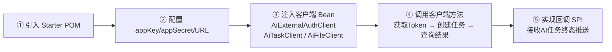
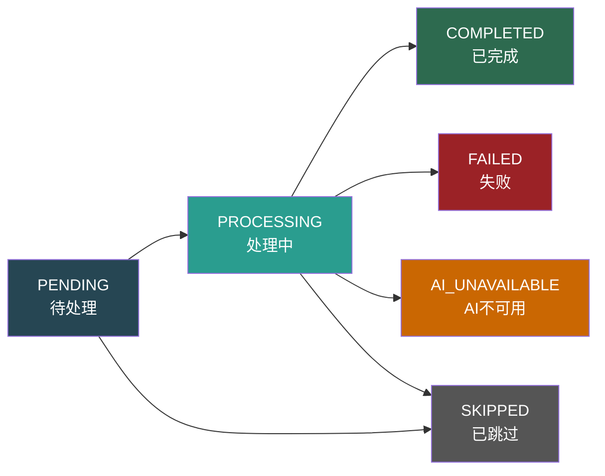

# 外部系统通过 Starter POM 对接指南

> 版本：v2.0 | 更新日期：2026-07-15

---

## 1. 概述

外部系统只需引入 `ele-ai-tender-interaction-spring-boot-starter`，即可获得与 Ele AI 招标文件编制平台对接的全部能力——包括出站客户端（认证、任务、文件）和入站回调接收，**无需手动处理签名、HTTP 调用、结果解包等底层细节**。

**对接流程一览：**



---

## 2. 引入依赖

```xml
<dependency>
    <groupId>com.jy.eleaitender</groupId>
    <artifactId>ele-ai-tender-interaction-spring-boot-starter</artifactId>
    <version>1.0.0-SNAPSHOT</version>
</dependency>
```

**依赖传递关系：**

```
ele-ai-tender-interaction-spring-boot-starter
  ├── ele-ai-tender-interaction-core          ← 出站客户端 + RestTemplate + 签名器
  └── ele-ai-tender-interaction-autoconfigure ← 自动装配 + 拦截器 + 全局异常处理 + 回调Controller
        └── ele-ai-tender-common-interaction  ← DTO / SPI接口 / 枚举 / 工具类（JDK 8 兼容）
```

**兼容性：** 整体编译目标 JDK 8，Spring Boot 2.7.18，同时兼容 Spring Boot 2.x（`spring.factories`）和 3.x（`AutoConfiguration.imports`）。

---

## 3. 配置属性

```yaml
ele-ai-tender:
  interaction:
    # ── 必填 ──
    app-key: ${APP_KEY}                      # 平台分配的应用Key
    app-secret: ${APP_SECRET}                # 平台分配的应用密钥
    api-base-url: https://platform.example.com  # 支持服务URL
    core-base-url: ${CORE_BASE_URL}             # 核心服务URL
    file-base-url: ${FILE_BASE_URL}             # 文件服务URL

    # ── 可选（有默认值） ──
    enabled: true                            # 总开关（默认true）
    token-path: /api/external/token          # 认证路径
    user-info-path: /api/external/userinfo   # 用户信息路径
    connect-timeout: 5s                      # HTTP连接超时
    read-timeout: 20s                        # HTTP读取超时

    controller:
      base-path: /api/eleAiTender/interaction  # 回调Controller路径前缀
```

> `app-key` / `app-secret` 会被自动用于两个方向：
> - **出站**：`InteractionRequestSigner` 自动为出站请求注入 `X-App-Key` / `X-Timestamp` / `X-Signature` 签名头
> - **入站**：`InteractionAiSignatureInterceptor` 自动校验平台回调请求的签名

---

## 4. 自动装配的 Bean

引入 Starter 后，`EleAiTenderInteractionAutoConfiguration` 自动注册以下 Bean（均支持同名 Bean 覆盖）：

| Bean 名称 | 类型 | 用途 |
|-----------|------|------|
| `aiExternalAuthClient` | `AiExternalAuthClient` | 换取 JWT Token |
| `aiExternalUserInfoClient` | `AiExternalUserInfoClient` | 查询当前外部用户信息 |
| `aiTaskClient` | `AiTaskClient` | 创建/查询 AI 任务 |
| `aiFileClient` | `AiFileClient` | 查询/下载/上传文件 |
| `interactionAiRestTemplate` | `RestTemplate` | 专用 HTTP 客户端（含超时 + 日志拦截） |
| `interactionAiRequestSigner` | `InteractionRequestSigner` | 出站请求签名注入器 |
| `interactionAiSignatureInterceptor` | `InteractionAiSignatureInterceptor` | 入站回调签名校验拦截器 |
| `interactionAiEventLogger` | `InteractionEventLogger` | 默认事件日志（可自定义覆盖） |
| `interactionAiTaskResultCallbackController` | `...CallbackController` | 回调接收端点（**需实现 SPI**，见第 6 节） |

---

## 5. 使用出站客户端

### 5.1 完整对接示例

```java
import com.jy.eleaitender.common.interaction.dto.*;
import com.jy.eleaitender.interaction.core.client.*;
import org.springframework.stereotype.Service;

@Service
public class PlatformIntegrationService {

    private final AiExternalAuthClient authClient;
    private final AiTaskClient taskClient;
    private final AiFileClient fileClient;

    public PlatformIntegrationService(AiExternalAuthClient authClient,
                                      AiTaskClient taskClient,
                                      AiFileClient fileClient) {
        this.authClient = authClient;
        this.taskClient = taskClient;
        this.fileClient = fileClient;
    }

    /**
     * 完整对接流程：获取Token → 上传文件 → 创建AI任务 → 轮询结果
     */
    public String runAiTask() {
        // ── Step 1: 获取 JWT Token ──
        ExternalTokenRequest tokenReq = new ExternalTokenRequest();
        tokenReq.setUserId("user001");
        tokenReq.setUserName("张三");
        tokenReq.setEnterpriseId("ent001");
        tokenReq.setEnterpriseName("XX建设集团");
        tokenReq.setEnterpriseCode("91110000MA001");

        ExternalTokenResponse tokenResp = authClient.getExternalToken(tokenReq);
        String auth = "Bearer " + tokenResp.getToken();
        // Token 有效期 7 天，建议缓存复用

        // ── Step 2: 上传文件（可选） ──
        byte[] fileContent = "...".getBytes();
        InteractionFileUploadResponse uploadResp = fileClient.uploadFile(
                auth, fileContent, "招标文件.docx", "DOCUMENT");
        String fileId = uploadResp.getFileId();

        // ── Step 3: 创建 AI 任务 ──
        AiTaskCreateRequest taskReq = new AiTaskCreateRequest();
        taskReq.setTaskType("TEXT_OPTIMIZE");
        taskReq.setBizId("TXT-001");
        taskReq.setBizType("DOCUMENT");
        taskReq.setRequestParams("{\"content\":\"需要优化的文本内容...\",\"requirement\":\"提升专业性\"}");
        taskReq.setFileIds(fileId);

        AiTaskCreateResponse taskResp = taskClient.createTask(auth, taskReq);
        Long taskId = taskResp.getTaskId();

        // ── Step 4: 轮询任务状态 ──
        AiTaskQueryResponse queryResp;
        do {
            Thread.sleep(3000); // 建议间隔 3~5 秒
            queryResp = taskClient.getTask(auth, taskId);
        } while (!isTerminal(queryResp.getStatus()));

        // ── Step 5: 获取结果 ──
        if ("COMPLETED".equals(queryResp.getStatus())) {
            return queryResp.getResult(); // JSON 字符串
        } else {
            throw new RuntimeException("任务失败: " + queryResp.getErrorMsg());
        }
    }

    private boolean isTerminal(String status) {
        return "COMPLETED".equals(status) || "FAILED".equals(status)
                || "AI_UNAVAILABLE".equals(status) || "SKIPPED".equals(status);
    }
}
```

### 5.2 各客户端方法速查

#### AiExternalAuthClient — 认证

| 方法 | 说明 |
|------|------|
| `getExternalToken(ExternalTokenRequest)` | 用 appKey/appSecret 签名换取 JWT Token |

**ExternalTokenRequest 字段：**

| 字段 | 类型 | 说明 |
|------|------|------|
| userId | String | 外部用户ID |
| userName | String | 外部用户名 |
| enterpriseId | String | 企业ID |
| enterpriseName | String | 企业名称 |
| enterpriseCode | String | 企业统一社会信用代码 |

**ExternalTokenResponse 字段：**

| 字段 | 类型 | 说明 |
|------|------|------|
| token | String | JWT 令牌 |
| expireIn | Long | 过期时间（秒），默认 604800（7天） |
| tokenType | String | 固定 `Bearer` |

#### AiExternalUserInfoClient — 用户信息

| 方法 | 说明 |
|------|------|
| `getCurrentExternalUser(String authorization)` | 查询当前 Token 对应的外部用户信息 |

#### AiTaskClient — AI 任务

| 方法 | 说明 |
|------|------|
| `createTask(String auth, AiTaskCreateRequest)` | 创建 AI 任务 |
| `createTask(String auth, AiTaskCreateRequest, List<String> fileIds)` | 创建 AI 任务（附带文件ID列表） |
| `getTask(String auth, Long taskId)` | 查询任务详情（含状态/结果/错误信息） |

**AiTaskCreateRequest 字段：**

| 字段 | 类型 | 必填 | 说明 |
|------|------|------|------|
| taskType | String | **是** | 任务类型，见 [附录A](#附录a-任务类型枚举) |
| bizId | String | 否 | 外部业务ID（支持任意字符串） |
| bizType | String | 否 | 业务类型：REQUIREMENT / PROJECT / DOCUMENT / REVIEW_ITEM / DETECTION |
| requestParams | String | 否 | JSON 字符串，不同任务类型结构不同，见 [附录C](#附录c-requestparams-参数结构) |
| fileIds | String | 否 | 关联文件ID（逗号分隔） |

**AiTaskQueryResponse 字段：**

| 字段 | 类型 | 说明 |
|------|------|------|
| taskId | Long | 任务ID |
| taskType | String | 任务类型 |
| bizId | String | 业务ID |
| bizType | String | 业务类型 |
| status | String | 任务状态，见 [附录B](#附录b-任务状态枚举) |
| statusName | String | 状态中文名称 |
| result | String | 执行结果（JSON，仅 COMPLETED 时有值） |
| errorMsg | String | 错误信息（仅失败时有值） |
| retryCount | Integer | 已重试次数 |
| maxRetry | Integer | 最大重试次数 |
| startedAt | String | AI 开始处理时间 |
| completedAt | String | 完成时间 |
| createTime | String | 创建时间 |

#### AiFileClient — 文件操作

| 方法 | 说明 |
|------|------|
| `getFileInfo(String auth, Long fileId)` | 按文件ID查询文件信息 |
| `getFileInfoSha256(String auth, String sha256)` | 按 SHA256 查询文件信息 |
| `downloadFile(String auth, Long fileId)` | 下载文件（返回 `byte[]`） |
| `uploadFile(String auth, byte[] content, String fileName, String bizType)` | 上传文件（字节数组） |
| `uploadFile(String auth, Path filePath, String bizType)` | 上传文件（本地路径） |

---

## 6. 实现回调 SPI（接收 AI 任务结果推送）

当 AI 任务进入终态后，平台会主动向外部系统推送结果。外部系统只需实现一个接口：

```java
import com.jy.eleaitender.common.interaction.dto.AiTaskResultCallbackRequest;
import com.jy.eleaitender.common.interaction.spi.InteractionAiTaskResultReceiveService;
import lombok.extern.slf4j.Slf4j;
import org.springframework.stereotype.Service;

@Slf4j
@Service
public class MyAiTaskResultReceiveService implements InteractionAiTaskResultReceiveService {

    @Override
    public void receive(AiTaskResultCallbackRequest request) {
        log.info("收到AI任务回调: taskId={}, status={}, bizId={}",
                request.getTaskId(), request.getStatus(), request.getBizId());

        if ("COMPLETED".equals(request.getStatus())) {
            String result = request.getResult(); // JSON 字符串
            // 业务处理...
        } else if ("FAILED".equals(request.getStatus())
                || "AI_UNAVAILABLE".equals(request.getStatus())) {
            log.error("AI任务异常: taskId={}, errorMsg={}",
                    request.getTaskId(), request.getErrorMsg());
        }
    }
}
```

**AiTaskResultCallbackRequest 字段：**

| 字段 | 类型 | 说明 |
|------|------|------|
| taskId | Long | 任务ID |
| taskType | String | 任务类型 |
| bizId | String | 业务ID |
| bizType | String | 业务类型 |
| status | String | 终态状态 |
| result | String | 执行结果（JSON） |
| errorMsg | String | 错误信息 |
| completedAt | String | 完成时间 |

**自动装配机制：**
- `InteractionAiTaskResultCallbackController` 使用 `@ConditionalOnBean(InteractionAiTaskResultReceiveService.class)`
- 实现了 SPI 并注册为 Bean 后，回调端点自动创建，路径为 `{controller.base-path}/callbacks/ai-task-result`
- `InteractionAiSignatureInterceptor` 自动拦截并校验回调请求签名，外部系统无需手动验签

---

## 7. 自定义扩展

所有自动装配的 Bean 均使用 `@ConditionalOnMissingBean`，外部系统可提供**同名 Bean** 进行覆盖：

```java
// 示例：自定义事件日志
@Bean(name = "interactionAiEventLogger")
public InteractionEventLogger customEventLogger() {
    return new MyCustomEventLogger();
}

// 示例：自定义 RestTemplate（如调整超时、添加代理）
@Bean(name = "interactionAiRestTemplate")
public RestTemplate customRestTemplate(EleAiTenderInteractionProperties properties) {
    // 自定义配置...
}
```

---

## 附录A: 任务类型枚举

| code | 名称 | 说明 |
|------|------|------|
| REQUIREMENT_GENERATE | 需求生成 | 根据项目信息自动生成招标文件需求部分 |
| PROJECT_REQUIREMENT_GENERATE | 项目需求生成 | 基于项目维度生成需求 |
| REVIEW_ITEM_GENERATE | 评审项生成 | 自动生成评审项表格 |
| DOCUMENT_INTEGRATION | 文档集成 | 将多个文档片段整合为完整文档 |
| DETECTION_SENSITIVE_WORD | 敏感词检测 | 检测文档中的敏感词 |
| DETECTION_TYPO | 错别字测试 | 检测文档中的错别字 |
| DETECTION_POLICY_REVIEW | 政策文件审查 | 对照政策文件进行合规审查 |
| DETECTION_FORMAT_CHECK | 格式规范检测 | 检查文档格式是否符合规范 |
| TEXT_OPTIMIZE | 文本优化 | 对指定文本进行 AI 优化润色 |

---

## 附录B: 任务状态枚举

| code | 名称 | 终态 | 说明 |
|------|------|------|------|
| PENDING | 待处理 | 否 | 任务已创建，等待 AI 服务拾取 |
| PROCESSING | 处理中 | 否 | AI 正在执行任务 |
| COMPLETED | 已完成 | **是** | 成功完成，`result` 有值 |
| FAILED | 失败 | **是** | 执行失败，`errorMsg` 有详情 |
| AI_UNAVAILABLE | AI服务不可用 | **是** | AI 服务超时或不可用 |
| SKIPPED | 已跳过 | **是** | 用户主动跳过（降级手动） |



---

## 附录C: requestParams 参数结构

`requestParams` 是 JSON 字符串，不同 `taskType` 对应不同结构：

### REQUIREMENT_GENERATE / PROJECT_REQUIREMENT_GENERATE

```json
{
  "requirementName": "XX项目需求",
  "projectType": "工程",
  "projectCategory": "施工",
  "budget": "1000万",
  "description": "项目详细描述..."
}
```

### REVIEW_ITEM_GENERATE

```json
{
  "projectName": "XX项目",
  "projectType": "工程",
  "projectCategory": "施工",
  "budget": "1000万",
  "reviewMethod": "综合评分法",
  "requirementContent": "需求内容...",
  "reviewConfig": "{\"reviewTypes\":[...],\"scoreMode\":\"SCORE\"}"
}
```

### DETECTION_SENSITIVE_WORD / DETECTION_TYPO / DETECTION_POLICY_REVIEW / DETECTION_FORMAT_CHECK（共用）

```json
{
  "contentFileId": 12345,
  "content": "待检测的文本内容..."
}
```

| 字段 | 说明 |
|------|------|
| contentFileId | 内容文件ID（与 content 二选一） |
| content | 待检测文本（与 contentFileId 二选一） |

### TEXT_OPTIMIZE

```json
{
  "content": "需要优化的文本内容...",
  "requirement": "提升专业性和规范性"
}
```

### DOCUMENT_INTEGRATION

参数类定义在 `ele-ai-tender-common` 模块（`com.jy.eleaitender.common.dto.ai.DocumentIntegrationParams`），请联系平台管理员获取结构。

---

## 附录D: 响应码

| code | 名称 | 说明 |
|------|------|------|
| 200 | SUCCESS | 操作成功 |
| 400 | PARAM_ERROR | 请求参数校验失败 |
| 500 | FAIL | 服务端内部错误 |
| 3004 | SIGNATURE_ERROR | 签名验证失败 |

客户端已自动处理响应解包：成功返回 data，失败抛出 `InteractionException`，外部系统无需手动判断响应码。

---

## 附录E: 常见问题

| 问题 | 排查方向 |
|------|----------|
| `InteractionException: 获取电子标Token失败` | 检查 `app-key` / `app-secret` 配置、`api-base-url` 可达、时钟偏差 < 5 分钟 |
| 回调端点 404 | 确认已实现并注册 `InteractionAiTaskResultReceiveService` Bean；检查 `enabled` 未设为 `false` |
| 出站超时 | 调整 `connect-timeout` / `read-timeout`；确认网络连通性 |
| 任务一直 PENDING | 平台 AI 服务可能未运行，等待超时后自动标记 AI_UNAVAILABLE |
| 签名失败（3004） | 确认时间戳为毫秒级（13位）；确认 appKey/appSecret 与平台分配一致 |
