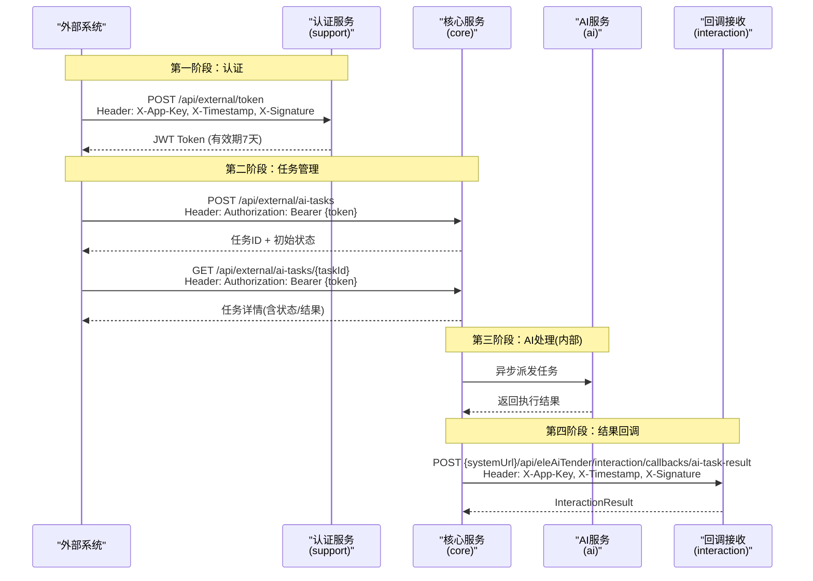
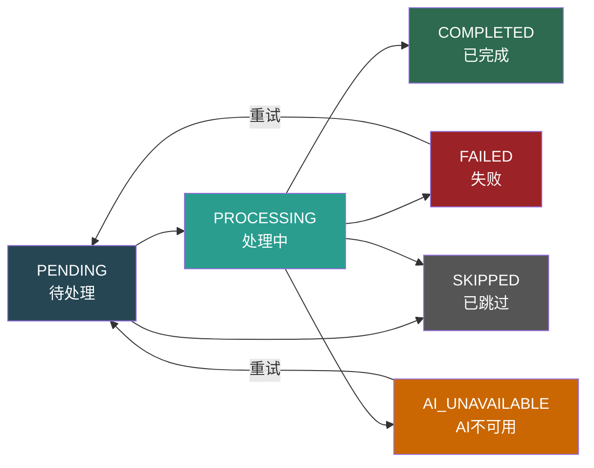
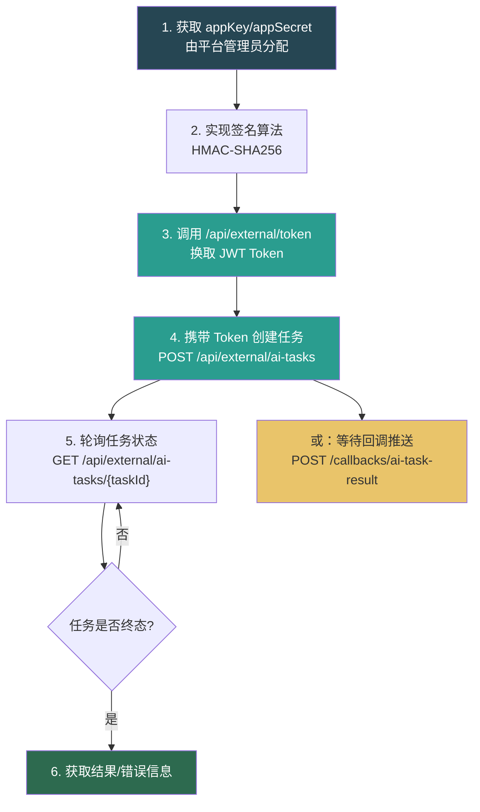

# 外部系统调用 SPI 服务对接文档

> 版本：v1.0 | 更新日期：2026-07-15

---

## 1. 概述

本文档面向**外部系统对接方**，描述如何接入 Ele AI 招标文件编制平台的 SPI 服务体系。外部系统通过 REST API + JWT 认证 + HMAC-SHA256 签名机制与本平台进行安全交互，核心能力包括：

- **认证换 Token**：通过 appKey/appSecret 签名换取 JWT 令牌
- **创建 AI 任务**：提交 AI 任务请求（需求生成、检测、文本优化等）
- **查询任务状态**：轮询任务执行进度
- **接收结果回调**：被动接收 AI 任务终态结果推送

---

## 2. 系统架构总览



---

## 3. 接入准备

### 3.1 前置条件

| 条件 | 说明 |
|------|------|
| 获取凭证 | 由平台管理员分配 `appKey` 和 `appSecret` |
| 注册系统 | 在 `sys_access_system` 表注册外部系统信息（名称、URL、凭证、状态） |
| 网络连通 | 确保外部系统可访问平台 API 地址，平台可回调外部系统 URL |
| 时钟同步 | 外部系统与平台服务器时间偏差不超过 **5 分钟** |

### 3.2 系统注册信息（sys_access_system）

| 字段 | 说明 |
|------|------|
| system_name | 外部系统名称 |
| system_url | 外部系统基础URL（用于回调推送） |
| app_key | 应用Key（唯一标识） |
| app_secret | 应用密钥（用于签名计算） |
| expire_time | 凭证有效期 |
| status | 系统状态（1=启用，0=禁用） |

---

## 4. 签名机制

### 4.1 签名算法

所有需要签名的请求，均使用 **HMAC-SHA256** 算法。

**签名公式：**

```
content = appKey + timestamp
signature = HMAC-SHA256(content, appSecret).toUpperCase()
```

**签名有效期：** 5 分钟（时间戳与服务器时间差超过 5 分钟将被拒绝）

### 4.2 签名示例（Java）

```java
import javax.crypto.Mac;
import javax.crypto.spec.SecretKeySpec;
import java.nio.charset.StandardCharsets;

public static String generateSignature(String appKey, long timestamp, String appSecret) {
    String content = appKey + timestamp;
    try {
        Mac mac = Mac.getInstance("HmacSHA256");
        mac.init(new SecretKeySpec(appSecret.getBytes(StandardCharsets.UTF_8), "HmacSHA256"));
        byte[] bytes = mac.doFinal(content.getBytes(StandardCharsets.UTF_8));
        StringBuilder builder = new StringBuilder(bytes.length * 2);
        for (byte value : bytes) {
            builder.append(String.format("%02x", value));
        }
        return builder.toString().toUpperCase();
    } catch (Exception e) {
        throw new IllegalStateException("HMAC-SHA256 algorithm not available", e);
    }
}
```

### 4.3 签名示例（Python）

```python
import hmac
import hashlib
import time

def generate_signature(app_key: str, app_secret: str, timestamp: int = None) -> tuple:
    if timestamp is None:
        timestamp = int(time.time() * 1000)
    content = f"{app_key}{timestamp}"
    signature = hmac.new(
        app_secret.encode('utf-8'),
        content.encode('utf-8'),
        hashlib.sha256
    ).hexdigest().upper()
    return str(timestamp), signature
```

---

## 5. API 接口详情

### 5.1 获取 Token

**POST** `/api/external/token`

外部系统通过 appKey/appSecret 签名换取 JWT Token，后续所有 API 调用均需携带此 Token。

**请求头：**

| Header | 类型 | 必填 | 说明 |
|--------|------|------|------|
| X-App-Key | String | 是 | 应用Key |
| X-Timestamp | Long | 是 | 当前时间戳（毫秒） |
| X-Signature | String | 是 | HMAC-SHA256 签名 |
| Content-Type | String | 是 | `application/json` |

**请求体：**

```json
{
  "userName": "张三",
  "userId": "user001",
  "enterpriseName": "XX建设集团",
  "enterpriseId": "ent001",
  "enterpriseCode": "91110000MA001"
}
```

| 字段 | 类型 | 必填 | 说明 |
|------|------|------|------|
| userName | String | 否 | 外部系统用户名 |
| userId | String | 否 | 外部系统用户ID |
| enterpriseName | String | 否 | 企业名称 |
| enterpriseId | String | 否 | 企业ID |
| enterpriseCode | String | 否 | 企业统一社会信用代码 |

**响应体：**

```json
{
  "code": 200,
  "msg": "操作成功",
  "data": {
    "token": "eyJhbGciOiJIUzI1NiJ9...",
    "expireIn": 604800,
    "tokenType": "Bearer"
  }
}
```

| 字段 | 类型 | 说明 |
|------|------|------|
| token | String | JWT 令牌 |
| expireIn | Long | 过期时间（秒），默认 604800（7天） |
| tokenType | String | 固定值 `Bearer` |

**调用示例（curl）：**

```bash
TIMESTAMP=$(date +%s%3N)
SIGNATURE=$(generate_signature "your_app_key" "your_app_secret" $TIMESTAMP)

curl -X POST https://api.example.com/api/external/token \
  -H "Content-Type: application/json" \
  -H "X-App-Key: your_app_key" \
  -H "X-Timestamp: $TIMESTAMP" \
  -H "X-Signature: $SIGNATURE" \
  -d '{
    "userName": "张三",
    "userId": "user001",
    "enterpriseName": "XX建设集团",
    "enterpriseId": "ent001",
    "enterpriseCode": "91110000MA001"
  }'
```

---

### 5.2 验证签名（联调辅助）

**GET** `/api/external/verify`

辅助联调接口，用于验证 appKey/appSecret 配置是否正确。

**请求头：**

| Header | 类型 | 必填 | 说明 |
|--------|------|------|------|
| X-App-Key | String | 是 | 应用Key |
| X-Timestamp | Long | 是 | 当前时间戳（毫秒） |
| X-Signature | String | 是 | HMAC-SHA256 签名 |

**响应体：**

```json
{
  "code": 200,
  "msg": "操作成功",
  "data": true
}
```

---

### 5.3 获取外部用户信息

**GET** `/api/external/userinfo`

获取当前 Token 对应的外部用户信息。需携带 JWT Token。

**请求头：**

| Header | 类型 | 必填 | 说明 |
|--------|------|------|------|
| Authorization | String | 是 | `Bearer {token}` |

**响应体：**

```json
{
  "code": 200,
  "msg": "操作成功",
  "data": {
    "appKey": "your_app_key",
    "userId": "user001",
    "userName": "张三",
    "enterpriseId": "ent001",
    "enterpriseName": "XX建设集团",
    "enterpriseCode": "91110000MA001"
  }
}
```

---

### 5.4 创建 AI 任务

**POST** `/api/external/ai-tasks`

提交一个 AI 任务请求。需要 JWT Token 认证。

**请求头：**

| Header | 类型 | 必填 | 说明 |
|--------|------|------|------|
| Authorization | String | 是 | `Bearer {token}` |
| Content-Type | String | 是 | `application/json` |

**请求体：**

```json
{
  "taskType": "REQUIREMENT_GENERATE",
  "bizId": "REQ-2026-001",
  "bizType": "REQUIREMENT",
  "requestParams": "{\"projectName\":\"XX项目\",\"content\":\"...\"}",
  "fileIds": "file001,file002"
}
```

| 字段 | 类型 | 必填 | 说明 |
|------|------|------|------|
| taskType | String | **是** | 任务类型，见 [5.8 任务类型枚举](#58-任务类型枚举) |
| bizId | String | 否 | 业务ID（外部系统自定义，支持任意字符串） |
| bizType | String | 否 | 业务类型：REQUIREMENT / PROJECT / DOCUMENT / REVIEW_ITEM / DETECTION |
| requestParams | String | 否 | 请求参数（JSON 字符串，不同类型有不同结构） |
| fileIds | String | 否 | 关联文件ID列表（逗号分隔） |

**响应体：**

```json
{
  "code": 200,
  "msg": "操作成功",
  "data": {
    "taskId": 12345,
    "taskType": "REQUIREMENT_GENERATE",
    "status": "PENDING",
    "createTime": "2026-07-15 10:30:00"
  }
}
```

| 字段 | 类型 | 说明 |
|------|------|------|
| taskId | Long | 任务ID（后续查询/轮询使用） |
| taskType | String | 任务类型 |
| status | String | 初始状态，通常为 `PENDING` |
| createTime | String | 创建时间（yyyy-MM-dd HH:mm:ss） |

---

### 5.5 查询 AI 任务详情

**GET** `/api/external/ai-tasks/{taskId}`

查询指定任务的完整信息（含状态、结果、错误信息等）。需要 JWT Token 认证。

**请求头：**

| Header | 类型 | 必填 | 说明 |
|--------|------|------|------|
| Authorization | String | 是 | `Bearer {token}` |

**路径参数：**

| 参数 | 类型 | 说明 |
|------|------|------|
| taskId | Long | 任务ID |

**响应体：**

```json
{
  "code": 200,
  "msg": "操作成功",
  "data": {
    "taskId": 12345,
    "taskType": "REQUIREMENT_GENERATE",
    "bizId": "REQ-2026-001",
    "bizType": "REQUIREMENT",
    "status": "COMPLETED",
    "statusName": "已完成",
    "result": "{\"content\":\"生成的需求文档内容...\"}",
    "errorMsg": null,
    "retryCount": 0,
    "maxRetry": 3,
    "startedAt": "2026-07-15 10:30:05",
    "completedAt": "2026-07-15 10:31:20",
    "createTime": "2026-07-15 10:30:00"
  }
}
```

| 字段 | 类型 | 说明 |
|------|------|------|
| taskId | Long | 任务ID |
| taskType | String | 任务类型 |
| bizId | String | 业务ID |
| bizType | String | 业务类型 |
| status | String | 任务状态，见 [5.9 任务状态枚举](#59-任务状态枚举) |
| statusName | String | 状态中文名称 |
| result | String | 执行结果（JSON 字符串，仅 COMPLETED 时有值） |
| errorMsg | String | 错误信息（仅 FAILED/AI_UNAVAILABLE 时有值） |
| retryCount | Integer | 已重试次数 |
| maxRetry | Integer | 最大重试次数 |
| startedAt | String | AI开始处理时间 |
| completedAt | String | 完成时间 |
| createTime | String | 创建时间 |

---

### 5.6 接收 AI 任务结果回调

**POST** `{外部系统systemUrl}/api/eleAiTender/interaction/callbacks/ai-task-result`

当 AI 任务进入终态（COMPLETED / FAILED / AI_UNAVAILABLE / SKIPPED）后，平台会主动向外部系统推送结果回调。

> **注意**：此接口由外部系统实现，平台主动调用。外部系统需按 SPI 规范实现此端点。

**平台推送请求头：**

| Header | 类型 | 说明 |
|--------|------|------|
| X-App-Key | String | 外部系统的 appKey |
| X-Timestamp | Long | 推送时间戳（毫秒） |
| X-Signature | String | HMAC-SHA256 签名（外部系统可用于验签） |
| Content-Type | String | `application/json` |

**平台推送请求体：**

```json
{
  "taskId": 12345,
  "taskType": "REQUIREMENT_GENERATE",
  "bizId": "REQ-2026-001",
  "bizType": "REQUIREMENT",
  "status": "COMPLETED",
  "result": "{\"content\":\"生成的需求文档内容...\"}",
  "errorMsg": null,
  "completedAt": "2026-07-15 10:31:20"
}
```

| 字段 | 类型 | 说明 |
|------|------|------|
| taskId | Long | 任务ID |
| taskType | String | 任务类型 |
| bizId | String | 业务ID |
| bizType | String | 业务类型 |
| status | String | 终态状态：COMPLETED / FAILED / AI_UNAVAILABLE / SKIPPED |
| result | String | 执行结果（JSON 字符串） |
| errorMsg | String | 错误信息 |
| completedAt | String | 完成时间 |

**外部系统需返回：**

```json
{
  "code": 200,
  "message": "操作成功",
  "data": null,
  "timestamp": 1721012000000
}
```

> 返回 `code=200` 表示接收成功。若返回非 200，平台将记录回调失败并可能重试。

---

### 5.7 统一响应格式

所有 API 响应均遵循统一格式：

```json
{
  "code": 200,
  "msg": "操作成功",
  "data": { ... }
}
```

---

### 5.8 任务类型枚举

| code | 名称 | 说明 |
|------|------|------|
| REQUIREMENT_GENERATE | 需求生成 | 根据项目信息自动生成招标文件需求部分 |
| PROJECT_REQUIREMENT_GENERATE | 项目需求生成 | 基于项目维度生成需求 |
| REVIEW_ITEM_GENERATE | 评审项生成 | 自动生成评审项表格 |
| DOCUMENT_INTEGRATION | 文档集成 | 将多个文档片段整合为完整文档 |
| DETECTION_SENSITIVE_WORD | 敏感词检测 | 检测文档中的敏感词 |
| DETECTION_TYPO | 错别字测试 | 检测文档中的错别字 |
| DETECTION_POLICY_REVIEW | 政策文件审查 | 对照政策文件进行合规审查 |
| DETECTION_FORMAT_CHECK | 格式规范检测 | 检查文档格式是否符合规范 |
| TEXT_OPTIMIZE | 文本优化 | 对指定文本进行 AI 优化润色 |

---

### 5.9 任务状态枚举

| code | 名称 | 是否终态 | 说明 |
|------|------|----------|------|
| PENDING | 待处理 | 否 | 任务已创建，等待 AI 服务拾取 |
| PROCESSING | 处理中 | 否 | AI 正在执行任务 |
| COMPLETED | 已完成 | **是** | 任务成功完成，result 字段有值 |
| FAILED | 失败 | **是** | 任务执行失败，errorMsg 有错误详情 |
| AI_UNAVAILABLE | AI服务不可用 | **是** | AI 服务超时或不可用 |
| SKIPPED | 已跳过 | **是** | 用户主动跳过（降级为手动模式） |

**状态流转：**



---

## 6. 响应码说明

| code | 名称 | 说明 |
|------|------|------|
| 200 | SUCCESS | 操作成功 |
| 400 | PARAM_ERROR | 请求参数校验失败 |
| 500 | FAIL | 服务端内部错误 |
| 3004 | SIGNATURE_ERROR | 签名验证失败（appKey/appSecret 不匹配或时间戳过期） |

---

## 7. 完整对接流程

### 7.1 流程步骤



### 7.2 获取 Token → 创建任务 → 轮询结果

1. **获取 Token**：调用 `POST /api/external/token`，携带签名请求头
2. **保存 Token**：Token 有效期 7 天，建议缓存并在过期前刷新
3. **创建任务**：调用 `POST /api/external/ai-tasks`，携带 `Authorization: Bearer {token}`
4. **轮询状态**：调用 `GET /api/external/ai-tasks/{taskId}`，建议轮询间隔 3~5 秒
5. **获取结果**：当 status 为 `COMPLETED` 时，从 `result` 字段获取执行结果

### 7.3 被动接收回调模式（可选）

如果外部系统实现了回调接收端点：

1. 在 `sys_access_system.system_url` 配置外部系统基础 URL
2. 任务完成后，平台自动 POST 到 `{systemUrl}/api/eleAiTender/interaction/callbacks/ai-task-result`
3. 回调请求携带签名头（X-App-Key / X-Timestamp / X-Signature），外部系统可验签
4. 返回 `{"code": 200}` 表示接收成功

---

## 8. 外部系统 SPI 实现清单

外部系统如需完整接入 interaction 能力，须实现以下 SPI 接口并注册为 Spring Bean：

| SPI 接口 | 说明 |
|----------|------|
| `InteractionIdentityService` | 提供当前用户身份信息 |
| `InteractionProjectInfoService` | 提供项目基础信息查询 |
| `InteractionBidRecordSchemeService` | 提供投标记录方案查询 |
| `InteractionCaKeysInfoService` | 提供 CA 密钥信息查询 |
| `InteractionTenderPdfReceiveService` | 接收投标文件 PDF 回调 |
| `InteractionTenderPackageReceiveService` | 接收投标数据包回调 |
| `InteractionBidDocumentResultReceiveService` | 接收招标文件结果回调 |
| `InteractionBidDecryptResultReceiveService` | 接收解密结果回调 |
| `InteractionAiTaskResultReceiveService` | 接收 AI 任务终态结果回调 |

### 8.1 Maven 依赖引入

```xml
<dependency>
    <groupId>com.jy</groupId>
    <artifactId>ele-ai-tender-interaction-spring-boot-starter</artifactId>
    <version>${ele-ai-tender.version}</version>
</dependency>
```

### 8.2 application.yml 配置

```yaml
ele-ai-tender:
  interaction:
    enabled: true
    app-key: ${APP_KEY}
    app-secret: ${APP_SECRET}
    api-base-url: ${API_BASE_URL}
    # 以下为可选配置
    token-path: /api/external/token
    user-info-path: /api/external/userinfo
    file-base-url: ${FILE_BASE_URL}
    core-base-url: ${CORE_BASE_URL}
    connect-timeout: 5s
    read-timeout: 20s
```

### 8.3 SPI 实现示例

```java
@Service
public class MyAiTaskResultReceiveService implements InteractionAiTaskResultReceiveService {

    @Override
    public void receive(AiTaskResultCallbackRequest request) {
        // 处理AI任务终态结果
        log.info("收到AI任务回调: taskId={}, status={}, bizId={}",
                request.getTaskId(), request.getStatus(), request.getBizId());

        if ("COMPLETED".equals(request.getStatus())) {
            // 处理成功结果
            String result = request.getResult();
            // ... 业务处理逻辑
        } else if ("FAILED".equals(request.getStatus())) {
            // 处理失败
            log.error("AI任务失败: taskId={}, errorMsg={}",
                    request.getTaskId(), request.getErrorMsg());
        }
    }
}
```

---

## 9. 出站客户端能力

通过引入 interaction starter，外部系统还可使用以下出站能力（主动调用平台）：

| 能力 | 客户端类 | 说明 |
|------|----------|------|
| 获取 external token | `AiExternalAuthClient` | 换取 JWT Token |
| 获取外部用户信息 | `AiExternalUserInfoClient` | 查询当前外部用户 |
| 查询文件信息 | `AiFileClient` | 获取文件元数据 |
| 下载文件 | `AiFileClient` | 下载平台文件 |
| 上传文件 | `AiFileClient` | 上传文件到平台 |
| 创建 AI 任务 | `AiTaskClient` | 创建并查询 AI 任务 |
| 查询 AI 任务 | `AiTaskClient` | 查询任务详情 |

---

## 10. 安全最佳实践

| 建议 | 说明 |
|------|------|
| Token 缓存 | JWT Token 有效期 7 天，建议缓存并提前 1 天刷新 |
| 签名时间戳 | 使用毫秒级时间戳，确保与服务端时钟偏差 < 5 分钟 |
| HTTPS | 生产环境必须使用 HTTPS 传输 |
| 密钥保护 | appSecret 不得硬编码在前端代码或日志中 |
| 回调验签 | 建议外部系统在回调接收端验证平台签名 |
| 幂等设计 | 同一任务可能回调多次，需做幂等处理 |
| 轮询策略 | 建议轮询间隔 3~5 秒，避免过于频繁 |
| 超时处理 | 任务超时后状态变为 AI_UNAVAILABLE，可触发重试 |

---

## 11. 常见问题

### Q1: 签名验证失败（3004）

- 检查 appKey 和 appSecret 是否正确
- 检查时间戳是否为毫秒级（13 位）
- 检查时间戳与服务器时间偏差是否超过 5 分钟
- 可使用 `GET /api/external/verify` 接口联调验证

### Q2: Token 过期

- Token 有效期为 7 天（604800 秒）
- 建议在 Token 过期前提前刷新
- Token 存储在 Redis 中，同一用户重复获取会覆盖旧 Token

### Q3: 回调推送失败

- 确认 `sys_access_system.system_url` 配置正确
- 确认外部系统回调端点可正常访问
- 确认回调端点返回 `{"code": 200}`
- 平台回调路径固定为 `/api/eleAiTender/interaction/callbacks/ai-task-result`

### Q4: 任务一直处于 PENDING/PROCESSING

- PENDING：等待 AI 服务拾取，检查 AI 服务是否正常运行
- PROCESSING：AI 正在处理，耐心等待
- 超时后会自动标记为 AI_UNAVAILABLE（超时时间因任务类型而异，10~20 分钟）
