# 业务需求编制到招标文件完成 — 全流程梳理

> 编写日期：2026-04-15
> 依据：代码实现（状态机/枚举/Controller/Service/前端路由） + 系统规范文档

---

## 一、全局流程总览

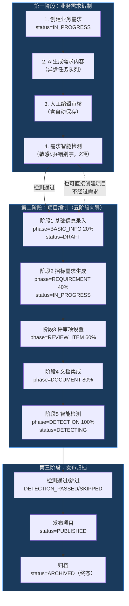

---

## 二、项目状态机

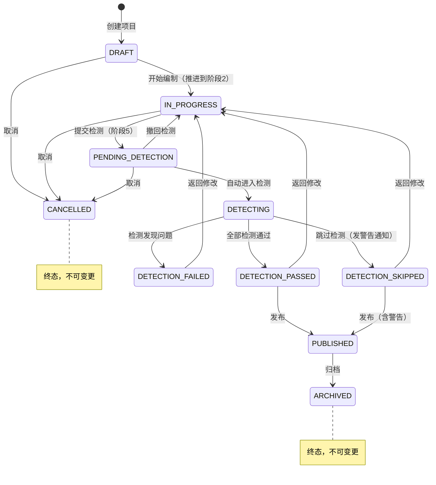

**关键约束**：
- 不允许跳过中间状态
- 每次状态变更记录操作日志
- 终态（ARCHIVED、CANCELLED）不可逆

---

## 三、第一阶段：业务需求编制

### 3.1 需求状态流转

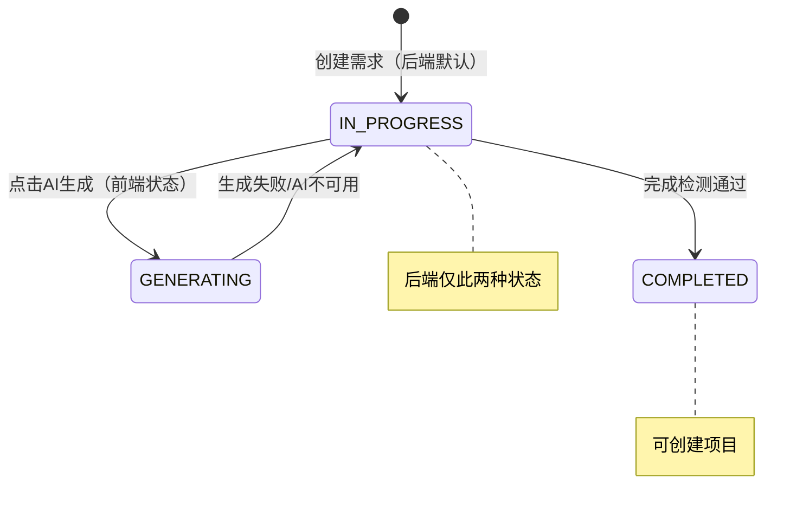

> **前后端状态差异**: 后端 `TbRequirement.status` 仅有 `IN_PROGRESS` 和 `COMPLETED` 两种值，无状态机校验。前端 `status-maps.ts` 定义了更丰富的5种状态（DRAFT/GENERATING/PENDING_REVIEW/APPROVED/REJECTED）用于UI展示，但后端不识别 DRAFT/GENERATING/PENDING_REVIEW/APPROVED/REJECTED。需求侧状态通过 `update()` 接口自由设置，与项目侧 `ProjectStateMachine` 不同。

### 3.2 需求编制完整流程图

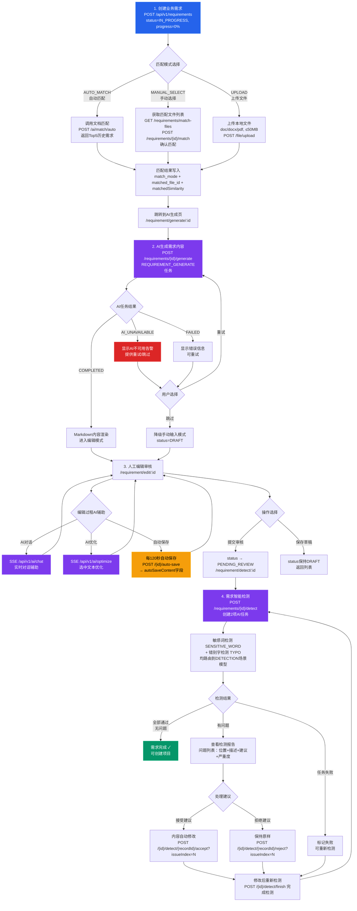

### 3.3 创建业务需求 — 表单字段明细

| 字段 | 类型 | 必填 | 校验规则 | 说明 |
|------|------|------|---------|------|
| requirementName | String | ✓ | ≤100字, blur触发 | 需求名称 |
| projectCategory | String | ✓ | change触发 | 项目类别：SMALL_TRADE(小额交易) / GOVERNMENT_PROCUREMENT(政府采购) / COMPREHENSIVE_TRADE(综合交易) |
| projectType | String | ✓ | change触发 | 项目类型：ENGINEERING(工程) / GOODS(货物) / SERVICE(服务) |
| serviceSubType | String | ✗ | — | 服务子分类（仅projectType=SERVICE时显示） |
| budget | BigDecimal | ✗ | ≥0, 精度2位 | 预算价（元） |
| requirementDescription | String | ✗ | ≤500字 | 需求描述，textarea |
| matchMode | String | ✗ | 默认AUTO_MATCH | 匹配模式：AUTO_MATCH / MANUAL_SELECT / UPLOAD |
| uploadedFileId | Long | 条件必填 | matchMode=UPLOAD时必填 | 上传文件ID，格式doc/docx/pdf，≤50MB |

**创建成功后的跳转逻辑**：
- 创建成功后统一跳转到 `/requirement/generate/:id`（AI生成页）

### 3.4 需求匹配 — 三种模式详解

#### 3.4.1 自动匹配（AUTO_MATCH）

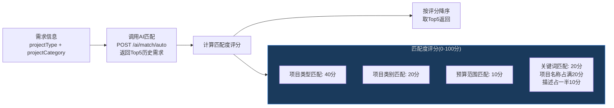

**API端点**: `POST /api/v1/ai/match/auto`

**匹配结果写入**: `match_mode=AUTO_MATCH` + `matched_file_id=选中需求ID` + `matched_similarity=评分`

#### 3.4.2 手动选择（MANUAL_SELECT）

- **获取匹配文件列表**: `GET /api/v1/requirements/match-files` — 按项目类型和关键词过滤，返回匹配度百分比
- **确认匹配**: `POST /api/v1/requirements/{id}/match` — 写入 `matchMode` + `matchedFileId`
- 默认匹配模式为 `MANUAL_SELECT`
- 用户从列表中手动选择一条

#### 3.4.3 上传文件（UPLOAD）

- 调用文件服务 `POST /file/upload` 上传本地文件
- 格式限制：doc/docx/pdf，大小不超过50MB
- 上传成功后 `uploaded_file_id` 写入需求记录

### 3.5 AI生成需求内容 — 详细流程

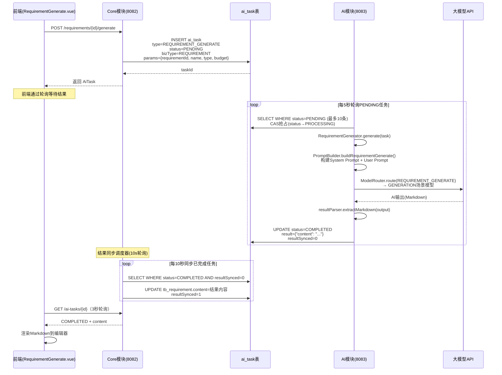

**System Prompt 要点**（来自 `SystemPromptTemplates.java` / `UserPromptTemplates.java`，三步式编排：大纲→分章并行→拼接→审查修订，通过 `ai_task.result` 渐进式推送 `contentStage`，全文硬约束 ≤5000 字）：
- 输出 Markdown 格式的需求文档
- 包含技术要求、商务要求、服务要求等章节
- 需求条款应具体、可量化、可验证
- 避免歧视性、限制性、排他性表述
- 符合招投标法规要求

**User Prompt 参数**: `projectName`, `projectType`, `projectCategory`, `budget`, `description`, `referenceContent`

### 3.6 人工编辑审核 — 自动保存机制

```mermaid
flowchart TD
    A["进入编辑页<br/>/requirement/edit/:id"] --> B["检查自动保存草稿<br/>GET /{id}/auto-save"]
    B --> C{有未保存草稿?}
    C -->|是| D["弹窗确认<br/>是否恢复草稿?"]
    C -->|否| E["正常加载内容"]

    D -->|恢复| F["用草稿内容<br/>替换当前内容"]
    D -->|忽略| E

    E --> G["开始编辑"]
    F --> G

    G --> H{120秒定时器}
    H -->|触发| I["doAutoSave()<br/>POST /{id}/auto-save<br/>body: {content: '...'}"]
    I --> J{保存结果}
    J -->|成功| K["状态栏: 已保存 HH:mm<br/>（绿色）"]
    J -->|失败| L["状态栏: 保存失败<br/>（红色）"]

    K --> G
    L --> G

    G --> M{用户手动保存<br/>PUT /{id}}
    M --> N["正式保存<br/>autoSaveContent=null<br/>autoSaveTime=null<br/>（自动清除草稿）"]

    style I fill:#f59e0b,stroke:#fbbf24,color:#000
    style K fill:#059669,stroke:#10b981,color:#fff
    style L fill:#dc2626,stroke:#ef4444,color:#fff
    style N fill:#2563eb,stroke:#3b82f6,color:#fff
```

**自动保存机制细节**：

| 项目 | 说明 |
|------|------|
| 定时间隔 | 2分钟（`AUTO_SAVE_INTERVAL = 2 * 60 * 1000`） |
| 触发条件 | `content` 或 `requirementName` 不为空 |
| 存储字段 | `auto_save_content`（未提交草稿）+ `auto_save_time` |
| 草稿恢复 | 页面加载时自动检查，弹窗确认 |
| 清除时机 | 正式保存(`PUT`)时自动清除 |
| 状态栏 | 已保存(绿) / 保存中(橙) / 保存失败(红) / 未启用(灰) |

### 3.7 需求智能检测 — 详细流程

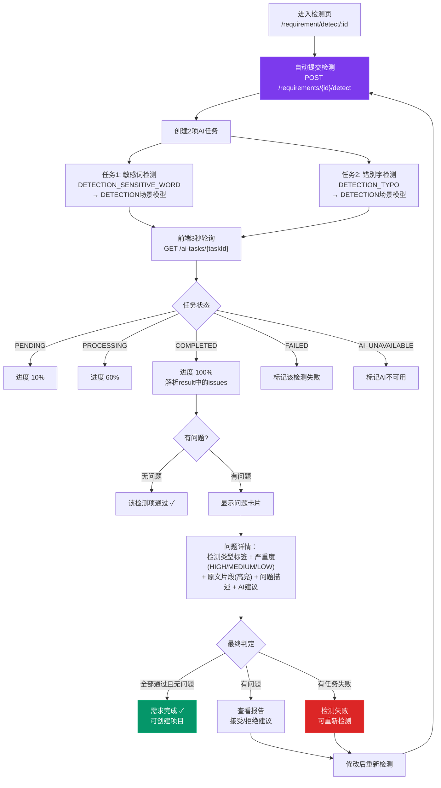

**需求检测 vs 项目检测对比**：

| 对比维度 | 需求检测 | 项目检测 |
|---------|---------|---------|
| 检测项数 | 2项 | 4项 |
| 敏感词 | ✓ SENSITIVE_WORD | ✓ SENSITIVE_WORD |
| 错别字 | ✓ TYPO | ✓ TYPO |
| 政策审查 | ✗ | ✓ POLICY_REVIEW |
| 格式检测 | ✗ | ✓ FORMAT_CHECK |
| 检测内容 | `requirement.content` | `buildDetectionContent`：需求内容+评审项标准纯文本（存 `content_snapshot`，`content_file_id=null`，不检测模板内容） |
| 状态管理 | 无状态机，前端本地管理 | `ProjectStateMachine` 状态机 |
| 检测记录 | `tb_detection_record`(含requirementId) | `tb_detection_record`(含projectId) |
| 政策文件 | 不支持 | 支持传入 `policyFileIds` |
| 重试机制 | 无(需重新提交) | `retry()` 方法 |
| 跳过机制 | 无 | `skip()` + 警告通知 |
| 审核建议 | accept/reject(已实现) | accept/reject/acceptAll |
| 完成检测 | `POST /{id}/detect/finish` | 检测通过自动完成 |
| 路由场景 | DETECTION | DETECTION |

### 3.8 需求到项目的衔接

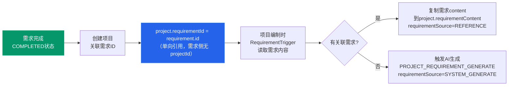

**衔接路径**：
1. 从需求列表点击"创建项目" → 自动关联需求（`requirementId`写入项目）
2. 从项目列表直接创建 → 无关联需求
3. 进入需求阶段时，有关联需求→复制内容到 `project.requirementContent`；无关联→触发AI需求生成
4. 之后项目和需求再无关联，后续阶段均从 `project.requirementContent` 读取

### 3.9 AI辅助能力汇总

| 能力 | 通信方式 | 路由场景 | 接口 | 说明 |
|------|---------|---------|------|------|
| 需求内容生成 | 异步任务队列（3s轮询） | GENERATION | `POST /requirements/{id}/generate` | 批量生成，降Token成本 |
| AI对话辅助 | SSE流式（60s超时） | — | `POST /api/v1/ai/chat` | 编辑过程中实时问答 |
| AI文本优化 | SSE流式（60s超时） | OPTIMIZATION | `POST /api/v1/ai/optimize` | 选中文本优化，保证质量 |
| AI建议 | 同步HTTP | — | `POST /api/v1/ai/suggest` | 获取AI建议 |
| 文档自动匹配 | 同步HTTP | — | `POST /api/v1/ai/match/auto` | 项目类型40%+类别20%+预算10%+关键词20% |
| 文档手动匹配 | 同步HTTP | — | `POST /api/v1/ai/match/manual` | 关键词搜索候选列表 |

### 3.10 降级策略

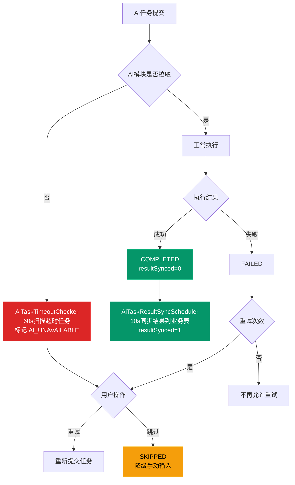

### 3.11 已知问题与待完善项

| 编号 | 问题 | 严重度 | 说明 |
|------|------|--------|------|
| R-001 | 需求状态前后端不一致 | 中 | 后端仅`IN_PROGRESS`/`COMPLETED`两种状态，前端定义了5种(DRAFT/GENERATING/PENDING_REVIEW/APPROVED/REJECTED)用于UI展示，后端不识别 |
| R-002 | 需求侧无状态机 | 中 | 需求状态通过`update()`接口自由设置，无转换规则校验（与项目侧`ProjectStateMachine`不一致） |
| R-003 | GENERATING状态设置缺失 | 低 | 前端读取`GENERATING`状态判断是否允许提交审核，但后端未写入此状态 |
| R-004 | SSE与异步任务矛盾 | 高 | 前端期望SSE流式返回，但后端`submitGenerate`创建的是异步轮询任务，非SSE端点 |
| R-005 | ~~需求检测建议处理未完成~~ | ~~已解决~~ | accept/reject/finish端点已实现，前端可接受/拒绝检测建议 |
| R-006 | 预算匹配算法简化 | 低 | 匹配评分中预算维度固定给10分，未实际比较金额 |
| R-007 | 审核流程缺失 | 中 | `PENDING_REVIEW → APPROVED/REJECTED`的审核API和页面未实现，前端有状态定义但后端不支持 |
| R-008 | 前端API后端未实现 | 低 | `previewMatchFile`、`exportDocument` 前端有调用但后端未见实现 |

---

## 四、第二阶段：项目编制（五阶段向导）

### 4.1 五阶段总览

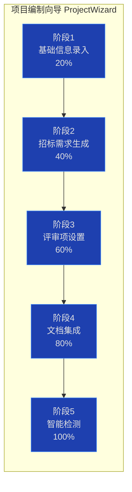

### 4.2 阶段1：基础信息录入（BASIC_INFO, 20%）

**项目状态**: DRAFT

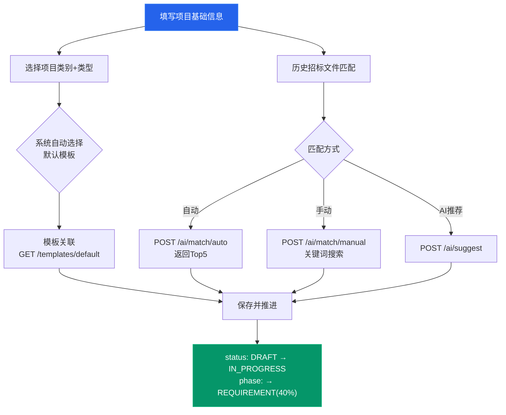

| 填写项 | 必填 | 说明 |
|--------|------|------|
| 项目名称 | 是 | ≤100字 |
| 项目类别 | 是 | 小额交易/政府采购/综合交易 |
| 项目类型 | 是 | 工程/货物/服务/物业/IT服务/咨询/维保 |
| 预算金额 | 否 | >0（单位：元） |
| 评审方式 | 是 | 智能评审(INTELLIGENT，4类评审项) / 人工评审(MANUAL，仅符合性审查) |
| 项目描述 | 否 | — |
| 招标单位 | 否 | tenderUnit |
| 项目地点 | 否 | projectLocation |
| 联系人 | 否 | contactPerson |
| 联系电话 | 否 | contactPhone |
| 预期发布时间 | 否 | expectedPublishTime |

**关键逻辑**: 项目类别+项目类型 → 自动匹配默认模板（`is_default=true`）

### 4.3 阶段2：招标需求生成（REQUIREMENT, 40%）

**项目状态**: IN_PROGRESS

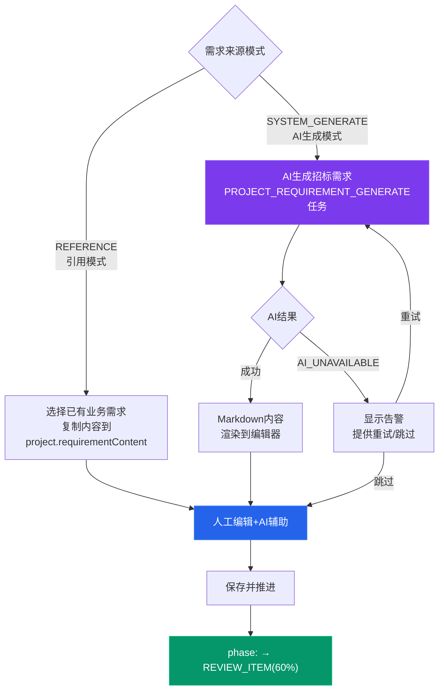

**AI辅助**: 编辑过程中可随时调用 AI对话(SSE) 和 AI文本优化(SSE)

### 4.4 阶段3：评审项设置（REVIEW_ITEM, 60%）

**项目状态**: IN_PROGRESS

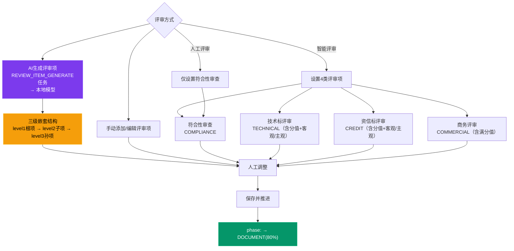

**评审项三级结构**:
```
根项(level=1) → COMPLIANCE/TECHNICAL/CREDIT/COMMERCIAL
  └── 子项(level=2) → 具体评审维度
        └── 孙项(level=3) → 细化评分标准
```

### 4.5 阶段4：文档集成（DOCUMENT, 80%）

**项目状态**: IN_PROGRESS → PENDING_DETECTION

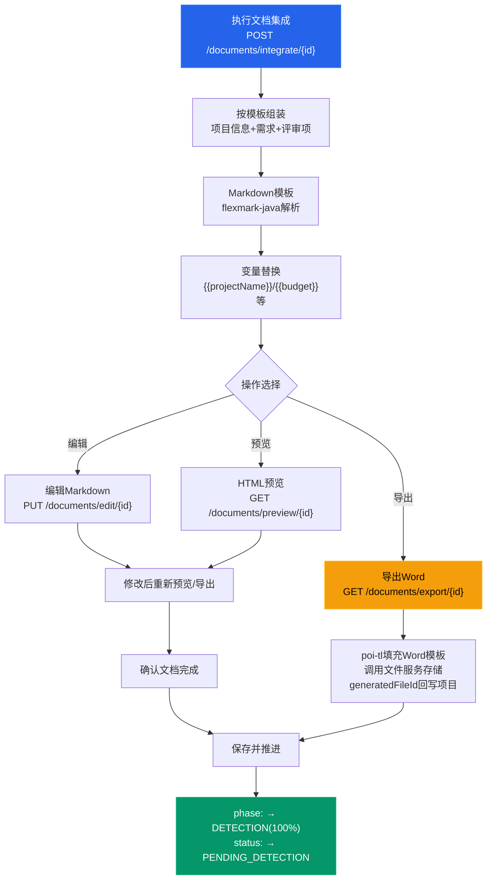

**文档生成管线**:
```
Markdown模板 → flexmark-java解析 → 变量替换 → HTML预览
                                       ↓
                               poi-tl填充Word模板 → .docx导出 → 文件服务存储 → fileId回写
```

### 4.6 阶段5：智能检测（DETECTION, 100%）

**项目状态**: PENDING_DETECTION → DETECTING → DETECTION_PASSED / DETECTION_FAILED / DETECTION_SKIPPED

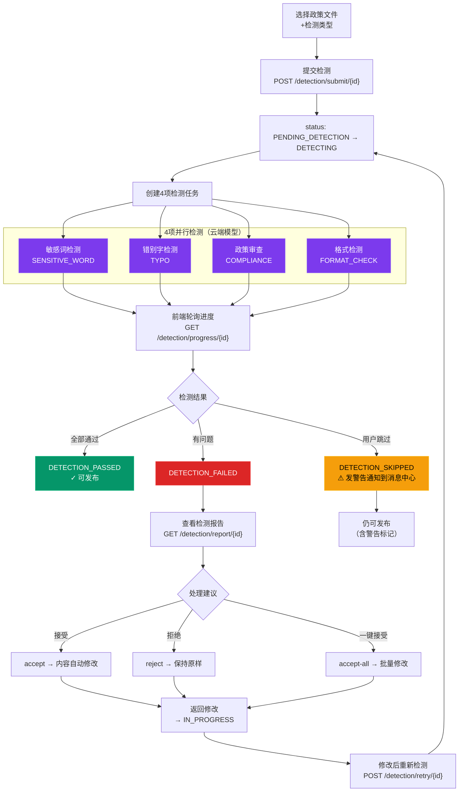

**需求检测 vs 项目检测对比**:

| 对比维度 | 需求检测 | 项目检测 |
|---------|---------|---------|
| 检测项数 | 2项 | 4项 |
| 敏感词 | ✓ | ✓ |
| 错别字 | ✓ | ✓ |
| 政策审查 | ✗ | ✓ |
| 格式检测 | ✗ | ✓ |
| 路由场景 | DETECTION | DETECTION |

---

## 五、第三阶段：发布归档


**发布条件**: 项目状态必须为 `DETECTION_PASSED` 或 `DETECTION_SKIPPED`
**版本快照**: 发布时自动将项目当前内容（JSON）写入 `tb_project_version`

---

## 六、AI任务机制详解

### 6.1 异步任务队列流程

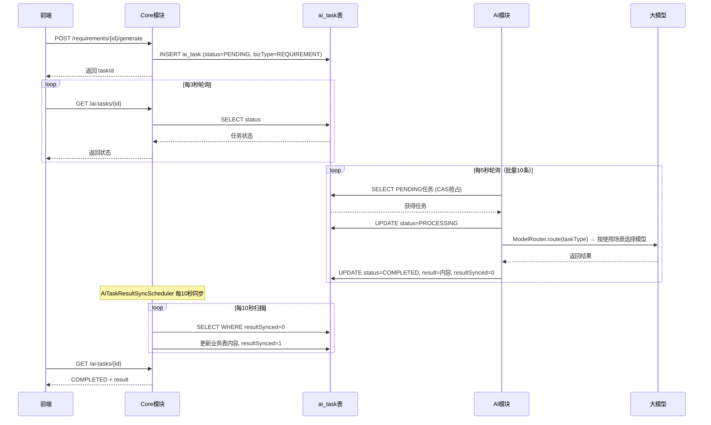

### 6.2 八种AI任务类型

| 任务类型 | 场景 | 路由场景 | 通信方式 |
|---------|------|---------|---------|
| REQUIREMENT_GENERATE | 需求生成 | GENERATION | 异步队列 |
| PROJECT_REQUIREMENT_GENERATE | 项目需求生成 | GENERATION | 异步队列 |
| REVIEW_ITEM_GENERATE | 评审项生成 | GENERATION | 异步队列 |
| DETECTION_SENSITIVE_WORD | 敏感词检测 | DETECTION | 异步队列 |
| DETECTION_TYPO | 错别字检测 | DETECTION | 异步队列 |
| DETECTION_POLICY_REVIEW | 政策审查 | DETECTION | 异步队列 |
| DETECTION_FORMAT_CHECK | 格式检测 | DETECTION | 异步队列 |
| TEXT_OPTIMIZE | 文本优化 | OPTIMIZATION | 异步队列 |

### 6.3 任务状态流转

```
PENDING → PROCESSING → COMPLETED (resultSynced=0 → 同步后resultSynced=1)
                     → FAILED（可重试，retryCount < maxRetry）
                     → AI_UNAVAILABLE（AiTaskTimeoutChecker 60s扫描超时任务）
                     → SKIPPED（用户主动跳过）
```

### 6.4 结果同步机制

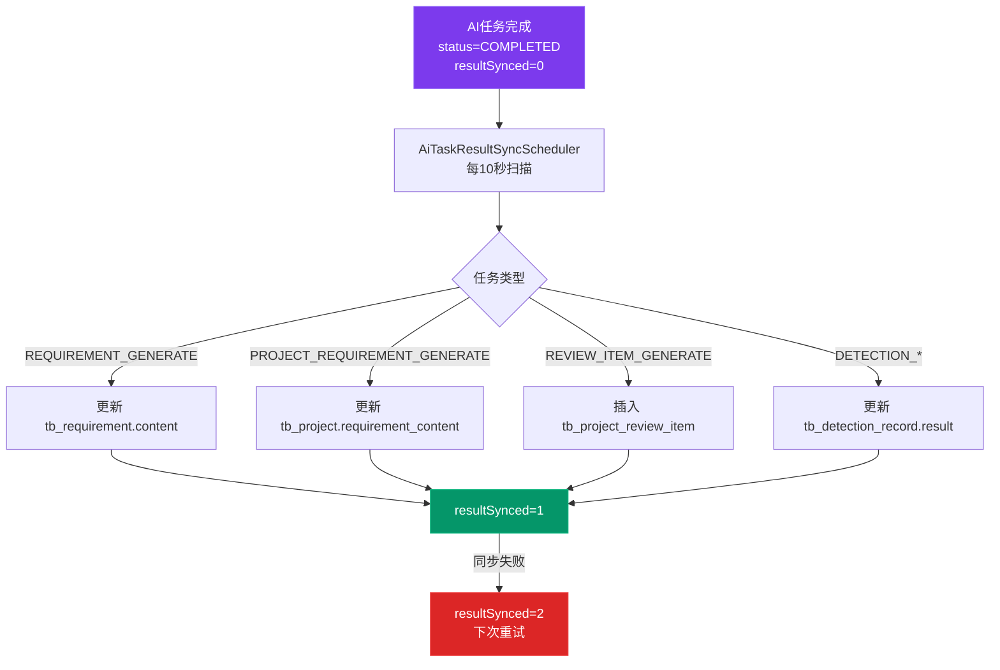

### 6.5 模型路由机制

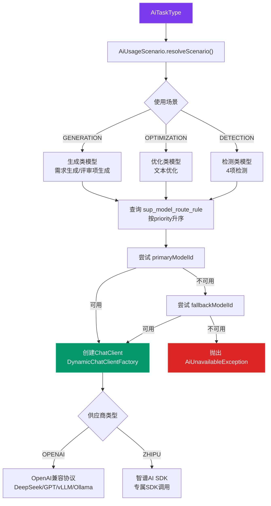

---

## 七、关键数据库表关系

```mermaid
erDiagram
    tb_requirement ||--o{ tb_project : "单向引用(requirementId)"
    tb_project ||--o{ tb_project_review_item : "包含"
    tb_project ||--o| tb_project_version : "版本快照"
    tb_project ||--o{ tb_detection_record : "检测记录"
    tb_project }o--|| sup_template : "使用模板"
    tb_project ||--o| tb_project_template : "模板快照"

    ai_task }o--|| tb_project : "属于(projectId)"
    ai_task }o--|| tb_requirement : "属于(bizId)"

    tb_detection_record }o--|{ sup_policy_file : "引用政策文件"

    tb_project_review_item ||--o{ tb_project_review_item : "父子嵌套(level 1→2→3)"

    tb_requirement {
        bigint id PK
        varchar requirement_name
        varchar status "IN_PROGRESS/COMPLETED"
        text content
        varchar match_mode
        bigint matched_file_id
        decimal matched_similarity
        text auto_save_content
        datetime auto_save_time
        int progress
        varchar project_category
        varchar project_type
        varchar service_sub_type
        decimal budget
        varchar requirement_description
        bigint uploaded_file_id
    }

    tb_project {
        bigint id PK
        varchar project_code
        varchar project_name
        varchar status
        int current_phase "1-5"
        int progress
        bigint template_id FK
        bigint requirement_id FK
        varchar requirement_source "REFERENCE/SYSTEM_GENERATE"
        text requirement_content
        bigint generated_file_id
        varchar review_type "INTELLIGENT/MANUAL"
        varchar project_category
        varchar project_type
        varchar service_sub_type
        decimal budget
        varchar project_description
        varchar tender_unit
        varchar project_location
        varchar contact_person
        varchar contact_phone
        datetime expected_publish_time
    }

    tb_project_review_item {
        bigint id PK
        bigint project_id FK
        bigint parent_id FK
        int level
        varchar review_type "COMPLIANCE/TECHNICAL/CREDIT/COMMERCIAL"
        varchar item_name
        text item_content
        decimal score
        decimal max_score
        decimal weight
        varchar subjectivity "OBJECTIVE/SUBJECTIVE"
        int is_required
    }

    ai_task {
        bigint id PK
        varchar task_type
        varchar biz_type "REQUIREMENT/PROJECT/DETECTION"
        bigint biz_id
        bigint project_id FK
        varchar status
        text request_params
        text result
        varchar error_msg
        int retry_count
        int max_retry "默认3"
        int timeout_minutes "默认10"
        int result_synced "0未同步/1已同步/2失败"
        varchar file_ids
    }

    tb_detection_record {
        bigint id PK
        bigint requirement_id "需求级检测时非空"
        bigint project_id FK
        varchar detection_type "SENSITIVE_WORD/TYPO/POLICY_REVIEW/FORMAT_CHECK"
        text content_snapshot
        text result
        varchar status
        bigint task_id FK
        varchar policy_file_ids
    }

    sup_template {
        bigint id PK
        varchar code
        text content
        text structure_definition
        boolean is_default
    }

    tb_project_template {
        bigint id PK
        bigint project_id FK
        bigint template_id FK
        varchar template_code
        varchar template_name
        text structure_definition
        int version_no
    }

    tb_project_version {
        bigint id PK
        bigint project_id FK
        int version_no
        json content_snapshot
    }
```

---

## 八、跨模块调用关系

```mermaid
flowchart LR
    subgraph 前端["前端(5173)"]
        F1[AI编制页面]
    end

    subgraph Core["Core模块(8082)"]
        C1[RequirementController]
        C2[ProjectController]
        C3[ReviewItemController]
        C4[DocumentIntegrationController]
        C5[DetectionController]
        C6[AiTaskResultSyncScheduler<br/>10s同步]
        C7[AiTaskTimeoutChecker<br/>60s超时检查]
    end

    subgraph AI["AI模块(8083)"]
        A1[AiTaskProcessor<br/>5s轮询]
        A2[AiChatController<br/>SSE]
        A3[DocumentMatchController]
        A4[DetectionEngine]
        A5[KnowledgeController]
    end

    subgraph Support["Support模块(8080)"]
        S1[认证/权限]
        S2[ModelConfig/RouteRule]
    end

    subgraph File["File模块(8081)"]
        F2[文件上传下载]
    end

    subgraph DB["数据层"]
        D1[(ai_task表<br/>任务队列)]
        D2[(MySQL)]
        D3[(Redis)]
        D4[(Milvus)]
    end

    F1 --> C1 & C2 & C3 & C4 & C5
    F1 -->|SSE直连| A2

    C1 & C2 & C3 & C5 -->|写入任务| D1
    A1 -->|CAS抢占| D1
    A1 --> A4
    C6 -->|同步结果| D1
    C7 -->|超时标记| D1

    C4 -->|文件存储| F2
    A4 -->|检测结果| D1
    A5 -->|知识库文件| F2

    C1 & C2 -->|认证校验| S1
    A1 -->|模型路由| S2

    style F1 fill:#2563eb,stroke:#3b82f6,color:#fff
    style A1 fill:#7c3aed,stroke:#8b5cf6,color:#fff
    style D1 fill:#dc2626,stroke:#ef4444,color:#fff
    style C6 fill:#059669,stroke:#10b981,color:#fff
    style C7 fill:#f59e0b,stroke:#fbbf24,color:#000
```

**调用规则**:
- Core → AI: 通过 `ai_task` 表解耦，不直接HTTP调用
- Core → File: 直接HTTP调用文件上传/下载
- Core → Support: 直接HTTP调用认证/权限校验
- AI → File: 直接HTTP调用知识库文件管理
- AI → Support: 查询模型配置和路由规则
- 前端 → AI: SSE直连（AI对话/文本优化），其他走Core转发
- Core结果同步: `AiTaskResultSyncScheduler`(10s) 将AI任务结果同步到业务表
- Core超时检查: `AiTaskTimeoutChecker`(60s) 标记超时未拉取的任务

---

## 九、完整端到端正向流程（速查表）

| # | 步骤 | 页面 | 项目状态 | 阶段/进度 | AI能力 |
|---|------|------|---------|----------|--------|
| 1 | 登录 | /login | — | — | — |
| 2 | 创建业务需求 | /requirement/create | — | — | — |
| 3 | AI生成需求内容 | /requirement/generate/:id | — | — | REQUIREMENT_GENERATE |
| 4 | 人工编辑审核 | /requirement/editor/:id | — | — | AI对话+文本优化(SSE) |
| 5 | 需求检测(2项) | /requirement/detect/:id | — | — | 敏感词+错别字 |
| 6 | 从需求创建项目 | — | DRAFT | BASIC_INFO / 20% | — |
| 7 | 基础信息+模板选择 | /project/:id/wizard?step=0 | DRAFT | BASIC_INFO / 20% | 文档匹配 |
| 8 | 推进到阶段2 | — | IN_PROGRESS | REQUIREMENT / 40% | — |
| 9 | AI生成招标需求 | /project/:id/wizard?step=1 | IN_PROGRESS | REQUIREMENT / 40% | PROJECT_REQUIREMENT_GENERATE |
| 10 | 推进到阶段3 | — | IN_PROGRESS | REVIEW_ITEM / 60% | — |
| 11 | AI生成评审项 | /project/:id/wizard?step=2 | IN_PROGRESS | REVIEW_ITEM / 60% | REVIEW_ITEM_GENERATE |
| 12 | 推进到阶段4 | — | IN_PROGRESS | DOCUMENT / 80% | — |
| 13 | 文档集成+导出 | /project/:id/wizard?step=3 | IN_PROGRESS | DOCUMENT / 80% | — |
| 14 | 推进到阶段5 | — | PENDING_DETECTION→DETECTING | DETECTION / 100% | — |
| 15 | 提交4项检测 | /project/:id/wizard?step=4 | DETECTING | DETECTION / 100% | 4项DETECTION任务 |
| 16 | 检测通过 | — | DETECTION_PASSED | DETECTION / 100% | — |
| 17 | 发布项目 | — | PUBLISHED | — | — |
| 18 | 归档项目 | — | ARCHIVED(终态) | — | — |

---

*文档版本: V1.1 | 原始编写日期: 2026-04-15 | 更新日期: 2026-04-23*
